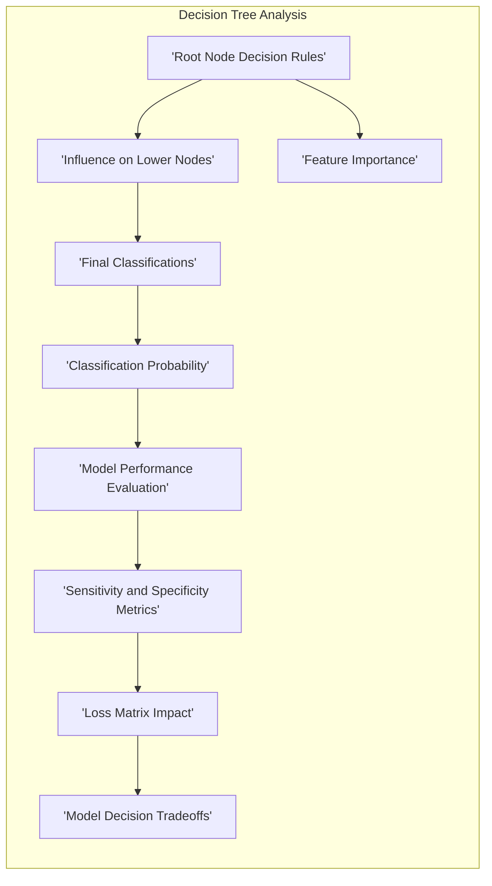
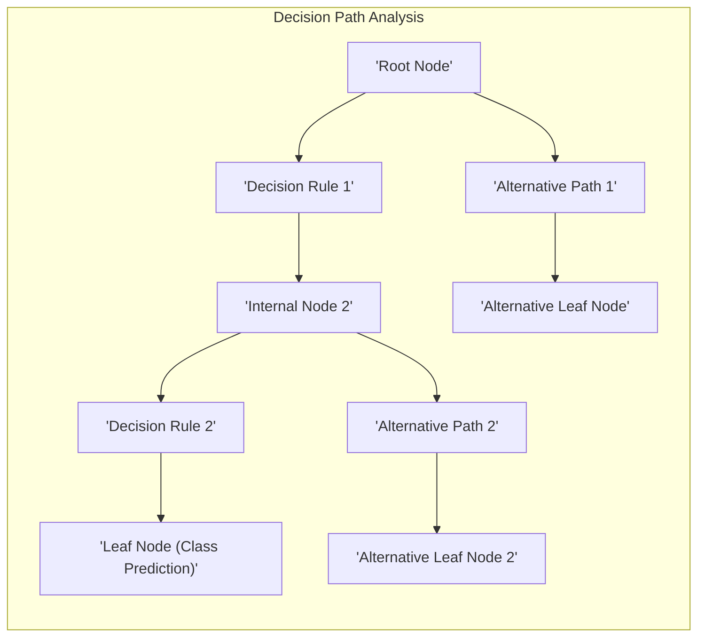
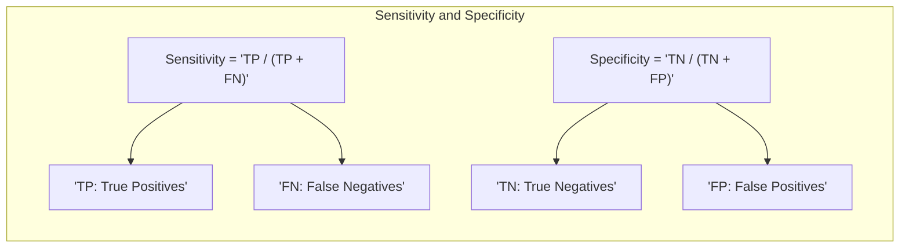
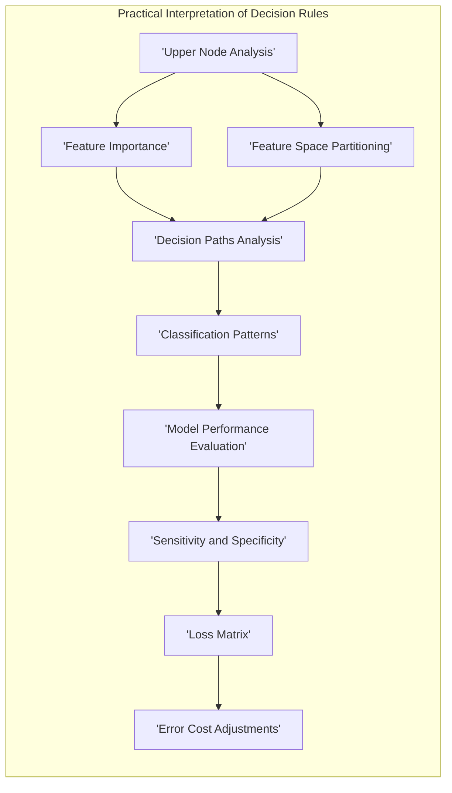
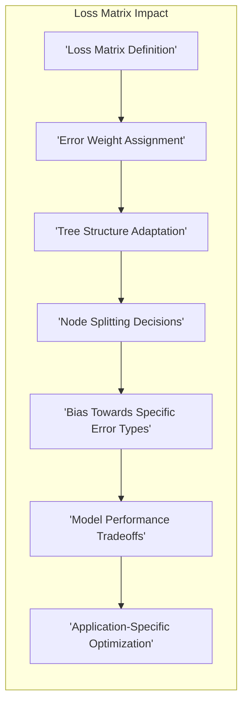
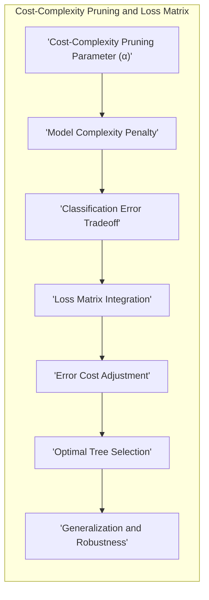
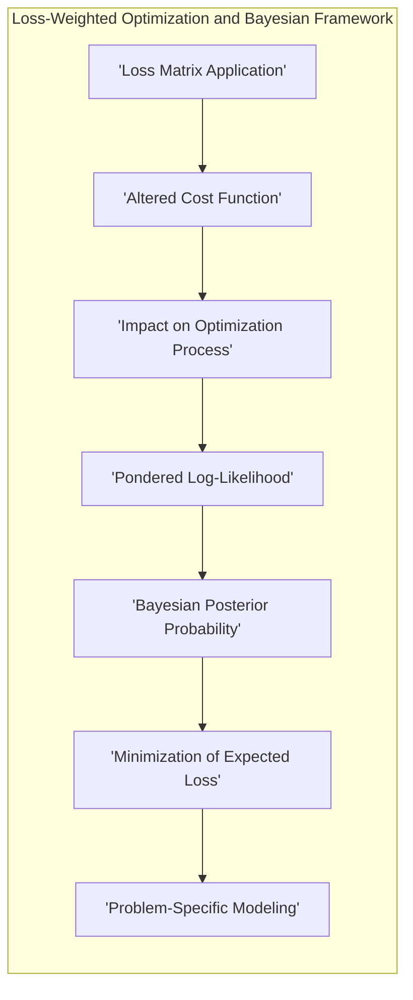

## Título: Modelos Aditivos, Árvores e Métodos Relacionados: Interpretação das Regras de Divisão e Análise de Sensibilidade e Especificidade em Árvores de Classificação

### Introdução

Este capítulo explora a interpretação prática das regras de divisão nos nós superiores de árvores de decisão e como essas regras influenciam o processo de classificação, assim como o uso das métricas de sensibilidade e especificidade para avaliar o desempenho do modelo em diferentes cenários [^9.1]. As regras de divisão nos nós superiores de uma árvore de decisão são cruciais para a compreensão do modelo, pois elas representam as decisões iniciais que influenciam as decisões nos nós inferiores da árvore e o resultado final da classificação. O capítulo detalha como os caminhos das árvores de decisão determinam as probabilidades de diferentes resultados, como a sensibilidade e especificidade são utilizadas para avaliar a capacidade do modelo de detectar verdadeiros positivos e verdadeiros negativos, e como o uso de diferentes pesos para erros, como em matrizes de perdas, afeta a estrutura da árvore e as suas propriedades de classificação. O objetivo principal é apresentar uma visão aprofundada sobre a importância das decisões no início da árvore de decisão e como diferentes métricas podem ser utilizadas para guiar a sua construção e avaliação do desempenho.

### Conceitos Fundamentais

**Conceito 1: A Importância das Regras de Divisão nos Nós Superiores da Árvore de Decisão**

As regras de divisão nos nós superiores, ou seja, mais próximos da raiz, de uma árvore de decisão são cruciais para a sua interpretabilidade, já que elas têm o maior impacto nas decisões de classificação finais. As primeiras decisões dividem o espaço de características em regiões amplas, e os preditores e os pontos de corte utilizados nessas primeiras divisões são aqueles que mais discriminam entre as diferentes classes, e também representam as decisões mais importantes do modelo. Uma análise das decisões nos nós superiores da árvore oferece uma compreensão sobre quais preditores têm maior importância na classificação, e como esses preditores dividem as observações em grupos distintos. A estrutura de árvores de decisão, com decisões binárias, é construída de forma hierárquica, onde os níveis superiores têm maior influência nos níveis inferiores.

**Lemma 1:** *As regras de divisão nos nós superiores de árvores de decisão têm o maior impacto na classificação, e a sua análise é essencial para a interpretação do modelo. As decisões nos nós superiores têm um grande impacto nas decisões nos níveis inferiores da árvore, e por isso são cruciais para a modelagem do problema.* [^4.5].

> 💡 **Exemplo Numérico:**
> Imagine uma árvore de decisão para classificar se um paciente tem ou não uma doença cardíaca. No nó raiz, a árvore pode dividir os pacientes com base na idade: se a idade for maior que 55 anos, segue-se um ramo, caso contrário, outro. Essa primeira divisão é crucial pois ela direciona a análise para grupos de pacientes com diferentes riscos. A escolha da idade como o primeiro preditor significa que a idade é o fator mais discriminante inicial para essa classificação, e as divisões subsequentes considerarão outros fatores dentro de cada um desses grupos de idade.

**Conceito 2: Caminhos na Árvore de Decisão e Probabilidade de Resultados**

Cada caminho da raiz até um nó folha em uma árvore de decisão representa um conjunto de regras de divisão. A probabilidade de uma observação ser classificada em uma dada classe no nó folha é determinada pelo caminho que essa observação segue na árvore. A sequência de divisões baseadas em preditores e pontos de corte define a classificação final. Em geral, observações que seguem caminhos similares tendem a ser classificadas na mesma classe.  A análise das divisões em cada nó permite compreender como os dados são classificados e a probabilidade de um resultado específico. A probabilidade em cada nó folha pode ser estimada como a proporção de observações em cada classe naquele nó. A árvore de decisão define a probabilidade de cada observação pertencer a uma dada classe.

**Corolário 1:** *A estrutura de árvore de decisão define um conjunto de caminhos que levam as observações até um nó folha, que representa uma classe. A probabilidade de cada resultado depende dos caminhos seguidos na árvore, e cada divisão influencia a probabilidade de um resultado específico*.  A análise dos caminhos e das decisões nas árvores de decisão permite a compreensão da lógica do classificador [^4.5.1].

> 💡 **Exemplo Numérico:**
> Considere uma árvore de decisão para classificar e-mails como spam ou não spam.
> - **Nó Raiz:** Se o e-mail contém a palavra "grátis", segue para a esquerda. Caso contrário, segue para a direita.
> - **Nó Esquerda (contém "grátis"):** Se o e-mail contém mais de 3 links, classifica como spam. Caso contrário, classifica como não spam.
> - **Nó Direita (não contém "grátis"):** Se o e-mail contém a palavra "reunião", classifica como não spam. Caso contrário, classifica como spam.
>
> Um e-mail com a palavra "grátis" e 5 links será classificado como spam seguindo o caminho da esquerda. Um e-mail com a palavra "reunião" e sem a palavra "grátis" será classificado como não spam seguindo o caminho da direita. A probabilidade de um e-mail ser classificado como spam no nó folha do ramo esquerdo pode ser calculada dividindo o número de e-mails spam naquele nó pelo número total de e-mails naquele nó.

**Conceito 3: Sensibilidade e Especificidade na Avaliação de Modelos de Classificação**

Em problemas de classificação, a sensibilidade e especificidade são métricas que avaliam o desempenho dos modelos em identificar verdadeiros positivos (sensibilidade) e verdadeiros negativos (especificidade). A sensibilidade é dada por:

$$
 \text{Sensibilidade} = \frac{\text{TP}}{\text{TP + FN}}
$$

e a especificidade por:
$$
 \text{Especificidade} = \frac{\text{TN}}{\text{TN + FP}}
$$

onde TP são os verdadeiros positivos, TN são os verdadeiros negativos, FP são os falsos positivos e FN são os falsos negativos. A sensibilidade mede a capacidade do modelo de identificar corretamente as instâncias da classe positiva, enquanto a especificidade mede a capacidade do modelo de identificar corretamente as instâncias da classe negativa. A escolha da melhor métrica depende do objetivo da modelagem, e algumas vezes um balanço entre as duas é preferível, enquanto em outros casos, uma das métricas pode ser mais importante que a outra.

> ⚠️ **Nota Importante:** A sensibilidade e especificidade são métricas importantes para avaliar o desempenho de modelos de classificação binária, especialmente em problemas onde a classificação incorreta de um tipo de erro tem um impacto diferente do outro.  A escolha da melhor métrica depende do contexto do problema [^4.5.2].

> ❗ **Ponto de Atenção:** Modelos com alta sensibilidade podem ter baixa especificidade e vice-versa. O balanço entre sensibilidade e especificidade é uma decisão importante na construção de modelos de classificação. O *trade-off* entre sensibilidade e especificidade é um aspecto central na modelagem [^4.5.1].

> ✔️ **Destaque:**  A avaliação dos modelos de classificação deve considerar métricas de desempenho como o erro de classificação, a sensibilidade e a especificidade, para que seja feita uma análise mais completa do desempenho do modelo. A interpretação das métricas permite a escolha do melhor modelo para uma dada aplicação [^4.5].

> 💡 **Exemplo Numérico:**
> Imagine um modelo para detectar uma doença rara.
> - Em 100 pacientes, 20 têm a doença (casos positivos reais).
> - O modelo corretamente identifica 15 pacientes com a doença (TP = 15).
> - O modelo erroneamente não identifica 5 pacientes com a doença (FN = 5).
> - Dos 80 pacientes sem a doença, o modelo corretamente identifica 70 (TN = 70).
> - O modelo erroneamente classifica 10 pacientes sem a doença como tendo a doença (FP = 10).
>
> $$
> \text{Sensibilidade} = \frac{15}{15 + 5} = \frac{15}{20} = 0.75
> $$
>
> $$
> \text{Especificidade} = \frac{70}{70 + 10} = \frac{70}{80} = 0.875
> $$
>
> Neste exemplo, o modelo tem uma sensibilidade de 75%, o que significa que ele detecta 75% dos pacientes com a doença, e uma especificidade de 87.5%, o que significa que ele identifica corretamente 87.5% dos pacientes sem a doença. Se o foco for detectar o máximo possível de casos da doença, a sensibilidade é mais importante. Se o foco for evitar falsos alarmes, a especificidade é mais relevante.

### Interpretação Prática das Regras de Divisão: Análise de Caminhos, Métricas de Desempenho e Matriz de Perdas

A interpretação prática das regras de divisão em árvores de decisão envolve a análise dos nós superiores e dos caminhos que levam à classificação de diferentes tipos de observações, e a sua relação com as métricas de desempenho e as matrizes de perda.

1.  **Análise dos Nós Superiores:** A análise dos nós superiores da árvore de decisão permite identificar os preditores mais importantes e como eles particionam o espaço de características. A identificação dos preditores que estão nos primeiros níveis da árvore fornece uma visão das variáveis mais discriminantes entre as classes. As regras de divisão desses nós são as decisões iniciais do modelo, e os preditores e os pontos de divisão devem ser analisados cuidadosamente, e a sua interpretação deve ser feita em relação ao contexto do problema. Por exemplo, um preditor que representa a frequência de uma palavra específica pode ser considerado um preditor importante na classificação de spam, se ele aparecer no topo da árvore.

2.  **Análise dos Caminhos na Árvore:** A análise dos caminhos da raiz até os nós folha permite compreender como uma dada observação é classificada, ou seja, qual o conjunto de regras de divisão que leva à classificação final. A análise dos caminhos da árvore é útil para identificar padrões de classificação específicos e para verificar se os caminhos são razoáveis e de acordo com o conhecimento prévio do problema. Caminhos que levam a uma alta probabilidade de classificar um email como spam, por exemplo, podem ser analisados para entender os preditores e pontos de corte utilizados no processo de decisão.

3.  **Métricas de Desempenho:** A sensibilidade e a especificidade são utilizadas para avaliar o desempenho de cada caminho e, em geral, do modelo na classificação binária. A sensibilidade mede a capacidade do modelo de detectar os casos positivos, enquanto a especificidade mede a capacidade do modelo de detectar os casos negativos.  A utilização de matrizes de perdas permite que o modelo seja ajustado para priorizar a sensibilidade ou a especificidade, dependendo do objetivo da modelagem. O balanço entre as métricas de desempenho, como o erro de classificação, a sensibilidade e a especificidade, depende dos custos associados aos diferentes tipos de erros, e da necessidade de priorizar um tipo de erro sobre outro.

4.  **Matriz de Perdas:** A utilização de uma matriz de perdas afeta a estrutura da árvore e as decisões de divisão. Se a perda associada aos falsos negativos (classificar um email spam como não spam) for maior que a perda dos falsos positivos, a árvore tenderá a gerar caminhos que priorizam a detecção de spam, mesmo que isso aumente a probabilidade de classificar emails normais como spam.   A matriz de perdas pode ser utilizada como um mecanismo para ajustar o modelo aos custos dos erros de classificação e criar modelos que são mais adequados aos diferentes cenários de classificação.  A definição das perdas também depende da aplicação do modelo, e deve ser feita levando em consideração o contexto específico do problema.

**Lemma 4:** *A interpretação dos caminhos em árvores de decisão, juntamente com a análise das métricas de desempenho e o uso de matrizes de perda, oferece uma ferramenta importante para entender e avaliar modelos de classificação, e como eles são guiados pelo tipo de problema.  A análise dos nós superiores, dos caminhos, e da capacidade de modelar os dados é fundamental para a construção de modelos úteis para a tomada de decisão*. A interpretabilidade das árvores de decisão é uma grande vantagem [^4.5.1].

> 💡 **Exemplo Numérico:**
> Suponha uma árvore de decisão para classificar transações financeiras como fraudulentas ou não fraudulentas.
>
> **Análise dos Nós Superiores:**
> O nó raiz da árvore pode dividir as transações com base no valor da transação. Se o valor for maior que R\\$ 1000, a árvore segue para a esquerda; caso contrário, para a direita. Isso sugere que o valor da transação é um fator importante na detecção de fraudes.
>
> **Análise dos Caminhos:**
> Um caminho pode ser:
>   - Valor da transação > R\\$ 1000
>   - Localização da transação = "Exterior"
>   - Método de pagamento = "Cartão de crédito"
>   - Classificação final: "Fraude"
>
> **Métricas de Desempenho:**
> Se o objetivo é detectar o máximo possível de transações fraudulentas, mesmo que isso resulte em alguns falsos positivos, a sensibilidade deve ser alta. Se o objetivo é evitar acusar transações legítimas de fraude, a especificidade deve ser alta.
>
> **Matriz de Perdas:**
> Se classificar uma transação fraudulenta como não fraudulenta (falso negativo) tem um custo muito maior do que classificar uma transação legítima como fraudulenta (falso positivo), a matriz de perdas deve refletir isso. Por exemplo, uma matriz de perdas pode ter um custo de 10 para falsos negativos e um custo de 1 para falsos positivos. A árvore de decisão, então, será construída de forma a minimizar o custo total, priorizando a redução de falsos negativos.

### A Utilização de Diferentes Pesos para Erros na Escolha dos Nódulos na Construção da Árvore

A matriz de perdas é utilizada para dar um peso diferente aos erros de classificação, e esses pesos afetam a construção da árvore.  Por exemplo, em modelos onde se busca aumentar a sensibilidade, as observações da classe positiva, ou seja, com valor 1, recebem um peso maior. A escolha dos pesos influencia a forma como a árvore de decisão é construída e a forma como as decisões são tomadas. Em nós onde o modelo tende a classificar incorretamente a classe positiva, a árvore tende a priorizar as divisões que aumentem o número de verdadeiros positivos, mesmo que isso aumente os falsos positivos.  A escolha dos pesos permite criar modelos que são mais adequados às diferentes necessidades, e com diferentes *trade-offs* entre os tipos de erros.  A utilização de matrizes de perdas em modelos de classificação é uma ferramenta para se obter modelos mais apropriados para cada problema específico.

> 💡 **Exemplo Numérico:**
> Em um problema de diagnóstico médico, classificar um paciente doente como saudável (falso negativo) pode ter consequências muito mais graves do que classificar um paciente saudável como doente (falso positivo). Uma matriz de perdas pode atribuir um peso de 10 ao erro de falso negativo e um peso de 1 ao erro de falso positivo. Ao construir a árvore de decisão, o algoritmo dará maior prioridade para as divisões que reduzem os falsos negativos, mesmo que isso signifique um aumento nos falsos positivos.

###  A Relação entre a Poda por Complexidade de Custo e o Uso de Matrizes de Perdas

A poda por complexidade de custo, juntamente com o uso de uma matriz de perdas, permite a escolha da árvore mais adequada para um determinado problema. O parâmetro de complexidade $\alpha$ define o *trade-off* entre o erro de classificação e a complexidade do modelo, e a matriz de perdas ajusta o modelo aos custos dos erros de classificação.  A utilização das duas abordagens em conjunto permite que o modelo tenha um bom desempenho em dados não vistos e que as propriedades do modelo sejam ajustadas de acordo com a necessidade do problema.  A interação entre a poda por complexidade de custo e a utilização de matrizes de perdas é um aspecto importante na construção de árvores de decisão mais robustas.

> 💡 **Exemplo Numérico:**
> Imagine que, após construir uma árvore de decisão, você percebe que ela está muito complexa, com muitos nós e pouca generalização (overfitting). A poda por complexidade de custo introduz um parâmetro $\alpha$ que penaliza a complexidade da árvore. Ao mesmo tempo, você usa uma matriz de perdas que atribui um custo maior aos falsos negativos. Ao variar $\alpha$ e usar a matriz de perdas, você pode encontrar uma árvore que seja simples o suficiente para generalizar bem e que minimize o custo total de erros, considerando a matriz de perdas.

###  Perguntas Teóricas Avançadas: Como diferentes formas de ponderar a função de custo com matrizes de perdas influenciam o processo de otimização do modelo e como essas abordagens se relacionam com o Teorema de Bayes e a função de verossimilhança?

**Resposta:**

Diferentes formas de ponderar a função de custo com matrizes de perdas influenciam significativamente o processo de otimização do modelo e sua relação com o Teorema de Bayes e a função de verossimilhança, e a escolha da ponderação deve ser feita considerando o problema específico.

Em árvores de decisão, a matriz de perdas pode ser usada para ponderar a impureza dos nós e guiar a escolha das partições. Ao calcular o custo de cada partição, a matriz de perdas é utilizada para penalizar erros que tenham um custo mais elevado. A escolha da partição, neste caso, é influenciada pela matriz de perdas, o que leva a árvores que são mais adequadas para o problema de classificação específico.

Em modelos aditivos generalizados (GAMs) e outros modelos de classificação, a matriz de perdas pode ser incorporada na função de verossimilhança de forma a priorizar a minimização dos erros com maior custo:
$$
\text{log-likelihood ponderada} = \sum_{i=1}^N  \sum_{k=1}^K  L_{y_i,k} \log(p_k(x_i))
$$

O Teorema de Bayes estabelece que a probabilidade *a posteriori* de uma observação pertencer a uma classe é dada por:
$$
P(Y=k|X=x) = \frac{P(X=x|Y=k)P(Y=k)}{P(X=x)}
$$
onde $P(Y=k|X=x)$ é a probabilidade *a posteriori*, $P(X=x|Y=k)$ é a probabilidade condicional, e $P(Y=k)$ e $P(X=x)$ são as probabilidades *a priori* da classe e dos preditores.  Modelos de classificação buscam estimar essa probabilidade para cada classe, e a matriz de perdas, através da ponderação da função de *log-likelihood*, afeta o processo de otimização.

A ponderação da função de custo com a matriz de perdas, tanto em árvores de decisão como em outros modelos, altera o objetivo da otimização. Em vez de apenas maximizar a probabilidade *a posteriori* ou minimizar o erro, o objetivo passa a ser minimizar o custo esperado da classificação.  A utilização da matriz de perdas, portanto, permite criar modelos que são mais adaptados para os problemas onde a classificação errada tem diferentes custos. A utilização de matrizes de perdas altera a interpretação das decisões, e o foco passa a ser a minimização do custo e não a minimização do erro de classificação.

**Lemma 5:** *A ponderação da função de custo com matrizes de perdas influencia a otimização dos modelos de classificação, e a forma como as decisões são tomadas. Modelos ponderados pela matriz de perdas buscam minimizar a perda esperada, que considera os diferentes custos de classificação, e esta abordagem é útil em problemas onde os erros não têm o mesmo custo*.  A ponderação da função de custo pela matriz de perdas gera modelos mais adequados para aplicações onde a classificação errada tem custos diferenciados [^4.5.2].

**Corolário 5:** *A escolha de diferentes formas de ponderar a função de custo com matrizes de perdas tem um impacto direto no resultado do modelo. Modelos que minimizam o custo esperado da classificação tendem a ser mais adequados em problemas onde a classificação errada tem custos desiguais. O uso da matriz de perdas permite que o modelo seja ajustado para um cenário específico*.  A utilização de matrizes de perdas permite que os modelos estatísticos possam ser adequados a cada problema específico, e o objetivo da modelagem [^4.4.4].

> ⚠️ **Ponto Crucial**: A utilização de matrizes de perdas altera o objetivo da otimização nos modelos de classificação, e os modelos passam a ser guiados pela minimização da perda esperada e não apenas pela minimização do erro de classificação. A escolha da forma de ponderar a função de custo com a matriz de perdas tem um impacto importante nas decisões de classificação e na capacidade de generalização do modelo [^4.4.5].

> 💡 **Exemplo Numérico:**
> Considere um modelo de classificação para detectar fraudes em transações de cartão de crédito.
>
> **Sem matriz de perdas:** O modelo busca minimizar o erro geral de classificação, tratando falsos positivos (classificar uma transação legítima como fraude) e falsos negativos (classificar uma transação fraudulenta como legítima) com o mesmo peso.
>
> **Com matriz de perdas:** Uma matriz de perdas é definida:
>   - Custo de falso positivo: 1
>   - Custo de falso negativo: 10
>
> A função de verossimilhança ponderada será ajustada para priorizar a minimização dos falsos negativos, ou seja, a detecção de fraudes reais, mesmo que isso resulte em um aumento nos falsos positivos. O processo de otimização passa a buscar um equilíbrio onde o custo esperado total seja mínimo, e a matriz de perdas guia esse processo. O Teorema de Bayes, que fornece a base para a classificação, é influenciado pela matriz de perdas através da função de verossimilhança ponderada.

### Conclusão

Este capítulo explorou a interpretação prática das regras de divisão nas árvores de decisão, destacando como a escolha das métricas de desempenho, incluindo a sensibilidade e especificidade, e também o uso de matrizes de perdas, afetam as decisões de classificação e a qualidade dos modelos. O capítulo detalhou como cada componente interage no processo de construção das árvores de decisão e como essas abordagens são importantes para a construção de modelos que sejam precisos, interpretáveis e adequados para diferentes aplicações.

### Footnotes

[^4.1]: "In this chapter we begin our discussion of some specific methods for super-vised learning. These techniques each assume a (different) structured form for the unknown regression function, and by doing so they finesse the curse of dimensionality. Of course, they pay the possible price of misspecifying the model, and so in each case there is a tradeoff that has to be made." *(Trecho de "Additive Models, Trees, and Related Methods")*

[^4.2]: "Regression models play an important role in many data analyses, providing prediction and classification rules, and data analytic tools for understand-ing the importance of different inputs." *(Trecho de "Additive Models, Trees, and Related Methods")*

[^4.3]: "In this section we describe a modular algorithm for fitting additive models and their generalizations. The building block is the scatterplot smoother for fitting nonlinear effects in a flexible way. For concreteness we use as our scatterplot smoother the cubic smoothing spline described in Chapter 5." *(Trecho de "Additive Models, Trees, and Related Methods")*

[^4.3.1]:  "The additive model has the form $Y = \alpha + \sum_{j=1}^p f_j(X_j) + \varepsilon$, where the error term $\varepsilon$ has mean zero." * (Trecho de "Additive Models, Trees, and Related Methods")*

[^4.3.2]:   "Given observations $x_i$, $y_i$, a criterion like the penalized sum of squares (5.9) of Section 5.4 can be specified for this problem, $PRSS(\alpha, f_1, f_2,\ldots, f_p) = \sum_i^N (y_i - \alpha - \sum_j^p f_j(x_{ij}))^2 + \sum_j^p \lambda_j \int(f_j''(t_j))^2 dt_j$" * (Trecho de "Additive Models, Trees, and Related Methods")*

[^4.3.3]: "where the $\lambda_j > 0$ are tuning parameters. It can be shown that the minimizer of (9.7) is an additive cubic spline model; each of the functions $f_j$ is a cubic spline in the component $X_j$, with knots at each of the unique values of $x_{ij}$, $i = 1,\ldots, N$." *(Trecho de "Additive Models, Trees, and Related Methods")*

[^4.4]: "For two-class classification, recall the logistic regression model for binary data discussed in Section 4.4. We relate the mean of the binary response $\mu(X) = Pr(Y = 1|X)$ to the predictors via a linear regression model and the logit link function:  $log(\mu(X)/(1 – \mu(X)) = \alpha + \beta_1 X_1 + \ldots + \beta_pX_p$." * (Trecho de "Additive Models, Trees, and Related Methods")*

[^4.4.1]: "The additive logistic regression model replaces each linear term by a more general functional form: $log(\mu(X)/(1 – \mu(X))) = \alpha + f_1(X_1) + \ldots + f_p(X_p)$, where again each $f_j$ is an unspecified smooth function." * (Trecho de "Additive Models, Trees, and Related Methods")*

[^4.4.2]: "While the non-parametric form for the functions $f_j$ makes the model more flexible, the additivity is retained and allows us to interpret the model in much the same way as before. The additive logistic regression model is an example of a generalized additive model." *(Trecho de "Additive Models, Trees, and Related Methods")*

[^4.4.3]: "In general, the conditional mean $\mu(X)$ of a response $Y$ is related to an additive function of the predictors via a link function $g$:  $g[\mu(X)] = \alpha + f_1(X_1) + \ldots + f_p(X_p)$." *(Trecho de "Additive Models, Trees, and Related Methods")*

[^4.4.4]:  "Examples of classical link functions are the following: $g(\mu) = \mu$ is the identity link, used for linear and additive models for Gaussian response data." *(Trecho de "Additive Models, Trees, and Related Methods")*

[^4.4.5]: "$g(\mu) = logit(\mu)$ as above, or $g(\mu) = probit(\mu)$, the probit link function, for modeling binomial probabilities. The probit function is the inverse Gaussian cumulative distribution function: $probit(\mu) = \Phi^{-1}(\mu)$." *(Trecho de "Additive Models, Trees, and Related Methods")*

[^4.5]: "All three of these arise from exponential family sampling models, which in addition include the gamma and negative-binomial distributions. These families generate the well-known class of generalized linear models, which are all extended in the same way to generalized additive models." *(Trecho de "Additive Models, Trees, and Related Methods")*

[^4.5.1]: "The functions $f_j$ are estimated in a flexible manner, using an algorithm whose basic building block is a scatterplot smoother. The estimated func-tion $f_j$ can then reveal possible nonlinearities in the effect of $X_j$. Not all of the functions $f_j$ need to be nonlinear." *(Trecho de "Additive Models, Trees, and Related Methods")*

[^4.5.2]: "We can easily mix in linear and other parametric forms with the nonlinear terms, a necessity when some of the inputs are qualitative variables (factors)." *(Trecho de "Additive Models, Trees, and Related Methods")*
