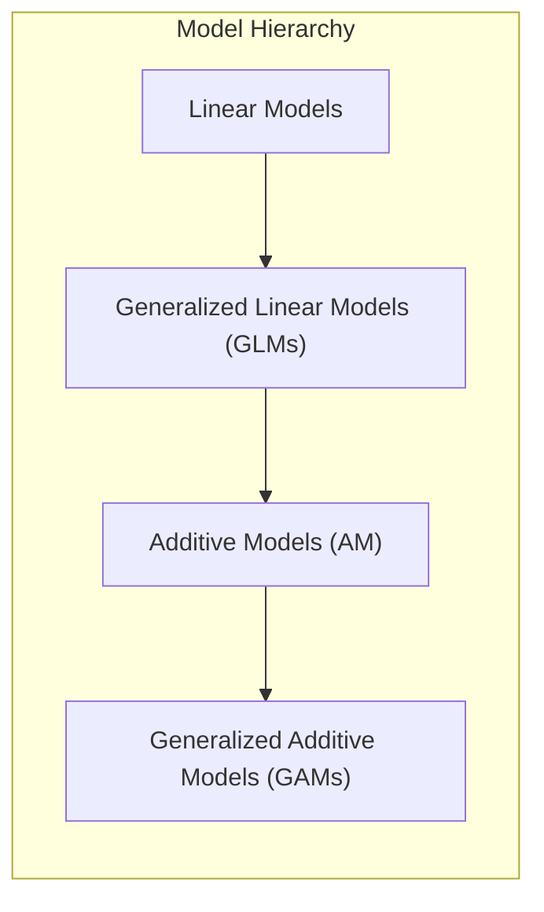
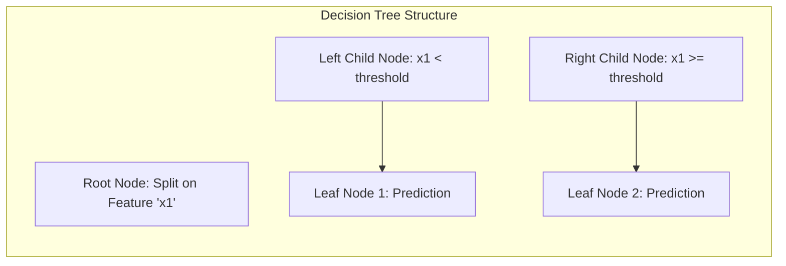
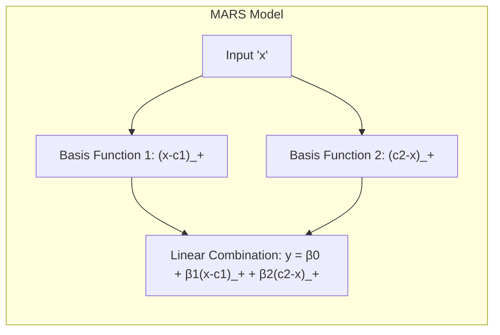
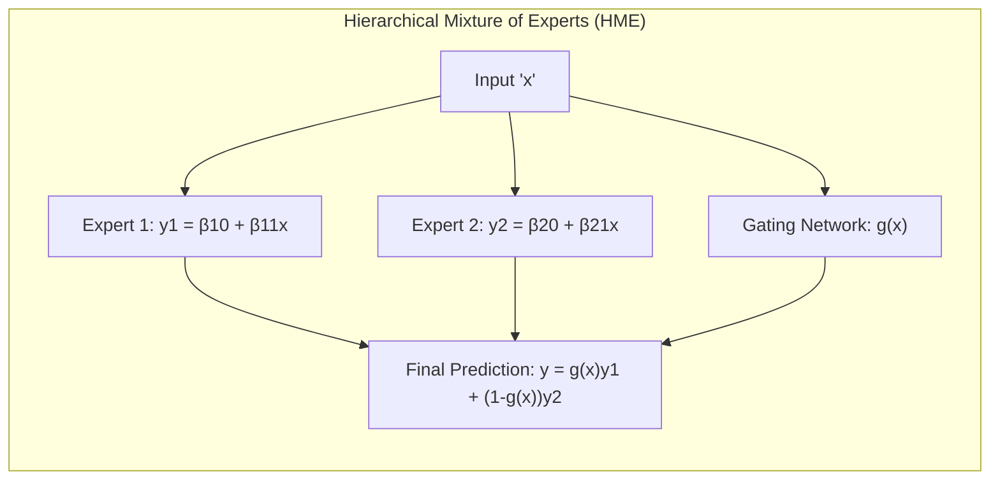
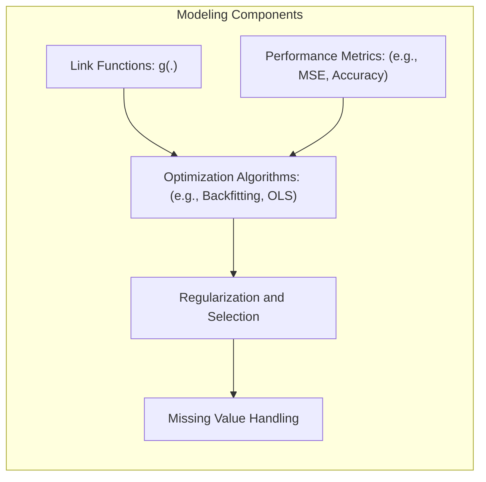
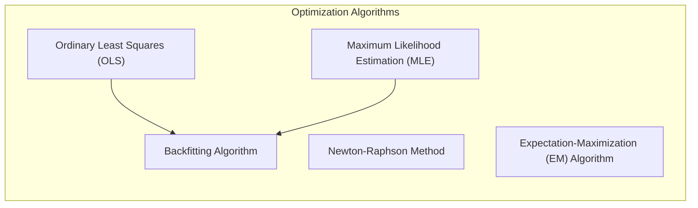
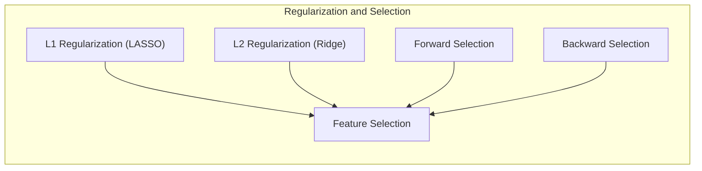
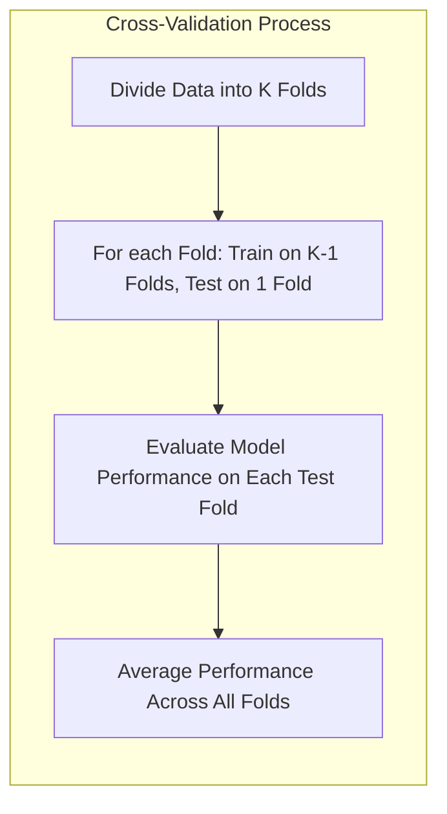
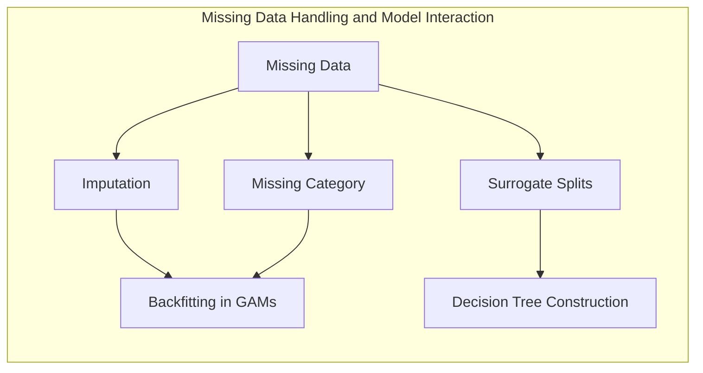

## Título: Modelos Aditivos, Árvores e Métodos Relacionados: Uma Síntese da Interpretabilidade, Flexibilidade e Aplicações



### Introdução

Este capítulo visa sintetizar os principais conceitos e abordagens discutidos nos capítulos anteriores sobre modelos aditivos, árvores de decisão e métodos relacionados, destacando as interconexões entre as diferentes técnicas, e como a escolha do modelo depende de um balanço entre interpretabilidade, flexibilidade e capacidade de generalização [^9.1]. O capítulo também recapitula como o método dos mínimos quadrados, a máxima verossimilhança e o algoritmo de *backfitting*, são usados, e como técnicas de regularização, seleção de variáveis, a utilização de métricas de impureza e matrizes de perdas, e o tratamento de dados ausentes afetam o desempenho e a aplicabilidade de cada modelo. O objetivo principal é fornecer uma visão geral e unificada sobre todos os componentes da modelagem estatística para problemas complexos, e aprofundar a compreensão da capacidade e limitações de cada método.

### Conceitos Fundamentais

**Conceito 1: Modelos Lineares, GLMs e Modelos Aditivos: Hierarquia e Generalização**

Os modelos de aprendizado supervisionado podem ser organizados em uma hierarquia de complexidade crescente. Modelos lineares são a base da modelagem estatística, onde a resposta é modelada como uma combinação linear dos preditores. Modelos lineares generalizados (GLMs) estendem os modelos lineares através da introdução de uma função de ligação, que permite modelar diferentes tipos de dados, utilizando modelos da família exponencial.  Os Modelos aditivos (AM) estendem os modelos lineares utilizando funções não paramétricas e modelos aditivos generalizados (GAMs) combinam essas funções com funções de ligação, que formam uma classe de modelos flexíveis que generalizam os modelos lineares e modelos lineares generalizados. A escolha de um modelo linear, GLM ou GAM depende da natureza dos dados, da necessidade de flexibilidade e interpretabilidade e do objetivo da modelagem. A hierarquia de modelos, portanto, oferece um leque de opções para lidar com diferentes tipos de problemas [^4.1].

> 💡 **Exemplo Numérico:**
>
> Imagine que você está modelando o preço de casas ($y$) com base em duas variáveis: tamanho em metros quadrados ($x_1$) e número de quartos ($x_2$).
>
> *   **Modelo Linear:** Um modelo linear simples poderia ser $y = \beta_0 + \beta_1 x_1 + \beta_2 x_2$.  Por exemplo, $y = 50000 + 1500 x_1 + 20000 x_2$. Isso implica que, para cada metro quadrado adicional, o preço aumenta em \\$1500, e cada quarto adicional aumenta o preço em \\$20000.
>
> *   **GLM:** Se, em vez do preço, estivéssemos modelando a probabilidade de venda da casa (uma variável binária), usaríamos uma função de ligação logística: $\log(\frac{p}{1-p}) = \beta_0 + \beta_1 x_1 + \beta_2 x_2$.  Por exemplo, $\log(\frac{p}{1-p}) = -3 + 0.01 x_1 + 0.5 x_2$. Aqui, as variáveis afetam a probabilidade de venda através da função logística.
>
> *   **GAM:** Se suspeitarmos que a relação entre tamanho e preço não é linear, poderíamos usar um GAM:  $y = \beta_0 + f_1(x_1) + f_2(x_2)$, onde $f_1$ poderia modelar uma relação não linear entre tamanho e preço (por exemplo, um efeito crescente até um certo ponto e depois estabilizando), e $f_2$ poderia modelar uma relação linear com o número de quartos. Por exemplo, $y = 50000 + 1500 x_1 - 0.001 x_1^2 + 20000 x_2$ onde temos um termo quadrático para o tamanho da casa.
>
> A escolha entre esses modelos dependeria da natureza da relação entre as variáveis e a resposta, e da necessidade de interpretabilidade.

**Lemma 1:** *Modelos lineares, GLMs e GAMs formam uma hierarquia de modelos com flexibilidade crescente, e a escolha do modelo adequado depende da complexidade do problema, do objetivo da modelagem, e do conhecimento prévio sobre as relações entre preditores e resposta. A hierarquia permite modelos mais simples ou modelos mais flexíveis, com um balanço entre interpretabilidade e capacidade de ajuste.* Modelos lineares são modelos simples que oferecem interpretabilidade e estabilidade, mas também são limitados em sua capacidade de modelar relações não lineares, enquanto GAMs oferecem uma boa opção de flexibilidade e interpretabilidade [^4.2], [^4.3.1], [^4.3.2].

**Conceito 2: Árvores de Decisão e a Modelagem de Não Linearidades**

Árvores de decisão oferecem uma abordagem para a modelagem de não linearidades através da divisão recursiva do espaço de características.  As decisões binárias, baseadas em métricas como o índice de Gini ou a entropia, particionam os dados em diferentes regiões, criando uma estrutura hierárquica que permite modelar relações complexas entre preditores e resposta. A poda da árvore é utilizada para controlar a complexidade do modelo e evitar o overfitting. As árvores de decisão oferecem uma abordagem simples, interpretável e eficiente computacionalmente para a modelagem de não linearidades, mas podem ter limitações na modelagem de relações suaves e interações complexas. As árvores de decisão são flexíveis e são uma ferramenta importante em diferentes tipos de problemas [^4.5], [^4.5.1].



> 💡 **Exemplo Numérico:**
>
> Considere um problema de classificação em que desejamos prever se um cliente irá comprar um produto com base em sua idade ($x_1$) e renda ($x_2$). Uma árvore de decisão poderia dividir os clientes da seguinte forma:
>
> 1.  **Nó raiz:** Se a idade ($x_1$) é menor que 30, vá para o nó 2; caso contrário, vá para o nó 3.
> 2.  **Nó 2:** Se a renda ($x_2$) é maior que \\$50000, classifique como "compra"; caso contrário, classifique como "não compra".
> 3.  **Nó 3:** Se a renda ($x_2$) é maior que \\$80000, classifique como "compra"; caso contrário, classifique como "não compra".
>
> ```mermaid
> graph LR
>     A[Idade < 30?] -->|Sim| B(Renda > 50000?)
>     A -->|Não| C(Renda > 80000?)
>     B -->|Sim| D[Compra]
>     B -->|Não| E[Não Compra]
>     C -->|Sim| F[Compra]
>     C -->|Não| G[Não Compra]
> ```
>
>  Neste exemplo, a árvore de decisão cria partições no espaço de características, modelando não linearidades, e a escolha das variáveis e dos valores de corte são baseados na métrica de impureza utilizada.

**Corolário 1:** *Árvores de decisão utilizam divisões binárias e métricas de impureza para modelar não linearidades, e o processo de poda permite balancear o ajuste aos dados e a capacidade de generalização. A escolha dos parâmetros de poda é um componente crucial para controlar a capacidade do modelo, e a sua aplicação é útil em problemas que apresentam não linearidades complexas e interações entre os preditores*. Modelos baseados em árvores de decisão são uma alternativa a modelos lineares, para modelar não linearidades [^4.5.2].

**Conceito 3: Multivariate Adaptive Regression Splines (MARS) e Modelos HME**

Multivariate Adaptive Regression Splines (MARS) utilizam funções *spline* lineares por partes para aproximar relações não lineares entre os preditores e a resposta. MARS utiliza uma abordagem de *forward-backward selection* para a escolha dos termos de *spline*, e combina a flexibilidade de funções não paramétricas com a interpretabilidade de modelos lineares. Misturas hierárquicas de especialistas (HME) utilizam uma combinação de modelos mais simples, ou especialistas, que são combinados através de redes de *gating*. HME permite modelar diferentes regiões do espaço de características utilizando modelos diferentes, o que aumenta a capacidade de modelar relações complexas nos dados. MARS e HME são modelos flexíveis para modelar diferentes tipos de dados, mas a sua interpretação é mais complexa que em modelos lineares, e sua estrutura e processo de otimização são mais complexos.



> 💡 **Exemplo Numérico:**
>
> Suponha que estamos modelando uma variável resposta $y$ com base em um único preditor $x$.
>
> *   **MARS:** Um modelo MARS poderia usar funções *spline* lineares por partes, por exemplo: $y = \beta_0 + \beta_1(x - c_1)_+ + \beta_2(c_2 - x)_+$. Aqui, $(x-c_1)_+$ é igual a $x-c_1$ se $x > c_1$ e 0 caso contrário, e $(c_2-x)_+$ é igual a $c_2-x$ se $x < c_2$ e 0 caso contrário. Os pontos $c_1$ e $c_2$ são nós que definem as regiões onde as funções lineares são ativas. Por exemplo, $y = 5 + 2(x-2)_+ - 3(5-x)_+$.
>
> *   **HME:** Um modelo HME poderia combinar dois modelos lineares simples com uma rede de *gating*:
>
>     *   Especialista 1: $y_1 = \beta_{10} + \beta_{11}x$
>     *   Especialista 2: $y_2 = \beta_{20} + \beta_{21}x$
>     *   Rede de *gating*: $g(x) = \frac{e^{\gamma_0 + \gamma_1 x}}{1 + e^{\gamma_0 + \gamma_1 x}}$
>     *   Modelo final: $y = g(x)y_1 + (1 - g(x))y_2$
>
>     Por exemplo, $y_1 = 1 + 0.5x$, $y_2 = 10 - 0.2x$ e $g(x) = \frac{e^{-2 + 0.8x}}{1 + e^{-2 + 0.8x}}$.  A rede de *gating* decide qual especialista contribui mais para a previsão final, dependendo do valor de $x$.
>
> Esses modelos, embora mais flexíveis, são mais difíceis de interpretar que modelos lineares ou aditivos simples.



> ⚠️ **Nota Importante:** Modelos como MARS e HME oferecem alternativas para a modelagem de não linearidades e interações mais complexas do que modelos aditivos, mas, em geral, a sua interpretação é mais difícil que modelos aditivos e árvores de decisão. A escolha do método mais adequado depende do objetivo da modelagem, e da necessidade de precisão e interpretabilidade [^4.4.4].

> ❗ **Ponto de Atenção:** Modelos mais complexos, como MARS e HME, geralmente requerem maior cuidado na escolha dos parâmetros e nos métodos de otimização, já que a sua flexibilidade pode levar ao overfitting e menor capacidade de generalização. A escolha de modelos mais complexos também implica a necessidade de maior atenção na sua interpretação [^4.4.5].

> ✔️ **Destaque:** MARS e HME representam a evolução na modelagem de dados, utilizando diferentes abordagens para modelar não linearidades e interações. A escolha do melhor modelo depende do balanceamento entre a complexidade do modelo e sua capacidade de modelagem e sua interpretabilidade [^4.3].

### Funções de Ligação, Métricas de Desempenho e o Algoritmo de Backfitting: Componentes Essenciais da Modelagem Estatística



A construção de modelos estatísticos robustos e com alta capacidade preditiva envolve a utilização de uma série de ferramentas e abordagens que estão interligadas e que foram abordadas ao longo deste documento.

1.  **Funções de Ligação:** A função de ligação ($g$) é um componente fundamental dos modelos lineares generalizados (GLMs) e modelos aditivos generalizados (GAMs), que permitem modelar a relação entre a resposta e os preditores de forma flexível, garantindo que a modelagem da resposta seja feita no espaço adequado e que as propriedades estatísticas das estimativas sejam garantidas. A escolha da função de ligação depende da distribuição da variável resposta, e a utilização de funções de ligação canônicas simplifica o processo de otimização, e permite criar modelos com melhores propriedades estatísticas [^4.4.1].

> 💡 **Exemplo Numérico:**
>
> *   **Modelo Linear (Identidade):** Se você está modelando o peso de uma pessoa ($y$) com base em sua altura ($x$), pode usar a função de ligação identidade: $g(y) = y$. O modelo seria $y = \beta_0 + \beta_1 x$. Por exemplo, $y = -100 + 0.8 x$.
>
> *   **Modelo Logístico (Logit):** Se você está modelando a probabilidade de um evento ocorrer ($p$), como a probabilidade de um cliente comprar um produto, você pode usar a função de ligação logit: $g(p) = \log(\frac{p}{1-p})$. O modelo seria $\log(\frac{p}{1-p}) = \beta_0 + \beta_1 x$, onde $x$ é um preditor. Por exemplo, $\log(\frac{p}{1-p}) = -5 + 0.1 x$.
>
> *   **Modelo de Poisson (Log):** Se você está modelando uma contagem de eventos ($y$), como o número de clientes que visitam uma loja em um dia, você pode usar a função de ligação log: $g(y) = \log(y)$. O modelo seria $\log(y) = \beta_0 + \beta_1 x$, onde $x$ é um preditor. Por exemplo, $\log(y) = 2 + 0.05 x$.
>
> A escolha da função de ligação garante que a modelagem seja feita no espaço adequado para a variável resposta.

2.  **Métricas de Desempenho:** As métricas de desempenho são utilizadas para avaliar a qualidade dos modelos e a sua capacidade de generalização. Métricas como o erro de classificação, sensibilidade e especificidade são utilizadas para avaliar a qualidade da classificação, e a escolha da métrica depende do objetivo da modelagem e do *trade-off* entre diferentes tipos de erro. A utilização de métricas de desempenho, em conjunto com métodos de validação cruzada, permite avaliar o desempenho do modelo em dados não vistos [^4.5.2].

> 💡 **Exemplo Numérico:**
>
> Imagine que temos um problema de classificação binária em que estamos tentando prever se um paciente tem uma doença (1) ou não (0). Após aplicar um modelo, temos os seguintes resultados:
>
> |        | Previsto Doente (1) | Previsto Não Doente (0) |
> |--------|--------------------|-----------------------|
> | Real Doente (1)    | 80                 | 20                    |
> | Real Não Doente (0) | 10                 | 90                    |
>
> *   **Erro de Classificação:** $\frac{20 + 10}{80 + 20 + 10 + 90} = \frac{30}{200} = 0.15$ ou 15%.
> *   **Sensibilidade (Recall):** $\frac{80}{80 + 20} = \frac{80}{100} = 0.8$ ou 80%.
> *   **Especificidade:** $\frac{90}{10 + 90} = \frac{90}{100} = 0.9$ ou 90%.
>
> A escolha da métrica depende do problema. Se for importante detectar todos os doentes (minimizar falsos negativos), a sensibilidade é mais importante. Se for importante minimizar falsos positivos, a especificidade é mais importante.

3.  **Algoritmos de Otimização:**  Algoritmos de otimização, como o método dos mínimos quadrados (OLS), a máxima verossimilhança (MLE) e o algoritmo de backfitting, são utilizados para estimar os parâmetros dos modelos. O método dos mínimos quadrados é utilizado para modelos lineares e para dados com distribuição gaussiana, enquanto a máxima verossimilhança é utilizada para dados que pertencem à família exponencial. O algoritmo de backfitting é utilizado para estimar modelos aditivos e modelos aditivos generalizados, e é combinado com métodos de suavização e regularização para lidar com a complexidade dos modelos. O método de Newton-Raphson e o algoritmo EM também são utilizados para otimização em modelos mais complexos [^4.3], [^4.4.2], [^4.4.3].



> 💡 **Exemplo Numérico:**
>
> *   **Mínimos Quadrados (OLS):** Para um modelo linear $y = \beta_0 + \beta_1 x$, o OLS encontra os valores de $\beta_0$ e $\beta_1$ que minimizam a soma dos quadrados dos erros: $\sum_{i=1}^n(y_i - (\beta_0 + \beta_1 x_i))^2$. Suponha que temos os seguintes dados:
>
>     | $x$ | $y$ |
>     |-----|-----|
>     | 1   | 2   |
>     | 2   | 4   |
>     | 3   | 5   |
>
>     Podemos calcular as estimativas usando as fórmulas do OLS:
>
>     $\bar{x} = 2$ , $\bar{y} = 3.67$
>
>     $\beta_1 = \frac{\sum_{i=1}^n (x_i - \bar{x})(y_i - \bar{y})}{\sum_{i=1}^n (x_i - \bar{x})^2} = \frac{(1-2)(2-3.67) + (2-2)(4-3.67) + (3-2)(5-3.67)}{(1-2)^2 + (2-2)^2 + (3-2)^2} = \frac{1.67 + 0 + 1.33}{1+0+1} = \frac{3}{2} = 1.5$
>
>     $\beta_0 = \bar{y} - \beta_1\bar{x} = 3.67 - 1.5 \times 2 = 3.67 - 3 = 0.67$
>
>     O modelo ajustado é $y = 0.67 + 1.5x$.
>
> *   **Backfitting:** Em um modelo aditivo $y = \alpha + f_1(x_1) + f_2(x_2)$, o algoritmo de backfitting atualiza iterativamente cada função $f_j$ enquanto mantém as outras fixas, até a convergência.
>
>     Inicialmente, podemos definir $f_1$ e $f_2$ como funções nulas. Em cada iteração, atualizamos $f_1$ ajustando um modelo suave de $y - \alpha - f_2(x_2)$ em relação a $x_1$, e atualizamos $f_2$ ajustando um modelo suave de $y - \alpha - f_1(x_1)$ em relação a $x_2$. O processo continua até que as funções $f_1$ e $f_2$ não mudem significativamente.
>
>     Por exemplo, se $y = 5 + f_1(x_1) + f_2(x_2)$, onde $f_1$ e $f_2$ são funções não lineares, o backfitting iterativamente ajusta essas funções.

4.  **Regularização e Seleção de Variáveis:** Métodos de regularização, como L1 (LASSO) e L2 (Ridge) são utilizados para controlar a complexidade dos modelos e para evitar o *overfitting*. A seleção de variáveis, seja por meio de penalidades como L1, seja por meio de algoritmos *forward* ou *backward*, é utilizada para identificar os preditores mais relevantes. A utilização desses métodos permite que modelos com maior capacidade de generalização sejam construídos e a escolha do método de regularização ou seleção de variáveis depende da estrutura do modelo e dos dados [^4.5.1], [^4.5.2].



> 💡 **Exemplo Numérico:**
>
> *   **Regularização L1 (LASSO):** Em um modelo linear $y = \beta_0 + \beta_1 x_1 + \beta_2 x_2 + \beta_3 x_3$, o LASSO adiciona uma penalidade à soma dos quadrados dos erros: $\sum_{i=1}^n(y_i - (\beta_0 + \beta_1 x_{i1} + \beta_2 x_{i2} + \beta_3 x_{i3}))^2 + \lambda(|\beta_1| + |\beta_2| + |\beta_3|)$. O parâmetro $\lambda$ controla a força da regularização. Se $\lambda$ for grande, alguns coeficientes $\beta$ podem ser zerados, selecionando as variáveis mais importantes.
>
>     Por exemplo, se $\lambda=1$, o LASSO pode reduzir $\beta_3$ a zero, indicando que a variável $x_3$ não é relevante para prever $y$.
>
> *   **Regularização L2 (Ridge):** Similarmente, o Ridge adiciona uma penalidade L2: $\sum_{i=1}^n(y_i - (\beta_0 + \beta_1 x_{i1} + \beta_2 x_{i2} + \beta_3 x_{i3}))^2 + \lambda(\beta_1^2 + \beta_2^2 + \beta_3^2)$. O Ridge não zera os coeficientes, mas os reduz, evitando *overfitting*.
>
>     Por exemplo, com $\lambda=0.5$, o Ridge pode reduzir os valores de $\beta_1$, $\beta_2$ e $\beta_3$, evitando que o modelo se ajuste muito aos dados de treinamento.

5.  **Tratamento de Valores Ausentes:** O tratamento de valores ausentes é um componente importante na modelagem de dados reais. A imputação dos valores ausentes, a criação de uma categoria "ausente" e o uso de *surrogate splits* em árvores de decisão são algumas abordagens para lidar com esse problema e evitar a perda de informações importantes, e a escolha do método mais adequado depende do tipo de dados e do modelo utilizado [^9.6].

> 💡 **Exemplo Numérico:**
>
> Suponha que temos dados sobre clientes, incluindo idade e renda, e alguns valores de renda estão faltando.
>
> *   **Imputação:** Poderíamos preencher os valores ausentes de renda com a média das rendas observadas. Se a média da renda observada é \\$60000, todos os valores ausentes de renda seriam preenchidos com esse valor.
>
> *   **Categoria "Ausente":** Poderíamos criar uma nova categoria "ausente" para a variável renda, de modo que o modelo possa aprender um efeito específico para os clientes com renda ausente.
>
> *   ***Surrogate Splits*:** Em uma árvore de decisão, se a divisão principal for na variável renda, e um cliente tiver renda ausente, a árvore usará outro preditor (por exemplo, idade) que leva a uma divisão semelhante para decidir em qual ramo o cliente deve ir.

A combinação de todas essas ferramentas e abordagens, utilizando os conceitos de modelos lineares, modelos da família exponencial, modelos aditivos e árvores de decisão, cria uma base sólida para a modelagem de dados complexos, com flexibilidade, interpretabilidade e capacidade de generalização.

### A Importância da Validação Cruzada na Escolha de Modelos

A validação cruzada é uma técnica fundamental para a escolha de modelos que maximizem a sua capacidade de generalização.  A validação cruzada estima o desempenho dos modelos em dados não vistos, e permite avaliar o efeito de diferentes abordagens, diferentes parâmetros, e diferentes funções de suavização.  A utilização da validação cruzada é uma abordagem para lidar com o *trade-off* entre bias e variância e para evitar o overfitting. Modelos com melhor desempenho na validação cruzada, em geral, também tendem a apresentar uma melhor capacidade de generalização.



> 💡 **Exemplo Numérico:**
>
> Imagine que temos um conjunto de dados com 100 observações, e desejamos comparar um modelo linear e um modelo aditivo.
>
> 1.  **K-fold Cross-Validation:** Dividimos os dados em 5 partes (folds).
> 2.  **Treinamento e Teste:** Para cada fold, treinamos o modelo com os outros 4 folds e avaliamos seu desempenho (por exemplo, usando o erro quadrático médio, MSE) no fold deixado de fora.
> 3.  **Cálculo do MSE Médio:** Calculamos o MSE médio sobre os 5 folds.
>
> | Fold | Modelo Linear MSE | Modelo Aditivo MSE |
> |------|-------------------|-------------------|
> | 1    | 0.85              | 0.62              |
> | 2    | 0.92              | 0.70              |
> | 3    | 0.78              | 0.58              |
> | 4    | 0.88              | 0.65              |
> | 5    | 0.95              | 0.72              |
> | **Média** | **0.88**     | **0.65**       |
>
> Neste exemplo, o modelo aditivo tem um MSE médio menor na validação cruzada, sugerindo que ele se generaliza melhor para dados não vistos.

###  A Interpretabilidade como Componente Essencial na Modelagem

A interpretabilidade é um componente essencial na modelagem estatística. Modelos simples como a regressão linear são fáceis de interpretar e permitem compreender a influência de cada preditor na resposta. No entanto, a modelagem de relações complexas exige modelos mais sofisticados que podem apresentar uma maior dificuldade de interpretação. A escolha do modelo, portanto, deve considerar o *trade-off* entre interpretabilidade e precisão, e a utilização de técnicas para facilitar a interpretação de modelos complexos também deve ser utilizada. A escolha de modelos que sejam capazes de fornecer *insights* sobre os dados é um componente importante da modelagem estatística.

### Perguntas Teóricas Avançadas: Como diferentes abordagens para modelar e tratar valores ausentes (imputação, criação de categorias, *surrogate splits*) interagem com o algoritmo de backfitting em modelos GAMs, e com a construção da árvore de decisão, e qual o impacto na convergência e na capacidade de generalização?

**Resposta:**

As diferentes abordagens para modelar e tratar valores ausentes (imputação, criação de categorias, *surrogate splits*) interagem de maneira complexa com o algoritmo de backfitting em modelos GAMs e com a construção de árvores de decisão, afetando a convergência, estabilidade e a capacidade de generalização dos modelos, sendo importante a sua avaliação.

Em modelos GAMs, a imputação, ao preencher os valores ausentes utilizando a média, mediana, ou outros valores estimados, introduz informações nos dados que podem levar a modelos com *bias* e também a um aumento da complexidade do modelo.  A criação de uma categoria "ausente" pode ser utilizada para preditores categóricos, o que permite a modelagem da influência da ausência de informação na resposta, e o modelo ajusta a função para cada categoria, incluindo a categoria "ausente". Em geral, no algoritmo de backfitting, a imputação e o uso de uma categoria "ausente" são abordagens menos complexas, mas que podem levar a estimadores com *bias* e instabilidade. A utilização de técnicas mais avançadas de imputação, como a imputação múltipla, também podem ser utilizadas em modelos GAMs para quantificar a incerteza associada aos dados ausentes.

Árvores de decisão utilizam a estratégia de *surrogate splits*, o que permite que o modelo lide com valores ausentes sem a necessidade de imputação. Em cada divisão, a árvore busca outros preditores que possam levar a partições similares, e a utilização dos *surrogate splits* permite que as decisões sejam tomadas mesmo quando o preditor original tem o valor ausente. O uso de *surrogate splits* altera a forma como os preditores são utilizados e a sua escolha afeta a estrutura da árvore e a sua capacidade de generalização. O uso de *surrogate splits* é uma forma de lidar com a falta de informação sem a necessidade de imputação, e sem gerar variáveis artificiais.

O uso dessas abordagens, tanto em GAMs quanto em árvores de decisão, afeta o desempenho e a capacidade de generalização. Modelos mais flexíveis, como GAMs e árvores mais profundas, são mais sensíveis à escolha de como tratar os valores ausentes. A escolha do modelo e da abordagem para lidar com os dados ausentes deve levar em consideração a natureza dos dados, a complexidade do modelo, e o objetivo da modelagem. Modelos menos complexos, embora mais simples, podem ser menos afetados por dados faltantes.

> 💡 **Exemplo Numérico:**
>
> Vamos considerar um modelo GAM com dois preditores, $x_1$ e $x_2$, onde alguns valores de $x_2$ estão ausentes.
>
> *   **Imputação em GAM:** Se usarmos a imputação pela média, o algoritmo de backfitting usará os valores imputados de $x_2$ para ajustar as funções $f_1$ e $f_2$. Se a imputação for inadequada, a convergência do backfitting pode ser mais lenta e o modelo final pode ter *bias*.
>
> *   **Categoria Ausente em GAM:** Se criarmos uma categoria "ausente" para $x_2$, o algoritmo de backfitting ajustará uma função diferente para essa categoria, o que pode melhorar o ajuste se a ausência de $x_2$ tiver um efeito específico na resposta.
>
> *   ***Surrogate Splits* em Árvores:** Em uma árvore de decisão, a presença de valores ausentes em $x_2$ não interrompe o processo de divisão, pois a árvore pode usar $x_1$ ou outro preditor como um *surrogate split*. A escolha do *surrogate split* pode afetar a estrutura da árvore e a capacidade de generalização.
>
> A escolha entre essas abordagens e o seu impacto na convergência e capacidade de generalização dependem da natureza dos dados e do modelo.

**Lemma 5:** *A interação entre o tratamento de valores ausentes (imputação, categorias ausentes, *surrogate splits*), o algoritmo de backfitting em GAMs, e a construção de árvores de decisão, influencia as propriedades dos estimadores e a capacidade de generalização dos modelos. A escolha da abordagem para lidar com dados ausentes deve considerar a natureza do modelo, as suas limitações e a complexidade dos dados, e buscar um bom balanço entre *bias* e variância*. A escolha dos modelos e das abordagens para valores ausentes deve considerar a necessidade de modelos robustos e com boa capacidade de generalização [^9.6].



**Corolário 5:** *A escolha da melhor abordagem para dados ausentes envolve a avaliação do *