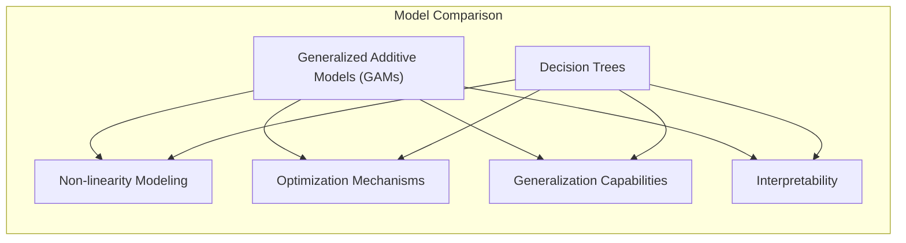
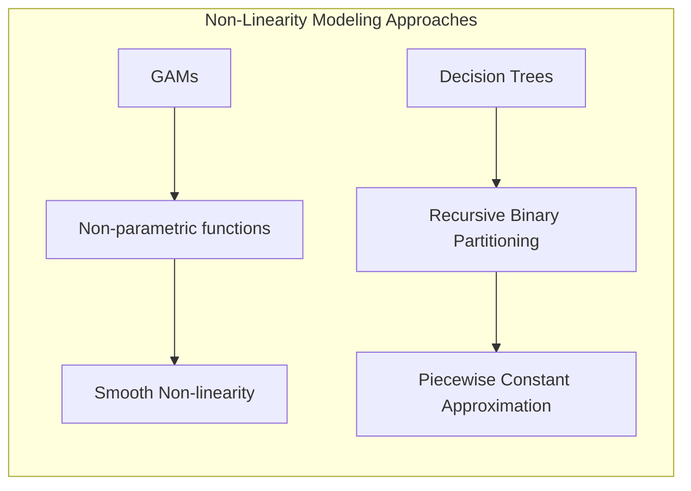
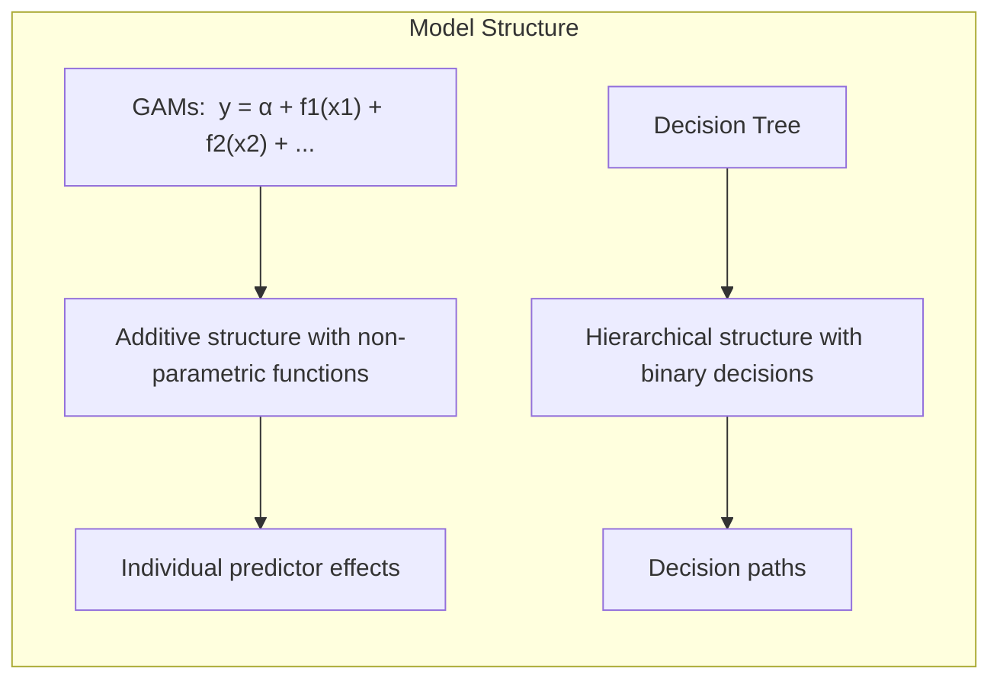
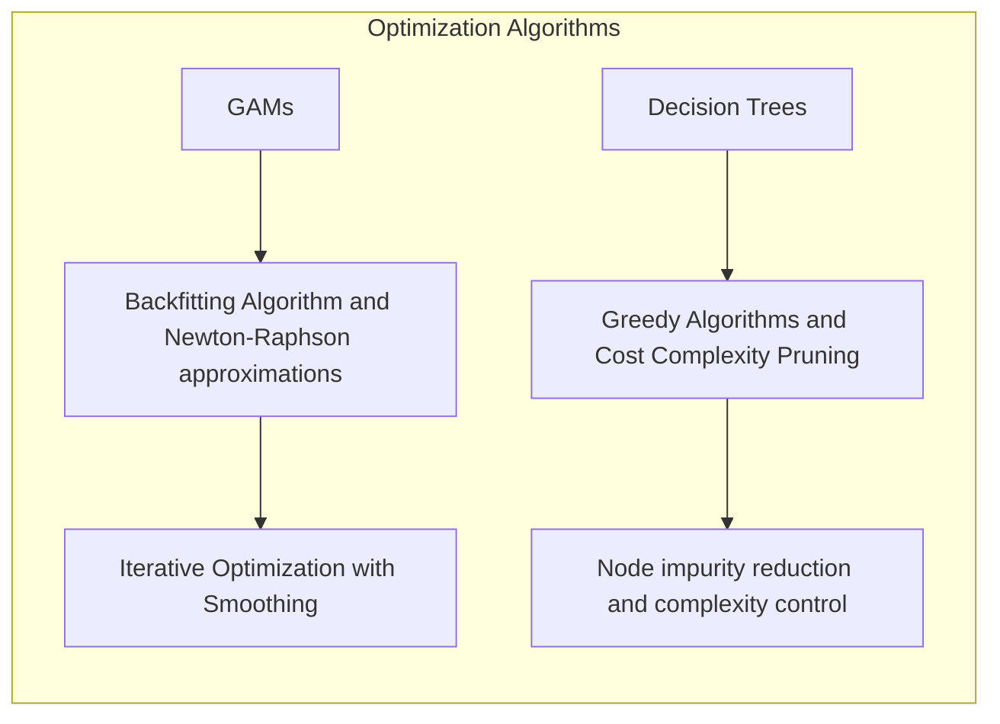
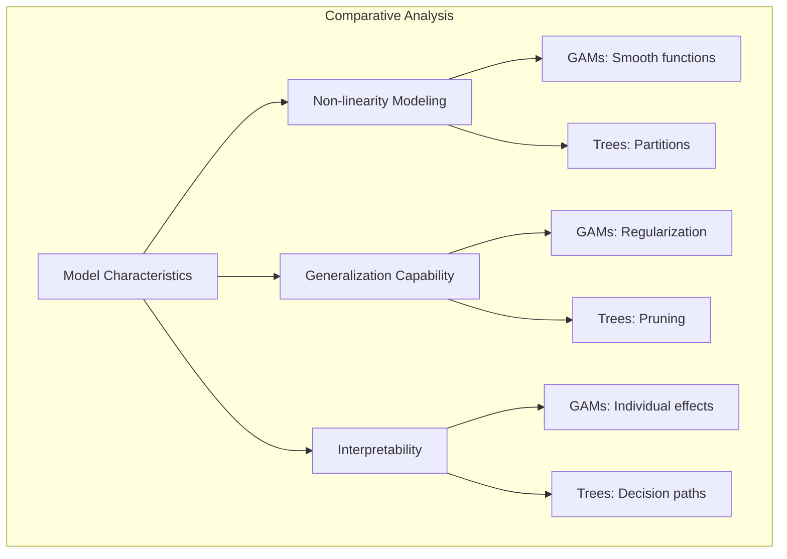
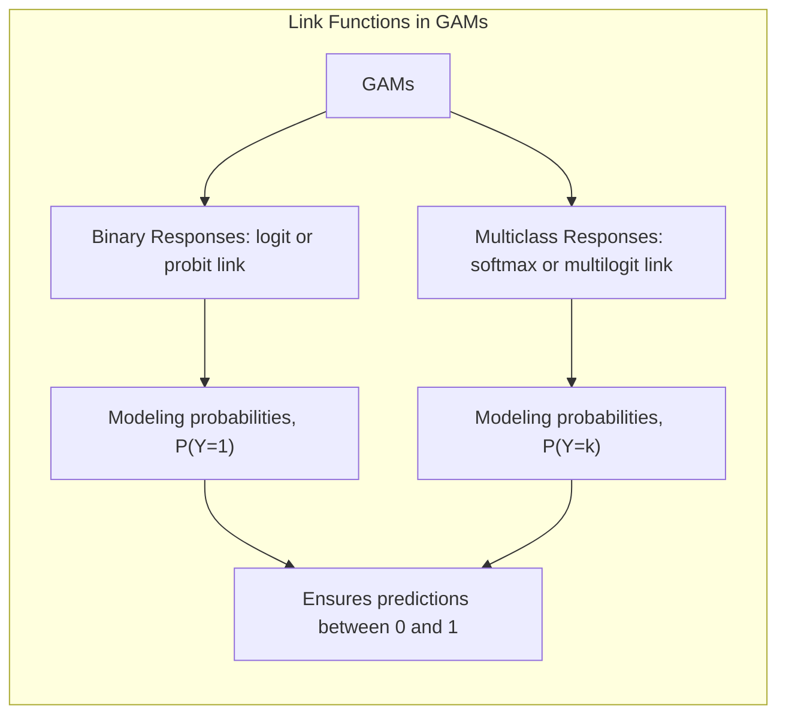
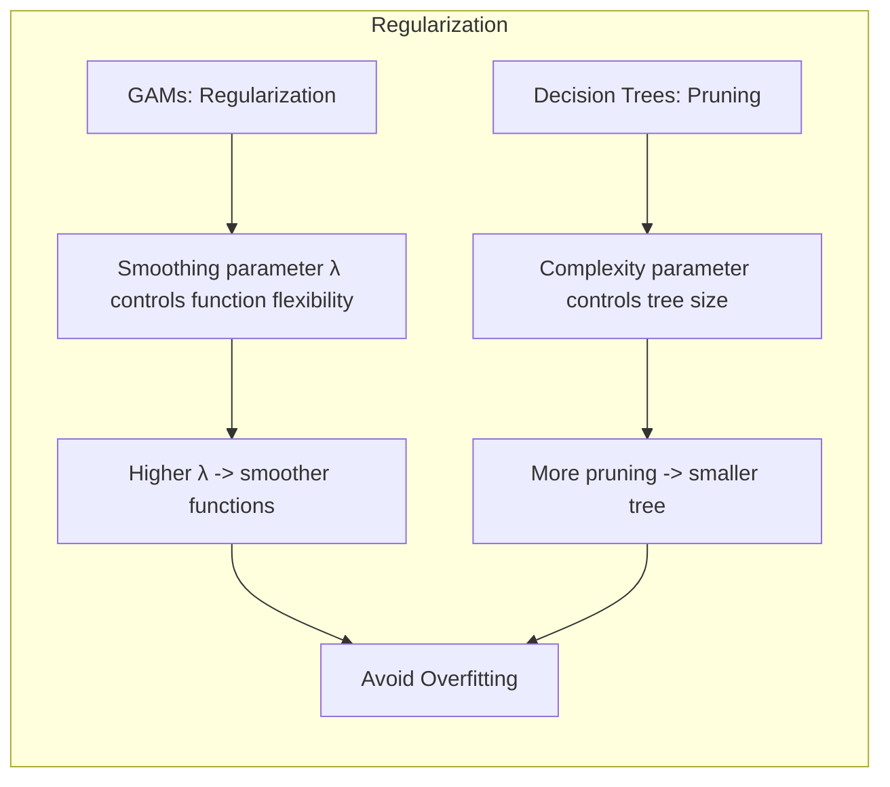
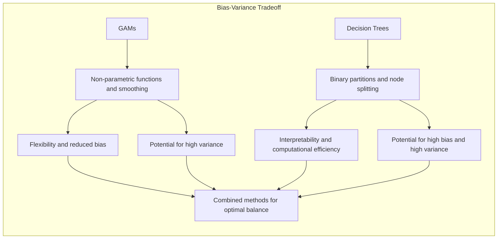

```markdown
## Título: Modelos Aditivos, Árvores e Métodos Relacionados: Contrastando GAMs com Árvores de Decisão - Abordagens, Limitações e Vantagens



### Introdução

Este capítulo explora as diferenças fundamentais entre Modelos Aditivos Generalizados (GAMs) e árvores de decisão, duas abordagens populares para problemas de aprendizado supervisionado, particularmente em situações que exigem a modelagem de não linearidades [^9.1]. Embora ambos os métodos permitam modelar relações complexas entre preditores e respostas, eles diferem significativamente em sua estrutura, abordagem de modelagem, mecanismos de otimização e, como consequência, em suas capacidades e limitações, e o objetivo deste capítulo é realizar uma comparação detalhada entre as duas abordagens. O capítulo aborda como GAMs e árvores de decisão modelam a não linearidade, como eles abordam problemas de alta dimensionalidade, como cada modelo é interpretado, e como as escolhas de implementação e parâmetros afetam a sua capacidade de generalização. O objetivo principal é apresentar uma comparação aprofundada entre as duas abordagens, com base na teoria estatística, na modelagem da não linearidade e nas aplicações em dados reais.

### Conceitos Fundamentais

**Conceito 1: Abordagem de Modelagem da Não Linearidade**

A principal diferença entre GAMs e árvores de decisão reside na forma como a não linearidade é modelada. Os Modelos Aditivos Generalizados (GAMs) utilizam funções não paramétricas para modelar a relação entre cada preditor e a resposta, de forma que o modelo global seja uma soma dessas funções. A modelagem da não linearidade é suave, e é feita através da escolha dos suavizadores e do parâmetro de regularização. As árvores de decisão, por outro lado, modelam a não linearidade através da divisão do espaço de características em regiões, criando decisões binárias sucessivas e uma estrutura hierárquica. A não linearidade em árvores de decisão é introduzida através da forma como o modelo particiona o espaço dos dados, e cada partição é modelada separadamente. A escolha do método de modelagem depende das características dos dados, e dos padrões de não linearidade.

**Lemma 1:** *GAMs utilizam funções não paramétricas para modelar a não linearidade de forma suave e aditiva, enquanto árvores de decisão particionam o espaço de características de forma recursiva, com divisões binárias que separam as observações em diferentes regiões. A forma como a não linearidade é modelada é diferente em cada abordagem e afeta a sua capacidade de aproximação de diferentes tipos de padrões*. A escolha da modelagem da não linearidade é um componente importante na construção dos modelos [^4.3.1].

> 💡 **Exemplo Numérico:**
>
> Considere um conjunto de dados com uma variável resposta `y` e duas variáveis preditoras `x1` e `x2`. Vamos supor que a relação entre `y` e `x1` seja uma função quadrática e a relação entre `y` e `x2` seja uma função logarítmica.
>
> **GAM:** Um GAM modelaria isso como `y = f1(x1) + f2(x2)`, onde `f1(x1)` seria uma função quadrática (aproximada por um spline) e `f2(x2)` uma função logarítmica (também aproximada por um spline).
>
> ```python
> import numpy as np
> import pandas as pd
> from pygam import LinearGAM, s
> import matplotlib.pyplot as plt
>
> # Gerando dados sintéticos
> np.random.seed(0)
> x1 = np.linspace(-5, 5, 100)
> x2 = np.linspace(0.1, 5, 100)
> y = 2*x1**2 + 5*np.log(x2) + np.random.normal(0, 5, 100)
>
> X = pd.DataFrame({'x1': x1, 'x2': x2})
>
> # Ajustando um GAM
> gam = LinearGAM(s(0) + s(1)).fit(X, y)
>
> # Plotando as funções parciais
> plt.figure(figsize=(10, 5))
> plt.subplot(1, 2, 1)
> XX = gam.generate_X_grid(term=0)
> plt.plot(XX[:, 0], gam.partial_dependence(term=0, X=XX))
> plt.plot(XX[:, 0], gam.partial_dependence(term=0, X=XX, with_error=True)[1], ls='--')
> plt.title('Função Parcial para x1')
>
> plt.subplot(1, 2, 2)
> XX = gam.generate_X_grid(term=1)
> plt.plot(XX[:, 1], gam.partial_dependence(term=1, X=XX))
> plt.plot(XX[:, 1], gam.partial_dependence(term=1, X=XX, with_error=True)[1], ls='--')
> plt.title('Função Parcial para x2')
>
> plt.tight_layout()
> plt.show()
> ```
>
> **Árvore de Decisão:** Uma árvore de decisão dividiria o espaço de `x1` e `x2` em regiões. Por exemplo, um nó poderia dividir com base em `x1 < 0`, outro em `x2 < 2`, e assim por diante. Cada região teria uma predição diferente, resultando em uma aproximação por degraus da função verdadeira.
>
> ```python
> from sklearn.tree import DecisionTreeRegressor
>
> # Ajustando uma árvore de decisão
> tree = DecisionTreeRegressor(max_depth=3)
> tree.fit(X, y)
>
> # Criando uma grade para predições
> x1_grid = np.linspace(-5, 5, 50)
> x2_grid = np.linspace(0.1, 5, 50)
> X1_grid, X2_grid = np.meshgrid(x1_grid, x2_grid)
> X_grid = np.c_[X1_grid.ravel(), X2_grid.ravel()]
> y_pred = tree.predict(X_grid).reshape(X1_grid.shape)
>
> # Plotando as predições
> plt.figure(figsize=(8,6))
> plt.contourf(X1_grid, X2_grid, y_pred, cmap='viridis')
> plt.colorbar(label='Predição')
> plt.xlabel('x1')
> plt.ylabel('x2')
> plt.title('Predições da Árvore de Decisão')
> plt.show()
> ```
>
> No GAM, as funções `f1` e `f2` modelam a relação de forma suave, enquanto a árvore de decisão cria regiões com predições constantes.



**Conceito 2: Estrutura do Modelo e Interpretabilidade**

A estrutura do modelo é outra diferença fundamental entre GAMs e árvores de decisão. GAMs utilizam uma estrutura aditiva, onde a resposta é modelada como uma soma de funções não paramétricas, o que permite avaliar o efeito de cada preditor individualmente. As árvores de decisão, por outro lado, utilizam uma estrutura hierárquica, que permite uma interpretação através de um caminho de decisões, o que leva a diferentes regiões do espaço de características. A interpretação dos resultados é feita de forma diferente, onde em GAMs se analisa o efeito de cada preditor através de funções não paramétricas, e em árvores se analisa o caminho que a observação percorre na árvore. A interpretabilidade de ambos os métodos depende da sua estrutura e da forma como os preditores são utilizados.

**Corolário 1:** *GAMs e árvores de decisão oferecem diferentes tipos de interpretabilidade. GAMs permitem avaliar o efeito de cada preditor individualmente, enquanto árvores de decisão permitem entender como as decisões são tomadas. A escolha do modelo também depende da necessidade de interpretabilidade e da forma como os resultados são apresentados*. A forma como o modelo é estruturado afeta a sua capacidade de interpretação [^4.5].

> 💡 **Exemplo Numérico:**
>
> Usando o mesmo exemplo anterior, no GAM, podemos analisar o gráfico de `f1(x1)` para entender como `x1` afeta `y` e o gráfico de `f2(x2)` para entender como `x2` afeta `y`. A interpretação é direta, cada preditor tem seu efeito visualizado separadamente.
>
> Em uma árvore de decisão, a interpretação envolve seguir o caminho da raiz até as folhas. Por exemplo:
>
> ```mermaid
> graph LR
>     A[x1 < 0] -->|Yes| B[x2 < 2]
>     A -->|No| C[x1 < 3]
>     B -->|Yes| D[Predição = 10]
>     B -->|No| E[Predição = 15]
>     C -->|Yes| F[Predição = 20]
>     C -->|No| G[Predição = 25]
> ```
>
> Para uma observação com `x1 = -2` e `x2 = 1`, seguiríamos o caminho `A -> B -> D`, e a predição seria 10.  A árvore mostra claramente como as decisões são tomadas com base nos valores de `x1` e `x2`.



**Conceito 3: Otimização e Algoritmos de Estimação**

GAMs utilizam algoritmos de otimização baseados em backfitting e aproximações do método de Newton-Raphson para estimar os parâmetros do modelo. O algoritmo de backfitting estima as funções não paramétricas de forma iterativa, utilizando métodos de suavização para controlar a complexidade. A otimização busca minimizar o erro do modelo e encontrar os melhores parâmetros com a utilização de técnicas de regularização. Árvores de decisão, por outro lado, utilizam algoritmos gulosos para escolher as melhores divisões e a poda por complexidade de custo para simplificar o modelo, com foco na redução da impureza em cada nó e a minimização da função de custo combinando erros e complexidade. Os dois métodos utilizam algoritmos de otimização diferentes, e a convergência dos modelos pode ser afetada por dados complexos e com muitos preditores.

> ⚠️ **Nota Importante:** A escolha do método de otimização e do algoritmo de estimação influencia a convergência, a complexidade do modelo e o desempenho em dados não vistos. Modelos iterativos como GAMs podem levar a modelos mais precisos, enquanto modelos baseados em árvores de decisão são computacionalmente mais eficientes e com boa interpretabilidade [^4.3.2].

> ❗ **Ponto de Atenção:** A utilização de abordagens gulosas em árvores de decisão pode levar a modelos subótimos, enquanto modelos iterativos como GAMs podem levar a uma maior convergência. A escolha dos algoritmos é um componente importante na modelagem [^4.4.2], [^4.4.3].

> ✔️ **Destaque:** GAMs e árvores de decisão utilizam algoritmos diferentes para a estimativa dos parâmetros, e a escolha do algoritmo influencia a estrutura do modelo, a sua complexidade e as suas propriedades estatísticas [^4.5.1], [^4.5.2].



### Análise Comparativa: Diferenças na Capacidade de Modelagem, Generalização e Interpretabilidade



A análise comparativa entre modelos GAMs e árvores de decisão revela diferentes capacidades e limitações:

1.  **Modelagem da Não Linearidade:** GAMs utilizam funções não paramétricas para modelar a não linearidade de forma suave, e a utilização de funções de ligação permite estender o modelo para diferentes tipos de dados, e a sua estrutura aditiva impõe algumas restrições sobre a modelagem de interações. Árvores de decisão utilizam partições binárias recursivas para modelar a não linearidade, o que resulta em modelos que capturam as não linearidades através de divisões no espaço dos dados, mas podem ter mais dificuldade em modelar relações suaves e em aproximar funções contínuas. A capacidade de modelagem de cada modelo, portanto, é limitada por sua abordagem.

2.  **Capacidade de Generalização:** GAMs podem ter uma melhor capacidade de generalização em problemas com dados com relações não lineares suaves e aditivas, pois eles utilizam funções não paramétricas que são menos propensas a *overfitting* e técnicas de regularização que controlam a sua flexibilidade, enquanto que árvores de decisão são mais flexíveis, o que pode aumentar o risco de overfitting, e precisam de técnicas de *pruning* para evitar o problema. Em problemas de alta dimensionalidade, árvores de decisão podem apresentar maior variância e menor capacidade de generalização.

> 💡 **Exemplo Numérico:**
>
> Considere um cenário onde temos uma relação sinusoidal entre `x` e `y`. GAMs, com suavizadores adequados, podem capturar essa relação suavemente, enquanto uma árvore de decisão tentará aproximar a sinusoide por degraus, o que pode levar a um ajuste menos preciso e maior variância em dados não vistos.
>
> ```python
> import numpy as np
> import pandas as pd
> from pygam import LinearGAM, s
> from sklearn.tree import DecisionTreeRegressor
> from sklearn.model_selection import train_test_split
> from sklearn.metrics import mean_squared_error
> import matplotlib.pyplot as plt
>
> # Gerando dados sintéticos
> np.random.seed(0)
> x = np.linspace(0, 10, 100)
> y = np.sin(x) + np.random.normal(0, 0.2, 100)
>
> X = pd.DataFrame({'x': x})
>
> # Dividindo em treino e teste
> X_train, X_test, y_train, y_test = train_test_split(X, y, test_size=0.3, random_state=42)
>
> # Ajustando um GAM
> gam = LinearGAM(s(0)).fit(X_train, y_train)
> gam_pred = gam.predict(X_test)
> gam_mse = mean_squared_error(y_test, gam_pred)
>
> # Ajustando uma árvore de decisão
> tree = DecisionTreeRegressor(max_depth=5)
> tree.fit(X_train, y_train)
> tree_pred = tree.predict(X_test)
> tree_mse = mean_squared_error(y_test, tree_pred)
>
> print(f"MSE do GAM: {gam_mse:.4f}")
> print(f"MSE da Árvore de Decisão: {tree_mse:.4f}")
>
> # Plotando os resultados
> plt.figure(figsize=(10, 5))
> plt.scatter(X_test, y_test, label='Dados de teste')
> plt.plot(X_test, gam_pred, color='red', label='Predições do GAM')
> plt.plot(X_test, tree_pred, color='green', label='Predições da Árvore')
> plt.legend()
> plt.title('Comparação GAM vs Árvore de Decisão')
> plt.xlabel('x')
> plt.ylabel('y')
> plt.show()
> ```
>
> Este exemplo demonstra como o GAM se ajusta melhor a uma relação suave, resultando em um MSE menor, enquanto a árvore de decisão tem mais dificuldade em capturar a forma da função.

3.  **Interpretabilidade:** Árvores de decisão, em geral, são mais fáceis de interpretar do que os GAMs, pois o modelo representa um conjunto de regras lógicas que particionam o espaço de dados. GAMs, embora permitam a interpretação das funções não paramétricas, podem ser mais difíceis de entender quando o modelo é muito complexo e tem muitas funções não lineares. A interpretabilidade dos modelos é um aspecto importante na tomada de decisão, e o modelo deve apresentar um nível de interpretabilidade adequado para o problema.

4.  **Tratamento de Valores Ausentes:** Árvores de decisão utilizam *surrogate splits* para lidar com dados ausentes e utilizam informação de outros preditores para guiar as decisões, sem a necessidade de imputação. GAMs geralmente removem a informação do preditor no momento da estimativa da sua função, ou utilizam imputação. A utilização de modelos que lidam com a ausência de dados de forma adequada é fundamental na modelagem de dados reais.

5.  **Complexidade e Custo Computacional:** A construção de árvores de decisão é geralmente mais rápida e computacionalmente eficiente, enquanto a estimação de modelos GAMs, com o algoritmo de backfitting e a escolha dos suavizadores, pode ser mais custosa computacionalmente. A escolha do modelo deve considerar a complexidade da sua implementação e o custo computacional.

Em resumo, a escolha entre GAMs e árvores de decisão depende do objetivo da modelagem e do *trade-off* entre flexibilidade, interpretabilidade, e capacidade de generalização. A escolha do modelo mais adequado, portanto, deve considerar a natureza dos dados e do objetivo da modelagem.

### A Utilização de Funções de Ligação e sua Influência na Modelagem de Respostas Binárias ou Multiclasse

A escolha da função de ligação em GAMs é crucial para a modelagem de respostas binárias ou multiclasse. Funções de ligação como *logit* ou *probit* são utilizadas para respostas binárias, enquanto que funções como *softmax* ou *multilogit* são utilizadas para respostas multiclasse. A escolha da função de ligação garante que a modelagem das probabilidades seja feita de forma adequada e que o modelo capture corretamente a relação entre as variáveis. A escolha da função de ligação afeta o processo de estimação e otimização do modelo. Em árvores de decisão, a função de ligação não é utilizada, e a classificação é feita com base em nós puros que representam uma decisão de classificação.

> 💡 **Exemplo Numérico:**
>
> Para modelar uma resposta binária (por exemplo, se um cliente vai comprar ou não um produto), um GAM utilizaria uma função de ligação *logit*:
>
> $logit(P(Y=1)) = \alpha + f_1(X_1) + f_2(X_2) + \ldots$
>
> onde $P(Y=1)$ é a probabilidade de o cliente comprar, e $f_i(X_i)$ são as funções não paramétricas para cada preditor. A função logit garante que a probabilidade estimada fique entre 0 e 1.
>
> Uma árvore de decisão, por outro lado, construiria regras baseadas nos preditores para classificar os clientes diretamente em "compram" ou "não compram", sem utilizar uma função de ligação.



### A Regularização como Elemento de Controle da Complexidade em Modelos Aditivos e Árvores de Decisão

Tanto em GAMs quanto em árvores de decisão, técnicas de regularização são utilizadas para controlar a complexidade dos modelos e evitar o *overfitting*. Em GAMs, a regularização é feita controlando o parâmetro de suavização das funções não paramétricas e com a aplicação de penalidades como L1 e L2. Nas árvores de decisão, o processo de *pruning* através do parâmetro de complexidade controla o tamanho da árvore e evita o seu ajuste ao ruído dos dados. A utilização dessas técnicas permite que modelos com maior capacidade de generalização sejam obtidos.

> 💡 **Exemplo Numérico:**
>
> Em um GAM, ao ajustar um spline, um parâmetro de suavização (λ) controla a flexibilidade da função. Um valor grande de λ impõe uma maior penalidade à curvatura da função, resultando em uma função mais suave e menos propensa a *overfitting*. Um valor pequeno de λ permite que a função siga mais os dados, o que pode levar a *overfitting*.
>
> Em uma árvore de decisão, o *pruning* controla a complexidade da árvore. Uma árvore muito profunda pode se ajustar ao ruído, enquanto uma árvore com *pruning* tem menos nós e é mais simples, resultando em melhor generalização.
>
> | Método      | Parâmetro de Regularização | Impacto                                                              |
> |-------------|--------------------------|----------------------------------------------------------------------|
> | GAM         | λ (suavização)            | Controla a flexibilidade das funções não paramétricas. λ alto -> mais suavização|
> | Árvore      | Complexidade do *pruning* | Controla a profundidade e tamanho da árvore. Mais *pruning* -> árvore menor|



### Perguntas Teóricas Avançadas: Como as diferentes abordagens para modelar a não linearidade em GAMs e árvores de decisão (funções não paramétricas e divisões binárias) afetam a variância e o *bias* dos estimadores e como essas abordagens podem ser combinadas para modelos ainda mais flexíveis?

**Resposta:**

As diferentes abordagens para modelar a não linearidade em GAMs e árvores de decisão, utilizando funções não paramétricas e divisões binárias, respectivamente, têm um impacto direto na variância e no *bias* dos estimadores, e, portanto, a sua combinação é uma área importante de pesquisa.

GAMs, ao utilizar funções não paramétricas para modelar a não linearidade, buscam estimar a forma da função de maneira flexível, e o *bias* dos estimadores depende da capacidade das funções não paramétricas de modelar a relação entre os preditores e a resposta. Suavizadores mais flexíveis, como *splines* com muitos nós, podem gerar modelos com menor *bias*, mas também com maior variância, ou seja, mais sensíveis aos dados de treinamento. A escolha de suavizadores com um parâmetro de regularização adequado, permite controlar o *trade-off* entre *bias* e variância.

Árvores de decisão, por outro lado, modelam a não linearidade através de partições binárias que dividem o espaço de características em regiões. A escolha das divisões e o número de nós da árvore influencia o *bias* e a variância do modelo. Árvores com mais nós e divisões tendem a ter um menor *bias*, pois se ajustam melhor aos dados de treinamento, mas também tendem a ter uma maior variância, e são mais suscetíveis a *overfitting*. Modelos como *random forests* e *gradient boosting* podem ser vistos como modelos que combinam árvores de decisão para diminuir o *bias* e a variância das árvores.

A combinação de árvores de decisão com funções não paramétricas é uma forma de criar modelos com a flexibilidade de GAMs e a capacidade de modelar dados com não linearidades complexas de árvores. Modelos que combinam essas abordagens, como modelos aditivos com árvores em nós terminais ou MARS que utilizam funções *spline* lineares por partes, têm sido propostos na literatura e podem levar a modelos com bom desempenho.

A escolha do modelo adequado, portanto, deve considerar o *trade-off* entre *bias* e variância, e a capacidade do modelo de modelar diferentes tipos de não linearidades nos dados. A escolha dos parâmetros, incluindo a regularização, a suavização e outros, também influencia a sua capacidade de generalização.

**Lemma 5:** *A utilização de funções não paramétricas em GAMs permite aproximar funções não lineares com um controle flexível do *bias* e variância através da escolha do suavizador, função de ligação e parâmetro de suavização, enquanto árvores de decisão utilizam partições binárias que permitem um modelo mais interpretável e computacionalmente mais eficiente, mas que podem apresentar limitações na modelagem de relações mais complexas*. A utilização de abordagens que combinam as duas abordagens pode gerar modelos com bom desempenho e melhor capacidade de generalização [^4.5.2].

**Corolário 5:** *Modelos aditivos e árvores de decisão podem ser utilizados para a modelagem de dados com não linearidades, e a escolha do melhor método depende da estrutura da função, da quantidade de dados, da necessidade de interpretabilidade e da precisão dos resultados. A escolha entre modelos mais flexíveis, como GAMs, e modelos mais simples, como árvores de decisão, depende de um balanço entre capacidade de generalização e interpretabilidade*. A utilização de modelos mais flexíveis ou mais simples depende do contexto do problema e das propriedades dos dados [^4.3].

> ⚠️ **Ponto Crucial:** A escolha entre modelos GAMs e árvores de decisão depende do equilíbrio entre a flexibilidade e a interpretabilidade do modelo. A forma como a não linearidade é modelada, com funções não paramétricas ou divisões binárias, influencia diretamente a capacidade de aproximação, a variância, e o *bias* dos estimadores, e a escolha de modelos baseados nesses conceitos, depende da natureza dos dados e dos objetivos da análise [^4.1].



### Conclusão

Este capítulo apresentou uma análise comparativa entre Modelos Aditivos Generalizados (GAMs) e árvores de decisão, explorando suas diferenças fundamentais na forma de modelar a não linearidade, nos seus processos de otimização e na sua interpretabilidade. O capítulo também abordou as suas limitações e como diferentes abordagens, como regularização, seleção de variáveis e técnicas de *ensemble* podem ser utilizadas para melhorar o seu desempenho e capacidade de generalização. A compreensão das abordagens para modelagem estatística, e o seu efeito na capacidade de modelagem, na interpretabilidade e na capacidade de generalização, permite o desenvolvimento de modelos mais adequados para diferentes tipos de problemas.

### Footnotes

[^4.1]: "In this chapter we begin our discussion of some specific methods for super-vised learning. These techniques each assume a (different) structured form for the unknown regression function, and by doing so they finesse the curse of dimensionality. Of course, they pay the possible price of misspecifying the model, and so in each case there is a tradeoff that has to be made." *(Trecho de "Additive Models, Trees, and Related Methods")*

[^4.2]: "Regression models play an important role in many data analyses, providing prediction and classification rules, and data analytic tools for understand-ing the importance of different inputs." *(Trecho de "Additive Models, Trees, and Related Methods")*

[^4.3]: "In this section we describe a modular algorithm for fitting additive models and their generalizations. The building block is the scatterplot smoother for fitting nonlinear effects in a flexible way. For concreteness we use as our scatterplot smoother the cubic smoothing spline described in Chapter 5." *(Trecho de "Additive Models, Trees, and Related Methods")*

[^4.3.1]: "The additive model has the form $Y = \alpha + \sum_{j=1}^p f_j(X_j) + \varepsilon$, where the error term $\varepsilon$ has mean zero." * (Trecho de "Additive Models, Trees, and Related Methods")*

[^4.3.2]: "Given observations $x_i, y_i$, a criterion like the penalized sum of squares (5.9) of Section 5.4 can be specified for this problem, $PRSS(\alpha, f_1, f_2,..., f_p) = \sum_i^N (y_i - \alpha - \sum_j^p f_j(x_{ij}))^2 + \sum_j^p \lambda_j \int(f_j''(t_j))^2 dt_j$" * (Trecho de "Additive Models, Trees, and Related Methods")*

[^4.3.3]: "where the $\lambda_j > 0$ are tuning parameters. It can be shown that the minimizer of (9.7) is an additive cubic spline model; each of the functions $f_j$ is a cubic spline in the component $X_j$, with knots at each of the unique values of $x_{ij}, i = 1,..., N$." *(Trecho de "Additive Models, Trees, and Related Methods")*

[^4.4]: "For two-class classification, recall the logistic regression model for binary data discussed in Section 4.4. We relate the mean of the binary response $\mu(X) = Pr(Y = 1|X)$ to the predictors via a linear regression model and the logit link function: $log(\mu(X)/(1 – \mu(X)) = \alpha + \beta_1 X_1 + \ldots + \beta_pX_p$." * (Trecho de "Additive Models, Trees, and Related Methods")*

[^4.4.1]: "The additive logistic regression model replaces each linear term by a more general functional form: $log(\mu(X)/(1 – \mu(X))) = \alpha + f_1(X_1) + \ldots + f_p(X_p)$, where again each $f_j$ is an unspecified smooth function." * (Trecho de "Additive Models, Trees, and Related Methods")*

[^4.4.2]: "While the non-parametric form for the functions $f_j$ makes the model more flexible, the additivity is retained and allows us to interpret the model in much the same way as before. The additive logistic regression model is an example of a generalized additive model." *(Trecho de "Additive Models, Trees, and Related Methods")*

[^4.4.3]: "In general, the conditional mean $\mu(X)$ of a response Y is related to an additive function of the predictors via a link function g: $g[\mu(X)] = \alpha + f_1(X_1) + \ldots + f_p(X_p)$." *(Trecho de "Additive Models, Trees, and Related Methods")*

[^4.4.4]: "Examples of classical link functions are the following: $g(\mu) = \mu$ is the identity link, used for linear and additive models for Gaussian response data." *(Trecho de "Additive Models, Trees, and Related Methods")*

[^4.4.5]: "$g(\mu) = logit(\mu)$ as above, or $g(\mu) = probit(\mu)$, the probit link function, for modeling binomial probabilities. The probit function is the inverse Gaussian cumulative distribution function: $probit(\mu) = \Phi^{-1}(\mu)$." *(Trecho de "Additive Models, Trees, and Related Methods")*

[^4.5]: "All three of these arise from exponential family sampling models, which in addition include the gamma and negative-binomial distributions. These families generate the well-known class of generalized linear models, which are all extended in the same way to generalized additive models." *(Trecho de "Additive Models, Trees, and Related Methods")*

[^4.5.1]: "The functions $f_j$ are estimated in a flexible manner, using an algorithm whose basic building block is a scatterplot smoother. The estimated func-tion $f_j$ can then reveal possible nonlinearities in the effect of $X_j$. Not all of the functions $f_j$ need to be nonlinear." *(Trecho de "Additive Models, Trees, and Related Methods")*

[^4.5.2]: "We can easily mix in linear and other parametric forms with the nonlinear terms, a necessity when some of the inputs are qualitative variables (factors)." *(Trecho de "Additive Models, Trees, and Related Methods")*
```