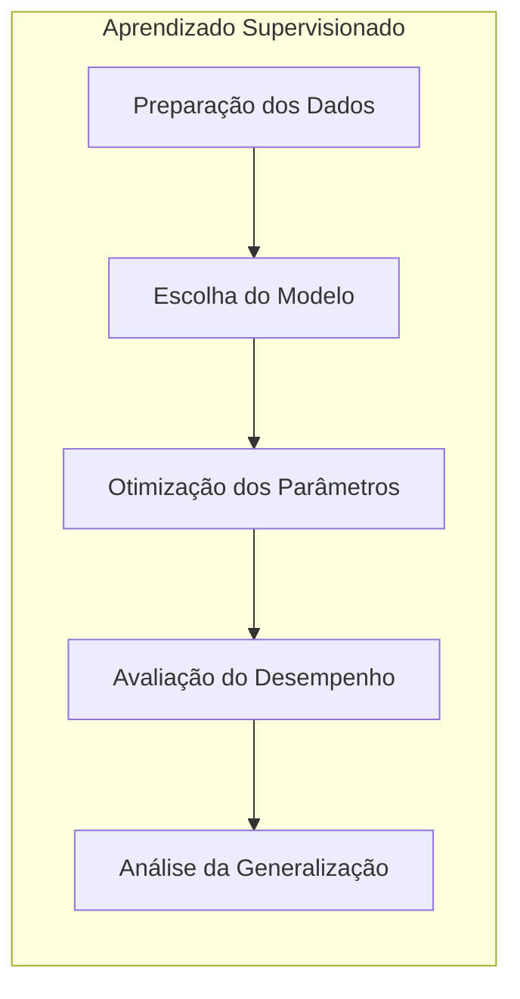
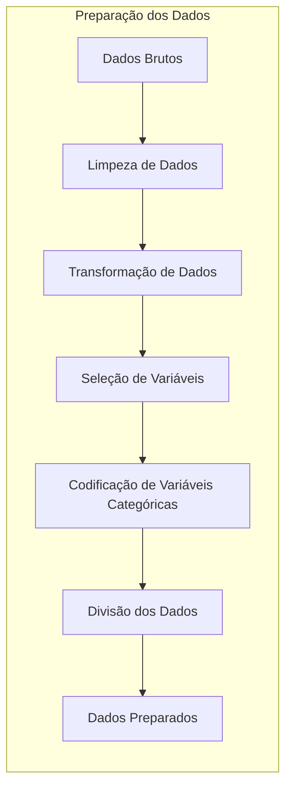
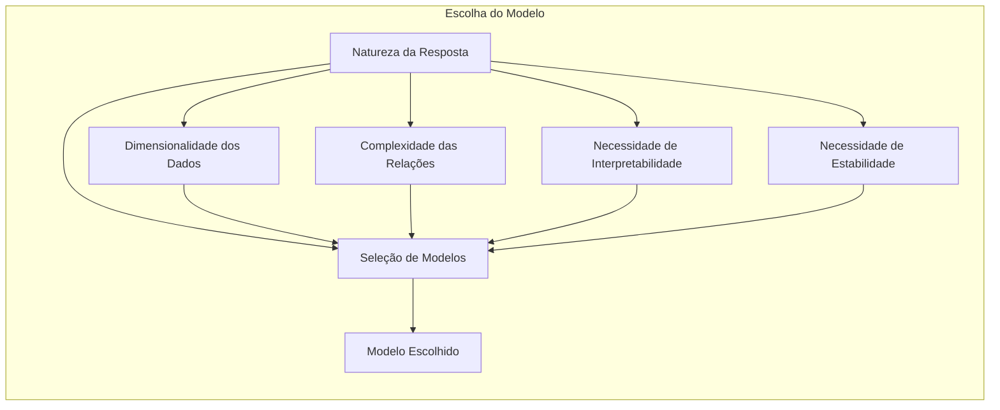
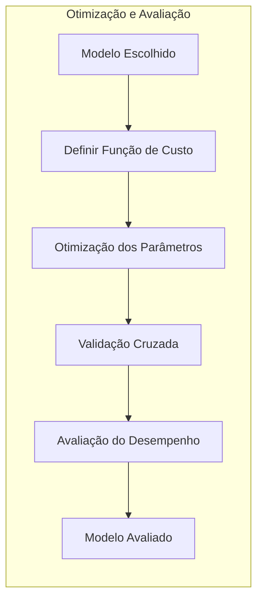
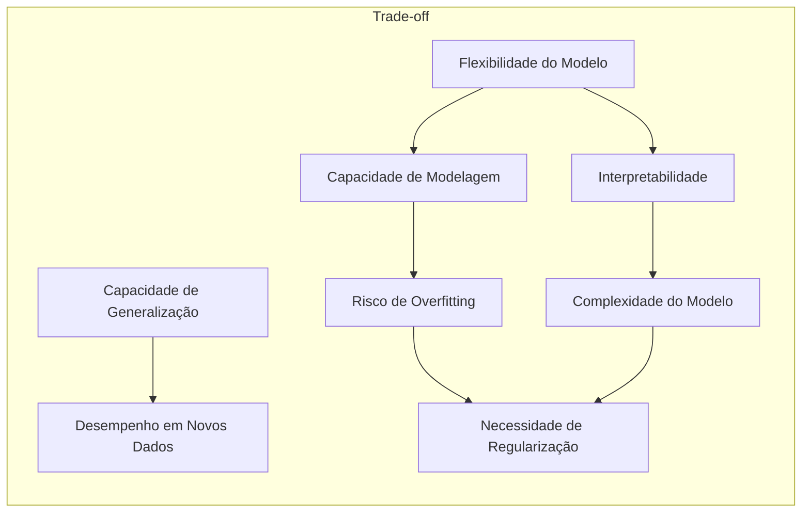
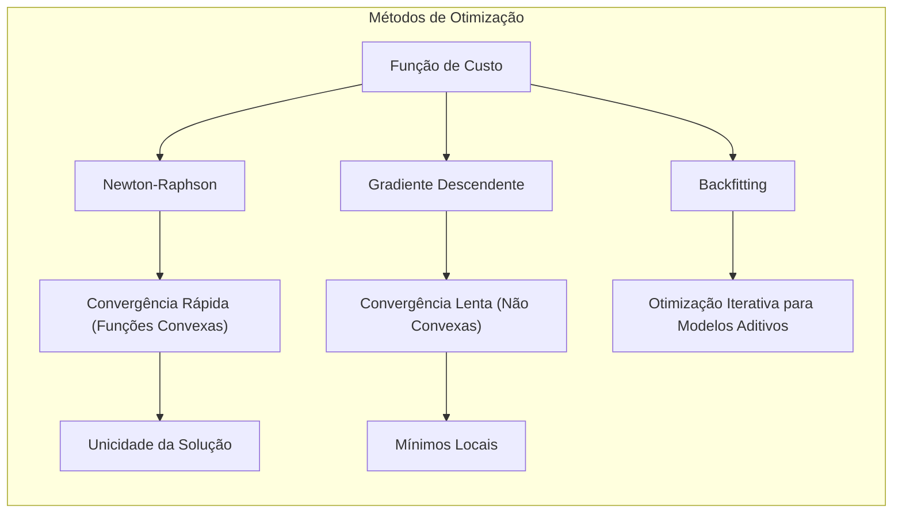

## Título: Modelos Aditivos, Árvores e Métodos Relacionados: Metodologias para Modelagem e Avaliação

### Introdução

Este capítulo explora a metodologia geral para a construção e avaliação de modelos de aprendizado supervisionado, utilizando como exemplos Modelos Aditivos Generalizados (GAMs), árvores de decisão, Multivariate Adaptive Regression Splines (MARS) e misturas hierárquicas de especialistas (HME) [^9.1]. A metodologia envolve um conjunto de passos que incluem a preparação dos dados, escolha do modelo, otimização dos parâmetros, avaliação do desempenho e análise da capacidade de generalização. O objetivo principal deste capítulo é fornecer uma visão abrangente e prática sobre como esses diferentes modelos são construídos e avaliados, quais aspectos são mais relevantes na modelagem estatística e como as escolhas metodológicas afetam o desempenho do modelo final e a interpretação dos resultados. O foco é a utilização de uma metodologia que permita escolher o modelo mais adequado para cada problema, levando em consideração o *trade-off* entre flexibilidade, interpretabilidade e precisão preditiva.

### Conceitos Fundamentais

**Conceito 1: Preparação dos Dados para Modelagem**

A preparação dos dados é um passo crucial na construção de modelos de aprendizado supervisionado. A preparação envolve várias etapas, como:
*   **Limpeza dos Dados:** Remoção de observações com erros, *outliers*, e tratamento de valores ausentes.
*   **Transformação de Dados:** Transformação dos preditores para melhorar a capacidade de modelagem dos dados, o que pode incluir transformações não lineares, normalização ou padronização das variáveis.
*  **Seleção de Variáveis:** Escolha dos preditores mais relevantes para o modelo, e a eliminação de preditores redundantes ou pouco informativos.
*   **Codificação de Variáveis Categóricas:** Criação de *dummy variables* ou outras codificações para preditores categóricos.
*   **Divisão dos Dados:** Divisão dos dados em conjuntos de treinamento, validação e teste, que são utilizados em diferentes etapas da construção do modelo.

A preparação dos dados é importante para garantir que o modelo seja ajustado adequadamente e que tenha uma boa capacidade de generalização, pois a qualidade dos modelos depende diretamente da qualidade dos dados. A preparação adequada também diminui o risco de overfitting e permite que modelos mais robustos sejam criados.

> 💡 **Exemplo Numérico:**
> Suponha que temos um conjunto de dados com informações sobre casas, incluindo área (em metros quadrados), número de quartos e preço (em milhares de reais).
>
> 1. **Limpeza de Dados:** Se uma das casas tiver um valor de área negativo ou um preço muito acima do normal (um outlier), essas linhas podem ser removidas ou os valores podem ser corrigidos. Se uma casa tiver um valor ausente para o número de quartos, podemos usar a média ou mediana dos valores existentes para imputar o valor.
>
> 2. **Transformação de Dados:** A área, que pode ter uma distribuição não normal, pode ser transformada usando uma transformação logarítmica. Isso pode melhorar a relação entre a área e o preço.
>
> 3.  **Seleção de Variáveis:** Se tivermos também informações sobre a localização da casa, mas essa informação não for relevante para o preço, podemos decidir não incluir essa variável no modelo.
>
> 4. **Codificação de Variáveis Categóricas:** Se tivermos informações sobre o tipo de construção da casa (por exemplo, "apartamento", "casa", "sobrado"), podemos criar variáveis dummy para cada tipo, onde 1 indica que a casa é daquele tipo e 0 indica que não é.
>
> 5. **Divisão dos Dados:** Dividimos os dados em um conjunto de treinamento (por exemplo, 70% dos dados), um conjunto de validação (15%) e um conjunto de teste (15%). O conjunto de treinamento será usado para ajustar o modelo, o conjunto de validação para ajustar os hiperparâmetros e o conjunto de teste para avaliar o desempenho final do modelo.

**Lemma 1:** *A preparação adequada dos dados é um componente essencial na construção de modelos de aprendizado supervisionado, e envolve a limpeza, transformação, seleção e codificação das variáveis. Uma preparação cuidadosa dos dados aumenta a qualidade do modelo e a sua capacidade de generalização.* A qualidade do modelo depende da qualidade dos dados, e a preparação correta é crucial [^4.5].

**Conceito 2: Escolha do Modelo de Aprendizado Supervisionado**

A escolha do modelo de aprendizado supervisionado depende do tipo de problema, da natureza dos dados e do objetivo da análise. A escolha do modelo deve considerar:

*   **A natureza da resposta:** O tipo de variável resposta (contínua, binária, contagem, categórica) define o tipo de modelo que pode ser utilizado.
*   **A dimensionalidade dos dados:**  Modelos com poucos preditores podem utilizar abordagens simples, como modelos lineares, enquanto dados de alta dimensão exigem abordagens mais flexíveis e com mecanismos de regularização.
*   **A complexidade das relações:** Modelos lineares podem ser suficientes para dados com relações lineares, enquanto modelos mais flexíveis como GAMs e árvores de decisão são necessários para modelar relações não lineares.
*   **A necessidade de interpretabilidade:** Modelos interpretáveis como árvores de decisão podem ser mais apropriados quando se busca uma explicação do fenômeno estudado, enquanto modelos mais complexos podem ter um desempenho melhor, mesmo que a sua interpretabilidade seja mais difícil.
*   **A necessidade de estabilidade:** Modelos mais estáveis e robustos são mais adequados para dados ruidosos e para evitar *overfitting*.

A escolha do modelo é um passo crucial e deve ser guiada por um conhecimento sobre os modelos e sobre a natureza dos dados, incluindo suas características e os padrões que precisam ser modelados.

> 💡 **Exemplo Numérico:**
> Vamos considerar alguns exemplos de escolha de modelos:
>
> *   **Previsão de Preços de Imóveis:** Se a relação entre a área da casa e o preço for aproximadamente linear, um modelo de regressão linear pode ser suficiente. No entanto, se a relação for não linear, um modelo GAM ou MARS pode ser mais adequado.
> *   **Classificação de E-mails como Spam ou Não Spam:** Para esse problema de classificação binária, podemos usar modelos como regressão logística, árvores de decisão ou até mesmo modelos mais complexos como redes neurais, dependendo da complexidade dos dados e do desempenho desejado.
> *   **Previsão da Demanda de um Produto:** Se a demanda depende de fatores como sazonalidade e promoções, um modelo aditivo pode ser usado para modelar cada efeito separadamente, enquanto um modelo de série temporal pode ser mais adequado se a dependência temporal for forte.
> *   **Análise de Sobrevivência:** Para analisar o tempo até um evento (como o tempo de sobrevivência de um paciente), modelos como regressão de Cox ou modelos de sobrevivência baseados em árvores podem ser usados.

**Corolário 1:** *A escolha do modelo deve considerar a natureza dos dados, as suas propriedades estatísticas e os objetivos da modelagem. Diferentes tipos de dados e diferentes objetivos requerem diferentes abordagens de modelagem*.  A escolha do modelo representa um balanço entre capacidade de modelagem, interpretabilidade, robustez e eficiência computacional [^4.1].

**Conceito 3: Otimização dos Parâmetros e Avaliação do Desempenho**

A otimização dos parâmetros do modelo envolve a escolha dos valores dos parâmetros que minimizam ou maximizam uma função de custo apropriada para cada modelo, como a soma dos erros quadráticos (SSE), a soma dos quadrados penalizada (PRSS), a função de verossimilhança ou métricas de impureza. Algoritmos de otimização, como o método dos mínimos quadrados, máxima verossimilhança, o método de Newton-Raphson, backfitting, *forward stagewise* e outros, são utilizados para encontrar os parâmetros do modelo. A validação cruzada e outras abordagens para escolha de modelos são utilizadas para garantir a estabilidade do modelo e a sua capacidade de generalização para dados não vistos, através da escolha adequada de parâmetros de regularização e de suavização. A avaliação do desempenho do modelo é feita através de métricas como erro de classificação, sensibilidade, especificidade e a análise dos resíduos, que permitem avaliar o desempenho preditivo do modelo e sua capacidade de modelar a estrutura dos dados.

> ⚠️ **Nota Importante:** A otimização dos parâmetros e avaliação do modelo são dois passos cruciais no processo de construção de modelos estatísticos, e devem ser guiadas pela escolha de métricas apropriadas, de modelos adequados, e por métodos de regularização que garantam a estabilidade e a generalização do modelo. A escolha dos métodos de otimização é crucial para garantir um ajuste adequado dos dados e para que o modelo tenha um bom desempenho em novos dados. A avaliação do desempenho é importante para a escolha do melhor modelo e para a sua utilização em aplicações reais [^4.4].

> ❗ **Ponto de Atenção:** A otimização dos parâmetros pode envolver mínimos locais ou modelos que se ajustam excessivamente aos dados de treino (overfitting). A utilização de técnicas de regularização, validação cruzada e outras abordagens são importantes para mitigar o *overfitting* e garantir que o modelo tenha uma boa capacidade de generalização [^4.5.1].

> ✔️ **Destaque:** Métodos de otimização são utilizados para estimar os parâmetros dos modelos e para controlar a sua complexidade, e a sua escolha depende do modelo e da natureza dos dados. A avaliação do desempenho é fundamental para a escolha do melhor modelo e sua utilização em aplicações práticas [^4.5.2].

> 💡 **Exemplo Numérico:**
> Suponha que estamos ajustando um modelo de regressão linear para prever o preço de casas com base na área (X). O modelo pode ser expresso como:
>
> $ \hat{y} = \beta_0 + \beta_1 X$
>
> 1.  **Otimização dos Parâmetros:** O método dos mínimos quadrados (OLS) busca encontrar os valores de $\beta_0$ e $\beta_1$ que minimizam a soma dos erros quadráticos (SSE):
>
> $ SSE = \sum_{i=1}^{n} (y_i - \hat{y}_i)^2 = \sum_{i=1}^{n} (y_i - (\beta_0 + \beta_1 X_i))^2 $
>
>    Onde $y_i$ são os preços reais das casas e $\hat{y}_i$ são os preços preditos pelo modelo.
>
>    Suponha que após a otimização, encontramos $\beta_0 = 50$ (milhares de reais) e $\beta_1 = 0.5$ (milhares de reais por metro quadrado). Isso significa que o preço base de uma casa é de 50 mil reais e que o preço aumenta em 500 reais a cada metro quadrado adicional.
>
> 2. **Avaliação do Desempenho:** Após ajustar o modelo, podemos avaliar o seu desempenho usando métricas como o erro quadrático médio (MSE) no conjunto de validação:
>
> $ MSE = \frac{1}{n_{val}} \sum_{i=1}^{n_{val}} (y_i - \hat{y}_i)^2 $
>
>    Se o MSE no conjunto de validação for muito alto, isso pode indicar que o modelo precisa de ajustes ou que um modelo diferente pode ser mais apropriado. Podemos também analisar os resíduos ($y_i - \hat{y}_i$) para verificar se há padrões que indicam que o modelo não está capturando a estrutura dos dados.
>
> 3. **Regularização:** Se o modelo apresentar *overfitting*, podemos usar técnicas de regularização, como a regressão de *ridge* ou *lasso*, que adicionam uma penalidade à função de custo, controlando a complexidade do modelo. Por exemplo, na regressão de *ridge*, a função de custo é:
>
>  $ PRSS(\beta) = \sum_{i=1}^{n} (y_i - (\beta_0 + \beta_1 X_i))^2 + \lambda (\beta_1^2) $
>
>   Onde $\lambda$ é um parâmetro de regularização que controla a penalidade.
>
> 4. **Validação Cruzada:** Podemos usar validação cruzada para escolher o valor ideal de $\lambda$ que minimize o erro no conjunto de validação e otimize a capacidade de generalização do modelo.

### Metodologia Detalhada para a Modelagem e Avaliação de Modelos de Aprendizado Supervisionado

**Explicação:** Este diagrama apresenta a metodologia para a construção e avaliação de modelos de aprendizado supervisionado, detalhando os passos desde a definição do problema até a interpretação dos resultados, conforme descrito nos tópicos [^4.1], [^4.2], [^4.3], [^4.4], [^4.5].

A metodologia para a construção e avaliação de modelos de aprendizado supervisionado envolve um conjunto de passos detalhados:

1.  **Definição do Problema e Objetivos:** O primeiro passo é a definição clara do problema de modelagem, incluindo o tipo de variável resposta, os preditores disponíveis, o objetivo da modelagem e as métricas de desempenho relevantes para o problema. A definição do problema é importante para a escolha do modelo e para a interpretação dos resultados.
2.  **Preparação dos Dados:** Os dados são preparados através de limpeza, transformação, seleção e codificação. Os dados são limpos de *outliers* e valores faltantes, e são transformados para melhorar a qualidade dos modelos. A escolha dos preditores mais relevantes e a codificação das variáveis categóricas são importantes para a modelagem.
3.  **Divisão dos Dados:**  Os dados são divididos em conjuntos de treinamento, validação e teste. O conjunto de treinamento é utilizado para ajustar os parâmetros do modelo, o conjunto de validação é utilizado para a escolha dos parâmetros de regularização e suavização, e o conjunto de teste é utilizado para avaliar o desempenho final do modelo em dados não vistos.
4.  **Escolha do Modelo:**  O modelo apropriado é escolhido, considerando a natureza dos dados, a complexidade das relações entre os preditores e a resposta e a necessidade de interpretabilidade do modelo. A escolha do modelo é uma etapa fundamental na construção de modelos eficientes.
5.  **Definição da Função de Custo:** Uma função de custo apropriada para o tipo de modelo é escolhida, como a soma dos erros quadráticos (SSE), a deviance, ou uma métrica de impureza.  A função de custo utilizada para a otimização é definida de acordo com a natureza dos dados e do problema de modelagem.
6.  **Otimização dos Parâmetros:** Os parâmetros do modelo são estimados utilizando um algoritmo de otimização apropriado, como o método dos mínimos quadrados (OLS), a máxima verossimilhança (MLE), o algoritmo de backfitting ou outros métodos de otimização. A escolha do método de otimização deve levar em consideração a natureza do modelo e a sua capacidade de minimizar a função de custo.
7. **Validação Cruzada:** A validação cruzada é utilizada para escolher os parâmetros de regularização, os parâmetros de suavização, o método de suavização e outros hiperparâmetros do modelo, de forma a garantir que o modelo tenha uma boa capacidade de generalização. O processo de validação cruzada permite avaliar o desempenho do modelo em dados não utilizados no treinamento.
8.  **Avaliação do Modelo no Conjunto de Validação:** O desempenho do modelo é avaliado utilizando métricas apropriadas, como o erro de classificação, sensibilidade e especificidade para modelos de classificação, ou métricas como o erro quadrático médio (MSE) para modelos de regressão.  A avaliação no conjunto de validação serve para escolher o modelo com melhor desempenho para dados não vistos no treinamento.
9.  **Escolha do Melhor Modelo:** O modelo que apresenta melhor desempenho no conjunto de validação é escolhido para a avaliação final.
10. **Avaliação Final do Modelo no Conjunto de Teste:** O modelo final é avaliado no conjunto de teste, utilizando as métricas de desempenho, para garantir que o modelo tem um bom desempenho em dados não vistos, que representam uma situação similar à de aplicação do modelo em dados reais.
11. **Interpretação dos Resultados e Conclusões:** Os resultados do modelo são interpretados e conclusões sobre o problema e a qualidade do modelo são obtidas, e a importância dos preditores, a forma como eles se relacionam com a resposta e as limitações do modelo são discutidas.

A aplicação cuidadosa dessa metodologia garante a construção de modelos estatísticos robustos, confiáveis, e com boa capacidade de generalização.

**Lemma 4:** *A utilização de uma metodologia detalhada que inclui a preparação dos dados, a escolha do modelo, a otimização dos parâmetros, a validação cruzada e a avaliação do modelo, é fundamental para a construção de modelos de aprendizado supervisionado com boa qualidade. O processo iterativo de modelagem e avaliação é importante para obter modelos adequados para cada tipo de problema*.  A escolha do modelo e de seus componentes deve considerar todos os passos apresentados na metodologia [^4.4.5].

### O Balanço entre Flexibilidade, Interpretabilidade e Capacidade de Generalização

A construção de modelos estatísticos envolve um balanço entre a flexibilidade do modelo, a sua interpretabilidade e a sua capacidade de generalização para dados não vistos.  Modelos mais flexíveis, embora sejam capazes de se ajustar a relações complexas nos dados, podem apresentar problemas de *overfitting* e baixa interpretabilidade, enquanto modelos mais simples, embora mais fáceis de entender, podem não capturar padrões importantes nos dados. A escolha entre modelos mais flexíveis e modelos mais simples deve ser guiada pelo objetivo da modelagem e pela natureza dos dados. O objetivo é encontrar o modelo que seja mais adequado para o problema específico e para os objetivos da modelagem.

### A Importância da Teoria Estatística para a Escolha dos Componentes do Modelo

A teoria estatística fornece a base para a construção e escolha dos diferentes componentes dos modelos de aprendizado supervisionado. A família exponencial, as funções de ligação canônicas, o uso de métricas de impureza e o método da máxima verossimilhança formam a base da construção e análise de modelos estatísticos. A utilização de conceitos estatísticos, como a matriz de informação de Fisher e as propriedades assintóticas dos estimadores, são importantes para entender o comportamento dos modelos, e para escolher as abordagens mais apropriadas. A teoria estatística é, portanto, um componente fundamental para a construção de modelos com boas propriedades e para a sua aplicação na prática.

### Perguntas Teóricas Avançadas: Como diferentes métodos de otimização (Newton-Raphson, gradiente descendente, backfitting) se relacionam com a função de custo e o espaço de parâmetros e como a escolha do método afeta a convergência, a unicidade da solução e a capacidade de generalização do modelo?

**Resposta:**

Diferentes métodos de otimização (Newton-Raphson, gradiente descendente e backfitting) interagem de maneiras distintas com a função de custo e o espaço de parâmetros, e a escolha do método de otimização afeta diretamente a convergência, a unicidade da solução e a capacidade de generalização dos modelos.

O método de Newton-Raphson é um método de otimização de segunda ordem que utiliza o gradiente e o Hessiano (ou uma aproximação como a matriz de informação de Fisher) da função de custo para encontrar os seus mínimos locais.  Quando a função de custo é bem-comportada e convexa, o método de Newton-Raphson tende a convergir rapidamente para um mínimo local, e em muitos casos a solução é única. No entanto, quando a função de custo não é convexa, o algoritmo pode convergir para um mínimo local, e pode ser difícil encontrar o mínimo global.

O método do gradiente descendente é um método de otimização de primeira ordem que utiliza apenas o gradiente da função de custo. O método do gradiente descendente é mais simples e computacionalmente mais eficiente que o Newton-Raphson, mas a sua convergência é geralmente mais lenta, e ele também pode ficar preso em mínimos locais. A escolha da taxa de aprendizado também tem um grande impacto na sua convergência.

O algoritmo de backfitting é um método iterativo utilizado para estimar modelos aditivos e modelos aditivos generalizados (GAMs), o qual busca estimar as funções não paramétricas de forma iterativa, ao ajustar os resíduos parciais com o uso de um suavizador.  A escolha do método de suavização e dos parâmetros de regularização influencia a sua convergência e estabilidade. O algoritmo de backfitting é utilizado para modelos aditivos, e, geralmente, é aninhado dentro do método de Newton-Raphson para otimizar modelos da família exponencial.

A escolha do método de otimização depende da natureza da função de custo e do espaço de parâmetros. Para funções de custo convexas, o método de Newton-Raphson é uma boa opção, e para funções de custo não convexas o método do gradiente descendente e seus variantes podem ser utilizados. Para modelos aditivos, o algoritmo de backfitting é um método eficiente, principalmente quando combinado com aproximações do Newton Raphson. A escolha do método de otimização também deve considerar o balanço entre eficiência computacional, a sua capacidade de gerar modelos com bom desempenho, e a sua estabilidade e convergência.

> 💡 **Exemplo Numérico:**
> Suponha que temos um modelo de regressão logística com dois parâmetros, $\beta_0$ e $\beta_1$, e a função de custo é a *log-likelihood* negativa.
>
> 1. **Newton-Raphson:** Este método usaria a primeira e segunda derivadas da *log-likelihood* em relação a $\beta_0$ e $\beta_1$ para iterativamente aproximar os valores que maximizam a *log-likelihood*. A atualização dos parâmetros em cada iteração seria:
>
> $\beta^{(t+1)} = \beta^{(t)} - H^{-1}(\beta^{(t)}) \nabla L(\beta^{(t)})$
>
> Onde $H$ é a matriz Hessiana (segundas derivadas) e $\nabla L$ é o gradiente (primeiras derivadas) da *log-likelihood*. Este método pode convergir rapidamente, mas requer o cálculo do Hessiano, que pode ser computacionalmente caro.
>
> 2. **Gradiente Descendente:** Este método usaria apenas o gradiente da *log-likelihood* para atualizar os parâmetros:
>
> $\beta^{(t+1)} = \beta^{(t)} - \alpha \nabla L(\beta^{(t)})$
>
> Onde $\alpha$ é a taxa de aprendizado. O gradiente descendente é mais simples que o Newton-Raphson, mas pode convergir mais lentamente e pode precisar de ajustes na taxa de aprendizado para evitar oscilações ou convergência lenta.
>
> 3. **Backfitting:** Para um modelo aditivo generalizado, o *backfitting* ajustaria cada função componente iterativamente, mantendo as outras fixas. Por exemplo, em um modelo com duas variáveis, $X_1$ e $X_2$, o *backfitting* poderia otimizar a função $f_1(X_1)$ enquanto $f_2(X_2)$ é mantida fixa, e então otimizar $f_2(X_2)$ mantendo $f_1(X_1)$ fixa, até que a convergência seja alcançada.
>
> A escolha do método de otimização dependerá da natureza da função de custo e da complexidade do modelo. Newton-Raphson pode ser mais rápido para funções convexas, enquanto gradiente descendente pode ser mais adequado para funções não convexas ou quando o Hessiano é difícil de calcular. O *backfitting* é especialmente adequado para modelos aditivos, onde a otimização é feita de forma iterativa em cada componente do modelo.

**Lemma 5:** *A escolha do método de otimização afeta a convergência do modelo, a unicidade da solução e a estabilidade das estimativas, e o método adequado depende da natureza da função de custo e do espaço de parâmetros*. A escolha do método de otimização também afeta a capacidade de generalização do modelo [^4.4.3].

**Corolário 5:** *Métodos de otimização como Newton-Raphson, gradiente descendente e backfitting têm diferentes propriedades e a escolha do método adequado deve ser feita considerando a sua relação com a função de custo, e a sua capacidade de convergir para uma solução que minimize o *bias* e a variância*. A escolha do método de otimização é um aspecto crucial na construção de modelos robustos e com boa capacidade de generalização [^4.4.2].

> ⚠️ **Ponto Crucial**: A escolha do método de otimização deve ser feita considerando as suas propriedades e limitações, pois a capacidade de convergir para uma solução ótima e de gerar modelos estáveis e com boa capacidade de generalização depende diretamente da natureza da função de custo e da abordagem utilizada para estimar os parâmetros [^4.3.1], [^4.3.2].

### Conclusão

Este capítulo apresentou uma síntese da metodologia geral para a construção e avaliação de modelos de aprendizado supervisionado, destacando a importância de cada etapa na construção de modelos eficientes e robustos. A discussão detalhou a preparação dos dados, a escolha do modelo, a otimização dos parâmetros, a avaliação do desempenho e a interpretação dos resultados, e como as diferentes escolhas metodológicas impactam o resultado final. A combinação de diferentes modelos, métodos de otimização, métricas de desempenho e abordagens de regularização fornece uma base para a construção de modelos que sejam eficientes e com alta capacidade de generalização, em diversos problemas de modelagem estatística.

### Footnotes

[^4.1]: "In this chapter we begin our discussion of some specific methods for super-vised learning. These techniques each assume a (different) structured form for the unknown regression function, and by doing so they finesse the curse of dimensionality. Of course, they pay the possible price of misspecifying the model, and so in each case there is a tradeoff that has to be made." *(Trecho de "Additive Models, Trees, and Related Methods")*

[^4.2]: "Regression models play an important role in many data analyses, providing prediction and classification rules, and data analytic tools for understand-ing the importance of different inputs." *(Trecho de "Additive Models, Trees, and Related Methods")*

[^4.3]: "In this section we describe a modular algorithm for fitting additive models and their generalizations. The building block is the scatterplot smoother for fitting nonlinear effects in a flexible way. For concreteness we use as our scatterplot smoother the cubic smoothing spline described in Chapter 5." *(Trecho de "Additive Models, Trees, and Related Methods")*

[^4.3.1]:  "The additive model has the form $Y = \alpha + \sum_{j=1}^p f_j(X_j) + \epsilon$, where the error term $\epsilon$ has mean zero." * (Trecho de "Additive Models, Trees, and Related Methods")*

[^4.3.2]:   "Given observations $x_i, y_i$, a criterion like the penalized sum of squares (5.9) of Section 5.4 can be specified for this problem, $PRSS(\alpha, f_1, f_2,\ldots, f_p) = \sum_i^N (y_i - \alpha - \sum_j^p f_j(x_{ij}))^2 + \sum_j^p \lambda_j \int(f_j''(t_j))^2 \, dt_j$" * (Trecho de "Additive Models, Trees, and Related Methods")*

[^4.3.3]: "where the $\lambda_j > 0$ are tuning parameters. It can be shown that the minimizer of (9.7) is an additive cubic spline model; each of the functions $f_j$ is a cubic spline in the component $X_j$, with knots at each of the unique values of $x_{ij}$, $i = 1, \ldots, N$." *(Trecho de "Additive Models, Trees, and Related Methods")*

[^4.4]: "For two-class classification, recall the logistic regression model for binary data discussed in Section 4.4. We relate the mean of the binary response $\mu(X) = Pr(Y = 1|X)$ to the predictors via a linear regression model and the logit link function:  $log(\mu(X)/(1 – \mu(X)) = \alpha + \beta_1 X_1 + \ldots + \beta_pX_p$." * (Trecho de "Additive Models, Trees, and Related Methods")*

[^4.4.1]: "The additive logistic regression model replaces each linear term by a more general functional form: $log(\mu(X)/(1 – \mu(X))) = \alpha + f_1(X_1) + \ldots + f_p(X_p)$, where again each $f_j$ is an unspecified smooth function." * (Trecho de "Additive Models, Trees, and Related Methods")*

[^4.4.2]: "While the non-parametric form for the functions $f_j$ makes the model more flexible, the additivity is retained and allows us to interpret the model in much the same way as before. The additive logistic regression model is an example of a generalized additive model." *(Trecho de "Additive Models, Trees, and Related Methods")*

[^4.4.3]: "In general, the conditional mean $\mu(X)$ of a response $Y$ is related to an additive function of the predictors via a link function $g$:  $g[\mu(X)] = \alpha + f_1(X_1) + \ldots + f_p(X_p)$." *(Trecho de "Additive Models, Trees, and Related Methods")*

[^4.4.4]:  "Examples of classical link functions are the following: $g(\mu) = \mu$ is the identity link, used for linear and additive models for Gaussian response data." *(Trecho de "Additive Models, Trees, and Related Methods")*

[^4.4.5]: "$g(\mu) = logit(\mu)$ as above, or $g(\mu) = probit(\mu)$, the probit link function, for modeling binomial probabilities. The probit function is the inverse Gaussian cumulative distribution function: $probit(\mu) = \Phi^{-1}(\mu)$." *(Trecho de "Additive Models, Trees, and Related Methods")*

[^4.5]: "All three of these arise from exponential family sampling models, which in addition include the gamma and negative-binomial distributions. These families generate the well-known class of generalized linear models, which are all extended in the same way to generalized additive models." *(Trecho de "Additive Models, Trees, and Related Methods")*

[^4.5.1]: "The functions $f_j$ are estimated in a flexible manner, using an algorithm whose basic building block is a scatterplot smoother. The estimated func-tion $f_j$ can then reveal possible nonlinearities in the effect of $X_j$. Not all of the functions $f_j$ need to be nonlinear." *(Trecho de "Additive Models, Trees, and Related Methods")*

[^4.5.2]: "We can easily mix in linear and other parametric forms with the nonlinear terms, a necessity when some of the inputs are qualitative variables (factors)." *(Trecho de "Additive Models, Trees, and Related Methods")*
