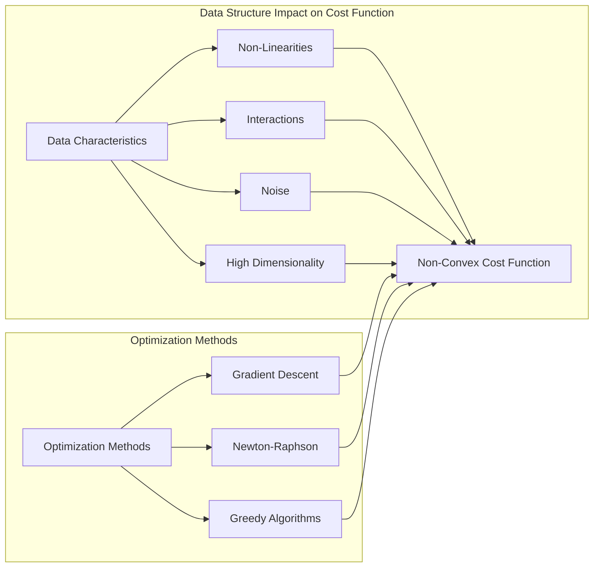
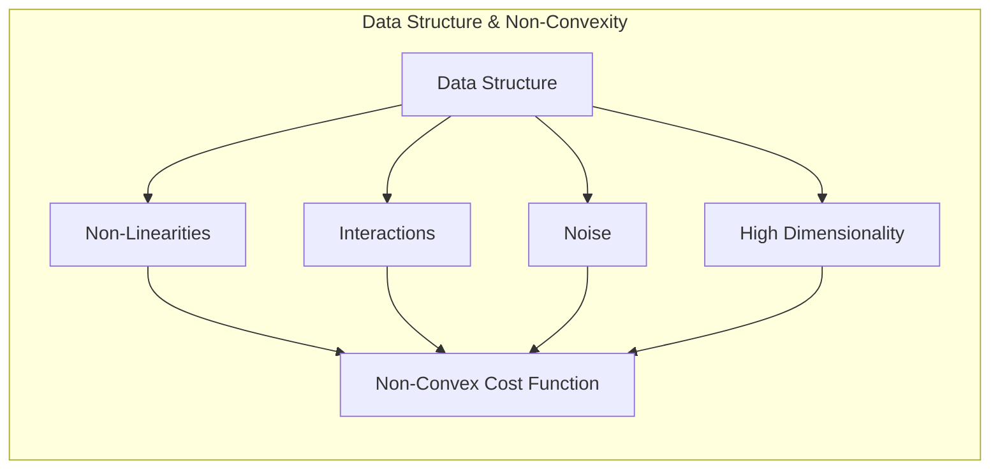
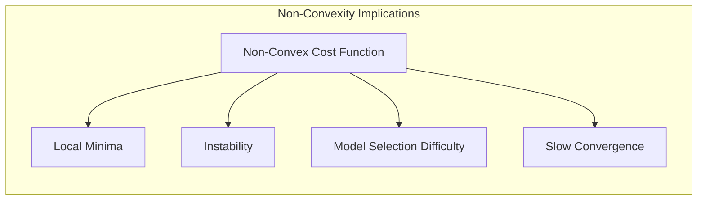
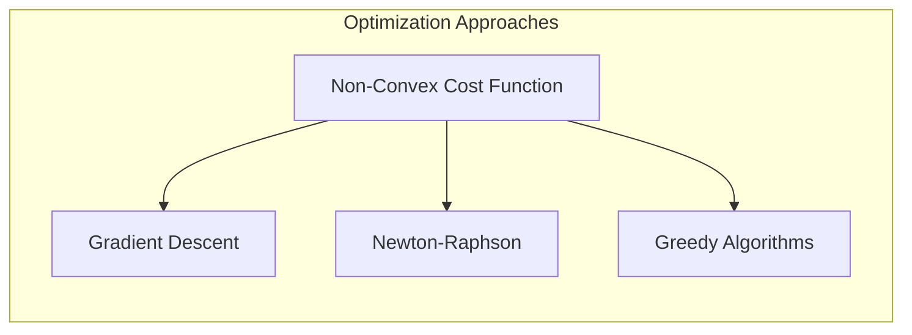
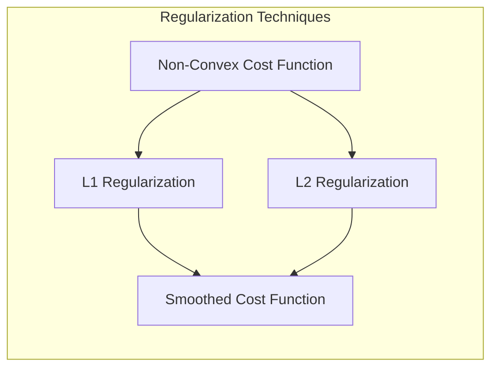
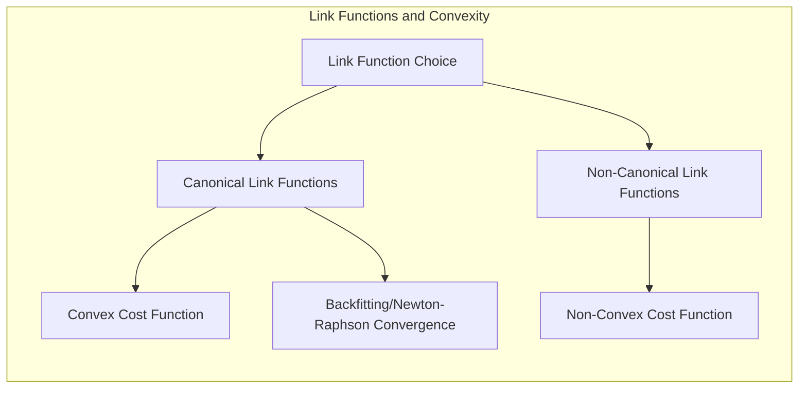

## Título: Modelos Aditivos, Árvores e Métodos Relacionados: Impacto da Estrutura de Dados na Não Convexidade da Função de Custo



### Introdução

Este capítulo explora como a estrutura dos dados, incluindo a presença de não linearidades, interações complexas, ruído e alta dimensionalidade, pode levar a funções de custo não convexas em modelos de aprendizado supervisionado, com foco em Modelos Aditivos Generalizados (GAMs), árvores de decisão, Multivariate Adaptive Regression Splines (MARS) e misturas hierárquicas de especialistas (HME) [^9.1]. A convexidade da função de custo é uma propriedade desejável, pois garante a existência de um mínimo global e facilita o processo de otimização dos parâmetros do modelo. No entanto, a complexidade dos dados pode levar a funções de custo não convexas, o que dificulta a otimização e pode levar a modelos com resultados subótimos. O objetivo principal deste capítulo é apresentar uma visão teórica aprofundada sobre o impacto da estrutura dos dados na convexidade da função de custo e como diferentes abordagens de otimização (como gradiente descendente, Newton-Raphson e algoritmos gulosos) lidam com as dificuldades impostas pela não convexidade.

### Conceitos Fundamentais

**Conceito 1: Convexidade da Função de Custo em Modelos de Otimização**

A convexidade da função de custo é uma propriedade fundamental na otimização de modelos estatísticos e de aprendizado de máquina. Uma função convexa é uma função que, para quaisquer dois pontos no seu domínio, a reta que liga esses dois pontos está sempre acima do gráfico da função. Uma função convexa tem apenas um mínimo global, e métodos de otimização como o gradiente descendente garantem que o algoritmo convirja para a solução ótima global. Uma função não convexa, por outro lado, pode ter múltiplos mínimos locais, e o algoritmo de otimização pode ficar preso em um mínimo local, sem encontrar a solução ótima. A convexidade da função de custo facilita a otimização e garante a unicidade da solução, e modelos com funções de custo convexas são preferíveis quando possível.

**Lemma 1:** *A convexidade da função de custo garante que existe um único mínimo global e que a sua otimização seja mais eficiente. A falta de convexidade pode levar a múltiplos mínimos locais, que dificultam a otimização e podem levar a modelos com parâmetros subótimos*. A convexidade é uma propriedade importante na otimização de modelos estatísticos [^4.4.2].

> 💡 **Exemplo Numérico:**
> Considere um modelo de regressão linear simples, onde a função de custo é o erro quadrático médio (MSE): $C(\theta) = \frac{1}{n} \sum_{i=1}^{n} (y_i - (\theta_0 + \theta_1 x_i))^2$. Esta função é convexa em relação aos parâmetros $\theta_0$ e $\theta_1$. Se tivermos dados como $x = [1, 2, 3]$ e $y = [2, 4, 5]$, a função de custo terá um único mínimo.
>
> ```python
> import numpy as np
> import matplotlib.pyplot as plt
> from mpl_toolkits.mplot3d import Axes3D
>
> # Dados de exemplo
> x = np.array([1, 2, 3])
> y = np.array([2, 4, 5])
>
> # Função de custo MSE
> def mse_cost(theta0, theta1, x, y):
>     n = len(x)
>     return np.sum((y - (theta0 + theta1 * x))**2) / n
>
> # Cria um grid de valores para theta0 e theta1
> theta0_vals = np.linspace(-2, 6, 100)
> theta1_vals = np.linspace(-2, 4, 100)
>
> # Cria um meshgrid para plotagem 3D
> theta0_grid, theta1_grid = np.meshgrid(theta0_vals, theta1_vals)
>
> # Calcula o valor da função de custo para cada combinação de theta0 e theta1
> cost_values = np.array([mse_cost(t0, t1, x, y) for t0, t1 in zip(np.ravel(theta0_grid), np.ravel(theta1_grid))]).reshape(theta0_grid.shape)
>
> # Plota a superfície de custo
> fig = plt.figure(figsize=(10, 8))
> ax = fig.add_subplot(111, projection='3d')
> surf = ax.plot_surface(theta0_grid, theta1_grid, cost_values, cmap='viridis', alpha=0.7)
> ax.set_xlabel('Theta0')
> ax.set_ylabel('Theta1')
> ax.set_zlabel('Custo (MSE)')
> ax.set_title('Superfície de Custo Convexa (Regressão Linear)')
> fig.colorbar(surf)
> plt.show()
> ```
>
> Este gráfico 3D demonstra a forma convexa da função de custo, mostrando claramente a existência de um único mínimo global.
>
> Agora, imagine uma função de custo não convexa, como a função de custo de um modelo de rede neural com múltiplas camadas. Essa função pode ter vários vales (mínimos locais), e o algoritmo de otimização pode ficar preso em um desses vales, sem encontrar o mínimo global.

**Conceito 2: Como a Estrutura de Dados Afeta a Convexidade**

A estrutura dos dados, incluindo a presença de não linearidades, interações, ruído e alta dimensionalidade, pode levar a funções de custo não convexas.
*   **Não Linearidades:** Modelos lineares com funções de custo quadráticas têm funções convexas, enquanto que modelos com funções não paramétricas ou com funções não lineares complexas podem gerar funções de custo não convexas. A natureza da relação entre as variáveis preditoras e resposta influencia diretamente a convexidade da função de custo.
*   **Interações:** A presença de interações entre preditores também pode levar a funções de custo não convexas, que geram modelos mais complexos, e com resultados mais difíceis de interpretar. Modelos com funções de base que modelam interações, como em MARS ou em HME, podem levar a funções de custo com não convexidades.
*   **Ruído:** O ruído nos dados pode levar a irregularidades na função de custo, que podem dificultar a otimização e tornar a função não convexa, especialmente quando o nível de ruído é alto. A presença de outliers também pode afetar a convexidade da função.
*   **Alta Dimensionalidade:** Em problemas de alta dimensionalidade, a função de custo pode ter muitas direções e regiões onde a sua curvatura é mais difícil de modelar. O espaço de parâmetros de modelos de alta dimensionalidade pode gerar funções de custo não convexas com muitos mínimos locais.



A complexidade dos dados pode levar a funções de custo que são mais difíceis de otimizar e que não garantem a unicidade da solução.

**Corolário 1:** *A estrutura dos dados, incluindo não linearidades, interações, ruído e alta dimensionalidade, pode levar a funções de custo não convexas, que dificultam a otimização e a garantia da unicidade da solução, e devem ser tratadas com abordagens de otimização adequadas*. A convexidade, ou não, da função de custo é um aspecto central na escolha dos algoritmos de otimização [^4.4.3].

> 💡 **Exemplo Numérico (Não Linearidades):**
> Suponha que a relação entre a variável preditora $x$ e a variável resposta $y$ seja dada por $y = \sin(x) + \epsilon$, onde $\epsilon$ é um ruído aleatório. Um modelo linear ($y = \theta_0 + \theta_1 x$) não se ajustará bem a esses dados e a função de custo resultante, embora convexa em relação aos parâmetros do modelo linear, será alta. Se utilizarmos um modelo não linear, como uma regressão polinomial ($y = \theta_0 + \theta_1 x + \theta_2 x^2 + ...$) ou um modelo aditivo com splines, a função de custo pode se tornar não convexa, especialmente se o grau do polinômio ou o número de nós no spline for alto, levando a múltiplos mínimos locais.
>
> ```python
> import numpy as np
> import matplotlib.pyplot as plt
> from sklearn.preprocessing import PolynomialFeatures
> from sklearn.linear_model import LinearRegression
> from sklearn.pipeline import make_pipeline
>
> # Dados de exemplo com não linearidade
> np.random.seed(42)
> x = np.sort(np.random.rand(50) * 10)
> y = np.sin(x) + np.random.randn(50) * 0.3
>
> # Modelo de regressão linear
> model_linear = LinearRegression()
> model_linear.fit(x.reshape(-1, 1), y)
>
> # Modelo de regressão polinomial (grau 3)
> degree = 3
> model_poly = make_pipeline(PolynomialFeatures(degree), LinearRegression())
> model_poly.fit(x.reshape(-1, 1), y)
>
> # Previsões dos modelos
> x_plot = np.linspace(min(x), max(x), 100)
> y_linear_pred = model_linear.predict(x_plot.reshape(-1, 1))
> y_poly_pred = model_poly.predict(x_plot.reshape(-1, 1))
>
> # Plotagem dos dados e dos modelos
> plt.figure(figsize=(10, 6))
> plt.scatter(x, y, label='Dados', color='blue')
> plt.plot(x_plot, y_linear_pred, label='Regressão Linear', color='red')
> plt.plot(x_plot, y_poly_pred, label='Regressão Polinomial', color='green')
> plt.xlabel('x')
> plt.ylabel('y')
> plt.title('Comparação de Modelos Lineares e Não Lineares')
> plt.legend()
> plt.show()
> ```
>
> O gráfico mostra que o modelo linear não se ajusta bem aos dados, enquanto o modelo polinomial captura melhor a não linearidade. A função de custo para o modelo polinomial, no entanto, pode ser não convexa.

**Conceito 3: Implicações da Não Convexidade na Modelagem Estatística**

A não convexidade da função de custo pode levar a várias implicações na modelagem estatística:
*   **Mínimos Locais:** Métodos de otimização, como o gradiente descendente, podem ficar presos em mínimos locais, o que impede o algoritmo de encontrar a solução ótima global.
*   **Instabilidade:** A presença de múltiplos mínimos locais pode levar a soluções instáveis, que variam dependendo da inicialização dos parâmetros e da amostra de dados.
*   **Dificuldade na Escolha do Modelo:** A dificuldade de avaliar a qualidade da solução final pode levar a problemas na escolha do modelo e na sua avaliação, o que torna a modelagem um processo mais difícil.
*   **Convergência Lenta:** A convergência dos algoritmos pode ser lenta, e o custo computacional do processo de otimização aumenta.



A não convexidade representa um desafio para a modelagem estatística, e a escolha de um algoritmo de otimização apropriado é importante para lidar com esse problema. O conhecimento sobre a natureza das funções de custo é importante para a modelagem adequada.

> ⚠️ **Nota Importante:** A não convexidade da função de custo é uma característica comum de problemas de otimização em modelos de aprendizado supervisionado e a escolha dos métodos de otimização e dos parâmetros de regularização são fundamentais para mitigar os efeitos da não convexidade. A escolha dos modelos deve levar em consideração a natureza da função de custo [^4.5].

> ❗ **Ponto de Atenção:** A presença de múltiplos mínimos locais exige o uso de métodos de otimização mais complexos, como algoritmos genéticos e outros, que podem levar a um custo computacional elevado. A escolha do método de otimização deve ser feita levando em consideração o custo computacional e a qualidade dos resultados [^4.4.4].

> ✔️ **Destaque:** A estrutura dos dados tem um impacto direto na convexidade da função de custo, e a escolha de um método de otimização apropriado é crucial para garantir a convergência e a estabilidade do modelo e para se aproximar da solução ótima [^4.4.5].

### Abordagens de Otimização para Funções de Custo Não Convexas: Gradiente Descendente, Newton-Raphson, e Algoritmos Gulosos



Diferentes algoritmos de otimização podem ser utilizados para lidar com a não convexidade da função de custo, e cada abordagem tem as suas vantagens e limitações:

1.  **Gradiente Descendente (e suas Variantes):** O gradiente descendente é um método de otimização de primeira ordem que utiliza o gradiente da função de custo para encontrar o mínimo. A atualização dos parâmetros é feita na direção oposta ao gradiente:
$$
\theta_{t+1} = \theta_t - \eta \nabla C(\theta_t)
$$
onde $\eta$ é a taxa de aprendizagem e $C(\theta_t)$ é a função de custo. O gradiente descendente é um método simples e computacionalmente eficiente, mas a sua convergência pode ser lenta em modelos complexos e em funções de custo não convexas, e o algoritmo pode ficar preso em mínimos locais. Variantes do gradiente descendente, como o gradiente descendente estocástico (SGD) e o método do momento, são utilizadas para mitigar os problemas do método do gradiente descendente.

```mermaid
graph LR
    subgraph "Gradient Descent"
    direction TB
        A["theta_{t+1}"]
        B["theta_t"]
        C["eta * grad C(theta_t)"]
         A -->| "$\theta_{t+1} = \theta_t - \eta \nabla C(\theta_t)$" | B
         B --> C
    end
```

> 💡 **Exemplo Numérico (Gradiente Descendente):**
> Vamos considerar um exemplo simples de otimização usando o gradiente descendente para encontrar o mínimo de uma função de custo não convexa. Suponha que a função de custo seja $C(\theta) = \theta^4 - 10\theta^2 + 5\theta$.
>
> ```python
> import numpy as np
> import matplotlib.pyplot as plt
>
> # Função de custo
> def cost_function(theta):
>     return theta**4 - 10*theta**2 + 5*theta
>
> # Gradiente da função de custo
> def gradient(theta):
>     return 4*theta**3 - 20*theta + 5
>
> # Gradiente descendente
> def gradient_descent(initial_theta, learning_rate, iterations):
>     theta = initial_theta
>     history = [theta]
>     for i in range(iterations):
>         theta = theta - learning_rate * gradient(theta)
>         history.append(theta)
>     return history
>
> # Parâmetros
> initial_theta = 3.0
> learning_rate = 0.01
> iterations = 100
>
> # Executa o gradiente descendente
> theta_history = gradient_descent(initial_theta, learning_rate, iterations)
>
> # Plota a função de custo e a trajetória do theta
> theta_vals = np.linspace(-4, 4, 400)
> cost_vals = cost_function(theta_vals)
>
> plt.figure(figsize=(10, 6))
> plt.plot(theta_vals, cost_vals, label='Função de Custo', color='blue')
> plt.scatter(theta_history, cost_function(np.array(theta_history)), color='red', label='Trajetória do Theta')
> plt.xlabel('Theta')
> plt.ylabel('Custo')
> plt.title('Gradiente Descendente em Função Não Convexa')
> plt.legend()
> plt.grid(True)
> plt.show()
>
> print(f"Theta inicial: {initial_theta}")
> print(f"Theta final: {theta_history[-1]}")
> print(f"Custo final: {cost_function(theta_history[-1])}")
> ```
>
> Este exemplo mostra como o gradiente descendente pode convergir para um mínimo local, dependendo do ponto inicial. Se começarmos com um $\theta$ inicial diferente, podemos convergir para um mínimo diferente. A escolha da taxa de aprendizagem também é crucial para a convergência.

2.  **Método de Newton-Raphson (e suas Variações):** O método de Newton-Raphson é um método de otimização de segunda ordem que utiliza o gradiente e o hessiano da função de custo. A atualização dos parâmetros é feita utilizando a seguinte equação:
    $$
     \theta_{t+1} = \theta_t - H(\theta_t)^{-1} \nabla C(\theta_t)
    $$
    onde $H(\theta_t)$ é o hessiano da função de custo. O método de Newton-Raphson tem uma convergência mais rápida que o gradiente descendente, e consegue encontrar mínimos locais com mais eficiência, mas requer o cálculo da inversa do Hessiano, o que pode ser computacionalmente custoso, e não garante a convergência quando a função de custo é não convexa. Em modelos lineares generalizados, uma aproximação do hessiano, utilizando a matriz de informação de Fisher é utilizada, o que simplifica o cálculo e garante que os estimadores sejam consistentes.

```mermaid
graph LR
    subgraph "Newton-Raphson Method"
        direction TB
        A["theta_{t+1}"]
        B["theta_t"]
        C["H(theta_t)^-1"]
        D["grad C(theta_t)"]
         A -->| "$\theta_{t+1} = \theta_t - H(\theta_t)^{-1} \nabla C(\theta_t)$" | B
         B --> C
         C --> D
    end
```

> 💡 **Exemplo Numérico (Newton-Raphson):**
> Utilizando a mesma função de custo $C(\theta) = \theta^4 - 10\theta^2 + 5\theta$, vamos aplicar o método de Newton-Raphson.
>
> ```python
> import numpy as np
> import matplotlib.pyplot as plt
>
> # Função de custo
> def cost_function(theta):
>     return theta**4 - 10*theta**2 + 5*theta
>
> # Gradiente da função de custo
> def gradient(theta):
>     return 4*theta**3 - 20*theta + 5
>
> # Hessiana da função de custo
> def hessian(theta):
>     return 12*theta**2 - 20
>
> # Newton-Raphson
> def newton_raphson(initial_theta, iterations):
>     theta = initial_theta
>     history = [theta]
>     for i in range(iterations):
>         theta = theta - gradient(theta) / hessian(theta)
>         history.append(theta)
>     return history
>
> # Parâmetros
> initial_theta = 3.0
> iterations = 10
>
> # Executa o Newton-Raphson
> theta_history = newton_raphson(initial_theta, iterations)
>
> # Plota a função de custo e a trajetória do theta
> theta_vals = np.linspace(-4, 4, 400)
> cost_vals = cost_function(theta_vals)
>
> plt.figure(figsize=(10, 6))
> plt.plot(theta_vals, cost_vals, label='Função de Custo', color='blue')
> plt.scatter(theta_history, cost_function(np.array(theta_history)), color='red', label='Trajetória do Theta')
> plt.xlabel('Theta')
> plt.ylabel('Custo')
> plt.title('Newton-Raphson em Função Não Convexa')
> plt.legend()
> plt.grid(True)
> plt.show()
>
> print(f"Theta inicial: {initial_theta}")
> print(f"Theta final: {theta_history[-1]}")
> print(f"Custo final: {cost_function(theta_history[-1])}")
> ```
>
> O método de Newton-Raphson converge mais rapidamente do que o gradiente descendente, mas ainda pode ficar preso em um mínimo local dependendo do ponto inicial e das características da função de custo.

3.  **Algoritmos Gulosos:** Algoritmos gulosos tomam decisões locais, buscando minimizar a função de custo em cada passo. O algoritmo de *forward selection*, utilizado em MARS, busca reduzir a soma dos erros quadráticos adicionando componentes de forma iterativa. Algoritmos gulosos não garantem a solução ótima global, mas a sua eficiência computacional os torna uma alternativa útil para problemas de otimização em modelos estatísticos. O algoritmo de backfitting, utilizado em GAMs, também pode ser visto como um algoritmo guloso que estima os parâmetros de forma iterativa, buscando reduzir a função de custo em cada passo.

A escolha do algoritmo de otimização depende da forma da função de custo, da natureza dos dados, e da necessidade de encontrar o mínimo global.

**Lemma 3:** *Diferentes métodos de otimização lidam de forma diferente com a não convexidade da função de custo. O método de Newton-Raphson tem uma convergência mais rápida em problemas convexos, enquanto o gradiente descendente e algoritmos gulosos são mais apropriados quando o custo computacional é mais importante. A escolha do algoritmo deve considerar as propriedades da função de custo e a necessidade de se encontrar um mínimo global*. A escolha do algoritmo de otimização influencia o resultado da estimação dos parâmetros [^4.3.2].

### Regularização e sua Relação com a Não Convexidade da Função de Custo

Técnicas de regularização, como a penalização L1 e L2, podem ser utilizadas para lidar com a não convexidade da função de custo. A regularização suaviza a função de custo e evita o *overfitting*, ao penalizar modelos muito complexos. A penalização L1 introduz a esparsidade, o que faz com que alguns coeficientes sejam estimados como zero, o que simplifica o modelo e facilita a interpretação. A penalização L2 reduz a magnitude dos coeficientes, o que estabiliza o modelo. A utilização de técnicas de regularização e a sua combinação com métodos de otimização são importantes para lidar com a não convexidade da função de custo e para obter modelos com um bom balanço entre o ajuste aos dados e a sua capacidade de generalização.



> 💡 **Exemplo Numérico (Regularização L2):**
> Considere um modelo de regressão linear com regularização L2 (Ridge Regression). A função de custo é dada por:
> $C(\theta) = \frac{1}{n} \sum_{i=1}^{n} (y_i - (\theta_0 + \theta_1 x_i))^2 + \lambda (\theta_1)^2$
>
> Onde $\lambda$ é o parâmetro de regularização. Vamos usar um conjunto de dados com um modelo linear com ruído e comparar o ajuste com e sem regularização.
>
> ```python
> import numpy as np
> import matplotlib.pyplot as plt
> from sklearn.linear_model import Ridge, LinearRegression
> from sklearn.model_selection import train_test_split
> from sklearn.metrics import mean_squared_error
>
> # Gera dados de exemplo
> np.random.seed(42)
> n_samples = 100
> x = np.linspace(0, 10, n_samples)
> y = 2 * x + 1 + np.random.randn(n_samples) * 2
>
> # Divide os dados em treino e teste
> x_train, x_test, y_train, y_test = train_test_split(x, y, test_size=0.3, random_state=42)
>
> # Ajusta o modelo de regressão linear sem regularização
> model_ols = LinearRegression()
> model_ols.fit(x_train.reshape(-1, 1), y_train)
> y_pred_ols = model_ols.predict(x_test.reshape(-1, 1))
> mse_ols = mean_squared_error(y_test, y_pred_ols)
>
> # Ajusta o modelo de regressão Ridge (L2)
> lambda_val = 1.0 # Parâmetro de regularização
> model_ridge = Ridge(alpha=lambda_val)
> model_ridge.fit(x_train.reshape(-1, 1), y_train)
> y_pred_ridge = model_ridge.predict(x_test.reshape(-1, 1))
> mse_ridge = mean_squared_error(y_test, y_pred_ridge)
>
> # Plota os resultados
> x_plot = np.linspace(0, 10, 100)
> plt.figure(figsize=(10, 6))
> plt.scatter(x_train, y_train, label='Dados de Treino', color='blue')
> plt.scatter(x_test, y_test, label='Dados de Teste', color='gray')
> plt.plot(x_plot, model_ols.predict(x_plot.reshape(-1, 1)), label=f'Regressão OLS (MSE={mse_ols:.2f})', color='red')
> plt.plot(x_plot, model_ridge.predict(x_plot.reshape(-1, 1)), label=f'Regressão Ridge (MSE={mse_ridge:.2f})', color='green')
> plt.xlabel('x')
> plt.ylabel('y')
> plt.title('Comparação de Regressão Linear com e sem Regularização L2')
> plt.legend()
> plt.grid(True)
> plt.show()
>
> print(f"MSE OLS: {mse_ols}")
> print(f"MSE Ridge: {mse_ridge}")
> print(f"Coeficientes OLS: {model_ols.coef_}")
> print(f"Coeficientes Ridge: {model_ridge.coef_}")
>
> ```
>
> Este exemplo mostra que a regularização L2 pode reduzir o erro no conjunto de teste, ao penalizar a magnitude dos coeficientes.

### Implicações da Não Convexidade na Interpretabilidade e na Generalização do Modelo

A não convexidade da função de custo pode afetar a interpretabilidade e a capacidade de generalização dos modelos de aprendizado supervisionado. Modelos com funções de custo muito complexas podem apresentar dificuldades de interpretação e de generalização para dados não vistos. A escolha adequada do modelo e do método de otimização, a utilização de técnicas de regularização e a avaliação do desempenho dos modelos são importantes para garantir que a solução obtida seja um modelo adequado para o problema em questão, com boa capacidade de generalização e estabilidade.

### Perguntas Teóricas Avançadas: Como a escolha da função de ligação em modelos aditivos generalizados (GAMs) afeta a convexidade da função de custo e a convergência dos algoritmos de backfitting e Newton-Raphson e como a estrutura aditiva influencia a otimização?

**Resposta:**

A escolha da função de ligação em modelos aditivos generalizados (GAMs) tem um impacto direto na convexidade da função de custo e na convergência dos algoritmos de *backfitting* e Newton-Raphson, sendo um componente crucial da otimização dos modelos. A função de ligação transforma a relação entre o preditor linear e a média da variável resposta, e a sua escolha afeta a forma da função de custo e a natureza do problema de otimização.

Funções de ligação canônicas, derivadas da família exponencial, tendem a gerar funções de custo que são mais convexas, o que facilita a otimização e garante a convergência dos algoritmos de *backfitting* e Newton-Raphson. A função de ligação canônica transforma a escala da resposta, de forma que o problema de otimização se torna mais próximo de um problema linear. A utilização de funções de ligação canônicas em modelos da família exponencial garante que a otimização seja mais eficiente e que as propriedades estatísticas das estimativas sejam mais adequadas.



Funções de ligação não canônicas podem gerar funções de custo que são não convexas, o que dificulta a convergência dos algoritmos e pode levar a mínimos locais e a estimativas menos precisas. A escolha de funções de ligação não canônicas deve ser feita considerando o *trade-off* entre a flexibilidade do modelo e a estabilidade da solução. Em modelos com dados onde a distribuição da variável resposta não se encaixa em nenhuma distribuição da família exponencial, a escolha de funções de ligação não canônica pode ser necessária para o melhor ajuste dos dados, o que pode implicar em um processo de otimização mais difícil.

A estrutura aditiva dos modelos GAMs também influencia a convexidade da função de custo. Modelos aditivos, embora tenham uma forma mais flexível do que modelos lineares, ainda impõem uma estrutura aditiva que facilita a otimização, se comparado a modelos com interações complexas. A interação entre a estrutura aditiva e a escolha das funções não paramétricas também afeta a convexidade do problema de otimização. A utilização de suavizadores controla a complexidade das funções não paramétricas, e a escolha apropriada dos suavizadores e dos parâmetros de regularização é importante para garantir que a otimização seja mais estável, e para que a convergência seja obtida de forma mais eficiente.

**Lemma 5:** *A escolha da função de ligação em modelos GAMs afeta a convexidade da função de custo, e a utilização de funções de ligação canônicas garante que os modelos da família exponencial possam ser estimados através da otimização de funções convexas. A interação da função de ligação com a forma dos dados e com o método de suavização influencia a estabilidade e a convergência do algoritmo*. O uso adequado de funções de ligação simplifica o problema de otimização e permite modelos com melhores propriedades [^4.4.4].

**Corolário 5:** *A estrutura aditiva dos modelos GAMs contribui para a estabilidade do processo de otimização, e a utilização de funções de ligação canônicas facilita a convergência dos algoritmos de backfitting e Newton-Raphson. A escolha da função de ligação deve ser feita considerando as propriedades da distribuição da resposta, e o conhecimento prévio sobre a relação entre a resposta e os preditores*. A escolha adequada da função de ligação é fundamental para o sucesso da modelagem [^4.4.5].

> ⚠️ **Ponto Crucial**: A escolha da função de ligação tem um papel fundamental na otimização de modelos GAMs e o seu efeito na convexidade da função de custo. A utilização de funções de ligação canónicas em modelos da família exponencial facilita a otimização e garante que o modelo tenha boas propriedades estatísticas. A escolha inadequada da função de ligação pode tornar o processo de otimização mais difícil, mais lento e levar a resultados subótimos [^4.5].

> 💡 **Exemplo Numérico (GAMs e Função de Ligação):**
> Considere um modelo GAM para dados de contagem com uma função de ligação log, ou seja, um modelo de Poisson GAM. A função de ligação log é uma função canônica para a distribuição de Poisson e leva a uma função de custo mais bem comportada. Agora, considere usar uma função de ligação identidade para os mesmos dados, que não é canônica e pode levar a não convexidades.
>
> ```python
> import numpy as np
> import pandas as pd
> import matplotlib.pyplot as plt
> from pygam import PoissonGAM, LinearGAM
> from sklearn.model_selection import train_test_split
> from sklearn.metrics import mean_squared_error
>
> # Gerar dados de contagem (Poisson)
> np.random.seed(42)
> n_samples = 200
> x = np.linspace(0, 10, n_samples)
> mu = np.exp(1 + 0.5 * x - 0.02 * x**2)
> y = np.random.poisson(mu)
>
> # Divide os dados em treino e teste
> x_train, x_test, y_train, y_test = train_test_split(x, y, test_size=0.3, random_state=42)
>
> # Ajusta o modelo