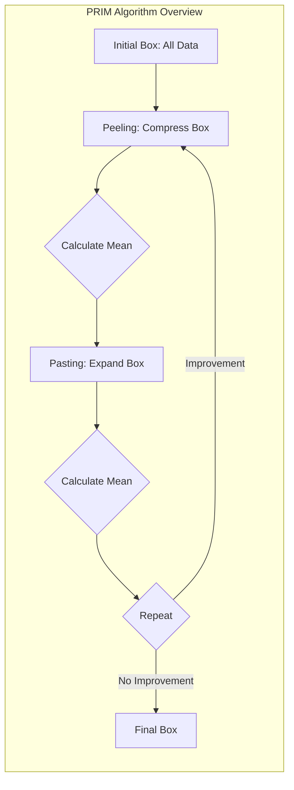
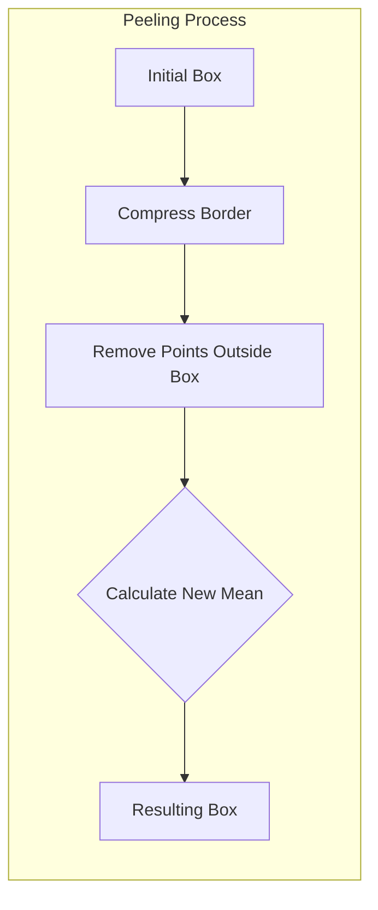
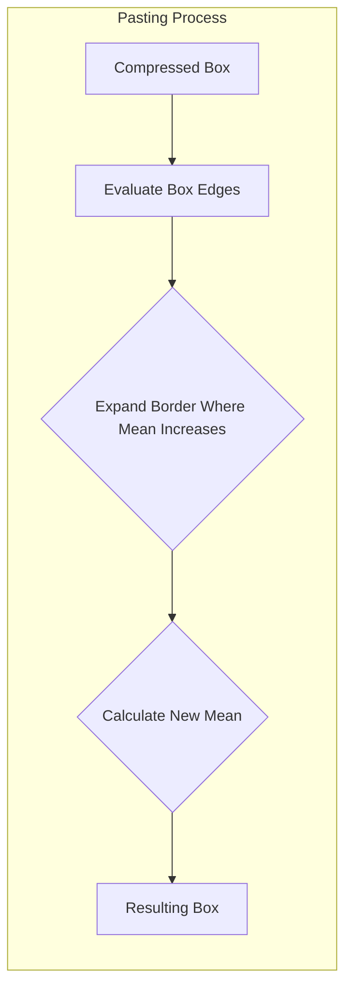
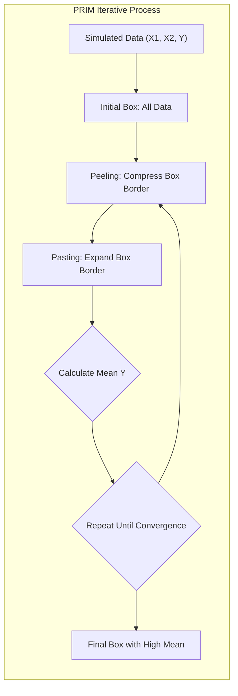
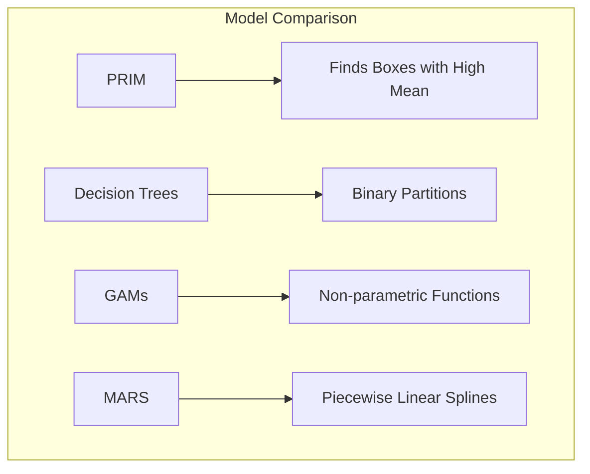
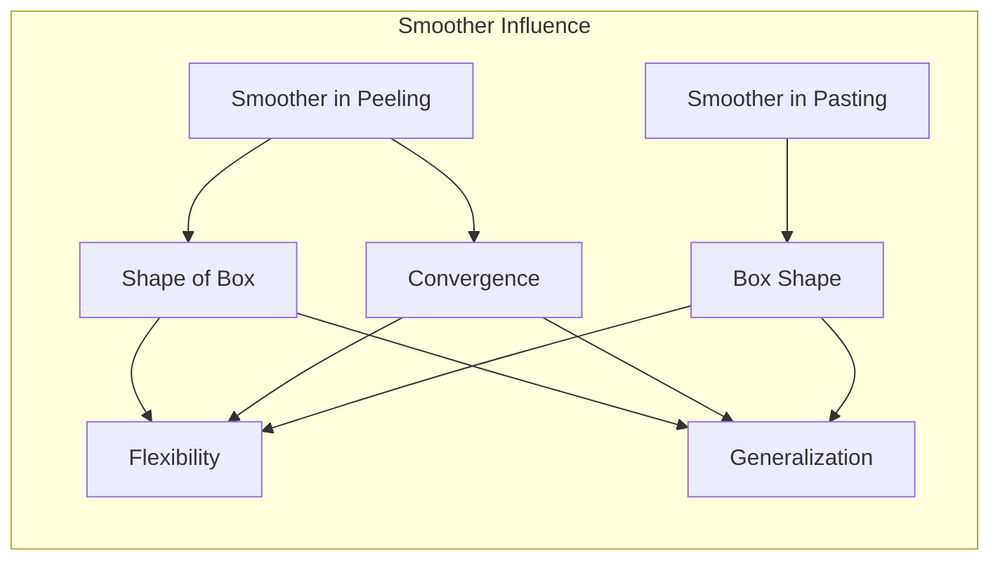

## Título: Modelos Aditivos, Árvores e Métodos Relacionados: Visualização da Construção de *Boxes* e Médias em PRIM com Dados Simulados



### Introdução

Este capítulo explora a construção de *boxes* pelo algoritmo PRIM (Patient Rule Induction Method) através da utilização de dados simulados, e como a média dos dados dentro dos *boxes* é modificada a cada iteração do algoritmo [^9.1]. O PRIM é um método que busca regiões no espaço de características onde a média da resposta é alta, e a construção dessas regiões (boxes) é realizada através de um processo iterativo de *peeling* e *pasting*. O objetivo principal é fornecer uma visão prática sobre o funcionamento do algoritmo PRIM, como a escolha dos parâmetros de *peeling* e *pasting* influenciam o resultado, e como a visualização do processo pode ajudar a compreender as etapas da modelagem. O capítulo também aborda como o uso de dados simulados auxilia na compreensão dos mecanismos de otimização do algoritmo PRIM e a sua capacidade de identificar regiões com alta média na variável resposta.

### Conceitos Fundamentais

**Conceito 1: O Algoritmo PRIM (Patient Rule Induction Method)**

O algoritmo PRIM (Patient Rule Induction Method) é um método para a busca de regiões (boxes) no espaço de características onde a média da variável resposta é alta. O algoritmo começa com um *box* que contém todos os dados e em seguida realiza um processo iterativo que envolve a compressão de uma borda do *box* e remoção dos pontos que ficam fora do *box*. O *box* resultante é aquele que mantém a maior média da variável resposta. Em seguida, o processo de *pasting* busca expandir o *box* para incluir observações que estão fora do *box* corrente. O algoritmo PRIM, por isso, busca regiões no espaço de características com altas médias da resposta, de forma iterativa.

**Lemma 1:** *O algoritmo PRIM busca regiões no espaço de características onde a média da variável resposta é alta, e o método utiliza um processo iterativo de compressão e expansão dos *boxes* para encontrar essas regiões*. O objetivo do PRIM é encontrar regiões com alta média da resposta [^9.3].

> 💡 **Exemplo Numérico:**
> Vamos considerar um conjunto de dados simulado com duas características ($X_1$ e $X_2$) e uma variável resposta ($Y$). Inicialmente, o *box* contém todos os pontos.
>
> ```python
> import numpy as np
> import matplotlib.pyplot as plt
>
> # Dados simulados
> np.random.seed(42)
> X1 = np.random.rand(100) * 10
> X2 = np.random.rand(100) * 10
> Y = 2 * (X1 > 5) + 3 * (X2 > 5) + np.random.randn(100)
>
> # Box inicial
> box_x1_min = min(X1)
> box_x1_max = max(X1)
> box_x2_min = min(X2)
> box_x2_max = max(X2)
>
> # Cálculo da média inicial
> mean_y_initial = np.mean(Y)
> print(f"Média inicial de Y: {mean_y_initial:.2f}")
>
> plt.figure(figsize=(6, 6))
> plt.scatter(X1, X2, c=Y, cmap='viridis')
> plt.xlabel("X1")
> plt.ylabel("X2")
> plt.title("Dados Simulados e Box Inicial")
> plt.show()
> ```
>
> Neste exemplo, a média inicial de Y é calculada, e o gráfico mostra os dados e o *box* inicial que abrange todos os pontos.

**Conceito 2: Processo de *Peeling* e Compressão do *Box***

O processo de *peeling* (remoção) envolve a compressão de uma borda do *box* por uma pequena fração dos dados, onde os pontos que são removidos são os que estão fora do *box* comprimido. O processo de compressão é feito na direção do preditor que resulta na maior média da resposta nos dados restantes. O processo é iterativo, onde em cada passo a borda do *box* é comprimida, e a média dos dados dentro do *box* é recalculada. A compressão do *box* resulta na remoção de pontos que não contribuem para o aumento da média da resposta, de acordo com o critério estabelecido pelo algoritmo. A escolha do passo da compressão, e de qual borda é comprimida, são passos importantes no processo de modelagem com o PRIM.

**Corolário 1:** *O processo de *peeling* remove as observações com baixa média na resposta, e comprime o *box* para uma região mais homogênea com maior média. A escolha da borda e o passo da compressão definem o comportamento do algoritmo*. O processo de *peeling* é guiado pela maximização da média da resposta [^9.3.1].



> 💡 **Exemplo Numérico:**
> Continuando o exemplo anterior, vamos realizar uma etapa de *peeling* comprimindo a borda de $X_1$ em 10%.
>
> ```python
> # Parâmetro de peeling
> peeling_fraction = 0.1
>
> # Peeling na borda X1
> box_x1_min_peeled = box_x1_min + (box_x1_max - box_x1_min) * peeling_fraction
>
> # Pontos dentro do novo box
> indices_inside_box = (X1 >= box_x1_min_peeled) & (X1 <= box_x1_max) & (X2 >= box_x2_min) & (X2 <= box_x2_max)
>
> # Cálculo da nova média
> mean_y_peeled = np.mean(Y[indices_inside_box])
>
> print(f"Média de Y após peeling em X1: {mean_y_peeled:.2f}")
>
> plt.figure(figsize=(6, 6))
> plt.scatter(X1[indices_inside_box], X2[indices_inside_box], c=Y[indices_inside_box], cmap='viridis', label='Dentro do Box')
> plt.scatter(X1[~indices_inside_box], X2[~indices_inside_box], c='gray', marker='x', label='Fora do Box')
> plt.xlabel("X1")
> plt.ylabel("X2")
> plt.title("Peeling em X1")
> plt.legend()
> plt.show()
>
> ```
>
> Neste exemplo, o *box* é comprimido em $X_1$, e a média é recalculada. Os pontos removidos são marcados com 'x'. A média dentro do box aumenta após o peeling.

**Conceito 3: Processo de *Pasting* e Expansão do *Box***

O processo de *pasting* (expansão) é uma etapa que busca expandir o *box* e incluir observações que foram removidas em etapas anteriores, utilizando como guia, a manutenção da alta média. Após a etapa de compressão, o algoritmo avalia todas as bordas do *box*, e expande aquelas onde a média aumenta. O processo é feito em cada borda do *box*, até que nenhuma expansão cause aumento da média, ou até que um critério de parada seja atingido. O processo de *pasting*, ao permitir a expansão do *box* de acordo com a média, compensa o processo de compressão e permite que o *box* se expanda para uma região com alta média.

> ⚠️ **Nota Importante:** Os processos de *peeling* e *pasting* são iterativos e permitem que o algoritmo PRIM encontre regiões no espaço de características com altas médias da resposta através de compressões e expansões do *box*. A combinação dos dois processos é o componente principal do algoritmo PRIM [^9.3.1].

> ❗ **Ponto de Atenção:** A escolha dos parâmetros de *peeling* e *pasting*, como o tamanho do passo da compressão e da expansão, influencia diretamente no tamanho dos *boxes*, na média e no número de observações em cada box. O ajuste desses parâmetros é importante para a qualidade do resultado final do algoritmo PRIM [^9.3.1].

> ✔️ **Destaque:** A combinação das abordagens de *peeling* e *pasting* é uma forma eficaz para a construção de *boxes* com alta média e que modelam regiões específicas do espaço de características [^9.3].



> 💡 **Exemplo Numérico:**
> Agora, vamos realizar um passo de *pasting* na borda de $X_1$.
>
> ```python
> # Parâmetro de pasting
> pasting_fraction = 0.05
>
> # Expansão na borda X1
> box_x1_min_pasted = box_x1_min_peeled - (box_x1_max - box_x1_min) * pasting_fraction
>
> # Pontos dentro do novo box
> indices_inside_box_pasted = (X1 >= box_x1_min_pasted) & (X1 <= box_x1_max) & (X2 >= box_x2_min) & (X2 <= box_x2_max)
>
> # Cálculo da nova média
> mean_y_pasted = np.mean(Y[indices_inside_box_pasted])
>
> print(f"Média de Y após pasting em X1: {mean_y_pasted:.2f}")
>
> plt.figure(figsize=(6, 6))
> plt.scatter(X1[indices_inside_box_pasted], X2[indices_inside_box_pasted], c=Y[indices_inside_box_pasted], cmap='viridis', label='Dentro do Box')
> plt.scatter(X1[~indices_inside_box_pasted], X2[~indices_inside_box_pasted], c='gray', marker='x', label='Fora do Box')
> plt.xlabel("X1")
> plt.ylabel("X2")
> plt.title("Pasting em X1")
> plt.legend()
> plt.show()
> ```
>
> Neste exemplo, o *box* é expandido em $X_1$, e a média é recalculada. A média pode aumentar ou diminuir dependendo dos dados incluídos. Este processo é repetido para todas as bordas e iterativamente.

### Visualização da Construção de Boxes com Dados Simulados: Peeling, Pasting e Variação da Média



Para ilustrar o funcionamento do algoritmo PRIM, é útil a utilização de dados simulados em duas dimensões, onde a variável resposta $Y$ assume valores altos em uma região específica do espaço de características, e um valor mais baixo fora dessa região. O processo de visualização envolve:

1.  **Dados Simulados:** Dados simulados em duas dimensões ($X_1$ e $X_2$), onde a resposta $Y$ assume um valor alto em uma região específica do espaço. A simulação pode ser utilizada com dados com diferentes níveis de ruído e diferentes tipos de padrões.
2.  **Visualização dos Dados:** Os dados simulados são visualizados em um gráfico de dispersão, onde a cor de cada ponto corresponde ao valor da resposta $Y$, ou a outra métrica desejada.
3.  **Visualização do *Box*:** O *box* inicial corresponde a todos os dados, e a cada iteração, o processo de compressão do *box* é visualizado no gráfico, de forma a observar como o *box* se adapta aos dados, e como os dados com baixa resposta vão sendo removidos.
4.  **Processo de *Peeling*:** A etapa de compressão do *box* é feita através da compressão de uma borda, onde a quantidade comprimida e a borda escolhida são definidas por parâmetros de escolha. Os pontos que são removidos a cada etapa são mostrados no gráfico, com um indicador visual da sua remoção.
5.  **Processo de *Pasting*:** Após a compressão, a etapa de expansão é feita, e é mostrado como o *box* se expande para incluir pontos que levam ao aumento da média, e como essa expansão permite explorar regiões com alta média. O *pasting*, por ser uma estratégia gulosa, busca aumentar a média e também expandir o *box*.
6.  **Visualização da Média:** A média da variável resposta dentro do *box* é calculada em cada iteração e mostrada no gráfico, demonstrando como a média evolui em função das decisões de compressão e expansão. O processo é iterativo, até que nenhum aumento na média ou outros critérios de parada sejam atingidos.

A visualização do processo iterativo do algoritmo PRIM, com compressão e expansão do *box*, e como a média da variável resposta varia durante o processo, oferece uma compreensão sobre como o PRIM funciona e como a escolha dos parâmetros de *peeling* e *pasting* influencia no modelo final.

**Lemma 4:** *A visualização do processo de construção dos *boxes* no algoritmo PRIM, utilizando dados simulados, permite que as diferentes etapas do algoritmo sejam entendidas de forma intuitiva, e como a combinação dos processos de compressão e expansão do *box*, buscam encontrar regiões no espaço de características onde a média da variável resposta é alta*. O uso de visualizações facilita a compreensão do comportamento de algoritmos de aprendizado supervisionado [^9.3].

### A Variação da Média Dentro do Box e o Impacto da Escolha dos Parâmetros

A média da variável resposta dentro do *box* muda a cada iteração, e a forma como essa média varia depende da escolha dos parâmetros de *peeling* e *pasting*. Um parâmetro de *peeling* muito alto pode remover muitos dados de uma vez, e um parâmetro de *peeling* muito baixo pode gerar um processo de compressão muito lento. Um parâmetro de *pasting* muito pequeno pode fazer com que o *box* não se expanda para áreas com alta média, e um parâmetro de *pasting* muito grande pode levar a expansões desnecessárias. A escolha dos parâmetros de compressão e expansão do *box* deve considerar a natureza dos dados, e a forma como a média da variável resposta varia ao longo do espaço de características. A escolha adequada dos parâmetros é importante para o resultado final do algoritmo PRIM, e a validação cruzada pode ser utilizada para guiar a escolha dos melhores valores dos parâmetros.

### Relação com Outros Métodos: Árvores de Decisão, GAMs e MARS

Embora o PRIM seja diferente em sua abordagem de construção dos *boxes* comparado a árvores de decisão e MARS, os três métodos buscam encontrar relações entre os preditores e a resposta, com a ideia de particionar o espaço dos dados. Árvores de decisão utilizam divisões binárias para criar regiões no espaço, GAMs utilizam funções não paramétricas para modelar relações não lineares, e MARS utiliza funções *spline* lineares por partes. Enquanto árvores de decisão focam em decisões locais, GAMs utilizam uma modelagem global através das funções não paramétricas, e MARS utiliza uma combinação de ambos. Cada modelo tem suas vantagens e desvantagens, e a sua escolha depende da natureza dos dados, e dos objetivos da modelagem. O PRIM oferece uma abordagem alternativa para encontrar regiões específicas do espaço de características que podem auxiliar a construção e interpretação dos modelos.



### Perguntas Teóricas Avançadas: Como a natureza do suavizador utilizado no *peeling* e *pasting* afeta a convergência, a forma final do *box* e a estabilidade do algoritmo PRIM, e como essa escolha se relaciona com a função de custo?

**Resposta:**

A natureza do suavizador utilizado nas etapas de *peeling* e *pasting* no algoritmo PRIM tem um impacto significativo na sua convergência, na forma final do *box* e na estabilidade do algoritmo, e como esta escolha se relaciona com a função de custo, e o seu comportamento.

Durante o processo de *peeling*, o suavizador é utilizado para decidir quais pontos devem ser removidos, e como a borda do *box* é comprimida. Um suavizador mais flexível pode resultar em um *box* com contornos mais irregulares, que se adaptam aos dados de treino com mais precisão, mas com maior risco de *overfitting* e menor capacidade de generalização. Um suavizador mais rígido resulta em um *box* com contornos mais suaves, que têm maior estabilidade, e tendem a capturar os padrões de forma mais geral. A escolha do suavizador, portanto, afeta a forma como o *box* se ajusta aos dados e a capacidade do modelo de representar as informações.

During the *pasting* process, the role of the smoother is to define how the *box* edges are expanded, and the need to include a given point. A more flexible smoother can lead to a box with more irregular contours, which may include points with a lower mean. A more rigid smoother, on the other hand, leads to a *box* with smoother and more homogeneous contours. The choice of the smoother in the *pasting* step is crucial to control the shape of the final *box* and ensure that it is a good representative of the high mean region.

O uso de um suavizador adequado também afeta a convergência do algoritmo. Suavizadores mais flexíveis podem fazer com que o algoritmo PRIM demore mais para convergir, pois a escolha dos parâmetros de *peeling* e *pasting* se torna mais sensível. Suavizadores mais rígidos podem levar a um algoritmo que converge mais rapidamente, mas com uma perda na qualidade do ajuste. A escolha do suavizador adequado deve considerar a natureza dos dados e o *trade-off* entre flexibilidade, convergência e capacidade de generalização.

A escolha do suavizador, portanto, tem um impacto direto no comportamento do algoritmo PRIM. No entanto, a escolha do suavizador, por si só, não define a função de custo, mas sim a forma como o algoritmo se comporta durante a otimização e como ele encontra as regiões no espaço de características. A função de custo do PRIM é definida implicitamente pelo seu objetivo de encontrar regiões com alta média. A relação com outros modelos, como GAMs, que utilizam uma função de custo explicita para controlar a flexibilidade e o ajuste dos dados, é importante para entender a diferença nas abordagens de cada um dos métodos.



**Lemma 5:** *A escolha do suavizador utilizado nas etapas de peeling e pasting influencia a forma do *box* resultante, a convergência do algoritmo e a sua capacidade de generalização. Suavizadores mais flexíveis levam a *boxes* mais complexos, e suavizadores mais rígidos levam a *boxes* mais suaves. A escolha adequada do suavizador é importante para o bom desempenho do algoritmo PRIM* [^9.3.1].

**Corolário 5:** *A combinação das etapas de peeling e pasting, com a escolha do suavizador apropriado, influencia o comportamento do algoritmo PRIM e a sua capacidade de encontrar regiões no espaço de características com alta média. A natureza do suavizador tem um grande impacto no processo de otimização e na forma como o algoritmo se adapta a diferentes tipos de dados* [^9.3].

> ⚠️ **Ponto Crucial**: A escolha do suavizador é um componente fundamental do algoritmo PRIM, e sua natureza tem um impacto direto na forma dos *boxes* resultantes, na sua convergência e na sua capacidade de aproximação da função resposta. A escolha do suavizador e dos parâmetros de *peeling* e *pasting* deve ser feita com cuidado para garantir que os modelos sejam robustos, com alta capacidade de generalização e uma boa interpretação das regiões com altas médias [^9.3].

### Conclusão

Este capítulo explorou a construção de *boxes* e a variação da média utilizando o algoritmo PRIM com dados simulados, mostrando como o processo de compressão e expansão, guiados pelo critério de alta média, são utilizados para encontrar regiões específicas no espaço de características. A discussão detalhou a importância dos parâmetros de *peeling* e *pasting* no comportamento do algoritmo e na sua relação com outros modelos estatísticos. A compreensão das propriedades do algoritmo PRIM permite a sua utilização de forma eficaz em problemas de busca de regiões específicas no espaço de características, e sua relação com o método da máxima verossimilhança.

### Footnotes

[^4.1]: "In this chapter we begin our discussion of some specific methods for super-vised learning. These techniques each assume a (different) structured form for the unknown regression function, and by doing so they finesse the curse of dimensionality. Of course, they pay the possible price of misspecifying the model, and so in each case there is a tradeoff that has to be made." *(Trecho de "Additive Models, Trees, and Related Methods")*

[^4.2]: "Regression models play an important role in many data analyses, providing prediction and classification rules, and data analytic tools for understand-ing the importance of different inputs." *(Trecho de "Additive Models, Trees, and Related Methods")*

[^4.3]: "In this section we describe a modular algorithm for fitting additive models and their generalizations. The building block is the scatterplot smoother for fitting nonlinear effects in a flexible way. For concreteness we use as our scatterplot smoother the cubic smoothing spline described in Chapter 5." *(Trecho de "Additive Models, Trees, and Related Methods")*

[^4.3.1]: "The additive model has the form $Y = \alpha + \sum_{j=1}^p f_j(X_j) + \epsilon$, where the error term $\epsilon$ has mean zero." * (Trecho de "Additive Models, Trees, and Related Methods")*

[^4.3.2]: "Given observations $x_i, y_i$, a criterion like the penalized sum of squares (5.9) of Section 5.4 can be specified for this problem, $PRSS(\alpha, f_1, f_2,\ldots, f_p) = \sum_i^N (y_i - \alpha - \sum_j^p f_j(x_{ij}))^2 + \sum_j^p \lambda_j \int (f_j''(t_j))^2 dt_j$" * (Trecho de "Additive Models, Trees, and Related Methods")*

[^4.3.3]: "where the $\lambda_j > 0$ are tuning parameters. It can be shown that the minimizer of (9.7) is an additive cubic spline model; each of the functions $f_j$ is a cubic spline in the component $X_j$, with knots at each of the unique values of $x_{ij}$, $i = 1,\ldots, N$." *(Trecho de "Additive Models, Trees, and Related Methods")*

[^4.4]: "For two-class classification, recall the logistic regression model for binary data discussed in Section 4.4. We relate the mean of the binary response $\mu(X) = Pr(Y = 1|X)$ to the predictors via a linear regression model and the logit link function: $log(\mu(X)/(1 – \mu(X)) = \alpha + \beta_1 X_1 + \ldots + \beta_pX_p$." * (Trecho de "Additive Models, Trees, and Related Methods")*

[^4.4.1]: "The additive logistic regression model replaces each linear term by a more general functional form: $log(\mu(X)/(1 – \mu(X))) = \alpha + f_1(X_1) + \cdots + f_p(X_p)$, where again each $f_j$ is an unspecified smooth function." * (Trecho de "Additive Models, Trees, and Related Methods")*

[^4.4.2]: "While the non-parametric form for the functions $f_j$ makes the model more flexible, the additivity is retained and allows us to interpret the model in much the same way as before. The additive logistic regression model is an example of a generalized additive model." *(Trecho de "Additive Models, Trees, and Related Methods")*

[^4.4.3]: "In general, the conditional mean $\mu(X)$ of a response $Y$ is related to an additive function of the predictors via a link function $g$: $g[\mu(X)] = \alpha + f_1(X_1) + \cdots + f_p(X_p)$." *(Trecho de "Additive Models, Trees, and Related Methods")*

[^4.4.4]: "Examples of classical link functions are the following: $g(\mu) = \mu$ is the identity link, used for linear and additive models for Gaussian response data." *(Trecho de "Additive Models, Trees, and Related Methods")*

[^4.4.5]: "$g(\mu) = logit(\mu)$ as above, or $g(\mu) = probit(\mu)$, the probit link function, for modeling binomial probabilities. The probit function is the inverse Gaussian cumulative distribution function: $probit(\mu) = \Phi^{-1}(\mu)$." *(Trecho de "Additive Models, Trees, and Related Methods")*

[^4.5]: "All three of these arise from exponential family sampling models, which in addition include the gamma and negative-binomial distributions. These families generate the well-known class of generalized linear models, which are all extended in the same way to generalized additive models." *(Trecho de "Additive Models, Trees, and Related Methods")*

[^4.5.1]: "The functions $f_j$ are estimated in a flexible manner, using an algorithm whose basic building block is a scatterplot smoother. The estimated func-tion $f_j$ can then reveal possible nonlinearities in the effect of $X_j$. Not all of the functions $f_j$ need to be nonlinear." *(Trecho de "Additive Models, Trees, and Related Methods")*

[^4.5.2]: "We can easily mix in linear and other parametric forms with the nonlinear terms, a necessity when some of the inputs are qualitative variables (factors)." *(Trecho de "Additive Models, Trees, and Related Methods")*

[^9.1]: "In this chapter we begin our discussion of some specific methods for super-vised learning. These techniques each assume a (different) structured form for the unknown regression function, and by doing so they finesse the curse of dimensionality. Of course, they pay the possible price of misspecifying the model, and so in each case there is a tradeoff that has to be made. We describe five related techniques: generalized additive models, trees, multivariate adaptive regression splines, the patient rule induction method, and hierarchical mixtures of experts." *(Trecho de "Additive Models, Trees, and Related Methods")*

[^9.3]: "Tree-based methods partition the feature space into box-shaped regions, to try to make the response averages in each box as differ-ent as possible. The splitting rules defining the boxes are related to each through a binary tree, facilitating their interpretation." *(Trecho de "Additive Models, Trees, and Related Methods")*

[^9.3.1]: "The patient rule induction method (PRIM) also finds boxes in the feature space, but seeks boxes in which the response average is high. Hence it looks for maxima in the target function, an exercise known as bump hunting. (If minima rather than maxima are desired, one simply works with the negative response values.) PRIM also differs from tree-based partitioning methods in that the box definitions are not described by a binary tree. This makes interpretation of the collection of rules more difficult; however, by removing the binary tree constraint, the individual rules are often simpler. The main box construction method in PRIM works from the top down, starting with a box containing all of the data. The box is compressed along one face by a small amount, and the observations then falling outside the box are peeled off. The face chosen for compression is the one resulting in the largest box mean, after the compression is performed. Then the process is repeated, stopping when the current box contains some minimum number of data points." *(Trecho de "Additive Models, Trees, and Related Methods")*
