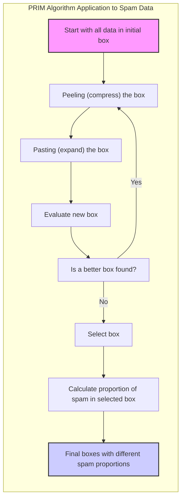
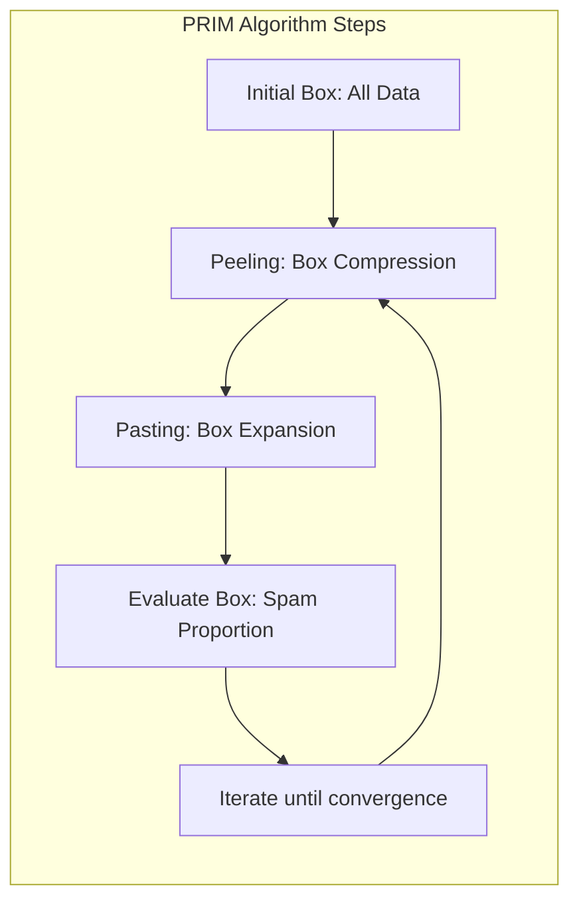
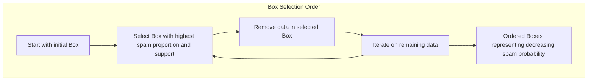
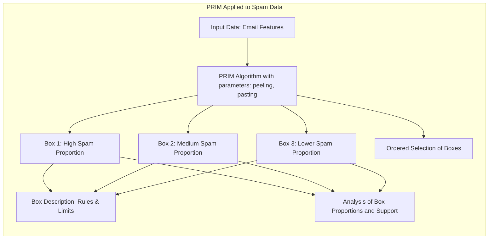
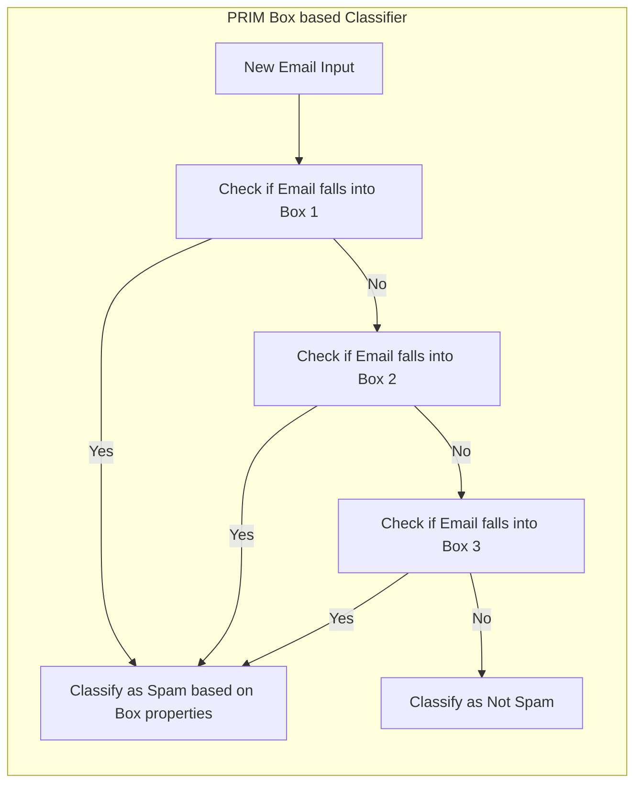
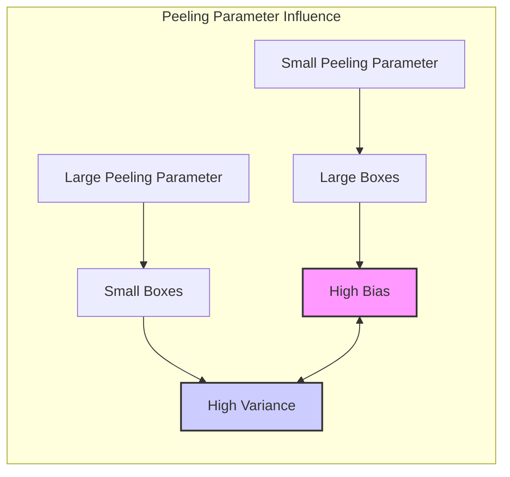
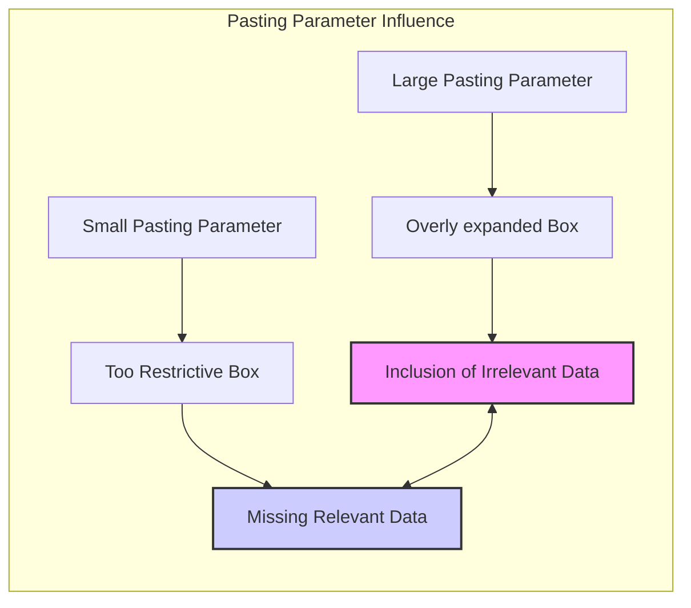

## Título: Modelos Aditivos, Árvores e Métodos Relacionados: Aplicação do PRIM em Dados de Spam e Descrição dos *Boxes* com Proporções



### Introdução

Este capítulo apresenta uma análise detalhada da aplicação do algoritmo PRIM (Patient Rule Induction Method) ao conjunto de dados de email spam, focando na descrição dos *boxes* selecionados pelo algoritmo e na ordem em que são criados, usando as proporções de emails spam e não spam dentro de cada *box* [^9.1]. O algoritmo PRIM busca encontrar regiões no espaço de características onde a média da variável resposta é alta, ou seja, onde a proporção de emails spam é alta, e pode ser utilizado para gerar regras de classificação mais simples, embora os *boxes* não sejam hierárquicos como em árvores de decisão. O objetivo principal é demonstrar o funcionamento do PRIM em um problema real de classificação, como os *boxes* são descritos, a sua relação com as proporções de spam e não spam e como os parâmetros do PRIM influenciam a seleção dos *boxes*.

### Conceitos Fundamentais

**Conceito 1: O Algoritmo PRIM e a Proporção de Emails Spam**

O algoritmo PRIM (Patient Rule Induction Method) busca regiões (boxes) no espaço de características onde a média da variável resposta é alta [^9.3]. No contexto do problema de classificação de email spam, o algoritmo PRIM busca regiões onde a proporção de emails spam é alta, ou seja, onde a probabilidade de um email ser spam é alta. O algoritmo começa com um *box* que contém todos os dados, e através de etapas de *peeling* (compressão) e *pasting* (expansão), busca um *box* com alta média, ou seja, uma alta proporção de emails spam. As decisões do algoritmo são tomadas com o objetivo de encontrar regiões com alta probabilidade de spam, de acordo com o problema específico.

> 💡 **Exemplo Numérico:**
>
> Imagine que temos um conjunto de dados com 1000 emails, onde 300 são spam e 700 não são spam. Inicialmente, o PRIM começa com um *box* que contém todos os 1000 emails. A proporção inicial de spam neste *box* é 300/1000 = 0.3 ou 30%. O algoritmo então realiza *peeling* e *pasting* para encontrar um *box* com uma proporção de spam mais alta. Suponha que após algumas iterações, o algoritmo encontre um *box* com 100 emails, dos quais 80 são spam. A proporção de spam neste novo *box* é 80/100 = 0.8 ou 80%, indicando uma região mais propensa a conter spam. O objetivo do PRIM é encontrar esses *boxes* com proporções de spam cada vez maiores.

**Lemma 1:** *O algoritmo PRIM busca regiões no espaço de características com alta proporção de emails spam. As etapas de *peeling* e *pasting* são utilizadas para comprimir e expandir os *boxes*, e guiar o algoritmo até regiões com alta probabilidade de spam*. O objetivo do algoritmo é encontrar regiões com um grande número de emails spam [^9.3].



**Conceito 2: Descrição dos *Boxes* Utilizando Proporções de Spam e Não Spam**

Cada *box* gerado pelo algoritmo PRIM pode ser descrito utilizando as proporções de emails spam e não spam dentro do *box*, além do suporte, que representa a proporção de observações do conjunto de dados que estão dentro do *box*. O suporte, o número de observações e a proporção de emails spam são métricas que permitem compreender a natureza e a qualidade do *box*. Por exemplo, um *box* com alta proporção de emails spam e um alto suporte pode representar uma região importante no espaço de características para a detecção de spam. Um *box* com alta proporção de spam e baixo suporte pode representar um padrão específico, mas que só é válido para poucos dados. A análise das proporções de spam e não spam, e do suporte, permite entender o comportamento do algoritmo e a sua capacidade de encontrar padrões relevantes nos dados. A proporção de emails spam é dada por:
$$
P(\text{spam}) = \frac{\text{Número de Emails Spam}}{\text{Número Total de Emails}}
$$

> 💡 **Exemplo Numérico:**
>
> Vamos supor que o PRIM encontrou três *boxes* em nosso conjunto de dados de emails:
>
> -   **Box 1:** Contém 500 emails, dos quais 100 são spam. A proporção de spam é 100/500 = 0.2 (20%). O suporte deste *box* é 500/1000 = 0.5 (50%), assumindo que o dataset original tem 1000 emails.
> -   **Box 2:** Contém 100 emails, dos quais 80 são spam. A proporção de spam é 80/100 = 0.8 (80%). O suporte deste *box* é 100/1000 = 0.1 (10%).
> -   **Box 3:** Contém 20 emails, dos quais 18 são spam. A proporção de spam é 18/20 = 0.9 (90%). O suporte deste *box* é 20/1000 = 0.02 (2%).
>
>   Analisando esses *boxes*, vemos que o *Box 3* tem a maior proporção de spam (90%), mas o menor suporte (2%), o que significa que é uma região muito específica e pequena. O *Box 1* tem o maior suporte (50%), mas a menor proporção de spam (20%). O *Box 2* apresenta um bom balanço entre proporção de spam (80%) e suporte (10%). Essa análise permite entender como os *boxes* capturam diferentes regiões do espaço de dados.

**Corolário 1:** *A proporção de emails spam e não spam em cada *box* descreve a homogeneidade do *box* e a sua capacidade de discriminar entre spam e não spam. A descrição dos boxes, através das proporções, permite avaliar o seu desempenho e a sua capacidade de representar regiões relevantes para o problema*. A proporção de spam é um critério importante para avaliar a qualidade de um *box* [^9.3.1].

```mermaid
graph LR
    subgraph "Box Description Metrics"
        A["Box"]
        B["Spam Proportion: P(spam) = \"Number of Spam Emails\" / \"Total Number of Emails\""]
        C["Non-Spam Proportion: 1 - P(spam)"]
        D["Support: Proportion of total data in box"]
        A --> B
        A --> C
        A --> D
    end
```

**Conceito 3: A Ordem de Seleção dos *Boxes***

A ordem em que os *boxes* são selecionados pelo algoritmo PRIM também é importante. O algoritmo inicia com o *box* que contém todos os dados e, em seguida, busca o *box* que tem a maior média e o maior suporte. O algoritmo então busca o *box* que tem a maior média entre os dados restantes, e remove os dados do *box* anterior. O processo é iterativo e a ordem em que os *boxes* são selecionados reflete a importância relativa das regiões identificadas pelo algoritmo. A ordem de seleção dos *boxes* é útil para entender como as diferentes regiões do espaço de características contribuem para a modelagem e análise do problema. A ordem de seleção dos *boxes* é guiada pela média da variável resposta, e pelos critérios de *peeling* e *pasting*, o que faz com que os primeiros boxes sejam os mais relevantes para o problema.

> 💡 **Exemplo Numérico:**
>
> Suponha que o PRIM, após iniciar com todos os dados, encontrou os seguintes *boxes* em ordem:
>
> 1.  **Box 1:** Proporção de spam = 75%, Suporte = 20%
> 2.  **Box 2:** Proporção de spam = 60%, Suporte = 15%
> 3.  **Box 3:** Proporção de spam = 50%, Suporte = 10%
>
>   Neste caso, o *Box 1* foi selecionado primeiro porque, entre todos os possíveis *boxes* após a primeira iteração, ele tinha a maior proporção de spam combinada com um suporte razoável. Depois de remover os dados associados ao *Box 1*, o algoritmo encontrou o *Box 2* com uma alta proporção de spam nos dados restantes, e assim por diante. A ordem de seleção indica que o *Box 1* é a região mais relevante para a detecção de spam, seguido pelo *Box 2* e depois pelo *Box 3*.

> ⚠️ **Nota Importante:** A ordem de seleção dos *boxes* no algoritmo PRIM reflete a sua importância relativa, onde os primeiros *boxes* tendem a ser os mais relevantes para o problema de classificação de emails como spam [^9.3].

> ❗ **Ponto de Atenção:** Os parâmetros do PRIM, como o passo do *peeling* e do *pasting*, influenciam a ordem de seleção dos *boxes* e o tamanho dos *boxes*. A escolha desses parâmetros deve considerar as características dos dados e o objetivo da modelagem [^9.3.1].

> ✔️ **Destaque:** O algoritmo PRIM seleciona os *boxes* de forma iterativa, e a ordem em que os *boxes* são selecionados indica a sua importância relativa na modelagem do problema. A análise da ordem de seleção dos *boxes* permite identificar as regiões do espaço de características que são mais relevantes para a classificação de emails spam [^9.3].



### Descrição dos Boxes, Seleção e Análise das Proporções em Dados de Spam utilizando PRIM



A aplicação do algoritmo PRIM aos dados de email spam envolve a escolha de parâmetros de *peeling* e *pasting* e a avaliação dos *boxes* obtidos. O algoritmo busca regiões no espaço de características onde a proporção de emails spam é alta. Para cada *box* obtido, os seguintes dados podem ser analisados:

1.  **Proporção de Emails Spam e Não Spam:** Para cada *box*, é calculada a proporção de emails spam e não spam, onde:

$$
P(\text{spam}) = \frac{\text{Número de Emails Spam}}{\text{Número Total de Emails}}
$$
e a proporção de emails não spam é dada por $1 - P(\text{spam})$.
A comparação das proporções em diferentes *boxes* permite avaliar a capacidade do *box* de separar as classes, e a qualidade do *box* para classificar emails como spam. *Boxes* com alta proporção de spam são importantes para o modelo final.

2.  **Suporte do *Box***: O suporte representa a proporção de observações que estão dentro do *box* em relação ao número total de observações no conjunto de dados. O suporte define a relevância do *box*, e *boxes* com alto suporte representam regiões onde o modelo tem um maior poder preditivo. *Boxes* com baixo suporte, por outro lado, representam regiões menos importantes e que podem ser ignoradas no modelo final. O suporte do *box* representa a sua relevância no contexto dos dados.
3.  **Ordem de Seleção dos *Boxes***: A análise da ordem de seleção dos *boxes* pelo algoritmo PRIM permite entender a importância relativa de cada região para o modelo. Os primeiros *boxes* selecionados, em geral, são os mais relevantes para a modelagem do problema. A ordem de seleção dos *boxes* permite entender como o PRIM encontra as regiões com maior concentração de emails spam.
4.  **Descrição do *Box***: A descrição do *box* é feita utilizando as regras de divisão (se houver) e os limites do *box* nos diferentes preditores. A descrição dos *boxes* pode incluir, por exemplo, que um dado *box* representa as observações onde a frequência da palavra "free" é superior a um dado limiar, e a frequência de uma outra palavra "money" é inferior a um outro limiar, o que permite entender as características dos dados dentro de cada *box*.
5.   **Parâmetros de *Peeling* e *Pasting***: Os parâmetros de *peeling* e *pasting*, como a quantidade de dados removida ou adicionada no *peeling* ou *pasting* são utilizados para ajustar o modelo e controlar a complexidade dos *boxes*. A escolha desses parâmetros influencia diretamente o resultado final da modelagem e deve ser feita cuidadosamente através de métodos de validação cruzada ou através de conhecimento prévio sobre os dados.

> 💡 **Exemplo Numérico:**
>
> Suponha que, após aplicar o PRIM a um conjunto de dados de spam, obtivemos os seguintes *boxes*:
>
> | Box | Proporção Spam | Proporção Não Spam | Suporte | Descrição                                                                                                                                                                                                                                                                                                                                                                                    |
> | --- | -------------- | ------------------ | -------- | ----------------------------------------------------------------------------------------------------------------------------------------------------------------------------------------------------------------------------------------------------------------------------------------------------------------------------------------------------------------------------------- |
> | 1   | 0.85           | 0.15               | 0.15     | Frequência da palavra "free" > 0.2 e frequência da palavra "money" > 0.1                                                                                                                                                                                                                                                                                                  |
> | 2   | 0.70           | 0.30               | 0.20     | Frequência da palavra "discount" > 0.3 e número de exclamações > 3                                                                                                                                                                                                                                                                                                         |
> | 3   | 0.60           | 0.40               | 0.10     | Frequência da palavra "viagra" > 0.1 e comprimento do email > 500                                                                                                                                                                                                                                                                                                       |
>
> A análise desta tabela revela que:
>
> -   O *Box 1* tem a maior proporção de spam (85%) e um suporte de 15%, indicando uma região com alta concentração de spam, onde as palavras "free" e "money" aparecem com alta frequência.
> -   O *Box 2* tem uma proporção de spam de 70% e um suporte de 20%, representando emails com a palavra "discount" e um número elevado de exclamações.
> -   O *Box 3* tem uma proporção de spam de 60% e um suporte de 10%, caracterizando emails com a palavra "viagra" e um comprimento maior.
>
> Esta análise, juntamente com a ordem em que os *boxes* foram selecionados, permite entender quais regiões do espaço de características são mais propensas a conter emails de spam.

A análise conjunta dessas métricas fornece uma compreensão detalhada sobre como o algoritmo PRIM opera e como ele cria *boxes* que representam regiões do espaço de características com alta proporção de emails spam, onde a média da variável resposta é alta. A utilização de tabelas e visualizações permite apresentar os resultados de forma clara e concisa.

**Lemma 4:** *A descrição dos *boxes*, a análise das proporções de emails spam e não spam, e a avaliação do suporte, em conjunto com a ordem de seleção dos *boxes* pelo algoritmo PRIM, permite a criação de modelos que representam regiões do espaço de características com alta concentração de emails spam*. A caracterização dos *boxes* é fundamental para a sua utilização na modelagem [^4.5.1].

### Relação da Abordagem PRIM com Modelos de Classificação e Avaliação da Performance

Os *boxes* obtidos pelo algoritmo PRIM podem ser utilizados como base para a construção de modelos de classificação. Por exemplo, uma nova observação pode ser classificada como spam se ela cair em algum dos *boxes* selecionados pelo algoritmo. O uso das proporções dos *boxes* e dos seus respectivos suportes pode ser utilizada para construir classificadores mais complexos, onde cada *box* tem um peso associado à sua relevância. A utilização de métricas de desempenho como sensibilidade, especificidade e erro de classificação pode ser utilizada para avaliar a qualidade do classificador. A abordagem PRIM, portanto, pode gerar modelos de classificação com características específicas, diferentes de árvores de decisão, GAMs e outros modelos lineares ou não lineares.



> 💡 **Exemplo Numérico:**
>
> Suponha que temos um novo email que precisa ser classificado. Após aplicar o PRIM, temos os seguintes *boxes* com suas respectivas proporções de spam e suportes:
>
> | Box | Proporção Spam | Suporte |
> | --- | ------------- | ------- |
> | 1   | 0.85          | 0.15    |
> | 2   | 0.70          | 0.20    |
> | 3   | 0.60          | 0.10    |
>
> Se o novo email cair dentro do *Box 1*, podemos classificá-lo como spam com uma alta confiança, pois a proporção de spam neste *box* é de 85%. Se cair no *Box 2*, ainda é provável que seja spam (70%). Se não cair em nenhum *box*, ou cair em um *box* com baixa proporção de spam, podemos classificá-lo como não spam. Além disso, podemos criar um classificador que atribui um score de spam baseado na proporção de spam e no suporte dos *boxes* onde o email se encontra. Por exemplo, um email no *Box 1* receberia um score maior do que um email no *Box 3*. Podemos também usar uma combinação linear das proporções de spam e dos suportes, para construir um classificador mais complexo. A avaliação deste classificador pode ser feita usando métricas como sensibilidade (a proporção de emails spam que são corretamente classificados) e especificidade (a proporção de emails não spam que são corretamente classificados), e a área sob a curva ROC.

### Limitações da Análise Baseada no Algoritmo PRIM

Apesar das vantagens do PRIM, o método tem limitações. A natureza gulosa do algoritmo significa que a solução encontrada pode não ser ótima globalmente. O PRIM também não possui um mecanismo intrínseco para modelar interações complexas entre os preditores. A escolha adequada dos parâmetros de *peeling* e *pasting* também é importante, e deve ser feita utilizando validação cruzada ou outros métodos de escolha de modelos. A interpretação dos *boxes*, quando há muitas variáveis e muitos *boxes*, pode se tornar um processo mais complexo, o que dificulta o uso do PRIM em problemas de alta dimensionalidade.

### Perguntas Teóricas Avançadas: Como a escolha dos parâmetros de *peeling* e *pasting* no algoritmo PRIM afeta a qualidade dos *boxes* resultantes, a distribuição do erro de classificação e como esses parâmetros se relacionam com o trade-off entre bias e variância na modelagem?

**Resposta:**

A escolha dos parâmetros de *peeling* e *pasting* no algoritmo PRIM tem um impacto direto na qualidade dos *boxes* resultantes, na distribuição do erro de classificação, e no *trade-off* entre *bias* e variância da modelagem.



O parâmetro de *peeling*, que define a proporção de dados removidos a cada etapa, controla a complexidade dos *boxes*. Parâmetros de *peeling* muito baixos levam a *boxes* com muitas observações, o que pode resultar em um ajuste ruim aos dados e um alto bias, ou seja, o modelo não captura a região de interesse de forma precisa. Parâmetros de *peeling* muito altos podem levar a *boxes* muito pequenos, o que pode resultar em modelos instáveis e com alta variância, e que não modelam o padrão de forma robusta. A escolha do parâmetro de *peeling* deve ser feita considerando o *trade-off* entre *bias* e variância.

> 💡 **Exemplo Numérico:**
>
> Vamos considerar um exemplo com 1000 emails. Se usarmos um parâmetro de *peeling* muito baixo, digamos 1%, o PRIM removerá apenas 10 emails em cada iteração. Isso pode levar a *boxes* grandes e com uma mistura de emails spam e não spam, o que resulta em um modelo com alto *bias*. Por outro lado, se usarmos um parâmetro de *peeling* muito alto, como 20%, o PRIM removerá 200 emails a cada iteração, resultando em *boxes* muito pequenos que podem ser específicos demais, levando a um modelo com alta *variância*.

O parâmetro de *pasting*, que define como o *box* é expandido para incluir novas observações, também influencia a forma do *box* final e o seu ajuste aos dados. Parâmetros de *pasting* muito altos levam a expansões muito grandes, o que pode levar a *boxes* com muitos dados não relevantes, enquanto parâmetros muito baixos podem levar a *boxes* muito restritos que não capturam regiões importantes do espaço de dados.

> 💡 **Exemplo Numérico:**
>
> Imagine que após uma etapa de *peeling*, temos um *box* com 100 emails, e aplicamos o *pasting*. Se o parâmetro de *pasting* for muito alto, o *box* pode ser expandido muito rapidamente, incluindo emails que não são realmente representativos da região de alta concentração de spam, o que prejudica a precisão do modelo. Se o parâmetro de *pasting* for muito baixo, o *box* pode ficar muito restrito, perdendo a oportunidade de incluir emails relevantes.

A escolha apropriada dos parâmetros de *peeling* e *pasting* permite um bom ajuste aos dados de treino e uma capacidade de generalização adequada para dados não vistos. A distribuição do erro de classificação nas regiões definidas pelos *boxes* também depende da escolha desses parâmetros, onde valores adequados de *peeling* e *pasting* permitem obter um modelo com bom desempenho, e com baixa variância e *bias*. A escolha dos parâmetros, portanto, é importante para a qualidade final do modelo. A escolha adequada dos parâmetros também é fundamental para mitigar a natureza gulosa do algoritmo.



**Lemma 5:** *A escolha dos parâmetros de *peeling* e *pasting* no algoritmo PRIM tem um impacto direto na qualidade dos *boxes* resultantes, na sua capacidade de capturar regiões com alta média da variável resposta, e também no *trade-off* entre *bias* e variância. A escolha adequada desses parâmetros deve ser feita considerando a natureza dos dados e o objetivo do modelo*. A escolha dos parâmetros de *peeling* e *pasting* afeta diretamente as propriedades do modelo final [^9.3.1].

**Corolário 5:** *O uso de parâmetros de *peeling* e *pasting* adequados resulta em *boxes* que representam regiões com alta média e baixa variância, e a escolha desses parâmetros deve ser feita com métodos de avaliação e validação cruzada, para que o modelo tenha um bom desempenho*. A escolha dos parâmetros de *peeling* e *pasting* afeta a capacidade de generalização e o desempenho do modelo em dados não vistos [^9.3].

> ⚠️ **Ponto Crucial**: A escolha adequada dos parâmetros de *peeling* e *pasting* e do tipo de suavizador utilizado no algoritmo PRIM é fundamental para obter modelos que capturem as relações entre os preditores e a resposta, e que tenham uma boa capacidade de generalização e estabilidade. A escolha dos parâmetros de *peeling* e *pasting* é uma parte crucial do processo de modelagem [^9.3].

### Conclusão

Este capítulo explorou a aplicação do algoritmo PRIM em dados de email spam, detalhando a descrição dos *boxes*, a análise das proporções de spam e não spam, e a ordem de seleção das regiões do espaço de características. A discussão apresentou a importância das técnicas de *peeling* e *pasting* e como a sua combinação permite a obtenção de modelos com alta capacidade preditiva. A compreensão da natureza do algoritmo PRIM e de seus parâmetros permite a sua aplicação em diferentes problemas de modelagem estatística.

### Footnotes

[^4.1]: "In this chapter we begin our discussion of some specific methods for super-vised learning. These techniques each assume a (different) structured form for the unknown regression function, and by doing so they finesse the curse of dimensionality. Of course, they pay the possible price of misspecifying the model, and so in each case there is a tradeoff that has to be made." *(Trecho de "Additive Models, Trees, and Related Methods")*

[^4.2]: "Regression models play an important role in many data analyses, providing prediction and classification rules, and data analytic tools for understand-ing the importance of different inputs." *(Trecho de "Additive Models, Trees, and Related Methods")*

[^4.3]: "In this section we describe a modular algorithm for fitting additive models and their generalizations. The building block is the scatterplot smoother for fitting nonlinear effects in a flexible way. For concreteness we use as our scatterplot smoother the cubic smoothing spline described in Chapter 5." *(Trecho de "Additive Models, Trees, and Related Methods")*

[^4.3.1]: "The additive model has the form $Y = \alpha + \sum_{j=1}^p f_j(X_j) + \varepsilon$, where the error term $\varepsilon$ has mean zero." * (Trecho de "Additive Models, Trees, and Related Methods")*

[^4.3.2]: "Given observations $x_i, y_i$, a criterion like the penalized sum of squares (5.9) of Section 5.4 can be specified for this problem, $PRSS(\alpha, f_1, f_2,\ldots, f_p) = \sum_i^N (y_i - \alpha - \sum_j^p f_j(x_{ij}))^2 + \sum_j^p \lambda_j \int(f_j''(t_j))^2 dt_j$" * (Trecho de "Additive Models, Trees, and Related Methods")*

[^4.3.3]: "where the $\lambda_j > 0$ are tuning parameters. It can be shown that the minimizer of (9.7) is an additive cubic spline model; each of the functions $f_j$ is a cubic spline in the component $X_j$, with knots at each of the unique values of $x_{ij}$, $i = 1,\ldots, N$." *(Trecho de "Additive Models, Trees, and Related Methods")*

[^4.4]: "For two-class classification, recall the logistic regression model for binary data discussed in Section 4.4. We relate the mean of the binary response $\mu(X) = Pr(Y = 1|X)$ to the predictors via a linear regression model and the logit link function: $log(\mu(X)/(1 – \mu(X)) = \alpha + \beta_1 X_1 + \ldots + \beta_pX_p$." * (Trecho de "Additive Models, Trees, and Related Methods")*

[^4.4.1]: "The additive logistic regression model replaces each linear term by a more general functional form: $log(\mu(X)/(1 – \mu(X))) = \alpha + f_1(X_1) + \cdots + f_p(X_p)$, where again each $f_j$ is an unspecified smooth function." * (Trecho de "Additive Models, Trees, and Related Methods")*

[^4.4.2]: "While the non-parametric form for the functions $f_j$ makes the model more flexible, the additivity is retained and allows us to interpret the model in much the same way as before. The additive logistic regression model is an example of a generalized additive model." *(Trecho de "Additive Models, Trees, and Related Methods")*

[^4.4.3]: "In general, the conditional mean $\mu(X)$ of a response $Y$ is related to an additive function of the predictors via a link function $g$: $g[\mu(X)] = \alpha + f_1(X_1) + \cdots + f_p(X_p)$." *(Trecho de "Additive Models, Trees, and Related Methods")*

[^4.4.4]: "Examples of classical link functions are the following: $g(\mu) = \mu$ is the identity link, used for linear and additive models for Gaussian response data." *(Trecho de "Additive Models, Trees, and Related Methods")*

[^4.4.5]: "$g(\mu) = logit(\mu)$ as above, or $g(\mu) = probit(\mu)$, the probit link function, for modeling binomial probabilities. The probit function is the inverse Gaussian cumulative distribution function: $probit(\mu) = \Phi^{-1}(\mu)$." *(Trecho de "Additive Models, Trees, and Related Methods")*

[^4.5]: "All three of these arise from exponential family sampling models, which in addition include the gamma and negative-binomial distributions. These families generate the well-known class of generalized linear models, which are all extended in the same way to generalized additive models." *(Trecho de "Additive Models, Trees, and Related Methods")*

[^4.5.1]: "The functions $f_j$ are estimated in a flexible manner, using an algorithm whose basic building block is a scatterplot smoother. The estimated func-tion $f_j$ can then reveal possible nonlinearities in the effect of $X_j$. Not all of the functions $f_j$ need to be nonlinear." *(Trecho de "Additive Models, Trees, and Related Methods")*

[^4.5.2]: "We can easily mix in linear and other parametric forms with the nonlinear terms, a necessity when some of the inputs are qualitative variables (factors)." *(Trecho de "Additive Models, Trees, and Related Methods")*

[^9.1]: "In this chapter we begin our discussion of some specific methods for super-vised learning. These techniques each assume a (different) structured form for the unknown regression function, and by doing so they finesse the curse of dimensionality. Of course, they pay the possible price of misspecifying the model, and so in each case there is a tradeoff that has to be made. We describe five related techniques: generalized additive models, trees, multivariate adaptive regression splines, the patient rule induction method, and hierarchical mixtures of experts." *(Trecho de "Additive Models, Trees, and Related Methods")*

[^9.3]: "Tree-based methods partition the feature space into box-shaped regions, to try to make the response averages in each box as differ-ent as possible. The splitting rules defining the boxes are related to each through a binary tree, facilitating their interpretation." *(Trecho de "Additive Models, Trees, and Related Methods")*

[^9.3.1]: "The patient rule induction method (PRIM) also finds boxes in the feature space, but seeks boxes in which the response average is high. Hence it looks for maxima in the target function, an exercise known as bump hunting. (If minima rather than maxima are desired, one simply works with the negative response values.) PRIM also differs from tree-based partitioning methods in that the box definitions are not described by a binary tree. This makes interpretation of the collection of rules more difficult; however, by removing the binary tree constraint, the individual rules are often simpler. The main box construction method in PRIM works from the top down, starting with a box containing all of the data. The box is compressed along one face by a small amount, and the observations then falling outside the box are peeled off. The face chosen for compression is the one resulting in the largest box mean, after the compression is performed. Then the process is repeated, stopping when the current box contains some minimum number of data points." *(Trecho de "Additive Models, Trees, and Related Methods")*
