## Título: Modelos Aditivos, Árvores e Métodos Relacionados: Resumo das Principais Abordagens e Escolhas Metodológicas

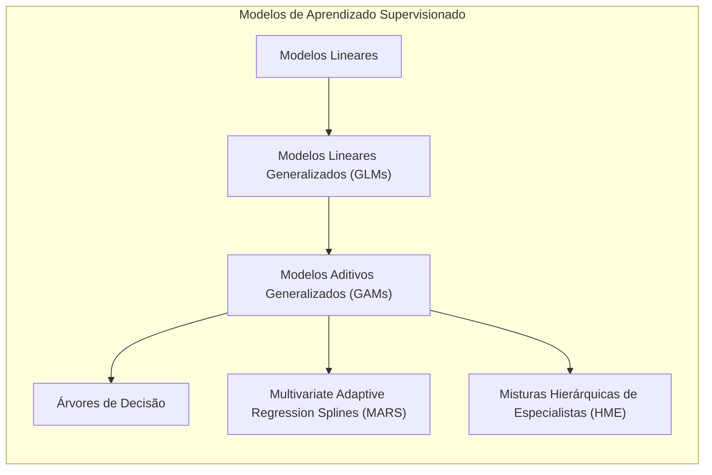

### Introdução

Este capítulo resume as principais abordagens, conceitos e métodos explorados ao longo deste documento sobre Modelos Aditivos Generalizados (GAMs), árvores de decisão, Multivariate Adaptive Regression Splines (MARS) e misturas hierárquicas de especialistas (HME) e suas aplicações em problemas de aprendizado supervisionado [^9.1]. O objetivo é apresentar uma visão unificada sobre como esses modelos são construídos, otimizados e avaliados, destacando as diferentes escolhas metodológicas e como elas afetam o desempenho e a interpretação dos modelos. Este capítulo busca auxiliar a escolha do método mais adequado para cada problema, a partir da revisão das principais abordagens e estratégias discutidas nos capítulos anteriores, com foco no balanço entre flexibilidade, interpretabilidade e capacidade de generalização.

### Conceitos Fundamentais

**Conceito 1: Modelos Lineares, GLMs e Modelos Aditivos**

A modelagem estatística para aprendizado supervisionado evoluiu de modelos lineares para modelos mais flexíveis como modelos lineares generalizados (GLMs) e Modelos Aditivos Generalizados (GAMs). Os modelos lineares são simples e interpretáveis, mas são limitados em sua capacidade de modelar não linearidades. GLMs introduzem a função de ligação e permitem lidar com diferentes tipos de variáveis resposta, e GAMs oferecem um modelo mais flexível através da modelagem não paramétrica da relação entre cada preditor e a resposta. Modelos aditivos permitem que modelos mais flexíveis sejam construídos, e que a não linearidade seja incluída, ainda que mantendo a interpretabilidade do modelo aditivo [^4.1], [^4.2], [^4.3].

> 💡 **Exemplo Numérico:**
>
> Considere um problema de regressão onde queremos modelar a relação entre o número de horas estudadas (X) e a nota em um exame (Y).
>
> *   **Modelo Linear:**  $Y = \beta_0 + \beta_1 X$.  Se $\beta_0 = 5$ e $\beta_1 = 2$, então um estudante que estuda 4 horas teria uma nota prevista de $5 + 2*4 = 13$. Este modelo assume uma relação linear, que pode não ser verdade.
>
> *   **Modelo GAM:**  $Y = \beta_0 + f(X)$. Aqui, $f(X)$ é uma função não linear que pode capturar a não linearidade da relação entre horas de estudo e nota, por exemplo, que as primeiras horas de estudo trazem mais ganho que as últimas. Poderíamos ter $f(X) = 2X - 0.1X^2$. Nesse caso, 4 horas de estudo resultariam em uma nota de $5 + 2*4 - 0.1*4^2 = 12.4$. O GAM permite que a relação seja não linear, oferecendo mais flexibilidade.

**Lemma 1:** *A evolução dos modelos de aprendizado supervisionado representa uma busca por modelos com maior capacidade de modelagem e generalização, e a escolha entre modelos lineares, GLMs e GAMs deve considerar o balanço entre a capacidade de ajuste, interpretabilidade e a natureza da variável resposta*. A escolha do modelo depende do problema e do objetivo da modelagem [^4.4].

**Conceito 2: Modelos Baseados em Árvores, MARS e HME**

Árvores de decisão utilizam uma abordagem hierárquica de divisão do espaço de características, com decisões binárias que particionam os dados, o que resulta em modelos que são fáceis de interpretar, mas com limitações na modelagem de funções suaves e aditivas. Multivariate Adaptive Regression Splines (MARS) utiliza funções *spline* lineares por partes, com um algoritmo de *forward-backward selection* para modelar não linearidades e interações, e buscam um balanço entre flexibilidade e interpretabilidade. Modelos de Misturas Hierárquicas de Especialistas (HME) combinam modelos locais através de redes de gating, e oferecem uma abordagem flexível para modelar diferentes regiões do espaço de características. Modelos baseados em árvores de decisão oferecem interpretabilidade, modelos MARS um balanço entre interpretabilidade e flexibilidade, e HME modelos com flexibilidade para modelar relações complexas [^4.5], [^4.5.1], [^4.5.2].

> 💡 **Exemplo Numérico:**
>
> Imagine que queremos prever o preço de uma casa (Y) com base em duas variáveis: área (X1) e número de quartos (X2).
>
> *   **Árvore de Decisão:** A árvore pode dividir os dados primeiro pela área: se X1 > 150m², então segue um ramo, senão outro. Cada ramo pode então ser dividido pelo número de quartos.  Por exemplo:
>
>     ```mermaid
>     graph TD
>        A["X1 > 150m²"] -->|Yes| B["X2 > 3"];
>        A -->|No| C["Preço = 200k"];
>        B -->|Yes| D["Preço = 400k"];
>        B -->|No| E["Preço = 300k"];
>     ```
>
>     Árvores de decisão são fáceis de interpretar, mas podem gerar descontinuidades na previsão.
>
> *   **MARS:**  O MARS criaria funções spline por partes, por exemplo, $f(X_1) = max(0, X_1 - 100) + max(0, 150 - X_1)$ e $g(X_2) = max(0, X_2 - 2)$. O modelo combinaria estas funções para prever o preço, permitindo uma modelagem mais suave e flexível. Por exemplo:  $Y = 100 + 2*max(0, X_1 - 100) + 3*max(0, 150 - X_1) + 5* max(0, X_2 - 2)$.
>
> *   **HME:** Um modelo HME teria diferentes modelos lineares para diferentes regiões do espaço de características. Por exemplo, um modelo para casas com menos de 100m², outro para casas entre 100 e 200m², e outro para casas maiores. A decisão de qual modelo usar seria feita por uma rede de *gating*, que pondera as contribuições de cada modelo local, permitindo modelar relações complexas.

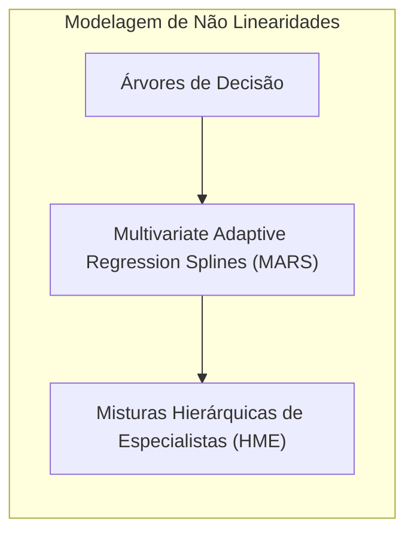

**Corolário 1:** *Árvores de decisão, MARS e HME representam abordagens alternativas para a modelagem de dados, que permitem modelar não linearidades através de mecanismos diferentes. A escolha do modelo apropriado depende da natureza dos dados e dos objetivos da modelagem*. A escolha de modelos baseados em árvores, splines, ou modelos hierárquicos depende do *trade-off* entre flexibilidade e interpretabilidade [^9.1].

**Conceito 3: Funções de Ligação e a Família Exponencial**

A escolha da função de ligação é um componente fundamental na modelagem estatística, especialmente em modelos lineares generalizados e modelos aditivos generalizados, onde a função de ligação relaciona a média da variável resposta com uma combinação linear dos preditores ou funções não paramétricas dos preditores. A escolha da função de ligação canônica simplifica o processo de estimação e garante boas propriedades estatísticas para modelos da família exponencial, que incluem as distribuições mais utilizadas na modelagem estatística, como a normal, binomial e poisson. A escolha da função de ligação é crucial para modelar dados com diferentes distribuições e obter resultados precisos [^4.4].

> 💡 **Exemplo Numérico:**
>
> Vamos modelar a probabilidade de um cliente comprar um produto (Y), que é uma variável binária (0 ou 1), utilizando a variável de idade do cliente (X).
>
> *   **GLM com função de ligação logística:** Se usarmos um modelo linear diretamente, teríamos $Y = \beta_0 + \beta_1 X$, que pode levar a valores de Y fora do intervalo [0,1]. Usando a função de ligação logística, temos:
>     $log(\frac{p}{1-p}) = \beta_0 + \beta_1 X$, onde $p$ é a probabilidade de compra.
>
>     Se $\beta_0 = -3$ e $\beta_1 = 0.1$, para um cliente de 30 anos, teríamos:
>     $log(\frac{p}{1-p}) = -3 + 0.1 * 30 = 0$. Então, $\frac{p}{1-p} = e^0 = 1$, e $p = 0.5$. Isso significa que a probabilidade de compra para um cliente de 30 anos é de 50%.
>
> *   **GAM com função de ligação logística:**  $log(\frac{p}{1-p}) = \beta_0 + f(X)$.  Aqui, $f(X)$ pode modelar a relação não linear entre idade e probabilidade de compra. Por exemplo, $f(X) = 0.1X - 0.002X^2$.
>
>     Para um cliente de 30 anos, teríamos: $log(\frac{p}{1-p}) = -3 + 0.1 * 30 - 0.002 * 30^2 = -1.8$. Então, $\frac{p}{1-p} = e^{-1.8} \approx 0.165$. Resolvendo para p, temos $p \approx 0.14$. A função não linear permite capturar efeitos mais complexos da idade na probabilidade de compra.

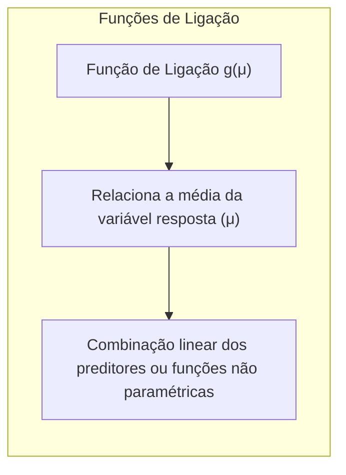
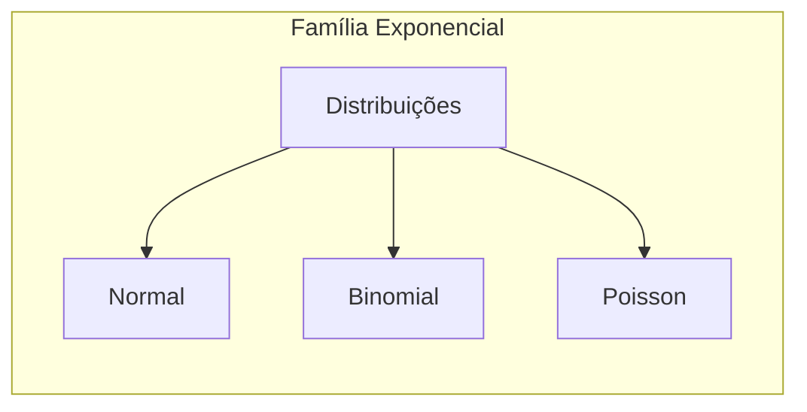

> ⚠️ **Nota Importante:** A utilização de funções de ligação canónicas, quando apropriado, simplifica o processo de otimização dos parâmetros em modelos da família exponencial, e permite modelar diferentes tipos de dados (contínuos, discretos, binários e de contagem) de forma adequada. A escolha da função de ligação está relacionada com a distribuição dos dados, e sua escolha influencia o processo de otimização [^4.4.1].

> ❗ **Ponto de Atenção:** A escolha da função de ligação inadequada pode levar a modelos com estimativas viesadas e com baixo desempenho. A escolha da função de ligação, portanto, deve considerar a natureza dos dados, e as suas propriedades estatísticas, o que é fundamental para modelos eficientes. A utilização de funções de ligação não canônicas pode ser apropriada em certas situações [^4.4.2].

> ✔️ **Destaque:** A utilização de funções de ligação, juntamente com modelos da família exponencial, oferece uma abordagem versátil para a modelagem de dados com diferentes distribuições, permitindo que modelos com maior capacidade de generalização sejam construídos. A função de ligação é um componente chave na modelagem estatística [^4.4.3].

### Abordagens de Modelagem: Flexibilidade, Interpretabilidade, Generalização e Otimização

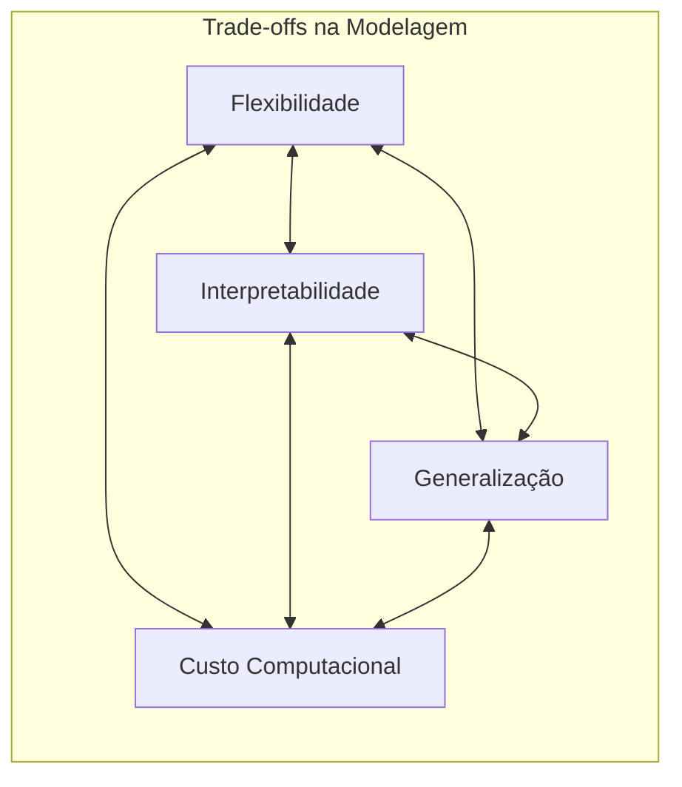

As diferentes abordagens para modelagem em aprendizado supervisionado são caracterizadas por um *trade-off* entre flexibilidade, interpretabilidade, capacidade de generalização e o custo computacional.

1.  **Flexibilidade:** A flexibilidade refere-se à capacidade do modelo de capturar relações complexas e não lineares entre os preditores e a resposta. Modelos lineares têm baixa flexibilidade, enquanto modelos não lineares, como GAMs, árvores de decisão, MARS e HME, oferecem diferentes níveis de flexibilidade para modelar não linearidades. A escolha de modelos mais flexíveis pode aumentar a capacidade do modelo de se ajustar aos dados de treino, mas também aumentar o risco de *overfitting*.
2. **Interpretabilidade:** A interpretabilidade refere-se à capacidade de entender como o modelo funciona e como as decisões são tomadas. Árvores de decisão, em geral, são modelos mais fáceis de interpretar, enquanto modelos mais complexos, como GAMs, MARS e HME podem ter maior dificuldade de interpretação, o que dificulta o entendimento do funcionamento interno dos modelos e a sua utilização em aplicações práticas.
3. **Capacidade de Generalização:** A capacidade de generalização refere-se à capacidade do modelo de desempenhar um bom papel em dados não vistos no treinamento. Modelos muito flexíveis podem ter um bom desempenho nos dados de treinamento, mas podem apresentar uma baixa capacidade de generalização (overfitting), enquanto modelos mais simples podem apresentar um *bias*, e também ter um desempenho subótimo. A escolha do modelo deve considerar o equilíbrio entre capacidade de ajuste e capacidade de generalização.
4. **Otimização:** Os métodos de otimização são utilizados para encontrar os parâmetros do modelo que minimizam ou maximizam uma função de custo. Métodos como o algoritmo de backfitting, o método de Newton-Raphson, o gradiente descendente e outros, oferecem diferentes abordagens para a otimização. A escolha do algoritmo de otimização depende da função de custo do modelo e da sua capacidade de convergir para uma solução estável.

> 💡 **Exemplo Numérico:**
>
> Suponha que temos um conjunto de dados com a relação entre a complexidade do modelo (número de parâmetros) e o erro de treinamento e teste.
>
> | Modelo         | Complexidade | Erro de Treino | Erro de Teste |
> | -------------- | ----------- | ------------- | ------------- |
> | Modelo Linear  | 2           | 0.8           | 0.9           |
> | GAM Simples    | 5           | 0.6           | 0.7           |
> | GAM Complexo   | 15          | 0.3           | 0.8           |
> | Árvore Simples | 7           | 0.5           | 0.65          |
> | Árvore Complexa| 25          | 0.1           | 1.2           |
>
> *   **Flexibilidade:** A árvore complexa tem a maior flexibilidade, ajustando-se bem aos dados de treino, mas com *overfitting*. O modelo linear é o menos flexível, com o erro de treino mais alto.
> *   **Interpretabilidade:** O modelo linear e a árvore simples são os mais interpretáveis. Os GAMs e a árvore complexa são menos interpretáveis devido à sua complexidade.
> *   **Generalização:** O GAM simples e a árvore simples têm o melhor balanço entre erro de treino e teste, indicando boa capacidade de generalização.
> *   **Otimização:** Diferentes algoritmos de otimização são usados para cada modelo. Por exemplo, o modelo linear pode ser otimizado por mínimos quadrados, enquanto GAMs podem usar backfitting e árvores podem usar algoritmos gulosos.

A escolha do modelo e dos seus componentes deve considerar as propriedades dos modelos, suas vantagens e limitações, e o contexto do problema a ser modelado.

### A Importância da Regularização, Seleção de Variáveis e Métodos de *Ensemble*

Para lidar com os problemas de *overfitting*, multicolinearidade e alta dimensionalidade, técnicas de regularização, seleção de variáveis e métodos de *ensemble* são cruciais. A regularização, através da penalização L1 e L2, e o uso do parâmetro de suavização, controla a complexidade dos modelos e estabiliza as estimativas dos parâmetros. A seleção de variáveis permite a escolha dos preditores mais relevantes, e a utilização de métodos de *ensemble*, como o *boosting*, pode combinar diferentes modelos para melhorar o poder preditivo e a capacidade de generalização. A utilização dessas abordagens é fundamental para garantir a construção de modelos robustos e com um bom desempenho.

> 💡 **Exemplo Numérico:**
>
> Suponha que temos um modelo linear com muitos preditores, alguns dos quais são irrelevantes.
>
> *   **Modelo Linear sem Regularização:** $Y = \beta_0 + \beta_1 X_1 + \beta_2 X_2 + \ldots + \beta_{10} X_{10}$.  Com muitos preditores e dados limitados, pode haver *overfitting*.
>
> *   **Regularização L2 (Ridge):**  $min \sum_{i=1}^n(y_i - \hat{y}_i)^2 + \lambda \sum_{j=1}^p \beta_j^2$.  Se $\lambda = 0.1$, os coeficientes serão reduzidos para evitar *overfitting*. Para $\lambda = 1$, a penalidade é maior e os coeficientes são ainda mais reduzidos.
>
> *   **Regularização L1 (Lasso):** $min \sum_{i=1}^n(y_i - \hat{y}_i)^2 + \lambda \sum_{j=1}^p |\beta_j|$.  Se $\lambda = 0.1$, alguns coeficientes podem ser zerados, realizando seleção de variáveis. Para $\lambda = 1$, mais coeficientes serão zerados.
>
> *   **Boosting:**  Vários modelos de árvores são combinados sequencialmente, onde cada modelo tenta corrigir os erros do modelo anterior. Isso melhora a precisão e a capacidade de generalização.

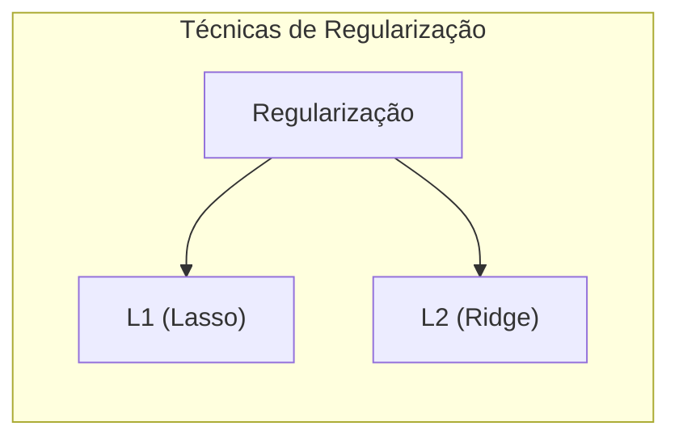
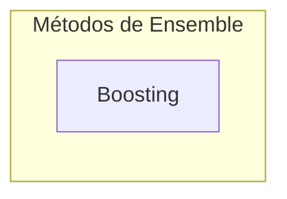

### Tratamento de Dados Ausentes e Outliers como Componentes da Metodologia

O tratamento de valores ausentes e *outliers* é uma etapa fundamental da preparação dos dados e do processo de modelagem. A escolha do método de imputação, a utilização de uma categoria "ausente" e a utilização de *surrogate splits* em árvores de decisão são abordagens utilizadas para lidar com dados ausentes. A análise e remoção de *outliers* é importante para garantir que o modelo não seja afetado por pontos que não representam o padrão principal nos dados. A utilização de dados com boa qualidade e sem *outliers* é fundamental para a modelagem estatística.

> 💡 **Exemplo Numérico:**
>
> Suponha que temos dados de vendas com alguns valores ausentes (NaN) na coluna de preço.
>
> *   **Imputação:**
>     *   **Média:** Substituir os valores NaN pela média dos preços.
>     *   **Mediana:** Substituir os valores NaN pela mediana dos preços.
>     *   **Valor Constante:** Substituir por um valor específico, como 0.
>
> *   **Categoria "Ausente":** Criar uma nova categoria para valores ausentes, especialmente se a falta de informação for relevante.
>
> *   **Surrogate Splits (Árvores):** Quando uma variável com valor ausente é usada para dividir os dados em uma árvore de decisão, um *surrogate split* usa outra variável para tentar obter a mesma divisão, evitando a perda de informações.
>
> *   **Outliers:**  Suponha que temos uma coluna com valores de idade e um valor de 200 anos.  Este valor pode ser removido ou corrigido para um valor mais razoável.

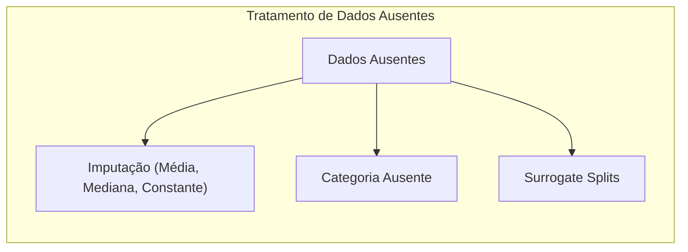
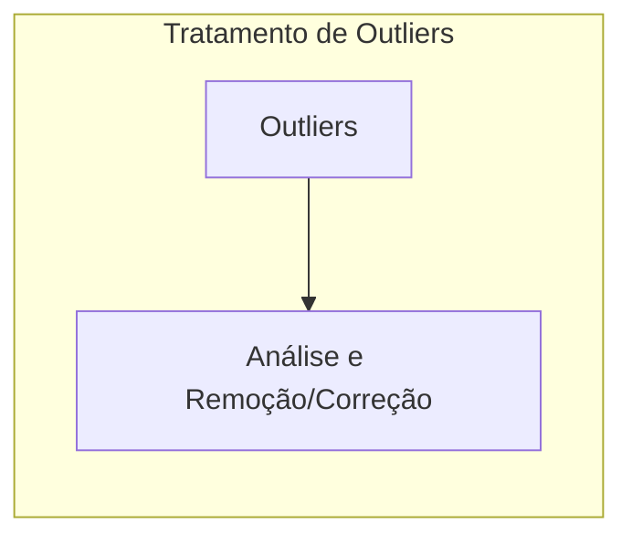

### Perguntas Teóricas Avançadas: Como a escolha da função de custo, do método de otimização e dos modelos de aprendizado supervisionado afeta a complexidade dos modelos, sua capacidade de modelar diferentes estruturas nos dados, e o *trade-off* entre viés e variância?

**Resposta:**

A escolha da função de custo, do método de otimização e dos modelos de aprendizado supervisionado influencia diretamente a complexidade dos modelos, sua capacidade de modelar diferentes estruturas nos dados e o *trade-off* entre viés e variância.

A função de custo define o objetivo da modelagem e como o modelo se ajusta aos dados. A escolha de uma função de custo apropriada é fundamental para garantir que o modelo tenha um bom desempenho. A soma dos erros quadráticos (SSE) é utilizada para modelos lineares, e modelos que assumem distribuição normal. A função de *log-likelihood* é utilizada para modelos da família exponencial, e métricas de impureza são utilizadas para árvores de decisão. A escolha da função de custo deve ser guiada pela natureza dos dados e pelo objetivo da modelagem.

> 💡 **Exemplo Numérico:**
>
> *   **Regressão Linear:** Função de custo: $SSE = \sum_{i=1}^n (y_i - \hat{y}_i)^2$. O objetivo é minimizar a soma dos erros quadráticos.
> *   **Regressão Logística:** Função de custo: *Log-Likelihood*. O objetivo é maximizar a verossimilhança dos dados.
> *   **Árvores de Decisão:**  Função de custo: Entropia ou índice de Gini. O objetivo é minimizar a impureza dos nós.

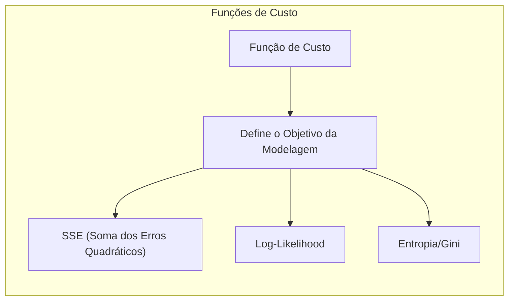

O método de otimização é utilizado para encontrar os parâmetros que minimizam ou maximizam a função de custo. Algoritmos de otimização como o gradiente descendente, o método de Newton-Raphson, o algoritmo de backfitting e algoritmos gulosos têm diferentes propriedades e a sua escolha depende da convexidade da função de custo e da necessidade de uma solução global ou apenas local. A escolha do método de otimização influencia a velocidade de convergência, a estabilidade dos resultados, e a precisão das estimativas.

> 💡 **Exemplo Numérico:**
>
> *   **Gradiente Descendente:**  Atualiza os parâmetros iterativamente na direção oposta do gradiente da função de custo.
> *   **Newton-Raphson:** Usa a segunda derivada da função de custo para encontrar o mínimo.
> *   **Backfitting (GAMs):**  Atualiza as funções não paramétricas iterativamente.

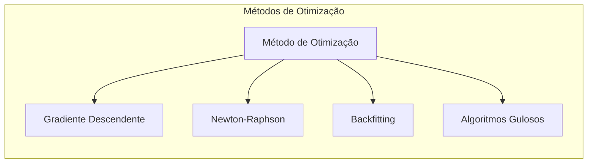

A escolha do modelo de aprendizado supervisionado, como modelos lineares, GAMs, árvores de decisão, MARS e HME, define a sua flexibilidade, a sua capacidade de modelar não linearidades e a sua interpretabilidade. Modelos mais simples tendem a ter maior *bias* e menor variância, enquanto que modelos mais complexos e flexíveis podem ter menor *bias*, mas alta variância. A escolha do modelo, portanto, depende do balanço entre essas propriedades.

> 💡 **Exemplo Numérico:**
>
> *   **Modelo Linear:** Alto *bias*, baixa variância. Pode não capturar não linearidades.
> *   **GAM:**  Menor *bias* que o modelo linear, mas maior variância. Capaz de modelar não linearidades.
> *   **Árvore de Decisão:**  Baixo *bias*, alta variância. Pode sofrer *overfitting*.
> *   **MARS e HME:**  Flexibilidade e capacidade de modelar relações complexas, mas com potencial para *overfitting*.

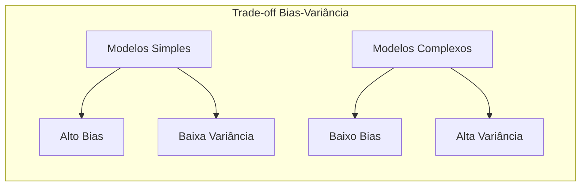

A interação entre a escolha da função de custo, o método de otimização e o modelo define o comportamento do modelo e sua capacidade de ajustar dados de forma adequada e com capacidade de generalização. O *trade-off* entre *bias* e variância é um aspecto central na modelagem, e a escolha adequada dos componentes do modelo é essencial para lidar com esse problema.

**Lemma 5:** *A escolha da função de custo, do método de otimização e do modelo de aprendizado supervisionado influencia a capacidade de ajuste do modelo e o *trade-off* entre *bias* e variância. Modelos mais complexos podem capturar as não linearidades dos dados de forma mais precisa, mas podem apresentar *overfitting* e uma maior variância, enquanto modelos mais simples podem ter maior *bias* e menor capacidade de modelar padrões complexos*. A escolha dos componentes de um modelo é fundamental para o desempenho do mesmo [^4.3.1].

**Corolário 5:** *A escolha adequada da função de custo, do método de otimização e do modelo depende da natureza dos dados e do objetivo da modelagem. A utilização de métodos de regularização e validação cruzada auxilia na escolha de modelos com boa capacidade de generalização e com um bom balanço entre flexibilidade e capacidade de ajuste*. A combinação de teoria estatística e conhecimento prático do problema é essencial para a construção de modelos robustos e eficazes [^4.4.5].

> ⚠️ **Ponto Crucial**: A escolha da função de custo, do método de otimização e do modelo de aprendizado supervisionado deve ser feita considerando a natureza do problema, o objetivo da modelagem, as propriedades dos dados, e o *trade-off* entre *bias* e variância. A escolha adequada desses componentes é crucial para o desenvolvimento de modelos com bom desempenho e interpretabilidade [^4.5].

### Conclusão

Este capítulo apresentou um resumo das principais abordagens, conceitos e métodos explorados ao longo do documento sobre modelos aditivos, árvores de decisão e métodos relacionados, enfatizando como a escolha do modelo, dos métodos de otimização, das métricas de desempenho, e do tratamento de valores ausentes, influenciam os resultados finais. A combinação das diferentes abordagens e técnicas de modelagem discutidas permite a construção de modelos com boa capacidade de modelagem, generalização e interpretabilidade para diferentes tipos de problemas de aprendizado supervisionado.

### Footnotes

[^4.1]: "In this chapter we begin our discussion of some specific methods for super-vised learning. These techniques each assume a (different) structured form for the unknown regression function, and by doing so they finesse the curse of dimensionality. Of course, they pay the possible price of misspecifying the model, and so in each case there is a tradeoff that has to be made." *(Trecho de "Additive Models, Trees, and Related Methods")*

[^4.2]: "Regression models play an important role in many data analyses, providing prediction and classification rules, and data analytic tools for understand-ing the importance of different inputs." *(Trecho de "Additive Models, Trees, and Related Methods")*

[^4.3]: "In this section we describe a modular algorithm for fitting additive models and their generalizations. The building block is the scatterplot smoother for fitting nonlinear effects in a flexible way. For concreteness we use as our scatterplot smoother the cubic smoothing spline described in Chapter 5." *(Trecho de "Additive Models, Trees, and Related Methods")*

[^4.3.1]:  "The additive model has the form $Y = \alpha + \sum_{j=1}^p f_j(X_j) + \varepsilon$, where the error term $\varepsilon$ has mean zero." * (Trecho de "Additive Models, Trees, and Related Methods")*

[^4.3.2]:   "Given observations $x_i, y_i$, a criterion like the penalized sum of squares (5.9) of Section 5.4 can be specified for this problem, $PRSS(\alpha, f_1, f_2,\ldots, f_p) = \sum_i^N (y_i - \alpha - \sum_j^p f_j(x_{ij}))^2 + \sum_j^p \lambda_j \int(f_j''(t_j))^2 dt_j$" * (Trecho de "Additive Models, Trees, and Related Methods")*

[^4.3.3]: "where the $\lambda_j > 0$ are tuning parameters. It can be shown that the minimizer of (9.7) is an additive cubic spline model; each of the functions $f_j$ is a cubic spline in the component $X_j$, with knots at each of the unique values of $x_{ij}$, $i = 1,\ldots, N$." *(Trecho de "Additive Models, Trees, and Related Methods")*

[^4.4]: "For two-class classification, recall the logistic regression model for binary data discussed in Section 4.4. We relate the mean of the binary response $\mu(X) = Pr(Y = 1|X)$ to the predictors via a linear regression model and the logit link function:  $log(\mu(X)/(1 – \mu(X)) = \alpha + \beta_1 X_1 + \ldots + \beta_pX_p$." * (Trecho de "Additive Models, Trees, and Related Methods")*

[^4.4.1]: "The additive logistic regression model replaces each linear term by a more general functional form: $log(\mu(X)/(1 – \mu(X))) = \alpha + f_1(X_1) + \cdots + f_p(X_p)$, where again each $f_j$ is an unspecified smooth function." * (Trecho de "Additive Models, Trees, and Related Methods")*

[^4.4.2]: "While the non-parametric form for the functions $f_j$ makes the model more flexible, the additivity is retained and allows us to interpret the model in much the same way as before. The additive logistic regression model is an example of a generalized additive model." *(Trecho de "Additive Models, Trees, and Related Methods")*

[^4.4.3]: "In general, the conditional mean $\mu(X)$ of a response $Y$ is related to an additive function of the predictors via a link function $g$:  $g[\mu(X)] = \alpha + f_1(X_1) + \cdots + f_p(X_p)$." *(Trecho de "Additive Models, Trees, and Related Methods")*

[^4.4.4]:  "Examples of classical link functions are the following: $g(\mu) = \mu$ is the identity link, used for linear and additive models for Gaussian response data." *(Trecho de "Additive Models, Trees, and Related Methods")*

[^4.4.5]: "$g(\mu) = logit(\mu)$ as above, or $g(\mu) = probit(\mu)$, the probit link function, for modeling binomial probabilities. The probit function is the inverse Gaussian cumulative distribution function: $probit(\mu) = \Phi^{-1}(\mu)$." *(Trecho de "Additive Models, Trees, and Related Methods")*

[^4.5]: "All three of these arise from exponential family sampling models, which in addition include the gamma and negative-binomial distributions. These families generate the well-known class of generalized linear models, which are all extended in the same way to generalized additive models." *(Trecho de "Additive Models, Trees, and Related Methods")*

[^4.5.1]: "The functions $f_j$ are estimated in a flexible manner, using an algorithm whose basic building block is a scatterplot smoother. The estimated func-tion $f_j$ can then reveal possible nonlinearities in the effect of $X_j$. Not all of the functions $f_j$ need to be nonlinear." *(Trecho de "Additive Models, Trees, and Related Methods")*

[^4.5.2]: "We can easily mix in linear and other parametric forms with the nonlinear terms, a necessity when some of the inputs are qualitative variables (factors)." *(Trecho de "Additive Models, Trees, and Related Methods")*
