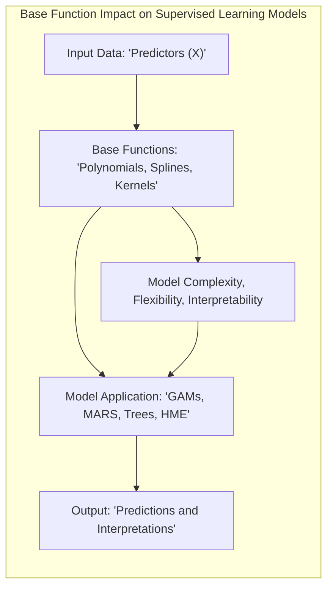
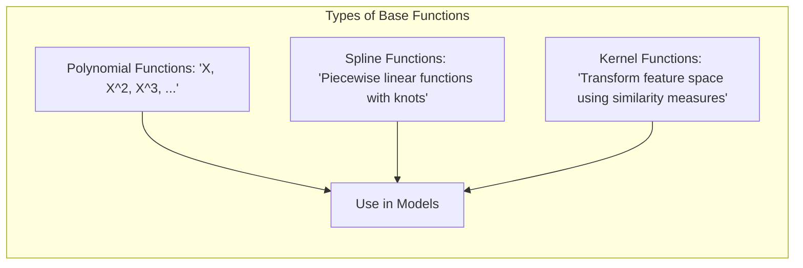
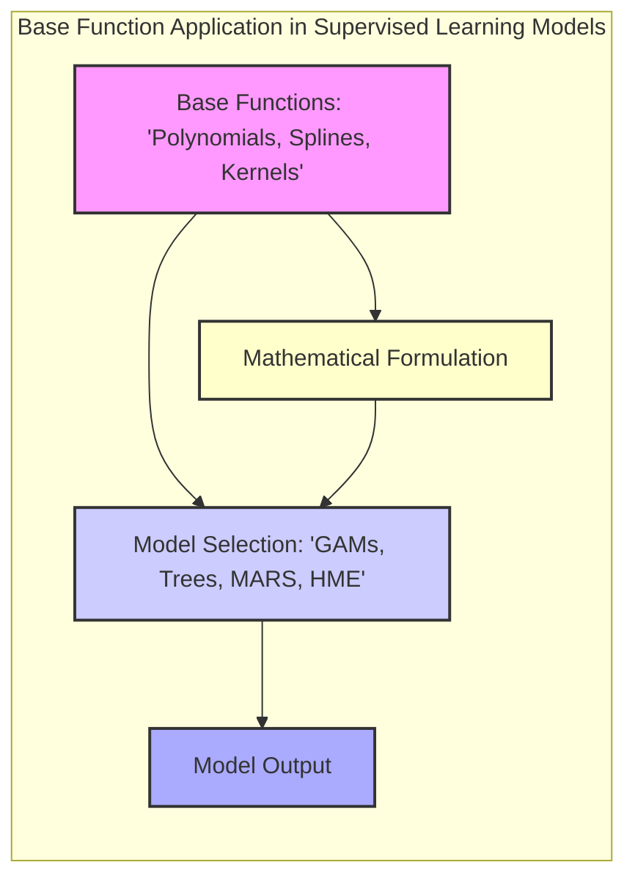
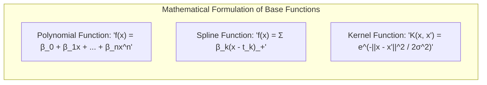
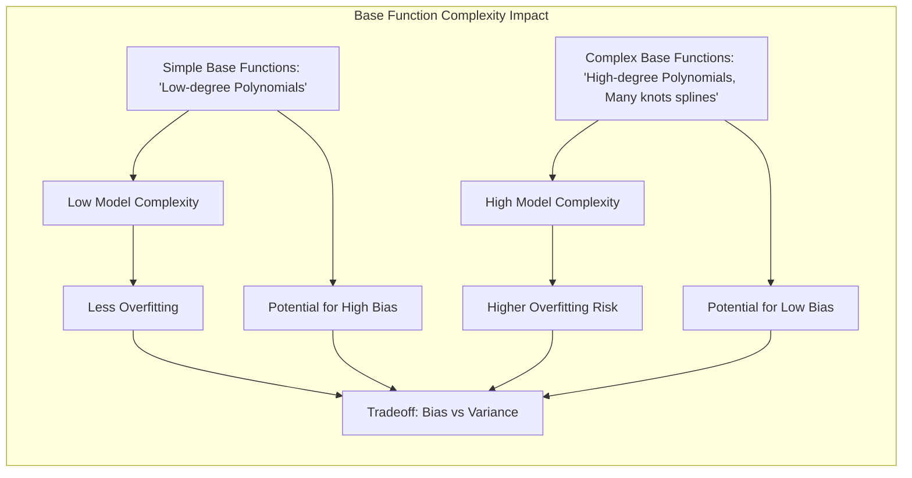
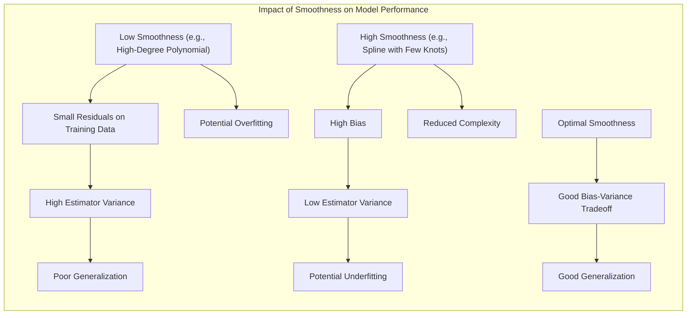

```markdown
## Título: Modelos Aditivos, Árvores e Métodos Relacionados: Funções de Base e sua Influência na Modelagem Estatística



### Introdução

Este capítulo explora o conceito de funções de base em modelos de aprendizado supervisionado, destacando como diferentes tipos de funções de base (polinomiais, *splines*, *kernels*) são utilizados para representar a relação entre os preditores e a resposta, com foco em Modelos Aditivos Generalizados (GAMs), Multivariate Adaptive Regression Splines (MARS) e outras abordagens relacionadas [^9.1]. A escolha das funções de base é fundamental para a modelagem de dados com relações não lineares e para controlar a complexidade dos modelos. O capítulo detalha como as funções de base são utilizadas, como a sua escolha afeta a flexibilidade, a interpretabilidade e o desempenho dos modelos, e como diferentes funções são aplicadas em diferentes contextos de modelagem. O objetivo principal é fornecer uma compreensão aprofundada sobre o conceito de funções de base e a sua importância para a modelagem estatística, assim como a discussão de como essa escolha afeta o resultado final dos modelos.

### Conceitos Fundamentais

**Conceito 1: Funções de Base como Representação de Preditores**

Em modelos estatísticos, funções de base são utilizadas para representar os preditores, ou para transformar o espaço de características. Em modelos lineares, as funções de base são as próprias variáveis preditoras, e a resposta é uma combinação linear dessas variáveis, como em:

$$
Y = \alpha + \beta_1 X_1 + \beta_2 X_2 + \ldots + \beta_p X_p + \epsilon
$$

Em modelos não lineares, as funções de base transformam as variáveis preditoras para modelar relações não lineares com a resposta, e a resposta passa a ser uma combinação linear das funções de base, o que confere ao modelo a capacidade de modelar relações mais complexas que não podem ser modeladas por modelos lineares simples. A escolha das funções de base é fundamental para a capacidade do modelo de capturar não linearidades e para o seu desempenho final.  A escolha das funções de base influencia diretamente a complexidade do modelo e como ele se adapta aos dados.

> 💡 **Exemplo Numérico:**
> Considere um modelo linear simples onde a variável resposta ($Y$) é o preço de uma casa e a variável preditora ($X_1$) é a área em metros quadrados. O modelo seria $Y = \alpha + \beta_1 X_1 + \epsilon$. Aqui, a função de base é $X_1$ diretamente. Se quisermos modelar uma relação não linear, como a relação entre o preço da casa e a idade da casa ($X_2$), podemos usar uma função de base polinomial, como $X_2$ e $X_2^2$. O modelo passaria a ser $Y = \alpha + \beta_1 X_1 + \beta_2 X_2 + \beta_3 X_2^2 + \epsilon$. Neste caso, as funções de base são $X_1$, $X_2$ e $X_2^2$.

**Lemma 1:** *Funções de base são utilizadas para representar os preditores em modelos estatísticos. A escolha das funções de base define como os preditores se relacionam com a resposta e a capacidade de modelagem do modelo*.  A escolha das funções de base tem um impacto direto na qualidade do modelo [^4.3.1].

**Conceito 2: Tipos de Funções de Base: Polinomiais, *Splines*, e *Kernels***

Existem diferentes tipos de funções de base utilizadas na modelagem estatística:
*   **Funções Polinomiais:** As funções polinomiais utilizam potências dos preditores para modelar relações não lineares, como $X$, $X^2$, $X^3$, entre outras. As funções polinomiais podem aproximar curvas suaves, mas não são apropriadas para modelar funções com grande variação ou com descontinuidades. A escolha do grau do polinômio controla a complexidade do modelo e a sua capacidade de generalização.
*   **Funções *Spline*:** As funções *spline* utilizam funções lineares por partes, conectadas por pontos chamados nós, para aproximar relações não lineares. As funções *spline* oferecem maior flexibilidade e capacidade de se adaptar a diferentes padrões nos dados.  Existem diferentes tipos de *splines*, como *splines* cúbicas, *splines* lineares, que controlam a suavidade e flexibilidade da função. A escolha do número de nós e a sua localização, e do tipo de *spline*, influencia o resultado do modelo.
*   **Funções *Kernel*:** As funções *kernel* transformam o espaço dos preditores em um espaço de maior dimensão, e as relações entre os preditores e a resposta são modeladas nesse espaço transformado.  As funções *kernel* permitem a modelagem de relações não lineares complexas, através da escolha de diferentes tipos de *kernel*.  A função *kernel* define a similaridade entre os preditores e a sua capacidade de modelar relações não lineares.

A escolha das funções de base depende do tipo de dados, da complexidade da relação entre os preditores e a resposta, e da necessidade de interpretabilidade do modelo.

> 💡 **Exemplo Numérico:**
> Para ilustrar, vamos considerar um conjunto de dados com uma única variável preditora ($X$) e uma variável resposta ($Y$). Suponha que a relação entre $X$ e $Y$ seja aproximadamente quadrática.
>
> **Funções Polinomiais:** Podemos usar uma função polinomial de grau 2: $f(X) = \beta_0 + \beta_1 X + \beta_2 X^2$. Se os dados mostrassem um padrão cúbico, poderíamos adicionar um termo $X^3$ para aumentar a complexidade.
>
> **Funções *Spline*:** Alternativamente, poderíamos usar uma função *spline* linear por partes com dois nós em $t_1 = 2$ e $t_2 = 5$: $f(X) = \beta_0 + \beta_1(X-2)_+ + \beta_2(X-5)_+$.  Aqui, $(X-t)_+$ é zero se $X<t$ e igual a $X-t$ se $X \geq t$.
>
> **Funções *Kernel*:** Se quisermos usar um *kernel* gaussiano, podemos calcular a similaridade entre cada ponto $x_i$ e todos os outros pontos $x_j$ usando a fórmula $K(x_i, x_j) = e^{-\frac{||x_i-x_j||^2}{2\sigma^2}}$, onde $\sigma$ é um parâmetro que controla a largura do *kernel*.  A função *kernel* transforma os dados para um espaço de maior dimensão onde uma relação linear pode ser encontrada.



**Corolário 1:** *Funções polinomiais, *splines* e *kernels* oferecem abordagens diferentes para a modelagem não linear. As funções polinomiais são simples, enquanto as *splines* são mais flexíveis, e as funções *kernel* transformam o espaço original dos preditores. A escolha da função de base adequada depende da natureza dos dados e da complexidade das relações entre preditores e resposta* [^4.3.3].

**Conceito 3: Funções de Base e Modelos Aditivos Generalizados (GAMs)**

Em Modelos Aditivos Generalizados (GAMs), funções de base, geralmente *splines* ou *kernels*, são utilizadas para modelar a relação entre cada preditor e a resposta, com o objetivo de gerar modelos não paramétricos e com a capacidade de modelar relações não lineares. A função de ligação $g$ relaciona a média da resposta com uma soma de funções de base de cada preditor:

$$
g(\mu(X)) = \alpha + f_1(X_1) + f_2(X_2) + \ldots + f_p(X_p)
$$
onde $f_j(X_j)$ são as funções de base dos preditores, com cada função representando a influência do preditor na escala da resposta, e $\alpha$ é o intercepto. O uso de funções não paramétricas em modelos GAMs, através do uso de funções de base, garante que relações complexas sejam modeladas de forma flexível. A escolha do tipo de função de base e a escolha do parâmetro de suavização são elementos cruciais na modelagem de dados complexos.

> 💡 **Exemplo Numérico:**
> Considere um modelo GAM com duas variáveis preditoras, $X_1$ (temperatura) e $X_2$ (umidade), e uma variável resposta $Y$ (número de sorvetes vendidos). Podemos usar *splines* cúbicas para modelar a relação não linear de cada preditor com a resposta. O modelo seria:
>
> $g(\mu(X)) = \alpha + f_1(X_1) + f_2(X_2)$, onde:
>
> $f_1(X_1)$ é uma *spline* cúbica para a temperatura, com alguns nós.
>
> $f_2(X_2)$ é uma *spline* cúbica para a umidade, com outros nós.
>
> Se a função de ligação $g$ for a função identidade, então $g(\mu(X)) = \mu(X)$ e o modelo se torna $\mu(X) = \alpha + f_1(X_1) + f_2(X_2)$. Isso significa que a média do número de sorvetes vendidos é a soma de uma constante, mais uma função não linear da temperatura, mais uma função não linear da umidade.  A escolha do número de nós e dos parâmetros de suavização em $f_1$ e $f_2$ controlará a flexibilidade do modelo.

> ⚠️ **Nota Importante:** Em modelos GAMs, a escolha de funções de base não paramétricas permite que a relação entre preditores e resposta seja modelada com flexibilidade. A escolha dos tipos de funções de base, e dos parâmetros de regularização, são importantes para o desempenho dos modelos [^4.4.1].

> ❗ **Ponto de Atenção:** A utilização de funções de base com muita flexibilidade pode levar a modelos complexos e com *overfitting*. A escolha de parâmetros de suavização e de regularização são componentes essenciais para controlar a complexidade do modelo [^4.4.2].

> ✔️ **Destaque:**  O uso de funções de base é fundamental para a construção de modelos flexíveis para dados com relações não lineares, e os modelos GAMs se destacam pela sua utilização de funções não paramétricas e suavização [^4.4.3].

### Formulação Matemática e Aplicação de Funções de Base em Diferentes Modelos



A formulação matemática das funções de base e a sua aplicação em diferentes modelos de aprendizado supervisionado são apresentados abaixo:

1.  **Funções Polinomiais:**  Uma função polinomial de grau $n$ é definida como:
    $$
    f(x) = \beta_0 + \beta_1 x + \beta_2 x^2 + \ldots + \beta_n x^n
    $$
    onde $\beta_i$ são os coeficientes e $x$ é a variável preditora. Funções polinomiais são utilizadas para modelar relações não lineares, mas podem ter dificuldade em representar relações complexas. A escolha do grau do polinômio afeta a sua complexidade e flexibilidade, onde um polinômio de alto grau tem maior capacidade de ajuste, mas também maior risco de overfitting. Modelos lineares são um caso particular das funções polinomiais, onde o grau do polinômio é 1.

    > 💡 **Exemplo Numérico:**
    > Se tivermos uma variável preditora $x$ e quisermos usar um polinômio de grau 3, a função de base seria: $f(x) = \beta_0 + \beta_1 x + \beta_2 x^2 + \beta_3 x^3$. Se os coeficientes estimados forem $\beta_0 = 1$, $\beta_1 = 2$, $\beta_2 = -0.5$ e $\beta_3 = 0.1$, então, para $x=2$, teríamos $f(2) = 1 + 2(2) - 0.5(2^2) + 0.1(2^3) = 1 + 4 - 2 + 0.8 = 3.8$. Este valor seria usado para modelar a relação entre a variável preditora e a resposta.

2.  **Funções Spline:** Uma função *spline* é definida como uma combinação linear de funções lineares por partes, conectadas por nós. Uma função *spline* linear por partes é dada por:
    $$
    f(x) = \sum_{k=1}^K \beta_k (x-t_k)_+
    $$

      onde $t_k$ são os nós e $(x-t_k)_+$ representa a função linear por partes, que é zero quando $x<t_k$ e igual a $x-t_k$ quando $x \geq t_k$.  As funções *spline* são utilizadas para modelar relações não lineares suaves, e a escolha do número de nós e da sua localização influencia a sua flexibilidade. Outros tipos de *spline* (cúbicas e outras) podem ser utilizadas para funções mais suaves, e com diferentes propriedades.

    > 💡 **Exemplo Numérico:**
    > Suponha que temos uma função *spline* linear por partes com dois nós, $t_1 = 3$ e $t_2 = 7$. A função seria: $f(x) = \beta_1 (x-3)_+ + \beta_2 (x-7)_+$. Se $\beta_1 = 0.5$ e $\beta_2 = -0.2$, então:
    >
    > *   Para $x = 2$, $f(2) = 0.5(2-3)_+ - 0.2(2-7)_+ = 0.5(0) - 0.2(0) = 0$
    > *   Para $x = 5$, $f(5) = 0.5(5-3)_+ - 0.2(5-7)_+ = 0.5(2) - 0.2(0) = 1$
    > *   Para $x = 10$, $f(10) = 0.5(10-3)_+ - 0.2(10-7)_+ = 0.5(7) - 0.2(3) = 3.5 - 0.6 = 2.9$
    >
    > Os valores de $f(x)$ variam de acordo com os nós e os coeficientes, permitindo a modelagem de não linearidades.

3.  **Funções Kernel:** Uma função *kernel* transforma o espaço de características em um espaço de maior dimensão, e a relação entre os dados é modelada neste novo espaço.  Um exemplo é o *kernel* gaussiano, que é dado por:
    $$
    K(x, x') = e^{-\frac{||x-x'||^2}{2\sigma^2}}
     $$

     onde $x$ e $x'$ são dois pontos no espaço de características e $\sigma$ é o parâmetro de largura. A escolha do *kernel* e dos seus parâmetros define a transformação do espaço de características e a sua capacidade de modelar não linearidades complexas.

      > 💡 **Exemplo Numérico:**
      > Vamos calcular o *kernel* gaussiano para dois pontos $x = 2$ e $x' = 4$, com $\sigma = 1$:
      >
      > $K(2, 4) = e^{-\frac{||2-4||^2}{2(1^2)}} = e^{-\frac{4}{2}} = e^{-2} \approx 0.135$.
      >
      > Se os pontos fossem mais próximos, como $x=2$ e $x'=2.5$, com $\sigma=1$:
      >
      > $K(2, 2.5) = e^{-\frac{||2-2.5||^2}{2(1^2)}} = e^{-\frac{0.25}{2}} = e^{-0.125} \approx 0.882$.
      >
      > A função *kernel* gaussiana retorna valores próximos de 1 para pontos próximos, e valores próximos de 0 para pontos distantes, definindo a similaridade entre os pontos.



A aplicação de diferentes funções de base em modelos de aprendizado supervisionado é mostrada abaixo:
*   **GAMs:** Em GAMs, a função de ligação $g$ é utilizada para relacionar a média da resposta com uma combinação linear de funções de base, como *splines*, que modelam a relação entre cada preditor e a resposta.  As funções de base não paramétricas em GAMs, portanto, utilizam *splines* ou outros tipos de suavizadores que permitem modelar a relação com flexibilidade e interpretabilidade.
*   **Árvores de Decisão:** Em árvores de decisão, as funções de base são as próprias variáveis preditoras, e os modelos utilizam uma combinação de decisões binárias nos valores dos preditores. Em alguns casos, quando as categorias têm muitos níveis, pode-se utilizar *splines* para ordenar a variável e realizar a divisão de nós. A estrutura hierárquica das árvores permite construir um modelo interpretável e que se adapta a diferentes tipos de dados.
*   **MARS:**  Em MARS, as funções de base são as *splines* lineares por partes, e o modelo é construído adicionando e removendo termos da função, guiado por um critério de otimização, que geralmente busca minimizar o erro. MARS utiliza a combinação de funções de base *spline* para modelar não linearidades e interações.
*   **HME:** Em HME, diferentes modelos lineares ou não lineares são utilizados como especialistas, e a combinação dos resultados dos modelos é feita utilizando redes de *gating*.  Modelos lineares utilizam como função de base as variáveis preditoras, mas em alguns casos pode-se utilizar funções de base para aumentar a capacidade de modelagem e flexibilidade dos modelos locais.

A escolha das funções de base influencia diretamente o comportamento do modelo, e a sua capacidade de generalização e interpretabilidade.

**Lemma 4:** *A escolha da função de base é crucial para a modelagem de dados com diferentes características, e diferentes funções de base, como as funções polinomiais, splines e kernels oferecem diferentes abordagens para a modelagem da não linearidade. A escolha de modelos com funções não paramétricas, e sua relação com outros modelos lineares, é importante para modelar dados com diferentes propriedades*.  A escolha da função de base deve considerar a natureza dos dados e a complexidade da relação entre preditores e resposta [^4.5.1].

### Interpretação da Função de Base e sua Relação com a Modelagem

A interpretação da função de base é importante para entender como o modelo se comporta, e como ele representa as relações entre os preditores e a resposta.  Funções polinomiais, por exemplo, são fáceis de interpretar, mas têm pouca flexibilidade.  As funções *spline* são mais complexas de interpretar, mas também são mais flexíveis. Funções *kernel* transformam o espaço de características e a sua interpretação é feita no espaço transformado. A análise das funções de base auxilia no entendimento do modelo e sua capacidade de capturar os padrões nos dados. A interpretação dos modelos, portanto, deve considerar a base utilizada para a modelagem e a sua relação com os preditores.

###  A Relação entre Funções de Base e a Complexidade do Modelo

A escolha das funções de base influencia a complexidade do modelo, que se relaciona com o número de parâmetros e com a capacidade do modelo de se adaptar a dados não vistos.  Funções de base mais complexas podem levar a modelos com muitos parâmetros, o que aumenta o risco de *overfitting*, e a necessidade de regularização. Modelos com funções de base mais simples podem apresentar baixo *bias*, mas também têm maior dificuldade em modelar relações complexas nos dados. A escolha da função de base e do seu parâmetro de ajuste (como parâmetros de suavização em splines) é um balanço entre a complexidade do modelo e a sua capacidade de generalização.

> 💡 **Exemplo Numérico:**
> Considere um conjunto de dados com uma única variável preditora ($X$) e uma variável resposta ($Y$).
>
> 1.  **Modelo com função polinomial de baixo grau:**  $Y = \beta_0 + \beta_1 X + \epsilon$. Este modelo tem apenas dois parâmetros e é simples. Pode não capturar relações complexas, mas é menos suscetível a *overfitting*.
>
> 2.  **Modelo com função polinomial de alto grau:** $Y = \beta_0 + \beta_1 X + \beta_2 X^2 + \beta_3 X^3 + \beta_4 X^4 + \epsilon$. Este modelo tem cinco parâmetros e é mais complexo. Pode capturar relações mais complexas, mas tem maior risco de *overfitting*, especialmente se o número de dados for pequeno.
>
> 3.  **Modelo com *spline*:** $Y = \beta_0 + \beta_1 (X-t_1)_+ + \beta_2 (X-t_2)_+ + \epsilon$. O número de nós e a localização dos nós afetam a complexidade. Um modelo com poucos nós é mais simples, enquanto um modelo com muitos nós é mais complexo. A escolha do número de nós e a localização dos nós é um ajuste entre a capacidade de modelagem e o risco de *overfitting*.



### Perguntas Teóricas Avançadas: Como a escolha de funções de base com diferentes graus de suavidade afeta a distribuição dos resíduos, a variância dos estimadores e a capacidade de generalização dos modelos?

**Resposta:**

A escolha de funções de base com diferentes graus de suavidade afeta significativamente a distribuição dos resíduos, a variância dos estimadores e a capacidade de generalização dos modelos, e a sua utilização deve considerar os seguintes aspectos:

Funções de base com baixa suavidade, como polinômios de alto grau ou *splines* com muitos nós, tendem a gerar modelos que se ajustam muito aos dados de treinamento, o que resulta em resíduos menores, mas a variância dos estimadores aumenta e a capacidade de generalização diminui. A utilização de funções de base pouco suaves pode levar a *overfitting* e a um modelo que se adapta muito ao ruído dos dados e não consegue generalizar para novos dados. A distribuição dos resíduos nesse caso, pode não ser aleatória, e apresentar padrões que indicam falta de ajuste do modelo.

Funções de base com alta suavidade, como *splines* com poucos nós ou *kernels* com parâmetros de largura grande, tendem a gerar modelos mais simples, com um *bias* maior. O aumento do bias pode fazer com que o modelo não capture relações importantes nos dados e a variância dos estimadores é menor devido à natureza mais simples do modelo. O modelo pode ter maior estabilidade, e a distribuição dos resíduos pode ser mais uniforme, mas o modelo pode perder a capacidade de modelar não linearidades complexas.

A escolha das funções de base, portanto, envolve um *trade-off* entre o *bias* e a variância, e um modelo com um bom desempenho deve considerar ambos. O uso de métodos de validação cruzada pode ser utilizado para escolher a função de base e parâmetros de suavização que levam a um bom balanço entre o *bias* e variância. Modelos muito flexíveis (baixa suavidade) tendem a ter menor *bias* e maior variância, e modelos muito restritivos (alta suavidade) tendem a ter maior *bias* e menor variância. A escolha da função de base adequada garante que o modelo tenha um bom desempenho e a escolha apropriada do parâmetro de suavização é importante para controlar a complexidade do modelo.

> 💡 **Exemplo Numérico:**
> Suponha que temos um conjunto de dados onde a relação entre $X$ e $Y$ é uma curva suave.
>
> 1.  **Função de base pouco suave (polinômio de alto grau):** Se usarmos um polinômio de grau 10, o modelo se ajustará muito bem aos dados de treinamento, com resíduos pequenos. No entanto, a variância dos estimadores será alta, e o modelo se ajustará ao ruído dos dados. Em novos dados, o modelo pode ter um desempenho ruim. A distribuição dos resíduos pode ter padrões, indicando *overfitting*.
>
> 2.  **Função de base muito suave (spline com poucos nós):** Se usarmos uma *spline* com apenas um nó, o modelo será muito simples e não capturará a complexidade da relação. O *bias* será alto, e o modelo não será capaz de modelar a relação entre $X$ e $Y$ de forma precisa. A distribuição dos resíduos pode ser mais uniforme, mas o modelo terá um desempenho ruim.
>
> 3.  **Função de base com suavidade adequada (spline com alguns nós):** Usando uma *spline* com um número adequado de nós (por exemplo, três), o modelo alcançará um bom equilíbrio entre *bias* e variância, generalizando bem para novos dados. Os resíduos serão aleatórios e sem padrões.



**Lemma 5:** *A escolha de funções de base com diferentes graus de suavidade afeta diretamente a distribuição dos resíduos, a variância dos estimadores e a capacidade de generalização dos modelos. Funções de base menos suaves levam a um menor *bias* e maior variância, enquanto funções mais suaves levam a um maior *bias* e menor variância*. A escolha apropriada da função de base deve ser feita considerando o balanço entre *bias* e variância [^4.3].

**Corolário 5:** *A escolha das funções de base, juntamente com a utilização de métodos de regularização, permite controlar a complexidade dos modelos, mitigar o *overfitting* e aumentar a capacidade de generalização. A escolha das funções de base deve considerar as suas propriedades e como elas se relacionam com as características dos dados, e com a distribuição dos resíduos*. A escolha das funções de base é um componente essencial da modelagem estatística [^4.3.1].

> ⚠️ **Ponto Crucial**: A escolha das funções de base tem um grande impacto na capacidade de modelagem, na estabilidade dos estimadores, e na capacidade de generalização.  A utilização de modelos com diferentes funções de base permite ajustar o modelo para um determinado tipo de problema, e a escolha da função de base deve ser feita considerando o *trade-off* entre viés e variância [^4.5.2].

### Conclusão

Este capítulo explorou o conceito de funções de base em modelos estatísticos, detalhando como funções polinomiais, *splines* e *kernels* são utilizadas para modelar relações entre preditores e respostas em modelos como GAMs, árvores de decisão, MARS e HME. A discussão enfatizou como a escolha das funções de base influencia a flexibilidade, interpretabilidade e capacidade de generalização dos modelos.  A compreensão das propriedades das funções de base é fundamental para a construção de modelos estatísticos robustos, e para a sua aplicação em diversos problemas de aprendizado supervisionado.

### Footnotes

[^4.1]: "In this chapter we begin our discussion of some specific methods for super-vised learning. These techniques each assume a (different) structured form for the unknown regression function, and by doing so they finesse the curse of dimensionality. Of course, they pay the possible price of misspecifying the model, and so in each case there is a tradeoff that has to be made." *(Trecho de "Additive Models, Trees, and Related Methods")*

[^4.2]: "Regression models play an important role in many data analyses, providing prediction and classification rules, and data analytic tools for understand-ing the importance of different inputs." *(Trecho de "Additive Models, Trees, and Related Methods")*

[^4.3]: "In this section we describe a modular algorithm for fitting additive models and their generalizations. The building block is the scatterplot smoother for fitting nonlinear effects in a flexible way. For concreteness we use as our scatterplot smoother the cubic smoothing spline described in Chapter 5." *(Trecho de "Additive Models, Trees, and Related Methods")*

[^4.3.1]:  "The additive model has the form $Y = \alpha + \sum_{j=1}^p f_j(X_j) + \epsilon$, where the error term $\epsilon$ has mean zero." * (Trecho de "Additive Models, Trees, and Related Methods")*

[^4.3.2]:   "Given observations $x_i, y_i$, a criterion like the penalized sum of squares (5.9) of Section 5.4 can be specified for this problem, $PRSS(\alpha, f_1, f_2,\ldots, f_p) = \sum_i^N (y_i - \alpha - \sum_j^p f_j(x_{ij}))^2 + \sum_j^p \lambda_j \int(f_j''(t_j))^2 dt_j$" * (Trecho de "Additive Models, Trees, and Related Methods")*

[^4.3.3]: "where the $\lambda_j > 0$ are tuning parameters. It can be shown that the minimizer of (9.7) is an additive cubic spline model; each of the functions $f_j$ is a cubic spline in the component $X_j$, with knots at each of the unique values of $x_{ij}, i = 1,\ldots, N$." *(Trecho de "Additive Models, Trees, and Related Methods")*

[^4.4]: "For two-class classification, recall the logistic regression model for binary data discussed in Section 4.4. We relate the mean of the binary response $\mu(X) = Pr(Y = 1|X)$ to the predictors via a linear regression model and the logit link function:  $\log(\mu(X)/(1 – \mu(X)) = \alpha + \beta_1 X_1 + \ldots + \beta_pX_p$." * (Trecho de "Additive Models, Trees, and Related Methods")*

[^4.4.1]: "The additive logistic regression model replaces each linear term by a more general functional form: $\log(\mu(X)/(1 – \mu(X))) = \alpha + f_1(X_1) + \cdots + f_p(X_p)$, where again each $f_j$ is an unspecified smooth function." * (Trecho de "Additive Models, Trees, and Related Methods")*

[^4.4.2]: "While the non-parametric form for the functions $f_j$ makes the model more flexible, the additivity is retained and allows us to interpret the model in much the same way as before. The additive logistic regression model is an example of a generalized additive model." *(Trecho de "Additive Models, Trees, and Related Methods")*

[^4.4.3]: "In general, the conditional mean $\mu(X)$ of a response Y is related to an additive function of the predictors via a link function g:  $g[\mu(X)] = \alpha + f_1(X_1) + \cdots + f_p(X_p)$." *(Trecho de "Additive Models, Trees, and Related Methods")*

[^4.4.4]:  "Examples of classical link functions are the following: $g(\mu) = \mu$ is the identity link, used for linear and additive models for Gaussian response data." *(Trecho de "Additive Models, Trees, and Related Methods")*

[^4.4.5]: "$g(\mu) = \text{logit}(\mu)$ as above, or $g(\mu) = \text{probit}(\mu)$, the probit link function, for modeling binomial probabilities. The probit function is the inverse Gaussian cumulative distribution function: $\text{probit}(\mu) = \Phi^{-1}(\mu)$." *(Trecho de "Additive Models, Trees, and Related Methods")*

[^4.5]: "All three of these arise from exponential family sampling models, which in addition include the gamma and negative-binomial distributions. These families generate the well-known class of generalized linear models, which are all extended in the same way to generalized additive models." *(Trecho de "Additive Models, Trees, and Related Methods")*

[^4.5.1]: "The functions $f_j$ are estimated in a flexible manner, using an algorithm whose basic building block is a scatterplot smoother. The estimated func-tion $f_j$ can then reveal possible nonlinearities in the effect of $X_j$. Not all of the functions $f_j$ need to be nonlinear." *(Tre