## Título: Modelos Aditivos, Árvores e Métodos Relacionados: Estratégias de Construção de Modelos e Abordagens de Modelagem

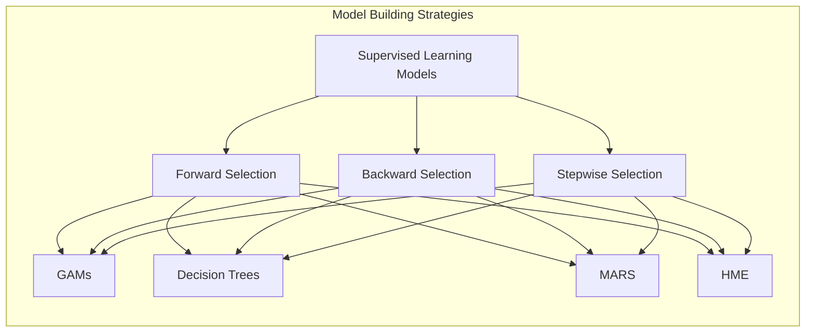

### Introdução

Este capítulo explora as diferentes estratégias para a construção de modelos de aprendizado supervisionado, com foco em como a escolha dessas abordagens impacta a complexidade, a interpretabilidade e a capacidade de generalização dos modelos, particularmente em Modelos Aditivos Generalizados (GAMs), árvores de decisão, Multivariate Adaptive Regression Splines (MARS) e misturas hierárquicas de especialistas (HME) [^9.1]. A construção de modelos, que envolve a escolha dos preditores, a sua representação, a escolha da função de ligação, e a escolha dos parâmetros de regularização, é guiada por diferentes estratégias, e o objetivo deste capítulo é apresentar as abordagens mais comuns para construção de modelos, incluindo *forward selection*, *backward selection*, *stepwise selection* e outras abordagens, e como elas são utilizadas em cada modelo e como as decisões tomadas durante a construção do modelo impactam o resultado final da modelagem.

### Conceitos Fundamentais

**Conceito 1: Estratégias de Construção de Modelos: *Forward Selection* e *Backward Selection***

A construção de modelos estatísticos envolve a escolha das variáveis, funções, parâmetros e da estrutura do modelo de forma adequada para representar as relações entre os preditores e a resposta. Algumas abordagens são utilizadas para guiar essa escolha, incluindo *forward selection* e *backward selection*:

*   ***Forward Selection*:** O algoritmo *forward selection* começa com um modelo simples, com um número reduzido de preditores (ou nenhum), e adiciona um preditor a cada iteração, baseado em um critério de escolha, que geralmente é a redução do erro ou da função de custo. O algoritmo continua a adicionar preditores até que um critério de parada seja atingido, e em cada passo ele busca a variável que mais adiciona valor ao modelo.
*   ***Backward Selection*:** O algoritmo *backward selection* começa com um modelo que utiliza todos os preditores e, em cada iteração, remove um preditor, baseado em um critério de escolha, como o erro de classificação ou a deviance. O algoritmo remove as variáveis que menos contribuem para a capacidade preditiva do modelo até que um critério de parada seja atingido.

Ambas abordagens são utilizadas como estratégias para a construção de modelos, onde a escolha de cada passo é gulosa, ou seja, a escolha local é feita para melhorar o modelo em cada iteração.

> 💡 **Exemplo Numérico:**
> Suponha que temos um dataset com uma variável resposta `y` e três preditores `x1`, `x2` e `x3`.
>
> **Forward Selection:**
> 1. **Início:** Modelo com apenas o intercepto (erro inicial alto).
> 2. **Passo 1:** Testamos adicionar `x1`, `x2` e `x3` individualmente. Suponha que adicionar `x1` resulta na maior redução do erro (e.g., o menor MSE). O modelo agora é `y = b0 + b1*x1`.
> 3. **Passo 2:** Testamos adicionar `x2` e `x3` ao modelo atual. Suponha que adicionar `x2` resulta na maior redução do erro. O modelo agora é `y = b0 + b1*x1 + b2*x2`.
> 4. **Passo 3:** Testamos adicionar `x3`. Se a redução do erro não for significativa, o algoritmo para.
>
> **Backward Selection:**
> 1. **Início:** Modelo com todos os preditores: `y = b0 + b1*x1 + b2*x2 + b3*x3`.
> 2. **Passo 1:** Testamos remover `x1`, `x2` e `x3` individualmente. Suponha que remover `x3` resulta no menor aumento do erro (ou seja, `x3` é o menos importante). O modelo agora é `y = b0 + b1*x1 + b2*x2`.
> 3. **Passo 2:** Testamos remover `x1` e `x2`. Suponha que remover `x2` resulta no menor aumento do erro. O modelo agora é `y = b0 + b1*x1`.
> 4. **Passo 3:** Testamos remover `x1`. Se o aumento do erro for significativo, o algoritmo para.
>
> Este exemplo ilustra como *forward* e *backward selection* funcionam na prática. A escolha de qual variável adicionar ou remover é baseada na redução do erro ou em alguma outra métrica de desempenho.

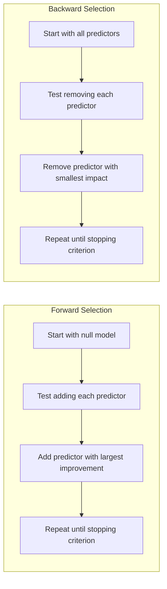

**Lemma 1:** *Os algoritmos *forward selection* e *backward selection* são abordagens gulosas para a escolha de preditores em modelos estatísticos, que constroem modelos de forma iterativa, adicionando ou removendo preditores em cada etapa. A escolha do modelo é feita com base em critérios locais e não globais. As abordagens *forward* e *backward* guiam a construção do modelo, e podem levar a modelos com características diferentes*. A escolha do algoritmo depende do contexto, e de como os preditores se relacionam com a variável resposta [^4.5].

**Conceito 2: Estratégia de Construção de Modelos: *Stepwise Selection***

O algoritmo *stepwise selection* combina as abordagens de *forward selection* e *backward selection*, de modo que o algoritmo adiciona preditores a cada iteração, e também remove preditores que se tornam menos relevantes. O algoritmo itera entre os passos de adicionar e remover, e pode convergir mais rapidamente para um conjunto de preditores mais apropriado para modelar os dados. O processo de seleção de variáveis, com o uso de *stepwise selection*, é uma forma de automatizar a construção do modelo, mas requer um critério apropriado para a escolha e remoção das variáveis. Em geral, algoritmos *stepwise selection* buscam modelos com uma boa capacidade de ajuste e boa capacidade de generalização.

> 💡 **Exemplo Numérico:**
> Usando o mesmo dataset com `y`, `x1`, `x2` e `x3`:
>
> 1. **Início:** Modelo com o intercepto.
> 2. **Passo 1 (Forward):** Adiciona-se `x1` (maior redução de erro). Modelo: `y = b0 + b1*x1`.
> 3. **Passo 2 (Forward):** Adiciona-se `x2` (maior redução de erro). Modelo: `y = b0 + b1*x1 + b2*x2`.
> 4. **Passo 3 (Backward):** Testa-se remover `x1` ou `x2`. Suponha que remover `x1` aumenta o erro mais que remover `x2`. Mantém-se o modelo atual.
> 5. **Passo 4 (Forward):** Testa-se adicionar `x3`. Suponha que adicioná-lo reduz o erro. Modelo: `y = b0 + b1*x1 + b2*x2 + b3*x3`.
> 6. **Passo 5 (Backward):** Testa-se remover qualquer variável. Suponha que remover `x2` agora aumenta menos o erro. Modelo: `y = b0 + b1*x1 + b3*x3`.
> 7. O algoritmo continua alternando entre passos *forward* e *backward* até que nenhum preditor seja adicionado ou removido.

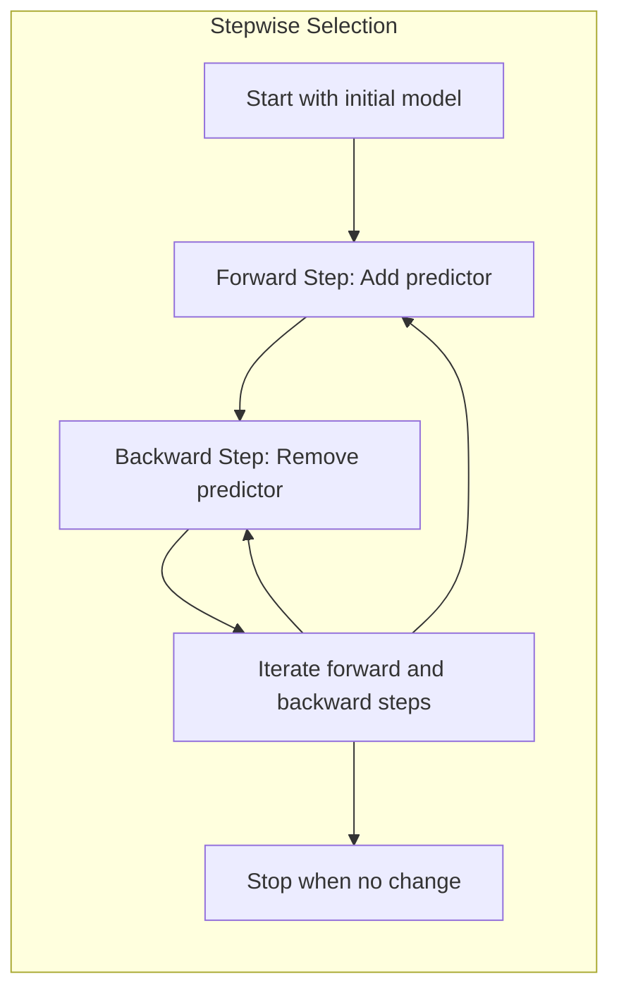

**Corolário 1:** *O algoritmo *stepwise selection* combina as abordagens *forward* e *backward*, o que resulta em um método mais flexível para a seleção de variáveis e na construção de modelos, e onde a escolha dos preditores é feita iterativamente, com base em critérios de escolha apropriados*. A combinação de passos de adição e remoção, faz com que o método encontre um modelo que maximize o ajuste e, também, minimize a complexidade [^4.5.1].

**Conceito 3: Critérios de Escolha e Métricas de Desempenho**

Na construção de modelos, os critérios de escolha são utilizados para definir qual preditor adicionar ou remover do modelo. Critérios baseados no erro quadrático médio (MSE), na soma dos quadrados dos resíduos (SSE), na deviance ou em métricas de classificação, são utilizados para medir o desempenho dos modelos e guiar a sua construção. A escolha da métrica depende do tipo de modelo e do problema de modelagem. Em modelos lineares, o SSE é utilizado, enquanto em modelos da família exponencial, a deviance é utilizada, e em árvores de decisão, o índice de Gini ou a entropia guiam a escolha da divisão dos nós. A escolha da métrica apropriada é fundamental para que a construção do modelo siga o objetivo de maximizar a sua capacidade preditiva ou a sua qualidade de ajuste, e modelos com diferentes métricas tendem a ter diferentes capacidades de generalização.

> 💡 **Exemplo Numérico:**
>
> Considere um modelo linear simples onde a resposta é $y$ e o preditor é $x$. O modelo é $y = \beta_0 + \beta_1 x + \epsilon$, onde $\epsilon$ é o erro.
>
> **SSE (Soma dos Quadrados dos Resíduos):**
>  $SSE = \sum_{i=1}^{n} (y_i - \hat{y}_i)^2$, onde $y_i$ é o valor observado e $\hat{y}_i$ é o valor predito pelo modelo. Suponha que temos três observações:
>
> | i | $x_i$ | $y_i$ | $\hat{y}_i$ | $(y_i - \hat{y}_i)^2$ |
> |---|---|---|---|---|
> | 1 | 1 | 2  | 1.8 | 0.04 |
> | 2 | 2 | 4  | 3.8 | 0.04 |
> | 3 | 3 | 5  | 5.8 | 0.64 |
>
> O $SSE$ seria $0.04 + 0.04 + 0.64 = 0.72$.
>
> **MSE (Erro Quadrático Médio):**
> $MSE = \frac{SSE}{n}$, onde $n$ é o número de observações.
> Neste caso, $MSE = \frac{0.72}{3} = 0.24$.
>
> **Deviance:** Para modelos da família exponencial (como regressão logística), a deviance mede a diferença entre o modelo ajustado e um modelo saturado (que ajusta perfeitamente os dados). Em modelos de regressão logística, a deviance é dada por:
> $D = -2\sum_{i=1}^{n} [y_i \log(\hat{p}_i) + (1 - y_i) \log(1 - \hat{p}_i)]$, onde $\hat{p}_i$ é a probabilidade predita do evento.

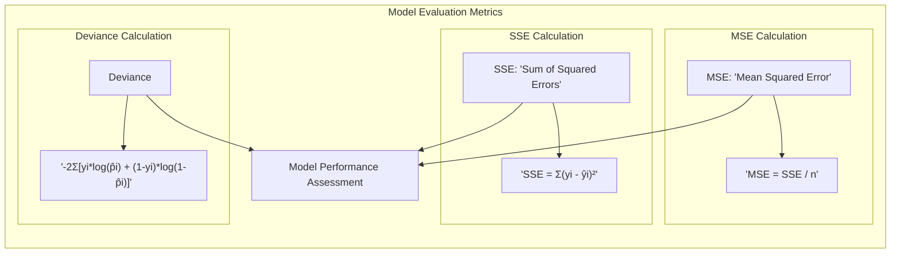

> ⚠️ **Nota Importante:** A escolha do critério para a seleção de variáveis, componentes ou termos do modelo, influencia a capacidade do modelo de generalizar e as suas propriedades estatísticas. A escolha do método de avaliação deve considerar o objetivo da modelagem, e o *trade-off* entre ajuste, interpretabilidade e generalização [^4.4.4].

> ❗ **Ponto de Atenção:** Critérios de escolha baseados apenas nos dados de treinamento podem levar a modelos que têm *overfitting* e com um desempenho ruim em dados não vistos. A utilização de validação cruzada ou de outros métodos de validação é importante para garantir a escolha de modelos com boa capacidade de generalização [^4.4.5].

> ✔️ **Destaque:** A utilização de critérios de escolha apropriados é essencial para a construção de modelos estatísticos eficientes. A escolha do critério depende do modelo, da natureza dos dados e dos objetivos da modelagem. A escolha do modelo, portanto, deve considerar todos os componentes, incluindo o método de estimação e a escolha dos preditores [^4.3.1], [^4.3.2], [^4.3.3].

### Aplicação de Métodos de Seleção de Variáveis: Construção de Modelos GAMs, Árvores de Decisão, MARS e HME

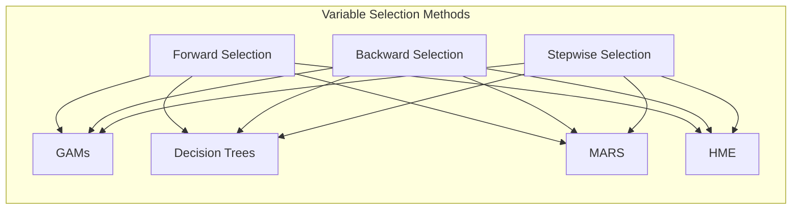

A aplicação de métodos de seleção de variáveis em diferentes modelos de aprendizado supervisionado pode ser feita através de diversas abordagens:

1. **Modelos Aditivos Generalizados (GAMs):** Em GAMs, a seleção de variáveis pode ser feita utilizando:
    *   **Regularização L1:** O uso de penalização L1, também conhecida como LASSO, pode levar à escolha de um subconjunto de preditores. A penalização L1 leva a soluções esparsas onde alguns coeficientes são iguais a zero.
    *  **Forward Selection:** O algoritmo *forward selection* pode ser utilizado para adicionar preditores de forma iterativa, com base na sua capacidade de melhorar o ajuste do modelo ou minimizar a deviance.
    *  **Backward Selection:** O algoritmo *backward selection* pode ser utilizado para remover preditores que têm menor contribuição para a função de custo, começando com todos os preditores e removendo-os até que um critério de parada seja atingido.

> 💡 **Exemplo Numérico (GAMs com Regularização L1):**
> Suponha um GAM com três preditores: $y = \alpha + f_1(x_1) + f_2(x_2) + f_3(x_3) + \epsilon$
>
> Regularização L1 adiciona uma penalidade à função de custo:
> $Cost = \sum_{i=1}^{n}(y_i - \hat{y}_i)^2 + \lambda (||\beta_1||_1 + ||\beta_2||_1 + ||\beta_3||_1)$, onde $\lambda$ é o parâmetro de regularização e $||\beta_j||_1$ são as normas L1 dos coeficientes dos preditores.
>
> Se $\lambda$ for grande, a penalidade força alguns coeficientes a serem zero, o que efetivamente remove o preditor do modelo. Por exemplo, se após a otimização, $\beta_2 = 0$, o modelo se torna $y = \alpha + f_1(x_1) + f_3(x_3) + \epsilon$, indicando que $x_2$ foi selecionado para ser removido.

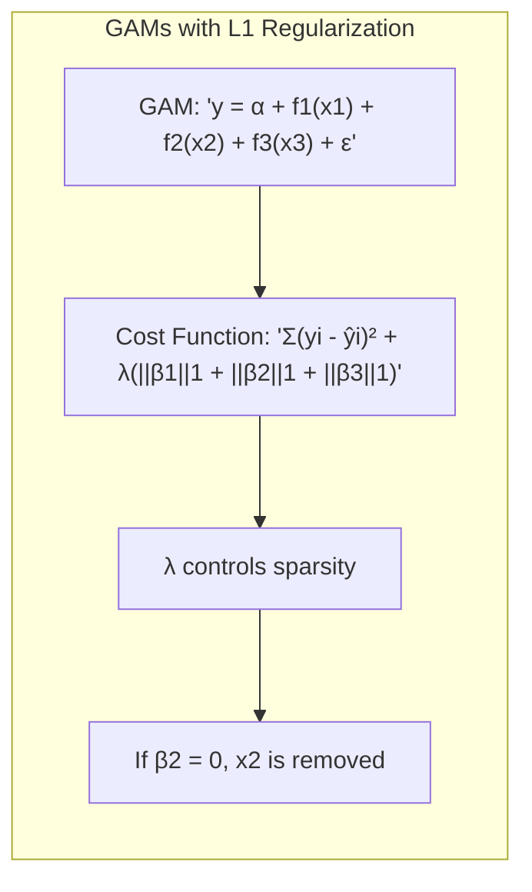

2.  **Árvores de Decisão:** Em árvores de decisão, a seleção de variáveis ocorre no processo de construção da árvore, onde a escolha do preditor que divide o nó é feita de forma gulosa, e a utilização de *surrogate splits* permite que o modelo escolha um preditor alternativo para as observações com valores ausentes. Além disso, o *pruning* é utilizado para remover os nós menos relevantes e com alta impureza, o que seleciona as variáveis importantes.

> 💡 **Exemplo Numérico (Árvores de Decisão):**
> Considere uma árvore de decisão para classificar se um cliente comprará um produto (sim/não) baseado em idade e renda.
>
> 1. **Nó Raiz:** O algoritmo testa qual variável (idade ou renda) separa melhor os clientes em grupos de compradores e não-compradores.
> 2. Suponha que a renda seja escolhida, e o nó é dividido em renda > R\\$5000 e renda <= R\\$5000.
> 3. **Nó Filho (renda > R\\$5000):** O algoritmo testa se a idade divide bem este grupo. Suponha que idade > 30 seja escolhido.
> 4. **Poda (Pruning):** Se a divisão por idade em renda > R\\$5000 não melhorar muito a classificação, este nó pode ser removido (podado), indicando que a idade não foi uma variável muito importante para este subgrupo.
>
> A árvore usa a informação ganha com cada divisão para escolher as variáveis mais importantes.

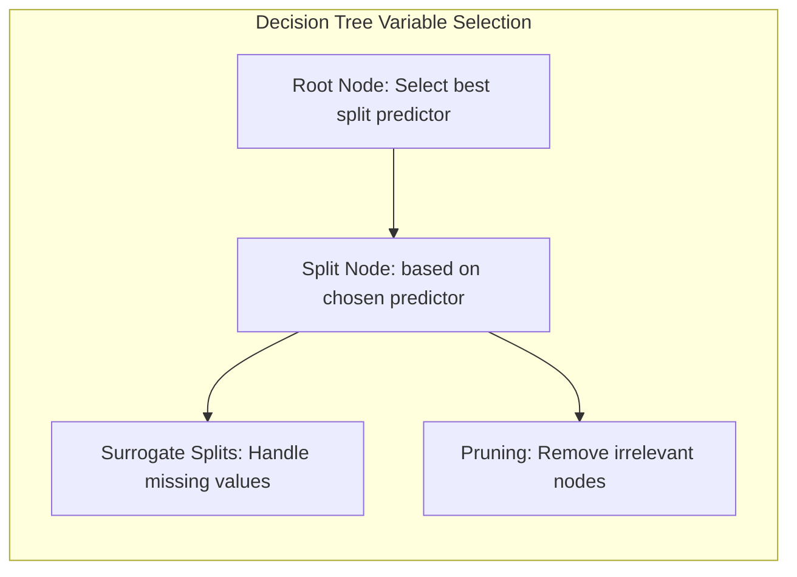

3. **Multivariate Adaptive Regression Splines (MARS):** Em MARS, um algoritmo *forward stagewise* é utilizado para adicionar componentes de forma iterativa, e um passo *backward* remove termos menos relevantes, e o processo é guiado por um critério de redução do erro. O processo de *forward* e *backward* realiza a seleção de variáveis de forma conjunta com o ajuste dos parâmetros. A escolha de termos de interações também influencia o processo de seleção.

> 💡 **Exemplo Numérico (MARS):**
> Suponha que temos um modelo com dois preditores, `x1` e `x2`. O MARS pode criar funções base como:
>
> $B_1(x_1) = \max(0, x_1 - c_1)$
>
> $B_2(x_1) = \max(0, c_2 - x_1)$
>
> $B_3(x_2) = \max(0, x_2 - c_3)$
>
> $B_4(x_2) = \max(0, c_4 - x_2)$
>
> Onde $c_i$ são constantes.
>
> **Forward Step:** O algoritmo adiciona bases de forma iterativa, por exemplo, primeiro $B_1(x_1)$, então $B_3(x_2)$, e possivelmente uma interação como $B_1(x_1) * B_3(x_2)$.
>
> **Backward Step:** Se a base $B_4(x_2)$ não adicionar muito valor ao modelo, ela é removida.

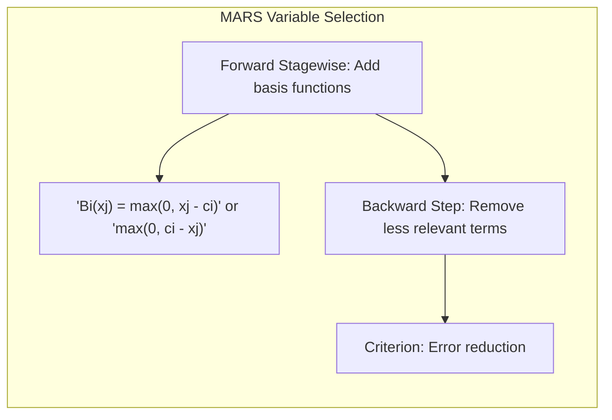

4. **Misturas Hierárquicas de Especialistas (HME):** Em HME, a seleção de variáveis pode ser feita de forma implícita, através da escolha dos especialistas que têm melhor desempenho em diferentes regiões do espaço dos preditores. O uso de regularização também pode penalizar o uso de muitos especialistas. A seleção de variáveis é feita indiretamente através da escolha dos componentes do modelo.

> 💡 **Exemplo Numérico (HME):**
> Em um modelo HME, temos um *gating network* e vários especialistas.
>
> 1. **Gating Network:** A rede *gating* decide qual especialista é mais apropriado para cada região do espaço de preditores.
> 2. **Especialistas:** Cada especialista modela uma parte específica dos dados.
>
> Se um especialista se torna irrelevante (sua ativação é muito baixa para todos os dados), a rede *gating* efetivamente o remove do modelo, o que equivale a uma seleção de variáveis.

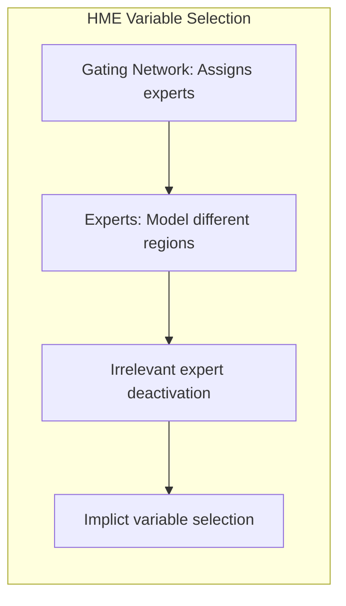

Em todos os modelos, a escolha do método de seleção de variáveis e seus parâmetros influencia a complexidade e interpretabilidade dos modelos, e a sua capacidade de generalização.

### Impacto da Escolha do Modelo na Modelagem de Interações e Não Linearidades

A escolha entre GAMs, árvores de decisão, MARS e HME também influencia na capacidade de modelar interações e não linearidades. GAMs, com a sua estrutura aditiva, utilizam funções não paramétricas que podem representar não linearidades, mas que têm limitações para modelar interações complexas. Árvores de decisão modelam interações através de partições binárias que dividem o espaço de dados, e a sua capacidade de modelar interações é limitada à forma como o espaço é dividido. MARS utiliza funções *spline* lineares por partes que modelam não linearidades, e pode modelar interações através da combinação de funções de base. HME utiliza uma combinação de modelos locais que podem modelar interações complexas através das redes de *gating*. A escolha do modelo apropriado deve considerar a necessidade de modelar interações e não linearidades nos dados.

### Propriedades das Estratégias de Construção de Modelos e o *Trade-Off* entre *Bias* e Variância

A escolha de diferentes estratégias de construção de modelos, como *forward selection* ou *backward selection* e a utilização de regularização, influencia o *trade-off* entre o *bias* e variância. Modelos construídos com poucas variáveis podem ter um alto *bias* e baixa variância, enquanto modelos com muitas variáveis, podem ter um menor *bias* e alta variância. O uso de regularização ou métodos de *pruning*, busca reduzir a variância do modelo, sem aumentar muito o seu *bias*. A escolha da abordagem de construção do modelo depende da natureza do problema, e do objetivo da modelagem, e a escolha do modelo deve considerar os objetivos da análise e a capacidade de generalização desejada.

> 💡 **Exemplo Numérico (Bias-Variância):**
>
> Suponha que queremos modelar uma relação quadrática entre `x` e `y`, onde $y = 2x^2 + \epsilon$, e $\epsilon$ é ruído.
>
> **Modelo Simples (Alto Bias, Baixa Variância):** Um modelo linear $y = \beta_0 + \beta_1 x$ não consegue capturar a curvatura, resultando em alto *bias*. Mesmo com dados diferentes, o modelo linear mudaria pouco, indicando baixa variância.
>
> **Modelo Complexo (Baixo Bias, Alta Variância):** Um modelo polinomial de alta ordem $y = \beta_0 + \beta_1 x + \beta_2 x^2 + \ldots + \beta_n x^n$ (com $n$ grande) poderia se ajustar perfeitamente aos dados de treinamento, mas seria muito sensível a variações nos dados, apresentando alta variância e *overfitting*.
>
> **Regularização:** A regularização (e.g., L1 ou L2) adiciona uma penalidade aos coeficientes do modelo complexo, reduzindo a variância e controlando o *trade-off* entre *bias* e variância.

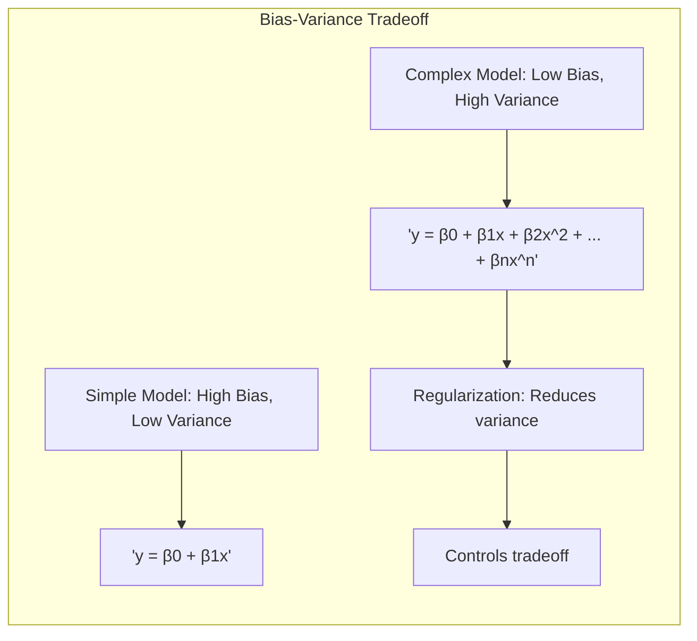

### Perguntas Teóricas Avançadas: Como diferentes métodos de seleção de variáveis (forward, backward e stepwise) interagem com os algoritmos de otimização (backfitting, Newton-Raphson) e como esta interação afeta a capacidade de modelagem e generalização?

**Resposta:**

Diferentes métodos de seleção de variáveis (*forward*, *backward* e *stepwise*) interagem de forma complexa com algoritmos de otimização como *backfitting* e Newton-Raphson, e essa interação tem um impacto significativo na capacidade de modelagem e generalização dos modelos.

A seleção de variáveis *forward*, *backward* e *stepwise* são métodos gulosos que buscam encontrar um subconjunto de preditores relevantes com base em critérios locais de otimização, sem a necessidade de um processo de otimização sobre todos os parâmetros do modelo de forma conjunta, como no caso do uso de penalizações L1 e L2. A escolha do método de seleção e do critério de avaliação pode afetar a solução final e a sua capacidade de generalização. O algoritmo *forward selection* adiciona um preditor a cada passo, o que pode levar a modelos com melhor desempenho inicial, enquanto que o *backward selection* remove os preditores menos relevantes. O algoritmo *stepwise* busca adicionar e remover preditores iterativamente, de modo a encontrar um subconjunto de preditores que otimize a função de custo.

Modelos aditivos generalizados (GAMs) utilizam o algoritmo de backfitting e, em geral, modelos da família exponencial utilizam aproximações iterativas do método de Newton-Raphson para estimar os parâmetros. A combinação dos métodos de seleção de variáveis com o algoritmo de backfitting e o método de Newton-Raphson pode levar a modelos com melhor capacidade de generalização. Em GAMs, a seleção de variáveis pode ser feita através da penalização L1 ou L2, ou com a utilização de métodos *forward* ou *backward*, de modo que o modelo seja mais parcimonioso e adequado para dados de alta dimensão.

> 💡 **Exemplo Numérico (GAMs com Backfitting e Forward Selection):**
>
> Considere um GAM: $y = \alpha + f_1(x_1) + f_2(x_2) + f_3(x_3) + \epsilon$.
>
> **Backfitting:** O algoritmo de backfitting estima as funções $f_j$ iterativamente, mantendo as outras fixas. Por exemplo, estima $f_1$ enquanto $f_2$ e $f_3$ são mantidas fixas, e assim por diante.
>
> **Forward Selection:**
> 1. **Início:** O modelo começa com $y = \alpha$.
> 2. **Passo 1:** Usando backfitting, testa-se adicionar $f_1(x_1)$, $f_2(x_2)$ e $f_3(x_3)$ individualmente. Suponha que $f_1(x_1)$ resulta na maior redução de erro. O modelo agora é $y = \alpha + f_1(x_1)$.
> 3. **Passo 2:** Testa-se adicionar $f_2(x_2)$ ou $f_3(x_3)$. Suponha que adicionar $f_2(x_2)$ resulta na maior redução de erro. O modelo agora é $y = \alpha + f_1(x_1) + f_2(x_2)$.
> 4. O algoritmo continua até que nenhum preditor adicione valor significativo ao modelo. O processo de backfitting é usado em cada passo para estimar as funções $f_j$.
>
> O uso conjunto do backfitting e do *forward selection* permite construir um modelo com bom ajuste e um número adequado de preditores.

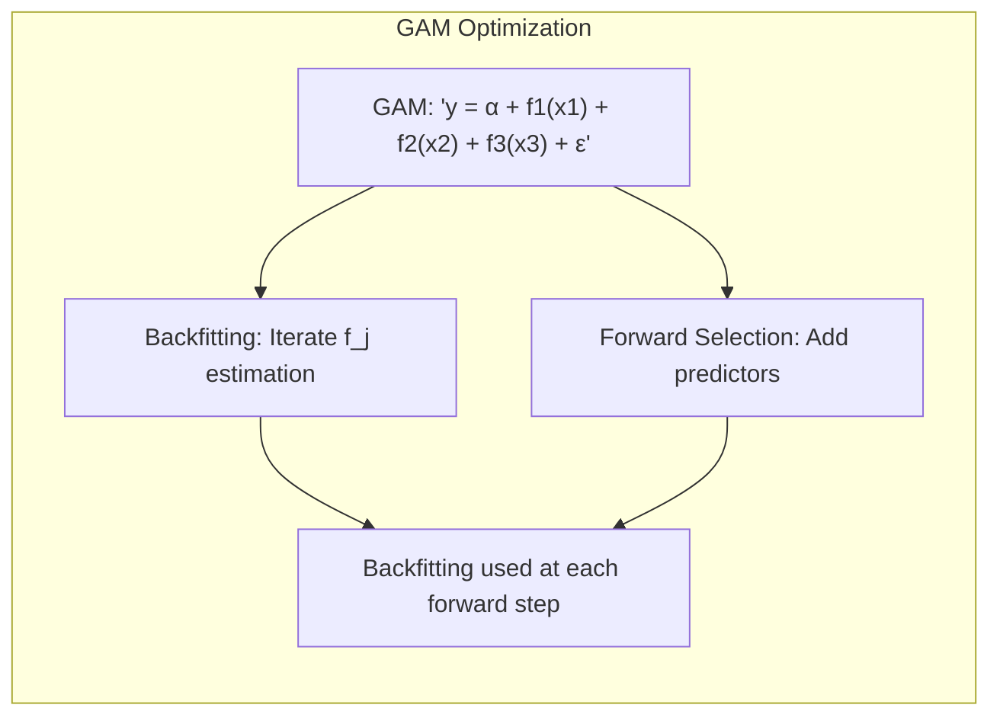

As propriedades assintóticas dos estimadores, também são afetadas pelos métodos de seleção de variáveis. Em geral, métodos de seleção de variáveis podem gerar modelos mais esparsos, e mais fáceis de interpretar, mas também podem levar a estimativas viesadas dos parâmetros, uma vez que as escolhas são feitas localmente, e modelos que não representam a melhor solução global. A escolha dos métodos de seleção de variáveis, portanto, deve considerar a sua relação com o modelo e com o método de estimação, de modo que o modelo resultante seja estável e com uma boa capacidade de generalização. A relação entre métodos de seleção de variáveis e métodos de otimização é complexa, e depende das abordagens utilizadas na modelagem.

**Lemma 5:** *Os métodos de seleção de variáveis, em conjunto com os algoritmos de otimização, como *backfitting* e Newton-Raphson, influenciam a capacidade de modelagem, a estabilidade e a qualidade dos resultados de modelos estatísticos. A escolha de um algoritmo de seleção e de otimização adequados deve considerar a natureza dos dados e as suas limitações*. A combinação de métodos de seleção e otimização gera modelos com características específicas [^4.5].

**Corolário 5:** *A combinação de algoritmos de seleção de variáveis com algoritmos de otimização como *backfitting* e Newton-Raphson é crucial para a construção de modelos com bom desempenho. O uso adequado das abordagens de seleção de variáveis permite modelos mais simples e com melhor capacidade de generalização, e a sua relação com algoritmos de otimização permite escolher um modelo que minimize o *bias* e a variância*. O conhecimento das propriedades dos métodos de seleção de variáveis e dos algoritmos de otimização é fundamental para a construção de modelos robustos [^4.4.4], [^4.4.5].

> ⚠️ **Ponto Crucial**: A escolha entre métodos de seleção de variáveis, como *forward*, *backward* ou *stepwise*, e a sua interação com os métodos de otimização, afeta diretamente a complexidade, a interpretabilidade e a capacidade de generalização do modelo. A combinação de métodos de seleção de variáveis e otimização é uma ferramenta útil na construção de modelos estatísticos adequados a diferentes problemas [^4.5.2].

### Conclusão

Este capítulo apresentou uma análise das diferentes estratégias de construção de modelos de aprendizado supervisionado, explorando os métodos de seleção de variáveis, regularização, o uso de funções de ligação, métodos de otimização e como esses componentes interagem e influenciam a capacidade de modelagem. A escolha dos métodos de construção, otimização e avaliação dos modelos depende da natureza dos dados, do objetivo da modelagem e da necessidade de um balanço entre flexibilidade, interpretabilidade e capacidade de generalização. A metodologia apresentada serve como guia na construção e avaliação de modelos estatísticos de forma mais adequada para os diferentes tipos de dados.

### Footnotes

[^4.1]: "In this chapter we begin our discussion of some specific methods for super-vised learning. These techniques each assume a (different) structured form for the unknown regression function, and by doing so they finesse the curse of dimensionality. Of course, they pay the possible price of misspecifying the model, and so in each case there is a tradeoff that has to be made." *(Trecho de "Additive Models, Trees, and Related Methods")*

[^4.2]: "Regression models play an important role in many data analyses, providing prediction and classification rules, and data analytic tools for understand-ing the importance of different inputs." *(Trecho de "Additive Models, Trees, and Related Methods")*

[^4.3]: "In this section we describe a modular algorithm for fitting additive models and their generalizations. The building block is the scatterplot smoother for fitting nonlinear effects in a flexible way. For concreteness we use as our scatterplot smoother the cubic smoothing spline described in Chapter 5." *(Trecho de "Additive Models, Trees, and Related Methods")*

[^4.3.1]:  "The additive model has the form $Y = \alpha + \sum_{j=1}^{p} f_j(X_j) + \epsilon$, where the error term $\epsilon$ has mean zero." * (Trecho de "Additive Models, Trees, and Related Methods")*

[^4.3.2]:   "Given observations $x_i, y_i$, a criterion like the penalized sum of squares (5.9) of Section 5.4 can be specified for this problem, $PRSS(\alpha, f_1, f_2,\ldots, f_p) = \sum_{i=1}^{N} (y_i - \alpha - \sum_{j=1}^{p} f_j(x_{ij}))^2 + \sum_{j=1}^{p} \lambda_j \int(f_j''(t_j))^2 dt_j$" * (Trecho de "Additive Models, Trees