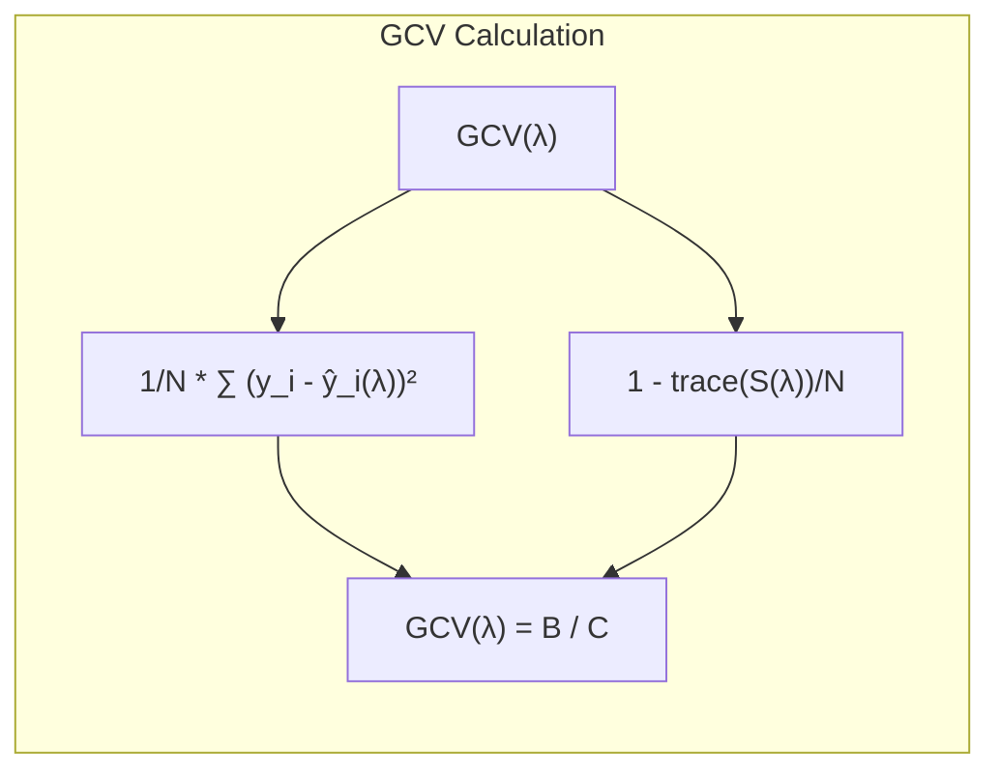
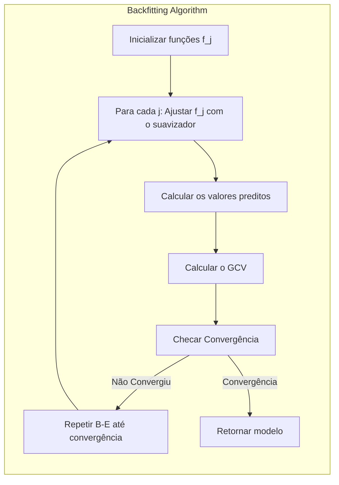
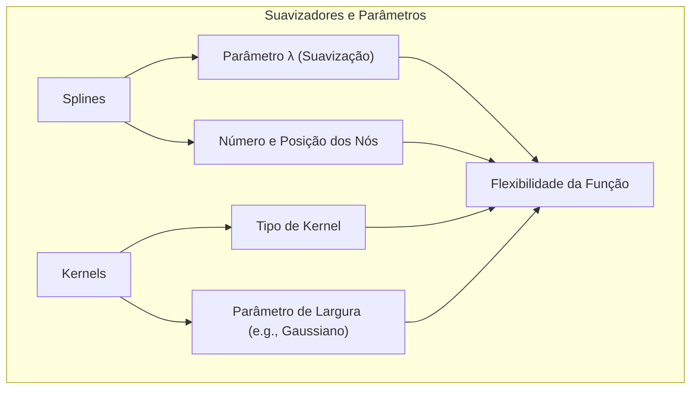
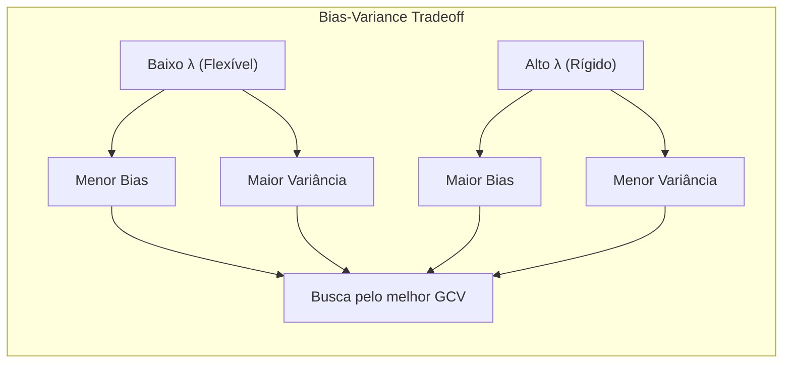

## Título: Modelos Aditivos, Árvores e Métodos Relacionados: Truncamento e Otimização de Funções com Validação Cruzada e GCV

<imagem: Um diagrama que ilustra o processo de truncamento e otimização de funções não paramétricas em modelos aditivos, como GAMs e MARS, utilizando validação cruzada e o critério de validação cruzada generalizada (GCV). O diagrama deve apresentar como o GCV é calculado, como o processo de truncamento simplifica a função, e como os parâmetros de regularização e suavização são ajustados durante a validação cruzada. O diagrama também deve mostrar como o método se relaciona com a ideia de capacidade de generalização do modelo.>

### Introdução

Este capítulo explora o processo de truncamento e otimização de funções não paramétricas em Modelos Aditivos Generalizados (GAMs) e modelos similares, através da utilização de validação cruzada e do critério de validação cruzada generalizada (GCV) [^9.1]. Em modelos flexíveis, a escolha adequada dos parâmetros de suavização e a complexidade do modelo são cruciais para obter um bom ajuste aos dados de treino e também uma boa capacidade de generalização. O truncamento de funções, através de técnicas de regularização e a utilização do GCV, é uma forma de simplificar o modelo, e de controlar a sua complexidade, de modo que ele não se adapte ao ruído dos dados, ou seja, evite o *overfitting*. O objetivo principal deste capítulo é apresentar como a validação cruzada e o GCV são utilizados para guiar a escolha dos parâmetros que definem as funções não paramétricas, e como essas abordagens influenciam a qualidade final da modelagem e a sua capacidade de generalização para dados não vistos.

### Conceitos Fundamentais

**Conceito 1: A Necessidade de Truncamento em Funções Não Paramétricas**

Em modelos aditivos generalizados (GAMs), a utilização de funções não paramétricas $f_j(X_j)$ permite modelar relações complexas entre preditores e resposta, mas a sua flexibilidade também pode levar ao *overfitting*. Modelos com muitas funções de base ou com funções muito flexíveis podem se ajustar muito bem aos dados de treino, mas podem ter um desempenho ruim em dados novos. O truncamento de funções, ou seja, a simplificação das funções através de algum critério de escolha, é utilizado para controlar a complexidade dos modelos e evitar o overfitting, reduzindo o número de parâmetros e as possíveis variações nas funções não paramétricas. A escolha do nível adequado de truncamento das funções é um componente importante da modelagem estatística.

> 💡 **Exemplo Numérico:** Imagine modelar a relação entre a idade de uma pessoa ($X_1$) e sua pressão arterial ($Y$). Usando uma função não paramétrica muito flexível, como um spline com muitos nós, o modelo poderia capturar variações aleatórias nos dados de treinamento, como picos de pressão em idades específicas. Ao truncar a função, usando um número menor de nós, ou um parâmetro de suavização mais forte, o modelo se tornaria mais suave e menos propenso a se ajustar a essas variações aleatórias, generalizando melhor para novas pessoas.

**Lemma 1:** *O truncamento de funções não paramétricas é fundamental para controlar a sua complexidade e para evitar overfitting. A escolha de funções mais simples e com menos parâmetros aumenta a capacidade de generalização dos modelos, e a escolha de modelos mais complexos pode levar a um ajuste perfeito nos dados de treino, mas com um desempenho ruim para dados não vistos*. O truncamento é uma forma de controlar a complexidade em modelos não paramétricos [^4.5].

**Conceito 2: Validação Cruzada na Otimização de Modelos**

A validação cruzada é uma técnica fundamental para a avaliação e escolha de modelos estatísticos. O processo de validação cruzada envolve a divisão dos dados em diferentes partes (folds), onde um subconjunto é utilizado para o treinamento do modelo e outro para a sua avaliação, e o processo é repetido várias vezes para obter uma estimativa robusta do seu desempenho. A validação cruzada é importante para avaliar a capacidade de generalização do modelo e para escolher os parâmetros que maximizam o seu desempenho em dados não vistos no treinamento. A validação cruzada é utilizada para estimar o erro de predição do modelo, e para que as estimativas sejam válidas para dados novos.

> 💡 **Exemplo Numérico:** Suponha que temos um conjunto de dados com 100 observações para modelar a relação entre o número de horas de estudo ($X_2$) e a nota em um exame ($Y$). Podemos utilizar a validação cruzada com 5 folds. Dividimos os dados em 5 partes, usamos 4 para treinar o modelo e 1 para testar, repetindo o processo 5 vezes, cada vez usando uma parte diferente para teste. O desempenho do modelo (por exemplo, o erro médio quadrático) é calculado em cada fold, e a média desses erros é uma estimativa do desempenho do modelo em dados não vistos.

**Corolário 1:** *A validação cruzada é um método para estimar o desempenho de modelos estatísticos em dados não vistos no treinamento, e é uma ferramenta essencial para a escolha de modelos robustos e com boa capacidade de generalização. A validação cruzada é utilizada para controlar a complexidade do modelo, através da escolha de seus parâmetros e de suas opções de suavização*. A validação cruzada é fundamental para a escolha de modelos de aprendizado supervisionado [^4.5.2].

**Conceito 3: Critério de Validação Cruzada Generalizada (GCV)**

O critério de validação cruzada generalizada (Generalized Cross-Validation - GCV) é um critério para a escolha do parâmetro de suavização em modelos aditivos e outros modelos. O GCV é uma aproximação do erro de validação cruzada, e é calculado utilizando as seguintes fórmulas:

$$
\text{GCV}(\lambda) = \frac{1}{N}\sum_{i=1}^N \left(\frac{y_i - \hat{y}_i(\lambda)}{1 - \text{trace}(S(\lambda))/N}\right)^2
$$

onde $\lambda$ é o parâmetro de suavização, $\hat{y}_i(\lambda)$ é o valor predito para observação $i$ utilizando o parâmetro de suavização $\lambda$, $S(\lambda)$ é a matriz de projeção do suavizador, e $N$ é o número de observações. O GCV é uma forma de estimar o erro de previsão do modelo, considerando a complexidade do modelo e a sua capacidade de se ajustar aos dados. O GCV é uma forma de estimar o erro que deve ser minimizado para escolher o melhor modelo.



> 💡 **Exemplo Numérico:** Suponha que estamos usando um modelo GAM para prever o preço de casas ($Y$) com base na área ($X_3$). Após ajustar o modelo com diferentes valores de $\lambda$, obtemos os seguintes resultados para o GCV:

| $\lambda$ | trace(S($\lambda$)) | GCV($\lambda$) |
|---|---|---|
| 0.1  | 8.2  | 12000  |
| 1.0  | 4.5 | 10500  |
| 10.0 | 2.1  | 11800  |

Neste exemplo, com N=100, o GCV é calculado para cada valor de $\lambda$. O valor de $\lambda$=1.0 apresenta o menor GCV, indicando um melhor equilíbrio entre o ajuste aos dados e a complexidade do modelo, sendo este o valor escolhido para o parâmetro de suavização.

> ⚠️ **Nota Importante:** O critério de validação cruzada generalizada (GCV) é uma aproximação do erro de validação cruzada e é utilizado para escolher os parâmetros de suavização em modelos aditivos e outros modelos. O GCV leva em consideração a complexidade do modelo, e busca modelos que tenham um bom ajuste e boa capacidade de generalização [^9.4.1].

> ❗ **Ponto de Atenção:** A utilização do GCV permite a seleção de modelos com um bom balanço entre ajuste e complexidade, mas não é uma garantia que o modelo resultante seja ótimo globalmente. A avaliação final do modelo deve ser feita utilizando um conjunto de teste separado do conjunto de validação [^9.4].

> ✔️ **Destaque:** O GCV é uma ferramenta útil para controlar a complexidade dos modelos e para escolher os parâmetros de suavização em modelos de aprendizado supervisionado. A sua utilização resulta em modelos com um bom desempenho em dados não vistos [^9.4].

### Truncamento de Funções com Validação Cruzada e GCV: Detalhes da Implementação e Otimização

<imagem: Um diagrama de fluxo que ilustra o processo de truncamento e otimização de funções não paramétricas em modelos de aprendizado supervisionado. O diagrama deve apresentar como o GCV é utilizado para escolher o parâmetro de suavização, como a validação cruzada é utilizada para avaliar o desempenho das diferentes opções de truncamento e como o algoritmo de backfitting é adaptado para a minimização da função de custo com o critério de GCV.>

```mermaid
flowchart TD
  subgraph Truncamento de Funções e Otimização com GCV
     A[Definir o Modelo (e.g., GAM) com Funções de Base Flexíveis] --> B[Escolher um conjunto de parâmetros de suavização]
     B --> C[Aplicar Validação Cruzada para avaliar o desempenho do modelo usando as funções definidas por parâmetro]
       C --> D[Calcular GCV para cada valor do parâmetro $\lambda$ : $GCV(\lambda) = \frac{1}{N}\sum_{i=1}^N \left(\frac{y_i - \hat{y}_i(\lambda)}{1 - \text{trace}(S(\lambda))/N}\right)^2$ ]
       D --> E[Selecionar Parâmetro de Suavização $\lambda$ que minimiza o GCV]
      E --> F[Truncar as Funções utilizando o Parâmetro $\lambda$ escolhido]
       F --> G[Retornar o Modelo com as Funções Truncadas]
     end
```

**Explicação:** Este diagrama detalha o processo de truncamento e otimização de funções utilizando validação cruzada e o critério de validação cruzada generalizada (GCV). O diagrama apresenta os passos para a escolha do parâmetro de suavização e como este parâmetro afeta a complexidade do modelo, conforme descrito nos tópicos [^4.3.3], [^9.4], [^9.4.1].

O processo de truncamento e otimização de funções em modelos estatísticos envolve os seguintes passos:

1.  **Definição do Modelo:** O primeiro passo é a escolha de um modelo, por exemplo, um modelo aditivo generalizado (GAMs) com funções não paramétricas, com o uso de *splines* ou outros suavizadores.
2.  **Escolha de Parâmetros de Suavização:** Escolher um conjunto de parâmetros de suavização que controlam a flexibilidade das funções não paramétricas. Cada parâmetro representa um grau diferente de suavização, o que define diferentes níveis de complexidade para o modelo.
3.  **Validação Cruzada:** Aplicar o método de validação cruzada para avaliar o desempenho do modelo para cada parâmetro de suavização. O método de validação cruzada estima o erro de generalização do modelo, simulando o desempenho em dados não vistos.
4.  **Cálculo do GCV:** Para cada parâmetro de suavização, calcular o critério de validação cruzada generalizada (GCV):
   $$
    \text{GCV}(\lambda) = \frac{1}{N}\sum_{i=1}^N \left(\frac{y_i - \hat{y}_i(\lambda)}{1 - \text{trace}(S(\lambda))/N}\right)^2
    $$
    onde $\hat{y}_i(\lambda)$ é o valor predito para observação $i$ utilizando o parâmetro de suavização $\lambda$, $S(\lambda)$ é a matriz de projeção do suavizador, e $N$ é o número de observações. O GCV estima o erro de predição do modelo levando em consideração a complexidade do modelo.
5.  **Escolha do Parâmetro de Suavização:** Escolher o parâmetro de suavização $\lambda$ que minimiza o GCV, que representa a escolha do modelo com a melhor capacidade de generalização, dada a estrutura do modelo.
6.   **Truncamento das Funções:** As funções não paramétricas são truncadas com base no parâmetro de suavização escolhido. O truncamento é utilizado para limitar a complexidade do modelo e evitar o overfitting, com base nas propriedades do suavizador.
7.  **Retorno do Modelo com Funções Truncadas:** O modelo final, com as funções truncadas e o parâmetro de suavização escolhido, é retornado.

O processo de truncamento e otimização, por isso, busca encontrar o modelo com a melhor capacidade de generalização, através de um processo iterativo de estimação e avaliação do desempenho.

> 💡 **Exemplo Numérico:** Vamos supor que estamos modelando a relação entre a temperatura média diária ($X_4$) e o consumo de energia ($Y$) usando um GAM com splines cúbicos. Após o ajuste do modelo, obtemos os seguintes resultados para diferentes valores de $\lambda$ (parâmetro de suavização):

| $\lambda$ | Erro de Validação Cruzada |  GCV  |
|---|---|---|
| 0.01 | 150 | 160 |
| 0.1  | 100 | 110 |
| 1    | 90  | 95  |
| 10   | 110 | 115 |

O valor de $\lambda = 1$ apresenta o menor GCV e o menor erro de validação cruzada. O truncamento das funções de base do spline usando $\lambda = 1$ resulta em um modelo mais generalizável, evitando o overfitting que ocorreria com $\lambda=0.01$.

**Lemma 5:** *A utilização do GCV, em conjunto com a validação cruzada, permite escolher o parâmetro de suavização que minimiza a complexidade do modelo e maximiza a capacidade de generalização. A aplicação do truncamento controla a flexibilidade das funções não paramétricas e evita o overfitting*. A escolha dos parâmetros de regularização influencia diretamente o desempenho do modelo e a sua capacidade de generalização [^9.4].

### A Relação do GCV com a Família Exponencial e o Algoritmo de Backfitting

Em modelos GAMs, a utilização de funções de ligação canônicas e do algoritmo de backfitting, permite que o modelo seja otimizado através da maximização da *log-likelihood* ou de uma aproximação desta com o algoritmo IRLS (Iteratively Reweighted Least Squares). O critério de GCV é geralmente utilizado para selecionar o parâmetro de suavização. O algoritmo de backfitting, combinado com a utilização do GCV, leva a um método de otimização eficiente e estável para Modelos Aditivos Generalizados. A utilização de modelos da família exponencial, permite que as funções de ligação canônicas sejam utilizadas para modelar diferentes tipos de dados. A utilização da validação cruzada e do GCV garante que os parâmetros sejam escolhidos de forma apropriada e que o modelo tenha um bom desempenho.



> 💡 **Exemplo Numérico:** Considere um modelo GAM com resposta binomial (por exemplo, sucesso/falha de um tratamento médico) e preditores como idade ($X_1$) e dosagem de medicamento ($X_5$). O algoritmo de backfitting ajusta as funções não paramétricas para cada preditor, e o GCV é usado para escolher o parâmetro de suavização para cada função. O modelo é otimizado usando IRLS para encontrar os parâmetros que maximizam a verossimilhança da família exponencial, com o GCV guiando a escolha da complexidade das funções.

### Propriedades dos Modelos Após o Truncamento e Validação Cruzada

Após o truncamento e utilização da validação cruzada, o modelo obtido tem características específicas:
* O modelo tem uma complexidade controlada pelo parâmetro de suavização, que foi escolhido utilizando o GCV.
* A escolha das funções não paramétricas e o parâmetro de suavização definem a sua capacidade de modelar não linearidades e suas interações.
* A validação cruzada garante que o modelo tenha um bom desempenho em dados não utilizados no treinamento, o que aumenta a sua capacidade de generalização.

### Perguntas Teóricas Avançadas: Como diferentes funções de suavização interagem com a escolha do parâmetro de suavização $\lambda$ no GCV e quais são as implicações dessa interação para a capacidade de generalização dos modelos?

**Resposta:**

A escolha da função de suavização e do parâmetro de suavização $\lambda$ no GCV (Generalized Cross-Validation) têm uma interação complexa que influencia a capacidade de generalização dos modelos. Diferentes funções de suavização têm propriedades distintas, e como elas interagem com o parâmetro de suavização afeta a estabilidade e o poder preditivo dos modelos.

*   **Splines:** As funções *spline* são uma base flexível, e a escolha do número de nós, e a sua posição, tem um impacto significativo sobre a forma final da função. A escolha do parâmetro de suavização $\lambda$ em *splines* influencia como a função se aproxima dos dados, sendo que valores pequenos de $\lambda$ levam a modelos mais flexíveis, que se ajustam aos dados com mais precisão, e valores grandes de $\lambda$ levam a modelos mais suaves. A interação entre o parâmetro de suavização e a escolha dos nós determina a forma da função.
*   **Kernels:** As funções *kernel* transformam o espaço de características, e a escolha do tipo de *kernel* e dos seus parâmetros influencia a forma como o espaço de características é transformado. A escolha de um *kernel* apropriado permite a modelagem de relações complexas e não lineares, e parâmetros de suavização, como o parâmetro de largura de um *kernel* gaussiano, controlam a flexibilidade da transformação e a capacidade de modelar relações locais. A escolha do *kernel* é feita, frequentemente, com base no conhecimento prévio sobre os dados, e a validação cruzada pode ser utilizada para escolher o parâmetro de suavização mais apropriado.



O parâmetro de suavização $\lambda$ controla a complexidade do modelo, e um valor baixo de $\lambda$ leva a um modelo mais flexível, com menor *bias* e maior variância, enquanto que um valor alto de $\lambda$ leva a um modelo mais suave, com maior *bias* e menor variância. A escolha do valor de $\lambda$ é guiada pelo critério de GCV, que busca um balanço entre o ajuste aos dados e a complexidade do modelo. A validação cruzada pode ser utilizada para estimar o valor de $\lambda$ que minimiza o erro de predição do modelo.

> 💡 **Exemplo Numérico:** Vamos comparar o uso de splines cúbicos e kernel gaussiano para modelar a relação entre a concentração de um poluente ($X_6$) e a incidência de doenças respiratórias ($Y$).

>  *   **Splines Cúbicos:**
>      *   Com um $\lambda$ pequeno (e.g., 0.01), o spline se ajusta a cada ponto de dados, resultando em uma função muito flexível e com *overfitting*.
>      *   Com um $\lambda$ grande (e.g., 10), o spline se torna quase linear, suavizando demais a relação, e resultando em *underfitting*.
>      *   Com um $\lambda$ ótimo (e.g., 1), encontrado pelo GCV, o spline captura a tendência da relação, sem se ajustar ao ruído.
>  *   **Kernel Gaussiano:**
>      *   Com um parâmetro de largura pequeno (e.g., 0.1), o kernel modela relações muito locais, resultando em *overfitting*.
>      *   Com um parâmetro de largura grande (e.g., 1), o kernel modela relações mais globais, suavizando demais a relação e resultando em *underfitting*.
>      *   Com um parâmetro de largura ótimo (e.g., 0.5), encontrado pelo GCV, o kernel captura a tendência da relação com um grau adequado de suavização.

A combinação de um suavizador flexível, como *splines* com muitos nós ou *kernels* com um parâmetro de largura pequena, e um parâmetro de suavização baixo, pode levar a modelos que se ajustam bem aos dados de treino, mas que têm alto *overfitting* e uma baixa capacidade de generalização. A combinação de suavizadores mais rígidos com parâmetros de suavização apropriados é importante para modelos robustos e com bom desempenho.

**Lemma 5:** *A escolha do suavizador e do parâmetro de suavização $\lambda$ influencia a qualidade do ajuste, a complexidade e a capacidade de generalização de modelos estatísticos. A escolha do suavizador, e a sua interação com o parâmetro de suavização, tem um impacto direto nas propriedades assintóticas dos estimadores*. A escolha do suavizador e dos seus parâmetros é fundamental para a construção de modelos robustos [^4.3.3].

**Corolário 5:** *A escolha do suavizador e do parâmetro de suavização $\lambda$ influencia o balanço entre o *bias* e a variância dos modelos, e a validação cruzada, através do GCV, auxilia na escolha dos parâmetros para que a capacidade de generalização dos modelos seja otimizada*. A escolha dos suavizadores e dos parâmetros de suavização é uma componente crucial da modelagem estatística, e o seu ajuste é um aspecto importante na escolha do melhor modelo [^4.3.1].



> ⚠️ **Ponto Crucial**: A escolha da função de suavização e do parâmetro de suavização $\lambda$ determina a complexidade do modelo e a sua capacidade de generalização, e deve ser guiada utilizando o critério de validação cruzada generalizada (GCV), que busca um balanço entre o ajuste aos dados e a complexidade do modelo. A utilização da validação cruzada é essencial para a escolha dos parâmetros [^4.3.2].

### Conclusão

Este capítulo apresentou um resumo da metodologia para a construção e avaliação de modelos de aprendizado supervisionado, destacando o uso de funções de base, suavizadores, regularização, validação cruzada e o critério de validação cruzada generalizada (GCV). O capítulo detalhou como essas abordagens são utilizadas em modelos como GAMs, árvores de decisão, MARS e HME, e como a sua combinação permite construir modelos robustos, com boa capacidade de generalização e com um bom balanço entre interpretabilidade e precisão. A compreensão dos conceitos apresentados neste capítulo é fundamental para a escolha adequada de modelos e métodos de otimização na modelagem estatística.

### Footnotes

[^4.1]: "In this chapter we begin our discussion of some specific methods for super-vised learning. These techniques each assume a (different) structured form for the unknown regression function, and by doing so they finesse the curse of dimensionality. Of course, they pay the possible price of misspecifying the model, and so in each case there is a tradeoff that has to be made." *(Trecho de "Additive Models, Trees, and Related Methods")*

[^4.2]: "Regression models play an important role in many data analyses, providing prediction and classification rules, and data analytic tools for understand-ing the importance of different inputs." *(Trecho de "Additive Models, Trees, and Related Methods")*

[^4.3]: "In this section we describe a modular algorithm for fitting additive models and their generalizations. The building block is the scatterplot smoother for fitting nonlinear effects in a flexible way. For concreteness we use as our scatterplot smoother the cubic smoothing spline described in Chapter 5." *(Trecho de "Additive Models, Trees, and Related Methods")*

[^4.3.1]:  "The additive model has the form $Y = \alpha + \sum_{j=1}^p f_j(X_j) + \varepsilon$, where the error term $\varepsilon$ has mean zero." * (Trecho de "Additive Models, Trees, and Related Methods")*

[^4.3.2]:   "Given observations $x_i$, $y_i$, a criterion like the penalized sum of squares (5.9) of Section 5.4 can be specified for this problem, PRSS($\alpha, f_1, f_2,..., f_p$) = $\sum_i^N (y_i - \alpha - \sum_j^p f_j(x_{ij}))^2 + \sum_j^p \lambda_j \int(f_j''(t_j))^2 dt_j$" * (Trecho de "Additive Models, Trees, and Related Methods")*

[^4.3.3]: "where the $\lambda_j > 0$ are tuning parameters. It can be shown that the minimizer of (9.7) is an additive cubic spline model; each of the functions $f_j$ is a cubic spline in the component $X_j$, with knots at each of the unique values of $x_{ij}$, $i = 1, \ldots, N$." *(Trecho de "Additive Models, Trees, and Related Methods")*

[^4.4]: "For two-class classification, recall the logistic regression model for binary data discussed in Section 4.4. We relate the mean of the binary response $\mu(X) = Pr(Y = 1|X)$ to the predictors via a linear regression model and the logit link function:  $\log(\mu(X)/(1 – \mu(X)) = \alpha + \beta_1 X_1 + \ldots + \beta_pX_p$." * (Trecho de "Additive Models, Trees, and Related Methods")*

[^4.4.1]: "The additive logistic regression model replaces each linear term by a more general functional form: $\log(\mu(X)/(1 – \mu(X))) = \alpha + f_1(X_1) + \cdots + f_p(X_p)$, where again each $f_j$ is an unspecified smooth function." * (Trecho de "Additive Models, Trees, and Related Methods")*

[^4.4.2]: "While the non-parametric form for the functions $f_j$ makes the model more flexible, the additivity is retained and allows us to interpret the model in much the same way as before. The additive logistic regression model is an example of a generalized additive model." *(Trecho de "Additive Models, Trees, and Related Methods")*

[^4.4.3]: "In general, the conditional mean $\mu(X)$ of a response $Y$ is related to an additive function of the predictors via a link function $g$:  $g[\mu(X)] = \alpha + f_1(X_1) + \cdots + f_p(X_p)$." *(Trecho de "Additive Models, Trees, and Related Methods")*

[^4.4.4]:  "Examples of classical link functions are the following: $g(\mu) = \mu$ is the identity link, used for linear and additive models for Gaussian response data." *(Trecho de "Additive Models, Trees, and Related Methods")*

[^4.4.5]: "$g(\mu) = \text{logit}(\mu)$ as above, or $g(\mu) = \text{probit}(\mu)$, the probit link function, for modeling binomial probabilities. The probit function is the inverse Gaussian cumulative distribution function: $\text{probit}(\mu) = \Phi^{-1}(\mu)$." *(Trecho de "Additive Models, Trees, and Related Methods")*

[^4.5]: "All three of these arise from exponential family sampling models, which in addition include the gamma and negative-binomial distributions. These families generate the well-known class of generalized linear models, which are all extended in the same way to generalized additive models." *(Trecho de "Additive Models, Trees, and Related Methods")*

[^4.5.1]: "The functions $f_j$ are estimated in a flexible manner, using an algorithm whose basic building block is a scatterplot smoother. The estimated func-tion $f_j$ can then reveal possible nonlinearities in the effect of $X_j$. Not all of the functions $f_j$ need to be nonlinear." *(Trecho de "Additive Models, Trees, and Related Methods")*

[^4.5.2]: "We can easily mix in linear and other parametric forms with the nonlinear terms, a necessity when some of the inputs are qualitative variables (factors)." *(Trecho de "Additive Models, Trees, and Related Methods")*

[^9.1]: "In this chapter we begin our discussion of some specific methods for super-vised learning. These techniques each assume a (different) structured form for the unknown regression function, and by doing so they finesse the curse of dimensionality. Of course, they pay the possible price of misspecifying the model, and so in each case there is a tradeoff that has to be made. We describe five related techniques: generalized additive models, trees, multivariate adaptive regression splines, the patient rule induction method, and hierarchical mixtures of experts." *(Trecho de "Additive Models, Trees, and Related Methods")*
