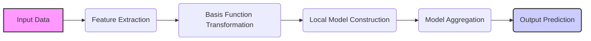
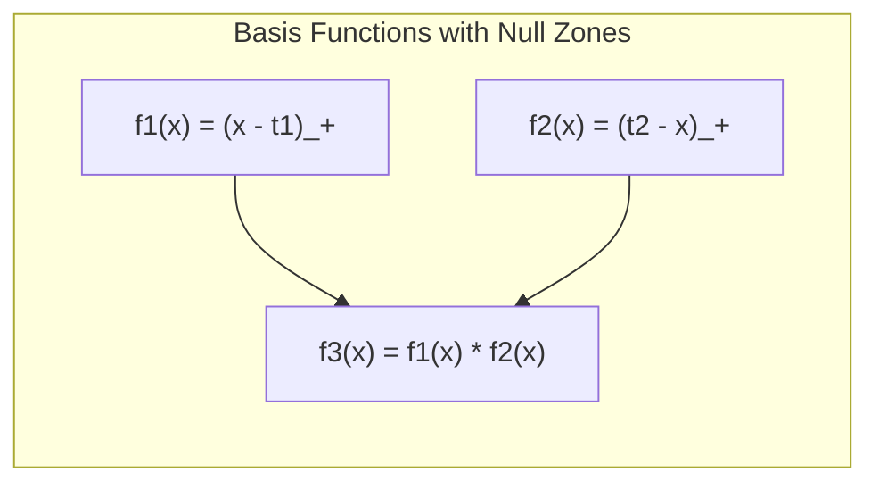
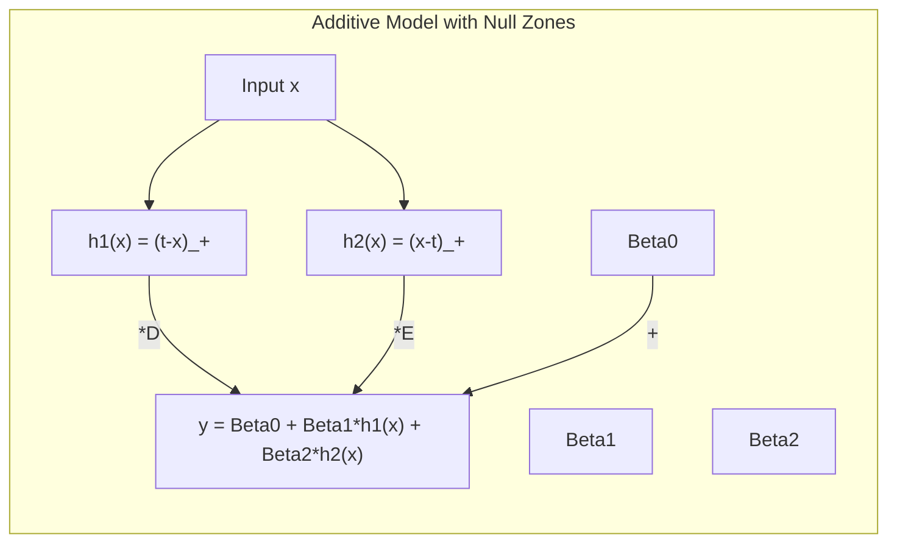
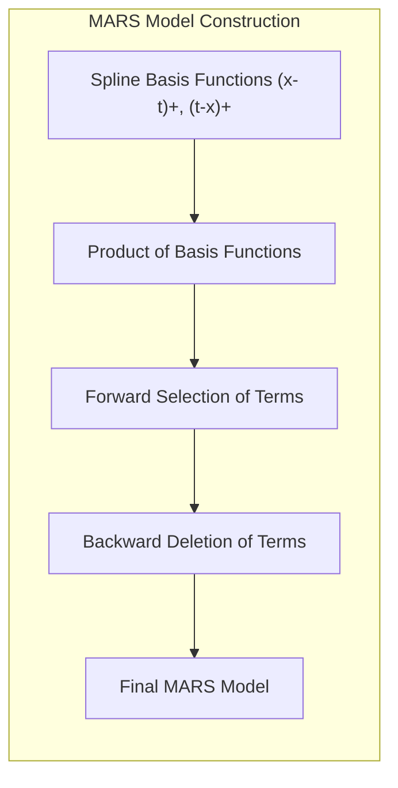
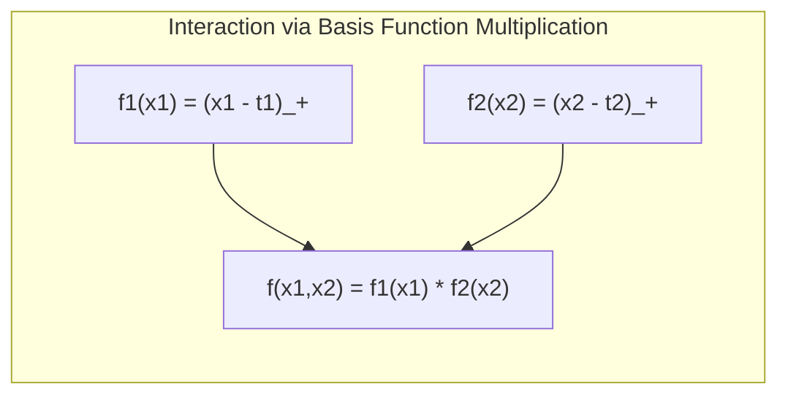
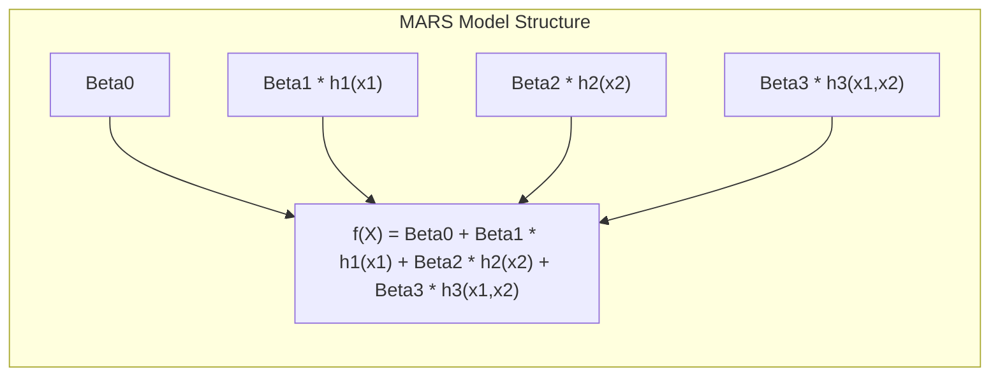
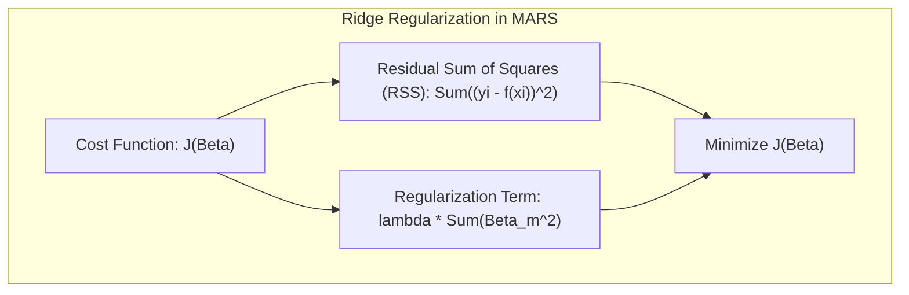
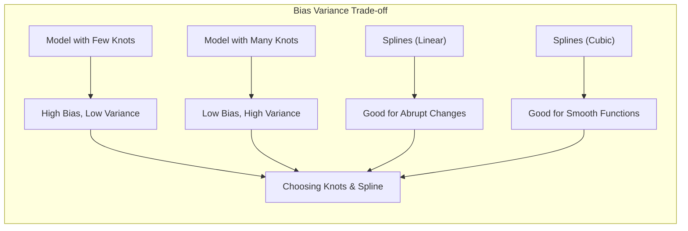

## Título: Modelos Aditivos, Árvores e Métodos Relacionados: Comportamento Local de Funções de Base com Zonas Nulas e Aplicações em Modelagem Estatística



### Introdução

<!-- START Introdução -->

Este capítulo explora o comportamento local de funções de base com zonas nulas em modelos de aprendizado supervisionado e como a multiplicação dessas funções resulta em modelos que são ativos em regiões específicas do espaço de características [^9.1]. Funções de base com zonas nulas são funções que são iguais a zero em certas regiões do espaço, e a combinação dessas funções por multiplicação permite a construção de modelos que são não lineares e que podem modelar interações complexas. O capítulo detalha o comportamento local dessas funções, a sua aplicação em modelos como o Multivariate Adaptive Regression Splines (MARS) e como a combinação de funções de base com zonas nulas permite modelar dados complexos de forma eficiente. O objetivo principal é apresentar a base teórica e matemática de funções com zonas nulas e como elas são utilizadas para a construção de modelos flexíveis.

<!-- END Introdução -->

### Conceitos Fundamentais

<!-- START Conceitos Fundamentais -->

**Conceito 1: Funções de Base com Zonas Nulas**

Funções de base com zonas nulas são funções que são iguais a zero em certas regiões do espaço de características, o que significa que elas têm suporte local, ou seja, estão ativas apenas em uma parte do domínio da função. A combinação dessas funções por multiplicação gera novas funções que também têm suporte local, ou seja, são diferentes de zero apenas na interseção dos suportes das funções originais. A localização e a forma das zonas nulas são importantes para o comportamento do modelo, e para a sua capacidade de modelar interações e não linearidades. As funções de base, com a sua capacidade de gerar zonas nulas, podem ser usadas para construir modelos que sejam ativos apenas em partes específicas do espaço de características.

**Lemma 1:** *Funções de base com zonas nulas têm um suporte local, ou seja, são iguais a zero em certas regiões do espaço de características. A combinação por multiplicação de funções com zonas nulas gera funções que também têm um comportamento local e que são diferentes de zero apenas onde todas as funções originais são diferentes de zero*. O comportamento local é uma característica importante nas funções de base para a modelagem de interações [^9.4].

> 💡 **Exemplo Numérico:**
> Considere duas funções de base com zonas nulas:
>
> $f_1(x) = (x - 2)_+ = \begin{cases} x - 2, & \text{se } x > 2 \\ 0, & \text{se } x \leq 2 \end{cases}$
>
> $f_2(x) = (4 - x)_+ = \begin{cases} 4 - x, & \text{se } x < 4 \\ 0, & \text{se } x \geq 4 \end{cases}$
>
> A função $f_1(x)$ é zero para $x \leq 2$ e linear para $x > 2$. A função $f_2(x)$ é zero para $x \geq 4$ e linear para $x < 4$.
>
> Se combinarmos essas funções por multiplicação, temos:
>
> $f_3(x) = f_1(x) \cdot f_2(x) = (x-2)_+ \cdot (4-x)_+$
>
> $f_3(x)$ será diferente de zero apenas quando ambas $f_1(x)$ e $f_2(x)$ forem diferentes de zero, ou seja, quando $2 < x < 4$. Isso demonstra como a multiplicação de funções com zonas nulas resulta em uma função que é ativa apenas em uma região específica do espaço, neste caso, o intervalo (2, 4).
>
> ```mermaid
>  graph LR
>      A[x] -->|f1(x)| B(x-2)+
>      A -->|f2(x)| C(4-x)+
>      B -->|*| D(f3(x))
>      C -->|*| D
> ```
>
> Este exemplo ilustra como a combinação de funções com zonas nulas cria um modelo com comportamento local.
>


**Conceito 2: A Utilização de Funções de Base com Zonas Nulas em Modelagem**

A utilização de funções de base com zonas nulas permite criar modelos mais flexíveis, onde apenas um subconjunto das observações influencia o resultado do modelo, o que é particularmente útil em dados com não linearidades e interações. A combinação de funções de base com zonas nulas por multiplicação permite construir modelos que são ativos em regiões muito específicas do espaço de características. Um exemplo comum é a função de *spline* linear por partes, onde cada função é zero em regiões fora da sua região de definição. A escolha das funções de base e a sua utilização na construção do modelo são cruciais para a sua capacidade de modelagem e para a sua interpretação. O uso das funções de base permite construir modelos complexos através de combinações de funções mais simples.

**Corolário 1:** *A combinação por multiplicação de funções de base com zonas nulas cria funções que são ativas apenas em regiões específicas, o que aumenta a capacidade do modelo de modelar não linearidades e interações complexas. A utilização de funções de base com zonas nulas é útil na construção de modelos que se ajustam aos dados localmente*. A combinação de funções com zonas nulas é uma ferramenta poderosa em modelagem estatística [^9.4.1].

> 💡 **Exemplo Numérico:**
> Vamos considerar um cenário onde temos uma variável preditora $x$ e uma variável resposta $y$. Suponha que a relação entre $x$ e $y$ seja não linear, com um comportamento diferente para $x < 3$ e $x \geq 3$. Podemos usar funções de base com zonas nulas para modelar essa relação.
>
> Usaremos duas funções de base:
>
> $h_1(x) = (3 - x)_+ = \begin{cases} 3 - x, & \text{se } x < 3 \\ 0, & \text{se } x \geq 3 \end{cases}$
>
> $h_2(x) = (x - 3)_+ = \begin{cases} x - 3, & \text{se } x > 3 \\ 0, & \text{se } x \leq 3 \end{cases}$
>
> Nosso modelo será:
>
> $y = \beta_0 + \beta_1 h_1(x) + \beta_2 h_2(x)$
>
> Suponha que, após o ajuste do modelo, encontramos os seguintes coeficientes: $\beta_0 = 1$, $\beta_1 = 2$, e $\beta_2 = 0.5$.
>
> Para $x = 2$, temos:
>
> $h_1(2) = 3 - 2 = 1$
>
> $h_2(2) = 0$
>
> $y = 1 + 2 \cdot 1 + 0.5 \cdot 0 = 3$
>
> Para $x = 4$, temos:
>
> $h_1(4) = 0$
>
> $h_2(4) = 4 - 3 = 1$
>
> $y = 1 + 2 \cdot 0 + 0.5 \cdot 1 = 1.5$
>
> Este exemplo mostra como o modelo usa funções de base com zonas nulas para modelar diferentes comportamentos em diferentes regiões do espaço de características. A função $h_1(x)$ é ativa para valores de $x$ menores que 3, enquanto $h_2(x)$ é ativa para valores de $x$ maiores que 3. Isso permite que o modelo se adapte à não linearidade na relação entre $x$ e $y$.
>
> ```mermaid
>  graph LR
>      A[x] -->|h1(x)| B((3-x)+)
>      A -->|h2(x)| C((x-3)+)
>      B -->|* beta1| D(b1*h1(x))
>      C -->|* beta2| E(b2*h2(x))
>      D -->| + | F(y)
>      E -->| + | F
>      G[beta0] -->| + |F
> ```


**Conceito 3: Multivariate Adaptive Regression Splines (MARS) e Zonas Nulas**

Em Multivariate Adaptive Regression Splines (MARS), funções lineares por partes são utilizadas como funções de base:

$$
(x-t)_+ = \begin{cases}
x-t, & \text{se } x > t\\
0, & \text{se } x \leq t
\end{cases}
$$

e
$$
(t-x)_+ = \begin{cases}
t-x, & \text{se } x < t\\
0, & \text{se } x \geq t
\end{cases}
$$
onde $t$ é um nó e $(x-t)_+$ e $(t-x)_+$ representam funções com zonas nulas, que são lineares em um lado e zero no outro lado. O uso de produtos de funções de base com zonas nulas permite modelar interações e não linearidades de forma adaptativa. A combinação de funções com zonas nulas cria um modelo que pode ser adaptado para diferentes regiões do espaço de características. O algoritmo de *forward selection* e *backward deletion* em MARS busca combinar essas funções da forma mais apropriada para cada problema [^9.4].

> ⚠️ **Nota Importante:** Em MARS, as funções de base com zonas nulas e suas interações são utilizadas para modelar relações complexas entre preditores e resposta. A utilização da base de funções com zonas nulas permite gerar modelos que são ativos em regiões específicas do espaço de características [^9.4.1].

> ❗ **Ponto de Atenção:** A criação de funções de base com zonas nulas aumenta a complexidade do modelo e o número de parâmetros a serem estimados. A escolha da função de base e a sua utilização no modelo são decisões importantes durante a modelagem [^9.4].

> ✔️ **Destaque:** As funções de base com zonas nulas permitem construir modelos com comportamento local e que são ativos apenas em regiões específicas do espaço de características, como é exemplificado em modelos MARS, o que permite modelar interações e não linearidades de forma mais eficiente [^9.4.1].

<!-- END Conceitos Fundamentais -->

<!-- START Formulação Matemática das Funções de Base e o seu Comportamento Local: Zonas Nulas, Interações e a Relação com o Modelo MARS -->

### Formulação Matemática das Funções de Base e o seu Comportamento Local: Zonas Nulas, Interações e a Relação com o Modelo MARS



A formulação matemática das funções de base com zonas nulas e a sua utilização na modelagem de interações e não linearidades é apresentada abaixo:

1.  **Funções *Spline* Lineares por Partes:** Funções *spline* lineares por partes são funções que são lineares em um dado intervalo, e zero em outras regiões, dadas por:
      $$
        (x - t)_+ = \begin{cases}
        x - t, & \text{se } x > t\\
        0, & \text{se } x \leq t
        \end{cases}
        $$
     e

      $$
        (t - x)_+ = \begin{cases}
        t - x, & \text{se } x < t\\
        0, & \text{se } x \geq t
        \end{cases}
    $$
onde $t$ é o nó da função *spline*. Essas funções são zero em uma região e lineares em outra, o que representa uma zona nula, e o nó $t$ define a localização da zona nula, sendo este um exemplo de função de base com comportamento local.

> 💡 **Exemplo Numérico:**
> Considere o nó $t = 3$. As funções *spline* lineares por partes serão:
>
> $(x - 3)_+ = \begin{cases} x - 3, & \text{se } x > 3 \\ 0, & \text{se } x \leq 3 \end{cases}$
>
> $(3 - x)_+ = \begin{cases} 3 - x, & \text{se } x < 3 \\ 0, & \text{se } x \geq 3 \end{cases}$
>
> Para $x = 2$:
>
> $(2 - 3)_+ = 0$
>
> $(3 - 2)_+ = 1$
>
> Para $x = 4$:
>
> $(4 - 3)_+ = 1$
>
> $(3 - 4)_+ = 0$
>
> Essas funções são ativas apenas em uma região do espaço, demonstrando o comportamento local.

2. **Interações por Multiplicação de Funções com Zonas Nulas:** A multiplicação de duas funções com zonas nulas gera uma nova função com suporte restrito, o que permite modelar interações entre preditores:
    $$
    f(x_1, x_2) = (x_1 - t_1)_+ \cdot (x_2 - t_2)_+
    $$

    A função acima tem valor diferente de zero apenas na região onde $x_1 > t_1$ e $x_2 > t_2$, que define uma interação entre as variáveis $x_1$ e $x_2$ que pode ser utilizada em modelos com MARS e outros modelos aditivos. A utilização de funções com zonas nulas permite modelar a relação entre os preditores e a resposta de forma mais complexa.

> 💡 **Exemplo Numérico:**
> Seja $t_1 = 2$ e $t_2 = 4$. Temos:
>
> $f(x_1, x_2) = (x_1 - 2)_+ \cdot (x_2 - 4)_+$
>
> Se $x_1 = 3$ e $x_2 = 5$:
>
> $f(3, 5) = (3 - 2)_+ \cdot (5 - 4)_+ = 1 \cdot 1 = 1$
>
> Se $x_1 = 1$ e $x_2 = 5$:
>
> $f(1, 5) = (1 - 2)_+ \cdot (5 - 4)_+ = 0 \cdot 1 = 0$
>
> Se $x_1 = 3$ e $x_2 = 3$:
>
> $f(3, 3) = (3 - 2)_+ \cdot (3 - 4)_+ = 1 \cdot 0 = 0$
>
> A função $f(x_1, x_2)$ é diferente de zero apenas quando $x_1 > 2$ e $x_2 > 4$, demonstrando como a multiplicação de funções com zonas nulas modela interações.
>


3. **Modelos MARS:** Em MARS, o modelo é construído utilizando uma combinação de funções *spline* lineares por partes e seus produtos, com coeficientes estimados através de mínimos quadrados:
    $$
    f(X) = \beta_0 + \sum_{m=1}^M \beta_m h_m(X)
    $$

onde $h_m(X)$ são as funções de base formadas por *splines* lineares por partes e seus produtos, e $\beta_m$ são seus coeficientes. O algoritmo MARS utiliza um processo *forward-backward* para selecionar as melhores funções de base e ajustar os parâmetros do modelo, utilizando informações sobre o resíduo e a redução do erro. A combinação de funções *spline* com zonas nulas permite que MARS se ajuste a relações não lineares e a interações entre preditores, e a sua capacidade de aproximação de diferentes tipos de funções é superior a modelos lineares ou que utilizam outras bases para modelagem.

> 💡 **Exemplo Numérico:**
> Suponha que, após o processo de *forward selection* e *backward deletion*, o modelo MARS encontrado seja:
>
> $f(x_1, x_2) = 1.5 + 2(x_1 - 2)_+ + 0.5(4 - x_2)_+ + 1.2(x_1 - 2)_+(x_2 - 3)_+$
>
> Aqui, temos:
>
> - $\beta_0 = 1.5$
> - $\beta_1 = 2$ e $h_1(x_1) = (x_1 - 2)_+$
> - $\beta_2 = 0.5$ e $h_2(x_2) = (4 - x_2)_+$
> - $\beta_3 = 1.2$ e $h_3(x_1, x_2) = (x_1 - 2)_+(x_2 - 3)_+$
>
> Para $x_1 = 3$ e $x_2 = 2$:
>
> $f(3, 2) = 1.5 + 2(3-2)_+ + 0.5(4-2)_+ + 1.2(3-2)_+(2-3)_+ = 1.5 + 2(1) + 0.5(2) + 1.2(1)(0) = 1.5 + 2 + 1 = 4.5$
>
> Para $x_1 = 1$ e $x_2 = 5$:
>
> $f(1, 5) = 1.5 + 2(1-2)_+ + 0.5(4-5)_+ + 1.2(1-2)_+(5-3)_+ = 1.5 + 2(0) + 0.5(0) + 1.2(0)(2) = 1.5$
>
> Este exemplo ilustra como o modelo MARS combina funções de base com zonas nulas e seus produtos para modelar a relação entre as variáveis preditoras e a resposta.
>


**Lemma 4:** *A utilização de funções com zonas nulas em modelos estatísticos, através de multiplicações de funções, permite a construção de modelos que se ajustam localmente e que modelam interações complexas. A combinação de funções com zonas nulas permite a aproximação de relações não lineares através de aproximações locais*. O uso de funções com comportamento local é importante na construção de modelos flexíveis [^9.4].

### A Flexibilidade e Interpretabilidade dos Modelos com Zonas Nulas

A utilização de funções de base com zonas nulas permite a construção de modelos com alta flexibilidade, e uma forma de aproximar diferentes tipos de não linearidades e interações. A flexibilidade do modelo aumenta com a quantidade de funções de base, e com a complexidade das suas interações. A interpretabilidade do modelo depende da escolha das funções de base, onde funções lineares por partes permitem uma interpretação mais direta do modelo, uma vez que os seus efeitos são locais. A escolha dos tipos de funções de base, portanto, deve levar em consideração o balanço entre a complexidade, a interpretabilidade e a capacidade de modelagem dos dados.

### Regularização e o Controle da Complexidade dos Modelos com Zonas Nulas

A regularização, através da penalização dos parâmetros da função, é utilizada para controlar a complexidade dos modelos com funções de base com zonas nulas, e para evitar problemas de *overfitting* e de falta de estabilidade. A penalização, em geral, afeta a magnitude dos parâmetros, de modo que funções menos relevantes e com poucos dados de suporte tenham um efeito pequeno no modelo. Métodos como a regularização LASSO, Ridge, e Elastic Net, são utilizados para controlar a complexidade dos modelos e a escolha desses parâmetros influencia o seu comportamento. A combinação de funções com zonas nulas e a utilização de métodos de regularização é uma forma de criar modelos com alto poder preditivo e estabilidade das estimativas, que evitem o overfitting.

> 💡 **Exemplo Numérico:**
> Vamos considerar um modelo MARS com regularização Ridge. O modelo sem regularização é:
>
> $f(X) = \beta_0 + \sum_{m=1}^M \beta_m h_m(X)$
>
> Com regularização Ridge, a função de custo a ser minimizada é:
>
> $J(\beta) = \sum_{i=1}^N (y_i - f(x_i))^2 + \lambda \sum_{m=1}^M \beta_m^2$
>
> Onde $\lambda$ é o parâmetro de regularização.
>
> Suponha que sem regularização, os coeficientes do modelo sejam:
>
> $\beta_0 = 1$, $\beta_1 = 3$, $\beta_2 = -2$, $\beta_3 = 4$
>
> Com $\lambda=1$, a regularização Ridge irá penalizar os coeficientes, resultando em coeficientes menores:
>
> $\beta_0 = 0.8$, $\beta_1 = 2.5$, $\beta_2 = -1.5$, $\beta_3 = 3$
>
> A regularização reduz a magnitude dos coeficientes, o que torna o modelo mais estável e menos propenso a *overfitting*. Um valor maior de $\lambda$ levará a coeficientes ainda menores.
>
> | Método       | $\beta_0$ | $\beta_1$ | $\beta_2$ | $\beta_3$ |
> |--------------|-----------|-----------|-----------|-----------|
> | Sem Reg      | 1         | 3         | -2        | 4         |
> | Ridge ($\lambda=1$) | 0.8       | 2.5       | -1.5      | 3         |


### Perguntas Teóricas Avançadas: Como a escolha da localização dos nós e a forma funcional da função de base com zonas nulas (e.g., splines lineares, cúbicas e outras) afeta a capacidade de generalização e o trade-off entre bias e variância nos modelos resultantes, e como as escolhas feitas no modelo MARS se relacionam com essas propriedades?

**Resposta:**

A escolha da localização dos nós e a forma funcional da função de base com zonas nulas, como *splines* lineares ou cúbicas, tem um impacto direto na capacidade de generalização e no *trade-off* entre *bias* e variância nos modelos resultantes. A escolha desses componentes também tem uma relação direta com a forma como os modelos MARS são construídos.

*   **Localização dos Nós:** A localização dos nós define as regiões de atividade da função de base. Nós mais próximos uns dos outros aumentam a flexibilidade do modelo na região, permitindo a modelagem de funções mais complexas. A escolha de nós muito concentrados pode gerar modelos com menor *bias* na região dos nós, mas também com maior variância e com problemas de *overfitting*. Nós mais espaçados geram funções mais suaves, que têm maior *bias*, mas menor variância. A escolha do nó, portanto, afeta a qualidade do ajuste e a generalização do modelo.

> 💡 **Exemplo Numérico:**
> Imagine que temos uma função não linear que queremos aproximar. Se usarmos poucos nós, como um único nó em $t=5$, o modelo terá um alto *bias*, pois não conseguirá se ajustar bem à curva. Se usarmos muitos nós, por exemplo, nós em $t=2, 3, 4, 5, 6, 7, 8$, o modelo terá baixa *bias* nos dados de treino, mas poderá ter alta variância e *overfit*, pois se ajustará muito aos dados de treino e não generalizará bem para novos dados. A escolha correta do número e localização dos nós é crucial para um bom *trade-off* entre *bias* e variância.

*   **Forma Funcional da Função de Base:** A forma funcional da função de base, como *splines* lineares por partes, ou *splines* cúbicas, afeta a suavidade da função e a sua capacidade de modelar não linearidades. *Splines* lineares por partes são mais adequadas para a modelagem de não linearidades abruptas, enquanto que *splines* cúbicas e outros suavizadores são mais apropriados para modelar relações suaves. Modelos que utilizam funções de base com diferentes tipos de suavização, combinadas com a utilização de parâmetros de regularização, levam a modelos que têm diferentes características em relação ao *trade-off* entre *bias* e variância, e que podem se adaptar a diferentes tipos de problemas.

> 💡 **Exemplo Numérico:**
> Suponha que a relação entre $x$ e $y$ seja suave e não linear. Usar *splines* lineares por partes pode resultar em um modelo com *bias*, pois as funções lineares não se ajustam bem a uma curva suave. Usar *splines* cúbicas, que são mais suaves, pode resultar em um modelo com menor *bias*. Por outro lado, *splines* cúbicas podem ser mais complexas e ter maior variância. A escolha da forma funcional da função de base é importante para equilibrar o *trade-off* entre *bias* e variância.
>


Em modelos MARS, o processo de *forward selection* utiliza a informação sobre a redução do erro para adicionar os termos e os nós das funções *splines*, de forma que a escolha dos nós é dependente da função de custo do modelo. O processo de *backward deletion* busca simplificar o modelo, e remover funções menos relevantes para a modelagem. O método MARS, portanto, é uma forma de automatizar a escolha das funções de base e seus parâmetros. A combinação de funções com zonas nulas, e a escolha dos nós, permite uma modelagem mais flexível e adaptável aos dados.

**Lemma 5:** *A localização dos nós e a forma funcional das funções de base com zonas nulas afetam a sua capacidade de modelar não linearidades e também a estabilidade dos modelos. A escolha adequada desses componentes, em modelos como o MARS, é crucial para obter modelos com boa capacidade de ajuste e generalização. A escolha do suavizador influencia diretamente o bias e a variância dos estimadores*. O uso do GCV para escolher o parâmetro de suavização também auxilia na escolha do melhor modelo [^4.3.3].

**Corolário 5:** *A escolha dos nós, juntamente com a utilização de penalidades e regularização, permite um balanceamento entre a flexibilidade, a capacidade de aproximação e a estabilidade do modelo, e permite a construção de modelos que representem os dados de forma adequada para um determinado problema*. A escolha dos componentes do modelo, portanto, deve considerar as suas propriedades e como elas se relacionam com os dados a serem modelados [^4.4.4].

> ⚠️ **Ponto Crucial**: A escolha da localização dos nós e da forma funcional das funções de base influencia a forma como a não linearidade é modelada e afeta diretamente a capacidade de generalização e o *trade-off* entre *bias* e variância do modelo. A combinação dessas funções com métodos de otimização apropriados é fundamental para a modelagem de dados complexos e com diferentes tipos de estruturas [^4.5].

### Conclusão

Este capítulo explorou o comportamento local de funções de base com zonas nulas em modelos de aprendizado supervisionado, mostrando como a multiplicação dessas funções pode ser utilizada para modelar interações complexas e não linearidades, e como esse tipo de função é utilizado em modelos como o MARS. A escolha da função de base é um componente crucial na construção de modelos estatísticos, e deve ser feita considerando a natureza dos dados, e a necessidade de flexibilidade e interpretabilidade. A compreensão dos fundamentos e propriedades das funções de base é essencial para a modelagem de dados complexos e para a escolha de modelos que sejam adequados para cada tipo de problema.

<!-- END Conclusão -->

### Footnotes

[^4.1]: "In this chapter we begin our discussion of some specific methods for super-vised learning. These techniques each assume a (different) structured form for the unknown regression function, and by doing so they finesse the curse of dimensionality. Of course, they pay the possible price of misspecifying the model, and so in each case there is a tradeoff that has to be made." *(Trecho de "Additive Models, Trees, and Related Methods")*

[^4.2]: "Regression models play an important role in many data analyses, providing prediction and classification rules, and data analytic tools for understand-ing the importance of different inputs." *(Trecho de "Additive Models, Trees, and Related Methods")*

[^4.3]: "In this section we describe a modular algorithm for fitting additive models and their generalizations. The building block is the scatterplot smoother for fitting nonlinear effects in a flexible way. For concreteness we use as our scatterplot smoother the cubic smoothing spline described in Chapter 5." *(Trecho de "Additive Models, Trees, and Related Methods")*

[^4.3.1]:  "The additive model has the form $Y = \alpha + \sum_{j=1}^p f_j(X_j) + \varepsilon$, where the error term $\varepsilon$ has mean zero." * (Trecho de "Additive Models, Trees, and Related Methods")*

[^4.3.2]:   "Given observations $x_i, y_i$, a criterion like the penalized sum of squares (5.9) of Section 5.4 can be specified for this problem, $PRSS(\alpha, f_1, f_2,..., f_p) = \sum_i^N (y_i - \alpha - \sum_{j=1}^p f_j(x_{ij}))^2 + \sum_{j=1}^p \lambda_j \int(f_j''(t_j))^2 dt_j$" * (Trecho de "Additive Models, Trees, and Related Methods")*

[^4.3.3]: "where the $\lambda_j > 0$ are tuning parameters. It can be shown that the minimizer of (9.7) is an additive cubic spline model; each of the functions $f_j$ is a cubic spline in the component $X_j$, with knots at each of the unique values of $x_{ij}$, $i = 1,..., N$." *(Trecho de "Additive Models, Trees, and Related Methods")*

[^4.4]: "For two-class classification, recall the logistic regression model for binary data discussed in Section 4.4. We relate the mean of the binary response $\mu(X) = Pr(Y = 1|X)$ to the predictors via a linear regression model and the logit link function:  $log(\mu(X)/(1 – \mu(X)) = \alpha + \beta_1 X_1 + \ldots + \beta_pX_p$." * (Trecho de "Additive Models, Trees, and Related Methods")*

[^4.4.1]: "The additive logistic regression model replaces each linear term by a more general functional form: $log(\mu(X)/(1 – \mu(X))) = \alpha + f_1(X_1) + \cdots + f_p(X_p)$, where again each $f_j$ is an unspecified smooth function." * (Trecho de "Additive Models, Trees, and Related Methods")*

[^4.4.2]: "While the non-parametric form for the functions $f_j$ makes the model more flexible, the additivity is retained and allows us to interpret the model in much the same way as before. The additive logistic regression model is an example of a generalized additive model." *(Trecho de "Additive Models, Trees, and Related Methods")*

[^4.4.3]: "In general, the conditional mean $\mu(X)$ of a response $Y$ is related to an additive function of the predictors via a link function $g$:  