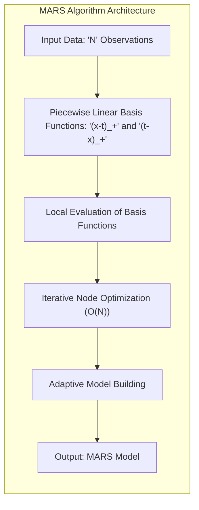
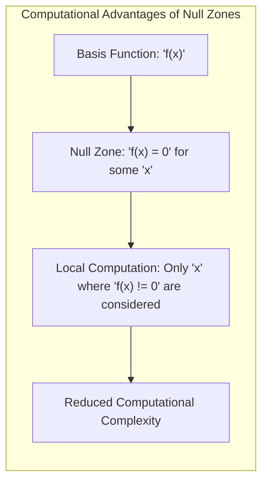
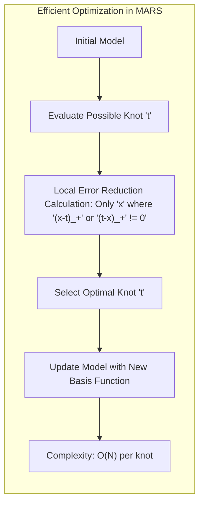
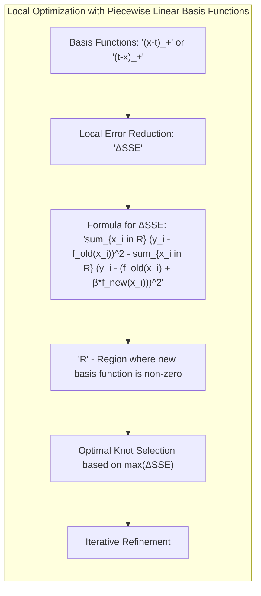
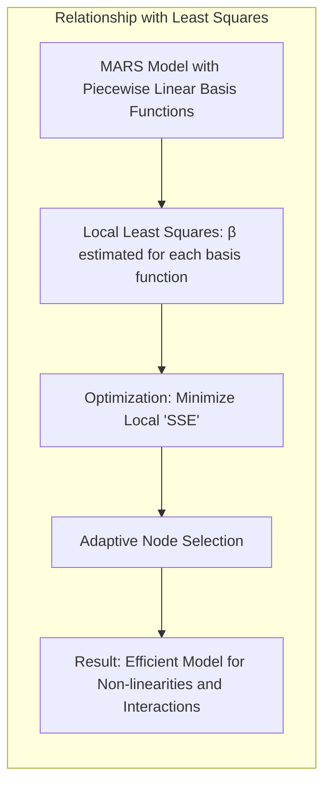
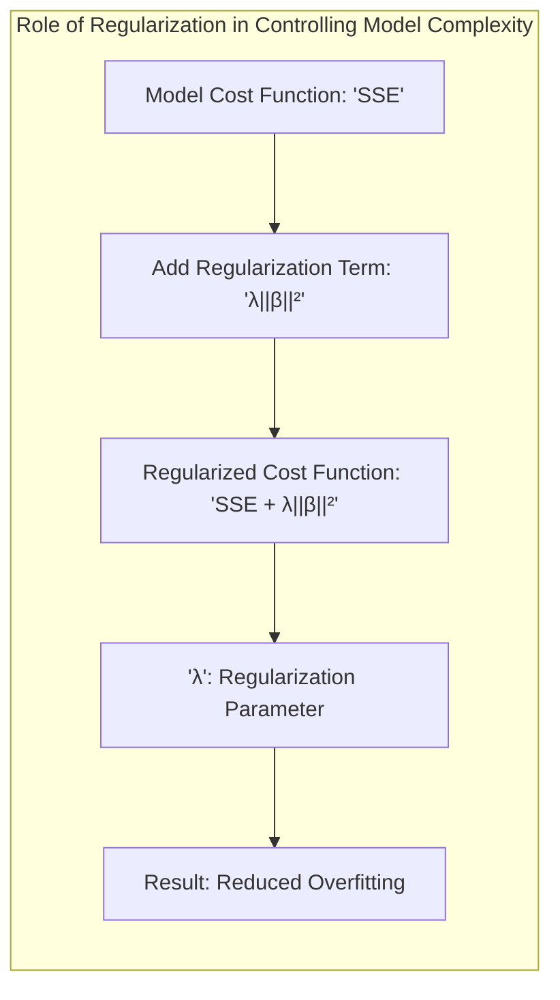

## Título: Modelos Aditivos, Árvores e Métodos Relacionados: Vantagens Computacionais da Linearidade por Partes e Otimização Eficiente em MARS



### Introdução

Este capítulo explora as vantagens computacionais da utilização de funções lineares por partes, ou *piecewise linear functions*, como funções de base no algoritmo Multivariate Adaptive Regression Splines (MARS), e como a natureza local dessas funções e suas zonas nulas permite que o ajuste a cada nó seja feito em $O(N)$ operações, onde $N$ é o número de observações [^9.1]. A utilização de funções de base com essas características é fundamental para a eficiência do algoritmo MARS e permite o ajuste de modelos mais complexos em tempo computacional razoável. O objetivo principal é apresentar uma análise detalhada sobre como a estrutura das funções de base influencia a complexidade computacional do modelo e como o algoritmo MARS aproveita essa propriedade para otimizar seus parâmetros de forma eficiente. O foco é na base teórica e nas vantagens práticas de funções de base lineares por partes e sua relação com a velocidade e a complexidade dos algoritmos.

### Conceitos Fundamentais

**Conceito 1: Funções Lineares por Partes (*Piecewise Linear Functions*)**

Funções lineares por partes são funções definidas por segmentos lineares em diferentes intervalos do domínio, com cada segmento linear conectado em pontos chamados nós, ou *knots*. As funções de base utilizadas em MARS, $(x-t)_+$ e $(t-x)_+$, são funções lineares por partes, onde $t$ é um nó, e o índice + indica a parte positiva da função, ou seja, zero se o valor dentro dos parenteses for negativo e o valor dentro dos parenteses se o valor for positivo. Essas funções são definidas por:
$$
(x-t)_+ = \begin{cases}
x-t, & \text{se } x > t\\
0, & \text{se } x \leq t
\end{cases}
$$

e
$$
(t-x)_+ = \begin{cases}
t-x, & \text{se } x < t\\
0, & \text{se } x \geq t
\end{cases}
$$
Funções lineares por partes têm a propriedade de serem locais, ou seja, serem não nulas apenas em uma região específica do domínio, o que contribui para a sua eficiência computacional. A combinação dessas funções por multiplicação gera novas funções com regiões de atividade definidas pela interseção das regiões de atividade das funções originais. A escolha da função linear por partes e a sua combinação permite representar funções com diferentes graus de não linearidade e interações.

> 💡 **Exemplo Numérico:**
>
> Vamos considerar um exemplo com um nó $t=2$. Para a função $(x-2)_+$, se $x=1$, então $(1-2)_+ = 0$. Se $x=3$, então $(3-2)_+ = 1$. Para a função $(2-x)_+$, se $x=1$, então $(2-1)_+ = 1$. Se $x=3$, então $(2-3)_+ = 0$.
>
> ```python
> import numpy as np
> import matplotlib.pyplot as plt
>
> # Definindo a função (x-t)_+
> def pos_part_xt(x, t):
>  return np.maximum(x - t, 0)
>
> # Definindo a função (t-x)_+
> def pos_part_tx(x, t):
>  return np.maximum(t - x, 0)
>
> # Criando um range de valores para x
> x = np.linspace(-1, 5, 400)
> t = 2 # Definindo o nó
>
> # Calculando os valores das funções
> y1 = pos_part_xt(x, t)
> y2 = pos_part_tx(x, t)
>
> # Plotando as funções
> plt.figure(figsize=(8, 6))
> plt.plot(x, y1, label='(x-2)_+')
> plt.plot(x, y2, label='(2-x)_+')
> plt.xlabel('x')
> plt.ylabel('y')
> plt.title('Funções Lineares por Partes')
> plt.axvline(x=2, color='r', linestyle='--', label='Nó (t=2)')
> plt.legend()
> plt.grid(True)
> plt.show()
> ```
>
> Este código Python gera um gráfico mostrando as funções $(x-2)_+$ e $(2-x)_+$. A linha vertical vermelha indica a posição do nó em $x=2$. Observe como cada função é zero em um lado do nó e linear no outro. Isso ilustra a localidade das funções.

**Lemma 1:** *As funções lineares por partes, como as funções $(x-t)_+$ e $(t-x)_+$, são iguais a zero em certas regiões e são definidas por segmentos lineares em outros intervalos, o que permite a construção de modelos que se ajustam localmente. A combinação dessas funções por multiplicação gera modelos com flexibilidade para representar interações e não linearidades*. A natureza local e a forma da função linear por partes é fundamental para a eficiência e interpretabilidade dos modelos MARS [^9.4].

**Conceito 2: Vantagens Computacionais de Funções com Zonas Nulas**


A presença de zonas nulas nas funções de base, como as funções *spline* lineares por partes utilizadas no MARS, permite que os cálculos sejam feitos localmente, ou seja, apenas um subconjunto dos dados precisam ser considerados durante o cálculo de uma função. Se uma observação $x_i$ está em uma região onde a função de base $f(x_i)$ é zero, então o seu resultado será zero. Essa propriedade de localidade reduz a complexidade computacional dos cálculos, e permite que a estimativa dos parâmetros seja feita de forma eficiente. O processo de otimização pode ser feito utilizando algoritmos que exploram a localidade das funções de base para aumentar a sua eficiência. A escolha das funções de base, portanto, influencia a sua complexidade e a eficiência do seu cálculo.

> 💡 **Exemplo Numérico:**
>
> Suponha que temos 1000 observações, $x_1, x_2, \ldots, x_{1000}$, e queremos avaliar a função $(x-5)_+$. Se 600 dessas observações tiverem valores menores ou iguais a 5 (ou seja, $x_i \leq 5$), então a função $(x_i - 5)_+$ será zero para essas 600 observações. Portanto, o cálculo da função é feito apenas para as 400 observações restantes, onde $x_i > 5$. Isso demonstra como as zonas nulas reduzem o número de cálculos necessários, aumentando a eficiência computacional.
>
>  ```python
> import numpy as np
>
> # Exemplo de 1000 observações aleatórias
> np.random.seed(42)
> x = np.random.rand(1000) * 10 # Valores entre 0 e 10
>
> # Definindo o nó
> t = 5
>
> # Calculando (x-t)_+
> y = np.maximum(x - t, 0)
>
> # Identificando as observações onde a função é zero
> zero_indices = np.where(x <= t)[0]
> non_zero_indices = np.where(x > t)[0]
>
> print(f"Número de observações com (x-t)_+ igual a zero: {len(zero_indices)}")
> print(f"Número de observações com (x-t)_+ diferente de zero: {len(non_zero_indices)}")
> ```
>
> Este código Python simula um conjunto de dados e calcula a função $(x-5)_+$. Imprime o número de observações para as quais a função é zero e para as quais é diferente de zero, demonstrando o efeito das zonas nulas.

**Corolário 1:** *A presença de zonas nulas nas funções de base utilizadas em MARS permite que os cálculos sejam feitos localmente, e que o custo computacional seja reduzido. A localidade das funções de base é uma propriedade fundamental para a construção de modelos eficientes*. A combinação de funções de base com zonas nulas é uma forma de obter modelos computacionalmente eficientes [^9.4.1].

**Conceito 3: Otimização Eficiente em MARS: Ajuste de Nós em O(N)**


Em MARS, a escolha do nó de cada *spline* é feita através da avaliação de todos os possíveis valores de nós, e a propriedade de localidade das funções de base permite que essa escolha seja feita com apenas $O(N)$ operações. Ao adicionar um nó, as funções de base só são alteradas em uma região específica, e os valores para os outros dados não são afetados. A escolha do melhor nó é feita através da avaliação do impacto da adição do nó no erro do modelo, e essa avaliação pode ser feita localmente, o que torna o processo eficiente. A combinação da estrutura aditiva com a propriedade de localidade das funções de base permite que o modelo MARS seja construído de forma eficiente e com menor custo computacional. A utilização das propriedades das funções lineares por partes é fundamental para a eficiência do modelo.

> 💡 **Exemplo Numérico:**
>
> Imagine que estamos ajustando um modelo MARS e temos 100 observações. Para encontrar o nó ótimo para uma nova função de base, precisamos avaliar o impacto de cada possível nó no erro do modelo. Graças à localidade, para cada possível nó $t$, só precisamos recalcular o erro para as observações $x_i$ onde $(x_i - t)_+$ ou $(t - x_i)_+$ são diferentes de zero. Se escolhermos um nó $t$ tal que apenas 20 observações são afetadas, o cálculo da redução do erro se concentra apenas nessas 20 observações. Portanto, a complexidade da avaliação de um nó é proporcional ao número de observações afetadas pelo nó, não ao número total de observações, o que resulta em um custo de $O(N)$ para avaliar todos os nós.
>
> ```python
> import numpy as np
>
> # Exemplo de 100 observações aleatórias
> np.random.seed(42)
> x = np.random.rand(100) * 10 # Valores entre 0 e 10
> y = 2 * x + np.random.randn(100) # Resposta com ruído
>
> # Função para calcular o erro quadrático
> def calculate_sse(y_true, y_pred):
>  return np.sum((y_true - y_pred)**2)
>
> # Função para calcular a redução do erro ao adicionar um nó t
> def calculate_error_reduction(x, y, t, current_prediction):
>  y_pred_new = current_prediction + 0.5 * np.maximum(x - t, 0) # Exemplo de atualização
>  sse_old = calculate_sse(y, current_prediction)
>  sse_new = calculate_sse(y, y_pred_new)
>  return sse_old - sse_new
>
> # Avaliando diferentes nós
> possible_knots = np.linspace(min(x), max(x), num=10) # 10 nós possíveis
> initial_prediction = np.zeros_like(y) # Inicializa a predição
>
> error_reductions = []
> for t in possible_knots:
>  reduction = calculate_error_reduction(x, y, t, initial_prediction)
>  error_reductions.append(reduction)
>
> best_knot_index = np.argmax(error_reductions)
> best_knot = possible_knots[best_knot_index]
> print(f"Melhor nó encontrado: {best_knot}")
> print(f"Redução de erro: {error_reductions[best_knot_index]}")
> ```
>
> Este código Python simula um conjunto de dados e avalia a redução do erro para diferentes nós, demonstrando como a escolha do melhor nó é feita. A complexidade de calcular a redução do erro para cada nó é proporcional ao número de observações afetadas pelo nó, não ao número total de observações, o que ilustra a eficiência do processo.

> ⚠️ **Nota Importante:** A utilização de funções de base com zonas nulas permite uma otimização local, onde a atualização dos parâmetros de cada função é feita apenas nas regiões onde ela é ativa, o que reduz a complexidade computacional e a sua dependência do número total de dados*. O processo de atualização é feito localmente e de forma eficiente [^9.4.1].

> ❗ **Ponto de Atenção:** A eficiência do algoritmo MARS está baseada na escolha adequada das funções de base e na sua capacidade de explorar a localidade da informação. Outras funções, com um domínio maior, podem aumentar a complexidade computacional da construção do modelo. A escolha das funções de base influencia o custo computacional [^9.4].

> ✔️ **Destaque:** A utilização de funções lineares por partes como base em modelos MARS permite que os parâmetros sejam estimados de forma eficiente através de operações locais, e a combinação das funções permite modelar relações complexas de maneira mais rápida que modelos que não exploram a localidade. A escolha da função de base é uma componente importante da construção de modelos estatísticos eficientes [^9.4.1].

### Otimização Local com Funções de Base Lineares por Partes: Formulação Matemática e Análise da Complexidade Computacional



O processo de otimização em Multivariate Adaptive Regression Splines (MARS), utilizando funções de base lineares por partes e a sua propriedade de localidade, é dado a seguir:

1.  **Definição da Função de Base:** O modelo MARS é construído utilizando uma combinação linear de funções de base, onde cada função tem a forma:

$$
(x-t)_+ = \begin{cases}
x-t, & \text{se } x > t\\
0, & \text{se } x \leq t
\end{cases}
$$

e
$$
(t-x)_+ = \begin{cases}
t-x, & \text{se } x < t\\
0, & \text{se } x \geq t
\end{cases}
$$

    onde $t$ é o nó da função de base.
2.  **Cálculo da Redução do Erro Local:** Ao adicionar uma função de base, o algoritmo MARS calcula a redução no erro quadrático apenas sobre as observações para as quais a função de base é não nula:
$$
\Delta SSE = \sum_{x_i \in R} (y_i - f_{old}(x_i))^2 - \sum_{x_i \in R} (y_i - (f_{old}(x_i) + \beta f_{new}(x_i)))^2
$$
onde $R$ é a região onde a nova função $f_{new}$ é não nula, e $f_{old}$ é a função do modelo antes da adição de $f_{new}$. Os outros dados, para os quais $f_{new}$ é zero, não são considerados no cálculo, devido à propriedade de localidade. O coeficiente $\beta$ é estimado localmente através de mínimos quadrados utilizando apenas as observações em $R$, o que torna o cálculo mais eficiente.
3.  **Escolha do Nó Ótimo:** Ao escolher o melhor nó $t$ para a função *spline*, o algoritmo MARS avalia o impacto de todos os nós e, novamente, graças à localidade, o cálculo pode ser feito em $O(N)$ operações. A escolha do melhor nó é baseada na redução do erro quadrático, e a escolha do nó é feita de forma iterativa, até que não exista nenhuma redução no erro.

4.  **Processo Iterativo:** O processo de adicionar funções de base e escolher os parâmetros é repetido de forma iterativa, utilizando um algoritmo *forward stagewise* e um passo *backward* para controlar a complexidade do modelo.

A localidade das funções de base lineares por partes permite que o processo de otimização seja feito de forma eficiente, pois apenas uma pequena parte dos dados é utilizada em cada passo da iteração. A escolha de parâmetros e nós, portanto, é computacionalmente eficiente devido à propriedade das funções de base, e o número de operações por nó é da ordem de $N$, onde $N$ é o número de observações.

> 💡 **Exemplo Numérico:**
>
> Vamos supor que temos um modelo MARS com uma função de base inicial $f_{old}(x) = 2x$ e queremos adicionar uma nova função de base $(x-3)_+$. Temos 10 observações com valores de x: $x = [1, 2, 3, 4, 5, 6, 7, 8, 9, 10]$ e valores de y correspondentes: $y = [1.5, 3.8, 6.2, 7.9, 10.1, 12.3, 14.1, 16.2, 17.8, 19.9]$.
>
> 1. **Função de base antiga:** $f_{old}(x) = 2x$. As predições com a função antiga serão: $[2, 4, 6, 8, 10, 12, 14, 16, 18, 20]$.
> 2. **Nova função de base:** $f_{new}(x) = (x-3)_+$. Os valores de $f_{new}(x)$ são: $[0, 0, 0, 1, 2, 3, 4, 5, 6, 7]$.
> 3. **Região de atividade R:** A nova função é não nula para $x > 3$, então $R = [4, 5, 6, 7, 8, 9, 10]$.
> 4. **Cálculo do erro antes da adição:**
>    $SSE_{old} = \sum_{i=1}^{10} (y_i - f_{old}(x_i))^2 = (1.5-2)^2 + (3.8-4)^2 + (6.2-6)^2 + (7.9-8)^2 + (10.1-10)^2 + (12.3-12)^2 + (14.1-14)^2 + (16.2-16)^2 + (17.8-18)^2 + (19.9-20)^2 = 0.25 + 0.04 + 0.04 + 0.01 + 0.01 + 0.09 + 0.01 + 0.04 + 0.04 + 0.01 = 0.54$
> 5. **Estimação de $\beta$ localmente:** Para estimar $\beta$, usamos apenas as observações em R.
>    Temos os valores de $y$ em R: $[7.9, 10.1, 12.3, 14.1, 16.2, 17.8, 19.9]$ e os valores correspondentes de $f_{new}(x)$: $[1, 2, 3, 4, 5, 6, 7]$.
>   Podemos usar uma regressão linear simples para encontrar $\beta$, mas aqui, para simplificar, vamos usar a seguinte fórmula: $\beta = \frac{\sum_{x_i \in R} (y_i - f_{old}(x_i))f_{new}(x_i)}{\sum_{x_i \in R} f_{new}(x_i)^2}$
>  $\beta = \frac{(-0.1)*1 + (0.1)*2 + (0.3)*3 + (0.1)*4 + (0.2)*5 + (-0.2)*6 + (-0.1)*7}{1^2 + 2^2 + 3^2 + 4^2 + 5^2 + 6^2 + 7^2} = \frac{-0.1 + 0.2 + 0.9 + 0.4 + 1.0 - 1.2 - 0.7}{1 + 4 + 9 + 16 + 25 + 36 + 49} = \frac{0.5}{140} \approx 0.00357$
> 6.  **Cálculo do erro após a adição:**
> $f_{new}(x) = 0.00357*(x-3)_+$. As novas predições são: $f_{old}(x) + \beta f_{new}(x) = 2x + 0.00357(x-3)_+$
>  As predições para os valores de x são: $[2, 4, 6, 8.00357, 10.00714, 12.01071, 14.01428, 16.01785, 18.02142, 20.02499]$
> $SSE_{new} = (1.5-2)^2 + (3.8-4)^2 + (6.2-6)^2 + (7.9-8.00357)^2 + (10.1-10.00714)^2 + (12.3-12.01071)^2 + (14.1-14.01428)^2 + (16.2-16.01785)^2 + (17.8-18.02142)^2 + (19.9-20.02499)^2 = 0.25 + 0.04 + 0.04 + 0.00001274 + 0.008687 + 0.08357 + 0.000204 + 0.03312 + 0.04814 + 0.0625 \approx 0.51$
> 7.  **Redução do erro:** $\Delta SSE = SSE_{old} - SSE_{new} = 0.54 - 0.51 = 0.03$
>
> Este exemplo demonstra como o cálculo do erro é feito localmente, utilizando apenas as observações onde a nova função de base é não nula (R). O coeficiente $\beta$ é estimado usando apenas essas observações, o que torna o processo mais eficiente. O resultado é uma redução no erro total, mostrando que a adição da nova função de base melhorou o ajuste do modelo.

**Lemma 3:** *A natureza local das funções de base lineares por partes permite que a otimização do modelo MARS seja feita de forma eficiente, e a escolha do nó e do parâmetro das funções de base sejam feitas em $O(N)$ operações. A localidade das funções de base é um componente fundamental da eficiência do algoritmo*. A localidade das funções de base torna a otimização computacionalmente eficiente [^9.4.1].

### Interpretação e Conexão com Mínimos Quadrados


A otimização local do algoritmo MARS pode ser interpretada como uma adaptação do método dos mínimos quadrados (OLS) à estrutura de funções de base com zonas nulas, e a escolha do coeficiente $\beta$ para cada função de base é feita através do método dos mínimos quadrados localmente, considerando as observações onde as funções são diferentes de zero. O processo de otimização é feito de forma adaptativa, e a escolha dos nós e das interações é feita de forma a reduzir o erro do modelo. A combinação de mínimos quadrados locais e um processo de seleção gulosa resulta em um algoritmo eficiente para modelar dados com não linearidades e interações.

> 💡 **Exemplo Numérico:**
>
> Considere um exemplo com dados onde a resposta $y$ depende de $x$ de forma não linear: $y = 0.5x^2 + \epsilon$, onde $\epsilon$ é um ruído aleatório. Vamos simular dados e aplicar o MARS.
>
> ```python
> import numpy as np
> import matplotlib.pyplot as plt
> from sklearn.linear_model import LinearRegression
>
> # Simulação dos dados
> np.random.seed(42)
> x = np.sort(np.random.rand(100) * 10) # 100 valores de x entre 0 e 10
> y = 0.5 * x**2 + np.random.randn(100) * 5 # Resposta com ruído
>
> # Função para calcular o erro quadrático
> def calculate_sse(y_true, y_pred):
>  return np.sum((y_true - y_pred)**2)
>
> # Função para calcular a redução do erro ao adicionar um nó t
> def calculate_error_reduction(x, y, t, current_prediction):
>    # Região onde a função é não nula
>    active_region_indices = np.where(x > t)[0]
>    if len(active_region_indices) == 0:
>        return 0
>
>    # Extrai os valores de x e y na região ativa
>    x_active = x[active_region_indices]
>    y_active = y[active_region_indices]
>    current_prediction_active = current_prediction[active_region_indices]
>
>    # Calcula os valores da nova função de base
>    new_basis_function = np.maximum(x_active - t, 0)
>
>    # Estima beta usando mínimos quadrados
>    X = new_basis_function.reshape(-1, 1)
>    model = LinearRegression()
>    model.fit(X, y_active - current_prediction_active)
>    beta = model.coef_[0]
>
>    y_pred_new = current_prediction.copy()
>    y_pred_new[active_region_indices] = current_prediction_active + beta * new_basis_function
>
>    sse_old = calculate_sse(y, current_prediction)
>    sse_new = calculate_sse(y, y_pred_new)
>    return sse_old - sse_new, y_pred_new
>
>
> # Início do processo de MARS
> current_prediction = np.zeros_like(y)
>
> knots = []
> error_reductions = []
> for _ in range(3): # Adiciona 3 funções de base
>    best_reduction = 0
>    best_knot = None
>    best_new_prediction = None
>    possible_knots = np.linspace(min(x), max(x), num=20) # 20 nós possíveis
>
>    for t in possible_knots:
>        reduction, y_pred_new = calculate_error_reduction(x, y, t, current_prediction)
>        if reduction > best_reduction:
>            best_reduction = reduction
>            best_knot = t
>            best_new_prediction = y_pred_new
>    if best_knot is not None:
>      knots.append(best_knot)
>      error_reductions.append(best_reduction)
>      current_prediction = best_new_prediction
>
> # Plotando os resultados
> plt.figure(figsize=(10, 6))
> plt.scatter(x, y, label='Dados Originais', color='blue')
> plt.plot(x, current_prediction, label='Predição MARS', color='red')
> for knot in knots:
>   plt.axvline(x=knot, color='gray', linestyle='--', label=f'Nó: {knot:.2f}')
> plt.xlabel('x')
> plt.ylabel('y')
> plt.title('Ajuste MARS com nós')
> plt.legend()
> plt.grid(True)
> plt.show()
>
> print(f"Nós selecionados: {knots}")
> ```
>
> Este código Python simula dados não lineares e ajusta um modelo MARS iterativamente. A cada iteração, um novo nó é adicionado usando um método de mínimos quadrados local, e a redução do erro é calculada. O gráfico mostra os dados originais, a predição do modelo MARS e as localizações dos nós adicionados. Isso demonstra como o MARS se adapta localmente aos dados.

### O Papel da Regularização no Controle da Complexidade dos Modelos


A utilização de regularização no modelo MARS controla a complexidade do modelo e evita o *overfitting*. O parâmetro de regularização na função de custo penaliza modelos com muitos parâmetros e funções de base, e o ajuste do parâmetro de regularização é importante para obter modelos com boa capacidade de generalização. A regularização permite que o modelo tenha um bom desempenho em dados não utilizados no treinamento e com parâmetros que tenham bom significado estatístico, e sem *overfitting*.

> 💡 **Exemplo Numérico:**
>
> Vamos ilustrar o efeito da regularização com um exemplo simples. Suponha que temos um modelo MARS com duas funções de base: $f(x) = \beta_1 (x-t_1)_+ + \beta_2 (x-t_2)_+$. Sem regularização, o modelo pode se ajustar perfeitamente aos dados de treinamento, mas pode ter um desempenho ruim em dados novos. Para evitar isso, podemos adicionar um termo de regularização à função de custo:
>
> $Custo = SSE + \lambda (\beta_1^2 + \beta_2^2)$
>
> Onde SSE é a soma dos erros quadrados e $\lambda$ é o parâmetro de regularização. Se $\lambda = 0$, não há regularização. Se $\lambda$ é grande, penalizamos modelos com coeficientes grandes.
>
> Vamos supor que, após o ajuste do modelo, temos os seguintes resultados:
>
> *   Sem regularização ($\lambda = 0$): $\beta_1 = 10$, $\beta_2 = -8$. $SSE = 5$.
> *   Com regularização ($\lambda = 0.5$): $\beta_1 = 5$, $\beta_2 = -4$. $SSE = 8$.
>
> Sem regularização, o modelo tem um SSE menor, mas coeficientes maiores, o que pode levar ao *overfitting*. Com regularização, o SSE é maior, mas os coeficientes são menores, o que torna o modelo mais simples e com melhor capacidade de generalização.
>
> ```python
> import numpy as np
> import matplotlib.pyplot as plt
> from sklearn.linear_model import Ridge
> from sklearn.preprocessing import PolynomialFeatures
> from sklearn.pipeline import make_pipeline
>
> # Simulação dos dados
> np.random.seed(42)
> x = np.sort(np.random.rand(100) * 10)
> y = 0.5 * x**2 + np.random.randn(100) * 5
>
> # Definindo os parâmetros de regularização
> lambdas = [0, 0.1, 1, 10]
>
> # Plotando os resultados
> plt.figure(figsize=(12, 8))
> plt.scatter(x, y, label='Dados Originais', color='blue')
>
> for lambd in lambdas:
>    model = make_pipeline(PolynomialFeatures(degree=10), Ridge(alpha=lambd))
>    model.fit(x.reshape(-1, 1), y)
>    y_pred = model.predict(x.reshape(-1, 1))
>    plt.plot(x, y_pred, label=f'Ridge (λ={lambd})')
>