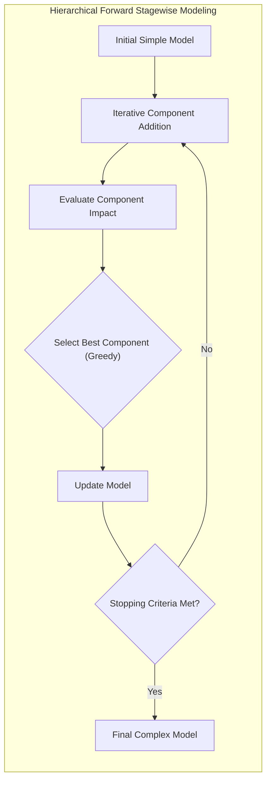
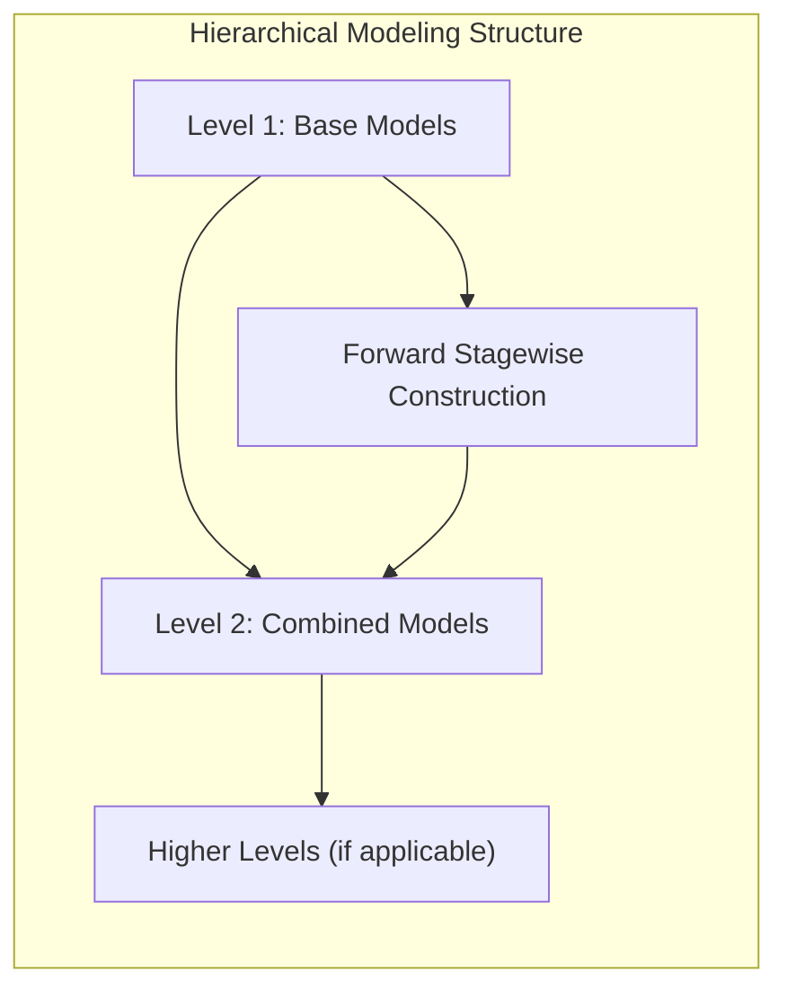
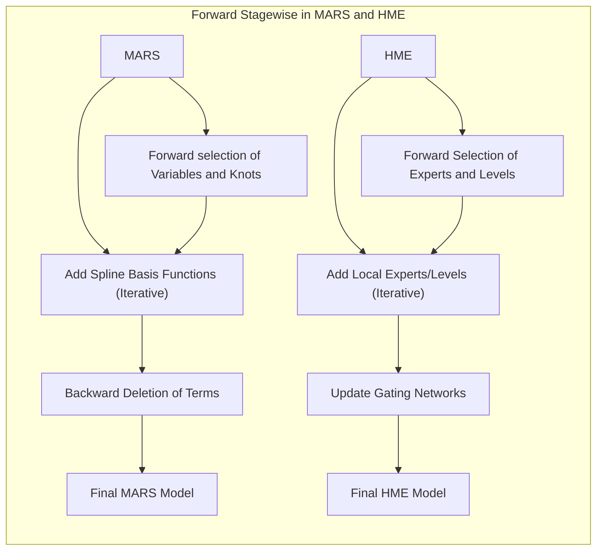
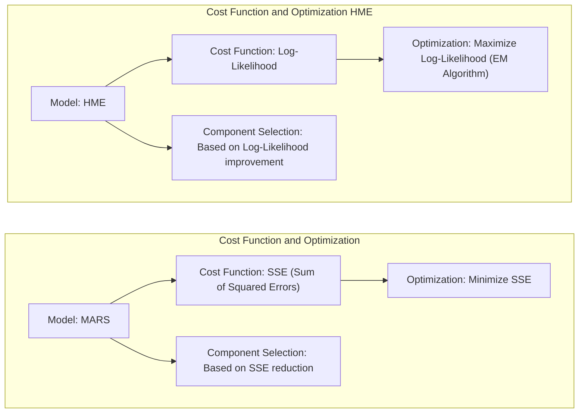
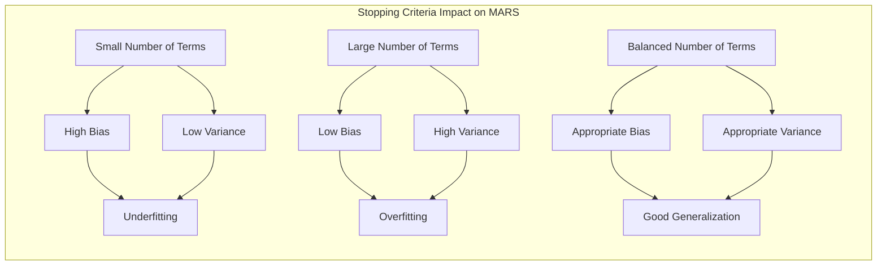
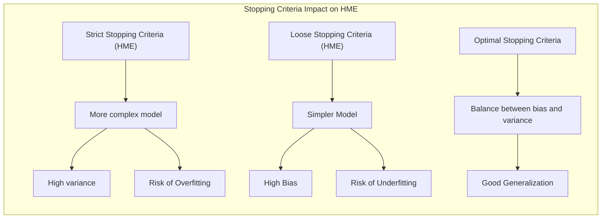
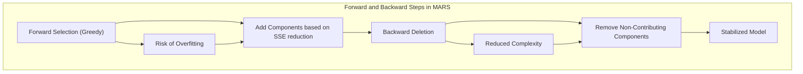

## Título: Modelos Aditivos, Árvores e Métodos Relacionados: Estratégias Hierárquicas de Modelagem *Forward Stagewise* em Modelos Complexos

### Introdução

Este capítulo explora estratégias hierárquicas de modelagem *forward stagewise*, com foco na sua aplicação em modelos complexos como Multivariate Adaptive Regression Splines (MARS) e misturas hierárquicas de especialistas (HME), e como essa abordagem constrói modelos complexos de forma iterativa, explorando a relação entre os preditores e controlando a sua complexidade [^9.1]. Algoritmos *forward stagewise* são métodos gulosos que adicionam componentes ao modelo em cada passo, com base na sua capacidade de melhorar o ajuste ou reduzir o erro. A modelagem hierárquica envolve a construção de modelos complexos a partir de modelos mais simples, e a construção hierárquica de modelos permite maior flexibilidade e complexidade. O objetivo principal deste capítulo é apresentar a formulação matemática e a aplicação de estratégias hierárquicas *forward stagewise*, sua importância na construção de modelos complexos, e como ela se relaciona com modelos aditivos e com as outras abordagens discutidas neste documento.

### Conceitos Fundamentais

**Conceito 1: Abordagem *Forward Stagewise* na Construção de Modelos**

A abordagem *forward stagewise* é um método iterativo para a construção de modelos estatísticos, onde componentes são adicionados ao modelo de forma sequencial, com base em sua capacidade de reduzir a função de custo ou o erro de classificação. O algoritmo começa com um modelo simples, e em cada passo adiciona o componente que resulta na maior melhoria do modelo, o processo é iterativo até que um critério de parada seja atingido. A escolha de qual componente adicionar ao modelo é feita utilizando um algoritmo guloso, ou seja, o componente que resulta na maior melhoria é escolhido a cada passo. A abordagem *forward stagewise* é uma forma de construir modelos complexos de maneira incremental, explorando as relações entre os preditores e a resposta. O algoritmo *forward stagewise*, portanto, é um método de otimização que realiza uma busca gulosa para definir o modelo final, e tem um papel importante na construção de modelos complexos como MARS.

> 💡 **Exemplo Numérico:**
> Imagine que estamos construindo um modelo para prever o preço de casas com base em duas variáveis: área e número de quartos. Inicialmente, começamos com um modelo simples que prediz o preço médio (um intercepto).
>
> **Passo 1:** Avaliamos qual variável (área ou número de quartos) adicionada ao modelo resulta na maior redução do erro quadrático médio (MSE). Suponha que adicionar a área resulta em uma redução de MSE de 1000, enquanto adicionar o número de quartos resulta em uma redução de 500.
>
> **Passo 2:** Adicionamos a área ao modelo. O modelo agora é uma função linear do tipo: `preço = intercepto + β * área`.
>
> **Passo 3:** Avaliamos novamente. Agora, podemos adicionar o número de quartos ou adicionar uma interação entre área e número de quartos. Suponha que adicionar o número de quartos resulta em uma redução de 300 no MSE.
>
> **Passo 4:** Adicionamos o número de quartos ao modelo. O modelo agora é: `preço = intercepto + β1 * área + β2 * número de quartos`.
>
> Este processo continua até que um critério de parada seja atingido (por exemplo, um número máximo de variáveis ou uma pequena redução no MSE). Este exemplo ilustra como o *forward stagewise* adiciona componentes (variáveis) de forma incremental, com base na melhoria no ajuste do modelo.

**Lemma 1:** *O algoritmo *forward stagewise* é um método para a construção de modelos de forma iterativa, adicionando componentes ao modelo em cada passo, e a escolha dos componentes é feita através da avaliação do seu impacto no desempenho do modelo. A escolha dos componentes é feita de forma gulosa, o que significa que nem sempre a solução ótima global é encontrada.* O processo iterativo é eficiente e permite a construção de modelos complexos [^4.5].

**Conceito 2: Modelagem Hierárquica**

A modelagem hierárquica refere-se à utilização de uma estrutura hierárquica para organizar os componentes do modelo, onde modelos de baixo nível são combinados para criar modelos de nível superior. Na aplicação de algoritmos *forward stagewise*, a hierarquia implica que o modelo é construído a partir de blocos básicos (funções ou componentes) para blocos mais complexos. Modelos hierárquicos são utilizados para modelar estruturas mais complexas nos dados. Modelos que utilizam essa abordagem combinam modelos mais simples para criar modelos com maior capacidade de generalização. Modelos hierárquicos também podem modelar interações de alta ordem entre os preditores, o que é importante em problemas complexos.

> 💡 **Exemplo Numérico:**
> Em um modelo hierárquico para prever o desempenho de alunos em um teste, podemos ter:
>
> *   **Nível 1 (Modelos de Baixo Nível):** Modelos separados para cada escola, onde o desempenho é previsto com base em variáveis como tempo de estudo e frequência.
> *   **Nível 2 (Modelo de Nível Superior):** Um modelo que combina os modelos de nível 1, adicionando variáveis como o nível socioeconômico da escola.
>
> O algoritmo *forward stagewise* pode ser usado para construir esse modelo hierárquico. Inicialmente, podemos ter um modelo simples no nível 1 para cada escola, como uma regressão linear. Em seguida, podemos usar o *forward stagewise* para adicionar variáveis no nível 2 que melhoram a capacidade de prever o desempenho geral dos alunos, avaliando a redução do erro ao adicionar a informação de nível socioeconômico.

**Corolário 1:** *A modelagem hierárquica permite construir modelos complexos a partir da combinação de modelos mais simples. A estrutura hierárquica, em conjunto com o algoritmo *forward stagewise*, auxilia na construção de modelos com maior capacidade de generalização*. A modelagem hierárquica é uma ferramenta útil para lidar com dados complexos [^4.5.2].

**Conceito 3: *Forward Stagewise* em MARS e HME**

*   **Multivariate Adaptive Regression Splines (MARS):** Em MARS, o algoritmo *forward stagewise* adiciona funções de base (funções *spline* lineares por partes) de forma iterativa, e em cada passo, é selecionada a função de base que mais reduz a soma dos erros quadráticos (SSE). O processo *forward stagewise* é uma forma de selecionar as variáveis mais importantes e de criar modelos que se adaptam localmente aos dados, e a complexidade do modelo é controlada com um passo *backward* que remove termos menos relevantes.
*   **Misturas Hierárquicas de Especialistas (HME):** Em HME, o algoritmo *forward stagewise* é utilizado para adicionar modelos locais (especialistas) e também a adicionar níveis na estrutura hierárquica do modelo. Em cada passo, a adição do especialista que resulta em um melhor modelo (com base na sua capacidade de modelar a distribuição da variável resposta) é selecionado, e as redes de *gating* são ajustadas de forma a combinar os diferentes modelos. HME modela dados complexos através da combinação de modelos locais, e o *forward stagewise* é utilizado para escolher os modelos locais que fazem parte do modelo final.

> ⚠️ **Nota Importante:** O algoritmo *forward stagewise* é utilizado para a construção iterativa de modelos complexos, combinando funções de base e modelos mais simples, com o objetivo de melhorar a capacidade de modelagem, a capacidade de generalização e a eficiência computacional. A escolha dos componentes a serem adicionados é feita de forma gulosa [^4.5.1].

> ❗ **Ponto de Atenção:** O algoritmo *forward stagewise* é uma abordagem gulosa para a construção do modelo e pode levar a resultados subótimos, especialmente em dados com muitas interações e alta dimensão. A escolha dos critérios de seleção e do número de componentes no modelo deve ser feita com cuidado [^4.5.2].

> ✔️ **Destaque:** Algoritmos *forward stagewise*, como utilizado em modelos MARS e HME, oferece uma abordagem flexível para a construção de modelos complexos, e a sua combinação com modelos aditivos permite a criação de modelos eficientes e robustos para a modelagem de diferentes tipos de dados [^4.5].

### Detalhes da Implementação de Abordagens *Forward Stagewise* em MARS e HME

```mermaid
graph TB
    subgraph "MARS Implementation"
        direction TB
         A["Start with Simple Model"]
        A --> B["Evaluate all Knots and Predictors"]
        B --> C["Select Knots/Predictors for Minimum SSE"]
         C-->D["Add Spline Term to Model"]
        D --> E["Backward Deletion"]
        E --> F{"Stopping Criteria?"}
        F -- "No" --> B
       F -- "Yes"--> G["Final MARS Model"]
    end
    subgraph "HME Implementation"
         direction TB
         H["Start with Simple Structure"]
         H --> I["Evaluate New Experts or Levels"]
        I --> J["Add Expert or Level to Maximize Log-Likelihood"]
         J --> K["Update Model Parameters (EM Algorithm)"]
        K --> L{"Stopping Criteria?"}
        L -- "No" --> I
        L -- "Yes" --> M["Final HME Model"]
    end
```

A implementação de algoritmos *forward stagewise* em MARS e HME envolve passos específicos que são utilizados na construção e no controle da complexidade de cada modelo:

1.  **Multivariate Adaptive Regression Splines (MARS):** O algoritmo *forward stagewise* em MARS constrói o modelo através da adição iterativa de funções *spline* lineares por partes. O algoritmo começa com um modelo simples, sem nenhuma função de base, e itera sobre os seguintes passos:
    1.  **Escolha do Nó e do Preditores:** O algoritmo avalia todos os nós e preditores e escolhe o preditor $X_j$ e o nó $t$ que resulta na maior redução do SSE (soma dos erros quadráticos):

    $$
        \text{Selecionar: } \underset{j,t}{\text{argmin}} \text{SSE}(M + (x_j - t)_+)
    $$

    ou
    $$
    \text{Selecionar: } \underset{j,t}{\text{argmin}} \text{SSE}(M + (t - x_j)_+)
    $$
    onde $M$ é o modelo atual, $x_j$ é o preditor, e $t$ é o ponto de nó do *spline*. O algoritmo escolhe o nó e o preditor que resultam na maior redução do SSE em cada iteração.
    2.  **Adição do Termo Spline:** O termo *spline* escolhido é adicionado ao modelo com um coeficiente que é estimado usando mínimos quadrados.
    3.  **Processo de Backward Deletion:** Após a adição do termo *spline*, o algoritmo aplica um processo *backward deletion*, que remove os termos que menos contribuem para o modelo.
    4.  **Repetição:** O processo de *forward selection* e *backward deletion* é repetido até que o modelo atinja um número máximo de termos, ou até que nenhuma melhora na função de custo seja obtida.

> 💡 **Exemplo Numérico (MARS):**
>
> Vamos considerar um exemplo com uma única variável preditora ($x$) e uma variável resposta ($y$).
>
> **Passo 1:** Começamos com um modelo constante $M = \bar{y}$ (a média de $y$).
>
> **Passo 2 (Forward):** Avaliamos todos os possíveis nós ($t$) para $x$. Vamos supor que, ao avaliar o ponto $t=5$, a função $(x - 5)_+$ resulta na maior redução de SSE. Assim, o novo modelo é: $M = \bar{y} + \beta_1 (x - 5)_+$.
>
> *   Para calcular o coeficiente $\beta_1$, usamos mínimos quadrados. Suponha que $\beta_1 = 2$. O modelo agora é: $M = \bar{y} + 2(x - 5)_+$.
>
> **Passo 3 (Forward):** Avaliamos novamente. Suponha que, desta vez, o ponto $t=10$ e a função $(10-x)_+$ resultam na maior redução de SSE. O novo modelo é $M = \bar{y} + 2(x - 5)_+ + \beta_2(10 - x)_+$.
>
> *   Após o cálculo dos coeficientes via mínimos quadrados, suponha que $\beta_2 = -1$. O modelo agora é: $M = \bar{y} + 2(x - 5)_+ - 1(10 - x)_+$.
>
> **Passo 4 (Backward):** O algoritmo agora avalia qual termo ($2(x - 5)_+$ ou $-1(10 - x)_+$) pode ser removido sem um grande aumento no SSE.
>
> **Passo 5:** O processo continua até um critério de parada.
>
> Este exemplo ilustra como MARS adiciona termos *spline* de forma iterativa, adaptando o modelo aos dados.

2.  **Misturas Hierárquicas de Especialistas (HME):** Em HME, o algoritmo *forward stagewise* é utilizado para adicionar especialistas e também para adicionar níveis à estrutura hierárquica. O algoritmo começa com uma estrutura simples, e itera sobre os seguintes passos:

   1. **Escolha do Novo Especialista ou Nível:** Avalia todos os possíveis novos especialistas ou níveis que podem ser adicionados ao modelo.
      2.  **Adição do Novo Componente:** Adiciona um novo especialista ou nível à estrutura do modelo, com base em critérios como a melhoria da *log-likelihood* do modelo.
      3. **Atualização dos Modelos:** Os parâmetros de todos os especialistas e das redes de *gating* são estimados através do algoritmo EM, que utiliza o conceito de máxima verossimilhança.
       4.  **Repetição:** O processo iterativo é repetido até que nenhum novo especialista ou nível seja necessário para melhorar o modelo.

> 💡 **Exemplo Numérico (HME):**
>
> Imagine que estamos modelando dados de vendas com diferentes padrões dependendo da região.
>
> **Passo 1:** Inicialmente, temos um único especialista (um modelo de regressão linear) que modela todas as regiões.
>
> **Passo 2 (Forward):** Avaliamos se adicionar um novo especialista para uma região específica melhoraria o modelo. Suponha que adicionar um especialista para a região Sul aumenta a *log-likelihood* do modelo em 10 unidades.
>
> **Passo 3 (Adição):** Adicionamos o especialista para a região Sul e ajustamos os parâmetros dos dois especialistas e da rede de *gating* usando o algoritmo EM.
>
> **Passo 4 (Forward):** Avaliamos novamente. Agora, podemos adicionar um novo especialista ou um novo nível hierárquico. Suponha que adicionar um nível hierárquico que divide as regiões em "urbanas" e "rurais" aumenta a *log-likelihood* em mais 5 unidades.
>
> **Passo 5 (Adição):** Adicionamos o novo nível e reajustamos todos os parâmetros.
>
> **Passo 6:** O processo continua até que nenhum novo especialista ou nível seja necessário.
>
> Este exemplo ilustra como HME adiciona especialistas e níveis hierárquicos de forma iterativa, com base na melhoria da *log-likelihood*.

O processo *forward stagewise* em MARS e HME, portanto, permite criar modelos complexos de forma incremental, e controlar a sua complexidade. A utilização de funções com zonas nulas em MARS garante que o cálculo seja feito de forma eficiente.

**Lemma 4:** *O algoritmo *forward stagewise* em modelos MARS e HME constrói modelos complexos de forma iterativa, adicionando componentes de forma gulosa, e o critério para adicionar um componente é baseado no seu impacto na função de custo ou erro. O método é uma forma eficiente de construir modelos complexos e lidar com a alta dimensionalidade*. A utilização de algoritmos *forward stagewise* é importante para controlar a complexidade dos modelos [^9.4.1].

### A Influência da Função de Custo e da Abordagem de Otimização no Desempenho do Modelo

A escolha da função de custo e do método de otimização influencia a escolha dos componentes e as decisões tomadas em cada iteração dos algoritmos *forward stagewise*. Modelos MARS utilizam a soma dos erros quadráticos (SSE) como função de custo, e a redução do SSE guia as decisões do modelo. HME, por outro lado, utiliza a função de *log-likelihood* para avaliar a qualidade do modelo. A escolha da função de custo afeta a forma como a otimização é feita e como os parâmetros dos modelos são estimados. A escolha do algoritmo de otimização depende da função de custo e do modelo, e também tem um impacto no custo computacional e na estabilidade dos estimadores.

### A Interpretabilidade dos Modelos com Interações e Funções Não Lineares

Modelos construídos utilizando abordagens hierárquicas e *forward stagewise*, como MARS e HME, geralmente apresentam menor interpretabilidade do que modelos mais simples. MARS utiliza termos de *spline* lineares por partes, e a interpretação das interações é mais difícil do que em modelos lineares. HME combina modelos locais através de redes de *gating*, o que torna difícil a compreensão do efeito de cada preditor na resposta. A escolha do modelo e do método de modelagem deve considerar a necessidade de interpretabilidade e complexidade do modelo, e o balanço entre esses dois elementos.

### Perguntas Teóricas Avançadas: Como a escolha do critério de parada nos algoritmos *forward stagewise* em MARS e HME afeta a capacidade de modelagem, o *trade-off* entre viés e variância e como a combinação dos passos *forward* e *backward* contribui para a estabilidade dos modelos?

**Resposta:**

A escolha do critério de parada nos algoritmos *forward stagewise* em modelos MARS e HME afeta diretamente a capacidade de modelagem, o *trade-off* entre viés e variância e a estabilidade dos modelos. O critério de parada define quando o processo de adição de componentes deve terminar, o que é crucial para a complexidade e o desempenho do modelo.

Em MARS, o critério de parada pode ser um número máximo de termos no modelo ou um limiar mínimo para a redução do erro. Um número máximo de termos pequeno leva a modelos simples com um alto bias e baixa variância. Um número máximo de termos grande leva a modelos mais complexos, com menor *bias*, mas maior variância, e com mais risco de overfitting. A escolha do critério de parada deve balancear a complexidade do modelo e a sua capacidade de generalização.

> 💡 **Exemplo Numérico (MARS - Critério de Parada):**
>
> Suponha que, ao aplicar MARS, observamos o seguinte comportamento do erro de treinamento (SSE) e erro de validação (MSE) em função do número de termos:
>
> | Número de Termos | SSE (Treinamento) | MSE (Validação) |
> |-----------------|-------------------|-----------------|
> | 1               | 1000              | 1200            |
> | 2               | 500               | 700             |
> | 3               | 300               | 550             |
> | 4               | 200               | 500             |
> | 5               | 150               | 520             |
> | 6               | 120               | 580             |
>
> Inicialmente, o erro de treinamento (SSE) e o erro de validação (MSE) diminuem à medida que adicionamos termos. No entanto, a partir de 4 termos, o MSE de validação começa a aumentar, indicando *overfitting*. O critério de parada ideal, neste caso, seria em torno de 4 termos, balanceando o *bias* e a variância.

Em HME, o critério de parada pode ser baseado na melhoria da *log-likelihood* ou na qualidade de ajuste do modelo. A escolha de um critério de parada mais rigoroso leva a modelos mais complexos e com mais parâmetros, enquanto critérios menos rigorosos levam a modelos mais simples, mas que podem não capturar padrões importantes nos dados. O *trade-off* entre bias e variância também é relevante na escolha do critério de parada em HME.

A combinação dos passos *forward* e *backward* em MARS é uma forma de mitigar o efeito da natureza gulosa do algoritmo de *forward selection*. A utilização de um passo *backward* permite remover componentes que não contribuem significativamente para o modelo, e ajuda a criar modelos mais estáveis e mais generalizáveis. O *backward deletion*, ao remover termos redundantes, simplifica o modelo e torna a sua interpretabilidade mais clara. A interação entre os passos *forward* e *backward* é um componente importante na construção de modelos MARS.

**Lemma 5:** *A escolha do critério de parada nos algoritmos *forward stagewise* em modelos MARS e HME afeta diretamente o *trade-off* entre *bias* e variância e a capacidade de generalização dos modelos. A combinação de passos *forward* e *backward* pode levar a modelos mais estáveis e mais parcimoniosos*. A escolha do critério de parada deve ser feita considerando o objetivo da modelagem e as propriedades dos dados [^4.5.2].

**Corolário 5:** *O uso de estratégias iterativas como o *forward stagewise*, juntamente com a escolha do critério de parada, permite construir modelos complexos com um controle da sua complexidade, e a combinação de passos *forward* e *backward* auxilia na construção de modelos mais estáveis e com melhor capacidade de generalização*. A escolha apropriada do critério de parada garante que os modelos se ajustem aos dados de forma eficiente [^4.5].

> ⚠️ **Ponto Crucial**: A escolha do critério de parada e do número de passos no algoritmo *forward stagewise* influencia a capacidade de modelagem do modelo e o seu *trade-off* entre *bias* e variância. A escolha do critério de parada e da utilização de métodos de *backward* são cruciais para que os modelos sejam robustos e tenham boa capacidade de generalização. O entendimento do impacto desses componentes é importante na modelagem estatística [^4.5.1].

### Conclusão

Este capítulo explorou as estratégias hierárquicas de modelagem *forward stagewise*, detalhando a sua aplicação em modelos MARS e HME e como o método é utilizado para controlar a complexidade dos modelos. A discussão enfatizou a relação entre o critério de parada, a combinação dos passos *forward* e *backward* e como esses componentes influenciam a capacidade de modelagem, a estabilidade dos modelos e a sua capacidade de generalização. A compreensão dessas abordagens é fundamental para a construção de modelos estatísticos complexos, e para modelar dados com diferentes tipos de padrões e de não linearidades.

### Footnotes

[^4.1]: "In this chapter we begin our discussion of some specific methods for super-vised learning. These techniques each assume a (different) structured form for the unknown regression function, and by doing so they finesse the curse of dimensionality. Of course, they pay the possible price of misspecifying the model, and so in each case there is a tradeoff that has to be made." *(Trecho de "Additive Models, Trees, and Related Methods")*

[^4.2]: "Regression models play an important role in many data analyses, providing prediction and classification rules, and data analytic tools for understand-ing the importance of different inputs." *(Trecho de "Additive Models, Trees, and Related Methods")*

[^4.3]: "In this section we describe a modular algorithm for fitting additive models and their generalizations. The building block is the scatterplot smoother for fitting nonlinear effects in a flexible way. For concreteness we use as our scatterplot smoother the cubic smoothing spline described in Chapter 5." *(Trecho de "Additive Models, Trees, and Related Methods")*

[^4.3.1]:  "The additive model has the form $Y = \alpha + \sum_{j=1}^p f_j(X_j) + \varepsilon$, where the error term $\varepsilon$ has mean zero." * (Trecho de "Additive Models, Trees, and Related Methods")*

[^4.3.2]:   "Given observations $x_i, y_i$, a criterion like the penalized sum of squares (5.9) of Section 5.4 can be specified for this problem, $PRSS(\alpha, f_1, f_2,..., f_p) = \sum_{i=1}^N (y_i - \alpha - \sum_{j=1}^p f_j(x_{ij}))^2 + \sum_{j=1}^p \lambda_j \int(f_j''(t_j))^2 dt_j$" * (Trecho de "Additive Models, Trees, and Related Methods")*

[^4.3.3]: "where the $\lambda_j > 0$ are tuning parameters. It can be shown that the minimizer of (9.7) is an additive cubic spline model; each of the functions $f_j$ is a cubic spline in the component $X_j$, with knots at each of the unique values of $x_{ij}, i = 1,..., N$." *(Trecho de "Additive Models, Trees, and Related Methods")*

[^4.4]: "For two-class classification, recall the logistic regression model for binary data discussed in Section 4.4. We relate the mean of the binary response $\mu(X) = Pr(Y = 1|X)$ to the predictors via a linear regression model and the logit link function:  $log(\mu(X)/(1 – \mu(X)) = \alpha + \beta_1 X_1 + \ldots + \beta_pX_p$." * (Trecho de "Additive Models, Trees, and Related Methods")*

[^4.4.1]: "The additive logistic regression model replaces each linear term by a more general functional form: $log(\mu(X)/(1 – \mu(X))) = \alpha + f_1(X_1) + \cdots + f_p(X_p)$, where again each $f_j$ is an unspecified smooth function." * (Trecho de "Additive Models, Trees, and Related Methods")*

[^4.4.2]: "While the non-parametric form for the functions $f_j$ makes the model more flexible, the additivity is retained and allows us to interpret the model in much the same way as before. The additive logistic regression model is an example of a generalized additive model." *(Trecho de "Additive Models, Trees, and Related Methods")*

[^4.4.3]: "In general, the conditional mean $\mu(X)$ of a response $Y$ is related to an additive function of the predictors via a link function $g$:  $g[\mu(X)] = \alpha + f_1(X_1) + \cdots + f_p(X_p)$." *(Trecho de "Additive Models, Trees, and Related Methods")*

[^4.4.4]:  "Examples of classical link functions are the following: $g(\mu) = \mu$ is the identity link, used for linear and additive models for Gaussian response data." *(Trecho de "Additive Models, Trees, and Related Methods")*

[^4.4.5]: "$g(\mu) = logit(\mu)$ as above, or $g(\mu) = probit(\mu)$, the probit link function, for modeling binomial probabilities. The probit function is the inverse Gaussian cumulative distribution function: $probit(\mu) = \Phi^{-1}(\mu)$." *(Trecho de "Additive Models, Trees, and Related Methods")*

[^4.5]: "All three of these arise from exponential family sampling models, which in addition include the gamma and negative-binomial distributions. These families generate the well-known class of generalized linear models, which are all extended in the same way to generalized additive models." *(Trecho de "Additive Models, Trees, and Related Methods")*

[^4.5.1]: "The functions $f_j$ are estimated in a flexible manner, using an algorithm whose basic building block is a scatterplot smoother. The estimated func-tion $f_j$ can then reveal possible nonlinearities in the effect of $X_j$. Not all of the functions $f_j$ need to be nonlinear." *(Trecho de "Additive Models, Trees, and Related Methods")*

[^4.5.2]: "We can easily mix in linear and other parametric forms with the nonlinear terms, a necessity when some of the inputs are qualitative variables (factors)." *(Trecho de "Additive Models, Trees, and Related Methods")*
