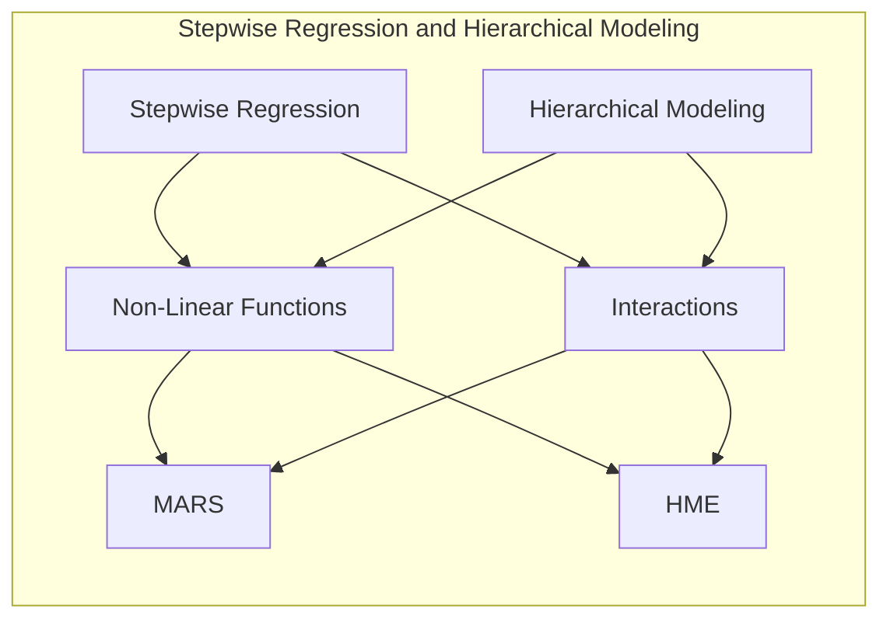
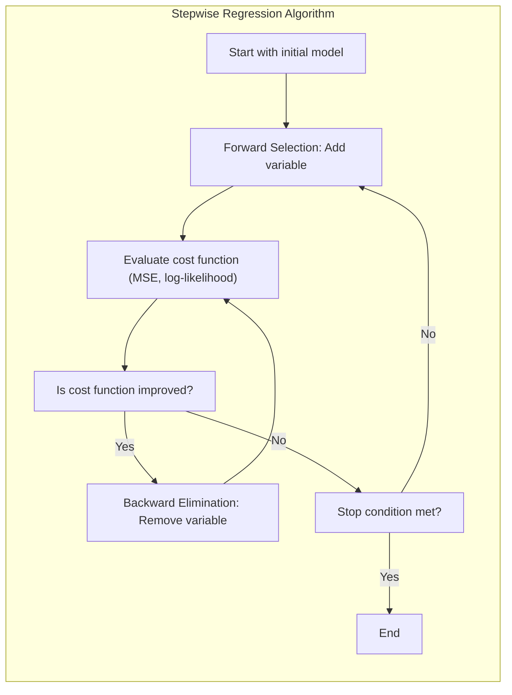
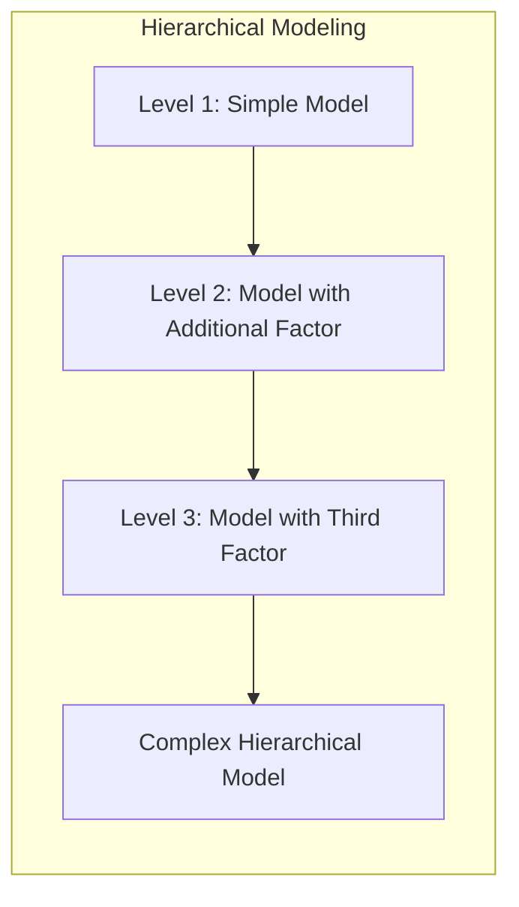
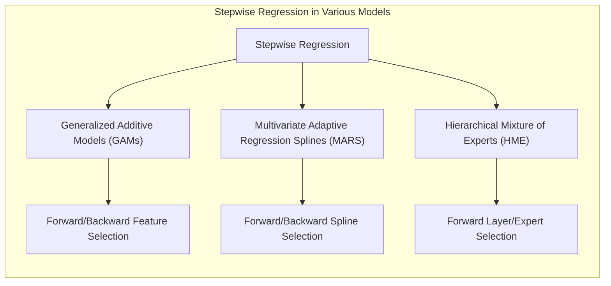
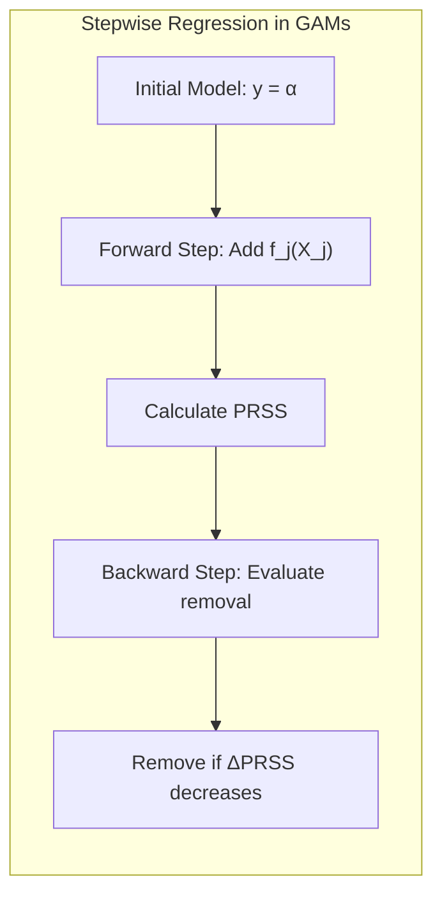
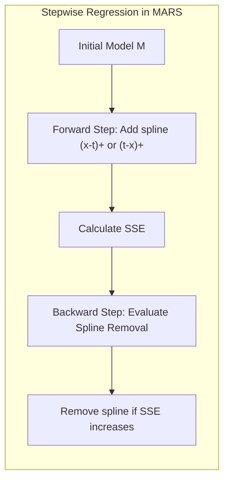
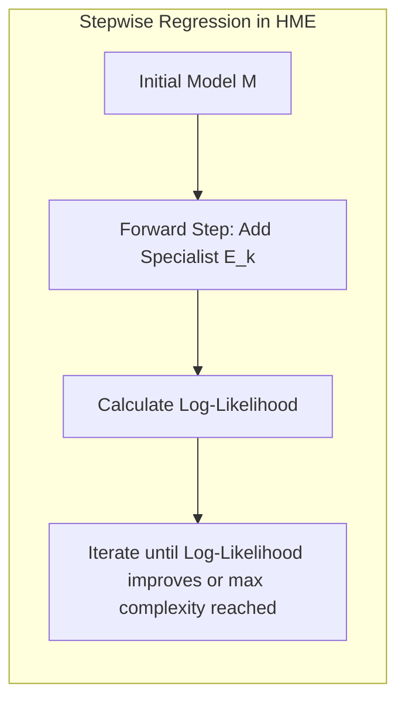
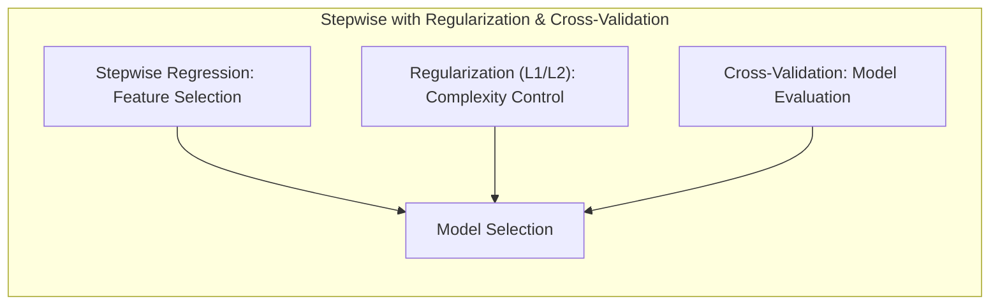
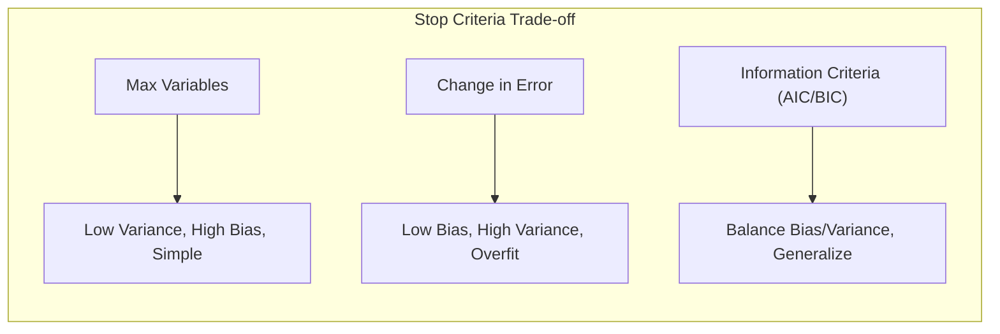

## Título: Modelos Aditivos, Árvores e Métodos Relacionados: Relação entre *Stepwise Regression* e Modelagem Hierárquica com Funções e Interações

### Introdução

Este capítulo explora a relação entre a abordagem *stepwise regression* e modelagem hierárquica, com foco em como o *stepwise regression* pode ser utilizado na construção de modelos mais complexos que envolvem funções não lineares e interações, particularmente em modelos como Multivariate Adaptive Regression Splines (MARS) e misturas hierárquicas de especialistas (HME) [^9.1]. *Stepwise regression* é um método iterativo para seleção de variáveis e componentes, que envolve a adição e remoção de termos de um modelo, com base no seu impacto na função de custo. A modelagem hierárquica utiliza uma estrutura de modelos mais simples que são combinados para formar modelos complexos. O capítulo detalha como o *stepwise regression* é utilizado em modelos MARS e HME, como ele explora as relações e interações entre os preditores e como ele pode ser utilizado para construir modelos eficientes e com boa capacidade de generalização. O objetivo principal é apresentar uma compreensão sobre a aplicação de métodos iterativos como o *stepwise regression* em modelos complexos e como ele se relaciona com modelos aditivos e com abordagens hierárquicas para modelagem estatística.

### Conceitos Fundamentais

**Conceito 1: *Stepwise Regression* como Método de Seleção de Variáveis**

O método *stepwise regression* é uma abordagem iterativa para a seleção de variáveis que combina passos de *forward selection* e *backward elimination*. O algoritmo começa com um modelo inicial e, em cada passo, ele avalia a adição ou remoção de uma variável com base no impacto na função de custo. Em modelos lineares, o critério de escolha é geralmente o erro quadrático médio (MSE), e em modelos da família exponencial, a deviance ou a *log-likelihood* é utilizada para escolher qual variável deve ser adicionada ou removida. O algoritmo *stepwise regression* itera sobre os dois passos até que nenhuma variável possa ser adicionada ou removida que leve a uma melhoria significativa da função de custo ou da capacidade preditiva do modelo. O *stepwise regression* busca um modelo que tenha um bom balanço entre a capacidade de ajuste e a complexidade, utilizando uma busca gulosa para selecionar o melhor subconjunto de preditores.

> 💡 **Exemplo Numérico:**
> Suponha que temos um conjunto de dados com uma variável resposta $y$ e três preditores $x_1$, $x_2$, e $x_3$. Inicialmente, o modelo tem apenas o intercepto.
>
> 1.  **Passo *Forward*:**
>     *   Ajustamos três modelos lineares simples: $y = \beta_0 + \beta_1 x_1$, $y = \beta_0 + \beta_2 x_2$, e $y = \beta_0 + \beta_3 x_3$.
>     *   Calculamos o MSE para cada modelo.
>     *   Suponha que o modelo com $x_1$ tem o menor MSE. Adicionamos $x_1$ ao modelo.
> 2.  **Passo *Backward* (Neste caso, não há variáveis para remover):**
>     *   O modelo atual é $y = \beta_0 + \beta_1 x_1$.
> 3.  **Passo *Forward*:**
>     *   Ajustamos dois modelos: $y = \beta_0 + \beta_1 x_1 + \beta_2 x_2$ e $y = \beta_0 + \beta_1 x_1 + \beta_3 x_3$.
>     *   Calculamos o MSE para cada modelo.
>     *   Suponha que o modelo com $x_2$ tem o menor MSE. Adicionamos $x_2$ ao modelo.
> 4. **Passo *Backward*:**
>    *   Ajustamos um modelo sem $x_1$: $y = \beta_0 + \beta_2 x_2$. Calculamos o MSE.
>    *   Se o MSE deste modelo for maior que o modelo atual, mantemos $x_1$.
>
> Esse processo continua até que nenhum passo *forward* ou *backward* reduza significativamente o MSE. Este exemplo ilustra como o *stepwise regression* itera entre adicionar e remover variáveis até encontrar um modelo que balanceia ajuste e complexidade.

**Lemma 1:** *O método *stepwise regression* combina abordagens *forward* e *backward* para a seleção de variáveis, e o processo iterativo busca encontrar um subconjunto de preditores que otimize a função de custo. A busca gulosa, no entanto, não garante a solução ótima global e pode levar a modelos com um desempenho subótimo*. O *stepwise regression* é uma ferramenta para a construção de modelos parcimoniosos [^4.5].

**Conceito 2: Estratégias de Modelagem Hierárquica**

A modelagem hierárquica busca construir modelos complexos através da combinação de modelos mais simples em diferentes níveis hierárquicos. Em vez de construir um modelo complexo de uma vez só, a modelagem hierárquica começa com um modelo base e, em cada passo, adiciona um componente para aumentar a complexidade e a capacidade de modelagem do modelo. Essa abordagem permite lidar com dados complexos, com diferentes níveis de não linearidade e interações entre os preditores, e é usada com modelos que são construídos de forma iterativa. A modelagem hierárquica permite construir modelos que sejam apropriados para diferentes regiões do espaço de características e em dados com hierarquias pré-definidas ou que são inferidas a partir dos dados.

> 💡 **Exemplo Numérico:**
> Considere um modelo hierárquico para prever o desempenho de estudantes.
>
> *   **Nível 1:** Um modelo simples que usa apenas as horas de estudo para prever a nota.
> *   **Nível 2:** Adicionamos um segundo modelo que considera o nível de experiência do professor para ajustar o modelo do nível 1.
> *   **Nível 3:** Um terceiro modelo é adicionado, considerando o tipo de escola (pública ou privada) para ajustar os modelos dos níveis 1 e 2.
>
> Cada nível adiciona complexidade e permite modelar a influência de diferentes fatores. O *stepwise regression* pode ser usado para selecionar quais variáveis (horas de estudo, experiência do professor, tipo de escola) devem ser incluídas em cada nível da hierarquia.

**Corolário 1:** *A modelagem hierárquica permite a construção de modelos complexos a partir de modelos mais simples, e a utilização de algoritmos iterativos, como o *stepwise regression*, auxilia no processo de construção do modelo*. A construção hierárquica de modelos permite criar modelos mais adaptados a diferentes tipos de problemas [^9.5].

**Conceito 3: *Stepwise Regression* em MARS e HME**

*   **Multivariate Adaptive Regression Splines (MARS):** Em MARS, o algoritmo *stepwise regression* é utilizado na seleção de funções de base (funções *spline* lineares por partes), e é usado tanto no passo *forward* como no passo *backward* do algoritmo. No passo *forward*, o algoritmo adiciona o termo *spline* que mais reduz o erro, e no passo *backward* remove os termos menos relevantes, e o processo é repetido até que um critério de parada seja atingido. A combinação de *forward* e *backward* no MARS define a estrutura do modelo e controla a complexidade.

*   **Misturas Hierárquicas de Especialistas (HME):** Em HME, o algoritmo *stepwise regression* pode ser utilizado para escolher os especialistas a serem adicionados em cada camada hierárquica. O algoritmo avalia todos os possíveis especialistas e adiciona aquele que melhor se adapta à região do espaço de características e que maximiza a função de *log-likelihood*. A estrutura hierárquica e a adição iterativa de componentes aumentam a flexibilidade do modelo e a sua capacidade de modelagem.

> ⚠️ **Nota Importante:** Os algoritmos *stepwise regression* são utilizados para a construção de modelos complexos, que envolvem a escolha de um grande número de variáveis e componentes. Os algoritmos realizam uma busca gulosa, onde um passo é feito de cada vez, e cada componente é escolhido com base na melhoria local do modelo, o que não garante que o modelo final seja ótimo globalmente [^4.5.1].

> ❗ **Ponto de Atenção:** A escolha do critério para seleção de variáveis e o critério de parada do *stepwise regression* é fundamental para evitar o *overfitting* e para garantir a estabilidade do modelo. A utilização de validação cruzada é útil para escolher os melhores parâmetros e para avaliar o desempenho do modelo [^4.5.2].

> ✔️ **Destaque:** Os algoritmos *stepwise regression* combinados com abordagens hierárquicas são usados para construir modelos mais complexos e adaptáveis a dados com relações não lineares e interações complexas entre os preditores, o que torna essas abordagens importantes em modelagem estatística. O uso do stepwise regression na seleção de variáveis é um mecanismo para controle da complexidade de modelos complexos [^4.5].

### Formulação do *Stepwise Regression* em Modelos Aditivos, MARS e HME

A formulação do *stepwise regression* em diferentes modelos de aprendizado supervisionado é dada abaixo:

1.  **Modelos Aditivos Generalizados (GAMs):** Em modelos GAMs, o algoritmo *stepwise regression* pode ser utilizado para escolher os preditores, como por exemplo:
    *   **Passo *Forward Selection*:** Avaliar todos os preditores $X_j$, e selecionar o preditor que mais diminui a função de custo, ou seja:
       $$
    \text{Selecionar } X_j: \underset{j}{\arg \min } \text{PRSS}(\alpha, f_1, \ldots, f_j, \ldots, f_p)
    $$
     onde o PRSS é a soma de quadrados penalizada utilizada em modelos aditivos.
    *   **Passo *Backward Deletion*:** Após a adição de um novo preditor, avaliar todos os preditores e remover o preditor que menos influencia na função de custo.
        $$
        \text{Remover } X_j: \underset{j}{\arg \min } \Delta PRSS(\alpha, f_1, \ldots, f_j, \ldots, f_p)
        $$

        onde  $\Delta PRSS$ representa a diferença no PRSS quando o preditor $X_j$ é removido.
O processo iterativo envolve a adição de uma variável e a remoção de uma variável, até que nenhuma variável possa ser adicionada ou removida que melhore o ajuste do modelo.
> 💡 **Exemplo Numérico:**
> Suponha um modelo GAM com dois preditores $X_1$ e $X_2$, e a resposta $y$.
>
> 1.  **Inicialização:** Começamos com um modelo nulo: $y = \alpha$. O PRSS inicial é PRSS$_0$.
> 2.  **Passo *Forward*:**
>     *   Modelo 1: $y = \alpha + f_1(X_1)$. PRSS$_1$.
>     *   Modelo 2: $y = \alpha + f_2(X_2)$. PRSS$_2$.
>     *   Suponha que PRSS$_1$ < PRSS$_2$. Selecionamos o Modelo 1.
> 3.  **Passo *Backward* (não aplicável no primeiro passo forward):**
> 4.  **Passo *Forward*:**
>    *   Modelo 3: $y = \alpha + f_1(X_1) + f_2(X_2)$. PRSS$_3$.
> 5.  **Passo *Backward*:**
>    *   Removemos $X_1$: $y = \alpha + f_2(X_2)$. PRSS$_{1-}$.
>    *   Removemos $X_2$: $y = \alpha + f_1(X_1)$. PRSS$_{2-}$.
>    *   Se PRSS$_{1-}$ e PRSS$_{2-}$ forem maiores que PRSS$_3$, mantemos o modelo completo.
>
> Este exemplo ilustra como o stepwise regression adiciona e remove funções de cada preditor para otimizar o PRSS em um modelo GAM.

2.  **Multivariate Adaptive Regression Splines (MARS):** Em MARS, o algoritmo *stepwise regression* é utilizado para escolher os componentes de *spline*, que são adicionados ou removidos de forma iterativa.
    *   **Passo *Forward Selection*:** Avaliar todos os nós $t$ de todos os preditores $X_j$, e selecionar a função *spline* que mais diminui o SSE:
     $$
   \text{Selecionar } (x-t)_+ \text{ ou } (t-x)_+: \underset{j,t}{\arg \min } \text{SSE}(M + (x-t)_+) \text{ ou }  \underset{j,t}{\arg \min } \text{SSE}(M + (t-x)_+)
   $$

    onde $M$ é o modelo atual.
     *   **Passo *Backward Deletion*:** Remover o termo de *spline* que menos aumenta o erro.
    A escolha do nó e do preditor a cada passo é feita de forma gulosa, buscando o melhor ajuste possível naquele momento.

> 💡 **Exemplo Numérico:**
> Vamos considerar um modelo MARS com um único preditor $x$ e a variável resposta $y$.
>
> 1.  **Passo *Forward*:**
>     *   Começamos com um modelo constante: $M = \beta_0$.
>     *   Avaliamos adicionar funções *spline* com diferentes nós, por exemplo, $t_1 = 2$ e $t_2 = 5$:
>         *   $M_1 = \beta_0 + \beta_1 (x - 2)_+$
>         *   $M_2 = \beta_0 + \beta_1 (2 - x)_+$
>         *   $M_3 = \beta_0 + \beta_1 (x - 5)_+$
>         *   $M_4 = \beta_0 + \beta_1 (5 - x)_+$
>     *   Calculamos o SSE para cada modelo e selecionamos o que tem o menor SSE. Suponha que $M_1$ seja selecionado.
> 2.  **Passo *Backward* (não aplicável no primeiro passo forward):**
> 3.  **Passo *Forward*:**
>     *   Adicionamos mais funções *spline* ao modelo atual $M_1$, como por exemplo:
>         *   $M_{1,1} = \beta_0 + \beta_1 (x - 2)_+ + \beta_2 (x - 5)_+$
>         *   $M_{1,2} = \beta_0 + \beta_1 (x - 2)_+ + \beta_2 (5 - x)_+$
>     *   Calculamos o SSE e selecionamos o melhor modelo. Suponha que $M_{1,1}$ seja selecionado.
> 4.  **Passo *Backward*:**
>     *   Removemos o termo $(x-2)_+$ e calculamos o SSE.
>     *   Removemos o termo $(x-5)_+$ e calculamos o SSE.
>     *   Se a remoção de qualquer termo aumentar o SSE, mantemos os dois termos.
>
> O processo continua adicionando e removendo termos *spline* até que o critério de parada seja atingido.

3.   **Misturas Hierárquicas de Especialistas (HME):** Em HME, o algoritmo *stepwise regression* é utilizado para adicionar modelos locais (especialistas) ou camadas hierárquicas ao modelo, utilizando um critério de avaliação da *log-likelihood* ou do erro de previsão:
    *   **Passo *Forward Selection*:** Avaliar todos os modelos especialistas disponíveis, e selecionar aquele que aumenta a *log-likelihood* do modelo de forma mais significativa:

        $$
        \text{Selecionar Modelo } E_k : \underset{k}{\arg \max} \text{log-likelihood}(M + E_k)
        $$

   onde $M$ é o modelo atual.
     *   O processo iterativo é repetido até que não haja melhorias na *log-likelihood* ou o modelo atinja um nível máximo de complexidade.

> 💡 **Exemplo Numérico:**
> Imagine um modelo HME para classificar dados em duas regiões, usando duas classes.
>
> 1.  **Inicialização:** Começamos com um modelo simples, um único especialista $E_1$.
> 2.  **Passo *Forward*:**
>     *   Avaliamos adicionar um segundo especialista, $E_2$.
>     *   Calculamos a *log-likelihood* do modelo com $E_1$ e do modelo com $E_1$ e $E_2$.
>     *   Se a *log-likelihood* do modelo com $E_1$ e $E_2$ for significativamente maior, adicionamos $E_2$.
> 3.  **Próximos Passos:**
>     *   O processo continua com a adição de mais especialistas ou camadas hierárquicas, com o objetivo de aumentar a *log-likelihood* do modelo.
>
> Este exemplo mostra como o stepwise regression adiciona especialistas para melhor modelar diferentes regiões dos dados em um modelo HME.

Os algoritmos *stepwise regression* buscam modelos com bom desempenho, mas o uso de critérios locais pode levar a soluções subótimas. A escolha do critério de escolha da variável e de parada é crucial para a qualidade do modelo final.

**Lemma 4:** *O algoritmo *stepwise regression* é utilizado em modelos estatísticos para escolher os componentes do modelo de forma iterativa, adicionando e removendo termos com base em métricas de desempenho. A forma como o algoritmo é implementado e os critérios de escolha podem variar, e o algoritmo gera modelos com um bom balanço entre a capacidade de ajuste e a complexidade*. A utilização de métodos iterativos para seleção de componentes é útil na construção de modelos flexíveis [^4.5.1].

### A Interpretabilidade e as Limitações dos Modelos Construídos com Stepwise Regression

Modelos construídos com o método de *stepwise regression* podem apresentar uma boa capacidade preditiva, mas a sua interpretabilidade é afetada pela natureza iterativa e gulosa da construção, onde a escolha de cada variável, ou componente, é baseada em decisões locais, e a seleção não garante que todas as interações sejam incluídas de forma apropriada, e a interpretação de modelos complexos construídos iterativamente pode ser um desafio. Embora a seleção seja feita com base em métricas de ajuste, o resultado final pode não ser ótimo globalmente. Modelos complexos podem se ajustar muito bem aos dados de treinamento e não ter uma boa capacidade de generalização.

### A Relação do Stepwise Regression com Outras Técnicas de Regularização e Validação Cruzada

O *stepwise regression* pode ser combinado com outras técnicas de regularização e validação cruzada para melhorar o desempenho do modelo. A regularização, como a penalização L1 ou L2, pode ser utilizada para controlar a complexidade dos modelos e evitar *overfitting*, e a validação cruzada pode ser utilizada para escolher os modelos com a melhor capacidade de generalização. A combinação de métodos de seleção com técnicas de regularização e validação cruzada garante a construção de modelos que sejam mais adequados e mais robustos para dados complexos e para aplicações em cenários reais.

> 💡 **Exemplo Numérico:**
> Suponha que estamos construindo um modelo de regressão linear com *stepwise regression*.
>
> 1.  **Stepwise Regression:** Usamos *stepwise regression* para selecionar um subconjunto de preditores $x_1, x_2, x_3$ do conjunto total de preditores, resultando no modelo: $y = \beta_0 + \beta_1 x_1 + \beta_2 x_2 + \beta_3 x_3$.
> 2.  **Regularização (Lasso):** Aplicamos regularização Lasso (L1) para reduzir a magnitude dos coeficientes e simplificar ainda mais o modelo:
>     *   A função de custo agora é:  $SSE + \lambda \sum_{i=1}^3 |\beta_i|$.
>     *   O parâmetro $\lambda$ controla a intensidade da regularização.
> 3.  **Validação Cruzada:**
>     *   Dividimos os dados em k folds.
>     *   Treinamos o modelo com diferentes valores de $\lambda$ em k-1 folds e avaliamos no fold restante.
>     *   Repetimos esse processo k vezes.
>     *   Escolhemos o valor de $\lambda$ que produz o menor erro médio na validação cruzada.
>
> Este processo ajuda a encontrar um modelo que generaliza bem para dados não vistos e evita overfitting, combinando stepwise regression com regularização e validação cruzada.

### Perguntas Teóricas Avançadas: Como diferentes critérios de parada (número máximo de variáveis, mudanças no erro, métodos baseados em informação) no algoritmo *stepwise regression* afetam o *trade-off* entre *bias* e variância e a capacidade de generalização do modelo, e quais são as implicações para a interpretabilidade?

**Resposta:**

Diferentes critérios de parada no algoritmo *stepwise regression* têm um impacto significativo no *trade-off* entre *bias* e variância, na capacidade de generalização e na interpretabilidade do modelo. A escolha do critério de parada deve considerar os objetivos da modelagem e as características do conjunto de dados, e definir como a complexidade do modelo é controlada.

*   **Número Máximo de Variáveis:** A escolha de um número máximo de variáveis no modelo define uma parada no algoritmo quando este número é atingido. Um número máximo de variáveis pequeno limita a complexidade do modelo, o que leva a um alto *bias* e baixa variância, e o modelo é mais estável, mas pode perder a capacidade de modelar relações complexas. Um número máximo de variáveis muito grande leva a modelos com menor *bias*, mas com maior variância e maior risco de *overfitting*.
*   **Mudanças no Erro:** A escolha de um critério baseado na mudança no erro, como um limiar mínimo para a redução da soma dos erros quadráticos ou da deviance, define quando o algoritmo deve parar a construção do modelo. Um critério de parada mais rigoroso leva a modelos mais complexos, e um critério menos rigoroso leva a modelos mais simples, e o *trade-off* entre *bias* e variância deve ser considerado. A escolha do limiar depende da qualidade do ajuste dos dados e do risco de overfitting que se pretende controlar.
*   **Critérios Baseados em Informação:** Critérios como o critério de informação de Akaike (AIC) e o critério de informação Bayesiano (BIC) utilizam uma combinação da *log-likelihood* e uma penalização pela complexidade do modelo. O AIC é um critério para a comparação de modelos, e leva a modelos com maior capacidade de ajuste, enquanto o BIC penaliza modelos mais complexos e busca um bom balanço entre ajuste e complexidade. A escolha do critério de parada depende do objetivo da modelagem e da necessidade de um modelo mais ou menos complexo.

> 💡 **Exemplo Numérico:**
> Suponha que estamos usando *stepwise regression* com três critérios de parada diferentes:
>
> 1.  **Número máximo de variáveis:** Limitamos a um máximo de 3 variáveis. O modelo resultante pode ser simples, mas pode ter um *bias* maior.
> 2.  **Mudança no erro:** Paramos quando a redução no erro (SSE) for menor que 0.01. O modelo pode ter mais variáveis e, portanto, menor *bias*, mas maior variância.
> 3.  **Critério AIC:** Usamos o AIC para penalizar a complexidade do modelo. O modelo resultante tende a ter um bom balanço entre ajuste e complexidade.
>
> Em um cenário de simulação, onde sabemos a verdadeira relação entre as variáveis, podemos observar que:
>
> *   O modelo com número máximo de variáveis pode ter um *bias* maior, pois não consegue modelar a relação complexa.
> *   O modelo com critério de redução no erro pode apresentar *overfitting* e ter alta variância.
> *   O modelo com critério AIC tende a ter o melhor balanço entre *bias* e variância e, portanto, a melhor capacidade de generalização.

A escolha do critério de parada, portanto, tem um impacto direto na estrutura do modelo e no seu desempenho. Critérios baseados em informação tendem a penalizar modelos mais complexos, enquanto critérios baseados na redução do erro podem levar a modelos que se ajustam excessivamente aos dados de treino. Modelos mais complexos tendem a ter menor *bias* e maior variância, e modelos mais simples tendem a ter maior *bias* e menor variância.

A interpretabilidade também é afetada pela escolha do critério de parada. Modelos com menos variáveis tendem a ser mais fáceis de interpretar, enquanto que modelos com muitas variáveis e com interações complexas tendem a ser mais difíceis de entender. A escolha do melhor modelo deve considerar um balanço entre a interpretabilidade, o *trade-off* entre *bias* e variância, e a capacidade de generalização.

**Lemma 5:** *A escolha do critério de parada, utilizado em algoritmos *forward stagewise*, afeta diretamente a complexidade do modelo, o seu *bias* e variância, e a sua capacidade de generalização e interpretabilidade. A escolha de um critério de parada é um compromisso entre ajuste aos dados e a capacidade de generalização*. A escolha do critério de parada é crucial para modelos com bom desempenho [^4.5.1].

**Corolário 5:** *A escolha de um critério de parada mais ou menos rigoroso afeta o tamanho do modelo, e a sua capacidade de generalização e interpretabilidade. Métodos baseados em informação, como o AIC e BIC, oferecem uma alternativa para o controle da complexidade dos modelos e para a escolha de um modelo com bom desempenho*. A escolha do método de parada e a utilização de técnicas de regularização auxiliam na escolha de modelos mais robustos [^4.5.2].

> ⚠️ **Ponto Crucial:** A escolha do critério de parada é um componente chave na construção de modelos com algoritmos *forward stagewise*, e o seu ajuste fino afeta o *trade-off* entre *bias* e variância, e também a interpretabilidade e a capacidade de generalização dos modelos, e deve ser feita com cuidado, levando em consideração o contexto do problema e o objetivo da análise [^4.4.5].

### Conclusão

Este capítulo explorou a relação entre o *stepwise regression* e as abordagens hierárquicas, com foco na construção de modelos complexos como MARS e HME. A utilização de abordagens iterativas, como o *forward stagewise*, foi detalhada, e como a escolha do critério de parada e da função de custo influencia o desempenho dos modelos e a sua capacidade de modelar dados com diferentes tipos de padrões. A compreensão dessas abordagens é essencial para a construção de modelos estatísticos robustos, eficientes e com um bom balanço entre capacidade de ajuste, generalização e interpretabilidade.

### Footnotes

[^4.1]: "In this chapter we begin our discussion of some specific methods for super-vised learning. These techniques each assume a (different) structured form for the unknown regression function, and by doing so they finesse the curse of dimensionality. Of course, they pay the possible price of misspecifying the model, and so in each case there is a tradeoff that has to be made." *(Trecho de "Additive Models, Trees, and Related Methods")*

[^4.2]: "Regression models play an important role in many data analyses, providing prediction and classification rules, and data analytic tools for understand-ing the importance of different inputs." *(Trecho de "Additive Models, Trees, and Related Methods")*

[^4.3]: "In this section we describe a modular algorithm for fitting additive models and their generalizations. The building block is the scatterplot smoother for fitting nonlinear effects in a flexible way. For concreteness we use as our scatterplot smoother the cubic smoothing spline described in Chapter 5." *(Trecho de "Additive Models, Trees, and Related Methods")*

[^4.3.1]:  "The additive model has the form $Y = \alpha + \sum_{j=1}^p f_j(X_j) + \varepsilon$, where the error term $\varepsilon$ has mean zero." * (Trecho de "Additive Models, Trees, and Related Methods")*

[^4.3.2]:   "Given observations $x_i, y_i$, a criterion like the penalized sum of squares (5.9) of Section 5.4 can be specified for this problem, $\text{PRSS}(\alpha, f_1, f_2,\ldots, f_p) = \sum_i^N (y_i - \alpha - \sum_j^p f_j(x_{ij}))^2 + \sum_j^p \lambda_j \int(f_j''(t_j))^2 dt_j$" * (Trecho de "Additive Models, Trees, and Related Methods")*

[^4.3.3]: "where the $\lambda_j > 0$ are tuning parameters. It can be shown that the minimizer of (9.7) is an additive cubic spline model; each of the functions $f_j$ is a cubic spline in the component $X_j$, with knots at each of the unique values of $x_{ij}$, $i = 1,\ldots, N$." *(Trecho de "Additive Models, Trees, and Related Methods")*

[^4.4]: "For two-class classification, recall the logistic regression model for binary data discussed in Section 4.4. We relate the mean of the binary response $\mu(X) = \text{Pr}(Y = 1|X)$ to the predictors via a linear regression model and the logit link function:  $\log(\mu(X)/(1 – \mu(X)) = \alpha + \beta_1 X_1 + \ldots + \beta_pX_p$." * (Trecho de "Additive Models, Trees, and Related Methods")*

[^4.4.1]: "The additive logistic regression model replaces each linear term by a more general functional form: $\log(\mu(X)/(1 – \mu(X))) = \alpha + f_1(X_1) + \cdots + f_p(X_p)$, where again each $f_j$ is an unspecified smooth function." * (Trecho de "Additive Models, Trees, and Related Methods")*

[^4.4.2]: "While the non-parametric form for the functions $f_j$ makes the model more flexible, the additivity is retained and allows us to interpret the model in much the same way as before. The additive logistic regression model is an example of a generalized additive model." *(Trecho de "Additive Models, Trees, and Related Methods")*

[^4.4.3]: "In general, the conditional mean $\mu(X)$ of a response $Y$ is related to an additive function of the predictors via a link function $g$:  $g[\mu(X)] = \alpha + f_1(X_1) + \cdots + f_p(X_p)$." *(Trecho de "Additive Models, Trees, and Related Methods")*

[^4.4.4]:  "Examples of classical link functions are the following: $g(\mu) = \mu$ is the identity link, used for linear and additive models for Gaussian response data." *(Trecho de "Additive Models, Trees, and Related Methods")*

[^4.4.5]: "$g(\mu) = \text{logit}(\mu)$