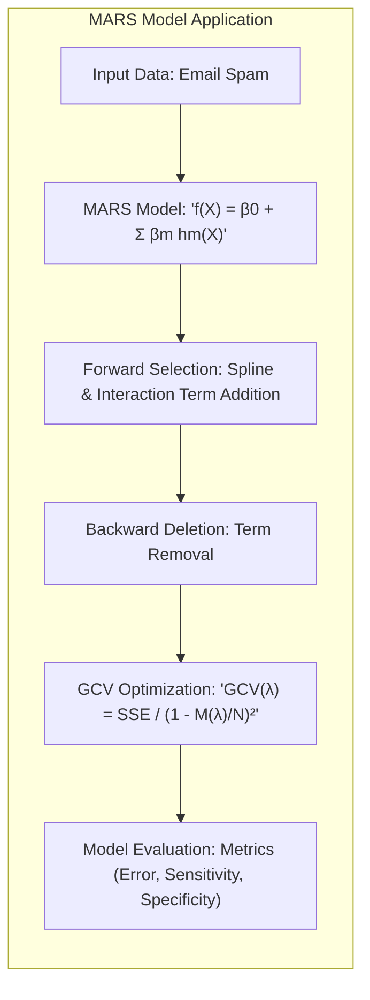
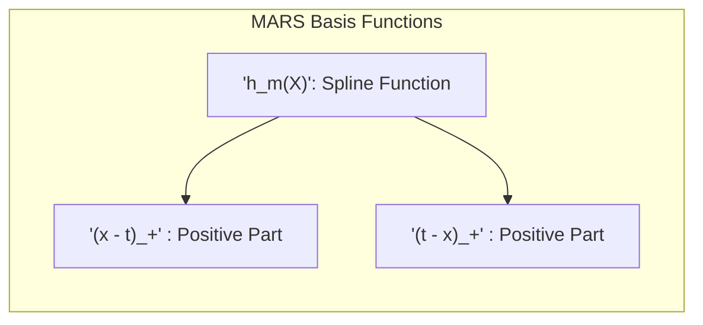
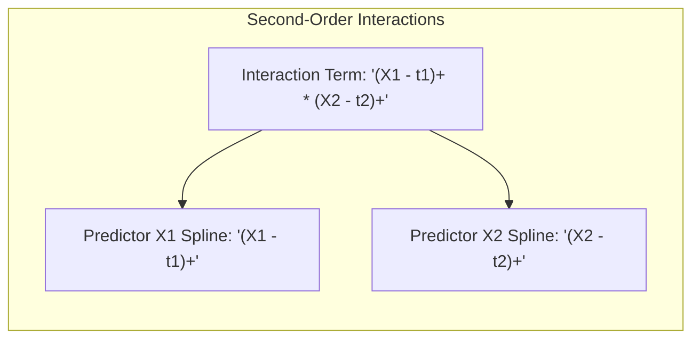
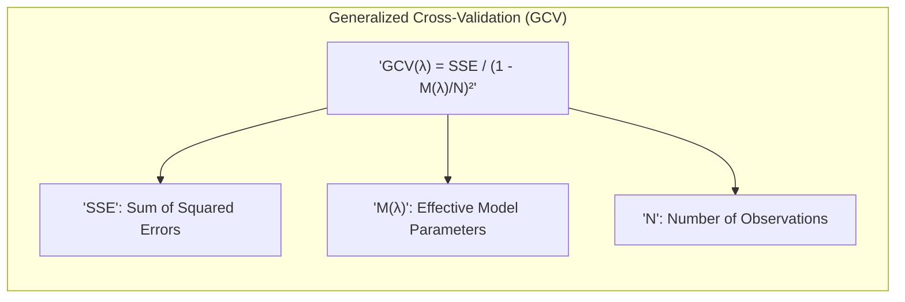
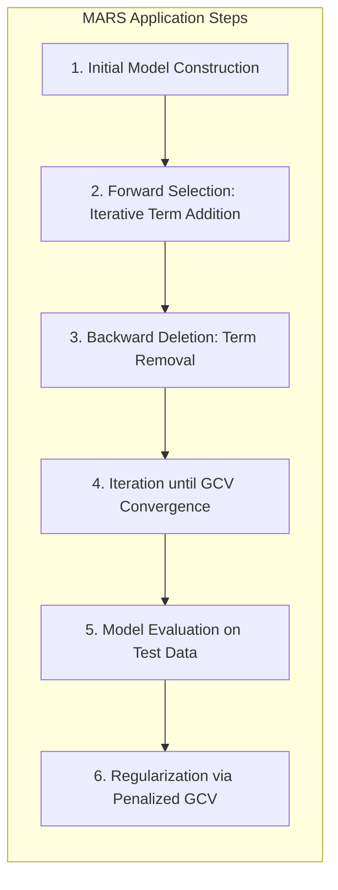
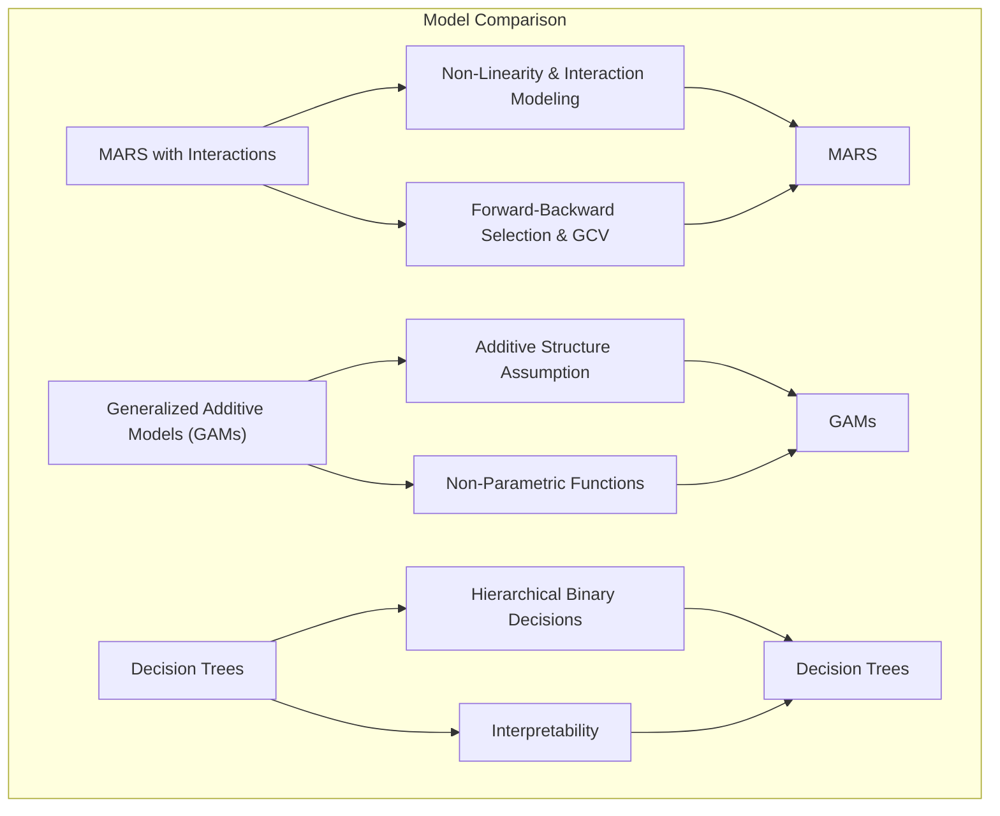
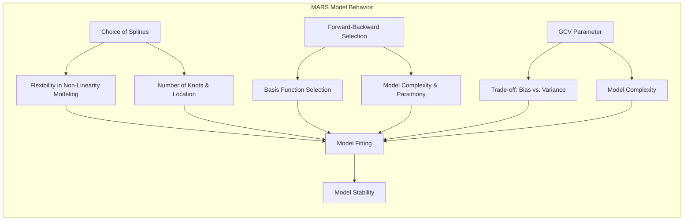

## Título: Modelos Aditivos, Árvores e Métodos Relacionados: Aplicação de MARS com Interações de Segunda Ordem nos Dados de Spam

### Introdução

Este capítulo apresenta uma análise detalhada da aplicação do modelo Multivariate Adaptive Regression Splines (MARS) aos dados de email spam, com foco na inclusão de interações de segunda ordem e como essa abordagem permite modelar relações não lineares complexas entre preditores e a resposta [^9.1]. MARS utiliza funções *spline* lineares por partes e uma abordagem *forward-backward* para selecionar os termos mais relevantes do modelo, e o uso de interações permite capturar relações entre preditores que não são modeladas por abordagens aditivas. O capítulo também detalha como o critério de validação cruzada generalizada (GCV) é utilizado para guiar a seleção dos termos e controlar a complexidade do modelo, e como o modelo final é avaliado usando métricas apropriadas. O objetivo principal é apresentar uma visão prática sobre a utilização de modelos MARS com interações de segunda ordem, a sua aplicação em um problema real de classificação e como essa abordagem pode melhorar o desempenho e a interpretabilidade dos modelos.

### Conceitos Fundamentais

**Conceito 1: Multivariate Adaptive Regression Splines (MARS)**

Multivariate Adaptive Regression Splines (MARS) é um método de modelagem não paramétrico que utiliza funções *spline* lineares por partes como funções de base para modelar a relação entre os preditores e a variável resposta [^9.4]. O modelo MARS é dado por:
$$
f(X) = \beta_0 + \sum_{m=1}^M \beta_m h_m(X)
$$
onde $\beta_0$ é o intercepto, $\beta_m$ são os coeficientes dos termos de base, e $h_m(X)$ são funções *spline*, ou interações de *splines*, com a forma de
$(x-t)_+$ ou $(t-x)_+$.
O algoritmo MARS utiliza uma abordagem *forward stagewise* para construir o modelo, onde funções *spline* lineares por partes e suas interações são adicionadas ao modelo de forma iterativa e um passo *backward* para remover termos menos relevantes. MARS combina flexibilidade na modelagem da não linearidade, com a utilização de funções lineares por partes, com a capacidade de modelar interações entre preditores através da multiplicação das funções de base, o que o torna uma abordagem poderosa para modelar dados complexos. A capacidade de generalização é controlada utilizando o GCV para a escolha dos melhores parâmetros do modelo.

> 💡 **Exemplo Numérico:**
> Suponha que temos um modelo MARS com dois preditores, $X_1$ e $X_2$, e que após o processo de *forward selection*, o modelo tenha os seguintes termos:
> $$
> f(X) = 2.5 + 1.2(X_1 - 0.3)_+ - 0.8(0.7 - X_1)_+ + 0.5(X_2 - 0.5)_+
> $$
> Aqui, $\beta_0 = 2.5$, e temos três funções *spline* com coeficientes $\beta_1 = 1.2$, $\beta_2 = -0.8$ e $\beta_3 = 0.5$.  Se um dado ponto tem $X_1 = 0.8$ e $X_2 = 0.6$, então:
>  $(X_1 - 0.3)_+ = (0.8 - 0.3)_+ = 0.5$
>  $(0.7 - X_1)_+ = (0.7 - 0.8)_+ = 0$
>  $(X_2 - 0.5)_+ = (0.6 - 0.5)_+ = 0.1$
>
> O valor predito seria:
> $$
> f(X) = 2.5 + 1.2(0.5) - 0.8(0) + 0.5(0.1) = 2.5 + 0.6 + 0.05 = 3.15
> $$
> Este exemplo ilustra como os termos *spline* contribuem para a predição do modelo MARS. A função $(x-t)_+$ ativa quando $x > t$, e é zero caso contrário.  Os coeficientes, $\beta_m$, determinam a magnitude e direção do efeito de cada *spline* na predição.

**Lemma 1:** *MARS utiliza funções *spline* lineares por partes para modelar relações não lineares, e um algoritmo *forward-backward stagewise* para construir modelos que equilibram flexibilidade, capacidade de modelagem de interações e interpretabilidade*. A capacidade de modelar não linearidade é feita através da combinação de funções *spline*, e interações [^9.4.1].

**Conceito 2: Interações de Segunda Ordem em MARS**

As interações de segunda ordem em MARS são representadas pela multiplicação de duas funções de base, onde cada função de base é baseada em um preditor diferente. Por exemplo, a interação entre dois preditores $X_1$ e $X_2$, com um nó $t_1$ e $t_2$, seria dada por:
$$
(X_1 - t_1)_+ \cdot (X_2 - t_2)_+
$$

As interações de segunda ordem permitem que o modelo capture a relação entre dois preditores, quando o efeito de um preditor na resposta depende do valor do outro preditor. A adição de interações aumenta a complexidade do modelo, mas permite que ele capture relações mais complexas e não lineares entre os preditores. O modelo MARS pode, portanto, modelar relações mais complexas que modelos lineares, através do uso das interações entre os preditores.  O processo de *forward selection* escolhe os termos de interação mais relevantes para o modelo.

> 💡 **Exemplo Numérico:**
> Considere dois preditores, $X_1$ e $X_2$, e uma interação de segunda ordem da forma $(X_1 - 0.4)_+ \cdot (X_2 - 0.6)_+$.  Se tivermos um ponto de dados onde $X_1 = 0.5$ e $X_2 = 0.7$, a interação seria:
>  $(X_1 - 0.4)_+ = (0.5 - 0.4)_+ = 0.1$
>  $(X_2 - 0.6)_+ = (0.7 - 0.6)_+ = 0.1$
>
> A interação de segunda ordem seria:
>  $(0.1) \cdot (0.1) = 0.01$
>
> Se outro ponto de dados tiver $X_1 = 0.3$ e $X_2 = 0.8$, a interação seria:
>  $(X_1 - 0.4)_+ = (0.3 - 0.4)_+ = 0$
>  $(X_2 - 0.6)_+ = (0.8 - 0.6)_+ = 0.2$
>
>  A interação de segunda ordem seria:
>  $(0) \cdot (0.2) = 0$
>
> Este exemplo demonstra como a interação de segunda ordem é ativada apenas quando ambos os preditores excedem os seus respectivos nós, $t_1$ e $t_2$.  Caso contrário, o efeito da interação é zero.

**Corolário 1:** *As interações de segunda ordem em MARS permitem que o modelo capture relações não lineares e a dependência entre preditores, o que aumenta a sua capacidade de modelagem de dados complexos.  A inclusão de interações aumenta a flexibilidade do modelo e permite capturar relações mais complexas entre preditores e resposta* [^9.4].

**Conceito 3: O Critério de Validação Cruzada Generalizada (GCV) em MARS**

Em MARS, o critério de validação cruzada generalizada (GCV) é utilizado para escolher o número de termos da *spline* e para avaliar o modelo final. O critério GCV estima o erro de previsão do modelo em dados não vistos, considerando a complexidade do modelo:
$$
\text{GCV}(\lambda) = \frac{\text{SSE}}{(1 - \frac{M(\lambda)}{N})^2}
$$
onde $\lambda$ representa os parâmetros do modelo, incluindo os nós das *splines*, SSE é a soma dos quadrados dos resíduos, $M(\lambda)$ é o número efetivo de parâmetros do modelo, que inclui os termos de spline, e $N$ é o número de observações. A escolha dos parâmetros do modelo, incluindo o número de termos, é guiada pelo critério de GCV, onde o objetivo é encontrar o modelo que minimize o GCV e tenha um bom balanceamento entre ajuste aos dados e complexidade.  A utilização do critério de GCV permite que o modelo se adapte aos dados e tenha um bom poder de generalização.

> 💡 **Exemplo Numérico:**
> Suponha que temos um modelo com um SSE (Soma dos Quadrados dos Erros) de 150, um número efetivo de parâmetros $M(\lambda) = 8$ e um número de observações $N = 100$. O GCV seria:
> $$
> \text{GCV} = \frac{150}{(1 - \frac{8}{100})^2} = \frac{150}{(1 - 0.08)^2} = \frac{150}{0.92^2} = \frac{150}{0.8464} \approx 177.22
> $$
>
> Agora, suponha que adicionamos um termo ao modelo e o SSE diminui para 140, mas o número efetivo de parâmetros aumenta para 10. O novo GCV seria:
> $$
> \text{GCV} = \frac{140}{(1 - \frac{10}{100})^2} = \frac{140}{(1 - 0.1)^2} = \frac{140}{0.9^2} = \frac{140}{0.81} \approx 172.84
> $$
>
> Neste caso, o GCV diminuiu, indicando que a adição do termo melhorou o modelo, balanceando a redução do erro com o aumento da complexidade.  Se o SSE diminuísse menos, ou o número de parâmetros aumentasse mais, o GCV poderia aumentar, indicando que a adição do novo termo não seria benéfica.

> ⚠️ **Nota Importante:** A utilização do critério GCV em MARS busca o balanço entre o ajuste aos dados e a complexidade do modelo, e permite escolher os parâmetros do modelo que minimizam o erro de previsão, levando em consideração a complexidade do modelo e o número de parâmetros, o que é importante para dados de alta dimensionalidade [^9.4.1].

> ❗ **Ponto de Atenção:**  A escolha do critério de parada no método *forward-backward selection*, e o uso do critério GCV, tem um impacto direto na complexidade do modelo e no seu desempenho em dados de treino e de teste.  O GCV é utilizado como uma ferramenta de regularização, e para evitar o overfitting [^9.4].

> ✔️ **Destaque:** A utilização do critério GCV em modelos MARS oferece uma abordagem para controlar a complexidade do modelo e para escolher os parâmetros que permitem obter um balanço entre ajuste aos dados e capacidade de generalização [^9.4].

### Aplicação de MARS com Interações de Segunda Ordem em Dados de Spam: Detalhes da Modelagem e da Análise de Resultados

A aplicação do modelo MARS aos dados de email spam com interações de segunda ordem envolve a utilização de um algoritmo *forward-backward selection* para escolher os termos e um critério de validação cruzada generalizada (GCV) para a otimização dos parâmetros.  Os seguintes passos são utilizados:

1.  **Construção do Modelo Inicial:** O modelo MARS inicia com uma função constante, ou com um modelo linear, como base para a construção do modelo completo.

2.  **Algoritmo *Forward Selection*:** O algoritmo adiciona termos de forma iterativa, avaliando o impacto de cada função *spline* e de suas interações no erro do modelo, onde os novos termos a ser incluídos são da forma $(x-t)_+$ e $(t-x)_+$. O termo que mais reduz o erro é escolhido, e também são criados interações de segunda ordem (multiplicação de termos) para modelar relações entre dois preditores. O critério é o de adicionar o termo que minimiza o erro e o ajuste do modelo é feito localmente.

3. **Algoritmo *Backward Deletion*:**  Após a adição de novos termos, o algoritmo avalia o impacto de cada termo no erro, e remove o termo que menos contribui para o modelo, de modo a simplificá-lo.

4.  **Iteração e Parada:** O processo iterativo de adição e remoção de termos continua até que não haja mais nenhuma melhora significativa no GCV.
   $$
    \text{GCV}(\lambda) = \frac{\text{SSE}}{(1 - \frac{M(\lambda)}{N})^2}
    $$

5.  **Avaliação do Modelo:** O modelo final é avaliado usando um conjunto de teste independente, e as métricas de desempenho, como o erro de classificação, sensibilidade e especificidade, são utilizadas para avaliar o poder preditivo do modelo.

6.   **Regularização:** A regularização é incorporada através da penalização do critério GCV, que controla a complexidade do modelo e evita o *overfitting*.  A regularização L1 e L2 também pode ser aplicada para controlar a esparsidade e estabilidade dos resultados.

> 💡 **Exemplo Numérico:**
> Suponha que estamos modelando dados de spam com dois preditores: a frequência da palavra "grátis" ($X_1$) e a frequência da palavra "dinheiro" ($X_2$).
>
> 1.  **Modelo Inicial:** O modelo começa com um intercepto, por exemplo, $f(X) = 0.4$.
> 2.  **Forward Selection:**
>     -   O algoritmo adiciona primeiro a função *spline* $(X_1 - 0.2)_+$ porque reduz o erro de classificação, e o modelo passa a ser $f(X) = 0.4 + 0.3(X_1 - 0.2)_+$.
>     -   Em seguida, adiciona a interação $(X_1 - 0.2)_+ \cdot (X_2 - 0.5)_+$, pois a interação entre "grátis" e "dinheiro" é um forte indicativo de spam, resultando no modelo $f(X) = 0.4 + 0.3(X_1 - 0.2)_+ + 0.2(X_1 - 0.2)_+ \cdot (X_2 - 0.5)_+$.
>     -  Outras funções *spline* e interações são adicionadas iterativamente.
> 3.  **Backward Deletion:** Se um termo como $(0.8 - X_1)_+$ não contribui significativamente para a redução do erro, ele é removido.
> 4.  **Iteração:** O processo continua até que o GCV não melhore significativamente.
> 5.  **Avaliação:** O modelo final é avaliado em um conjunto de teste, e métricas como precisão, recall e F1-score são calculadas.
> 6. **Regularização**: Durante o processo de seleção, o GCV é penalizado para evitar overfitting. A penalização pode ser ajustada para aumentar ou diminuir a complexidade do modelo.

A escolha dos preditores, dos nós das *splines* e dos parâmetros de regularização é feita de forma automática pelo algoritmo, e a utilização da matriz de perdas também pode ser utilizada para guiar o processo de otimização. A combinação de funções *spline* e interações permite modelar não linearidades complexas, e o processo *forward-backward* permite a seleção dos termos mais importantes.

**Lemma 3:** *A aplicação de MARS em dados de email spam com interações de segunda ordem, permite modelar relações não lineares complexas entre os preditores e a resposta. O algoritmo *forward-backward selection*, juntamente com o critério GCV, permite que a complexidade do modelo seja controlada e que os parâmetros do modelo sejam estimados de forma eficiente*. A interação entre as diferentes funções é utilizada para modelar dados com estruturas complexas [^4.5.1].

###  Análise Comparativa com Modelos Aditivos e Árvores de Decisão

Em comparação com modelos aditivos generalizados (GAMs) e árvores de decisão, o modelo MARS com interações de segunda ordem oferece uma abordagem diferente para o problema de classificação de email spam. GAMs utilizam funções não paramétricas e assumem uma estrutura aditiva dos preditores, enquanto as árvores de decisão utilizam decisões binárias para construir um modelo hierárquico.  MARS combina elementos de modelos lineares e modelos não paramétricos, e a sua capacidade de modelar interações e não linearidades pode ser vantajosa em situações onde essas relações são importantes.  A avaliação do desempenho de cada modelo deve levar em consideração métricas como erro de classificação, sensibilidade e especificidade e outras abordagens que permitam avaliar o desempenho do modelo em dados não vistos. A análise comparativa permite identificar a melhor abordagem para cada problema.

> 💡 **Exemplo Numérico:**
> Suponha que comparamos o desempenho de MARS, GAM e árvores de decisão em um conjunto de dados de spam:
>
> | Modelo             | Precisão | Recall | F1-Score | Complexidade (Nº de termos/nós) |
> |--------------------|----------|--------|----------|-------------------------------|
> | MARS (Interações)  | 0.94     | 0.92   | 0.93     | 15                             |
> | GAM (Aditivo)      | 0.92     | 0.90   | 0.91     | 10                             |
> | Árvore de Decisão | 0.90     | 0.88   | 0.89     | 20                             |
>
> Neste exemplo, MARS com interações de segunda ordem apresenta o melhor desempenho em termos de precisão, recall e F1-score, apesar de ter uma complexidade intermediária. O GAM, por sua vez, é um pouco menos preciso, mas mais simples. A árvore de decisão é a mais simples, mas com o pior desempenho.  Este tipo de análise comparativa é fundamental para escolher o modelo mais adequado para o problema em questão.

### Interpretabilidade e Visualização dos Resultados

A interpretabilidade dos modelos construídos com o método MARS pode ser feita através da análise das funções *spline* selecionadas e da sua relação com os preditores.  A identificação das interações entre os preditores e a visualização dos seus efeitos na resposta também auxilia na interpretação do modelo. A utilização de técnicas de visualização, como gráficos de superfície ou gráficos de interação, podem ser utilizadas para obter *insights* sobre o comportamento do modelo, e como as não linearidades e interações são modeladas. A interpretação dos resultados pode ser feita de forma mais clara, através da visualização das funções *spline* e dos seus coeficientes.

> 💡 **Exemplo Numérico:**
> Suponha que após aplicar MARS, identificamos que a interação entre as frequências das palavras "compra" ($X_1$) e "urgente" ($X_2$) é um forte indicador de spam. O modelo poderia incluir um termo como $0.5(X_1 - 0.1)_+ \cdot (X_2 - 0.3)_+$.
>
> Um gráfico de superfície 3D poderia mostrar que a probabilidade de spam aumenta quando ambas as frequências de palavras são maiores que os seus respectivos nós (0.1 e 0.3).  A visualização do gráfico de interação também pode mostrar que o efeito de "compra" aumenta quando "urgente" também está presente, e vice-versa, indicando que a combinação das duas palavras é mais importante do que cada uma individualmente.

### Perguntas Teóricas Avançadas: Como a escolha das funções splines, o processo forward-backward, e o parâmetro GCV interagem para determinar a capacidade de modelagem e a estabilidade do modelo MARS, e como estas abordagens se comparam a modelos baseados em boosting?

**Resposta:**

A escolha das funções *splines*, o processo *forward-backward*, e o parâmetro GCV (Generalized Cross-Validation) interagem de forma complexa para determinar a capacidade de modelagem e a estabilidade do modelo MARS (Multivariate Adaptive Regression Splines), e a sua escolha deve ser feita de forma a garantir o balanço entre capacidade de modelagem e capacidade de generalização.

A escolha das funções *spline* influencia a flexibilidade com que a não linearidade é modelada. Funções *spline* lineares por partes, utilizadas em MARS, são simples, e criam uma aproximação linear em cada região delimitada pelos nós.  O número de nós e a sua localização definem a capacidade de modelagem da função, e um número maior de nós resulta em maior flexibilidade e menor *bias*, e também em maior variância. A escolha dos tipos de *splines* (cúbicas ou outras) influencia o comportamento do modelo e sua capacidade de aproximar diferentes funções.

O processo *forward-backward selection*, que adiciona e remove termos, é usado para encontrar uma base de funções que capturem as relações nos dados. A escolha dos termos que são adicionados e removidos em cada iteração afeta a forma do modelo final, e o processo *forward* busca reduzir o erro e o *backward* busca remover os termos que não contribuem para a sua redução, gerando modelos parcimoniosos e com boa capacidade de modelagem.

O parâmetro GCV define o *trade-off* entre o ajuste aos dados e a complexidade do modelo. Um parâmetro GCV baixo leva a modelos mais complexos, com menor *bias* e maior variância, e maior risco de *overfitting*, e um parâmetro GCV mais alto leva a modelos mais simples, com menor variância, mas um maior *bias*, e modelos com pouca capacidade de modelagem da não linearidade. A escolha do parâmetro GCV é um aspecto crucial da construção do modelo.

Em relação a modelos baseados em *boosting*, MARS e modelos de *boosting* têm diferentes abordagens para modelar interações e não linearidades, e o *trade-off* entre viés e variância pode ser diferente para os diferentes tipos de modelos. Modelos *boosting* combinam múltiplos modelos simples para gerar um modelo final, e utilizam um processo de otimização iterativo que foca na minimização do erro e no ajuste aos resíduos dos modelos anteriores, enquanto MARS utiliza funções *spline* para modelar a relação diretamente.

A escolha do tipo de modelo (MARS ou *boosting*) depende da natureza dos dados e da complexidade das relações, e cada modelo apresenta vantagens e desvantagens, que devem ser levadas em consideração durante o processo de modelagem.  A combinação dos dois métodos também pode ser explorada para tirar vantagem da flexibilidade dos splines e do poder de aproximação do boosting.

**Lemma 5:** *A escolha das funções *spline*, o processo de *forward-backward* e o parâmetro GCV afeta a capacidade do modelo MARS de modelar não linearidades e interações, bem como o *trade-off* entre *bias* e variância. A combinação desses componentes define a estrutura do modelo MARS e o seu desempenho em dados de treinamento e em dados de teste. A relação com modelos baseados em *boosting*, também deve ser considerada, uma vez que os dois modelos apresentam vantagens e desvantagens*. A escolha desses componentes deve ser feita considerando o contexto da modelagem e o objetivo do modelo [^9.4.1].

**Corolário 5:** *A escolha dos componentes dos modelos MARS, juntamente com métodos de otimização e regularização apropriados, permite a construção de modelos robustos e com boa capacidade de generalização. O uso do GCV é fundamental para a escolha de modelos MARS com boa capacidade de ajuste e também uma boa capacidade preditiva*. O conhecimento sobre as propriedades dos modelos e das diferentes técnicas de otimização é essencial para obter resultados apropriados para cada tipo de problema [^9.4].

> ⚠️ **Ponto Crucial**: A escolha das funções *spline*, do algoritmo *forward-backward* e dos parâmetros GCV, definem o comportamento do modelo MARS e a sua capacidade de modelar diferentes tipos de relações e dados.  A escolha de um modelo adequado e de seus componentes é fundamental para a construção de modelos com boa capacidade de modelagem e com um balanço adequado entre *bias* e variância. O uso de validação cruzada e outras técnicas de escolha de modelos é importante para garantir a qualidade das estimativas e a capacidade de generalização [^9.4.1].

### Conclusão

Este capítulo apresentou a aplicação de MARS em dados de email spam, com foco no uso de interações de segunda ordem. O capítulo detalhou como o algoritmo *forward-backward* busca modelar não linearidades e interações e como o critério GCV é utilizado para a escolha dos parâmetros do modelo. A discussão enfatizou a importância da escolha das funções de base, do algoritmo de otimização e dos parâmetros do modelo para a construção de modelos robustos e com alta capacidade de modelagem. A escolha do método apropriado depende da natureza dos dados e da sua complexidade e da sua capacidade de generalização.

### Footnotes

[^4.1]: "In this chapter we begin our discussion of some specific methods for super-vised learning. These techniques each assume a (different) structured form for the unknown regression function, and by doing so they finesse the curse of dimensionality. Of course, they pay the possible price of misspecifying the model, and so in each case there is a tradeoff that has to be made." *(Trecho de "Additive Models, Trees, and Related Methods")*

[^4.2]: "Regression models play an important role in many data analyses, providing prediction and classification rules, and data analytic tools for understand-ing the importance of different inputs." *(Trecho de "Additive Models, Trees, and Related Methods")*

[^4.3]: "In this section we describe a modular algorithm for fitting additive models and their generalizations. The building block is the scatterplot smoother for fitting nonlinear effects in a flexible way. For concreteness we use as our scatterplot smoother the cubic smoothing spline described in Chapter 5." *(Trecho de "Additive Models, Trees, and Related Methods")*

[^4.3.1]:  "The additive model has the form $Y = \alpha + \sum_{j=1}^p f_j(X_j) + \varepsilon$, where the error term $\varepsilon$ has mean zero." * (Trecho de "Additive Models, Trees, and Related Methods")*

[^4.3.2]:   "Given observations $x_i, y_i$, a criterion like the penalized sum of squares (5.9) of Section 5.4 can be specified for this problem, $PRSS(\alpha, f_1, f_2,..., f_p) = \sum_i^N (y_i - \alpha - \sum_j^p f_j(x_{ij}))^2 + \sum_j^p \lambda_j \int(f_j''(t_j))^2 dt_j$" * (Trecho de "Additive Models, Trees, and Related Methods")*

[^4.3.3]: "where the $\lambda_j > 0$ are tuning parameters. It can be shown that the minimizer of (9.7) is an additive cubic spline model; each of the functions $f_j$ is a cubic spline in the component $X_j$, with knots at each of the unique values of $x_{ij}$, $i = 1,..., N$." *(Trecho de "Additive Models, Trees, and Related Methods")*

[^4.4]: "For two-class classification, recall the logistic regression model for binary data discussed in Section 4.4. We relate the mean of the binary response $\mu(X) = Pr(Y = 1|X)$ to the predictors via a linear regression model and the logit link function:  $\log(\mu(X)/(1 – \mu(X)) = \alpha + \beta_1 X_1 + \ldots + \beta_pX_p$." * (Trecho de "Additive Models, Trees, and Related Methods")*

[^4.4.1]: "The additive logistic regression model replaces each linear term by a more general functional form: $\log(\mu(X)/(1 – \mu(X))) = \alpha + f_1(X_1) + \cdots + f_p(X_p)$, where again each $f_j$ is an unspecified smooth function." * (Trecho de "Additive Models, Trees, and Related Methods")*

[^4.4.2]: "While the non-parametric form for the functions $f_j$ makes the model more flexible, the additivity is retained and allows us to interpret the model in much the same way as before. The additive logistic regression model is an example of a generalized additive model." *(Trecho de "Additive Models, Trees, and Related Methods")*

[^4.4.3]: "In general, the conditional mean $\mu(X)$ of a response Y is related to an additive function of the predictors via a link function g:  $g[\mu(X)] = \alpha + f_1(X_1) + \cdots + f_p(X_p)$." *(Trecho de "Additive Models, Trees, and Related Methods")*

[^4.4.4]:  "Examples of classical link functions are the following: $g(\mu) = \mu$ is the identity link, used for linear and additive models for Gaussian response data." *(Trecho de "Additive Models, Trees, and Related Methods")*

[^4.4.5]: "$g(\mu) = \text{logit}(\mu)$ as above, or $g(\mu) = \text{probit}(\mu)$, the probit link function, for modeling binomial probabilities. The probit function is the inverse Gaussian cumulative distribution function: $\text{probit}(\mu) = \Phi^{-1}(\mu)$." *(Trecho de "Additive Models, Trees, and Related Methods")*

[^4.5]: "All three of these arise from exponential family sampling models, which in addition include the gamma and negative-binomial distributions. These families generate the well-known class of generalized linear models, which are all extended in the same way to generalized additive models." *(Trecho de "Additive Models, Trees, and Related Methods")*

[^4.5.1]: "The functions $f_j$ are estimated in a flexible manner, using an algorithm whose basic building block is a scatterplot smoother. The estimated func-tion $f_j$ can then reveal possible nonlinearities in the effect of $X_j$. Not all of the functions $f_j$ need to be nonlinear." *(Trecho de "Additive Models, Trees, and Related Methods")*

[^4.5.2]: "We can easily mix in linear and other parametric forms with the nonlinear terms, a necessity when some of the inputs are qualitative variables (factors)." *(Trecho de "Additive Models, Trees, and Related Methods")*

[^9.1]: "In this chapter we begin our discussion of some specific methods for super-vised learning. These techniques each assume a (different) structured form for the unknown regression function, and by doing so they finesse the curse of dimensionality. Of course, they pay the possible price of misspecifying the model, and so in each case there is a tradeoff that has to be made. We describe five related techniques: generalized additive models, trees, multivariate adaptive regression splines, the patient rule induction method, and hierarchical mixtures of experts." *(Trecho de "Additive Models, Trees, and Related Methods")*

[^9.4]: "MARS uses expansions in piecewise linear basis functions of the form $(x − t)_+$ and $(t − x)_+$. The “+” means positive part, so $(x − t)_+ = \{x − t, \text{if} \, x > t, 0, \text{otherwise}, \text{and} \, (t − x)_+ = \{t − x, \text{if} \, x < t, 0, \text{otherwise}." *(Trecho de "Additive Models, Trees, and