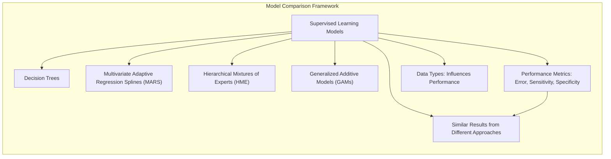
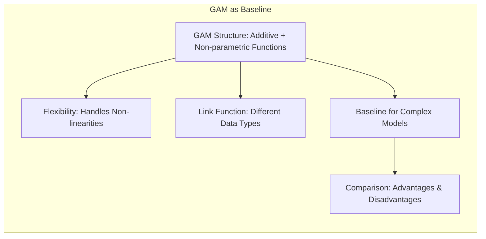
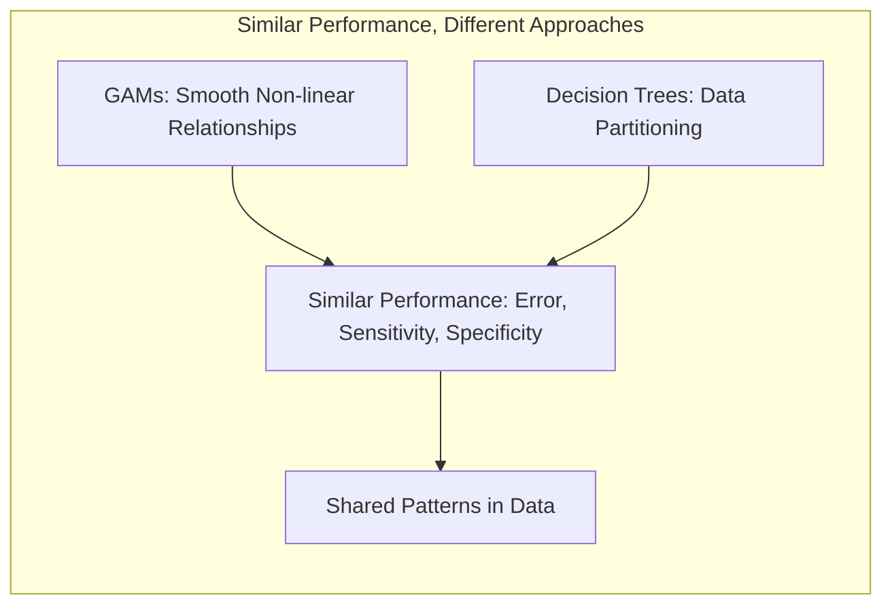
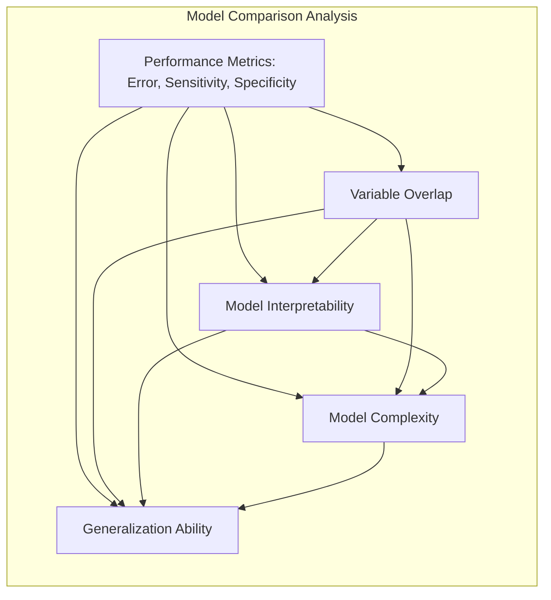
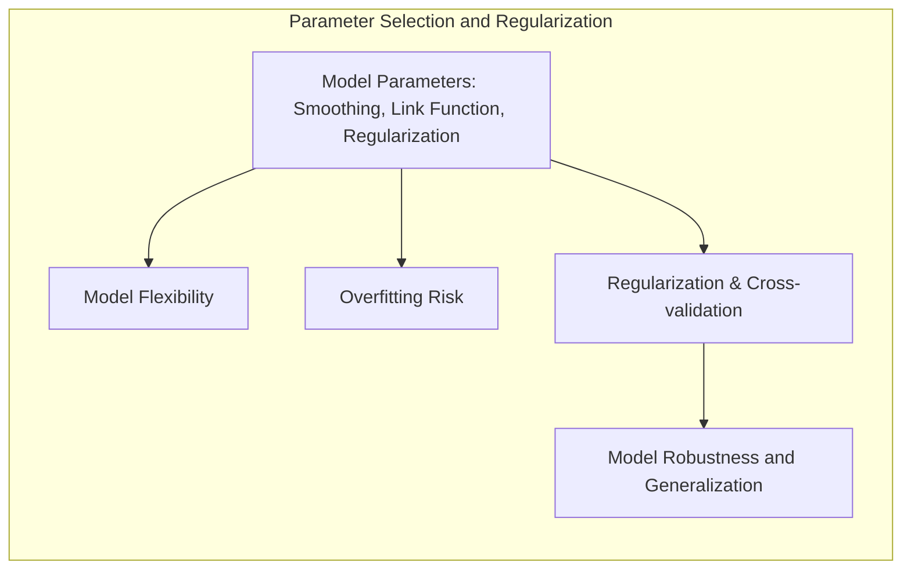
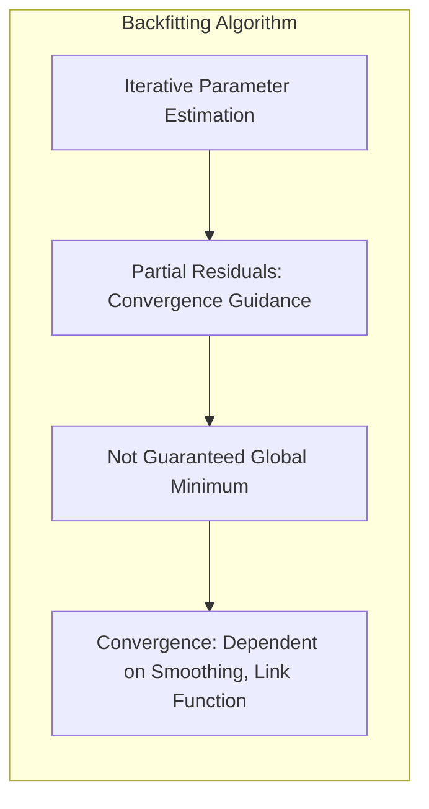
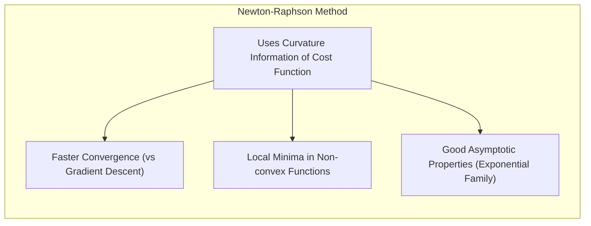
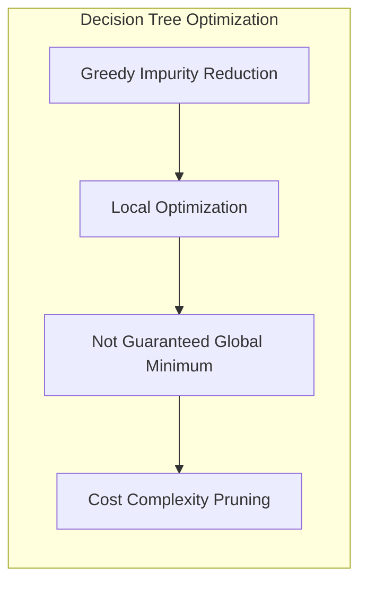

## Título: Modelos Aditivos, Árvores e Métodos Relacionados: Análise Comparativa do Desempenho de Modelos e Similaridade com GAMs

### Introdução

Este capítulo apresenta uma análise comparativa do desempenho de diferentes modelos de aprendizado supervisionado, com foco na sua similaridade em relação aos Modelos Aditivos Generalizados (GAMs), e como diferentes abordagens, como árvores de decisão, Multivariate Adaptive Regression Splines (MARS) e misturas hierárquicas de especialistas (HME), podem apresentar resultados similares em um mesmo problema de modelagem [^9.1]. Apesar de diferenças em sua estrutura, métodos de otimização e forma de modelar as não linearidades, é possível que modelos diferentes apresentem desempenhos comparáveis em um mesmo conjunto de dados, o que pode levar a diferentes abordagens e interpretações dos resultados. O objetivo principal é explorar essas similaridades e contrastes, e detalhar as implicações na modelagem estatística. O foco principal é na análise do desempenho dos modelos e na capacidade de generalização, e como a escolha do modelo pode impactar a sua interpretabilidade.

### Conceitos Fundamentais

**Conceito 1: Similaridade no Desempenho de Modelos Diferentes**

Em problemas reais de modelagem estatística, é comum que modelos com abordagens diferentes apresentem resultados de desempenho similares. Modelos com diferentes estruturas e métodos de otimização podem chegar a soluções similares, o que significa que diferentes abordagens podem ser utilizadas para modelar o mesmo problema. Modelos mais complexos podem apresentar resultados superiores em dados de treino, mas, a sua capacidade de generalização pode ser similar a modelos mais simples, o que é um componente importante no processo de escolha do modelo. A análise do desempenho de diferentes abordagens é crucial para a construção de modelos estatísticos, e a escolha do melhor modelo é um compromisso entre desempenho, interpretabilidade e complexidade.

> 💡 **Exemplo Numérico:**
>
> Imagine que estamos modelando a probabilidade de um cliente comprar um produto com base em duas variáveis: idade (X1) e renda (X2). Usamos dois modelos: um GAM e uma árvore de decisão.
>
> **GAM:** O modelo GAM pode modelar a probabilidade de compra como:
>
> $logit(P(compra)) = \alpha + f_1(X_1) + f_2(X_2)$
>
> Onde $f_1(X_1)$ é uma função suave da idade, e $f_2(X_2)$ é uma função suave da renda. Após o ajuste, o modelo pode resultar em:
>
> $logit(P(compra)) = -3 + 0.05 * X_1 - 0.00002 * X_1^2  + 0.0001 * X_2 - 0.00000001* X_2^2$
>
> **Árvore de Decisão:** A árvore de decisão pode criar regras como:
>   - Se idade < 30 e renda < 5000, então P(compra) = 0.1
>   - Se idade >= 30 e renda < 5000, então P(compra) = 0.3
>   - Se idade < 30 e renda >= 5000, então P(compra) = 0.5
>   - Se idade >= 30 e renda >= 5000, então P(compra) = 0.8
>
> Suponha que, após treinar ambos os modelos em um conjunto de dados, ambos alcancem uma acurácia de 82% em um conjunto de teste. Apesar de suas abordagens distintas, ambos os modelos conseguem predizer a probabilidade de compra com desempenho similar. O GAM modela as relações como funções suaves, enquanto a árvore de decisão usa regras de partição, o que sugere que a relação entre idade, renda e probabilidade de compra pode ser capturada de diferentes formas.

**Lemma 1:** *Modelos com abordagens de modelagem diferentes podem apresentar desempenhos similares, medidos através do erro de classificação, ou outras métricas. A sobreposição de desempenho entre diferentes modelos sugere que as escolhas de modelagem não são únicas, e que existe um conjunto de modelos que pode ser utilizado para um mesmo problema*. A escolha do modelo deve considerar todos os fatores relevantes e não se basear apenas em uma métrica de desempenho [^4.5].

**Conceito 2: Modelos Aditivos Generalizados (GAMs) como *Baseline***

Modelos Aditivos Generalizados (GAMs) podem ser considerados um *baseline* para a comparação com outros modelos. Os GAMs utilizam uma estrutura aditiva e funções não paramétricas que permitem a modelagem de não linearidades, e também utilizam uma função de ligação para diferentes tipos de dados. A estrutura aditiva e a escolha de funções não paramétricas torna os GAMs um método flexível e adequado para a modelagem de diferentes tipos de dados, e por isso ele é utilizado como um ponto de comparação com outros métodos mais complexos. A comparação de modelos complexos com um modelo mais simples, como o GAM, pode identificar vantagens e desvantagens das abordagens mais flexíveis.

> 💡 **Exemplo Numérico:**
>
> Considere a modelagem da relação entre a concentração de um poluente (Y) e duas variáveis preditoras: temperatura (X1) e umidade (X2).
>
> **GAM:** Um modelo GAM pode ser formulado como:
>
> $Y = \alpha + f_1(X_1) + f_2(X_2) + \epsilon$
>
> Onde $f_1(X_1)$ e $f_2(X_2)$ são funções não paramétricas. Após ajuste, o modelo pode resultar em:
>
> $Y = 10 + 0.5 * X_1 - 0.01 * X_1^2 + 0.2 * X_2 + \epsilon$
>
> Aqui, $f_1(X_1)$ captura uma relação não linear entre temperatura e poluição (com um efeito quadrático), e $f_2(X_2)$ indica um efeito linear da umidade.
>
> Se um modelo mais complexo, como uma rede neural, apresentar um desempenho similar ao GAM (por exemplo, com um erro quadrático médio de 2.5 em um conjunto de teste), o GAM serviria como um *baseline* indicando que a complexidade adicional da rede neural não trouxe melhorias significativas em termos de desempenho. O GAM fornece uma interpretação mais clara da relação entre as variáveis, mostrando a influência de cada preditor em Y.

**Corolário 1:** *Modelos GAMs servem como *baseline* para comparação com modelos mais complexos, e a sua utilização oferece uma forma de verificar a contribuição de interações e outros efeitos não aditivos na modelagem dos dados. O GAM, por ser um modelo versátil, permite comparações justas com outras abordagens, como árvores de decisão, MARS e HME* [^4.5.1].

**Conceito 3: Similaridade de Resultados em Diferentes Modelos**

Em certos problemas, modelos com abordagens muito distintas, como GAMs e árvores de decisão, podem apresentar desempenho similares em termos de erro de classificação, sensibilidade e especificidade. A similaridade nos resultados indica que os modelos capturam os mesmos padrões nos dados, mesmo que as suas abordagens sejam diferentes. Por exemplo, modelos GAMs podem modelar as relações não lineares com funções mais suaves, enquanto que árvores de decisão particionam os dados em regiões distintas. A análise comparativa entre modelos é importante para identificar as similaridades e as diferenças entre as abordagens e para compreender a natureza do problema. A escolha do melhor modelo deve considerar a complexidade do modelo, a sua capacidade de modelagem, a sua interpretabilidade, e também a capacidade de generalização.

> 💡 **Exemplo Numérico:**
>
> Suponha que estamos modelando a probabilidade de um paciente desenvolver uma certa doença (Y) com base em duas variáveis: idade (X1) e nível de colesterol (X2).
>
> **GAM:** O GAM pode modelar a probabilidade usando uma função logística:
>
> $logit(P(Y=1)) = \alpha + f_1(X_1) + f_2(X_2)$
>
> **Árvore de Decisão:** A árvore de decisão pode criar regras como:
>
> - Se idade < 50 e colesterol < 200, então P(Y=1) = 0.1
> - Se idade >= 50 e colesterol < 200, então P(Y=1) = 0.3
> - Se idade < 50 e colesterol >= 200, então P(Y=1) = 0.6
> - Se idade >= 50 e colesterol >= 200, então P(Y=1) = 0.8
>
> Se ambos os modelos apresentarem uma acurácia de 85% em um conjunto de teste, isso sugere que ambos os modelos capturam os padrões nos dados, apesar da modelagem diferente. O GAM usa funções suaves, enquanto a árvore de decisão usa partições, mas, em ambos os casos, o desempenho preditivo é similar.

> ⚠️ **Nota Importante:** A similaridade no desempenho entre modelos diferentes sugere que existe um conjunto de abordagens que pode ser utilizada para resolver um mesmo problema de modelagem. A escolha do melhor modelo não se baseia apenas no desempenho, mas também em outras métricas importantes para o problema e na sua capacidade de generalização [^4.5].

> ❗ **Ponto de Atenção:** Modelos com diferentes abordagens podem apresentar desempenho similares no treinamento e nos conjuntos de dados de teste, e a escolha do modelo mais apropriado depende também de outros critérios como a interpretabilidade e a estabilidade do modelo. É importante analisar outros aspectos do modelo e não apenas a sua métrica de desempenho no conjunto de teste [^4.5.2].

> ✔️ **Destaque:** A comparação do desempenho entre modelos diferentes permite identificar abordagens similares para a modelagem de um dado problema, mesmo que eles utilizem algoritmos e estruturas muito diferentes, e que existem diferentes formas de obter modelos com bom desempenho preditivo e boa capacidade de generalização [^4.5].

### Análise Comparativa entre Modelos: Métricas de Desempenho, Variáveis Selecionadas e Interpretabilidade

A comparação de modelos estatísticos exige uma avaliação rigorosa e uma análise cuidadosa dos resultados. A análise comparativa entre diferentes modelos deve incluir:
1.  **Métricas de Desempenho:** Comparar as métricas de desempenho, como o erro de classificação, a sensibilidade e a especificidade, para diferentes modelos. A análise das métricas de desempenho permite avaliar o poder preditivo de cada modelo e como eles lidam com diferentes tipos de erros. Modelos com valores similares de métricas de desempenho podem ter resultados similares em dados de teste, mesmo que suas abordagens sejam diferentes. A análise do *trade-off* entre sensibilidade e especificidade também é importante.

    > 💡 **Exemplo Numérico:**
    >
    > Considere um problema de classificação binária (Y = 0 ou 1) com três modelos: GAM, árvore de decisão e MARS. As métricas de desempenho obtidas em um conjunto de teste são:
    >
    > | Modelo          | Acurácia | Sensibilidade | Especificidade |
    > |-----------------|----------|---------------|----------------|
    > | GAM             | 0.82     | 0.80          | 0.84           |
    > | Árvore de Decisão | 0.81     | 0.79          | 0.83           |
    > | MARS            | 0.83     | 0.81          | 0.85           |
    >
    > Neste caso, todos os modelos têm um desempenho similar em termos de acurácia. No entanto, MARS tem uma ligeira vantagem em sensibilidade e especificidade. A escolha entre os modelos pode depender do problema específico, da importância relativa de falsos positivos e falsos negativos.

2.  **Sobreposição das Variáveis Selecionadas:** Analisar a sobreposição de variáveis selecionadas por cada modelo, e como diferentes modelos selecionam um subconjunto de preditores com base no impacto da função de custo ou métrica de impureza, e como as variáveis são ponderadas em cada modelo. A similaridade dos preditores importantes para cada modelo demonstra a importância dessas variáveis na predição da variável resposta.

    > 💡 **Exemplo Numérico:**
    >
    > Suponha que estamos modelando o preço de casas com base em várias variáveis, e três modelos (GAM, Árvore de Decisão, e MARS) são comparados.
    >
    > **GAM:**  O GAM pode identificar que as variáveis mais importantes são o tamanho da casa (X1), número de quartos (X2) e localização (X3), com coeficientes estimados que indicam a influência de cada variável.
    >
    > **Árvore de Decisão:** A árvore de decisão pode usar as mesmas variáveis (X1, X2, X3) para construir as partições, o que indica que essas variáveis são importantes para a predição do preço.
    >
    > **MARS:** Similarmente, o MARS pode identificar X1, X2 e X3 como as variáveis mais importantes, criando funções lineares por partes dessas variáveis.
    >
    > A sobreposição das variáveis selecionadas sugere que essas variáveis são os preditores mais importantes para o problema, e são identificadas por diferentes métodos de modelagem.

3.  **Interpretabilidade dos Modelos:** Avaliar a interpretabilidade de cada modelo. Árvores de decisão geralmente são mais interpretáveis que modelos aditivos, MARS ou HME, e a interpretabilidade do modelo é importante para entender como o modelo funciona e para extrair *insights* sobre o problema. A interpretabilidade de cada modelo depende da forma como as relações são modeladas e como os parâmetros são utilizados.

    > 💡 **Exemplo Numérico:**
    >
    > Uma árvore de decisão pode gerar regras como:
    >
    > - Se idade < 40 e renda < 6000, então risco = baixo
    > - Se idade >= 40 e renda < 6000, então risco = médio
    > - Se idade < 40 e renda >= 6000, então risco = médio
    > - Se idade >= 40 e renda >= 6000, então risco = alto
    >
    > Estas regras são fáceis de entender, e o modelo é interpretável. Em contraste, um GAM pode gerar funções mais complexas, como:
    >
    > $logit(P(risco)) = -2 + 0.01 * idade - 0.0001 * idade^2 + 0.0002 * renda - 0.00000002 * renda^2$
    >
    > Embora o GAM possa ter melhor desempenho, a interpretação dos coeficientes é menos intuitiva que as regras da árvore de decisão.

4. **Complexidade dos Modelos:** Avaliar a complexidade de cada modelo, que influencia o risco de *overfitting* e a sua capacidade de generalização. Modelos muito complexos podem se ajustar perfeitamente aos dados de treinamento, mas podem ter dificuldade de prever corretamente em dados não utilizados no treino, enquanto que modelos menos flexíveis podem não ter capacidade de capturar padrões relevantes nos dados.

    > 💡 **Exemplo Numérico:**
    >
    > Um modelo GAM com muitos *splines* pode se ajustar muito bem ao conjunto de treinamento, capturando até o ruído presente nos dados. No entanto, em um conjunto de teste, o seu desempenho pode ser pior do que um GAM com menos *splines* ou uma árvore de decisão com menos profundidade.
    >
    > Da mesma forma, uma árvore de decisão com muitas divisões pode se ajustar perfeitamente aos dados de treino, mas pode ter um desempenho ruim em novos dados. A complexidade do modelo influencia o seu risco de *overfitting*.

5.  **Capacidade de Generalização:** A avaliação da capacidade de generalização é feita utilizando validação cruzada para estimar o desempenho do modelo em dados não vistos. Um bom modelo deve ter um bom desempenho em dados de treino e também em dados novos, ou seja, apresentar baixa variância e *bias*. A capacidade de generalização é o objetivo principal de um modelo preditivo.

    > 💡 **Exemplo Numérico:**
    >
    > Em um problema de regressão, o erro quadrático médio (MSE) de um modelo em um conjunto de treino é de 1.5, enquanto que o MSE em um conjunto de validação cruzada é de 2.8. Isso indica que o modelo tem uma dificuldade em generalizar para dados não vistos.
    >
    > Um outro modelo, com MSE de 2.0 no conjunto de treino e 2.3 na validação cruzada, tem uma melhor capacidade de generalização, embora o seu desempenho no conjunto de treino seja ligeiramente pior.

A análise conjunta dessas propriedades permite escolher o modelo mais apropriado para cada problema, considerando os objetivos da modelagem e a necessidade de um bom desempenho preditivo, alta interpretabilidade e generalização.

**Lemma 4:** *A comparação entre diferentes modelos deve considerar as métricas de desempenho, a sobreposição das variáveis selecionadas e a interpretabilidade, e a escolha do modelo deve ser feita baseada no balanço entre a capacidade de modelagem, o seu desempenho e a sua facilidade de interpretação. Modelos com resultados similares podem ter abordagens de modelagem muito diferentes e isso deve ser levado em consideração durante a escolha do modelo* [^4.5].

### Interpretação da Similaridade de Desempenho e Limitações de Cada Modelo

A similaridade no desempenho de diferentes modelos, como GAMs e árvores de decisão, pode surgir por diferentes motivos. Em alguns casos, a relação entre preditores e resposta pode ser aproximadamente linear ou aditiva, de modo que modelos mais simples podem capturar os padrões nos dados de forma tão eficiente quanto modelos mais complexos, e o desempenho é similar, mesmo com modelagem diferente. Além disso, os dados podem ter alta separabilidade, o que facilita o processo de classificação mesmo quando os modelos são diferentes. A presença de ruído e outras propriedades dos dados também afetam o resultado final da modelagem, e modelos similares podem ter um desempenho parecido em dados com ruído. Em geral, modelos diferentes podem apresentar desempenho similar em uma aplicação específica, mas a escolha do modelo deve considerar outros aspectos além do seu desempenho.

A escolha entre as diferentes abordagens de modelagem deve considerar as suas limitações. Árvores de decisão são limitadas pela modelagem de relações suaves e interações, e podem gerar modelos com baixa estabilidade. GAMs podem ser difíceis de interpretar quando há muitos preditores. MARS e HME, embora flexíveis, podem levar a modelos complexos e com uma baixa interpretabilidade. O conhecimento sobre as limitações de cada modelo é crucial para que a sua utilização seja feita de forma apropriada.

### O Papel da Regularização, da Seleção de Variáveis, e dos Parâmetros de Modelagem na Busca por Modelos Robustos

A escolha dos parâmetros dos modelos, incluindo a escolha dos parâmetros de regularização, do suavizador, da função de ligação, e outros, influência a capacidade do modelo e seu desempenho. Modelos com muitos parâmetros têm maior flexibilidade e podem se ajustar muito bem aos dados de treino, mas podem ter um desempenho ruim em dados não vistos (overfitting). A utilização de técnicas de regularização e validação cruzada permite escolher modelos que equilibrem o ajuste aos dados e a sua capacidade de generalização. A escolha de modelos e métodos apropriados deve considerar o objetivo da modelagem e as propriedades dos dados.

> 💡 **Exemplo Numérico:**
>
> Em um modelo GAM, a escolha do parâmetro de suavização (λ) influencia a flexibilidade das funções não paramétricas. Um valor de λ muito pequeno permite que o modelo se ajuste muito bem aos dados de treino, mas pode levar a *overfitting*. Um valor de λ muito grande pode levar a *underfitting*, e o modelo pode não capturar os padrões nos dados.
>
> A escolha do λ correto, através de validação cruzada, é crucial para obter um modelo robusto e com boa capacidade de generalização. Da mesma forma, a escolha da profundidade máxima de uma árvore de decisão ou do número de funções base em MARS afeta o seu desempenho.

### Perguntas Teóricas Avançadas: Como a escolha de diferentes abordagens de otimização, como backfitting e Newton-Raphson, afeta a capacidade de modelos aditivos e árvores de decisão alcançarem um desempenho similar e quais são as implicações para as propriedades estatísticas das estimativas?

**Resposta:**

A escolha de diferentes abordagens de otimização, como backfitting e Newton-Raphson, afeta a capacidade de modelos aditivos e árvores de decisão alcançarem um desempenho similar, e também influencia as propriedades estatísticas das estimativas, e a sua convergência.

O algoritmo de backfitting, utilizado para estimar os parâmetros em Modelos Aditivos Generalizados (GAMs), é um método iterativo que estima as funções não paramétricas através de sucessivas aproximações, e utiliza a ideia dos resíduos parciais para guiar a convergência para o mínimo da função de custo. O algoritmo de backfitting, no entanto, não garante a convergência para o mínimo global, especialmente quando o número de preditores é elevado ou há multicolinearidade, e a sua convergência depende da escolha do suavizador, da função de ligação e de outros parâmetros.

> 💡 **Exemplo Numérico:**
>
> Considere um GAM com dois preditores, $X_1$ e $X_2$. O algoritmo de backfitting começa com aproximações iniciais para $f_1(X_1)$ e $f_2(X_2)$.
>
> 1.  **Iteração 1:** Mantendo $f_2(X_2)$ fixo, o algoritmo ajusta $f_1(X_1)$ usando um suavizador (como um *spline*).
>
> 2.  **Iteração 2:** Mantendo $f_1(X_1)$ fixo, o algoritmo ajusta $f_2(X_2)$ usando um suavizador.
>
> 3.  As iterações continuam até que as funções $f_1$ e $f_2$ convirjam.
>
> Este processo iterativo, embora eficiente, não garante que a solução seja o mínimo global da função de custo.

O método de Newton-Raphson, utilizado em alguns modelos lineares e também em GAMs com uma aproximação da matriz de informação de Fisher, utiliza a informação da curvatura da função de custo para convergir para um mínimo ou máximo local. O Newton-Raphson tem uma convergência mais rápida que o gradiente descendente, e, em geral, tem um desempenho superior em funções convexas, mas também pode ficar preso em mínimos locais em funções não convexas. Em modelos da família exponencial com função de ligação canônica, o método de Newton-Raphson possui boas propriedades assintóticas.

> 💡 **Exemplo Numérico:**
>
> Para um modelo de regressão logística, a função de custo é a log-verossimilhança, que pode ser otimizada usando o método de Newton-Raphson. Este método utiliza a primeira e a segunda derivada da função de custo para encontrar um mínimo local.
>
> O método de Newton-Raphson itera usando a seguinte atualização para os parâmetros $\beta$:
>
> $\beta_{t+1} = \beta_t - H(\beta_t)^{-1} \nabla L(\beta_t)$
>
> Onde $H(\beta_t)$ é a matriz Hessiana (segunda derivada) e $\nabla L(\beta_t)$ é o gradiente (primeira derivada) da log-verossimilhança. A cada iteração, os parâmetros são atualizados até convergirem para um mínimo.

Árvores de decisão utilizam um processo de otimização gulosa que busca reduzir a impureza localmente, e escolhem a partição que mais reduz a impureza do nó. O algoritmo guloso não garante a convergência para o mínimo global da função de custo, e os resultados podem variar dependendo da escolha do preditor e do ponto de corte a cada nó. A poda por complexidade de custo é utilizada para evitar o overfitting e para simplificar o modelo, mas a abordagem da construção da árvore, por si só, não garante a unicidade da solução.

> 💡 **Exemplo Numérico:**
>
> Na construção de uma árvore de decisão, em cada nó, o algoritmo avalia todos os preditores e todos os possíveis pontos de corte, escolhendo o que mais reduz a impureza (por exemplo, usando o índice de Gini). Essa escolha é feita localmente, e não globalmente.
>
> Por exemplo, se um nó tiver várias opções de divisão, o algoritmo escolherá a que resulta na maior redução da impureza naquele nó, sem considerar as consequências em nós posteriores. Isso pode levar a uma solução sub-ótima.

As diferentes abordagens de otimização levam a modelos que podem apresentar um desempenho similar, desde que as abordagens sejam combinadas com técnicas de regularização e validação cruzada. A escolha do algoritmo de otimização depende da forma da função de custo, da complexidade do modelo e das propriedades desejadas para os estimadores, como a sua consistência, eficiência, e a sua distribuição assintótica.

**Lemma 5:** *A escolha dos métodos de otimização, como backfitting e Newton-Raphson, influencia a forma como os modelos são ajustados e como as estimativas dos parâmetros são obtidas. Os algoritmos de otimização, utilizados em modelos como GAMs e árvores de decisão, buscam minimizar a função de custo e a escolha do método deve considerar as propriedades dos modelos e a capacidade de convergência de cada método*. O método de otimização, portanto, é uma parte importante no processo de modelagem [^4.4.3].

**Corolário 5:** *A combinação de modelos com diferentes abordagens para a modelagem da não linearidade com algoritmos de otimização apropriados resulta em modelos com capacidade de aproximar funções complexas, e com um desempenho que pode ser similar em muitos casos, e a escolha dos modelos depende do balanço entre a complexidade, a interpretabilidade e a capacidade de generalização*. A escolha dos métodos de otimização é crucial para obter modelos robustos e com um bom desempenho [^4.4.2].

> ⚠️ **Ponto Crucial**: A escolha do método de otimização afeta a convergência do modelo, e a sua relação com a função de custo e com o modelo é fundamental para o seu desempenho. A utilização do método de Newton-Raphson em modelos da família exponencial, em conjunto com funções de ligação canónicas, garante que o processo de otimização seja eficiente, e que as estimativas tenham boas propriedades. A escolha do método de otimização deve ser baseada nas propriedades matemáticas do modelo e na necessidade de garantir a convergência do algoritmo [^4.4.1].

### Conclusão

Este capítulo apresentou uma análise comparativa do desempenho de modelos de aprendizado supervisionado, mostrando que modelos com diferentes estruturas, como GAMs e árvores de decisão, podem apresentar desempenho similar. A discussão destacou a importância da escolha do modelo, dos métodos de otimização, das métricas de desempenho e da necessidade de considerar o balanço entre flexibilidade, interpretabilidade e capacidade de generalização. A compreensão das características e limitações de cada abordagem é fundamental para a construção de modelos estatísticos robustos e adequados a diferentes tipos de problemas.

### Footnotes

[^4.1]: "In this chapter we begin our discussion of some specific methods for super-vised learning. These techniques each assume a (different) structured form for the unknown regression function, and by doing so they finesse the curse of dimensionality. Of course, they pay the possible price of misspecifying the model, and so in each case there is a tradeoff that has to be made." *(Trecho de "Additive Models, Trees, and Related Methods")*

[^4.2]: "Regression models play an important role in many data analyses, providing prediction and classification rules, and data analytic tools for understand-ing the importance of different inputs." *(Trecho de "Additive Models, Trees, and Related Methods")*

[^4.3]: "In this section we describe a modular algorithm for fitting additive models and their generalizations. The building block is the scatterplot smoother for fitting nonlinear effects in a flexible way. For concreteness we use as our scatterplot smoother the cubic smoothing spline described in Chapter 5." *(Trecho de "Additive Models, Trees, and Related Methods")*

[^4.3.1]:  "The additive model has the form $Y = \alpha + \sum_{j=1}^p f_j(X_j) + \epsilon$, where the error term $\epsilon$ has mean zero." * (Trecho de "Additive Models, Trees, and Related Methods")*

[^4.3.2]:   "Given observations $x_i$, $y_i$, a criterion like the penalized sum of squares (5.9) of Section 5.4 can be specified for this problem, $PRSS(\alpha, f_1, f_2,..., f_p) = \sum_i^N (y_i - \alpha - \sum_j^p f_j(x_{ij}))^2 + \sum_j^p \lambda_j \int(f_j''(t_j))^2 dt_j$" * (Trecho de "Additive Models, Trees, and Related Methods")*

[^4.3.3]: "where the $\lambda_j > 0$ are tuning parameters. It can be shown that the minimizer of (9.7) is an additive cubic spline model; each of the functions $f_j$ is a cubic spline in the component $X_j$, with knots at each of the unique values of $x_{ij}$, $i = 1,..., N$." *(Trecho de "Additive Models, Trees, and Related Methods")*

[^4.4]: "For two-class classification, recall the logistic regression model for binary data discussed in Section 4.4. We relate the mean of the binary response $\mu(X) = Pr(Y = 1|X)$ to the predictors via a linear regression model and the logit link function:  $log(\mu(X)/(1 – \mu(X)) = \alpha + \beta_1 X_1 + \ldots + \beta_pX_p$." * (Trecho de "Additive Models, Trees, and Related Methods")*

[^4.4.1]: "The additive logistic regression model replaces each linear term by a more general functional form: $log(\mu(X)/(1 – \mu(X))) = \alpha + f_1(X_1) + \ldots + f_p(X_p)$, where again each $f_j$ is an unspecified smooth function." * (Trecho de "Additive Models, Trees, and Related Methods")*

[^4.4.2]: "While the non-parametric form for the functions $f_j$ makes the model more flexible, the additivity is retained and allows us to interpret the model in much the same way as before. The additive logistic regression model is an example of a generalized additive model." *(Trecho de "Additive Models, Trees, and Related Methods")*

[^4.4.3]: "In general, the conditional mean $\mu(X)$ of a response Y is related to an additive function of the predictors via a link function g:  $g[\mu(X)] = \alpha + f_1(X_1) + \ldots + f_p(X_p)$." *(Trecho de "Additive Models, Trees, and Related Methods")*

[^4.4.4]:  "Examples of classical link functions are the following: $g(\mu) = \mu$ is the identity link, used for linear and additive models for Gaussian response data." *(Trecho de "Additive Models, Trees, and Related Methods")*

[^4.4.5]: "$g(\mu) = logit(\mu)$ as above, or $g(\mu) = probit(\mu)$, the probit link function, for modeling binomial probabilities. The probit function is the inverse Gaussian cumulative distribution function: $probit(\mu) = \Phi^{-1}(\mu)$." *(Trecho de "Additive Models, Trees, and Related Methods")*

[^4.5]: "All three of these arise from exponential family sampling models, which in addition include the gamma and negative-binomial distributions. These families generate the well-known class of generalized linear models, which are all extended in the same way to generalized additive models." *(Trecho de "Additive Models, Trees, and Related Methods")*

[^4.5.1]: "The functions $f_j$ are estimated in a flexible manner, using an algorithm whose basic building block is a scatterplot smoother. The estimated func-tion $f_j$ can then reveal possible nonlinearities in the effect of $X_j$. Not all of the functions $f