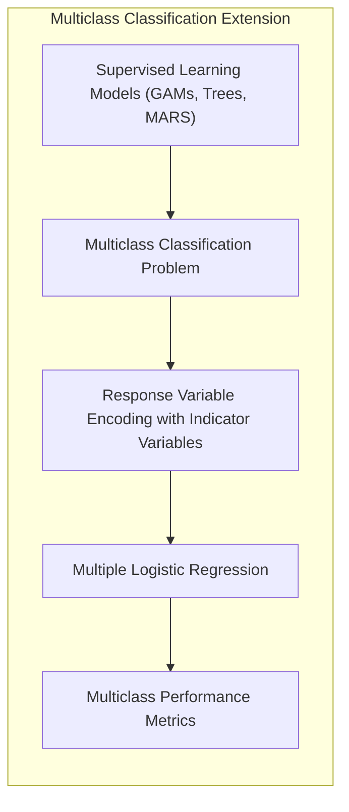
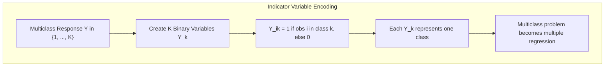
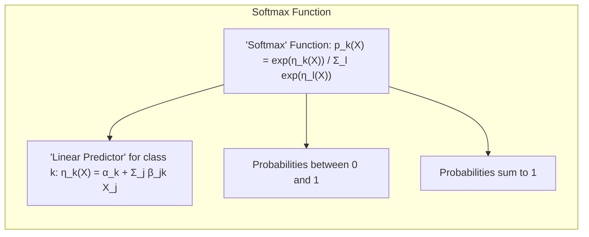
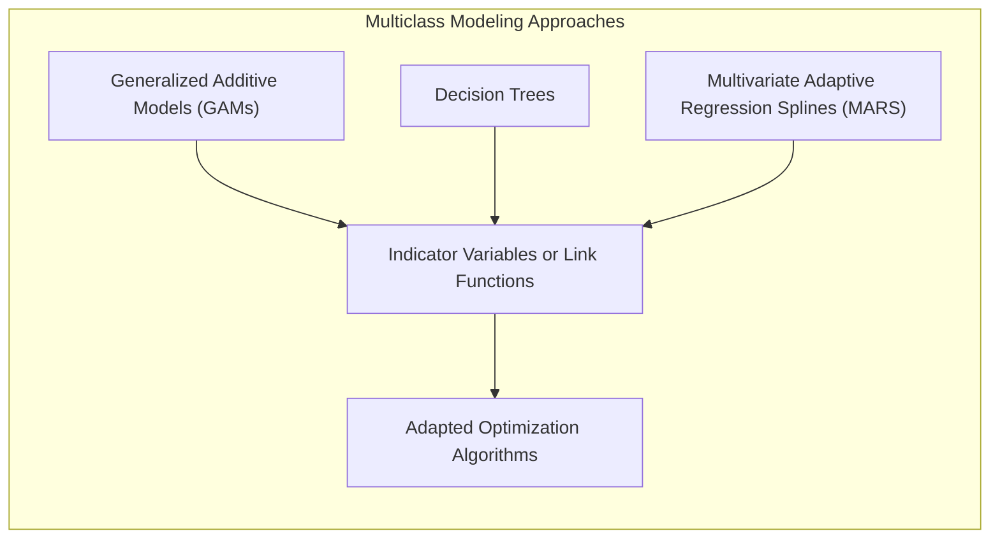
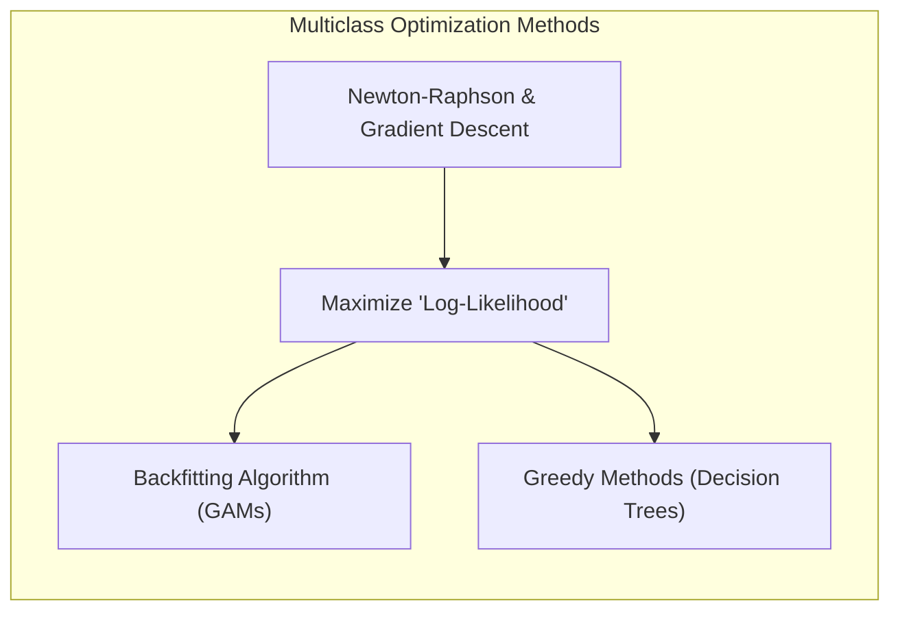
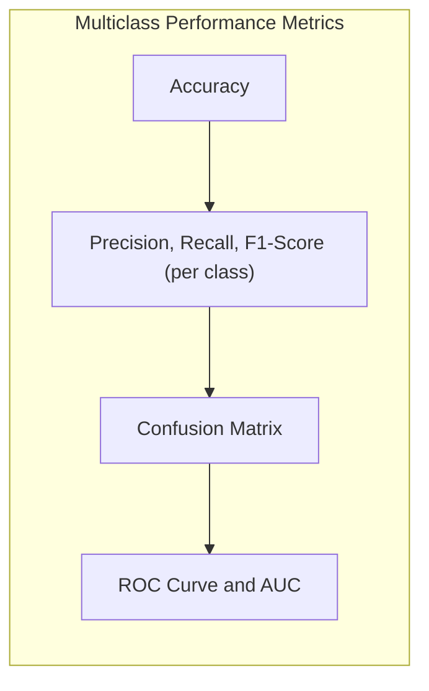
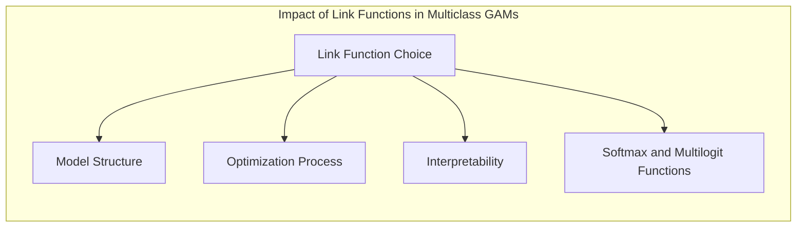

```markdown
## Título: Modelos Aditivos, Árvores e Métodos Relacionados: Extensão para Classificação Multiclasse com Variáveis Indicadoras e Regressão Logística Múltipla



### Introdução

Este capítulo explora a extensão de modelos de aprendizado supervisionado para problemas de classificação multiclasse, com foco na utilização de variáveis indicadoras para codificar a variável resposta e como a regressão logística múltipla pode ser utilizada no contexto de Modelos Aditivos Generalizados (GAMs), árvores de decisão e Multivariate Adaptive Regression Splines (MARS) [^9.1]. A modelagem de respostas multiclasse é um desafio na área de classificação, pois envolve a estimação de probabilidades para cada classe possível, e a utilização de abordagens apropriadas é fundamental para a construção de modelos precisos e confiáveis. O objetivo principal deste capítulo é detalhar como a codificação com variáveis indicadoras, a regressão logística múltipla e outros métodos de estimação são utilizados para a modelagem multiclasse, como as métricas de desempenho são avaliadas, e como as diferentes abordagens se relacionam.

### Conceitos Fundamentais

**Conceito 1: O Problema de Classificação Multiclasse**

Em problemas de classificação multiclasse, a variável resposta $Y$ assume valores em um conjunto de $K$ classes, ou seja, $Y \in \{1, 2, \ldots, K\}$. O objetivo da modelagem é estimar a probabilidade de cada observação pertencer a cada uma das $K$ classes. Modelos de classificação binária, que lidam apenas com duas classes, precisam de abordagens alternativas para a modelagem de respostas com múltiplas classes. A utilização de abordagens específicas para lidar com a natureza multiclasse é importante para a construção de modelos adequados a cada problema.

**Lemma 1:** *O problema de classificação multiclasse exige a modelagem das probabilidades para cada uma das K classes. A escolha do modelo deve levar em consideração a necessidade de modelar relações complexas entre os preditores e as múltiplas classes*. A utilização de uma abordagem apropriada para lidar com a natureza multiclasse é um componente fundamental da modelagem [^4.5].

> 💡 **Exemplo Numérico:**
> Imagine um problema de classificação de tipos de flores em um conjunto de dados com 3 classes: 'Setosa', 'Versicolor' e 'Virginica'. Aqui, $K=3$. O objetivo é construir um modelo que, dada as características de uma flor (comprimento e largura da sépala, comprimento e largura da pétala), possa prever a qual dessas três classes a flor pertence. O modelo deve fornecer a probabilidade de cada flor pertencer a cada uma das três classes, por exemplo, uma flor pode ter 80% de chance de ser 'Setosa', 15% de ser 'Versicolor' e 5% de ser 'Virginica'.

**Conceito 2: Variáveis Indicadoras para Respostas Multiclasse**

Uma abordagem comum para modelar respostas multiclasse é a utilização de variáveis indicadoras. Para um problema com $K$ classes, são criadas $K$ variáveis binárias $Y_k$, onde $Y_{ik} = 1$ se a observação $i$ pertence à classe $k$ e $Y_{ik} = 0$ caso contrário. Cada variável indicadora representa uma classe e o modelo busca estimar as probabilidades de cada classe, de modo que a classificação final é dada pela classe com maior probabilidade, ou utilizando alguma outra abordagem específica de cada modelo. A utilização de variáveis indicadoras permite transformar um problema de classificação multiclasse em um problema de regressão múltipla. A codificação de variáveis indicadoras é um componente essencial para a aplicação de modelos de classificação em dados com múltiplas classes.



**Corolário 1:** *A utilização de variáveis indicadoras permite a modelagem de respostas multiclasse como um problema de regressão múltipla. A cada classe é atribuída uma variável binária e as probabilidades de cada classe são modeladas em relação aos preditores*. A codificação da variável resposta em múltiplas variáveis binárias é uma forma de modelar dados multiclasse utilizando métodos de regressão [^4.2].

> 💡 **Exemplo Numérico:**
> Usando o exemplo das flores, onde temos $K=3$ classes ('Setosa', 'Versicolor', 'Virginica'), criamos três variáveis indicadoras: $Y_1$ (Setosa), $Y_2$ (Versicolor) e $Y_3$ (Virginica). Se a observação $i$ for uma flor 'Versicolor', então $Y_{i1} = 0$, $Y_{i2} = 1$ e $Y_{i3} = 0$. Se a observação $j$ for uma flor 'Setosa', então $Y_{j1} = 1$, $Y_{j2} = 0$ e $Y_{j3} = 0$. Desta forma, transformamos a variável resposta categórica em um conjunto de variáveis numéricas binárias.

**Conceito 3: Regressão Logística Múltipla e a Função *Softmax***

A regressão logística múltipla utiliza a função *softmax* para modelar a probabilidade de cada classe:

$$
p_k(X) = \frac{e^{\eta_k(X)}}{\sum_{l=1}^K e^{\eta_l(X)}}
$$
onde $\eta_k(X)$ é um *predictor* linear para cada classe $k$, dado por:
$$
\eta_k(X) = \alpha_k + \beta_{1k}X_1 + \beta_{2k}X_2 + \ldots + \beta_{pk}X_p
$$
onde $\alpha_k$ é o intercepto da classe $k$ e $\beta_{jk}$ são os coeficientes para a classe $k$. A função *softmax* garante que as probabilidades para cada classe estejam entre 0 e 1, e que a soma das probabilidades para todas as classes seja igual a 1, respeitando as propriedades de uma distribuição de probabilidade. A escolha da função *softmax* é importante na construção de modelos para problemas multiclasse, pois ela garante que as probabilidades sejam válidas e que a classificação seja feita de acordo com essas probabilidades.



> ⚠️ **Nota Importante:** A função *softmax* é utilizada em regressão logística múltipla para garantir que as probabilidades de cada classe sejam válidas e para que as probabilidades somem 1, o que permite que o modelo seja aplicado em problemas de classificação multiclasse. A função *softmax* estende a função *logit* para mais de duas classes [^4.4].

> ❗ **Ponto de Atenção:** A estimação dos parâmetros em modelos de regressão logística múltipla requer algoritmos de otimização que maximizam a *log-likelihood* ou minimizam uma função de custo apropriada. Métodos como o gradiente descendente e Newton-Raphson podem ser utilizados, mas o processo de otimização é mais complexo do que em regressão logística binária [^4.4.2].

> ✔️ **Destaque:** A função *softmax* é uma extensão da função *logit* para problemas multiclasse e a utilização de modelos logísticos e multinomials permite lidar com respostas categóricas com mais de duas classes [^4.4.3].

> 💡 **Exemplo Numérico:**
> Continuando com o exemplo das flores, vamos supor que temos duas características (preditores): $X_1$ (comprimento da pétala) e $X_2$ (largura da pétala). Para cada classe $k$, temos um predictor linear $\eta_k(X)$. Por exemplo, para a classe 'Setosa' ($k=1$), temos:
> $\eta_1(X) = \alpha_1 + \beta_{11}X_1 + \beta_{21}X_2$.
> Analogamente, para as classes 'Versicolor' ($k=2$) e 'Virginica' ($k=3$):
> $\eta_2(X) = \alpha_2 + \beta_{12}X_1 + \beta_{22}X_2$
> $\eta_3(X) = \alpha_3 + \beta_{13}X_1 + \beta_{23}X_2$.
>
>  Suponha que, após a estimação, os valores dos parâmetros sejam:
>   - $\alpha_1 = 1.0, \beta_{11} = 0.5, \beta_{21} = -0.2$
>   - $\alpha_2 = -0.5, \beta_{12} = 0.2, \beta_{22} = 0.8$
>   - $\alpha_3 = -0.8, \beta_{13} = 0.7, \beta_{23} = 0.5$
>
> Para uma flor com $X_1 = 5$ e $X_2 = 2$, temos:
> $\eta_1(X) = 1.0 + 0.5*5 - 0.2*2 = 3.1$
> $\eta_2(X) = -0.5 + 0.2*5 + 0.8*2 = 1.1$
> $\eta_3(X) = -0.8 + 0.7*5 + 0.5*2 = 3.7$
>
> Agora, usamos a função *softmax* para calcular as probabilidades:
> $p_1(X) = \frac{e^{3.1}}{e^{3.1} + e^{1.1} + e^{3.7}} \approx \frac{22.19}{22.19 + 3.00 + 40.45} \approx 0.33$
> $p_2(X) = \frac{e^{1.1}}{e^{3.1} + e^{1.1} + e^{3.7}} \approx \frac{3.00}{22.19 + 3.00 + 40.45} \approx 0.04$
> $p_3(X) = \frac{e^{3.7}}{e^{3.1} + e^{1.1} + e^{3.7}} \approx \frac{40.45}{22.19 + 3.00 + 40.45} \approx 0.63$
>
> Assim, a flor tem uma probabilidade de 33% de ser 'Setosa', 4% de ser 'Versicolor' e 63% de ser 'Virginica'. O modelo classificaria a flor como 'Virginica' por ter a maior probabilidade.

### Abordagens para Modelagem Multiclasse em GAMs, Árvores de Decisão e MARS



A modelagem de dados multiclasse em modelos de aprendizado supervisionado pode ser feita através de diferentes abordagens:

1.  **Modelos Aditivos Generalizados (GAMs):** Em modelos GAMs, o método da regressão logística múltipla com a função *softmax* é utilizado para modelar a probabilidade de cada classe, de modo que:
      $$
    p_k(X) = \frac{e^{\eta_k(X)}}{\sum_{l=1}^K e^{\eta_l(X)}}
    $$
        onde $\eta_k(X) = \alpha_k + f_{1k}(X_1) + \ldots + f_{pk}(X_p)$ é o *predictor* linear e as funções não paramétricas $f_{jk}(X_j)$ são estimadas através do algoritmo de backfitting. O uso da função *softmax* garante que as probabilidades sejam válidas e a utilização de funções não paramétricas permite modelar relações complexas entre os preditores e as classes. Em cada classe, parâmetros diferentes são estimados, incluindo as funções não paramétricas.

> 💡 **Exemplo Numérico:**
> Em um modelo GAM multiclasse para o exemplo das flores, o predictor linear para a classe 'Setosa' poderia ser:
> $\eta_1(X) = \alpha_1 + f_{11}(X_1) + f_{21}(X_2)$
> onde $f_{11}(X_1)$ e $f_{21}(X_2)$ são funções não-paramétricas (por exemplo, splines) do comprimento e largura da pétala, respectivamente. O algoritmo de backfitting é usado para estimar essas funções. As outras classes ('Versicolor' e 'Virginica') teriam seus próprios predictors lineares com funções não-paramétricas diferentes:
> $\eta_2(X) = \alpha_2 + f_{12}(X_1) + f_{22}(X_2)$
> $\eta_3(X) = \alpha_3 + f_{13}(X_1) + f_{23}(X_2)$
> Após o ajuste do modelo, podemos obter, por exemplo, que o comprimento da pétala tenha uma relação não-linear com a probabilidade da flor ser 'Setosa', enquanto a largura da pétala tem uma relação linear.

2.  **Árvores de Decisão:** Em árvores de decisão para problemas de classificação multiclasse, as divisões binárias são realizadas para separar as observações em grupos que sejam mais homogêneos em relação à classe. A métrica de impureza, como o índice de Gini ou a entropia, é generalizada para mais de duas classes, e a decisão de qual preditor e qual ponto de divisão é tomada com base na redução da impureza do nó. A árvore é construída de forma hierárquica até que as folhas tenham pureza suficiente. O uso de *surrogate splits* é importante para lidar com valores ausentes nos dados de treinamento.

> 💡 **Exemplo Numérico:**
> Imagine uma árvore de decisão sendo construída para classificar as flores. No primeiro nó, o algoritmo pode decidir dividir as observações com base no comprimento da pétala. Se o comprimento da pétala for menor que 2.5 cm, a observação é enviada para o nó esquerdo; caso contrário, para o nó direito. No nó esquerdo, a maioria das observações pode ser da classe 'Setosa', mas ainda podemos ter algumas 'Versicolor' e 'Virginica'. O algoritmo continua dividindo os nós até que as folhas sejam majoritariamente de uma única classe. A métrica de impureza, como o índice de Gini, é usada para avaliar a qualidade da divisão em cada nó.

3.  **Multivariate Adaptive Regression Splines (MARS):** Em modelos MARS, a modelagem multiclasse pode ser feita através de uma abordagem de "um contra todos", onde um modelo é treinado para cada classe, utilizando funções *spline* para modelar a relação entre os preditores e a probabilidade da classe. O processo *forward-backward* é utilizado para a escolha dos termos mais importantes para cada modelo e a classificação final pode ser feita com base no maior valor predito para as diversas classes.

> 💡 **Exemplo Numérico:**
> Em MARS para o problema de classificação das flores, um modelo seria treinado para cada classe ('Setosa', 'Versicolor' e 'Virginica'). Para a classe 'Setosa', o modelo MARS poderia usar funções *spline* para aproximar a relação entre os preditores (comprimento e largura da pétala) e a probabilidade de ser 'Setosa'. O processo *forward* adicionaria termos *spline* ao modelo, enquanto o processo *backward* removeria termos menos importantes. O mesmo processo seria repetido para as classes 'Versicolor' e 'Virginica'. No final, a flor seria classificada como pertencente à classe com a maior probabilidade predita pelos modelos individuais.

A escolha da melhor abordagem depende da natureza dos dados e do problema de classificação, e as diferenças entre os modelos se manifestam tanto na escolha da estrutura da modelagem, como na forma de realizar a otimização dos parâmetros e na sua interpretabilidade.

**Lemma 4:** *A escolha do modelo para problemas de classificação multiclasse deve considerar o tipo de variável resposta e a abordagem utilizada na modelagem das probabilidades, onde a utilização de funções como *softmax* e a modelagem da resposta com matrizes indicadoras são opções a serem consideradas*. Modelos devem ser escolhidos considerando a natureza dos dados e os seus objetivos [^4.4.4], [^4.4.5].

### Métodos de Otimização e Adaptações para Problemas Multiclasse

A otimização dos parâmetros em modelos multiclasse pode ser feita através de diferentes métodos:

*   **Newton-Raphson e Algoritmos de Gradiente:** Para modelos baseados na função de verossimilhança, métodos de otimização como Newton-Raphson e gradiente descendente podem ser utilizados para encontrar os parâmetros que maximizam a função de verossimilhança. Em modelos GAMs com *softmax*, a utilização de métodos de otimização de segunda ordem, como o Newton-Raphson, pode ser utilizada para obter estimativas dos parâmetros.
*   **Algoritmo de Backfitting:** O algoritmo de backfitting é utilizado em modelos GAMs, e suas aproximações, para modelos da família exponencial, para estimar as funções não paramétricas, e a sua adaptação para o contexto multiclasse envolve o cálculo das probabilidades de cada classe e a sua utilização no ajuste das funções.
*   **Métodos Gulosos:** Árvores de decisão utilizam métodos gulosos para a escolha dos preditores e dos pontos de divisão, buscando minimizar a impureza nos nós filhos, e essa abordagem é estendida para dados multiclasse através da utilização de métricas de impureza para múltiplas classes (Gini e entropia).



> 💡 **Exemplo Numérico:**
> Em um modelo de regressão logística múltipla, o algoritmo de gradiente descendente ajustaria iterativamente os parâmetros ($\alpha_k$ e $\beta_{jk}$) para cada classe, com o objetivo de maximizar a função de verossimilhança. O gradiente descendente calcularia o gradiente da função de verossimilhança em relação a cada parâmetro e atualizaria os parâmetros na direção oposta ao gradiente. Em modelos GAM, o algoritmo de backfitting ajustaria as funções não-paramétricas $f_{jk}(X_j)$, enquanto o Newton-Raphson seria usado para encontrar os parâmetros que maximizam a *log-likelihood*. Em árvores de decisão, o método guloso escolheria o melhor preditor e o melhor ponto de divisão para cada nó, com base na redução da impureza.

A escolha do método de otimização depende do tipo de modelo e da função de custo, e da sua adequação para dados de alta dimensionalidade e problemas com múltiplos parâmetros.

### Avaliação de Desempenho em Modelos Multiclasse

A avaliação de modelos de classificação multiclasse pode ser feita utilizando métricas como:
*  **Acurácia:** Proporção de observações classificadas corretamente.
*   **Precisão, Recall e F1-Score:** Calculadas para cada classe individualmente.
*   **Matriz de Confusão:** Para avaliar a capacidade de classificação do modelo para cada classe.
*   **ROC curve e AUC:** Para avaliar a capacidade de um modelo de discriminar entre diferentes classes.



> 💡 **Exemplo Numérico:**
> Suponha que tenhamos um modelo de classificação de flores e que tenhamos testado o modelo em um conjunto de dados com 100 flores, sendo 30 'Setosa', 35 'Versicolor' e 35 'Virginica'. Após a classificação, obtemos a seguinte matriz de confusão:
>
> |             | Predicted Setosa | Predicted Versicolor | Predicted Virginica |
> |-------------|------------------|----------------------|---------------------|
> | Actual Setosa   | 25               | 3                    | 2                   |
> | Actual Versicolor | 2                | 30                   | 3                   |
> | Actual Virginica| 1                | 4                    | 30                  |
>
> A acurácia do modelo seria: (25 + 30 + 30) / 100 = 0.85, ou 85%.
> A precisão para a classe 'Setosa' seria: 25 / (25 + 2 + 1) = 0.89 (89%)
> O recall para a classe 'Setosa' seria: 25 / (25 + 3 + 2) = 0.83 (83%)
> O F1-Score para a classe 'Setosa' seria: 2 * (0.89 * 0.83) / (0.89 + 0.83) = 0.86
>
> Analogamente, podemos calcular a precisão, recall e F1-Score para as outras classes. A análise da matriz de confusão permite identificar quais classes são mais confundidas pelo modelo.

A escolha da métrica de avaliação depende dos objetivos da modelagem e da importância relativa de diferentes tipos de erros. Em modelos onde todas as classes são igualmente importantes, a acurácia pode ser suficiente, mas em casos onde diferentes classes têm diferentes importância, a análise das outras métricas é necessária.

### Perguntas Teóricas Avançadas: Como a escolha das funções de ligação na modelagem multiclasse com GAMs afeta a estrutura do modelo, o processo de otimização e a interpretabilidade dos resultados e quais as relações com a utilização de funções *softmax* e *multilogit*?

**Resposta:**

A escolha das funções de ligação na modelagem multiclasse com Modelos Aditivos Generalizados (GAMs) afeta profundamente a estrutura do modelo, o processo de otimização e a interpretabilidade dos resultados, e a escolha apropriada é um componente fundamental para a qualidade da modelagem.

A função de ligação em modelos GAMs multiclasse transforma os *predictors* lineares para a escala da probabilidade, e garante que as probabilidades sejam positivas e que a sua soma seja igual a 1. A função *softmax* é uma escolha comum para problemas com múltiplas classes:
 $$
p_k(X) = \frac{e^{\eta_k(X)}}{\sum_{l=1}^K e^{\eta_l(X)}}
$$
onde $\eta_k(X)$ é o *predictor* linear da classe $k$. A função *softmax* é uma generalização da função *logit* para dados multiclasse, e ela impõe que as probabilidades sejam válidas.

A utilização de outras funções de ligação pode levar a diferentes abordagens de modelagem. A função *multilogit*, que considera uma comparação entre cada classe e uma classe de referência, é também utilizada. A escolha da função de ligação influencia a relação entre os preditores e a probabilidade de classe, e também a forma como os parâmetros são estimados. Funções de ligação canônicas, quando aplicáveis, levam a estimadores com boas propriedades estatísticas, e facilitam o processo de otimização.



O processo de otimização em GAMs com função de ligação para dados multiclasse utiliza métodos como o algoritmo de backfitting em conjunto com o método de Newton-Raphson, e as estimativas são obtidas maximizando a *log-likelihood*. As escolhas da função de ligação afetam o cálculo do gradiente e do hessiano, e o comportamento do algoritmo de otimização. A utilização de métodos de regularização é necessária para controlar a complexidade do modelo e para evitar o *overfitting*.

A interpretabilidade do modelo também é afetada pela escolha da função de ligação, pois ela influencia como as probabilidades das classes são modeladas e como os preditores se relacionam com as probabilidades das diferentes classes. Modelos com funções de ligação simples são mais fáceis de interpretar, enquanto que modelos com funções de ligação complexas podem tornar a sua interpretação mais difícil, e a utilização da função *softmax*, embora seja apropriada para dados multiclasse, pode ser mais difícil de interpretar do que as funções *logit* para dados binários.

**Lemma 5:** *A escolha da função de ligação na modelagem multiclasse com GAMs afeta diretamente a forma da função de probabilidade de cada classe e o processo de otimização, e a escolha da função de ligação *softmax* garante que as probabilidades das classes sejam válidas, e que o modelo respeite as propriedades da distribuição de probabilidades*. A escolha da função de ligação é fundamental para a modelagem adequada de dados com múltiplas classes [^4.4.3], [^4.4.4].

**Corolário 5:** *A função de ligação em modelos GAMs multiclasse influencia a estimativa das probabilidades de cada classe, a convergência do algoritmo de otimização, a interpretabilidade e o desempenho preditivo do modelo. A escolha das funções de ligação deve ser feita com cuidado considerando o objetivo da modelagem e a natureza dos dados*. A utilização da função *softmax* como função de ligação é uma boa abordagem para dados multiclasse e oferece uma forma de modelar cada classe usando uma combinação linear de funções [^4.4.5].

> ⚠️ **Ponto Crucial**: A escolha da função de ligação, na modelagem multiclasse, tem um impacto significativo no desempenho do modelo, nas propriedades estatísticas dos estimadores, e na sua interpretabilidade, e a escolha da função de ligação correta é um componente importante da modelagem estatística. A escolha da função de ligação deve ser feita considerando o *trade-off* entre flexibilidade, precisão, interpretabilidade e sua relação com a teoria estatística [^4.4.1].

### Conclusão

Este capítulo explorou a extensão de modelos de aprendizado supervisionado para problemas de classificação multiclasse, com foco no uso de variáveis indicadoras, na regressão logística múltipla com função *softmax*, e como as abordagens de modelos como GAMs, árvores de decisão e MARS são adaptadas para dados com respostas multiclasse. A discussão detalhou como a escolha dos modelos, da função de ligação e das métricas de desempenho influencia os resultados, e como essas técnicas podem ser utilizadas para construir modelos eficientes e com boa capacidade de generalização para dados com múltiplas classes.

### Footnotes

[^4.1]: "In this chapter we begin our discussion of some specific methods for super-vised learning. These techniques each assume a (different) structured form for the unknown regression function, and by doing so they finesse the curse of dimensionality. Of course, they pay the possible price of misspecifying the model, and so in each case there is a tradeoff that has to be made." *(Trecho de "Additive Models, Trees, and Related Methods")*

[^4.2]: "Regression models play an important role in many data analyses, providing prediction and classification rules, and data analytic tools for understand-ing the importance of different inputs." *(Trecho de "Additive Models, Trees, and Related Methods")*

[^4.3]: "In this section we describe a modular algorithm for fitting additive models and their generalizations. The building block is the scatterplot smoother for fitting nonlinear effects in a flexible way. For concreteness we use as our scatterplot smoother the cubic smoothing spline described in Chapter 5." *(Trecho de "Additive Models, Trees, and Related Methods")*

[^4.3.1]:  "The additive model has the form $Y = \alpha + \sum_{j=1}^p f_j(X_j) + \varepsilon$, where the error term $\varepsilon$ has mean zero." * (Trecho de "Additive Models, Trees, and Related Methods")*

[^4.3.2]:   "Given observations $x_i, y_i$, a criterion like the penalized sum of squares (5.9) of Section 5.4 can be specified for this problem, $PRSS(\alpha, f_1, f_2,\ldots, f_p) = \sum_{i=1}^N (y_i - \alpha - \sum_{j=1}^p f_j(x_{ij}))^2 + \sum_{j=1}^p \lambda_j \int(f_j''(t_j))^2 dt_j$" * (Trecho de "Additive Models, Trees, and Related Methods")*

[^4.3.3]: "where the $\lambda_j > 0$ are tuning parameters. It can be shown that the minimizer of (9.7) is an additive cubic spline model; each of the functions $f_j$ is a cubic spline in the component $X_j$, with knots at each of the unique values of $x_{ij}, i = 1,\ldots, N$." *(Trecho de "Additive Models, Trees, and Related Methods")*

[^4.4]: "For two-class classification, recall the logistic regression model for binary data discussed in Section 4.4. We relate the mean of the binary response $\mu(X) = Pr(Y = 1|X)$ to the predictors via a linear regression model and the logit link function:  $log(\mu(X)/(1 – \mu(X)) = \alpha + \beta_1 X_1 + \ldots + \beta_pX_p$." * (Trecho de "Additive Models, Trees, and Related Methods")*

[^4.4.1]: "The additive logistic regression model replaces each linear term by a more general functional form: $log(\mu(X)/(1 – \mu(X))) = \alpha + f_1(X_1) + \ldots + f_p(X_p)$, where again each $f_j$ is an unspecified smooth function." * (Trecho de "Additive Models, Trees, and Related Methods")*

[^4.4.2]: "While the non-parametric form for the functions $f_j$ makes the model more flexible, the additivity is retained and allows us to interpret the model in much the same way as before. The additive logistic regression model is an example of a generalized additive model." *(Trecho de "Additive Models, Trees, and Related Methods")*

[^4.4.3]: "In general, the conditional mean $\mu(X)$ of a response $Y$ is related to an additive function of the predictors via a link function $g$:  $g[\mu(X)] = \alpha + f_1(X_1) + \ldots + f_p(X_p)$." *(Trecho de "Additive Models, Trees, and Related Methods")*

[^4.4.4]:  "Examples of classical link functions are the following: $g(\mu) = \mu$ is the identity link, used for linear and additive models for Gaussian response data." *(Trecho de "Additive Models, Trees, and Related Methods")*

[^4.4.5]: "$g(\mu) = logit(\mu)$ as above, or $g(\mu) = probit(\mu)$, the probit link function, for modeling binomial probabilities. The probit function is the inverse Gaussian cumulative distribution function: $probit(\mu) = \Phi^{-1}(\mu)$." *(Trecho de "Additive Models, Trees, and Related Methods")*

[^4.5]: "All three of these arise from exponential family sampling models, which in addition include the gamma and negative-binomial distributions. These families generate the well-known class of generalized linear models, which are all extended in the same way to generalized additive models." *(Trecho de "Additive Models, Trees, and Related Methods")*

[^4.5.1]: "The functions $f_j$ are estimated in a flexible manner, using an algorithm whose basic building block is a scatterplot smoother. The estimated func-tion $f_j$ can then reveal possible nonlinearities in the effect of $X_j$. Not all of the functions $f_j$ need to be nonlinear." *(Trecho de "Additive Models, Trees, and Related Methods")*

[^4.5.2]: "We can easily mix in linear and other parametric forms with the nonlinear terms, a necessity when some of the inputs are qualitative variables (factors)." *(Trecho de "Additive Models, Trees, and Related Methods")*
```
