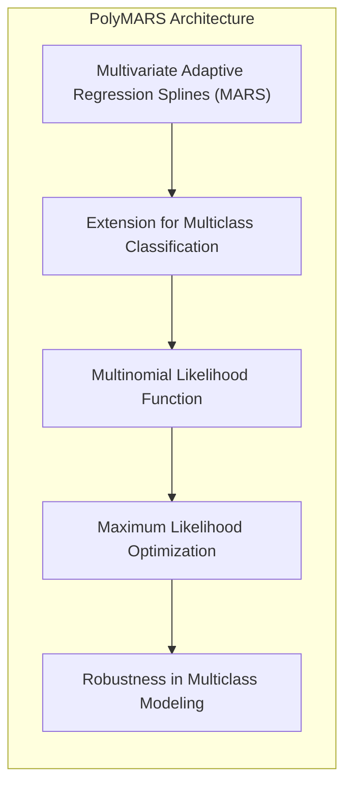
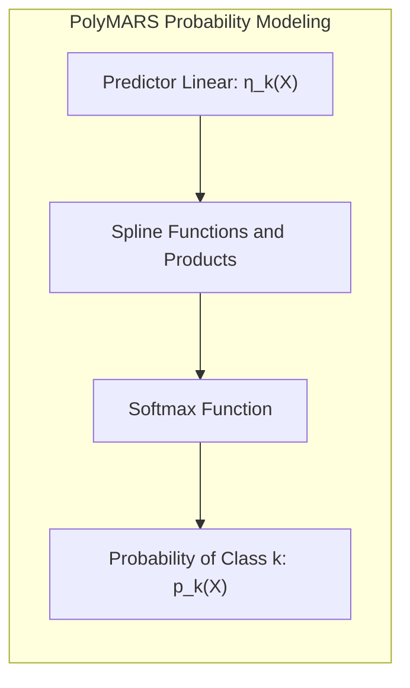
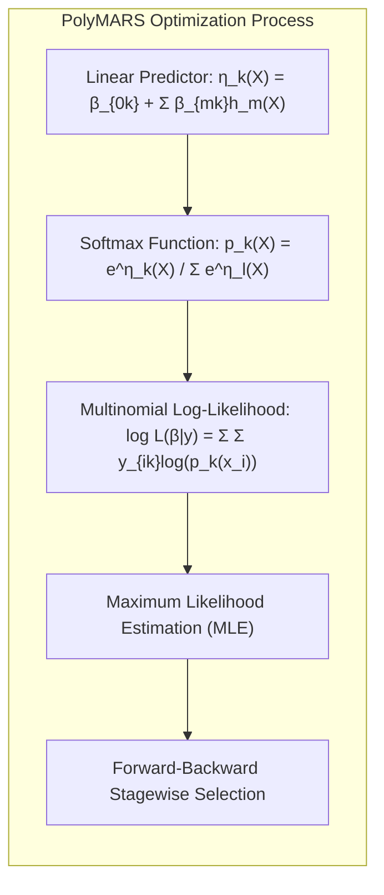
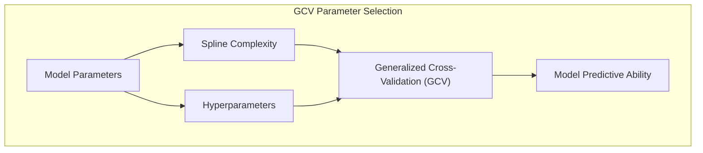
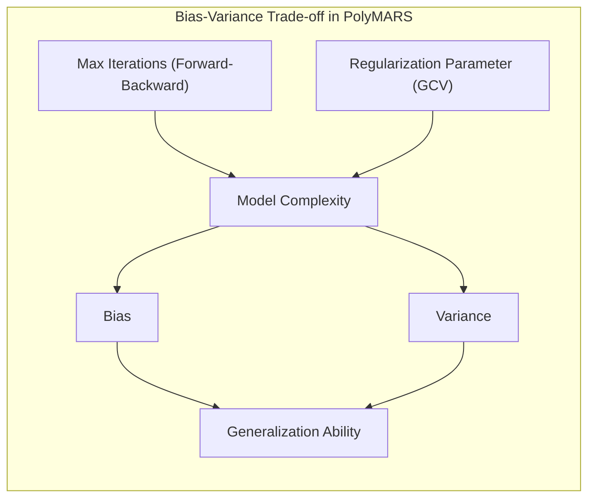

## Título: Modelos Aditivos, Árvores e Métodos Relacionados: PolyMARS, Robustez e Otimização por Máxima Verossimilhança em Classificação Multiclasse

### Introdução

Este capítulo explora o modelo PolyMARS (Polynomial Multivariate Adaptive Regression Splines), uma extensão do MARS projetada especificamente para lidar com problemas de classificação multiclasse, e como este modelo utiliza a função de verossimilhança multinomial e um método de otimização por máxima verossimilhança [^9.1]. A abordagem PolyMARS combina a flexibilidade do MARS com uma estrutura de modelagem probabilística que é apropriada para classificação multiclasse, utilizando uma forma de modelagem que permite que os resultados do modelo sejam interpretados como probabilidades. O capítulo detalha a formulação matemática do modelo, o processo de otimização e como a função de verossimilhança multinomial é utilizada para garantir a estimativa dos parâmetros. O objetivo principal é apresentar como o modelo PolyMARS pode ser uma alternativa mais robusta e apropriada para dados multiclasse quando comparada com abordagens baseadas em árvores de decisão ou outras formas de modelagem de múltiplas categorias.

### Conceitos Fundamentais

**Conceito 1: As Limitações de MARS para Classificação Multiclasse**

O modelo Multivariate Adaptive Regression Splines (MARS), em sua formulação original, é um modelo para regressão e é utilizado para modelar uma variável resposta contínua utilizando funções *spline*. A aplicação do modelo MARS em classificação multiclasse pode ser feita utilizando a abordagem "um contra todos", ou seja, a construção de um modelo para cada classe, e a classificação final é feita comparando o resultado de cada modelo. Essa abordagem, embora seja utilizada na prática, não utiliza todas as informações disponíveis e pode não ser a mais adequada para problemas de classificação com múltiplas categorias. A abordagem da regressão para cada classe separadamente não leva em consideração a estrutura das probabilidades multiclasse, e a utilização de uma abordagem que modele diretamente as probabilidades de cada classe pode ser mais apropriada.

**Lemma 1:** *O modelo MARS, em sua formulação original, foi desenvolvido para problemas de regressão, e sua adaptação para classificação multiclasse através da abordagem "um contra todos" não utiliza todas as informações disponíveis e não garante a otimização apropriada para problemas com múltiplas categorias*. A utilização de uma abordagem para modelar dados multiclasse diretamente é preferível [^4.5].

**Conceito 2: A Formulação do PolyMARS para Classificação Multiclasse**

PolyMARS é uma extensão do modelo MARS que foi projetada para lidar diretamente com problemas de classificação multiclasse. PolyMARS utiliza a formulação da regressão logística múltipla, com a função *softmax* para modelar as probabilidades de cada classe, de forma similar à abordagem utilizada em Modelos Aditivos Generalizados (GAMs):
$$
p_k(X) = \frac{e^{\eta_k(X)}}{\sum_{l=1}^K e^{\eta_l(X)}}
$$
onde $\eta_k(X)$ é o *predictor* linear para cada classe $k$, que é modelado utilizando funções *spline* lineares por partes ou produtos dessas funções, de forma similar ao modelo MARS para regressão. No entanto, o modelo é otimizado diretamente para modelar a probabilidade de cada classe, o que o torna mais apropriado para problemas de classificação multiclasse, ao contrário da abordagem "um contra todos", onde cada modelo é ajustado de forma independente das outras classes. A utilização da função *softmax* garante que as probabilidades estejam entre zero e um e que a sua soma seja igual a um, o que faz com que o modelo respeite as regras de probabilidade.

> 💡 **Exemplo Numérico:**
>
> Suponha que temos um problema de classificação com 3 classes (K=3) e um único preditor X. Após aplicar o modelo PolyMARS, obtivemos os seguintes preditores lineares para uma observação específica com X = 2:
>
> $\eta_1(2) = 1.5$
> $\eta_2(2) = 0.5$
> $\eta_3(2) = -0.2$
>
> Usando a função softmax, calculamos as probabilidades para cada classe:
>
> $p_1(2) = \frac{e^{1.5}}{e^{1.5} + e^{0.5} + e^{-0.2}} = \frac{4.48}{4.48 + 1.65 + 0.82} = \frac{4.48}{6.95} \approx 0.64$
>
> $p_2(2) = \frac{e^{0.5}}{e^{1.5} + e^{0.5} + e^{-0.2}} = \frac{1.65}{6.95} \approx 0.24$
>
> $p_3(2) = \frac{e^{-0.2}}{e^{1.5} + e^{0.5} + e^{-0.2}} = \frac{0.82}{6.95} \approx 0.12$
>
> Observe que as probabilidades somam 1 ($0.64 + 0.24 + 0.12 = 1$). Isso demonstra como o PolyMARS, usando a função softmax, gera probabilidades para cada classe, que podem ser usadas para classificar uma observação. A classe com a maior probabilidade (classe 1, com 0.64) seria a classe predita para essa observação.

**Corolário 1:** *PolyMARS utiliza uma abordagem da regressão logística multinomial para modelar as probabilidades de cada classe e utiliza funções *spline* para modelar a relação entre preditores e a resposta, de forma a combinar a flexibilidade do modelo MARS com uma formulação apropriada para modelos de classificação*. O uso da função *softmax* é essencial para garantir a modelagem de probabilidades multiclasse [^4.4.4].

**Conceito 3: Otimização por Máxima Verossimilhança em PolyMARS**

Em PolyMARS, a estimação dos parâmetros é feita utilizando o método da máxima verossimilhança, o que busca encontrar os parâmetros que maximizam a *log-likelihood* dos dados. A função de *log-likelihood* para o modelo é dada por:
$$
\log(L(\theta|y)) = \sum_{i=1}^N \sum_{k=1}^K y_{ik} \log(p_k(x_i))
$$
onde $y_{ik}$ é a variável indicadora, que é 1 quando a observação $i$ pertence à classe $k$ e 0 caso contrário, e $p_k(x_i)$ é a probabilidade da observação $x_i$ pertencer à classe $k$. A função de verossimilhança multinomial permite modelar a probabilidade de cada classe diretamente e o modelo busca encontrar os parâmetros que maximizam a verossimilhança dos dados. A utilização do método da máxima verossimilhança garante propriedades assintóticas desejáveis para os estimadores dos parâmetros. A escolha de uma função de *log-likelihood* apropriada para os dados multiclasse, e de algoritmos eficientes para a sua maximização, são importantes para obter modelos com bom desempenho e boa capacidade preditiva.

> 💡 **Exemplo Numérico:**
>
> Imagine um conjunto de dados com 5 observações (N=5) e 3 classes (K=3). As classes verdadeiras são representadas por $y_{ik}$, onde $y_{ik} = 1$ se a observação $i$ pertence à classe $k$, e 0 caso contrário. Suponha que o modelo PolyMARS, após a otimização, forneceu as seguintes probabilidades para cada observação e classe:
>
> | Observação (i) | Classe 1 ($p_{i1}$) | Classe 2 ($p_{i2}$) | Classe 3 ($p_{i3}$) | Classe Verdadeira |
> |---|---|---|---|---|
> | 1 | 0.7 | 0.2 | 0.1 | 1 |
> | 2 | 0.1 | 0.8 | 0.1 | 2 |
> | 3 | 0.3 | 0.3 | 0.4 | 3 |
> | 4 | 0.9 | 0.05| 0.05| 1 |
> | 5 | 0.2 | 0.6 | 0.2 | 2 |
>
> A *log-likelihood* é calculada da seguinte forma:
>
> $\log L = y_{11}\log(p_{11}) + y_{12}\log(p_{12}) + y_{13}\log(p_{13}) + \ldots + y_{51}\log(p_{51}) + y_{52}\log(p_{52}) + y_{53}\log(p_{53})$
>
> Para a primeira observação, $y_{11} = 1$, $y_{12}=0$, $y_{13}=0$. Logo, o termo correspondente é $1 * \log(0.7) = -0.3567$.
>
> Para a segunda observação, $y_{21} = 0$, $y_{22}=1$, $y_{23}=0$. Logo, o termo correspondente é $1 * \log(0.8) = -0.2231$.
>
> Para a terceira observação, $y_{31} = 0$, $y_{32} = 0$, $y_{33} = 1$. Logo, o termo correspondente é $1 * \log(0.4) = -0.9163$.
>
> Para a quarta observação, $y_{41} = 1$, $y_{42} = 0$, $y_{43} = 0$. Logo, o termo correspondente é $1 * \log(0.9) = -0.1054$.
>
> Para a quinta observação, $y_{51} = 0$, $y_{52} = 1$, $y_{53} = 0$. Logo, o termo correspondente é $1 * \log(0.6) = -0.5108$.
>
> Somando todos os termos:
>
> $\log L = -0.3567 - 0.2231 - 0.9163 - 0.1054 - 0.5108 = -2.1123$
>
> O objetivo da otimização por máxima verossimilhança é encontrar os parâmetros do modelo que maximizam essa *log-likelihood*. Note que quanto mais próximas as probabilidades preditas estão das classes verdadeiras, maior será a *log-likelihood* (menos negativa).

> ⚠️ **Nota Importante:** O uso da função de verossimilhança multinomial e de algoritmos de otimização por máxima verossimilhança no PolyMARS permite que o modelo seja utilizado para modelar diretamente a probabilidade de cada classe e para encontrar os parâmetros que maximizam a verossimilhança dos dados. O método da máxima verossimilhança garante que as estimativas dos modelos sejam estatisticamente eficientes e consistentes [^4.4.5].

> ❗ **Ponto de Atenção:** A otimização da função de *log-likelihood* multinomial pode ser mais complexa do que em modelos de regressão linear, e o uso de métodos de otimização eficientes, como métodos de gradiente e o método de Newton-Raphson, é essencial para que o modelo seja eficiente computacionalmente. A utilização de métodos de regularização também é importante para garantir a estabilidade dos parâmetros estimados e evitar o *overfitting* [^4.4.2].

> ✔️ **Destaque:** A combinação das funções *spline* e dos produtos de *splines* com o método da máxima verossimilhança multinomial, no modelo PolyMARS, permite que ele seja um modelo com alta flexibilidade e capacidade de modelar interações complexas e com boas propriedades estatísticas [^4.4].

### Formulação Matemática do PolyMARS, Otimização com Máxima Verossimilhança e a Abordagem *Forward-Backward Stagewise*

A formulação matemática do PolyMARS, o processo de otimização e sua relação com a abordagem *forward-backward stagewise* são dados abaixo:

1.  **Formulação do Modelo PolyMARS:** O modelo PolyMARS utiliza uma combinação linear de funções *spline* lineares por partes e seus produtos para modelar o *predictor* linear de cada classe $k$:

$$
\eta_k(X) = \beta_{0k} + \sum_{m=1}^{M_k} \beta_{mk} h_m(X)
$$

onde $\beta_{0k}$ é o intercepto da classe $k$, $\beta_{mk}$ são os coeficientes associados a cada função de base, e $h_m(X)$ são as funções *spline* (ou seus produtos). A probabilidade de cada classe é dada pela função *softmax*:

$$
p_k(X) = \frac{e^{\eta_k(X)}}{\sum_{l=1}^K e^{\eta_l(X)}}
$$
A escolha das funções *spline* e de suas interações define a capacidade de modelagem da não linearidade e a sua complexidade.

> 💡 **Exemplo Numérico:**
>
> Suponha que tenhamos um problema de classificação com duas classes (K=2) e um único preditor X. Após algumas iterações do algoritmo *forward-backward stagewise*, o modelo PolyMARS para uma classe específica (k=1) pode ter a seguinte forma:
>
> $\eta_1(X) = \beta_{01} + \beta_{11} h_1(X) + \beta_{21} h_2(X)$
>
> Onde:
> - $\beta_{01} = -0.5$ (intercepto)
> - $\beta_{11} = 1.2$
> - $\beta_{21} = -0.8$
> - $h_1(X)$ é uma função *spline* linear por partes com um nó em X=3. Ou seja, $h_1(X) = max(0, X-3)$
> - $h_2(X)$ é outra função *spline* linear por partes com um nó em X=5. Ou seja, $h_2(X) = max(0, X-5)$
>
> Para uma nova observação com X=4, calculamos:
>
> $h_1(4) = max(0, 4-3) = 1$
> $h_2(4) = max(0, 4-5) = 0$
>
> $\eta_1(4) = -0.5 + 1.2 * 1 + (-0.8) * 0 = 0.7$
>
> Para a segunda classe (k=2), o modelo pode ter uma forma similar:
>
> $\eta_2(X) = \beta_{02} + \beta_{12} h_1(X) + \beta_{22} h_3(X)$
>
> Onde:
> - $\beta_{02} = 0.2$ (intercepto)
> - $\beta_{12} = -0.5$
> - $\beta_{22} = 0.7$
> - $h_3(X)$ é uma função *spline* linear por partes com um nó em X=2. Ou seja, $h_3(X) = max(0, X-2)$
>
> Para a mesma observação com X=4, calculamos:
>
> $h_1(4) = 1$
> $h_3(4) = max(0, 4-2) = 2$
>
> $\eta_2(4) = 0.2 + (-0.5) * 1 + 0.7 * 2 = 1.1$
>
> Usando a função softmax:
>
> $p_1(4) = \frac{e^{0.7}}{e^{0.7} + e^{1.1}} = \frac{2.01}{2.01 + 3.00} = \frac{2.01}{5.01} \approx 0.40$
>
> $p_2(4) = \frac{e^{1.1}}{e^{0.7} + e^{1.1}} = \frac{3.00}{5.01} \approx 0.60$
>
> Assim, para X=4, a observação seria classificada na classe 2 com uma probabilidade de aproximadamente 0.60.

2.  **Otimização por Máxima Verossimilhança:** A estimativa dos parâmetros $\beta$ é feita maximizando a função de *log-likelihood* multinomial:
   $$
   \log(L(\beta|y)) = \sum_{i=1}^N \sum_{k=1}^K y_{ik} \log(p_k(x_i))
   $$
     onde $y_{ik}$ é uma variável indicadora que é 1 se a observação $i$ pertence à classe $k$ e 0 caso contrário. A maximização da função de *log-likelihood* é feita utilizando algoritmos de otimização como Newton-Raphson ou gradiente descendente.
3.  **Algoritmo *Forward-Backward Stagewise*:** O algoritmo *forward stagewise* é utilizado para selecionar os termos de *spline* mais importantes. Em cada passo do algoritmo, é avaliado a adição de um novo termo *spline* ou uma interação que mais aumenta a *log-likelihood* do modelo, e um passo *backward* remove os termos que não contribuem para a qualidade do modelo. A escolha das funções de base é feita iterativamente, e o algoritmo busca um modelo com uma boa capacidade de ajuste e sem *overfitting*. A adição e remoção de funções de base é feita para garantir que o modelo seja eficiente e tenha boa capacidade de generalização.

A combinação da abordagem de máxima verossimilhança multinomial com um algoritmo *forward-backward stagewise* permite construir modelos de classificação complexos com funções *spline* que modelam relações não lineares, o que representa um modelo mais flexível do que abordagens que modelam cada classe separadamente. A estrutura do modelo garante que as probabilidades de classe somem um, e os parâmetros são estimados de forma que a *log-likelihood* seja maximizada, e que as estimativas sejam consistentes com as propriedades da família exponencial.

**Lemma 3:** *O modelo PolyMARS utiliza funções *spline* lineares por partes e a função softmax para modelar as probabilidades de cada classe, e um algoritmo forward-backward stagewise para a construção do modelo, e o método de otimização por máxima verossimilhança garante que os parâmetros sejam consistentes com a teoria da família exponencial*. A formulação matemática do PolyMARS é uma abordagem eficiente para dados multiclasse [^4.5].

### A Escolha dos Parâmetros e a Validação Cruzada Generalizada (GCV)

A escolha dos parâmetros do modelo PolyMARS, incluindo a complexidade dos termos *spline* e a escolha dos hiperparâmetros do modelo, é feita utilizando o critério de validação cruzada generalizada (GCV), que estima a capacidade preditiva do modelo, considerando a sua complexidade. A utilização do critério GCV permite a construção de modelos robustos e com boa capacidade de generalização. O critério GCV é utilizado para balancear o ajuste do modelo aos dados e a sua complexidade, o que é importante para que o modelo tenha um bom desempenho em dados não vistos no treinamento. A escolha dos parâmetros, portanto, deve utilizar alguma métrica de desempenho, e o GCV é uma opção apropriada.

> 💡 **Exemplo Numérico:**
>
> Suponha que, durante o processo de ajuste do PolyMARS, avaliamos dois modelos diferentes, Model A e Model B, com diferentes complexidades de funções *spline*. Após o treinamento, calculamos o erro quadrático médio (MSE) e o número de parâmetros de cada modelo, e calculamos o GCV como:
>
> $GCV = MSE \times \frac{N + \text{número de parâmetros}}{N - \text{número de parâmetros}}$
>
> Onde N é o número de observações.
>
> | Modelo | MSE (Treino) | Número de Parâmetros | N | GCV |
> |---|---|---|---|---|
> | A  | 0.15 | 10 | 100 |  $0.15 \times \frac{100 + 10}{100 - 10} = 0.15 \times \frac{110}{90} \approx 0.183$ |
> | B | 0.12 | 25 | 100 | $0.12 \times \frac{100 + 25}{100 - 25} = 0.12 \times \frac{125}{75} \approx 0.20$ |
>
> Embora o Modelo B tenha um MSE menor no conjunto de treinamento, ele possui mais parâmetros. O GCV penaliza o Modelo B pela sua complexidade, resultando em um GCV maior do que o Modelo A. Neste caso, o Modelo A seria preferido, pois ele equilibra melhor o ajuste e a complexidade, indicando uma melhor capacidade de generalização.

### Relação com Modelos Aditivos Generalizados (GAMs) e Outras Abordagens de Classificação Multiclasse

O modelo PolyMARS, embora utilize uma abordagem diferente da abordagem dos GAMs para dados multiclasse, busca atingir o mesmo objetivo, que é a construção de modelos capazes de modelar relações não lineares e que tenham boa capacidade de generalização. Modelos GAMs, com funções de ligação apropriadas como a função *softmax*, podem modelar a probabilidade de múltiplas classes de forma direta e com diferentes tipos de funções não paramétricas. Modelos como árvores de decisão utilizam abordagens diferentes para particionar o espaço de características e modelar respostas categóricas. A escolha do melhor modelo depende da natureza dos dados e do objetivo da modelagem, e cada método oferece vantagens e desvantagens no tratamento de problemas de classificação multiclasse.

### Perguntas Teóricas Avançadas: Como a escolha do número máximo de iterações no forward-backward stagewise e a escolha do parâmetro de regularização, associada ao GCV, afetam o bias, a variância e a capacidade de generalização do modelo PolyMARS e como essas escolhas se relacionam com a complexidade do modelo?

**Resposta:**

A escolha do número máximo de iterações no algoritmo *forward-backward stagewise* e do parâmetro de regularização, utilizado no critério de validação cruzada generalizada (GCV), afeta de maneira significativa o *bias*, a variância, e a capacidade de generalização do modelo PolyMARS (Polynomial Multivariate Adaptive Regression Splines), o que exige cuidado na sua escolha.

O número máximo de iterações no algoritmo *forward-backward stagewise* controla a complexidade do modelo, ou seja, quantas funções de base *spline* serão adicionadas, e suas interações. Um número máximo de iterações baixo impede que o modelo se ajuste aos dados de treino, o que leva a um *bias* alto, mas a uma variância menor. Um número máximo de iterações alto leva a modelos mais complexos, com baixo *bias*, e maior capacidade de capturar detalhes da função de resposta, mas também com maior variância e maior risco de *overfitting*, ou seja, uma capacidade de generalização menor.

O parâmetro de regularização, associado ao GCV, controla o *trade-off* entre ajuste do modelo e complexidade, e a sua escolha influencia a sua capacidade de generalização. Um parâmetro de regularização alto leva a modelos mais simples e estáveis, e um parâmetro de regularização baixo permite modelos mais flexíveis e que se ajustam melhor aos dados de treino. A escolha do parâmetro GCV, portanto, impacta o *trade-off* entre *bias* e variância, e deve ser feita considerando a necessidade de modelos com boa capacidade de generalização.

> 💡 **Exemplo Numérico:**
>
> Considere o ajuste do modelo PolyMARS com diferentes números máximos de iterações e parâmetros de regularização no GCV.
>
> **Cenário 1: Poucas iterações e alta regularização**
>
> - Número máximo de iterações: 5
> - Parâmetro de regularização GCV: Alto
>
> Neste caso, o modelo final terá poucas funções *spline* e será muito simples. O modelo não se ajustará bem aos dados de treinamento (alto *bias*), mas também terá baixa variância, sendo menos sensível a mudanças nos dados de treinamento.
>
> **Cenário 2: Muitas iterações e baixa regularização**
>
> - Número máximo de iterações: 20
> - Parâmetro de regularização GCV: Baixo
>
> Neste caso, o modelo final terá muitas funções *spline* e será muito complexo. O modelo se ajustará bem aos dados de treinamento (baixo *bias*), mas terá alta variância, sendo muito sensível a mudanças nos dados de treinamento (overfitting).
>
> **Cenário 3: Número de iterações e regularização equilibrados**
>
> - Número máximo de iterações: 12
> - Parâmetro de regularização GCV: Moderado
>
> Neste caso, o modelo final terá um número moderado de funções *spline* e uma complexidade equilibrada. O modelo se ajustará razoavelmente aos dados de treinamento e terá uma variância controlada, o que leva a uma boa capacidade de generalização para novos dados.
>
> A tabela abaixo ilustra o *trade-off* entre *bias* e variância em cada cenário:
>
> | Cenário | Número de Iterações | Regularização GCV | Bias | Variância | Capacidade de Generalização |
> |---|---|---|---|---|---|
> | 1 | Baixo | Alto | Alto | Baixa | Baixa  |
> | 2 | Alto | Baixa | Baixo | Alta | Baixa  |
> | 3 | Moderado | Moderada | Moderado | Moderada | Alta |

A combinação dos parâmetros de parada do *forward-backward stagewise* com o parâmetro GCV tem um efeito sinérgico no resultado final da modelagem, e a escolha adequada desses parâmetros permite um balanço entre o ajuste aos dados, sua complexidade e a estabilidade do modelo. Um modelo com parâmetros adequados tem capacidade de aproximar as funções de resposta de forma precisa e também tem boa capacidade de generalização.

**Lemma 5:** *A escolha do número máximo de iterações no algoritmo *forward-backward stagewise* e do parâmetro de regularização no critério GCV define a complexidade do modelo PolyMARS e o seu *trade-off* entre viés e variância, o que tem um impacto direto na capacidade de generalização do modelo*. A escolha desses parâmetros deve ser feita considerando o problema e os dados específicos [^4.5].

**Corolário 5:** *A utilização da validação cruzada para escolher os parâmetros do GCV, e o uso do critério de parada adequado no algoritmo *forward-backward stagewise*, permite criar modelos que equilibram a complexidade, o *bias* e a variância, e também a capacidade de generalização para dados não vistos, que é um objetivo principal do aprendizado supervisionado*. O ajuste dos parâmetros é fundamental para a obtenção de modelos que apresentem resultados robustos [^4.5.1].

> ⚠️ **Ponto Crucial**: A escolha do número máximo de iterações no algoritmo *forward-backward stagewise* e do parâmetro GCV definem a capacidade de modelagem do modelo PolyMARS, e a interação entre esses parâmetros influencia diretamente a estabilidade do modelo, a sua complexidade, e a sua capacidade de generalização. A escolha desses parâmetros deve ser feita de forma a otimizar o *trade-off* entre o *bias* e a variância do modelo final [^4.5.2].

### Conclusão

Este capítulo apresentou a formulação do PolyMARS, uma extensão do modelo MARS para problemas de classificação multiclasse, enfatizando a utilização da função *softmax* e a otimização por máxima verossimilhança. O capítulo detalhou como as abordagens de *forward-backward stagewise* são utilizadas para a construção do modelo e como os parâmetros de suavização, e o critério GCV, são utilizados para controlar a sua complexidade e melhorar a capacidade de generalização. A compreensão das propriedades do PolyMARS permite que o modelo seja utilizado de forma mais adequada em problemas de classificação multiclasse, e que as suas limitações sejam consideradas durante a modelagem estatística.

### Footnotes

[^4.1]: "In this chapter we begin our discussion of some specific methods for super-vised learning. These techniques each assume a (different) structured form for the unknown regression function, and by doing so they finesse the curse of dimensionality. Of course, they pay the possible price of misspecifying the model, and so in each case there is a tradeoff that has to be made." *(Trecho de "Additive Models, Trees, and Related Methods")*

[^4.2]: "Regression models play an important role in many data analyses, providing prediction and classification rules, and data analytic tools for understand-ing the importance of different inputs." *(Trecho de "Additive Models, Trees, and Related Methods")*

[^4.3]: "In this section we describe a modular algorithm for fitting additive models and their generalizations. The building block is the scatterplot smoother for fitting nonlinear effects in a flexible way. For concreteness we use as our scatterplot smoother the cubic smoothing spline described in Chapter 5." *(Trecho de "Additive Models, Trees, and Related Methods")*

[^4.3.1]:  "The additive model has the form $Y = \alpha + \sum_{j=1}^p f_j(X_j) + \varepsilon$, where the error term $\varepsilon$ has mean zero." * (Trecho de "Additive Models, Trees, and Related Methods")*

[^4.3.2]:   "Given observations $x_i, y_i$, a criterion like the penalized sum of squares (5.9) of Section 5.4 can be specified for this problem, $PRSS(\alpha, f_1, f_2,..., f_p) = \sum_i^N (y_i - \alpha - \sum_j^p f_j(x_{ij}))^2 + \sum_j^p \lambda_j \int(f_j''(t_j))^2 dt_j$" * (Trecho de "Additive Models, Trees, and Related Methods")*

[^4.3.3]: "where the $\lambda_j > 0$ are tuning parameters. It can be shown that the minimizer of (9.7) is an additive cubic spline model; each of the functions $f_j$ is a cubic spline in the component $X_j$, with knots at each of the unique values of $x_{ij}$, $i = 1,..., N$." *(Trecho de "Additive Models, Trees, and Related Methods")*

[^4.4]: "For two-class classification, recall the logistic regression model for binary data discussed in Section 4.4. We relate the mean of the binary response $\mu(X) = Pr(Y = 1|X)$ to the predictors via a linear regression model and the logit link function:  $\log(\mu(X)/(1 – \mu(X)) = \alpha + \beta_1 X_1 + \ldots + \beta_pX_p$." * (Trecho de "Additive Models, Trees, and Related Methods")*

[^4.4.1]: "The additive logistic regression model replaces each linear term by a more general functional form: $\log(\mu(X)/(1 – \mu(X))) = \alpha + f_1(X_1) + \ldots + f_p(X_p)$, where again each $f_j$ is an unspecified smooth function." * (Trecho de "Additive Models, Trees, and Related Methods")*

[^4.4.2]: "While the non-parametric form for the functions $f_j$ makes the model more flexible, the additivity is retained and allows us to interpret the model in much the same way as before. The additive logistic regression model is an example of a generalized additive model." *(Trecho de "Additive Models, Trees, and Related Methods")*

[^4.4.3]: "In general, the conditional mean $\mu(X)$ of a response Y is related to an additive function of the predictors via a link function g:  $g[\mu(X)] = \alpha + f_1(X_1) + \ldots + f_p(X_p)$." *(Trecho de "Additive Models, Trees, and Related Methods")*

[^4.4.4]:  "Examples of classical link functions are the following: $g(\mu) = \mu$ is the identity link, used for linear and additive models for Gaussian response data." *(Trecho de "Additive Models, Trees, and Related Methods")*

[^4.4.5]: "$g(\mu) = logit(\mu)$ as above, or $g(\mu) = probit(\mu)$, the probit link function, for modeling binomial probabilities. The probit function is the