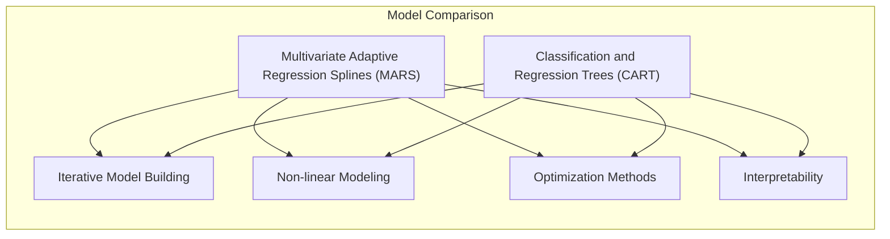
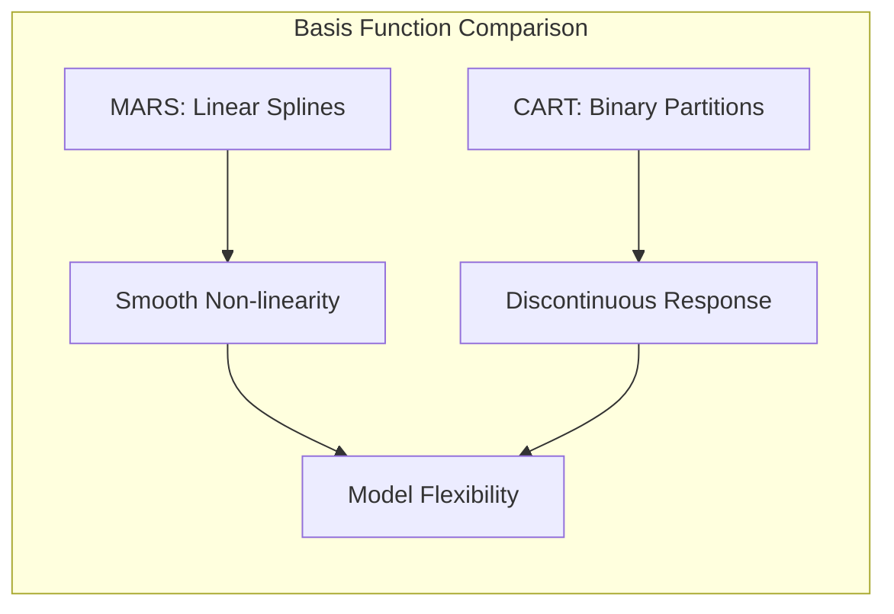
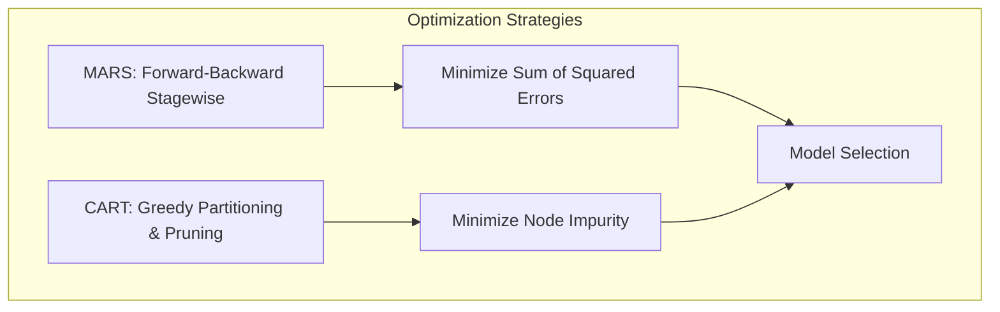
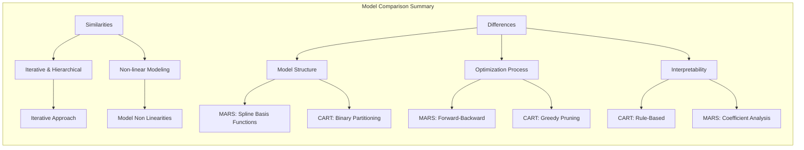
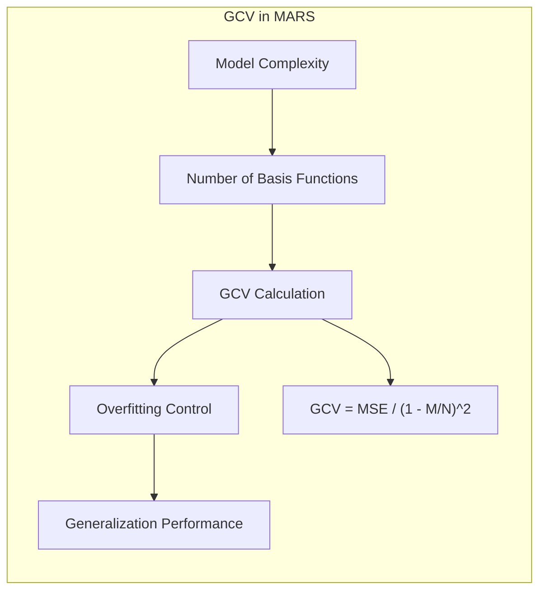
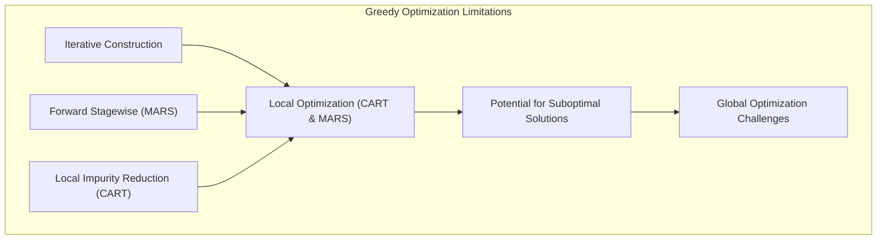
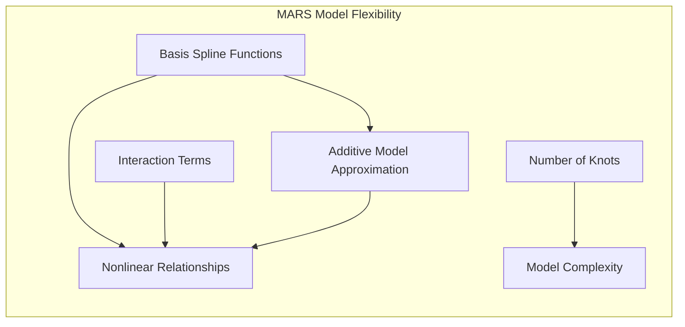

## Título: Modelos Aditivos, Árvores e Métodos Relacionados: Relações entre MARS e CART e suas Implicações para a Modelagem



### Introdução

Este capítulo explora a relação entre Multivariate Adaptive Regression Splines (MARS) e Classification and Regression Trees (CART), dois métodos de aprendizado supervisionado que, embora distintos em suas abordagens, compartilham algumas similaridades, principalmente na modelagem de relações não lineares [^9.1]. O capítulo detalha como a ideia de modelagem hierárquica e iterativa está presente em ambos os métodos, e como suas diferenças em relação à utilização de funções de base e particionamento do espaço de características influenciam a sua capacidade de modelagem e interpretabilidade. O objetivo principal é apresentar uma análise comparativa entre MARS e CART, com base nas suas formulações matemáticas, abordagens de otimização e resultados em aplicações em problemas de modelagem, de forma que seja possível entender as suas diferenças e similaridades.

### Conceitos Fundamentais

**Conceito 1: A Abordagem Iterativa e Hierárquica de MARS e CART**

Tanto MARS quanto CART utilizam uma abordagem iterativa e hierárquica para construir modelos com capacidade de modelar não linearidades. Em MARS, o modelo é construído através da adição iterativa de funções *spline* lineares por partes, que são combinadas através de um algoritmo *forward-backward stagewise*, o que representa uma modelagem hierárquica da função de resposta. Em CART, a árvore de decisão é construída através de partições binárias recursivas, que dividem o espaço de características em regiões progressivamente mais puras, criando uma estrutura hierárquica. Ambos os modelos, embora distintos em sua natureza, utilizam a ideia de construção iterativa e hierárquica para modelar relações complexas. A natureza gulosa das estratégias de modelagem é também uma similaridade entre os dois métodos.

> 💡 **Exemplo Numérico:**
> Imagine um problema de prever o preço de casas com base em suas áreas. Tanto MARS quanto CART começariam com uma modelagem simples e iterativamente a refinariam. MARS poderia começar com uma linha reta e depois adicionar *splines* para capturar não linearidades (e.g., casas muito grandes podem ter um preço por metro quadrado menor). CART começaria dividindo os dados em áreas menores e maiores, e depois subdividindo cada grupo com base em outros critérios como o número de quartos.
> ```python
> import numpy as np
> import matplotlib.pyplot as plt
> from sklearn.linear_model import LinearRegression
> from sklearn.tree import DecisionTreeRegressor
>
> # Dados de exemplo
> area = np.array([50, 75, 100, 125, 150, 175, 200, 225, 250]).reshape(-1, 1)
> preco = np.array([100, 150, 220, 280, 350, 400, 420, 430, 450])
>
> # Regressão linear simples
> model_lr = LinearRegression()
> model_lr.fit(area, preco)
> preco_lr = model_lr.predict(area)
>
> # Árvore de decisão (CART)
> model_dt = DecisionTreeRegressor(max_depth=2)
> model_dt.fit(area, preco)
> preco_dt = model_dt.predict(area)
>
> # Plot
> plt.figure(figsize=(10, 5))
> plt.scatter(area, preco, color='blue', label='Dados')
> plt.plot(area, preco_lr, color='red', label='Regressão Linear')
> plt.plot(area, preco_dt, color='green', label='Árvore de Decisão')
> plt.xlabel('Área (m²)')
> plt.ylabel('Preço')
> plt.title('Exemplo de Modelagem Iterativa')
> plt.legend()
> plt.show()
> ```
> No gráfico, a linha vermelha representa um modelo linear simples. A linha verde representa um modelo de árvore de decisão, que divide o espaço em regiões. MARS adicionaria funções *spline* para ajustar melhor os dados, de forma iterativa.

**Lemma 1:** *MARS e CART utilizam uma abordagem iterativa e hierárquica para a construção de modelos. A construção dos modelos MARS e CART envolve a repetição de um processo de otimização até que o modelo atinja o seu objetivo. A similaridade em relação a utilização de modelos iterativos é uma característica comum entre os dois métodos*. A modelagem iterativa e hierárquica é uma forma de construir modelos complexos de forma eficiente [^4.5.1].

**Conceito 2: Similaridades e Diferenças nas Funções de Base**

A principal diferença entre MARS e CART reside na forma como a não linearidade é modelada. MARS utiliza funções *spline* lineares por partes, enquanto CART utiliza partições binárias que dividem o espaço de características em regiões, e cada região tem uma predição constante ou linear. As funções *spline* lineares por partes de MARS, embora sejam locais, são contínuas, e a sua combinação linear permite modelar relações não lineares de forma suave, enquanto as partições de CART podem levar a descontinuidades nas funções de resposta. A escolha da função de base influencia a capacidade do modelo de se ajustar a diferentes tipos de dados.



> 💡 **Exemplo Numérico:**
> Considere modelar a relação entre a temperatura e a taxa de crescimento de uma planta. MARS usaria *splines* que poderiam modelar um aumento inicial na taxa de crescimento com o aumento da temperatura e depois uma diminuição quando a temperatura fica muito alta, com uma curva suave. CART dividiria a temperatura em intervalos (e.g., baixa, média, alta) e faria uma predição constante para cada intervalo, resultando em uma função de crescimento por etapas.
> ```python
> import numpy as np
> import matplotlib.pyplot as plt
> from pyearth import Earth
> from sklearn.tree import DecisionTreeRegressor
>
> # Dados de exemplo
> temperatura = np.array([10, 15, 20, 25, 30, 35, 40, 45]).reshape(-1, 1)
> crescimento = np.array([2, 4, 7, 10, 8, 5, 3, 1])
>
> # MARS
> model_mars = Earth()
> model_mars.fit(temperatura, crescimento)
> crescimento_mars = model_mars.predict(temperatura)
>
> # CART
> model_cart = DecisionTreeRegressor(max_depth=3)
> model_cart.fit(temperatura, crescimento)
> crescimento_cart = model_cart.predict(temperatura)
>
> # Plot
> plt.figure(figsize=(10, 5))
> plt.scatter(temperatura, crescimento, color='blue', label='Dados')
> plt.plot(temperatura, crescimento_mars, color='red', label='MARS')
> plt.plot(temperatura, crescimento_cart, color='green', label='CART')
> plt.xlabel('Temperatura (°C)')
> plt.ylabel('Taxa de Crescimento')
> plt.title('Funções de Base em MARS e CART')
> plt.legend()
> plt.show()
> ```
> No gráfico, a linha vermelha representa a curva suave gerada por MARS, enquanto a linha verde mostra as etapas da árvore de decisão (CART).

**Corolário 1:** *MARS utiliza funções *spline* lineares por partes para modelar relações não lineares de forma suave, enquanto CART utiliza partições binárias para construir um modelo hierárquico com diferentes predições em diferentes regiões. A escolha das funções de base é fundamental para a capacidade de aproximação e para o comportamento do modelo*. A escolha entre funções de base suaves e partições binárias deve ser feita considerando a natureza dos dados e os padrões a serem modelados [^4.5.2].

**Conceito 3: Otimização e Critérios de Escolha de Modelos**

O processo de otimização dos parâmetros dos modelos MARS e CART também difere substancialmente. MARS utiliza um processo *forward-backward stagewise* para escolher os termos *spline* que melhor ajustam os dados, onde o critério de escolha é a redução da soma dos erros quadrados. Em CART, a escolha das partições é feita de forma gulosa com base na minimização da impureza dos nós, e o *pruning* é utilizado para controlar a complexidade da árvore. Embora ambos os métodos busquem obter um modelo com boa capacidade preditiva, seus algoritmos e abordagens são diferentes, e cada um reflete a sua própria estrutura. A escolha dos modelos também é feita com base no custo computacional, e sua capacidade de generalização.



> 💡 **Exemplo Numérico:**
> Para ilustrar a otimização, vamos usar um exemplo com dados simulados. MARS adicionaria *splines* com base na redução do erro quadrático médio (MSE), enquanto CART escolheria a divisão que maximiza a redução da impureza (e.g., Gini index para classificação, ou variância para regressão). O processo forward-backward em MARS é ilustrado adicionando e removendo funções *spline* até que o GCV seja minimizado. CART, por outro lado, faz escolhas gulosas a cada etapa de divisão do espaço, e o *pruning* é utilizado para evitar *overfitting*.
>
> ```python
> import numpy as np
> import matplotlib.pyplot as plt
> from sklearn.metrics import mean_squared_error
> from pyearth import Earth
> from sklearn.tree import DecisionTreeRegressor
>
> # Dados de exemplo (simulados)
> np.random.seed(42)
> X = np.sort(5 * np.random.rand(80, 1), axis=0)
> y = np.sin(X).ravel() + np.random.normal(0, 0.1, X.shape[0])
>
> # MARS
> model_mars = Earth(max_degree=2)
> model_mars.fit(X, y)
> y_mars = model_mars.predict(X)
> mse_mars = mean_squared_error(y, y_mars)
>
> # CART
> model_cart = DecisionTreeRegressor(max_depth=3)
> model_cart.fit(X, y)
> y_cart = model_cart.predict(X)
> mse_cart = mean_squared_error(y, y_cart)
>
> # Plot
> plt.figure(figsize=(10, 5))
> plt.scatter(X, y, color='blue', label='Dados')
> plt.plot(X, y_mars, color='red', label=f'MARS (MSE={mse_mars:.3f})')
> plt.plot(X, y_cart, color='green', label=f'CART (MSE={mse_cart:.3f})')
> plt.xlabel('X')
> plt.ylabel('y')
> plt.title('Otimização em MARS e CART')
> plt.legend()
> plt.show()
> ```
> Este exemplo mostra o ajuste dos modelos aos dados. A linha vermelha (MARS) usa *splines* para ajustar a curva, enquanto a linha verde (CART) usa partições binárias para dividir o espaço. O MSE é usado para avaliar o ajuste de cada método.

> ⚠️ **Nota Importante:** MARS e CART utilizam diferentes algoritmos para construir modelos, e a escolha do método de otimização influencia diretamente a estrutura dos modelos. A utilização do método dos mínimos quadrados em MARS para escolher os termos e a minimização da impureza em árvores de decisão resultam em abordagens de modelagem diferentes [^4.4.3].

> ❗ **Ponto de Atenção:** A escolha do método de otimização influencia a interpretabilidade do modelo e a sua capacidade de generalização. Modelos muito complexos podem ter uma capacidade de ajuste muito alta, mas a sua capacidade de modelagem em dados novos, pode não ser boa [^4.5].

> ✔️ **Destaque:** Embora MARS e CART utilizem algoritmos de otimização diferentes, ambos buscam construir modelos que capturem as relações não lineares nos dados, e o desempenho final dos modelos depende da natureza dos dados, e da escolha dos seus parâmetros e componentes [^4.4.4].

### Similaridades e Diferenças na Estrutura de Modelagem, Otimização e Interpretabilidade



A comparação entre MARS e CART revela tanto similaridades quanto diferenças na forma como esses modelos abordam a modelagem estatística:

1.  **Similaridades na Modelagem Não Linear:** Ambos os modelos utilizam abordagens iterativas e hierárquicas para modelar relações não lineares. MARS utiliza funções *spline* lineares por partes e seus produtos, enquanto CART utiliza partições binárias recursivas, com cada divisão sendo feita de forma local, sem considerar interações globais entre as variáveis. As árvores de decisão utilizam um processo de construção de forma gulosa e iterativa, onde as funções são obtidas através das decisões binárias.

2.  **Diferenças na Estrutura do Modelo:** A estrutura do modelo MARS é baseada em funções lineares por partes que são combinadas linearmente, e as suas interações também são modeladas de forma linear. A estrutura de árvores de decisão, por outro lado, é baseada em partições do espaço de características e as interações são modeladas através de diferentes caminhos da raiz para os nós folha. A utilização de funções de base com zonas nulas em MARS permite que o modelo se ajuste localmente, e árvores de decisão se ajustam a cada região do espaço particionado, onde cada nó representa uma região do espaço de características.

3. **Processo de Otimização:** O processo de otimização em MARS é realizado através da utilização de um algoritmo *forward-backward stagewise* para a escolha das funções *spline* mais relevantes. Em CART, um algoritmo guloso é utilizado para a escolha da melhor partição, e o *pruning* é utilizado para controlar a complexidade da árvore. A escolha da função de custo e do método de otimização influencia o processo de estimação dos parâmetros, e a complexidade do modelo. A escolha do método de otimização deve ser guiada pela forma como o modelo é construído e pela qualidade das estimativas.

4. **Interpretabilidade:** Árvores de decisão são, em geral, mais interpretáveis, pois o modelo é formado por um conjunto de regras que separam os dados de forma clara. MARS, embora utilize funções de base que podem ser interpretadas individualmente, geralmente gera modelos mais complexos, que são mais difíceis de entender. A interpretação de MARS é geralmente feita analisando o impacto dos termos de *spline* na variável resposta, e a utilização de interações de segunda ordem aumenta a capacidade de modelar as relações, embora dificulte um pouco a interpretação dos resultados.

> 💡 **Exemplo Numérico:**
> Suponha que queiramos modelar a satisfação do cliente com base em várias variáveis, como tempo de espera e qualidade do produto. Um modelo CART poderia gerar regras como "Se tempo de espera > 10 minutos, então satisfação = baixa". MARS, por outro lado, poderia criar uma função que modela a relação suave entre tempo de espera e satisfação, usando *splines*, e também modelar interações complexas com outras variáveis. A árvore de decisão é mais fácil de interpretar, mas o MARS pode fornecer um modelo mais preciso, embora mais complexo.
>
> ```mermaid
> graph LR
>     A[Início] --> B{"Tempo de Espera > 10 min?"};
>     B -- "Sim" --> C["Satisfação = Baixa"];
>     B -- "Não" --> D{"Qualidade do Produto > 7?"};
>     D -- "Sim" --> E["Satisfação = Alta"];
>     D -- "Não" --> F["Satisfação = Média"];
> ```
> O gráfico acima mostra uma árvore de decisão simples. Em MARS, a relação seria modelada por funções *spline*, e a interpretação seria feita analisando os coeficientes dos *splines*.

**Lemma 3:** *MARS e CART utilizam abordagens diferentes para modelar relações não lineares, mas com a característica comum de serem modelos baseados em algoritmos iterativos e locais. MARS utiliza funções *spline* lineares por partes, enquanto CART utiliza partições binárias, e os dois métodos são utilizados para construir modelos com capacidade de modelagem de não linearidades*. A escolha do modelo deve considerar a sua capacidade de modelagem, a sua interpretabilidade e a sua capacidade de generalização [^9.4].

### A Utilização do Critério de Validação Cruzada Generalizada (GCV) em MARS

Em MARS, o critério de validação cruzada generalizada (GCV) é utilizado para escolher o número de termos e a complexidade do modelo. A utilização do GCV permite o controle do *overfitting* e garante que o modelo tenha um bom desempenho em dados não vistos no treinamento. A escolha do parâmetro GCV é crucial para o ajuste adequado do modelo. O GCV estima o erro do modelo em dados de validação, o que auxilia na escolha dos melhores modelos. A utilização de técnicas como a validação cruzada e critérios como o GCV, são importantes na modelagem estatística para a construção de modelos robustos e com capacidade de generalização.



> 💡 **Exemplo Numérico:**
> Suponha que em um modelo MARS temos 3 modelos diferentes, com 5, 10 e 15 funções *spline*, respectivamente. O GCV é calculado para cada um deles, e o modelo com o menor GCV é selecionado. O GCV penaliza modelos mais complexos (com mais *splines*), evitando o *overfitting*. O GCV é uma estimativa do erro de generalização do modelo.
>
> Vamos considerar um exemplo simplificado:
>
> Modelo 1 (5 *splines*): MSE = 0.2, número de parâmetros = 15, GCV = 0.25
> Modelo 2 (10 *splines*): MSE = 0.15, número de parâmetros = 30, GCV = 0.22
> Modelo 3 (15 *splines*): MSE = 0.12, número de parâmetros = 45, GCV = 0.28
>
> Embora o Modelo 3 tenha o menor MSE, o Modelo 2 tem o menor GCV, indicando um melhor balanço entre ajuste e complexidade.
>
> A fórmula para o GCV em MARS é uma modificação do MSE que penaliza a complexidade do modelo:
> $$GCV = \frac{MSE}{(1 - \frac{M}{N})^2}$$
> onde M é o número de parâmetros e N é o número de observações.
> No exemplo acima, o GCV é calculado com base no MSE e no número de parâmetros, e o modelo com o menor valor de GCV é escolhido.

### As Limitações do Processo Guloso em MARS e CART e a Busca por Modelos Mais Globais

O processo de construção de árvores de decisão é feito através de um algoritmo guloso que busca a redução da impureza localmente, e a escolha do preditor e ponto de divisão é feita de forma iterativa, sem considerar o efeito da escolha nos níveis inferiores da árvore. O mesmo ocorre com o MARS, que também utiliza um processo *forward stagewise*, que adiciona termos que melhor se ajustam aos dados naquele momento. Os algoritmos gulosos podem não garantir a solução ótima global, e modelos mais complexos e com otimização global podem ser mais adequados em alguns casos. A busca pela solução ótima é um desafio em problemas de otimização complexos e o uso de métodos iterativos, e a utilização de técnicas de regularização é uma forma de compensar essa limitação.



> 💡 **Exemplo Numérico:**
> Imagine que em uma árvore de decisão, a primeira divisão seja feita com base em uma variável que, localmente, parece ótima, mas que impede uma melhor divisão em níveis inferiores da árvore. Um algoritmo guloso não voltaria atrás para refazer a primeira divisão, enquanto um método de otimização global poderia encontrar uma melhor solução. Da mesma forma, em MARS, a adição de um termo *spline* pode parecer ótima no momento, mas pode impedir a adição de um termo melhor em uma etapa posterior. O processo *forward-backward stagewise* tenta mitigar esse problema, mas ainda é uma aproximação da solução ótima global.

### Perguntas Teóricas Avançadas: Como a escolha das funções *spline*, o número de nós e a formulação das interações em MARS, se relacionam com a capacidade do modelo de simular modelos aditivos e outras estruturas com diferentes tipos de não linearidades?

**Resposta:**

A escolha das funções *spline*, o número de nós e a formulação das interações em Multivariate Adaptive Regression Splines (MARS) tem um impacto significativo na sua capacidade de simular modelos aditivos e outras estruturas com diferentes tipos de não linearidades.

As funções *spline* lineares por partes, utilizadas em MARS, têm uma capacidade limitada de modelar relações não lineares suaves quando utilizadas individualmente. No entanto, a sua combinação linear e, também, a utilização de interações, permite que MARS aproxime funções mais complexas e que simule modelos aditivos e modelos com interações de forma mais flexível. A escolha do número de nós de cada *spline* também afeta a sua capacidade de aproximar funções, pois *splines* com poucos nós são menos flexíveis, e *splines* com muitos nós são mais flexíveis e com maior risco de *overfitting*. A escolha da localização dos nós também tem um impacto direto na capacidade de modelagem do modelo.

A utilização de interações de segunda ordem, em MARS, permite que o modelo capture relações não lineares que não podem ser modeladas com uma estrutura aditiva. A escolha das funções *spline* com interações é feita através de um processo *forward-backward*, que busca os termos que melhor se ajustam aos dados e que contribuem para a redução do erro. A escolha dos termos de interação permite que MARS modele relações mais complexas entre os preditores e a resposta, e essa capacidade de modelar interações é uma vantagem do método em relação a modelos aditivos simples.

Em relação à capacidade de simular modelos aditivos, MARS, ao utilizar uma combinação linear de funções *spline*, pode se aproximar de modelos aditivos, principalmente quando as interações não são relevantes para a modelagem. A capacidade de aproximar funções não lineares é, portanto, um aspecto importante do modelo MARS e que o diferencia de outros modelos que utilizam abordagens de modelagem mais lineares. A escolha da função de base e dos seus parâmetros, portanto, tem um impacto direto na capacidade do MARS de simular diferentes tipos de modelos, e de se adaptar a diferentes tipos de não linearidades.



> 💡 **Exemplo Numérico:**
> Considere o modelo aditivo $y = f_1(x_1) + f_2(x_2) + \epsilon$, onde $f_1$ e $f_2$ são funções não lineares. MARS pode aproximar esse modelo usando *splines* para cada variável, sem interações. Se houver uma interação entre $x_1$ e $x_2$, como $y = f_1(x_1) + f_2(x_2) + f_3(x_1, x_2) + \epsilon$, MARS pode usar interações de segunda ordem entre *splines* para aproximar $f_3$. A escolha do número de nós dos *splines* determina a flexibilidade de cada $f_i$.
>
> Por exemplo, podemos definir:
> $f_1(x_1) = 2x_1^2$
> $f_2(x_2) = \sin(x_2)$
> $f_3(x_1, x_2) = x_1 * x_2$
>
> MARS, ao usar *splines* e suas interações, seria capaz de aproximar essa função não linear.

**Lemma 5:** *A escolha das funções *spline*, do número de nós e da formulação das interações em MARS afeta a sua capacidade de modelar diferentes tipos de relações não lineares. O modelo MARS, ao usar funções *spline* lineares por partes e interações, busca ter uma capacidade de aproximação flexível e também com boa interpretabilidade*. A escolha das funções *spline* influencia a capacidade de aproximação do modelo [^4.5.1].

**Corolário 5:** *A combinação de funções splines com interações em modelos MARS permite aproximar funções com diferentes tipos de não linearidades e com interações complexas entre preditores, o que resulta em uma modelagem mais flexível, e modelos que se adaptam a diferentes estruturas de dados. O uso de modelos mais flexíveis e sua capacidade de generalização são componentes importantes da modelagem estatística*. A escolha apropriada dos componentes do modelo é fundamental para o seu desempenho [^4.5.2].

> ⚠️ **Ponto Crucial**: A capacidade do modelo MARS de simular modelos aditivos e outras estruturas complexas depende da escolha das funções *spline*, do número de nós e da formulação das interações. A escolha desses componentes e a sua interação afeta a flexibilidade do modelo, a sua interpretabilidade, e a sua capacidade de generalização. A combinação desses componentes deve ser feita considerando o problema de modelagem e os seus objetivos [^4.3.2].

### Conclusão

Este capítulo explorou a relação entre MARS e CART, destacando as suas similaridades e diferenças, assim como a natureza da sua abordagem de otimização. A discussão detalhou a forma como cada modelo aborda a modelagem da não linearidade, a influência da estrutura do modelo e a sua interpretabilidade. A compreensão das propriedades de cada modelo e de seus componentes permite a escolha do modelo mais adequado para cada problema e como eles se relacionam com modelos mais gerais de aprendizado supervisionado.

### Footnotes

[^4.1]: "In this chapter we begin our discussion of some specific methods for super-vised learning. These techniques each assume a (different) structured form for the unknown regression function, and by doing so they finesse the curse of dimensionality. Of course, they pay the possible price of misspecifying the model, and so in each case there is a tradeoff that has to be made." *(Trecho de "Additive Models, Trees, and Related Methods")*

[^4.2]: "Regression models play an important role in many data analyses, providing prediction and classification rules, and data analytic tools for understand-ing the importance of different inputs." *(Trecho de "Additive Models, Trees, and Related Methods")*

[^4.3]: "In this section we describe a modular algorithm for fitting additive models and their generalizations. The building block is the scatterplot smoother for fitting nonlinear effects in a flexible way. For concreteness we use as our scatterplot smoother the cubic smoothing spline described in Chapter 5." *(Trecho de "Additive Models, Trees, and Related Methods")*

[^4.3.1]:  "The additive model has the form $Y = \alpha + \sum_{j=1}^p f_j(X_j) + \epsilon$, where the error term $\epsilon$ has mean zero." * (Trecho de "Additive Models, Trees, and Related Methods")*

[^4.3.2]:   "Given observations $x_i, y_i$, a criterion like the penalized sum of squares (5.9) of Section 5.4 can be specified for this problem, $PRSS(\alpha, f_1, f_2,..., f_p) = \sum_{i=1}^N (y_i - \alpha - \sum_{j=1}^p f_j(x_{ij}))^2 + \sum_{j=1}^p \lambda_j \int(f_j''(t_j))^2 dt_j$" * (Trecho de "Additive Models, Trees, and Related Methods")*

[^4.3.3]: "where the $\lambda_j > 0$ are tuning parameters. It can be shown that the minimizer of (9.7) is an additive cubic spline model; each of the functions $f_j$ is a cubic spline in the component $X_j$, with knots at each of the unique values of $x_{ij}$, $i = 1,..., N$." *(Trecho de "Additive Models, Trees, and Related Methods")*

[^4.4]: "For two-class classification, recall the logistic regression model for binary data discussed in Section 4.4. We relate the mean of the binary response $\mu(X) = Pr(Y = 1|X)$ to the predictors via a linear regression model and the logit link function:  $log(\mu(X)/(1 – \mu(X)) = \alpha + \beta_1 X_1 + ... + \beta_pX_p$." * (Trecho de "Additive Models, Trees, and Related Methods")*

[^4.4.1]: "The additive logistic regression model replaces each linear term by a more general functional form: $log(\mu(X)/(1 – \mu(X))) = \alpha + f_1(X_1) + \ldots + f_p(X_p)$, where again each $f_j$ is an unspecified smooth function." * (Trecho de "Additive Models, Trees, and Related Methods")*

[^4.4.2]: "While the non-parametric form for the functions $f_j$ makes the model more flexible, the additivity is retained and allows us to interpret the model in much the same way as before. The additive logistic regression model is an example of a generalized additive model." *(Trecho de "Additive Models, Trees, and Related Methods")*

[^4.4.3]: "In general, the conditional mean $\mu(X)$ of a response $Y$ is related to an additive function of the predictors via a link function $g$:  $g[\mu(X)] = \alpha + f_1(X_1) + \ldots + f_p(X_p)$." *(Trecho de "Additive Models, Trees, and Related Methods")*

[^4.4.4]:  "Examples of classical link functions are the following: $g(\mu) = \mu$ is the identity link, used for linear and additive models for Gaussian response data." *(Trecho de "Additive Models, Trees, and Related Methods")*

[^4.4.5]: "$g(\mu) = logit(\mu)$ as above, or $g(\mu) = probit(\mu)$, the probit link function, for modeling binomial probabilities. The probit function is the inverse Gaussian cumulative distribution function: $probit(\mu) = \Phi^{-1}(\mu)$." *(Trecho de "Additive Models, Trees, and Related Methods")*

[^4.5]: "All three of these arise from exponential family sampling models, which in addition include the gamma and negative-binomial distributions. These families generate the well-known class of generalized linear models, which are all extended in the same way to generalized additive models." *(Trecho de "Additive Models, Trees, and Related Methods")*

[^4.5.1]: "The functions $f_j$ are estimated in a flexible manner, using an algorithm whose basic building block is a scatterplot smoother. The estimated func-tion $f_j$ can then reveal possible nonlinearities in the effect of $X_j$. Not all of the functions $f_j$ need to be nonlinear." *(Trecho de "Additive Models, Trees, and Related Methods")*

[^4.5.2]: "We can easily mix in linear and other parametric forms with the nonlinear terms, a necessity when some of the inputs are qualitative variables (factors)." *(Trecho de "Additive Models, Trees, and Related Methods")*
