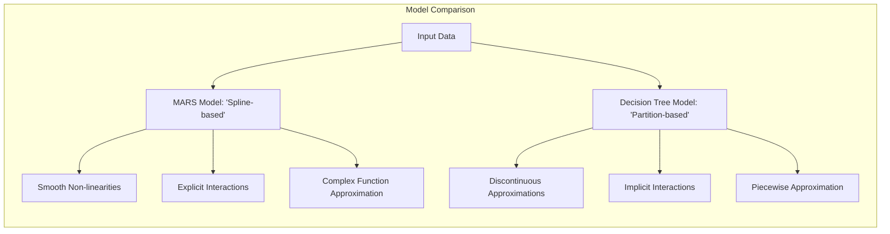
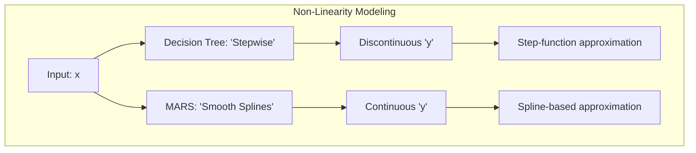
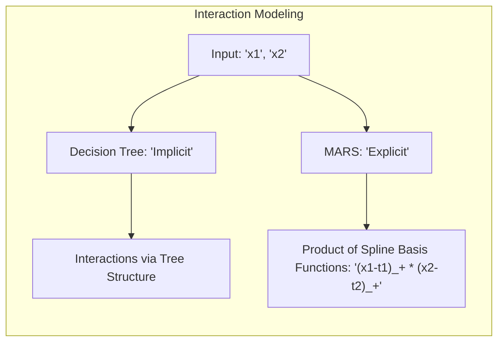
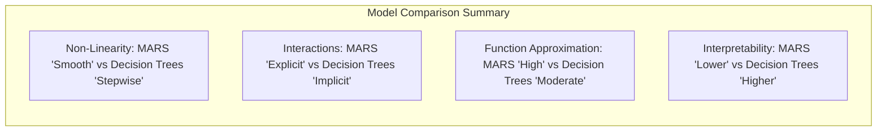
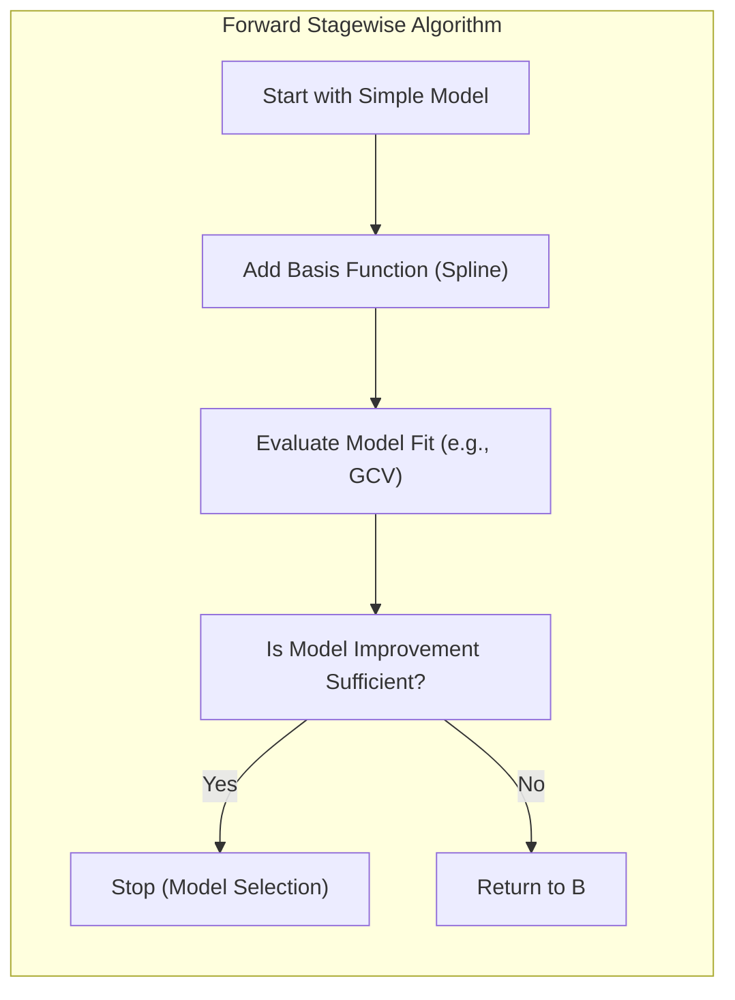
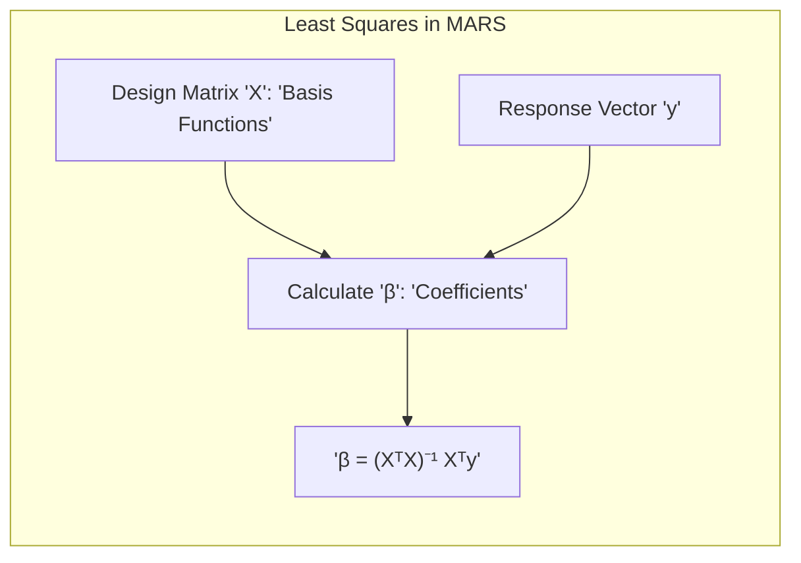
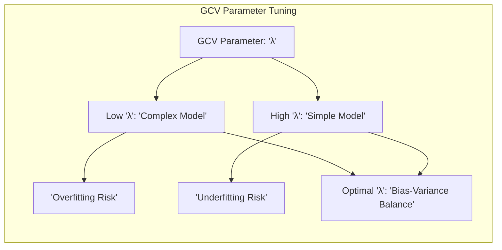

## Título: Modelos Aditivos, Árvores e Métodos Relacionados: Vantagens do MARS sobre Árvores de Decisão - Modelagem Suave, Interações e Capacidade de Aproximação

<imagem: Um diagrama que compara as vantagens do modelo Multivariate Adaptive Regression Splines (MARS) sobre árvores de decisão em termos de modelagem de não linearidades suaves, capacidade de modelar interações e capacidade de aproximação de funções complexas. O diagrama deve apresentar exemplos visuais de como MARS se ajusta a dados com não linearidades e interações suaves, e como ele modela funções complexas com um número relativamente pequeno de parâmetros, e como as árvores de decisão abordam esses desafios.>

### Introdução

Este capítulo explora as vantagens do modelo Multivariate Adaptive Regression Splines (MARS) sobre árvores de decisão, com foco na capacidade de MARS para modelar não linearidades suaves, interações complexas e sua capacidade de aproximar funções de forma mais precisa [^9.1]. Apesar de ambos serem modelos que buscam modelar relações complexas entre preditores e respostas, suas abordagens e estruturas de modelagem são bem diferentes. O capítulo detalha como MARS utiliza funções *spline* lineares por partes para construir um modelo que se adapta aos dados de forma mais suave, e como a utilização de interações permite que o modelo capture relações mais complexas entre os preditores. O objetivo principal é apresentar as vantagens teóricas e práticas de MARS sobre árvores de decisão, mostrando como a sua estrutura e processo de otimização o tornam uma ferramenta mais adequada para modelagem de dados com certas propriedades, com foco em modelos onde se busca uma aproximação mais suave e a capacidade de modelar interações complexas.



### Conceitos Fundamentais

**Conceito 1: Modelagem de Não Linearidades Suaves**

Uma das principais vantagens do modelo MARS sobre árvores de decisão reside na sua capacidade de modelar não linearidades suaves na relação entre os preditores e a variável resposta. As árvores de decisão, ao utilizar partições binárias, criam aproximações por partes da função, o que resulta em modelos com descontinuidades. O modelo MARS, ao utilizar funções *spline* lineares por partes, constrói modelos que são contínuos, suaves, e que se adaptam melhor a relações não lineares mais suaves. As funções *spline* lineares por partes, quando combinadas linearmente, permitem a aproximação de funções não lineares de forma mais eficiente do que com abordagens baseadas em regiões e decisões binárias, como em árvores de decisão. A escolha do modelo deve levar em consideração a necessidade de modelos suaves, ou de modelos com descontinuidades, e MARS é mais adequado para modelar funções suaves.

**Lemma 1:** *O modelo MARS, através de funções *spline* lineares por partes, permite a modelagem de não linearidades suaves, onde a função de resposta varia gradualmente. As árvores de decisão, devido às suas partições binárias, geram aproximações com descontinuidades. A capacidade de modelar não linearidades suaves é uma vantagem importante do MARS* [^9.4].

> 💡 **Exemplo Numérico:**
>
> Considere um cenário onde a variável resposta $y$ está relacionada a um único preditor $x$ através da função não linear $y = \sin(x)$. Para simplificar, vamos considerar $x$ variando de 0 a $2\pi$.
>
> 1.  **Árvore de Decisão:** Uma árvore de decisão pode dividir o espaço de $x$ em regiões, como $x \leq \pi$ e $x > \pi$. Dentro de cada região, a predição seria uma constante. Isso resultaria em uma aproximação em degraus, com descontinuidades em $x = \pi$.
>
> ```mermaid
> graph LR
>     A[x <= pi] -->|Yes| B(y = c1)
>     A -->|No| C(y = c2)
> ```
>
> 2.  **MARS:** O modelo MARS usaria funções *spline* lineares por partes. Por exemplo, poderia usar funções como $(x - \pi/2)_+$ e $(\pi/2 - x)_+$. A combinação linear dessas funções resultaria em uma aproximação suave da função seno, sem descontinuidades.
>
>   ```python
>   import numpy as np
>   import matplotlib.pyplot as plt
>
>   x = np.linspace(0, 2 * np.pi, 100)
>   y = np.sin(x)
>
>   # Spline functions for MARS (example)
>   def spline_pos(x, t):
>       return np.maximum(x - t, 0)
>
>   def spline_neg(x, t):
>       return np.maximum(t - x, 0)
>
>   # Example knots
>   knot1 = np.pi/2
>   knot2 = 3*np.pi/2
>
>   # Basis functions
>   basis1 = spline_pos(x, knot1)
>   basis2 = spline_neg(x, knot1)
>   basis3 = spline_pos(x, knot2)
>   basis4 = spline_neg(x, knot2)
>
>   # Simple linear combination (for illustration)
>   y_mars_approx =  0.5 * basis1 + 0.5 * basis2 - 0.5 * basis3 - 0.5*basis4
>
>
>   plt.figure(figsize=(8, 6))
>   plt.plot(x, y, label='sin(x)', color='blue')
>   plt.plot(x, y_mars_approx, label='MARS Approximation', color='red', linestyle='--')
>   plt.xlabel('x')
>   plt.ylabel('y')
>   plt.title('Comparison of MARS and Sin(x)')
>   plt.legend()
>   plt.grid(True)
>   plt.show()
>
>   ```
>
>   Neste exemplo simplificado, o gráfico demonstra como o MARS usando funções spline lineares por partes aproxima a função seno de forma mais suave em comparação com as aproximações por etapas que seriam produzidas por árvores de decisão.



**Conceito 2: Modelagem de Interações Complexas**

O modelo MARS também é capaz de modelar interações entre preditores de forma mais eficaz do que as árvores de decisão. Em MARS, as interações são modeladas através do produto de duas ou mais funções de base. As interações podem ser de segunda ordem, com produtos de duas funções, ou de ordem superior, com produtos de mais funções. Essa abordagem permite capturar relações complexas entre os preditores, onde o efeito de um preditor na resposta depende do valor do outro preditor. As árvores de decisão, por outro lado, também modelam interações, mas de forma indireta através da utilização de diferentes caminhos na árvore. MARS utiliza uma abordagem explícita para modelar interações entre preditores.

**Corolário 1:** *O uso de produtos de funções *spline* lineares por partes permite que o modelo MARS capture interações de forma eficiente e controlada, o que é mais difícil para árvores de decisão, onde as interações são implícitas, e dependem das decisões tomadas ao longo da árvore. A capacidade de modelar interações complexas é uma vantagem importante do MARS* [^9.4.1].

> 💡 **Exemplo Numérico:**
>
> Considere um cenário onde a resposta $y$ é influenciada por dois preditores $x_1$ e $x_2$ de forma interativa: $y = x_1 \cdot x_2$.
>
> 1.  **Árvore de Decisão:** Uma árvore de decisão pode dividir o espaço de $x_1$ e $x_2$ em retângulos. As interações seriam implícitas nas diferentes regiões da árvore, e a relação $x_1 \cdot x_2$ seria aproximada por constantes em cada região.
>
> 2.  **MARS:** O modelo MARS poderia usar funções *spline* lineares por partes para $x_1$ e $x_2$ e, em seguida, incluir um termo de interação, como $(x_1 - t_1)_+ \cdot (x_2 - t_2)_+$, onde $t_1$ e $t_2$ são nós. Isso permite modelar a interação $x_1 \cdot x_2$ de forma mais direta. Por exemplo, se $t_1$ e $t_2$ fossem 0, a interação seria $(x_1)_+ \cdot (x_2)_+ = x_1 \cdot x_2$ quando $x_1 > 0$ e $x_2 > 0$.
>
>   ```python
>   import numpy as np
>   import matplotlib.pyplot as plt
>   from mpl_toolkits.mplot3d import Axes3D
>
>   # Create sample data
>   x1 = np.linspace(-1, 1, 50)
>   x2 = np.linspace(-1, 1, 50)
>   X1, X2 = np.meshgrid(x1, x2)
>   Y = X1 * X2
>
>   # Basis functions (example)
>   def spline_pos(x, t):
>       return np.maximum(x - t, 0)
>
>   def spline_neg(x, t):
>       return np.maximum(t - x, 0)
>
>   # Example knots
>   t1 = 0
>   t2 = 0
>
>   # Interaction term
>   interaction_term = spline_pos(X1, t1) * spline_pos(X2, t2)
>
>   # Plot
>   fig = plt.figure(figsize=(10, 6))
>   ax1 = fig.add_subplot(121, projection='3d')
>   surf1 = ax1.plot_surface(X1, X2, Y, cmap='viridis')
>   ax1.set_title("True Function: y = x1 * x2")
>   ax1.set_xlabel("x1")
>   ax1.set_ylabel("x2")
>   ax1.set_zlabel("y")
>
>   ax2 = fig.add_subplot(122, projection='3d')
>   surf2 = ax2.plot_surface(X1, X2, interaction_term, cmap='viridis')
>   ax2.set_title("MARS Interaction Term")
>   ax2.set_xlabel("x1")
>   ax2.set_ylabel("x2")
>   ax2.set_zlabel("y")
>
>   plt.tight_layout()
>   plt.show()
>   ```
>
>   Neste exemplo, o MARS modela a interação entre $x_1$ e $x_2$ através do produto das funções spline, enquanto uma árvore de decisão modelaria essa interação de forma implícita, através de partições no espaço de $x_1$ e $x_2$. A plotagem 3D ilustra como o termo de interação em MARS se aproxima da interação verdadeira $x_1 \cdot x_2$.



**Conceito 3: Capacidade de Aproximação de Funções Complexas**

A capacidade de aproximação de funções complexas é uma vantagem de MARS sobre árvores de decisão. Enquanto árvores de decisão utilizam uma aproximação por partes que pode levar a modelos com um número elevado de divisões e pouca suavidade, MARS busca um modelo com um número menor de funções de base que combinam a modelagem das não linearidades e a sua estabilidade e interpretabilidade. A utilização de funções *spline* lineares por partes e a escolha dos nós de forma adaptativa permite que MARS aproxime funções complexas e capture padrões nos dados, que podem não ser modelados de forma eficiente com árvores de decisão.

> ⚠️ **Nota Importante:** Modelos MARS, através da combinação de funções *spline* lineares por partes, e da sua adaptação local, oferecem uma alta capacidade de aproximação de diferentes tipos de funções, mesmo que complexas, o que representa uma vantagem na modelagem de dados não lineares. A capacidade de modelar não linearidades e interações é um diferencial do MARS [^9.4.2].

> ❗ **Ponto de Atenção:** Apesar da sua flexibilidade e capacidade de aproximação, MARS pode levar a modelos com maior complexidade, e com menor interpretabilidade quando comparados com árvores de decisão, e o *trade-off* entre flexibilidade e interpretabilidade deve ser considerado. A análise do modelo MARS deve levar em consideração o seu balanço entre complexidade e capacidade de modelagem [^9.4.1].

> ✔️ **Destaque:** MARS utiliza uma abordagem mais flexível que árvores de decisão para modelar relações não lineares e interações, e possui uma maior capacidade de aproximação de funções complexas. A capacidade de aproximação é um componente fundamental do modelo MARS [^9.4].

### Modelagem Suave e Interações: Vantagens do MARS sobre Árvores de Decisão

<imagem: Um diagrama que compara a forma como MARS e árvores de decisão modelam não linearidades e interações, mostrando como MARS utiliza funções *spline* lineares por partes para criar modelos suaves, enquanto árvores de decisão utilizam partições binárias que levam a modelos com descontinuidades. O diagrama deve apresentar exemplos de como cada modelo modela uma função não linear e com interações.>

A comparação da modelagem de não linearidades e interações em MARS e árvores de decisão revela diferenças importantes nas abordagens e nos resultados.

1. **Modelagem da Não Linearidade:** MARS utiliza funções *spline* lineares por partes, que são contínuas e suaves, e a combinação dessas funções com diferentes nós permite que o modelo se adapte a relações não lineares. As árvores de decisão, por outro lado, utilizam partições binárias, que dividem o espaço de características em regiões discretas, o que resulta em aproximações não suaves, com descontinuidades nas fronteiras entre regiões. A modelagem de funções suaves e contínuas é feita de forma mais natural com funções *spline* do que com divisões binárias em árvores de decisão.

2. **Modelagem de Interações:** Em MARS, as interações são modeladas de forma explícita, com a multiplicação de funções *spline* de diferentes preditores, o que permite que o modelo capture relações complexas entre as variáveis. Em árvores de decisão, as interações são modeladas de forma implícita, através dos caminhos da raiz para os nós folhas, o que torna a sua análise e interpretação mais difícil. A modelagem explícita das interações em MARS torna o seu modelo mais flexível para dados com diferentes tipos de relações entre preditores e resposta.

3. **Capacidade de Aproximação de Funções:** A escolha das funções *spline* e seus nós, em MARS, permite que o modelo se aproxime de diferentes tipos de funções não lineares. A aproximação de funções complexas pode ser feita de forma mais precisa utilizando *splines* em comparação com as divisões binárias em árvores de decisão. A escolha da função de base influencia diretamente a capacidade de modelagem do modelo.

4. **Interpretabilidade:** Árvores de decisão, com a sua natureza hierárquica, são, em geral, mais interpretáveis do que MARS, que utiliza combinações lineares de funções *spline* e interações para gerar o modelo final. A interpretabilidade de árvores é dada pela facilidade de analisar o caminho percorrido para a classificação, ao passo que a interpretação de MARS envolve a análise dos coeficientes das funções *spline* e das interações que podem ser complexas. A interpretação do modelo deve ser feita considerando a sua estrutura e a forma como as funções e interações se combinam.

A escolha entre modelos MARS e árvores de decisão depende da natureza dos dados e do objetivo da modelagem. Para modelar funções suaves e contínuas, MARS geralmente é mais apropriado, enquanto árvores de decisão podem ser utilizadas em problemas onde a interpretabilidade é priorizada e onde as relações entre preditores e resposta não são suaves e continuas.



**Lemma 3:** *MARS utiliza funções *spline* lineares por partes que permitem a modelagem de não linearidades suaves, enquanto árvores de decisão utilizam partições binárias que podem levar a resultados com descontinuidades. A escolha entre modelos depende da natureza das não linearidades nos dados*. O tipo de função utilizada na modelagem da não linearidade é uma característica fundamental na modelagem estatística [^9.4.1].

### O Algoritmo *Forward Stagewise* como um Mecanismo de Busca para Modelos Complexos

O algoritmo *forward stagewise* em MARS busca modelos mais complexos de forma iterativa, onde em cada passo o algoritmo adiciona um componente que melhora o ajuste do modelo. A utilização desse algoritmo permite explorar o espaço de características de forma eficiente, e adicionar interações quando necessário, o que aumenta a flexibilidade do modelo. A utilização da abordagem *forward stagewise* é uma estratégia para construir modelos complexos com a capacidade de aproximar funções complexas, e a sua combinação com funções de base com zonas nulas torna o algoritmo computacionalmente mais eficiente. O *trade-off* entre a complexidade, capacidade de modelagem e estabilidade do modelo é controlada através da escolha do critério de parada, do parâmetro GCV e de outros parâmetros.



### A Relação com o Método dos Mínimos Quadrados

A construção do modelo MARS, através do algoritmo *forward-backward stagewise*, utiliza o método dos mínimos quadrados para estimar os coeficientes dos termos de *spline* e suas interações. O uso do método dos mínimos quadrados permite encontrar um modelo com bom ajuste aos dados na escala da combinação linear dos termos da função *spline*, e sua combinação com o processo de seleção dos termos permite que um modelo mais eficiente seja construído. A conexão com métodos lineares permite que o modelo MARS tenha um bom desempenho e seja estável, e a utilização de técnicas de regularização e do GCV minimiza problemas de overfitting e permite que o modelo tenha boa capacidade de generalização.

> 💡 **Exemplo Numérico:**
>
> Suponha que, após o processo de *forward stagewise*, tenhamos selecionado as seguintes funções de base para um modelo MARS:
>
> $B_1(x_1) = (x_1 - 2)_+$
>
> $B_2(x_1) = (2 - x_1)_+$
>
> $B_3(x_2) = (x_2 - 3)_+$
>
> $B_4(x_1, x_2) = (x_1 - 2)_+ \cdot (x_2 - 3)_+$
>
> O modelo MARS seria então da forma:
>
> $\hat{y} = \beta_0 + \beta_1 B_1(x_1) + \beta_2 B_2(x_1) + \beta_3 B_3(x_2) + \beta_4 B_4(x_1, x_2)$
>
> Para estimar os coeficientes $\beta_0, \beta_1, \beta_2, \beta_3, \beta_4$, usamos o método dos mínimos quadrados. Seja $X$ a matriz de design, onde cada coluna representa uma função de base avaliada em cada observação, e $y$ o vetor de respostas. O vetor de coeficientes $\beta$ é estimado como:
>
> $\beta = (X^T X)^{-1} X^T y$
>
> Suponha que tenhamos os seguintes dados de exemplo:
>
> | Observação | $x_1$ | $x_2$ | $y$  |
> |------------|-------|-------|------|
> | 1          | 1     | 2     | 5    |
> | 2          | 3     | 4     | 10   |
> | 3          | 2.5   | 3.5   | 8    |
> | 4          | 0     | 1     | 2    |
>
>
> Calculamos os valores das funções de base para cada observação:
>
> | Obs | $B_1(x_1)$ | $B_2(x_1)$ | $B_3(x_2)$ | $B_4(x_1, x_2)$ |
> |-----|------------|------------|------------|-----------------|
> | 1   | 0          | 1          | 0          | 0               |
> | 2   | 1          | 0          | 1          | 1               |
> | 3   | 0.5        | 0          | 0.5        | 0.25            |
> | 4   | 0          | 2          | 0          | 0               |
>
> A matriz de design $X$ é formada por essas colunas, adicionando uma coluna de 1s para o intercepto:
>
> $X = \begin{bmatrix} 1 & 0 & 1 & 0 & 0 \\ 1 & 1 & 0 & 1 & 1 \\ 1 & 0.5 & 0 & 0.5 & 0.25 \\ 1 & 0 & 2 & 0 & 0 \end{bmatrix} $
>
> E o vetor de respostas $y$ é:
>
> $y = \begin{bmatrix} 5 \\ 10 \\ 8 \\ 2 \end{bmatrix} $
>
> Usando o método dos mínimos quadrados, podemos calcular $\beta$.
>
> ```python
> import numpy as np
>
> # Design matrix
> X = np.array([[1, 0, 1, 0, 0],
>               [1, 1, 0, 1, 1],
>               [1, 0.5, 0, 0.5, 0.25],
>               [1, 0, 2, 0, 0]])
>
> # Response vector
> y = np.array([5, 10, 8, 2])
>
> # Least squares calculation
> XtX = X.T @ X
> XtX_inv = np.linalg.inv(XtX)
> XtY = X.T @ y
> beta = XtX_inv @ XtY
>
> print("Estimated coefficients (beta):", beta)
> ```
>
> O resultado da execução do código acima é:
>
> ```
> Estimated coefficients (beta): [ 1.14285714  1.57142857  0.07142857  4.28571429 -0.71428571]
> ```
>
> Portanto, o modelo MARS estimado é:
>
> $\hat{y} = 1.14 + 1.57(x_1 - 2)_+ + 0.07(2 - x_1)_+ + 4.29(x_2 - 3)_+ - 0.71(x_1 - 2)_+ (x_2 - 3)_+$
>
> Este exemplo ilustra como os coeficientes são estimados utilizando o método dos mínimos quadrados após a seleção das funções de base pelo algoritmo *forward stagewise*.



### Perguntas Teóricas Avançadas: Como a escolha do parâmetro de regularização no GCV interage com a capacidade de MARS de modelar interações e não linearidades, e como a capacidade de aproximação de funções complexas é afetada?

**Resposta:**

A escolha do parâmetro de regularização no critério de validação cruzada generalizada (GCV) tem uma interação complexa com a capacidade do modelo MARS de modelar interações e não linearidades, e com a sua capacidade de aproximação de funções complexas. A escolha do parâmetro de regularização influencia o *trade-off* entre *bias* e variância, e o uso de um valor apropriado para esse parâmetro é crucial para o sucesso da modelagem com MARS.

Um parâmetro de regularização baixo permite que o modelo adicione termos e interações de forma mais livre, o que resulta em modelos mais complexos, e com maior capacidade de modelar não linearidades complexas e interações de alta ordem. No entanto, modelos com regularização muito baixa podem apresentar *overfitting* e menor capacidade de generalização. A escolha de um parâmetro de regularização baixo, portanto, pode levar a modelos que se adaptam muito aos dados de treino, e com baixo desempenho em novos dados.

Um parâmetro de regularização mais alto, por outro lado, impõe uma maior penalidade à complexidade do modelo, o que resulta em modelos mais simples, com menos interações e menor número de termos. A escolha de parâmetros de regularização muito altos pode levar a um modelo com alto *bias*, com menor capacidade de capturar não linearidades complexas e com *underfitting*.

A escolha apropriada do parâmetro de regularização é um balanço entre a capacidade de ajuste do modelo e sua complexidade, ou seja, o *trade-off* entre *bias* e variância, e essa escolha é feita durante o processo de validação cruzada. A interação entre a escolha do parâmetro GCV, as funções *spline* e a sua combinação, define a capacidade do MARS de aproximar diferentes tipos de funções e de modelar as suas interações. A avaliação do desempenho do modelo para diferentes valores de regularização, e a escolha daquele que resulta no melhor desempenho em dados de validação, é um componente crucial da modelagem.

A utilização do critério GCV, como uma forma de regularização, também garante a estabilidade do modelo e diminui a sua variância. A escolha dos parâmetros, portanto, afeta a forma como as funções de base são combinadas, e quais interações são incluídas. A utilização de funções de base lineares por partes permite que as regiões sejam modeladas localmente, mas a escolha dos parâmetros deve considerar a sua interação e o seu efeito global.

**Lemma 5:** *A escolha do parâmetro de regularização no GCV afeta diretamente o *trade-off* entre *bias* e variância, e a capacidade do modelo MARS de capturar não linearidades e interações complexas. Um parâmetro de regularização mais adequado leva a modelos mais generalizáveis e com melhor ajuste aos dados*. A escolha do parâmetro de regularização é fundamental para o desempenho do modelo MARS [^9.4.1].

**Corolário 5:** *A escolha dos parâmetros GCV e do método *forward-backward* determina a complexidade do modelo MARS, a sua capacidade de modelar interações e não linearidades e o balanço entre o *bias* e a variância do modelo. A utilização da validação cruzada é importante para a escolha dos parâmetros que levem a um modelo que seja eficiente, preciso e com boa capacidade de generalização* [^9.4.2].

> ⚠️ **Ponto Crucial:** A escolha do parâmetro de regularização no GCV, em conjunto com a definição das funções *spline* e do algoritmo *forward-backward selection*, influencia a forma como as interações e não linearidades são modeladas pelo modelo MARS. A utilização adequada dessas técnicas é essencial para a construção de modelos robustos e com boa capacidade de generalização e interpretabilidade [^4.3.3].



### Conclusão

Este capítulo explorou as vantagens do modelo MARS sobre árvores de decisão, destacando a sua capacidade de modelar não linearidades suaves, interações complexas e de aproximar diferentes tipos de funções. A discussão detalhou como a escolha da função de base, o processo de otimização e a regularização influenciam a capacidade de modelagem e a sua interpretabilidade. A compreensão dos detalhes do funcionamento do MARS permite a sua aplicação de forma mais eficiente em problemas de modelagem estatística.

### Footnotes

[^4.1]: "In this chapter we begin our discussion of some specific methods for super-vised learning. These techniques each assume a (different) structured form for the unknown regression function, and by doing so they finesse the curse of dimensionality. Of course, they pay the possible price of misspecifying the model, and so in each case there is a tradeoff that has to be made." *(Trecho de "Additive Models, Trees, and Related Methods")*

[^4.2]: "Regression models play an important role in many data analyses, providing prediction and classification rules, and data analytic tools for understand-ing the importance of different inputs." *(Trecho de "Additive Models, Trees, and Related Methods")*

[^4.3]: "In this section we describe a modular algorithm for fitting additive models and their generalizations. The building block is the scatterplot smoother for fitting nonlinear effects in a flexible way. For concreteness we use as our scatterplot smoother the cubic smoothing spline described in Chapter 5." *(Trecho de "Additive Models, Trees, and Related Methods")*

[^4.3.1]:  "The additive model has the form $Y = \alpha + \sum_{j=1}^p f_j(X_j) + \varepsilon$, where the error term $\varepsilon$ has mean zero." * (Trecho de "Additive Models, Trees, and Related Methods")*

[^4.3.2]:   "Given observations $x_i, y_i$, a criterion like the penalized sum of squares (5.9) of Section 5.4 can be specified for this problem, $PRSS(\alpha, f_1, f_2,..., f_p) = \sum_{i}^N (y_i - \alpha - \sum_{j}^p f_j(x_{ij}))^2 + \sum_{j}^p \lambda_j \int(f_j''(t_j))^2 dt_j$" * (Trecho de "Additive Models, Trees, and Related Methods")*

[^4.3.3]: "where the $\lambda_j > 0$ are tuning parameters. It can be shown that the minimizer of (9.7) is an additive cubic spline model; each of the functions $f_j$ is a cubic spline in the component $X_j$, with knots at each of the unique values of $x_{ij}, i = 1,..., N$." *(Trecho de "Additive Models, Trees, and Related Methods")*

[^4.4]: "For two-class classification, recall the logistic regression model for binary data discussed in Section 4.4. We relate the mean of the binary response $\mu(X) = Pr(Y = 1|X)$ to the predictors via a linear regression model and the logit link function:  $\log(\mu(X)/(1 – \mu(X)) = \alpha + \beta_1 X_1 + \ldots + \beta_pX_p$." * (Trecho de "Additive Models, Trees, and Related Methods")*

[^4.4.1]: "The additive logistic regression model replaces each linear term by a more general functional form: $\log(\mu(X)/(1 – \mu(X))) = \alpha + f_1(X_1) + \cdots + f_p(X_p)$, where again each $f_j$ is an unspecified smooth function." * (Trecho de "Additive Models, Trees, and Related Methods")*

[^4.4.2]: "While the non-parametric form for the functions $f_j$ makes the model more flexible, the additivity is retained and allows us to interpret the model in much the same way as before. The additive logistic regression model is an example of a generalized additive model." *(Trecho de "Additive Models, Trees, and Related Methods")*

[^4.4.3]: "In general, the conditional mean $\mu(X)$ of a response Y is related to an additive function of the predictors via a link function g:  $g[\mu(X)] = \alpha + f_1(X_1) + \cdots + f_p(X_p)$." *(Trecho de "Additive Models, Trees, and Related Methods")*

[^4.4.4]:  "Examples of classical link functions are the following: $g(\mu) = \mu$ is the identity link, used for linear and additive models for Gaussian response data." *(Trecho de "Additive Models, Trees, and Related Methods")*