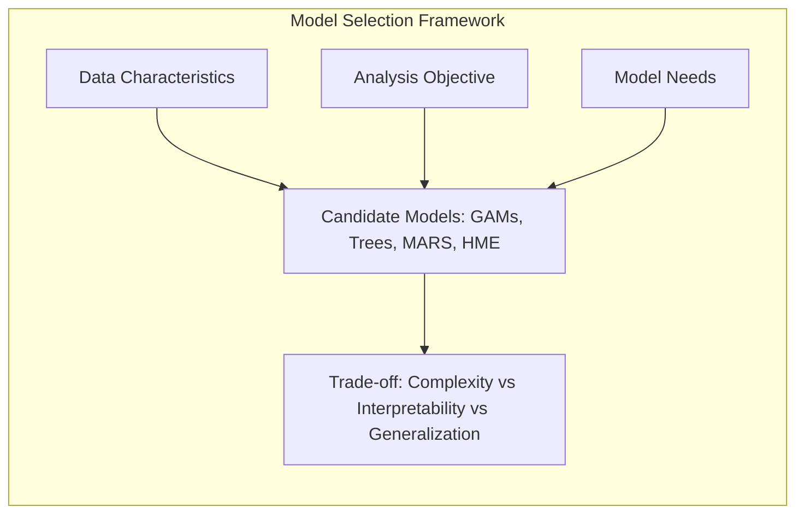
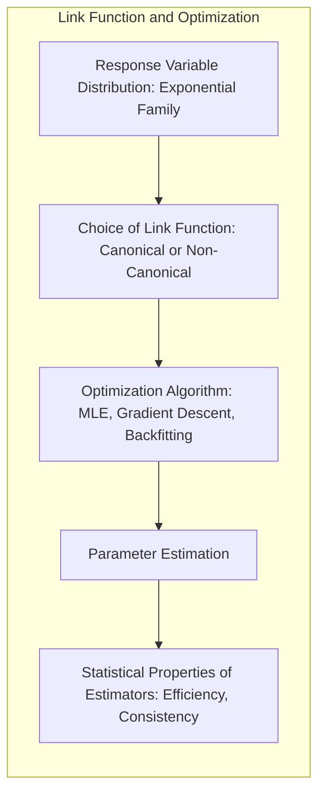
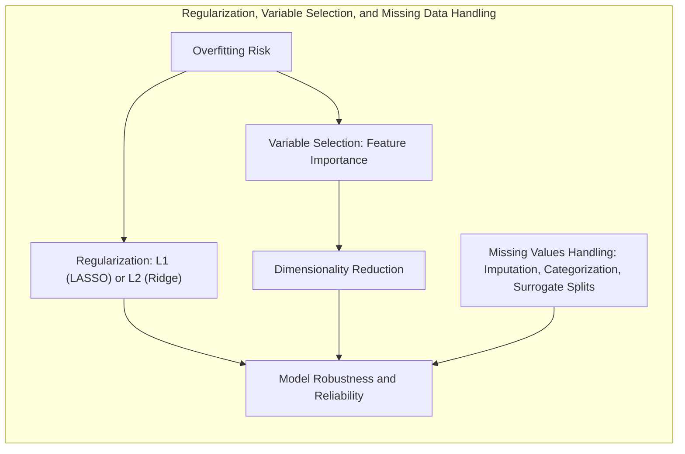
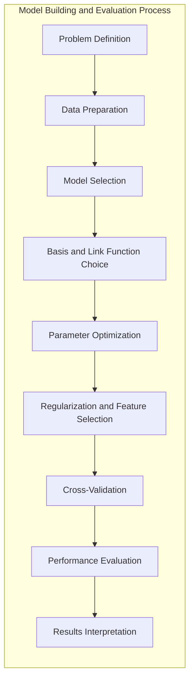
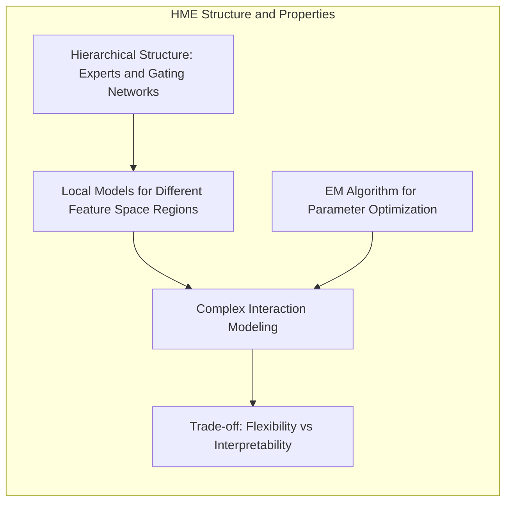

## Título: Modelos Aditivos, Árvores e Métodos Relacionados: Resumo Integrativo e Escolhas para Modelagem Estatística Avançada

### Introdução

Este capítulo finaliza a exploração dos Modelos Aditivos Generalizados (GAMs), árvores de decisão, Multivariate Adaptive Regression Splines (MARS) e misturas hierárquicas de especialistas (HME) através de um resumo abrangente que integra todos os conceitos e abordagens discutidas nos capítulos anteriores [^9.1]. O objetivo principal é fornecer um guia para a escolha de modelos, métodos de otimização, técnicas de regularização e tratamento de dados, considerando o *trade-off* entre complexidade, interpretabilidade e capacidade de generalização. O capítulo também destaca a importância da teoria estatística, da avaliação do desempenho e da necessidade de uma escolha cuidadosa de modelos que sejam adequados para cada problema. Ao final deste capítulo, espera-se que o leitor tenha uma visão integrada sobre a aplicação de modelos de aprendizado supervisionado para a modelagem de dados complexos.

### Conceitos Fundamentais

**Conceito 1: A Escolha do Modelo: GAMs, Árvores de Decisão, MARS ou HME?**

A escolha do modelo de aprendizado supervisionado (GAMs, árvores de decisão, MARS ou HME) é um passo crucial, e depende da natureza dos dados, do objetivo da análise, e das necessidades específicas do problema. Modelos lineares são mais adequados para dados com relações lineares, enquanto GLMs (Modelos Lineares Generalizados) podem ser utilizados para dados com diferentes distribuições da família exponencial.  GAMs são adequados para modelar relações não lineares suaves.  Árvores de decisão são utilizadas em problemas onde se prioriza a interpretabilidade e a modelagem de interações de forma hierárquica e *local*. Modelos MARS oferecem flexibilidade na modelagem de não linearidades com funções *spline* lineares por partes e HME são utilizados para problemas com grande complexidade e dados com distribuições variadas.  A escolha do modelo deve levar em consideração o *trade-off* entre capacidade de modelagem, interpretabilidade e capacidade de generalização.

**Lemma 1:** *A escolha do modelo de aprendizado supervisionado (GAMs, árvores, MARS e HME) depende da natureza dos dados, do objetivo da modelagem, e das necessidades específicas do problema. A escolha do modelo deve considerar o seu balanço entre flexibilidade, interpretabilidade e capacidade de generalização* [^9.1].

> 💡 **Exemplo Numérico:**
>
> Imagine que você está modelando o preço de casas.
>
> *   **Dados Lineares:** Se o preço da casa aumentar linearmente com o número de quartos, um modelo de regressão linear simples pode ser suficiente.
>
> *   **Dados Não Lineares:** Se o preço da casa aumentar rapidamente com o tamanho até um certo ponto, e depois se estabilizar, um GAM com uma função spline para o tamanho da casa seria mais adequado.
>
> *   **Interações Complexas:** Se o preço da casa depender de interações complexas entre o bairro e o tamanho, uma árvore de decisão ou um modelo MARS poderia capturar essas interações.
>
> *   **Dados Heterogêneos:** Se o mercado imobiliário tiver diferentes regiões com dinâmicas de preço distintas, um HME poderia modelar essas diferenças com "especialistas" para cada região.

**Conceito 2: Funções de Ligação, Família Exponencial e Otimização**

A escolha da função de ligação e a sua relação com a família exponencial influencia a forma como a variável resposta é modelada e como o algoritmo de otimização é utilizado. Funções de ligação canônicas, derivadas da família exponencial, facilitam a otimização e garantem boas propriedades estatísticas dos estimadores, especialmente em modelos lineares generalizados (GLMs) e Modelos Aditivos Generalizados (GAMs).  A utilização de métodos de otimização, como o método dos mínimos quadrados, máxima verossimilhança, gradiente descendente, ou algoritmo de *backfitting*, depende da natureza da função de custo e do tipo de modelo, sendo que a escolha do método de otimização deve considerar a sua capacidade de lidar com a convexidade e complexidade da função de custo e com a necessidade de um modelo com boa capacidade de generalização.

**Corolário 1:** *A escolha da função de ligação e da família exponencial, juntamente com o método de otimização, é importante para que o modelo seja construído de forma eficiente e que os seus parâmetros sejam estimados de forma apropriada. A utilização das funções de ligação canônicas facilita a otimização e garante boas propriedades assintóticas para os estimadores* [^4.4.1], [^4.4.2], [^4.4.3].

> 💡 **Exemplo Numérico:**
>
> Suponha que estamos modelando o número de clientes que visitam uma loja em um dia.
>
> *   **Dados de Contagem:** Como o número de clientes é um dado de contagem (inteiro e não negativo), a distribuição de Poisson é apropriada. A função de ligação canônica para a distribuição de Poisson é o logaritmo.
>
> *   **GLM com Poisson:** Um GLM com função de ligação logarítmica modelaria o logaritmo do número esperado de clientes como uma combinação linear de preditores.  Por exemplo, se $Y_i$ é o número de clientes no dia $i$, e $X_i$ é um vetor de preditores (como dia da semana, feriado, etc.), então:
>     $log(E[Y_i]) = \beta_0 + \beta_1 X_{i1} + \beta_2 X_{i2} + \ldots$
>
> *   **Otimização:** O algoritmo de otimização (como máxima verossimilhança) estimaria os parâmetros $\beta_0, \beta_1, \beta_2, \ldots$ que melhor ajustam os dados, garantindo que as propriedades estatísticas sejam válidas.
>
> *   **Função de Ligação:** A função de ligação logarítmica garante que a média prevista seja sempre positiva, o que é coerente com a natureza dos dados de contagem.

**Conceito 3: Regularização, Seleção de Variáveis e Tratamento de Valores Ausentes**

A regularização, através de penalidades como L1 (LASSO) ou L2 (Ridge), é utilizada para controlar a complexidade do modelo e evitar o *overfitting*.  A seleção de variáveis é utilizada para escolher os preditores mais relevantes e reduzir a dimensionalidade do problema, e a sua combinação com métodos de regularização pode gerar modelos mais parcimoniosos e com boa capacidade de generalização.  A forma como valores ausentes são tratados (imputação, criação de categorias ou *surrogate splits*) influencia a capacidade do modelo de lidar com dados reais e como a informação da ausência do dado é considerada na modelagem. A escolha de abordagens adequadas para controlar a complexidade do modelo e lidar com valores ausentes é crucial para a construção de modelos robustos e confiáveis [^4.5.2], [^9.6].

> 💡 **Exemplo Numérico:**
>
> Imagine que estamos modelando o desempenho de um aluno com base em várias características (horas de estudo, frequência, notas anteriores, etc.).
>
> *   **Overfitting:** Um modelo sem regularização pode usar todas as características, incluindo algumas que não são relevantes, resultando em *overfitting* (bom ajuste nos dados de treinamento, mas mau desempenho em dados novos).
>
> *   **Regularização L1 (LASSO):** A regularização L1 pode forçar os coeficientes de algumas características a serem exatamente zero, efetivamente removendo-as do modelo e simplificando-o. Por exemplo, se o modelo original fosse:
>     $Desempenho = \beta_0 + \beta_1 \cdot HorasEstudo + \beta_2 \cdot Frequencia + \beta_3 \cdot NotasAnteriores + \beta_4 \cdot Hobby$
>     Com L1, $\beta_4$ poderia ser forçado a zero se "Hobby" não fosse relevante.
>
> *   **Regularização L2 (Ridge):** A regularização L2 encolhe os coeficientes em direção a zero, mas raramente os torna exatamente zero. Isso pode ajudar a reduzir a influência de características menos importantes.
>
> *   **Valores Ausentes:** Se alguns alunos não tiverem informações sobre "NotasAnteriores", poderíamos imputar a média das notas anteriores, criar uma categoria para "NotasAnteriores Ausentes", ou usar *surrogate splits* em árvores de decisão para lidar com a ausência.
>
> *   **Resultados:** Um modelo com regularização e tratamento adequado de valores ausentes terá melhor desempenho em dados novos e será mais robusto.

> ⚠️ **Nota Importante:** A escolha das funções de ligação, métricas de avaliação, algoritmos de otimização, e métodos de regularização, são componentes que interagem na construção do modelo, e a escolha adequada dessas técnicas garante que o modelo tenha um bom desempenho, capacidade de generalização e que os parâmetros possam ser estimados de forma eficiente [^4.4.4].

> ❗ **Ponto de Atenção:** A escolha das técnicas de regularização e seleção de variáveis, e a forma como os dados ausentes são tratados, podem variar dependendo da natureza do modelo e das características dos dados, e a sua escolha deve ser feita considerando o *trade-off* entre a flexibilidade, interpretabilidade e capacidade de generalização [^4.5.1], [^4.5.2].

> ✔️ **Destaque:** A escolha apropriada de cada componente do modelo e a forma como eles interagem é um aspecto fundamental na modelagem estatística e na obtenção de modelos robustos e com boa capacidade preditiva e interpretativa [^4.4.5].

### Abordagens para Construção e Avaliação de Modelos: Um Resumo Integrativo

A metodologia para a construção e avaliação de modelos de aprendizado supervisionado envolve um conjunto de passos que, combinados, permitem a construção de modelos robustos e com alta capacidade preditiva:

1.  **Definição do Problema:** O primeiro passo envolve a definição clara do problema de modelagem, o tipo de dados, e os objetivos a serem atingidos. A escolha do modelo depende da natureza da variável resposta, e do objetivo da modelagem.
2.  **Preparação dos Dados:** Os dados devem ser limpos, transformados e selecionados, com o objetivo de garantir uma base de dados de alta qualidade para o modelo. A escolha de técnicas de imputação para dados ausentes e tratamento de *outliers* é importante para a qualidade do modelo final.
3. **Escolha do Modelo:**  A escolha do modelo depende da natureza dos dados e do objetivo da modelagem, e deve considerar a necessidade de modelos com maior ou menor flexibilidade. Modelos mais simples são adequados para relações lineares ou aproximadamente lineares, enquanto que modelos mais complexos são necessários para modelar não linearidades complexas e interações entre preditores.
4.  **Escolha das Funções de Base e de Ligação:** As funções de base e função de ligação são utilizadas para modelar a relação entre preditores e resposta. A escolha das funções de base depende do modelo e da necessidade de modelar funções suaves ou com descontinuidades, e a escolha da função de ligação depende da distribuição da variável resposta.
5.  **Otimização dos Parâmetros:** Os parâmetros do modelo são estimados através de métodos de otimização como o método dos mínimos quadrados, máxima verossimilhança, gradiente descendente, algoritmo de backfitting ou métodos iterativos apropriados. A escolha do método de otimização afeta o custo computacional e a convergência para uma solução estável.
6. **Regularização e Seleção de Variáveis:** Técnicas de regularização, como L1 e L2, são utilizadas para controlar a complexidade dos modelos e evitar *overfitting*. Métodos de seleção de variáveis são utilizados para escolher um subconjunto de preditores mais relevantes, o que diminui a complexidade e aumenta a interpretabilidade do modelo.
7.  **Validação Cruzada:** Métodos de validação cruzada são utilizados para avaliar a capacidade de generalização do modelo, e para a escolha dos melhores parâmetros de regularização e suavização. A validação cruzada é utilizada para estimar o desempenho do modelo em dados não vistos.
8.   **Avaliação do Desempenho do Modelo:** A avaliação do desempenho do modelo é feita com métricas apropriadas para o tipo de problema, como o erro de classificação, sensibilidade e especificidade para problemas de classificação, ou o erro quadrático médio (MSE) para problemas de regressão.
9.  **Interpretação dos Resultados:** As decisões do modelo, sua estrutura, e os seus parâmetros são avaliados com o objetivo de entender como o modelo funciona e como ele modela as relações nos dados, assim como as vantagens e limitações de cada modelo.

A combinação de todos esses componentes permite criar modelos estatísticos com um bom balanço entre a sua capacidade de ajuste aos dados e sua capacidade de generalização, que é o principal objetivo da modelagem estatística.

### O *Trade-off* entre Flexibilidade e Interpretabilidade e a Escolha do Melhor Modelo

A escolha do melhor modelo depende do *trade-off* entre flexibilidade e interpretabilidade, e também da sua capacidade de generalização e outros aspectos práticos, como a sua complexidade computacional. Modelos mais flexíveis, como modelos MARS e HME, podem apresentar um desempenho superior em dados complexos, mas também podem ser mais difíceis de interpretar, enquanto modelos mais simples, como árvores de decisão, são mais interpretáveis, mas podem ter dificuldade em modelar relações não lineares complexas. Modelos GAMs representam um bom equilíbrio entre flexibilidade e interpretabilidade, através de abordagens semi-paramétricas para a modelagem dos dados. O conhecimento das vantagens e limitações de cada modelo permite que a escolha do método de modelagem seja feita de forma apropriada, levando em consideração o contexto do problema.

> 💡 **Exemplo Numérico:**
>
> Considere o seguinte cenário:
>
> *   **Modelo Simples (Regressão Linear):** Um modelo linear simples é fácil de interpretar, pois cada coeficiente representa o efeito de uma variável. Por exemplo, o modelo $y = \beta_0 + \beta_1 x_1 + \beta_2 x_2$ indica que um aumento em $x_1$ por uma unidade aumenta $y$ por $\beta_1$ unidades. Este modelo é altamente interpretável, mas pode não capturar relações complexas nos dados.
>
> *   **Modelo Complexo (MARS):** Um modelo MARS pode ajustar não linearidades e interações complexas, mas a interpretação dos resultados pode ser mais difícil. Por exemplo, o modelo pode ter várias funções *spline* que interagem, tornando a interpretação do efeito de cada variável menos direta.
>
> *   **Trade-off:** A escolha entre um modelo simples e um modelo complexo depende do objetivo. Se a interpretabilidade for crucial (por exemplo, em um estudo médico), um modelo linear pode ser preferível. Se a precisão da previsão for mais importante (por exemplo, em um sistema de recomendação), um modelo mais complexo pode ser necessário.
>
> *   **GAMs:** Modelos GAMs oferecem um bom balanço, permitindo modelar relações não lineares suavemente, mantendo um certo nível de interpretabilidade.  Por exemplo, um GAM pode modelar a relação entre uma variável e a resposta com uma função spline, que é mais interpretável do que um modelo *black box*.

### Limitações dos Modelos e Direções Futuras na Pesquisa

Modelos estatísticos são aproximações da realidade, e todos eles apresentam limitações. Modelos lineares são limitados pela sua incapacidade de modelar não linearidades, modelos aditivos têm limitações na modelagem de interações complexas, e árvores de decisão podem apresentar instabilidade. Modelos como MARS e HME, embora mais flexíveis, apresentam um custo computacional e interpretativo maior.  A busca por modelos mais flexíveis, mais interpretáveis, e com maior capacidade de generalização é um campo de pesquisa ativa na área da modelagem estatística, e o conhecimento das limitações dos modelos atuais é importante para a criação de novas abordagens e para a evolução da área.  O uso de métodos que combinam diferentes modelos, como o *boosting*, oferece uma alternativa para obter modelos com mais capacidade de modelagem e com melhor capacidade de generalização.

### Perguntas Teóricas Avançadas: Como a estrutura hierárquica, os métodos de otimização, e a capacidade de modelagem de interações dos modelos HME, se relacionam com a capacidade de generalização e a interpretabilidade dos resultados, e quais as limitações dessa abordagem?

**Resposta:**

A estrutura hierárquica, os métodos de otimização e a capacidade de modelagem de interações dos modelos HME (Hierarchical Mixtures of Experts) afetam de maneira significativa a sua capacidade de generalização e interpretabilidade, o que deve ser cuidadosamente avaliado em aplicações de modelagem estatística.

The hierarchical structure of HME allows for modeling the feature space through different local models (experts) that are combined hierarchically. This structure allows different regions of the feature space to be modeled with specific models, which increases modeling capacity and flexibility. However, the complexity of the hierarchical structure makes its interpretability difficult, since the contribution of each model and the influence of the predictors in each local model is more difficult to analyze. HME models can generate good predictions, but their interpretability is more complex compared to other models.

Os métodos de otimização utilizados em HME são baseados no algoritmo EM, que busca a convergência dos parâmetros através de um processo iterativo que intercala etapas de Expectation e Maximização. O algoritmo EM, no entanto, pode convergir para um mínimo local e a escolha da inicialização dos parâmetros pode influenciar o resultado final do modelo. Modelos HME, por serem mais flexíveis e com um grande número de parâmetros, têm maior risco de overfitting, e a utilização de regularização e métodos de validação cruzada é importante para lidar com essa limitação.

A capacidade de modelar interações em HME é feita através das redes de *gating* e da escolha dos modelos especialistas, e esta abordagem permite modelar diferentes tipos de interações entre os preditores, mesmo que a sua análise seja mais difícil devido à complexidade do modelo.  A escolha do modelo e dos seus componentes influencia a sua capacidade de generalização.  Modelos com alta complexidade podem ter overfitting, e a combinação de modelos locais, embora flexível, pode levar a uma modelagem menos precisa em certas situações, e a interpretação do modelo pode se tornar mais difícil.

> 💡 **Exemplo Numérico:**
>
> Imagine que você está modelando o comportamento de compra de clientes em uma loja online.
>
> *   **Estrutura Hierárquica:** Um modelo HME pode ter diferentes "especialistas" para diferentes tipos de clientes (por exemplo, clientes que compram eletrônicos, clientes que compram roupas, etc.). A rede de *gating* decide qual especialista deve ser ativado com base nas características do cliente.
>
> *   **Complexidade:** A estrutura hierárquica torna difícil entender o efeito de cada variável no comportamento de compra geral. Você pode saber o que influencia a compra de eletrônicos, mas a influência geral é uma combinação ponderada dos especialistas.
>
> *   **Otimização:** O algoritmo EM ajusta os parâmetros de cada especialista e da rede de *gating* iterativamente. O resultado pode depender da inicialização dos parâmetros e pode convergir para um mínimo local.
>
> *   **Interações:** A rede de *gating* pode capturar interações complexas entre as variáveis. Por exemplo, a propensão a comprar eletrônicos pode depender da idade e da renda, que são modelados pela rede de *gating*.
>
> *   **Limitações:** A complexidade do HME pode levar a *overfitting* se não for controlada com regularização e validação cruzada. Além disso, a interpretação dos resultados é um desafio devido à estrutura hierárquica e à interação entre especialistas.

**Lemma 5:** *A estrutura hierárquica do modelo, os métodos de otimização e a capacidade de modelar interações do modelo HME influenciam a sua capacidade de generalização e interpretabilidade. Modelos HME são complexos e a escolha de seus componentes e a interpretação de seus resultados exige cuidado, e podem levar a modelos muito flexíveis, mas com menor interpretabilidade e com risco de overfitting*.  A avaliação do *trade-off* entre flexibilidade e interpretabilidade é importante para a construção de modelos HME [^4.5.1], [^4.5.2].

**Corolário 5:** *A escolha dos componentes de modelos HME, incluindo o número de especialistas, a forma como os modelos são combinados e os métodos de otimização utilizados, têm um impacto direto na capacidade de generalização e na interpretabilidade dos resultados.  A utilização de técnicas de regularização e validação cruzada é importante para garantir a construção de modelos robustos e confiáveis*. A escolha do modelo e de seus componentes, portanto, deve ser feita de forma adequada, considerando o objetivo da modelagem e a natureza dos dados [^4.4.1], [^4.4.3].

> ⚠️ **Ponto Crucial**: Modelos HME são mais adequados para dados complexos onde as relações entre preditores e resposta variam em diferentes regiões do espaço de características, mas a sua complexidade e a dificuldade de interpretação dos seus resultados exige a utilização de métodos de avaliação cuidadosos. A escolha do modelo e de seus componentes deve considerar o balanço entre a capacidade de modelagem e a interpretabilidade, e o seu impacto na capacidade de generalização e estabilidade [^4.4.5].

### Conclusão

Este capítulo apresentou um resumo dos principais conceitos, métodos e abordagens discutidos ao longo do documento, com foco nas decisões de modelagem, no *trade-off* entre flexibilidade e interpretabilidade, na escolha das métricas de desempenho e nos algoritmos de otimização.  A compreensão das propriedades de modelos como GAMs, árvores de decisão, MARS e HME permite construir modelos estatísticos que sejam adequados a cada tipo de dados e com boa capacidade de modelagem e generalização.

### Footnotes

[^4.1]: "In this chapter we begin our discussion of some specific methods for super-vised learning. These techniques each assume a (different) structured form for the unknown regression function, and by doing so they finesse the curse of dimensionality. Of course, they pay the possible price of misspecifying the model, and so in each case there is a tradeoff that has to be made." *(Trecho de "Additive Models, Trees, and Related Methods")*

[^4.2]: "Regression models play an important role in many data analyses, providing prediction and classification rules, and data analytic tools for understand-ing the importance of different inputs." *(Trecho de "Additive Models, Trees, and Related Methods")*

[^4.3]: "In this section we describe a modular algorithm for fitting additive models and their generalizations. The building block is the scatterplot smoother for fitting nonlinear effects in a flexible way. For concreteness we use as our scatterplot smoother the cubic smoothing spline described in Chapter 5." *(Trecho de "Additive Models, Trees, and Related Methods")*

[^4.3.1]:  "The additive model has the form $Y = \alpha + \sum_{j=1}^p f_j(X_j) + \epsilon$, where the error term $\epsilon$ has mean zero." * (Trecho de "Additive Models, Trees, and Related Methods")*

[^4.3.2]:   "Given observations $x_i, y_i$, a criterion like the penalized sum of squares (5.9) of Section 5.4 can be specified for this problem, $PRSS(\alpha, f_1, f_2,\ldots, f_p) = \sum_{i=1}^N (y_i - \alpha - \sum_{j=1}^p f_j(x_{ij}))^2 + \sum_{j=1}^p \lambda_j \int (f_j''(t_j))^2 dt_j$" * (Trecho de "Additive Models, Trees, and Related Methods")*

[^4.3.3]: "where the $\lambda_j > 0$ are tuning parameters. It can be shown that the minimizer of (9.7) is an additive cubic spline model; each of the functions $f_j$ is a cubic spline in the component $X_j$, with knots at each of the unique values of $x_{ij}$, $i = 1,\ldots, N$." *(Trecho de "Additive Models, Trees, and Related Methods")*

[^4.4]: "For two-class classification, recall the logistic regression model for binary data discussed in Section 4.4. We relate the mean of the binary response $\mu(X) = Pr(Y = 1|X)$ to the predictors via a linear regression model and the logit link function:  $log(\mu(X)/(1 – \mu(X)) = \alpha + \beta_1 X_1 + \ldots + \beta_pX_p$." * (Trecho de "Additive Models, Trees, and Related Methods")*

[^4.4.1]: "The additive logistic regression model replaces each linear term by a more general functional form: $log(\mu(X)/(1 – \mu(X))) = \alpha + f_1(X_1) + \cdots + f_p(X_p)$, where again each $f_j$ is an unspecified smooth function." * (Trecho de "Additive Models, Trees, and Related Methods")*

[^4.4.2]: "While the non-parametric form for the functions $f_j$ makes the model more flexible, the additivity is retained and allows us to interpret the model in much the same way as before. The additive logistic regression model is an example of a generalized additive model." *(Trecho de "Additive Models, Trees, and Related Methods")*

[^4.4.3]: "In general, the conditional mean $\mu(X)$ of a response $Y$ is related to an additive function of the predictors via a link function $g$:  $g[\mu(X)] = \alpha + f_1(X_1) + \cdots + f_p(X_p)$." *(Trecho de "Additive Models, Trees, and Related Methods")*

[^4.4.4]:  "Examples of classical link functions are the following: $g(\mu) = \mu$ is the identity link, used for linear and additive models for Gaussian response data." *(Trecho de "Additive Models, Trees, and Related Methods")*

[^4.4.5]: "$g(\mu) = logit(\mu)$ as above, or $g(\mu) = probit(\mu)$, the probit link function, for modeling binomial probabilities. The probit function is the inverse Gaussian cumulative distribution function: $probit(\mu) = \Phi^{-1}(\mu)$." *(Trecho de "Additive Models, Trees, and Related Methods")*

[^4.5]: "All three of these arise from exponential family sampling models, which in addition include the gamma and negative-binomial distributions. These families generate the well-known class of generalized linear models, which are all extended in the same way to generalized additive models." *(Trecho de "Additive Models, Trees, and Related Methods")*

[^4.5.1]: "The functions $f_j$ are estimated in a flexible manner, using an algorithm whose basic building block is a scatterplot smoother. The estimated func-tion $f_j$ can then reveal possible nonlinearities in the effect of $X_j$. Not all of the functions $f_j$ need to be nonlinear." *(Trecho de "Additive Models, Trees, and Related Methods")*

[^4.5.2]: "We can easily mix in linear and other parametric forms with the nonlinear terms, a necessity when some of the inputs are qualitative variables (factors)." *(Trecho de "Additive Models, Trees, and Related Methods")*
