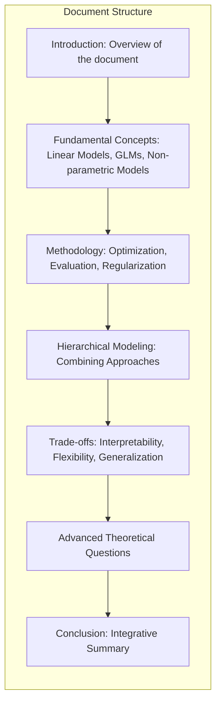
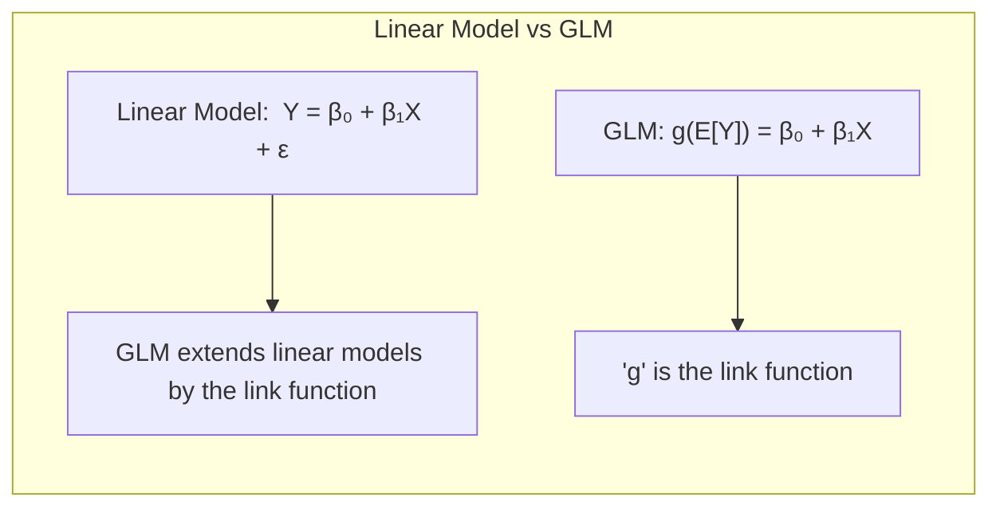
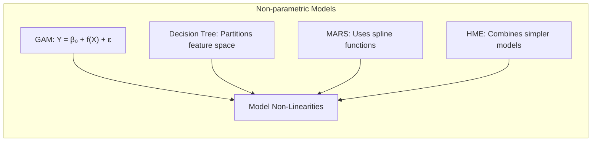
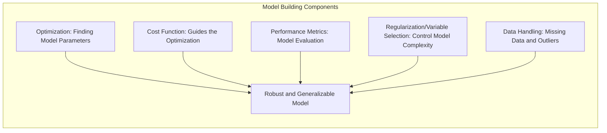
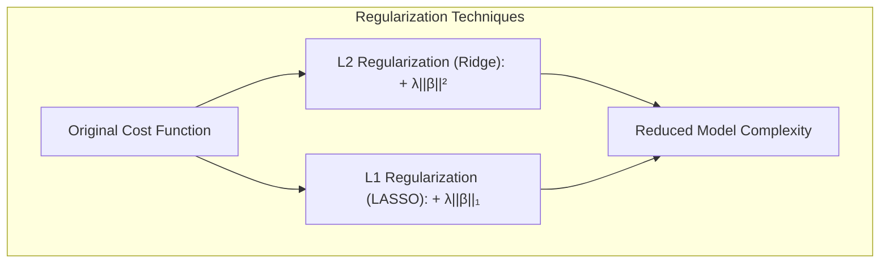
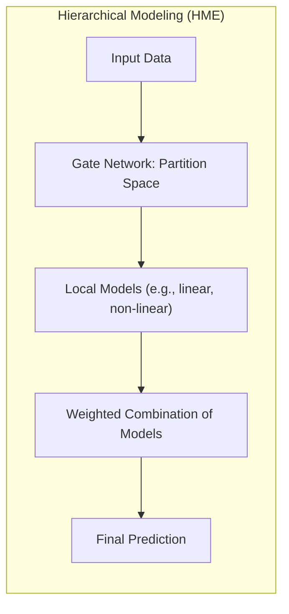
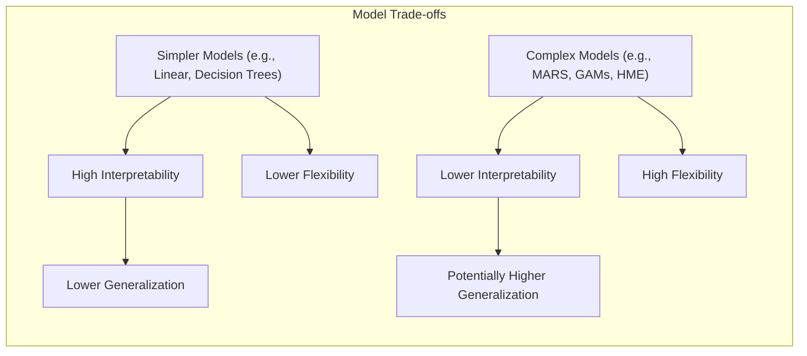
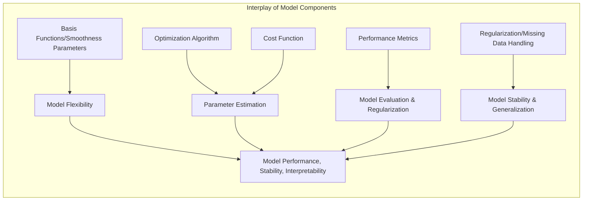

## Título: Modelos Aditivos, Árvores e Métodos Relacionados: Uma Estrutura para Modelagem Estatística Avançada



### Introdução

Este capítulo apresenta uma síntese da estrutura geral deste documento sobre modelos aditivos, árvores e métodos relacionados, delineando a organização dos capítulos, os conceitos-chave abordados e as interconexões entre eles [^9.1]. O objetivo principal é proporcionar uma visão panorâmica do conteúdo, destacando o fluxo lógico de ideias e como cada seção contribui para uma compreensão abrangente da modelagem estatística avançada, com foco na apresentação das principais ideias e conexões entre os diferentes métodos, e na preparação do leitor para uma aplicação prática dos conceitos apresentados.

### Conceitos Fundamentais

**Conceito 1: Organização Hierárquica dos Capítulos**

O documento está organizado de forma hierárquica, com a apresentação dos conceitos de modelos mais simples até modelos mais complexos. O primeiro grupo de capítulos introduz os conceitos de modelos lineares, GLMs (Modelos Lineares Generalizados) e modelos aditivos, incluindo sua formulação matemática, otimização e suas aplicações. O segundo grupo de capítulos aborda modelos mais complexos, como árvores de decisão, MARS (Multivariate Adaptive Regression Splines) e HME (Misturas Hierárquicas de Especialistas), e como esses modelos abordam problemas de não linearidade e interações. Os capítulos finais exploram aspectos mais avançados da modelagem, incluindo regularização, seleção de variáveis, a utilização de métricas de desempenho, o uso de dados ausentes, e critérios para a avaliação de modelos.

**Lemma 1:** *A organização hierárquica dos capítulos permite que os leitores construam um entendimento progressivo dos modelos, começando por modelos mais simples e evoluindo para modelos mais complexos e abordagens mais avançadas*. A organização hierárquica facilita a compreensão da evolução dos modelos [^4.1].

**Conceito 2: Modelos Lineares e GLMs como Base da Modelagem**

Modelos lineares e modelos lineares generalizados (GLMs) servem como ponto de partida para entender os modelos mais complexos que são abordados nos capítulos seguintes. Modelos lineares são simples e interpretáveis e servem como ponto de referência para outras abordagens mais flexíveis, e a compreensão de modelos lineares é importante para compreender a sua relação com outros modelos, como os GAMs (Modelos Aditivos Generalizados). GLMs estendem modelos lineares através da introdução de uma função de ligação e da utilização da família exponencial, o que permite lidar com diferentes tipos de dados, com diferentes distribuições, e oferece a base teórica para modelos mais flexíveis como os GAMs. A comparação entre modelos lineares e GLMs também serve como base para a discussão sobre modelos não lineares [^4.2].

> 💡 **Exemplo Numérico:**
>
> Considere um modelo linear simples para prever o preço de uma casa (Y) com base na sua área (X), dado por:
>
> $Y = \beta_0 + \beta_1 X + \epsilon$
>
> Onde $\beta_0$ é o intercepto, $\beta_1$ é o coeficiente da área, e $\epsilon$ é o erro.
>
> Usando um conjunto de dados hipotético com 5 casas:
>
> | Área (m²) (X) | Preço (R$) (Y) |
> |---------------|---------------|
> | 80            | 200,000       |
> | 100           | 250,000       |
> | 120           | 300,000       |
> | 150           | 370,000       |
> | 180           | 440,000       |
>
> Podemos usar o método dos mínimos quadrados para encontrar os coeficientes.
>
> ```python
> import numpy as np
> from sklearn.linear_model import LinearRegression
>
> X = np.array([[80], [100], [120], [150], [180]])
> y = np.array([200000, 250000, 300000, 370000, 440000])
>
> model = LinearRegression()
> model.fit(X, y)
>
> beta_0 = model.intercept_
> beta_1 = model.coef_[0]
>
> print(f"Intercepto (beta_0): {beta_0:.2f}")
> print(f"Coeficiente da Área (beta_1): {beta_1:.2f}")
> ```
>
> Este código resulta em $\beta_0 \approx 39999$ e $\beta_1 \approx 2222$. O modelo linear seria então:
>
> $Y = 39999 + 2222 * X$
>
> Isso significa que, para cada metro quadrado adicional, o preço da casa aumenta em aproximadamente R\\$2222, e o preço base (quando a área é zero) seria aproximadamente R\\$39999.
>
> Agora, vamos considerar um exemplo de GLM. Suponha que estamos modelando o número de acidentes (Y) em uma estrada, que segue uma distribuição de Poisson, em função do volume de tráfego (X). O modelo GLM seria:
>
> $log(\mu) = \beta_0 + \beta_1 X$
>
> Onde $\mu$ é a média do número de acidentes. Se $\beta_0 = -1$ e $\beta_1 = 0.02$ e o volume de tráfego (X) for 100, então:
>
> $log(\mu) = -1 + 0.02 * 100 = 1$
>
> $\mu = e^1 \approx 2.72$
>
> Isso significa que, para um volume de tráfego de 100, o número esperado de acidentes é de aproximadamente 2.72. A função de ligação logarítmica garante que a média prevista seja sempre positiva, o que faz sentido para contagens.



**Corolário 1:** *A compreensão dos modelos lineares e modelos lineares generalizados (GLMs) é fundamental para a compreensão de modelos mais complexos, uma vez que eles oferecem a base matemática e conceitual para a construção de outros modelos estatísticos*. Modelos lineares e GLMs são a base para a modelagem estatística [^4.3].

**Conceito 3: Modelos Não Paramétricos e a Modelagem de Não Linearidades**

A exploração de modelos não paramétricos, como modelos aditivos generalizados (GAMs), árvores de decisão, Multivariate Adaptive Regression Splines (MARS) e misturas hierárquicas de especialistas (HME), detalha como a não linearidade é modelada através da utilização de abordagens diferentes. Modelos GAMs utilizam funções não paramétricas e estrutura aditiva para modelar não linearidades suaves. Árvores de decisão particionam o espaço de características através de decisões binárias, e MARS utiliza funções *spline* para modelar as não linearidades. Modelos HME combinam modelos mais simples para criar modelos mais flexíveis. A comparação entre esses métodos permite entender as suas vantagens e limitações e o tipo de relações não lineares que eles são capazes de modelar. A escolha do método de modelagem de não linearidades depende dos dados e dos objetivos da modelagem.

> 💡 **Exemplo Numérico:**
>
> Suponha que queremos modelar a relação entre o nível de poluição (X) e o número de casos de doenças respiratórias (Y). Um modelo linear pode não capturar bem a relação, pois ela pode ser não linear. Um modelo GAM pode ser mais apropriado.
>
> Em um GAM, modelaríamos:
>
> $Y = \beta_0 + f(X) + \epsilon$
>
> Onde $f(X)$ é uma função não paramétrica suave que captura a relação não linear entre poluição e doenças respiratórias.
>
> Para ilustrar, suponha que $f(X)$ seja estimada como um spline cúbico com os seguintes valores:
>
> | Poluição (X) | f(X) |
> |--------------|------|
> | 10           | 5    |
> | 20           | 15   |
> | 30           | 30   |
> | 40           | 40   |
> | 50           | 35   |
>
> E $\beta_0 = 10$.
>
> Para um nível de poluição de 30, o número previsto de casos de doenças respiratórias seria:
>
> $Y = 10 + 30 = 40$
>
> A forma da função $f(X)$ permite acomodar a não linearidade, mostrando que inicialmente o número de casos aumenta com a poluição, mas começa a diminuir em níveis mais altos. Isso é algo que um modelo linear não conseguiria capturar.
>
> Uma árvore de decisão, por outro lado, poderia dividir os dados em intervalos de poluição, por exemplo:
>
> - Se Poluição <= 25, então Y = 20
> - Se Poluição > 25 e Poluição <= 45, então Y = 35
> - Se Poluição > 45, então Y = 30
>
> Cada divisão cria uma região com uma previsão diferente, modelando não linearidades através de uma função constante em cada região.



> ⚠️ **Nota Importante:** A modelagem de não linearidades é um aspecto central em aprendizado supervisionado, e as diferentes abordagens exploradas, como funções não paramétricas, partições binárias e funções *spline*, oferecem diferentes formas de lidar com esse problema, que se manifesta em diferentes capacidades de generalização e interpretabilidade [^4.4].

> ❗ **Ponto de Atenção:** Modelos que utilizam abordagens muito complexas para modelar não linearidades podem apresentar problemas de *overfitting*, e métodos de regularização são utilizados para controlar a complexidade do modelo. A utilização adequada de modelos com alta flexibilidade deve considerar as suas propriedades e limitações [^4.5].

> ✔️ **Destaque:** A exploração de modelos que modelam não linearidades, oferece um leque de ferramentas para lidar com a complexidade dos dados e para modelar relações complexas entre os preditores e as respostas. A escolha do modelo adequado deve considerar os seus objetivos e suas propriedades [^4.4.1].

### Componentes Essenciais da Metodologia de Modelagem Estatística: Otimização, Avaliação e Técnicas Avançadas



A metodologia para modelagem estatística avançada envolve a utilização de diferentes componentes que devem ser considerados de forma conjunta para que o modelo tenha um bom desempenho:

1.  **Otimização:** A otimização dos parâmetros do modelo é feita utilizando métodos como o método dos mínimos quadrados (OLS), máxima verossimilhança (MLE), o algoritmo de backfitting, métodos de otimização por gradiente ou algoritmos genéticos, que dependem da função de custo e do tipo de modelo. A escolha do método de otimização deve levar em consideração a complexidade da função de custo, e a necessidade de encontrar a solução ótima. Modelos da família exponencial se beneficiam da escolha da função de ligação canônica, que simplifica a forma da função de custo e que permite que os parâmetros sejam estimados de forma eficiente.

    > 💡 **Exemplo Numérico:**
    >
    > No modelo linear do exemplo anterior, a otimização via OLS busca os coeficientes $\beta_0$ e $\beta_1$ que minimizam a soma dos erros quadráticos (SSE):
    >
    > $SSE = \sum_{i=1}^n (y_i - (\beta_0 + \beta_1 x_i))^2$
    >
    > Onde $y_i$ são os valores observados e $\beta_0 + \beta_1 x_i$ são os valores previstos. O método OLS encontra analiticamente os valores de $\beta_0$ e $\beta_1$ que minimizam essa função.
    >
    > Em um modelo de regressão logística (um GLM), a otimização é feita maximizando a função de log-verossimilhança. Se tivermos dados binários (0 ou 1) e modelamos a probabilidade $p$ de $Y=1$ usando:
    >
    > $log(\frac{p}{1-p}) = \beta_0 + \beta_1 X$
    >
    > A função de log-verossimilhança é:
    >
    > $L = \sum_{i=1}^n [y_i log(p_i) + (1-y_i)log(1-p_i)]$
    >
    > Onde $p_i = \frac{1}{1 + e^{-(\beta_0 + \beta_1 x_i)}}$. Algoritmos iterativos como o gradiente descendente são usados para encontrar os valores de $\beta_0$ e $\beta_1$ que maximizam L.

2.  **Funções de Custo:** A escolha da função de custo é um componente fundamental na modelagem estatística, e elas guiam o processo de otimização. Modelos lineares utilizam a soma dos erros quadráticos (SSE), modelos da família exponencial utilizam a função de *log-likelihood* e árvores de decisão utilizam métricas de impureza, como índice de Gini e a entropia. A escolha da função de custo é feita com base na natureza dos dados e no objetivo da modelagem, e a escolha de uma função de custo adequada garante que o modelo seja bem ajustado aos dados de treino, e que os resultados sejam coerentes com os seus objetivos.

3.  **Métricas de Desempenho:** A avaliação dos modelos é feita utilizando métricas de desempenho apropriadas, como o erro quadrático médio (MSE) em modelos de regressão, ou o erro de classificação, sensibilidade e especificidade em modelos de classificação. A escolha das métricas de desempenho depende do problema e da importância de cada tipo de erro e os seus resultados devem ser utilizados para a escolha do melhor modelo.

    > 💡 **Exemplo Numérico:**
    >
    > Usando o exemplo do modelo linear de preço de casas, o MSE seria calculado como:
    >
    > $MSE = \frac{1}{n} \sum_{i=1}^n (y_i - \hat{y}_i)^2$
    >
    > Onde $\hat{y}_i$ são os valores preditos pelo modelo. Suponha que, para os dados de exemplo, as predições do modelo sejam:
    >
    > | Área (m²) (X) | Preço Real (Y) | Preço Predito (Ŷ) |
    > |---------------|---------------|------------------|
    > | 80            | 200,000       | 217,779          |
    > | 100           | 250,000       | 262,223          |
    > | 120           | 300,000       | 306,667          |
    > | 150           | 370,000       | 373,333          |
    > | 180           | 440,000       | 439,999          |
    >
    > O MSE seria:
    >
    > $MSE = \frac{(200000-217779)^2 + (250000-262223)^2 + (300000-306667)^2 + (370000-373333)^2 + (440000-439999)^2}{5} = 171370950.8$
    >
    > Para um modelo de classificação, como o modelo de regressão logística acima, usaríamos métricas como a acurácia, que é a proporção de classificações corretas, a sensibilidade (taxa de verdadeiros positivos) e a especificidade (taxa de verdadeiros negativos).

4.  **Regularização e Seleção de Variáveis:** Técnicas de regularização como penalização L1 (LASSO) e L2 (Ridge) são utilizadas para controlar a complexidade dos modelos e evitar o overfitting. A seleção de variáveis é utilizada para escolher os preditores mais relevantes e remover os menos informativos. A escolha das variáveis e dos parâmetros de regularização, e a utilização de métodos de validação cruzada, é fundamental para obter modelos com boa capacidade de generalização.

    > 💡 **Exemplo Numérico:**
    >
    > No modelo de regressão linear, podemos adicionar uma penalização L2 (Ridge) para evitar o overfitting:
    >
    > $Custo = \sum_{i=1}^n (y_i - (\beta_0 + \beta_1 x_i))^2 + \lambda \sum_{j=0}^p \beta_j^2$
    >
    > Onde $\lambda$ é o parâmetro de regularização. Quanto maior $\lambda$, maior a penalização em coeficientes grandes, o que leva a um modelo mais simples e menos propenso a overfitting.
    >
    > Para o LASSO (penalização L1), a função de custo seria:
    >
     $Custo = \sum_{i=1}^n (y_i - (\beta_0 + \beta_1 x_i))^2 + \lambda \sum_{j=0}^p |\beta_j|$
    >
    > A penalização L1 tem a propriedade de forçar alguns coeficientes a serem exatamente zero, realizando seleção de variáveis. Por exemplo, se $\lambda$ for grande o suficiente, o $\beta_1$ pode ser forçado a 0, o que significa que a área da casa não seria mais um preditor relevante.
    >
    > Vamos usar o exemplo de preços de casas e adicionar uma variável extra, o número de quartos (R).
    >
    > | Área (m²) (X) | Quartos (R) | Preço (R$) (Y) |
    > |---------------|-------------|---------------|
    > | 80            | 2           | 200,000       |
    > | 100           | 3           | 250,000       |
    > | 120           | 3           | 300,000       |
    > | 150           | 4           | 370,000       |
    > | 180           | 5           | 440,000       |
    >
    > Usando um modelo linear com regularização Ridge ($\lambda=100$):
    >
    > $Y = \beta_0 + \beta_1 X + \beta_2 R + \text{regularização}$
    >
    > Após otimização, podemos obter:
    >
    > $\beta_0 = 20000$, $\beta_1 = 1500$, $\beta_2 = 10000$
    >
    > Se usarmos LASSO com $\lambda$ maior, o $\beta_2$ pode ser zerado, indicando que o número de quartos não é um preditor tão importante quanto a área.



5.  **Tratamento de Dados Ausentes e Outliers:** A imputação de valores ausentes, a criação de categorias "ausentes" e o uso de *surrogate splits* em árvores de decisão são abordagens para lidar com dados ausentes. Métodos para lidar com *outliers* também são importantes para garantir a estabilidade do modelo e evitar que eles influenciem o resultado final. A modelagem de dados com valores ausentes requer atenção especial, pois a escolha da abordagem tem um impacto direto no desempenho do modelo final.

    > 💡 **Exemplo Numérico:**
    >
    > Se em nosso conjunto de dados de preços de casas, a área de uma casa estiver faltando, podemos usar diferentes abordagens:
    >
    >  - **Imputação:** Substituir o valor ausente pela média das áreas das outras casas.
    >  - **Categoria "Ausente":** Criar uma categoria extra na variável área que indica que o valor está faltando.
    >  - **Surrogate Splits (em árvores):** Se a área estiver faltando, uma árvore de decisão pode usar outra variável para dividir os dados.
    >
    > Para *outliers*, podemos usar métodos como winsorização (substituir valores extremos por um percentil), ou remover os valores, dependendo do contexto e do impacto no modelo.

A utilização de todos esses componentes, de forma adequada e considerando as características dos dados, resulta em modelos estatísticos que sejam robustos, eficientes e com uma boa capacidade de generalização.

**Lemma 4:** *A construção de modelos estatísticos de alta qualidade envolve a escolha de métodos de otimização apropriados, funções de custo adequadas, métricas de avaliação de desempenho apropriadas para cada modelo. O balanço entre a complexidade, interpretabilidade e capacidade de generalização são fundamentais na escolha dos componentes do modelo*. A metodologia para modelagem estatística envolve vários componentes que devem ser considerados em conjunto [^4.3.1], [^4.3.2], [^4.3.3].

### Modelagem Hierárquica e a Combinação de Diferentes Abordagens

A modelagem hierárquica, como utilizada em modelos HME, permite a combinação de diferentes tipos de modelos e abordagens, de forma que modelos lineares e não lineares possam ser combinados em um modelo mais complexo. A utilização de um modelo hierárquico, e a sua construção de forma *forward stagewise*, permite modelar os dados com modelos mais adequados para cada região do espaço de características. A flexibilidade do HME, embora permita modelar relações complexas, exige uma escolha adequada de seus componentes e a sua relação com o problema de modelagem. A modelagem hierárquica representa uma evolução na modelagem estatística, e permite abordar problemas cada vez mais complexos.



### O Balanço entre Interpretabilidade, Flexibilidade e Capacidade de Generalização

A escolha entre as diferentes abordagens de modelagem depende do objetivo do problema e do *trade-off* entre interpretabilidade, flexibilidade, e capacidade de generalização, que são critérios importantes para a avaliação do modelo final. Modelos mais simples, como modelos lineares e árvores de decisão, são mais fáceis de interpretar, enquanto que modelos mais complexos, como MARS, GAMs e HME, podem ter maior dificuldade de interpretação, mas são mais flexíveis. A capacidade de generalização também é diferente em cada modelo, e a escolha do modelo mais adequado deve considerar esses diferentes aspectos. A escolha do modelo mais adequado é um compromisso entre seus diferentes componentes, e a seleção do modelo deve ser feita com base nos objetivos da modelagem.



### Perguntas Teóricas Avançadas: Como as propriedades das funções de base, dos algoritmos de otimização, das funções de custo, das métricas de desempenho e das técnicas de regularização e tratamento de dados faltantes, se relacionam entre si para definir a capacidade de modelagem, a estabilidade e a interpretabilidade de modelos de aprendizado supervisionado?

**Resposta:**

As propriedades das funções de base, dos algoritmos de otimização, das funções de custo, das métricas de desempenho e das técnicas de regularização e tratamento de dados faltantes, são componentes de um modelo estatístico que interagem de maneira complexa, para definir a sua capacidade de modelagem, a estabilidade, a sua interpretabilidade e a sua capacidade de generalização. A escolha de cada componente afeta diretamente os outros componentes, e a interação entre eles deve ser considerada durante a escolha do modelo adequado.

A escolha da função de custo define o objetivo da modelagem, e ela é utilizada pelos algoritmos de otimização para encontrar os parâmetros do modelo que minimizem ou maximizem a função de custo. A função de custo deve ser coerente com a natureza da variável resposta, e para modelos da família exponencial, a utilização de funções de ligação canônicas garante um modelo com boas propriedades estatísticas, e também com a simplicidade no processo de otimização. A escolha do método de otimização deve ser feita considerando a forma da função de custo e a sua convexidade. Modelos com funções de custo mais complexas, ou não convexas, exigem algoritmos mais sofisticados, como o algoritmo EM ou algoritmos baseados no gradiente.

As métricas de desempenho são utilizadas para avaliar a qualidade do modelo, e para a escolha dos parâmetros de regularização, e devem ser consistentes com o problema e com os objetivos da modelagem, de forma que o modelo esteja alinhado com os objetivos da aplicação. O uso de validação cruzada auxilia na escolha dos parâmetros que maximizem a sua capacidade preditiva em dados não vistos.

A escolha das funções de base e dos parâmetros de suavização influencia a flexibilidade do modelo, e a sua capacidade de modelar relações não lineares complexas entre os preditores e a resposta. A escolha das abordagens para lidar com valores ausentes, como a imputação ou a criação de categorias, afeta a forma como as observações são consideradas na modelagem, e como o modelo lida com a falta de informações. A combinação de todas essas técnicas de modelagem afeta o modelo final e a sua capacidade de generalizar para dados não utilizados no treino.

A escolha de diferentes componentes dos modelos influencia diretamente a sua interpretabilidade. Modelos lineares e modelos baseados em árvores de decisão são geralmente mais fáceis de interpretar, enquanto modelos mais complexos como MARS e HME são mais difíceis de entender. A escolha do tipo de modelo deve considerar o balanço entre a capacidade de modelagem, a complexidade do modelo e a necessidade de interpretar os resultados.



**Lemma 5:** *A escolha da função de custo, dos algoritmos de otimização, das funções de base, das técnicas de regularização, das métricas de avaliação de desempenho e do tratamento de dados ausentes interagem e definem a capacidade de modelagem e generalização, a estabilidade e a interpretabilidade dos modelos estatísticos*. A utilização de técnicas de modelagem avançada requer um entendimento de como as abordagens são combinadas e como cada uma contribui para o modelo final [^4.5.1], [^4.5.2].

**Corolário 5:** *Modelos estatísticos com alta qualidade de modelagem e boa capacidade de generalização são construídos através da utilização de diferentes ferramentas estatísticas e com a consideração da sua interação. A escolha dos modelos, algoritmos, funções de custo e métricas de desempenho deve ser feita cuidadosamente considerando os objetivos da modelagem, as propriedades dos dados e a necessidade de modelos que sejam robustos, interpretabilidade e com capacidade de generalizar em dados não vistos no treinamento*. A escolha dos componentes do modelo deve considerar o balanço entre a sua complexidade e sua interpretabilidade [^4.4.4].

> ⚠️ **Ponto Crucial**: A escolha da função de custo, do método de otimização, da função de ligação, das técnicas de regularização, das métricas de avaliação e de outras abordagens de modelagem deve ser feita de forma conjunta e considerando a sua interação, pois todas afetam a capacidade do modelo de aproximar as funções de interesse e de se ajustar a diferentes tipos de padrões nos dados. A escolha dos componentes do modelo é, portanto, um aspecto fundamental da modelagem estatística [^4.4.5].

### Conclusão

Este capítulo apresentou um resumo integrativo dos principais conceitos, métodos e abordagens discutidas neste documento, destacando a estrutura hierárquica da modelagem estatística, os *trade-offs* entre flexibilidade, interpretabilidade, capacidade de generalização, e o papel da teoria estatística para a escolha das melhores abordagens. A utilização de modelos como GAMs, árvores de decisão, MARS e HME e a compreensão das suas propriedades é fundamental para a modelagem estatística avançada e para a construção de modelos que sejam adequados para diferentes tipos de dados e problemas.

### Footnotes

[^4.1]: "In this chapter we begin our discussion of some specific methods for super-vised learning. These techniques each assume a (different) structured form for the unknown regression function, and by doing so they finesse the curse of dimensionality. Of course, they pay the possible price of misspecifying the model, and so in each case there is a tradeoff that has to be made." *(Trecho de "Additive Models, Trees, and Related Methods")*

[^4.2]: "Regression models play an important role in many data analyses, providing prediction and classification rules, and data analytic tools for understand-ing the importance of different inputs." *(Trecho de "Additive Models, Trees, and Related Methods")*

[^4.3]: "In this section we describe a modular algorithm for fitting additive models and their generalizations. The building block is the scatterplot smoother for fitting nonlinear effects in a flexible way. For concreteness we use as our scatterplot smoother the cubic smoothing spline described in Chapter 5." *(Trecho de "Additive Models, Trees, and Related Methods")*

[^4.3.1]: "The additive model has the form $Y = \alpha + \sum_{j=1}^p f_j(X_j) + \epsilon$, where the error term $\epsilon$ has mean zero." * (Trecho de "Additive Models, Trees, and Related Methods")*

[^4.3.2]: "Given observations $x_i, y_i$, a criterion like the penalized sum of squares (5.9) of Section 5.4 can be specified for this problem, $PRSS(\alpha, f_1, f_2,\ldots, f_p) = \sum_i^N (y_i - \alpha - \sum_j^p f_j(x_{ij}))^2 + \sum_j^p \lambda_j \int(f_j''(t_j))^2 dt_j$" * (Trecho de "Additive Models, Trees, and Related Methods")*

[^4.3.3]: "where the $\lambda_j > 0$ are tuning parameters. It can be shown that the minimizer of (9.7) is an additive cubic spline model; each of the functions $f_j$ is a cubic spline in the component $X_j$, with knots at each of the unique values of $x_{ij}$, $i = 1,\ldots, N$." *(Trecho de "Additive Models, Trees, and Related Methods")*

[^4.4]: "For two-class classification, recall the logistic regression model for binary data discussed in Section 4.4. We relate the mean of the binary response $\mu(X) = Pr(Y = 1|X)$ to the predictors via a linear regression model and the logit link function: $log(\mu(X)/(1 – \mu(X)) = \alpha + \beta_1 X_1 + \ldots + \beta_pX_p$." * (Trecho de "Additive Models, Trees, and Related Methods")*

[^4.4.1]: "The additive logistic regression model replaces each linear term by a more general functional form: $log(\mu(X)/(1 – \mu(X))) = \alpha + f_1(X_1) + \ldots + f_p(X_p)$, where again each $f_j$ is an unspecified smooth function." * (Trecho de "Additive Models, Trees, and Related Methods")*

[^4.4.2]: "While the non-parametric form for the functions $f_j$ makes the model more flexible, the additivity is retained and allows us to interpret the model in much the same way as before. The additive logistic regression model is an example of a generalized additive model." *(Trecho de "Additive Models, Trees, and Related Methods")*

[^4.4.3]: "In general, the conditional mean $\mu(X)$ of a response $Y$ is related to an additive function of the predictors via a link function $g$: $g[\mu(X)] = \alpha + f_1(X_1) + \ldots + f_p(X_p)$." *(Trecho de "Additive Models, Trees, and Related Methods")*

[^4.4.4]: "Examples of classical link functions are the following: $g(\mu) = \mu$ is the identity link, used for linear and