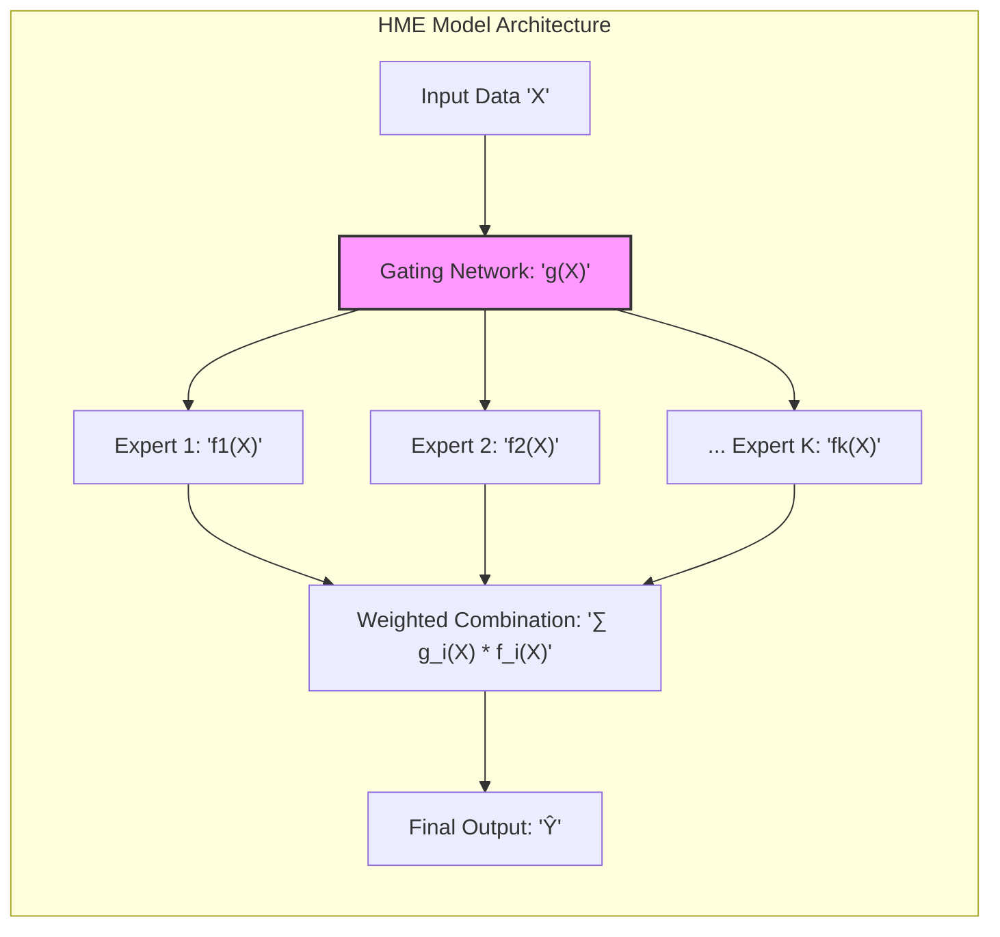
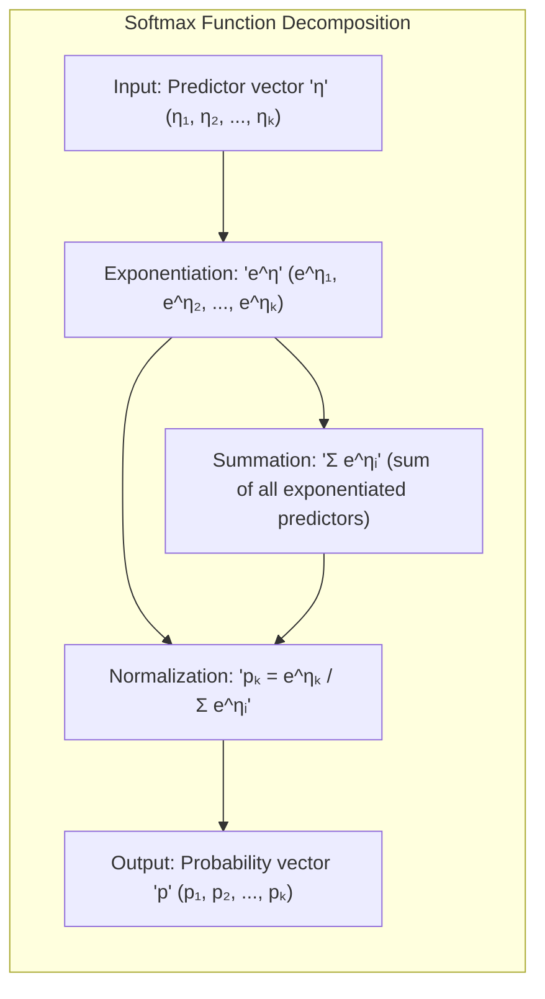
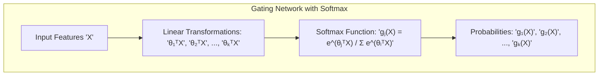
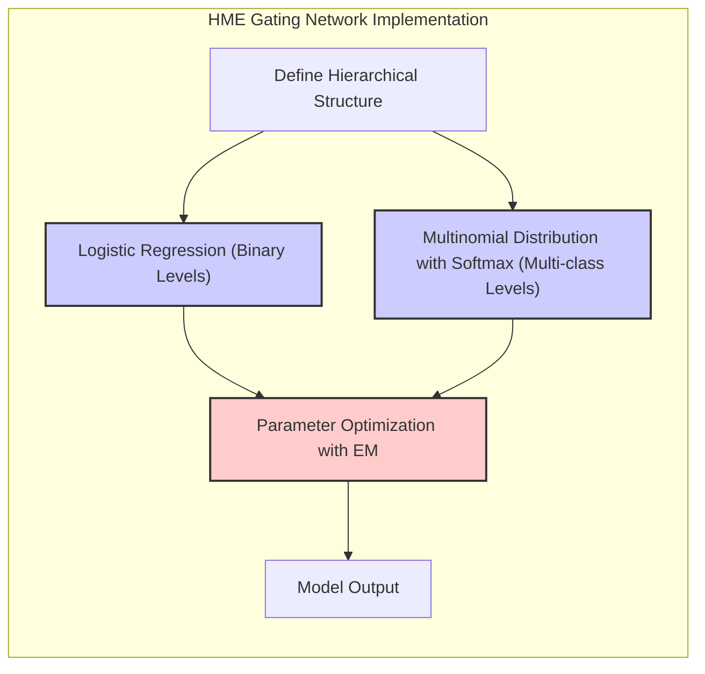
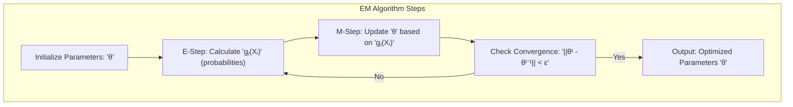
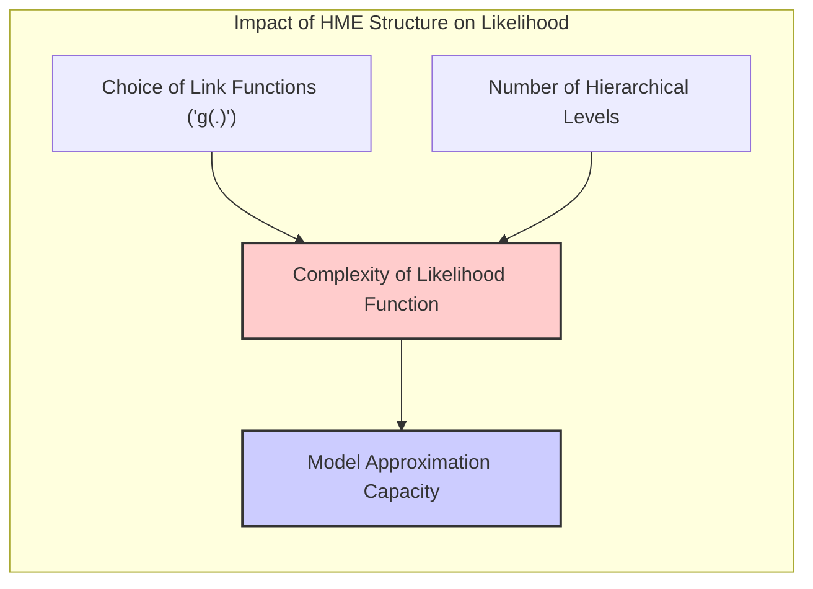

## Título: Modelos Aditivos, Árvores e Métodos Relacionados: Regressão Logística, Distribuição Multinomial e Redes de Gating em HME

### Introdução

Este capítulo explora o uso da regressão logística e da distribuição multinomial para modelar as redes de *gating* em Modelos de Misturas Hierárquicas de Especialistas (HME), e como a função logística ou *softmax* são utilizadas para definir a probabilidade de cada caminho ou nó na árvore, e como esses modelos são ajustados para combinar as estimativas de diferentes especialistas [^9.1]. As redes de *gating* desempenham um papel crucial na modelagem hierárquica do HME, pois elas determinam como as estimativas dos diferentes especialistas são combinadas para gerar a predição final. O capítulo detalha a formulação matemática da regressão logística e da distribuição multinomial, a sua aplicação na modelagem das redes de *gating* e como diferentes funções de ligação são utilizadas. O objetivo principal é apresentar uma visão aprofundada sobre como esses componentes são utilizados na modelagem HME e como a estrutura hierárquica e a combinação dos especialistas leva a modelos robustos e com alta capacidade de modelagem.

### Conceitos Fundamentais

**Conceito 1: Regressão Logística e Modelagem de Probabilidades Binárias**

A regressão logística é um modelo estatístico utilizado para modelar a probabilidade de um evento binário, de modo que a média da variável resposta binária, $\mu$, é relacionada a uma combinação linear de preditores através da função *logit*:

$$
\text{logit}(\mu) = \log\left(\frac{\mu}{1-\mu}\right) = \alpha + \beta_1 X_1 + \beta_2 X_2 + \ldots + \beta_p X_p
$$
onde $\alpha$ é o intercepto, $\beta_j$ são os coeficientes dos preditores, e $X_j$ são as variáveis preditoras. A função logística (sigmoide), que é a inversa da função *logit*, é utilizada para transformar o *predictor* linear para um valor no intervalo (0,1):
$$
\mu = \frac{1}{1+e^{-(\alpha + \beta_1 X_1 + \ldots + \beta_p X_p)}}
$$
A regressão logística é utilizada como base para a modelagem da probabilidade da resposta, e o método da máxima verossimilhança é utilizado para a estimação dos parâmetros. A regressão logística é uma ferramenta importante na modelagem de dados binários, devido a sua interpretabilidade e sua conexão com a família exponencial, e é amplamente utilizada para a construção de modelos de classificação.

> 💡 **Exemplo Numérico:**
>
> Suponha que estamos modelando a probabilidade de um cliente comprar um produto (1 = compra, 0 = não compra) com base em sua idade ($X_1$) e renda ($X_2$). Após ajustar um modelo de regressão logística, obtemos os seguintes parâmetros:
>
> $\alpha = -5$
> $\beta_1 = 0.05$ (coeficiente para idade)
> $\beta_2 = 0.001$ (coeficiente para renda)
>
> A função *logit* é:
>
> $\text{logit}(\mu) = -5 + 0.05X_1 + 0.001X_2$
>
> Para um cliente com 40 anos e renda de R\\$5000,00, temos:
>
> $\text{logit}(\mu) = -5 + 0.05(40) + 0.001(5000) = -5 + 2 + 5 = 2$
>
> A probabilidade de compra é:
>
> $\mu = \frac{1}{1+e^{-2}} \approx \frac{1}{1 + 0.135} \approx 0.88$
>
> Isso significa que, de acordo com o modelo, há uma probabilidade de aproximadamente 88% de esse cliente comprar o produto.
>
> A interpretação dos parâmetros é que, para cada ano a mais na idade, a chance de compra aumenta (considerando que $\beta_1$ é positivo) e, para cada real a mais na renda, a chance de compra também aumenta (considerando que $\beta_2$ também é positivo). A função sigmoide garante que a probabilidade esteja entre 0 e 1.

**Lemma 1:** *A regressão logística modela a probabilidade de uma resposta binária através de uma função *logit*, que relaciona a probabilidade de um evento com uma combinação linear de preditores. O método da máxima verossimilhança é utilizado para a estimação dos parâmetros*. A regressão logística é uma ferramenta fundamental para modelos que buscam modelar uma variável resposta binária [^4.4].

**Conceito 2: A Distribuição Multinomial e a Função *Softmax***

A distribuição multinomial generaliza a distribuição binomial para múltiplas categorias, e é utilizada para modelar a probabilidade de uma observação pertencer a cada uma das $K$ classes. A probabilidade de uma observação pertencer à classe $k$ é dada por:
$$
p_k = \frac{e^{\eta_k}}{\sum_{l=1}^K e^{\eta_l}}
$$
onde $\eta_k$ é o *predictor* linear para cada classe $k$, e $p_k$ é a probabilidade associada a cada classe, que deve ser maior do que 0 e a sua soma deve ser igual a 1. A função *softmax*, utilizada na formulação da distribuição multinomial, garante que as probabilidades de cada classe estejam dentro do intervalo \[0,1], e que a soma das probabilidades de todas as classes seja igual a 1, o que é uma condição necessária para modelar corretamente a variável resposta. A distribuição multinomial é utilizada em modelos de classificação multiclasse, onde a função *softmax* garante a modelagem das probabilidades.

> 💡 **Exemplo Numérico:**
>
> Considere um problema de classificação de tipos de flores em três classes (K=3): *setosa*, *versicolor* e *virginica*. Temos um modelo com parâmetros $\theta$ associados a cada classe, e um vetor de características $X$. Suponha que, para uma dada flor, os *predictors* lineares $\eta_k$ calculados sejam:
>
> $\eta_1 = \theta_1^T X = 1.2$ (para *setosa*)
> $\eta_2 = \theta_2^T X = 0.5$ (para *versicolor*)
> $\eta_3 = \theta_3^T X = 0.8$ (para *virginica*)
>
> As probabilidades de cada classe, usando a função *softmax*, são calculadas como:
>
> $p_1 = \frac{e^{1.2}}{e^{1.2} + e^{0.5} + e^{0.8}} \approx \frac{3.32}{3.32 + 1.65 + 2.23} \approx \frac{3.32}{7.2} \approx 0.46$
>
> $p_2 = \frac{e^{0.5}}{e^{1.2} + e^{0.5} + e^{0.8}} \approx \frac{1.65}{7.2} \approx 0.23$
>
> $p_3 = \frac{e^{0.8}}{e^{1.2} + e^{0.5} + e^{0.8}} \approx \frac{2.23}{7.2} \approx 0.31$
>
> Observe que $p_1 + p_2 + p_3 \approx 0.46 + 0.23 + 0.31 = 1$. O modelo prevê que a flor tem 46% de chance de ser *setosa*, 23% de chance de ser *versicolor*, e 31% de chance de ser *virginica*. A função *softmax* garante que as probabilidades somem 1 e estejam entre 0 e 1.

**Corolário 1:** *A distribuição multinomial e a função *softmax* são utilizadas para a modelagem de variáveis resposta categóricas, com mais de duas classes, onde a probabilidade de uma observação pertencer a cada classe é modelada através de uma função que respeita as propriedades de probabilidade*. A função *softmax* é uma ferramenta importante para modelos de classificação multiclasse [^4.4.4].

**Conceito 3: Redes de *Gating* em Modelos HME**

Em modelos HME (Hierarchical Mixtures of Experts), as redes de *gating* são utilizadas para combinar as estimativas dos diferentes especialistas. As redes de *gating* definem como os modelos locais são utilizados em diferentes regiões do espaço de características. A probabilidade de um determinado especialista $j$ ser utilizado na predição do resultado é modelada através da função *softmax*:
$$
g_j(X) = \frac{e^{\theta_j^TX}}{\sum_{l=1}^K e^{\theta_l^TX}}
$$
onde $\theta_j$ são os parâmetros da rede de *gating* para o especialista $j$. As redes de *gating* utilizam uma combinação linear dos preditores, e a função *softmax* garante que a probabilidade do especialista $j$ seja um número entre zero e um, e que a soma sobre todos os especialistas seja igual a 1. A utilização da função *softmax* permite que as probabilidades sejam modeladas de forma adequada, e o modelo possa ser aplicado a problemas com diferentes tipos de distribuições. As redes de *gating* são um componente essencial da abordagem HME e permitem uma modelagem flexível e hierárquica da resposta.

> 💡 **Exemplo Numérico:**
>
> Considere um modelo HME com dois especialistas (K=2). A rede de *gating* usa duas funções *softmax* para determinar a probabilidade de cada especialista ser usado, com parâmetros $\theta_1$ e $\theta_2$. Suponha que o vetor de preditores $X$ seja [1, 2] e os parâmetros das redes de *gating* sejam:
>
> $\theta_1 = [0.5, -0.2]$ (para o especialista 1)
> $\theta_2 = [-0.1, 0.3]$ (para o especialista 2)
>
> Os *predictors* lineares para cada especialista são:
>
> $\theta_1^T X = (0.5)(1) + (-0.2)(2) = 0.5 - 0.4 = 0.1$
> $\theta_2^T X = (-0.1)(1) + (0.3)(2) = -0.1 + 0.6 = 0.5$
>
> As probabilidades de cada especialista serem ativados são:
>
> $g_1(X) = \frac{e^{0.1}}{e^{0.1} + e^{0.5}} \approx \frac{1.105}{1.105 + 1.649} \approx \frac{1.105}{2.754} \approx 0.40$
>
> $g_2(X) = \frac{e^{0.5}}{e^{0.1} + e^{0.5}} \approx \frac{1.649}{2.754} \approx 0.60$
>
> Isso significa que, para este valor de $X$, o especialista 1 tem 40% de chance de ser usado e o especialista 2 tem 60% de chance. A função *softmax* garante que $g_1(X) + g_2(X) = 1$. O modelo HME vai ponderar as predições dos especialistas de acordo com estas probabilidades.

> ⚠️ **Nota Importante:** As redes de *gating* em modelos HME utilizam a função *softmax* para definir a probabilidade de cada especialista ser utilizado, o que permite modelar relações complexas e diferentes regiões do espaço de características com modelos específicos. A função *softmax* define como a informação dos diferentes especialistas é combinada para gerar uma predição final [^9.5].

> ❗ **Ponto de Atenção:** A escolha dos modelos que compõem a rede de *gating*, e seus parâmetros, influencia a capacidade do modelo de aprender diferentes relações entre preditores e resposta. A escolha dos especialistas e das suas conexões é um passo fundamental na modelagem de problemas com abordagens baseadas em HME [^4.5.1], [^4.5.2].

> ✔️ **Destaque:** A utilização da distribuição multinomial e da função *softmax*, em modelos HME, oferece um arcabouço teórico e matemático para a construção de modelos flexíveis que podem lidar com problemas de classificação e regressão. A utilização de redes de *gating*, com funções de ligação apropriadas, permite que diferentes tipos de modelos possam ser combinados de forma hierárquica [^4.4.4], [^4.4.5].

### Implementação de Redes de *Gating* com Regressão Logística e Distribuição Multinomial em HME

A implementação de redes de *gating* em modelos HME, utilizando a regressão logística e a distribuição multinomial, envolve os seguintes passos:

1.  **Definição da Estrutura Hierárquica:** Definir a estrutura hierárquica do modelo HME, incluindo o número de níveis e o número de especialistas em cada nó, o que define o grau de complexidade do modelo, e sua capacidade de modelar interações e não linearidades.
2.   **Modelagem das Redes de Gating com Regressão Logística:** Em níveis binários, como no primeiro nível da hierarquia, a regressão logística é utilizada para modelar a probabilidade de cada caminho:

   $$
    g_j(X) = \frac{1}{1 + e^{-(\alpha_j + \beta_{j1}X_1 + \ldots + \beta_{jp}X_p)}}
    $$

      onde $g_j(X)$ representa a probabilidade da observação seguir o caminho $j$, $\alpha_j$ é o intercepto e $\beta_{kj}$ são os parâmetros associados aos preditores $X_k$. Em modelos hierárquicos com mais de duas opções, o *softmax* é utilizado.
3.  **Modelagem das Redes de Gating com Distribuição Multinomial:** Em níveis com múltiplas opções de caminhos, a distribuição multinomial e a função *softmax* são utilizadas para modelar a probabilidade de cada caminho, utilizando:
$$
g_j(X) = \frac{e^{\theta_j^T X}}{\sum_{l=1}^K e^{\theta_l^T X}}
$$
onde $\theta_j$ são os parâmetros do modelo de *gating* para cada caminho $j$, $X$ é o vetor de preditores e $K$ é o número de caminhos. A função *softmax* garante que as probabilidades de cada caminho sejam válidas e que a sua soma seja igual a 1.
4.  **Otimização dos Parâmetros:** Os parâmetros das redes de *gating* e dos modelos especialistas são estimados utilizando o algoritmo EM (Expectation-Maximization), que itera entre o cálculo das probabilidades de cada caminho e a estimação dos parâmetros dos modelos locais (especialistas) através da maximização da *log-likelihood*.

A escolha da função de ligação apropriada para cada nível da hierarquia, e dos métodos de otimização adequados, permite criar modelos complexos com alta flexibilidade e com capacidade de modelar dados com padrões complexos e relações não lineares entre os preditores.

> 💡 **Exemplo Numérico:**
>
> Vamos ilustrar a otimização dos parâmetros com um exemplo simplificado de um HME com dois especialistas e uma rede de *gating* no primeiro nível (binária).
>
> Suponha que temos um conjunto de dados com duas características ($X_1$ e $X_2$) e uma variável resposta $Y$. Inicializamos os parâmetros da rede de *gating* ($\alpha, \beta_1, \beta_2$) e os parâmetros dos especialistas (que podem ser modelos lineares, por exemplo).
>
> **Passo E (Expectation):**
>
> Para cada observação $i$, calculamos as probabilidades de ativação de cada especialista usando a função logística (para um nó binário):
>
> $g_1(X_i) = \frac{1}{1 + e^{-(\alpha + \beta_1 X_{i1} + \beta_2 X_{i2})}}$
>
> $g_2(X_i) = 1 - g_1(X_i)$
>
> **Passo M (Maximization):**
>
> Usando as probabilidades $g_1(X_i)$ e $g_2(X_i)$, ajustamos os modelos especialistas (por exemplo, regressão linear ponderada). Ajustamos também os parâmetros da rede de *gating* ($\alpha, \beta_1, \beta_2$) usando um método de otimização (por exemplo, gradiente descendente) para maximizar a *log-likelihood* ponderada pelas probabilidades de cada especialista.
>
> Este processo é repetido iterativamente. Por exemplo, suponha que, na primeira iteração, os parâmetros da rede de *gating* são: $\alpha = -1$, $\beta_1 = 0.2$, $\beta_2 = 0.3$. Para a observação $i$ com $X_i = [2, 1]$, temos:
>
> $g_1(X_i) = \frac{1}{1 + e^{-(-1 + 0.2*2 + 0.3*1)}} = \frac{1}{1 + e^{-(-1 + 0.4 + 0.3)}} = \frac{1}{1+e^{0.3}} \approx 0.42$
>
> $g_2(X_i) = 1 - 0.42 = 0.58$
>
> No passo M, os parâmetros dos especialistas e da rede de *gating* são atualizados usando essas probabilidades. O algoritmo EM itera entre os passos E e M até a convergência dos parâmetros.

**Lemma 5:** *A utilização da regressão logística e da distribuição multinomial na modelagem de redes de *gating* em modelos HME permite que a probabilidade de cada caminho ou especialista seja modelada de forma consistente com a teoria da família exponencial. O uso do algoritmo EM é utilizado para otimizar os parâmetros das redes e dos especialistas*. A modelagem de redes de *gating* com funções de ligação apropriadas é um componente fundamental da modelagem HME [^9.5].

###  Interpretação das Redes de *Gating* e sua Relação com os Modelos Especialistas

A interpretação das redes de *gating* em modelos HME permite entender como as diferentes regiões do espaço de características são modeladas pelos diferentes especialistas. A análise das probabilidades estimadas pelas redes de *gating* permite identificar quais regiões do espaço de características são modeladas por um dado especialista, e como os diferentes modelos são combinados para modelar diferentes tipos de padrões nos dados. Modelos HME podem ser utilizados para modelar dados com diferentes comportamentos, o que aumenta a sua flexibilidade e capacidade de modelagem.

###  O Uso do Algoritmo EM para Otimização dos Parâmetros do Modelo HME

O algoritmo EM (Expectation-Maximization) é um método iterativo utilizado para estimar os parâmetros em modelos com variáveis latentes, como em HME. No passo E (Expectation) do algoritmo, a probabilidade de cada observação pertencer a cada especialista é calculada. No passo M (Maximization), os parâmetros dos modelos são estimados com base nas probabilidades calculadas no passo E. O algoritmo itera entre os passos E e M até a convergência dos parâmetros, o que garante a estabilidade do modelo final. O algoritmo EM busca encontrar os parâmetros que maximizam a verossimilhança dos dados e é uma ferramenta importante para a estimação de modelos hierárquicos.

### Perguntas Teóricas Avançadas: Como a escolha das funções de ligação e o número de níveis na estrutura hierárquica de HME afeta a convexidade da função de verossimilhança e a sua capacidade de aproximação de funções complexas?

**Resposta:**

A escolha das funções de ligação e o número de níveis na estrutura hierárquica de modelos de misturas hierárquicas de especialistas (HME) afeta de maneira profunda a convexidade da função de verossimilhança e a capacidade do modelo de aproximar funções complexas.

A função de verossimilhança em HME é dada por:
$$
\log P(Y|X, \Theta) = \sum_{i=1}^N \log\left(\sum_{j=1}^K g_j(x_i; \theta_{gate}) P(y_i|x_i; \theta_j)\right)
$$
onde $g_j(x_i; \theta_{gate})$ representa a probabilidade de ativação do especialista $j$, que é modelada com uma função de ligação (por exemplo, a *softmax*), e $P(y_i|x_i; \theta_j)$ é a distribuição da variável resposta modelada pelo especialista $j$. A escolha das funções de ligação, portanto, afeta diretamente a forma da função de verossimilhança e sua convexidade. A função *softmax*, utilizada na modelagem das probabilidades de ativação dos especialistas, garante que as probabilidades sejam válidas, mas ela pode tornar a função de verossimilhança não convexa, o que dificulta a otimização.

O número de níveis na hierarquia do modelo HME, também influencia a sua convexidade. Modelos HME com poucos níveis (por exemplo, dois) têm um número menor de parâmetros, e a sua função de verossimilhança pode ser mais próxima de uma função convexa, enquanto modelos com muitos níveis e muitos especialistas geram funções de verossimilhança mais complexas e que apresentam múltiplos mínimos locais. A otimização de modelos HME complexos pode ser um desafio computacional.

A capacidade de aproximação de funções complexas também é afetada pela escolha dos componentes da estrutura hierárquica. Modelos HME com mais níveis e mais especialistas oferecem uma maior capacidade de modelar diferentes tipos de não linearidades e interações, mas isso leva a um aumento da complexidade da função de verossimilhança e dificulta a interpretação dos resultados. A combinação de diferentes tipos de especialistas, com diferentes funções de ligação também pode aumentar a capacidade de aproximação do modelo.

**Lemma 5:** *A escolha das funções de ligação e do número de níveis na hierarquia de HME afeta diretamente a convexidade da função de verossimilhança e a capacidade do modelo de aproximar funções complexas. Modelos com muitas camadas e especialistas são mais flexíveis, mas também mais propensos a problemas de convergência e *overfitting*.* A escolha dos modelos HME deve considerar a sua capacidade de modelagem e a sua relação com a convexidade da função de custo [^9.5].

**Corolário 5:** *O uso de algoritmos de otimização, como o algoritmo EM, para estimar os parâmetros em HME, busca um máximo local da função de verossimilhança, mas modelos com muitos níveis hierárquicos e muitos especialistas podem levar a problemas de otimização e convergência para soluções subótimas. A escolha adequada dos componentes do HME deve considerar o trade-off entre flexibilidade, complexidade e capacidade de generalização*. A escolha das funções de ligação e da estrutura hierárquica, portanto, é um aspecto crucial na modelagem com HME [^4.4.4].

> ⚠️ **Ponto Crucial**: A escolha das funções de ligação e do número de níveis em modelos HME impacta a convexidade da função de verossimilhança e a capacidade do modelo de aproximar funções complexas. Modelos HME com muitas camadas e especialistas podem modelar relações mais complexas, mas a complexidade da otimização também aumenta e os resultados podem ser mais difíceis de interpretar. A escolha da arquitetura do modelo é um componente importante na sua capacidade de modelagem [^4.4.5].

### Conclusão

Este capítulo explorou o uso da regressão logística e da distribuição multinomial na modelagem de redes de *gating* em modelos HME, mostrando como a função logística e *softmax* são utilizadas para modelar as probabilidades de cada caminho e a sua influência no processo de estimação e otimização do modelo. A discussão detalhou como a modelagem hierárquica, e os métodos de otimização baseados em algoritmos iterativos, permite a modelagem de dados complexos, e como a escolha adequada dos componentes dos modelos é fundamental para se obter modelos com bom desempenho.

### Footnotes

[^4.1]: "In this chapter we begin our discussion of some specific methods for super-vised learning. These techniques each assume a (different) structured form for the unknown regression function, and by doing so they finesse the curse of dimensionality. Of course, they pay the possible price of misspecifying the model, and so in each case there is a tradeoff that has to be made." *(Trecho de "Additive Models, Trees, and Related Methods")*

[^4.2]: "Regression models play an important role in many data analyses, providing prediction and classification rules, and data analytic tools for understand-ing the importance of different inputs." *(Trecho de "Additive Models, Trees, and Related Methods")*

[^4.3]: "In this section we describe a modular algorithm for fitting additive models and their generalizations. The building block is the scatterplot smoother for fitting nonlinear effects in a flexible way. For concreteness we use as our scatterplot smoother the cubic smoothing spline described in Chapter 5." *(Trecho de "Additive Models, Trees, and Related Methods")*

[^4.3.1]:  "The additive model has the form $Y = \alpha + \sum_{j=1}^p f_j(X_j) + \varepsilon$, where the error term $\varepsilon$ has mean zero." * (Trecho de "Additive Models, Trees, and Related Methods")*

[^4.3.2]:   "Given observations $x_i, y_i$, a criterion like the penalized sum of squares (5.9) of Section 5.4 can be specified for this problem, $PRSS(\alpha, f_1, f_2,\ldots, f_p) = \sum_i^N (y_i - \alpha - \sum_j^p f_j(x_{ij}))^2 + \sum_j^p \lambda_j \int(f_j''(t_j))^2 dt_j$" * (Trecho de "Additive Models, Trees, and Related Methods")*

[^4.3.3]: "where the $\lambda_j > 0$ are tuning parameters. It can be shown that the minimizer of (9.7) is an additive cubic spline model; each of the functions $f_j$ is a cubic spline in the component $X_j$, with knots at each of the unique values of $x_{ij}$, $i = 1,\ldots, N$." *(Trecho de "Additive Models, Trees, and Related Methods")*

[^4.4]: "For two-class classification, recall the logistic regression model for binary data discussed in Section 4.4. We relate the mean of the binary response $\mu(X) = Pr(Y = 1|X)$ to the predictors via a linear regression model and the logit link function:  $\log(\mu(X)/(1 – \mu(X)) = \alpha + \beta_1 X_1 + \ldots + \beta_pX_p$." * (Trecho de "Additive Models, Trees, and Related Methods")*

[^4.4.1]: "The additive logistic regression model replaces each linear term by a more general functional form: $\log(\mu(X)/(1 – \mu(X))) = \alpha + f_1(X_1) + \ldots + f_p(X_p)$, where again each $f_j$ is an unspecified smooth function." * (Trecho de "Additive Models, Trees, and Related Methods")*

[^4.4.2]: "While the non-parametric form for the functions $f_j$ makes the model more flexible, the additivity is retained and allows us to interpret the model in much the same way as before. The additive logistic regression model is an example of a generalized additive model." *(Trecho de "Additive Models, Trees, and Related Methods")*

[^4.4.3]: "In general, the conditional mean $\mu(X)$ of a response $Y$ is related to an additive function of the predictors via a link function $g$:  $g[\mu(X)] = \alpha + f_1(X_1) + \ldots + f_p(X_p)$." *(Trecho de "Additive Models, Trees, and Related Methods")*

[^4.4.4]:  "Examples of classical link functions are the following: $g(\mu) = \mu$ is the identity link, used for linear and additive models for Gaussian response data." *(Trecho de "Additive Models, Trees, and Related Methods")*

[^4.4.5]: "$g(\mu) = \text{logit}(\mu)$ as above, or $g(\mu) = \text{probit}(\mu)$, the probit link function, for modeling binomial probabilities. The probit function is the inverse Gaussian cumulative distribution function: $\text{probit}(\mu) = \Phi^{-1}(\mu)$." *(Trecho de "Additive Models, Trees, and Related Methods")*

[^4.5]: "All three of these arise from exponential family sampling models, which in addition include the gamma and negative-binomial distributions. These families generate the well-known class of generalized linear models, which are all extended in the same way to generalized additive models." *(Trecho de "Additive Models, Trees, and Related Methods")*

[^4.5.1]: "The functions $f_j$ are estimated in a flexible manner, using an algorithm whose basic building block is a scatterplot smoother. The estimated func-tion $f_j$ can then reveal possible nonlinearities in the effect of $X_j$. Not all of the functions $f_j$ need to be nonlinear." *(Trecho de "Additive Models, Trees, and Related Methods")*

[^4.5.2]: "We can easily mix in linear and other parametric forms with the nonlinear terms, a necessity when some of the inputs are qualitative variables (factors)." *(Trecho de "Additive Models, Trees, and Related Methods")*

[^9.1]: "In this chapter we begin our discussion of some specific methods for super-vised learning. These techniques each assume a (different) structured form for the unknown regression function, and by doing so they finesse the curse of dimensionality. Of course, they pay the possible price of misspecifying the model, and so in each case there is a tradeoff that has to be made. We describe five related techniques: generalized additive models, trees, multivariate adaptive regression splines, the patient rule induction method, and hierarchical mixtures of experts." *(Trecho de "Additive Models, Trees, and Related Methods")*

[^9.5]: "The hierarchical mixtures of experts (HME) procedure can be viewed as a variant of tree-based methods. The main difference is that the tree splits are not hard decisions but rather soft probabilistic ones. At each node an observation goes left or right with probabilities depending on its input val-ues. This has some computational advantages since the resulting parameter optimization problem is smooth, unlike the discrete split point search in the tree-based approach. The soft splits might also help in prediction accuracy and provide a useful alternative description of the data." *(Trecho de "Additive Models, Trees, and Related Methods")*
