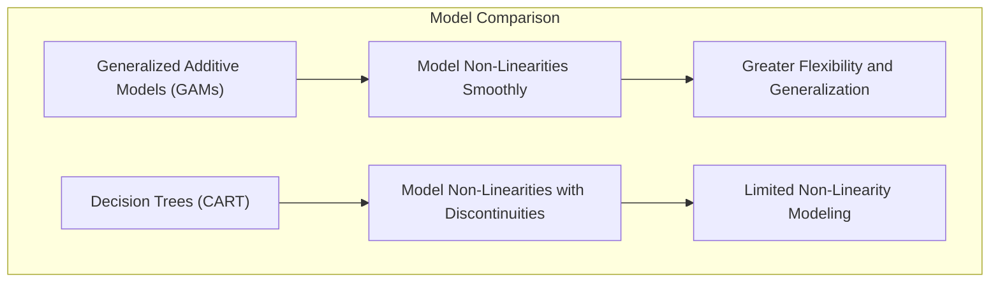
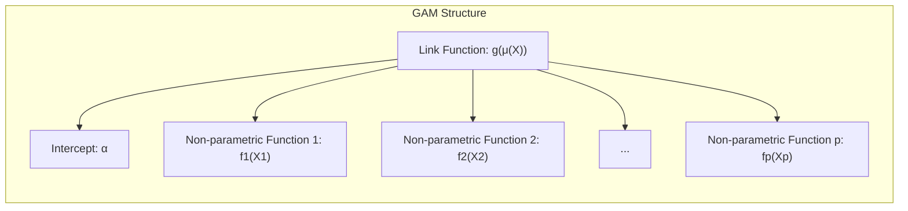
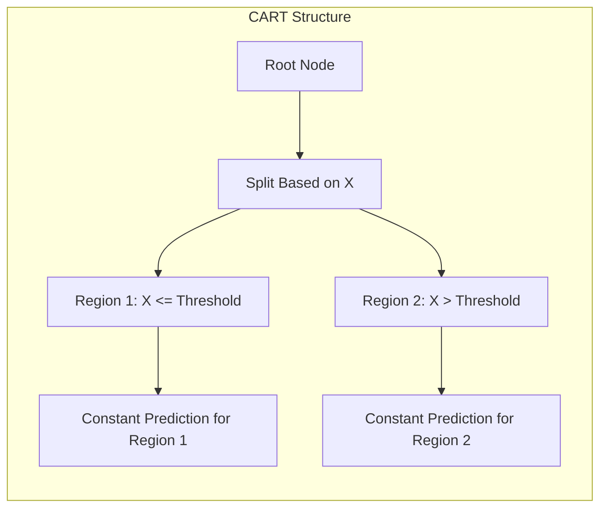
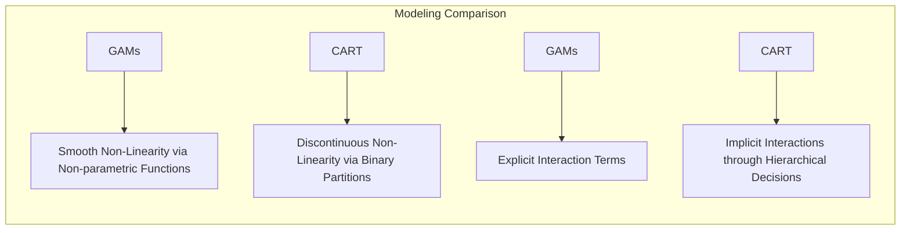
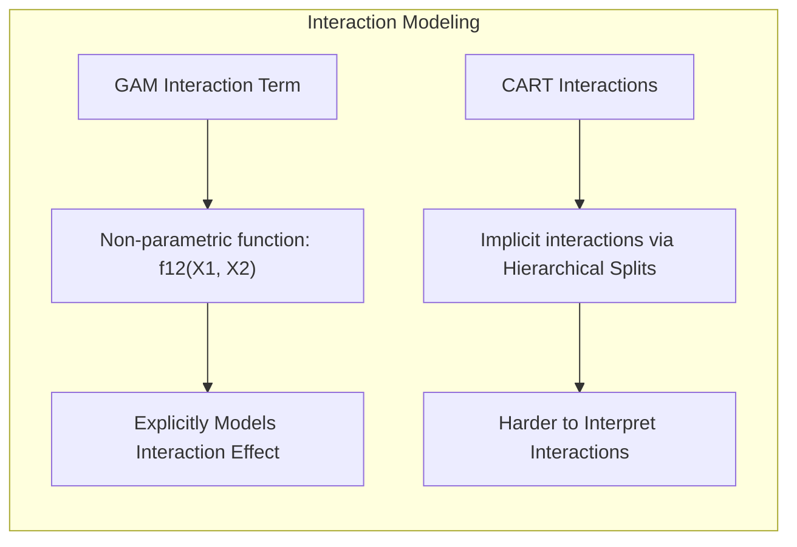
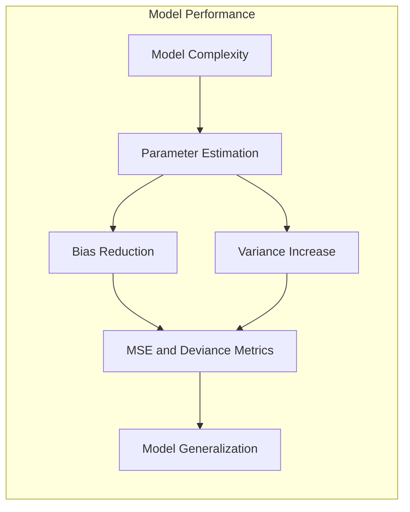

## Título: Modelos Aditivos, Árvores e Métodos Relacionados: Flexibilidade e Suavidade como Vantagens dos GAMs sobre CART



### Introdução

Este capítulo explora as vantagens dos Modelos Aditivos Generalizados (GAMs) sobre as árvores de decisão (CART) na modelagem de dados, com foco em como os GAMs, devido à sua estrutura e à utilização de funções não paramétricas, conseguem modelar não linearidades de forma mais suave e flexível, e como esta diferença impacta a capacidade de generalização e a interpretabilidade do modelo [^9.1]. As árvores de decisão, apesar de sua simplicidade e interpretabilidade, utilizam partições binárias que podem gerar modelos com descontinuidades, o que limita a sua capacidade de modelar certas funções. O objetivo principal deste capítulo é detalhar a origem dessas diferenças na estrutura dos modelos, como essas diferenças afetam o ajuste aos dados, e as suas implicações na qualidade da modelagem, com foco na capacidade de modelar relações complexas entre preditores e respostas, especialmente quando a suavidade e a generalização do modelo são importantes.

### Conceitos Fundamentais

**Conceito 1: Modelagem Suave da Não Linearidade em GAMs**

Uma das principais vantagens dos Modelos Aditivos Generalizados (GAMs) sobre árvores de decisão reside na sua capacidade de modelar não linearidades de forma suave, utilizando funções não paramétricas. Em modelos GAMs, a resposta é modelada através de uma função de ligação $g$ e uma soma de funções não paramétricas $f_j(X_j)$ de cada preditor:
$$
g(\mu(X)) = \alpha + f_1(X_1) + f_2(X_2) + \ldots + f_p(X_p)
$$
onde $\mu(X)$ é a média da resposta, e $f_j(X_j)$ é uma função não paramétrica da variável $X_j$. As funções não paramétricas, como *splines* e *kernels*, permitem que o modelo capture diferentes formas de não linearidade de forma suave e contínua, e o uso de regularização é importante para controlar a sua complexidade. GAMs permitem que modelos com boa capacidade de ajuste a dados com diferentes tipos de relações não lineares sejam construídos.

> 💡 **Exemplo Numérico:**
>
> Considere um modelo GAM com dois preditores, $X_1$ e $X_2$, onde a função de ligação é a identidade $g(\mu(X)) = \mu(X)$. Suponha que $f_1(X_1)$ seja uma função *spline* cúbica que modela o efeito de $X_1$ na resposta, e $f_2(X_2)$ seja uma função *kernel* que modela o efeito de $X_2$. O modelo pode ser expresso como:
>
> $\mu(X) = \alpha + f_1(X_1) + f_2(X_2)$
>
> Vamos supor que após o ajuste do modelo, tenhamos as seguintes expressões para as funções:
>
> $f_1(X_1) = 2X_1 - 0.5X_1^2 + 0.1X_1^3$
>
> $f_2(X_2) = 3e^{-0.2X_2^2}$
>
> e $\alpha = 1$.
>
> Para uma observação específica com $X_1 = 2$ e $X_2 = 1$, a predição do modelo é calculada como:
>
> $f_1(2) = 2(2) - 0.5(2)^2 + 0.1(2)^3 = 4 - 2 + 0.8 = 2.8$
>
> $f_2(1) = 3e^{-0.2(1)^2} = 3e^{-0.2} \approx 3 \times 0.8187 \approx 2.456$
>
> $\mu(X) = 1 + 2.8 + 2.456 = 6.256$
>
> Este exemplo demonstra como as funções não paramétricas $f_1$ e $f_2$ contribuem de maneira não linear para a predição final, permitindo que o GAM capture relações complexas entre os preditores e a resposta. A suavidade das funções garante que pequenas mudanças em $X_1$ e $X_2$ resultem em mudanças graduais na predição.



**Lemma 1:** *GAMs modelam a não linearidade de forma suave utilizando funções não paramétricas que são contínuas e flexíveis. A utilização de funções suaves permite aproximar relações não lineares de forma mais adequada do que modelos com descontinuidades, como árvores de decisão*. A modelagem suave da não linearidade é uma das principais vantagens dos modelos aditivos [^4.3].

**Conceito 2: Divisões Binárias e Descontinuidades em Árvores de Decisão**

As árvores de decisão modelam a não linearidade através de partições binárias sucessivas do espaço de características. A cada nó da árvore, o espaço de características é dividido em duas regiões, e cada região é modelada com base em diferentes critérios ou modelos. A partição do espaço em regiões distintas gera modelos com descontinuidades, pois a predição do modelo muda abruptamente quando a observação atravessa a fronteira entre as regiões. A escolha do preditor e do ponto de corte a cada nó é guiada por uma métrica que busca a pureza ou minimizar a impureza, que geralmente é o índice de Gini ou a entropia. As árvores de decisão, portanto, geram modelos com alta interpretabilidade, mas com limitações na modelagem de não linearidades suaves e contínuas.

> 💡 **Exemplo Numérico:**
>
> Considere uma árvore de decisão simples que usa apenas um preditor, $X$, para prever uma resposta $Y$. A árvore divide o espaço de $X$ em duas regiões: uma com $X \leq 5$ e outra com $X > 5$. Suponha que a predição para $X \leq 5$ seja $Y = 2$, e para $X > 5$ seja $Y = 8$.
>
> Para uma observação com $X = 4.9$, a predição da árvore seria $Y = 2$. No entanto, para uma observação com $X = 5.1$, a predição seria $Y = 8$. Essa mudança abrupta na predição, de 2 para 8, ilustra a descontinuidade gerada pelas partições binárias das árvores de decisão. Mesmo que $X$ mude apenas ligeiramente, a predição muda drasticamente ao atravessar a fronteira de decisão ($X=5$). Isso contrasta com os GAMs, onde pequenas mudanças em $X$ resultariam em pequenas mudanças na predição devido à suavidade das funções não paramétricas.
>
> ```mermaid
> graph LR
>     A[Start] --> B{X <= 5?};
>     B -- Yes --> C[Y=2];
>     B -- No --> D[Y=8];
> ```
> Este diagrama mostra como a árvore de decisão divide o espaço de características e gera uma predição constante em cada região, resultando em descontinuidades.



**Corolário 1:** *As árvores de decisão utilizam partições binárias para modelar não linearidades, o que resulta em modelos com descontinuidades na predição. Essa abordagem, apesar de ser simples e interpretável, pode ter uma capacidade de aproximação limitada e baixa flexibilidade para dados com relações suaves e contínuas*. A capacidade de aproximação de funções suaves é uma desvantagem das árvores de decisão [^4.5].

**Conceito 3: A Flexibilidade dos GAMs e a sua Relação com a Capacidade de Aproximação**

A flexibilidade dos GAMs, devido ao uso de funções não paramétricas como *splines*, permite que eles se ajustem a uma grande variedade de relações não lineares entre preditores e resposta. A escolha do tipo de *spline*, e de outros suavizadores, influencia a sua capacidade de aproximar diferentes tipos de não linearidades. O uso de parâmetros de regularização e suavização controla a sua complexidade e sua capacidade de generalização. GAMs são mais adequados para dados com relações não lineares suaves e contínuas, e onde a interpretabilidade de cada preditor é importante, pois a sua estrutura permite a análise do efeito de cada preditor na resposta, através da avaliação de cada função não paramétrica.

> 💡 **Exemplo Numérico:**
>
> Vamos considerar um cenário onde a relação entre um preditor $X$ e a resposta $Y$ é uma função senoidal,  $Y = 5\sin(X) + \epsilon$, onde $\epsilon$ é um erro aleatório.
>
> Uma árvore de decisão teria dificuldade em aproximar essa função suave, pois precisaria de muitas divisões para tentar capturar a forma senoidal, resultando em uma aproximação em degraus. Por outro lado, um GAM, usando uma *spline* cúbica, poderia aproximar a função senoidal de forma muito mais suave e precisa.
>
> Para demonstrar isso, vamos gerar um conjunto de dados simulados e ajustar um GAM e uma árvore de decisão:
>
> ```python
> import numpy as np
> import pandas as pd
> import matplotlib.pyplot as plt
> from sklearn.tree import DecisionTreeRegressor
> from pygam import LinearGAM, s
>
> # Gerar dados simulados
> np.random.seed(42)
> X = np.linspace(0, 10, 100)
> Y = 5 * np.sin(X) + np.random.normal(0, 1, 100)
> data = pd.DataFrame({'X': X, 'Y': Y})
>
> # Ajustar o GAM
> gam = LinearGAM(s(0)).fit(data['X'], data['Y'])
> gam_preds = gam.predict(data['X'])
>
> # Ajustar a árvore de decisão
> tree = DecisionTreeRegressor(max_depth=5).fit(data[['X']], data['Y'])
> tree_preds = tree.predict(data[['X']])
>
> # Visualizar os resultados
> plt.figure(figsize=(10, 6))
> plt.scatter(data['X'], data['Y'], label='Dados Reais', alpha=0.5)
> plt.plot(data['X'], gam_preds, color='red', label='GAM')
> plt.plot(data['X'], tree_preds, color='green', label='Árvore de Decisão')
> plt.xlabel('X')
> plt.ylabel('Y')
> plt.legend()
> plt.title('Comparação entre GAM e Árvore de Decisão em Dados Senoidais')
> plt.show()
> ```
>
> O código acima gera um gráfico que visualiza como o GAM, utilizando uma função *spline*, consegue aproximar a relação senoidal de forma suave, enquanto a árvore de decisão gera uma aproximação em degraus. Este exemplo demonstra a maior flexibilidade dos GAMs em capturar relações não lineares suaves em comparação com as árvores de decisão. A escolha do parâmetro de suavização no GAM, através de validação cruzada, é importante para evitar *overfitting* e garantir a capacidade de generalização.

> ⚠️ **Nota Importante:** Modelos GAMs, devido à sua utilização de funções não paramétricas e suavização, são capazes de aproximar relações não lineares de forma mais eficiente do que árvores de decisão. A flexibilidade dos GAMs é um dos seus pontos fortes na modelagem estatística [^4.3.3].

> ❗ **Ponto de Atenção:** O uso de suavizadores muito flexíveis em GAMs pode levar a *overfitting*, e a escolha adequada do parâmetro de suavização é fundamental para a estabilidade do modelo e para a sua capacidade de generalização. Modelos pouco suavizados podem ter um grande viés e menor capacidade de ajuste aos dados de treino. A escolha do suavizador deve levar em consideração a natureza dos dados [^4.3].

> ✔️ **Destaque:** A capacidade de modelar não linearidades suaves através de funções não paramétricas é uma vantagem dos modelos aditivos, e permite uma melhor aproximação de funções complexas quando comparados com árvores de decisão. A flexibilidade é um aspecto fundamental na capacidade de modelagem estatística [^4.3].

### Análise da Capacidade de Modelagem: Suavidade, Interações e a Comparação entre GAMs e CART



A comparação entre GAMs e árvores de decisão revela diferenças importantes na forma como cada modelo lida com não linearidades e interações:

1.  **Modelagem da Não Linearidade Suave:** GAMs modelam não linearidades suaves através da combinação linear de funções não paramétricas, que podem ser *splines*, *kernels* ou outras funções que se adaptam aos dados de forma flexível. As funções não paramétricas são contínuas e suaves, e sua combinação permite aproximar funções complexas de forma suave. As árvores de decisão modelam a não linearidade através de partições binárias que dividem o espaço de características em regiões distintas e, portanto, geram aproximações com descontinuidades, onde a predição do modelo pode mudar abruptamente quando uma observação atravessa a fronteira entre duas regiões. A capacidade de modelar funções suaves é uma grande vantagem dos modelos GAMs em relação a modelos baseados em árvores, e essa diferença é fundamental para entender a natureza dos modelos.

2.  **Modelagem de Interações:** Em GAMs, a modelagem de interações é geralmente feita através da adição de termos interativos ou da combinação de funções não paramétricas que representam a interação entre dois ou mais preditores, e modelos mais avançados permitem capturar interações complexas, sem a necessidade de definir as interações de forma prévia. Árvores de decisão modelam as interações de forma indireta, através das decisões tomadas nos nós hierárquicos. Embora as árvores de decisão consigam capturar interações, as interações implícitas geram um modelo que é mais difícil de interpretar quando comparado a modelos que modelam as interações de forma explícita. A escolha da forma de modelar interações também influencia a capacidade do modelo de generalizar para novos dados, e o balanceamento entre modelagem de interações e a sua interpretabilidade deve ser considerada.

    > 💡 **Exemplo Numérico:**
    >
    > Imagine um cenário onde a resposta $Y$ depende da interação entre dois preditores, $X_1$ e $X_2$. Por exemplo, $Y = 2X_1 + 3X_2 + 1.5X_1X_2 + \epsilon$.
    >
    > Um modelo GAM poderia modelar essa interação incluindo um termo de interação $f_{12}(X_1, X_2)$. Uma possível forma de modelar essa interação seria através de um tensor product spline:
    >
    > $g(\mu(X)) = \alpha + f_1(X_1) + f_2(X_2) + f_{12}(X_1, X_2)$
    >
    > Onde $f_{12}(X_1, X_2)$ é uma função não paramétrica que modela a interação entre $X_1$ e $X_2$.
    >
    > Uma árvore de decisão, por outro lado, modelaria essa interação através de divisões binárias sucessivas, que podem ser difíceis de interpretar. Por exemplo, a árvore poderia primeiro dividir o espaço com base em $X_1$, e em seguida, dividir cada uma dessas regiões com base em $X_2$, e assim por diante. As interações são implícitas na estrutura da árvore, e podem não ser tão fáceis de interpretar quanto os termos de interação explícitos em um GAM.
    >
    > Para ilustrar, vamos gerar dados simulados e ajustar um GAM com interações e uma árvore de decisão:
    >
    > ```python
    > import numpy as np
    > import pandas as pd
    > import matplotlib.pyplot as plt
    > from sklearn.tree import DecisionTreeRegressor
    > from pygam import LinearGAM, s, te
    >
    > # Gerar dados simulados com interação
    > np.random.seed(42)
    > X1 = np.linspace(0, 10, 100)
    > X2 = np.linspace(0, 10, 100)
    > X1, X2 = np.meshgrid(X1, X2)
    > Y = 2*X1 + 3*X2 + 1.5*X1*X2 + np.random.normal(0, 5, X1.shape)
    > data = pd.DataFrame({'X1': X1.flatten(), 'X2': X2.flatten(), 'Y': Y.flatten()})
    >
    > # Ajustar o GAM com interação
    > gam = LinearGAM(s(0) + s(1) + te(0, 1)).fit(data[['X1', 'X2']], data['Y'])
    > gam_preds = gam.predict(data[['X1', 'X2']])
    >
    > # Ajustar a árvore de decisão
    > tree = DecisionTreeRegressor(max_depth=5).fit(data[['X1', 'X2']], data['Y'])
    > tree_preds = tree.predict(data[['X1', 'X2']])
    >
    > # Visualizar os resultados
    > # Para simplificar, vamos mostrar um corte em X2=5
    > X1_slice = np.linspace(0, 10, 100)
    > X2_slice = np.ones(100) * 5
    > slice_data = pd.DataFrame({'X1': X1_slice, 'X2': X2_slice})
    > gam_preds_slice = gam.predict(slice_data[['X1', 'X2']])
    > tree_preds_slice = tree.predict(slice_data[['X1', 'X2']])
    >
    > plt.figure(figsize=(10,6))
    > plt.plot(X1_slice, gam_preds_slice, label='GAM com Interação')
    > plt.plot(X1_slice, tree_preds_slice, label='Árvore de Decisão')
    > plt.xlabel('X1')
    > plt.ylabel('Y')
    > plt.title('Comparação da Modelagem de Interação')
    > plt.legend()
    > plt.show()
    > ```
    >
    > Este exemplo mostra como o GAM pode modelar interações de forma mais direta e flexível, enquanto as árvores de decisão modelam interações de forma implícita, através de partições binárias. A interpretação da interação é mais clara no modelo GAM, com um termo específico para modelar esse efeito.



3.  **Capacidade de Aproximação de Funções:** A capacidade de aproximar funções complexas é maior nos modelos GAMs, que modelam a não linearidade de forma suave e contínua, e suas aproximações são locais. As árvores de decisão, embora possam aproximar funções de forma local, não conseguem aproximar funções suaves tão bem quanto modelos com funções não paramétricas. A capacidade de aproximação depende, portanto, da natureza das funções de base e de como os modelos combinam esses componentes para representar relações não lineares. A escolha do modelo depende da capacidade de aproximar a função de resposta, onde as árvores de decisão modelam as descontinuidades e GAMs modelam aproximações mais suaves.

A escolha entre GAMs e árvores de decisão, portanto, depende da natureza dos dados, da necessidade de modelar não linearidades suaves, e da necessidade de interpretar as interações entre os preditores. Modelos como MARS oferecem uma alternativa que combina a flexibilidade dos GAMs com a capacidade de modelar interações, e HME oferece uma flexibilidade maior para a modelagem de dados com diferentes estruturas de não linearidade.

**Lemma 3:** *A modelagem da não linearidade é feita de forma diferente em GAMs e árvores de decisão, e MARS e HME oferecem abordagens alternativas. GAMs utilizam funções não paramétricas para modelar não linearidades de forma suave, enquanto árvores de decisão usam partições binárias que levam a descontinuidades na função. A utilização de funções *spline* em MARS também permite aproximar não linearidades, mas com a combinação de funções lineares por partes*. A escolha da modelagem da não linearidade depende da estrutura do modelo e das suas propriedades de otimização [^4.3.3], [^4.5.1].

### O *Trade-off* entre Flexibilidade e Interpretabilidade

O *trade-off* entre flexibilidade e interpretabilidade é um componente fundamental na escolha de modelos estatísticos, e a utilização de modelos que equilibram esses dois aspectos é importante para a modelagem de dados complexos. Modelos mais flexíveis tendem a apresentar menor *bias* e maior variância, e modelos mais interpretáveis tendem a ser mais estáveis e robustos. A escolha do modelo adequado depende da necessidade de cada aplicação e da capacidade do modelo de generalizar o resultado para dados não vistos.

### As Limitações das Abordagens e a Busca por Modelos Cada Vez Mais Adequados

Apesar da sua importância na modelagem estatística, modelos GAMs e árvores de decisão apresentam limitações. Árvores de decisão podem ter dificuldade em modelar relações suaves e não lineares, e podem gerar modelos com *overfitting* e com pouca estabilidade, enquanto que modelos GAMs, embora sejam mais flexíveis, podem ter maior dificuldade de interpretação, e a otimização da função de custo pode ser mais complexa. O conhecimento sobre as limitações de cada método e a utilização de técnicas de regularização é importante para a construção de modelos mais robustos, e a busca por novos modelos que combinem as vantagens de diferentes abordagens é um campo de pesquisa ativa na área da modelagem estatística.

### Perguntas Teóricas Avançadas: Como a capacidade de aproximar funções complexas e não lineares, nos modelos GAMs e MARS, se relaciona com as métricas de desempenho (erro quadrático médio, deviance), a estabilidade das estimativas e a sua capacidade de generalização?

**Resposta:**

A capacidade de aproximar funções complexas e não lineares em modelos GAMs e MARS tem uma relação direta com as métricas de desempenho (erro quadrático médio, deviance), a estabilidade das estimativas e a capacidade de generalização, e a escolha do modelo e de seus componentes deve considerar todos esses fatores.

Em modelos GAMs, a utilização de funções não paramétricas permite a aproximação de uma ampla gama de relações não lineares. A suavidade das funções e o seu ajuste são controlados pelos parâmetros de suavização, e a sua escolha afeta a qualidade do ajuste. Funções *spline* e *kernels* são utilizadas para modelar as funções não paramétricas, e elas têm diferentes propriedades de aproximação e também um impacto na qualidade das estimativas e na distribuição dos resíduos. A minimização da deviance ou do erro quadrático médio (MSE) garante que o modelo tenha um bom ajuste aos dados de treino, e a validação cruzada permite controlar o overfitting. Modelos mais complexos e com mais parâmetros podem ter um erro menor nos dados de treino, mas também têm maior variância e uma menor capacidade de generalização.

Em modelos MARS, a aproximação de funções complexas é feita através da combinação de funções *spline* lineares por partes e de suas interações. A adição de termos do modelo é feita utilizando o critério GCV, que busca o melhor balanço entre a complexidade do modelo e a sua capacidade de ajuste aos dados de treino. Modelos mais complexos, com muitas interações, podem se ajustar mais aos dados de treino, mas também aumentar o risco de overfitting e diminuir a capacidade de generalização. O parâmetro do GCV é utilizado para controlar essa complexidade.

As métricas de desempenho, como MSE ou a deviance, quantificam a qualidade do ajuste, e a utilização de validação cruzada permite estimar o seu desempenho em dados não vistos, o que auxilia na escolha dos parâmetros de cada modelo. A capacidade de modelar dados complexos não é o único aspecto importante, pois a capacidade de generalização e a estabilidade dos estimadores também são componentes relevantes para a escolha de um modelo apropriado. A estabilidade do modelo, portanto, é um aspecto crucial que deve ser analisado para garantir resultados confiáveis.

> 💡 **Exemplo Numérico:**
>
> Vamos considerar um conjunto de dados simulado onde a relação entre um preditor $X$ e a resposta $Y$ é não linear, mas suave. Vamos ajustar um GAM e um modelo linear para comparar as métricas de desempenho.
>
> ```python
> import numpy as np
> import pandas as pd
> import matplotlib.pyplot as plt
> from sklearn.linear_model import LinearRegression
> from pygam import LinearGAM, s
> from sklearn.metrics import mean_squared_error
> from sklearn.model_selection import train_test_split
>
> # Gerar dados simulados
> np.random.seed(42)
> X = np.linspace(0, 10, 100)
> Y = 2 * X + 0.5 * X**2 + 3 * np.sin(X) + np.random.normal(0, 5, 100)
> data = pd.DataFrame({'X': X, 'Y': Y})
>
> # Dividir os dados em treino e teste
> X_train, X_test, y_train, y_test = train_test_split(data[['X']], data['Y'], test_size=0.3, random_state=42)
>
> # Ajustar o GAM
> gam = LinearGAM(s(0)).fit(X_train, y_train)
> gam_preds = gam.predict(X_test)
> gam_mse = mean_squared_error(y_test, gam_preds)
>
> # Ajustar o modelo linear
> linear_model = LinearRegression().fit(X_train, y_train)
> linear_preds = linear_model.predict(X_test)
> linear_mse = mean_squared_error(y_test, linear_preds)
>
> # Imprimir os resultados
> print(f'MSE do GAM: {gam_mse:.2f}')
> print(f'MSE do modelo linear: {linear_mse:.2f}')
>
> # Visualizar os resultados
> plt.figure(figsize=(10, 6))
> plt.scatter(X_test, y_test, label='Dados de Teste', alpha=0.5)
> plt.plot(X_test, gam_preds, color='red', label='GAM')
> plt.plot(X_test, linear_preds, color='green', label='Modelo Linear')
> plt.xlabel('X')
> plt.ylabel('Y')
> plt.legend()
> plt.title('Comparação de MSE entre GAM e Modelo Linear')
> plt.show()
> ```
>
> Este exemplo demonstra como o GAM, ao modelar a não linearidade, consegue um MSE menor do que o modelo linear, que não captura a complexidade da relação entre $X$ e $Y$. A validação cruzada pode ser utilizada para escolher o parâmetro de suavização do GAM e evitar o overfitting. A estabilidade das estimativas pode ser avaliada através da análise dos resíduos e da variância dos parâmetros do modelo.



**Lemma 5:** *A capacidade de aproximar funções complexas, nos modelos GAMs e MARS, está relacionada com a escolha das funções de base e seus parâmetros. O controle do *trade-off* entre *bias* e variância é essencial para modelos que sejam capazes de generalizar para dados não vistos, e a utilização de métodos de regularização e validação cruzada é fundamental*. A escolha das funções de base influencia diretamente a capacidade de aproximação de diferentes tipos de não linearidades [^9.4.1].

**Corolário 5:** *A relação entre a escolha das funções de base, a sua capacidade de aproximação e as métricas de desempenho, como MSE e deviance, e a sua influência na capacidade de generalização do modelo, é um componente fundamental da modelagem estatística. Modelos com boa capacidade de aproximação, com métricas de desempenho satisfatórias, e com parâmetros que garantem a estabilidade da solução, devem ser escolhidos em detrimento de outros modelos*. A escolha dos componentes dos modelos é essencial para o seu desempenho e a sua capacidade de generalização [^9.4.2].

> ⚠️ **Ponto Crucial**: A capacidade de aproximar funções complexas e não lineares em modelos como GAMs e MARS depende da escolha das funções de base e dos parâmetros de suavização, e a utilização do GCV e métodos de validação cruzada é essencial para garantir um modelo que combine ajuste aos dados de treino e capacidade de generalização. O *trade-off* entre o *bias* e a variância é um aspecto importante na escolha do melhor modelo [^4.3.3].

### Conclusão

Este capítulo apresentou um resumo integrativo das abordagens de modelagem, enfatizando as suas diferenças, similaridades, e como a escolha entre modelos, a sua formulação, e os métodos de otimização, afeta os resultados da análise. A compreensão dos conceitos explorados neste documento, juntamente com uma análise detalhada das propriedades dos dados, é fundamental para a construção de modelos estatísticos de aprendizado supervisionado que sejam robustos, eficientes, interpretáveis, e com alta capacidade de modelagem de relações complexas.

### Footnotes

[^4.1]: "In this chapter we begin our discussion of some specific methods for super-vised learning. These techniques each assume a (different) structured form for the unknown regression function, and by doing so they finesse the curse of dimensionality. Of course, they pay the possible price of misspecifying the model, and so in each case there is a tradeoff that has to be made." *(Trecho de "Additive Models, Trees, and Related Methods")*

[^4.2]: "Regression models play an important role in many data analyses, providing prediction and classification rules, and data analytic tools for understand-ing the importance of different inputs." *(Trecho de "Additive Models, Trees, and Related Methods")*

[^4.3]: "In this section we describe a modular algorithm for fitting additive models and their generalizations. The building block is the scatterplot smoother for fitting nonlinear effects in a flexible way. For concreteness we use as our scatterplot smoother the cubic smoothing spline described in Chapter 5." *(Trecho de "Additive Models, Trees, and Related Methods")*

[^4.3.1]: "The additive model has the form $Y = \alpha + \sum_{j=1}^p f_j(X_j) + \varepsilon$, where the error term $\varepsilon$ has mean zero." * (Trecho de "Additive Models, Trees, and Related Methods")*

[^4.3.2]: "Given observations $x_i, y_i$, a criterion like the penalized sum of squares (5.9) of Section 5.4 can be specified for this problem, $PRSS(\alpha, f_1, f_2,..., f_p) = \sum_i^N (y_i - \alpha - \sum_j^p f_j(x_{ij}))^2 + \sum_j^p \lambda_j \int(f_j''(t_j))^2 dt_j$" * (Trecho de "Additive Models, Trees, and Related Methods")*

[^4.3.3]: "where the $\lambda_j > 0$ are tuning parameters. It can be shown that the minimizer of (9.7) is an additive cubic spline model; each of the functions $f_j$ is a cubic spline in the component $X_j$, with knots at each of the unique values of $x_{ij}, i = 1,..., N$." *(Trecho de "Additive Models, Trees, and Related Methods")*

[^4.4]: "For two-class classification, recall the logistic regression model for binary data discussed in Section 4.4. We relate the mean of the binary response $\mu(X) = Pr(Y = 1|X)$ to the predictors via a linear regression model and the logit link function: $\log(\mu(X)/(1 – \mu(X)) = \alpha + \beta_1 X_1 + \ldots + \beta_pX_p$." * (Trecho de "Additive Models, Trees, and Related Methods")*

[^4.4.1]: "The additive logistic regression model replaces each linear term by a more general functional form: $\log(\mu(X)/(1 – \mu(X))) = \alpha + f_1(X_1) + \ldots + f_p(X_p)$, where again each $f_j$ is an unspecified smooth function." * (Trecho de "Additive Models, Trees, and Related Methods")*

[^4.4.2]: "While the non-parametric form for the functions $f_j$ makes the model more flexible, the additivity is retained and allows us to interpret the model in much the same way as before. The additive logistic regression model is an example of a generalized additive model." *(Trecho de "Additive Models, Trees, and Related Methods")*

[^4.4.3]: "In general, the conditional mean $\mu(X)$ of a response $Y$ is related to an additive function of the predictors via a link function $g$: $g[\mu(X)] = \alpha + f_1(X