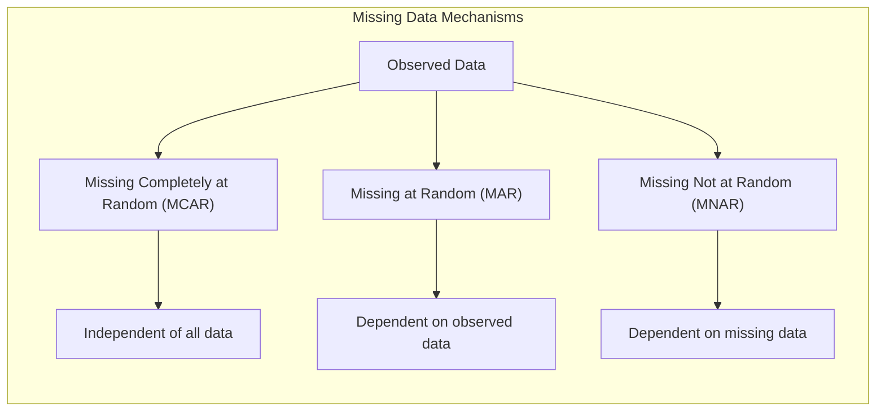
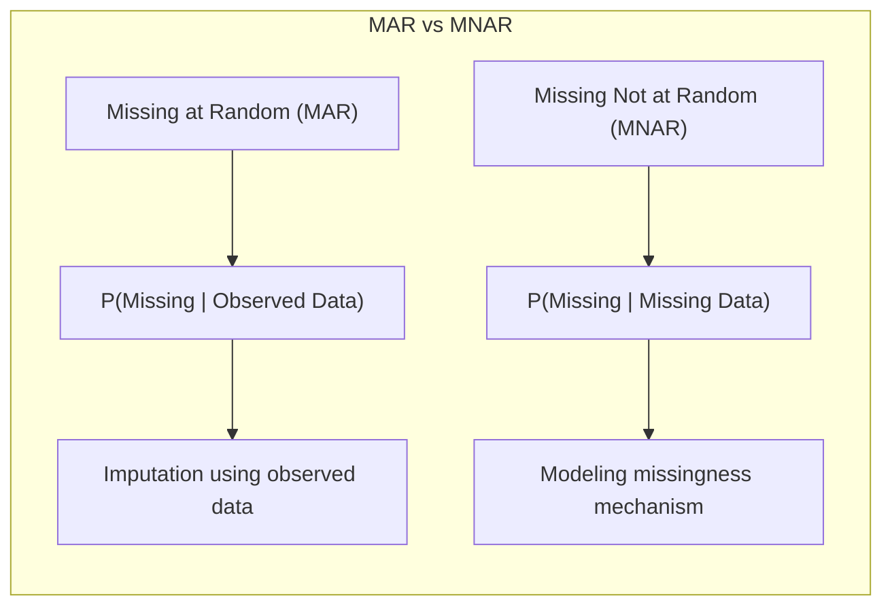
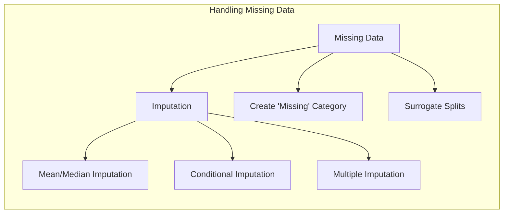
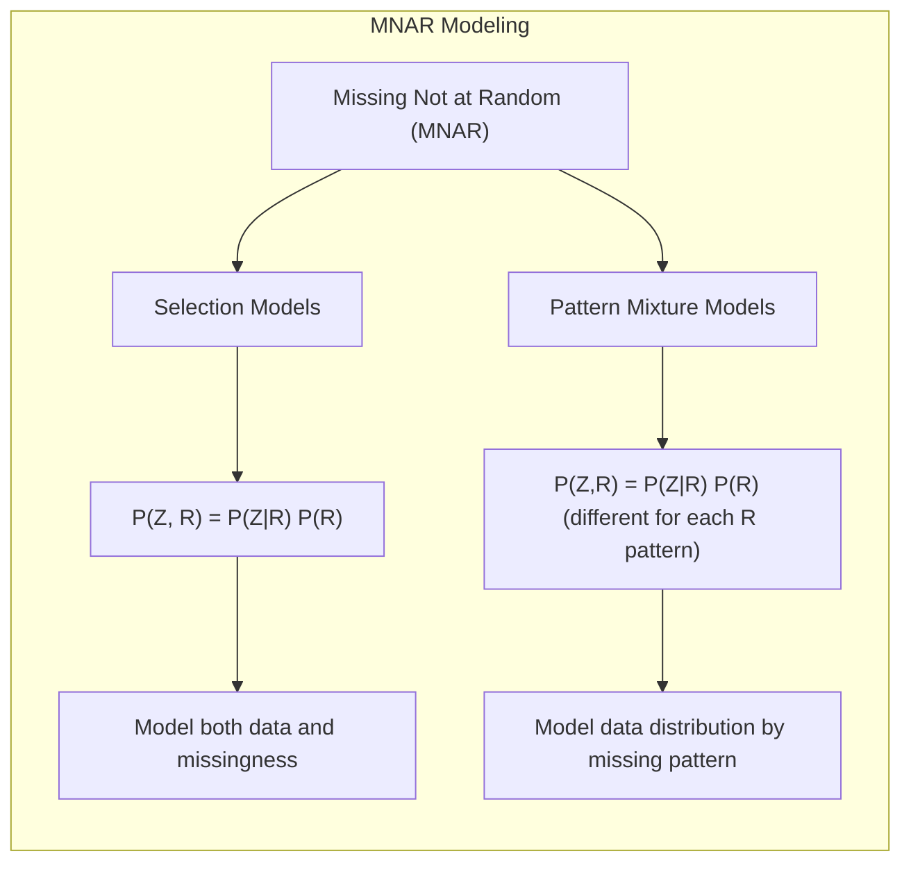

## Título: Modelos Aditivos, Árvores e Métodos Relacionados: Mecanismos de Dados Faltantes, MCAR, Implicações e Avaliação



### Introdução

Este capítulo explora os mecanismos de dados faltantes, focando nas definições de Missing Completely at Random (MCAR), Missing at Random (MAR) e Missing Not at Random (MNAR), e como cada mecanismo afeta as abordagens de modelagem e imputação, com foco na aplicação em Modelos Aditivos Generalizados (GAMs), árvores de decisão e outras abordagens relacionadas [^9.1]. O capítulo detalha a definição de cada mecanismo, as suas implicações para a validade das estimativas dos modelos e como diferentes métodos de imputação e modelagem podem ser utilizados para lidar com dados faltantes sob diferentes hipóteses. O objetivo principal é apresentar uma visão aprofundada sobre como o mecanismo de dados faltantes influencia a modelagem estatística e como a utilização de métodos de imputação e avaliação dos dados ausentes é fundamental para a construção de modelos robustos e confiáveis.

### Conceitos Fundamentais

**Conceito 1: Tipos de Mecanismos de Dados Faltantes**

A presença de dados faltantes em modelos de aprendizado supervisionado é comum em aplicações reais, e a sua modelagem depende de qual é o mecanismo que gera esses dados faltantes, que pode ser classificado em três tipos principais:

*   **Missing Completely at Random (MCAR):** Os dados são considerados MCAR quando a probabilidade de um valor ser ausente é completamente independente dos valores observados e dos valores que estão ausentes. O mecanismo de dados faltantes, portanto, é aleatório e não correlacionado com os dados, e não há padrão específico nos dados ausentes.
*   **Missing at Random (MAR):** Os dados são considerados MAR quando a probabilidade de um valor ser ausente depende dos valores observados, mas não depende dos valores que estão ausentes.  O mecanismo de dados faltantes é aleatório, mas condicionado aos dados observados, e as observações que apresentam informações podem conter informações sobre os dados faltantes, e essa informação pode ser utilizada na modelagem.
*   **Missing Not at Random (MNAR):** Os dados são considerados MNAR quando a probabilidade de um valor ser ausente depende do valor que está ausente.  Neste cenário, os dados ausentes podem conter informação relevante, e o mecanismo que levou à ausência de dados deve ser modelado. O modelo de inferência, neste caso, deve considerar como os dados ausentes se relacionam com as variáveis utilizadas na modelagem.

A escolha da abordagem apropriada para lidar com dados ausentes depende do mecanismo que gera os dados faltantes.  O conhecimento sobre o tipo de dados faltantes é fundamental para a escolha dos modelos e dos métodos de imputação mais adequados. A avaliação das implicações de cada mecanismo é importante na análise estatística.

**Lemma 1:** *Os dados faltantes podem ser classificados como MCAR, MAR ou MNAR, e a escolha do mecanismo apropriado é fundamental para a modelagem e imputação de valores ausentes. A hipótese sobre qual tipo de dado faltante é presente no problema é uma parte importante na modelagem estatística*. A escolha do método de modelagem e de imputação depende do mecanismo que gera a ausência dos dados [^9.6].

> 💡 **Exemplo Numérico:**
> Imagine um conjunto de dados com informações sobre pacientes, incluindo idade, gênero e níveis de colesterol.
>
> *   **MCAR:** Se a ausência do nível de colesterol em alguns pacientes ocorre devido a um erro aleatório no laboratório, sem qualquer relação com a idade ou o gênero desses pacientes, então os dados são MCAR.
> *   **MAR:** Se a ausência do nível de colesterol é mais frequente em pacientes mais velhos (uma informação observada), mas não depende do valor real do nível de colesterol (o dado faltante), então os dados são MAR.
> *   **MNAR:** Se a ausência do nível de colesterol ocorre porque pacientes com níveis muito altos de colesterol se recusam a fazer o exame, então os dados são MNAR, pois a ausência depende do próprio valor que está faltando.
>
> A escolha do método de imputação dependerá de qual desses mecanismos é mais plausível.

**Conceito 2: Missing Completely at Random (MCAR) e suas Implicações**

Dados que são considerados Missing Completely at Random (MCAR) são o tipo mais simples de dados faltantes, pois a probabilidade de um valor ser ausente é completamente aleatória e independente dos dados observados e dos dados ausentes.  Em outras palavras, não existe nenhuma informação nos dados que explique a sua ausência.  A implicação da hipótese MCAR é que o conjunto de dados observados é uma amostra aleatória do conjunto de dados completo.  Quando a hipótese MCAR é satisfeita, a remoção de observações com dados faltantes não induz *bias* no modelo. Métodos de imputação simples como média ou mediana podem ser utilizados, mas o uso de modelos mais complexos não adiciona informação relevante.  No entanto, na prática, o mecanismo MCAR é pouco comum, e geralmente a ausência de dados tem alguma razão, que pode ser modelada com os outros tipos de dados faltantes.

**Corolário 1:** *Sob a hipótese MCAR, os dados faltantes são aleatórios e não enviesam as estimativas dos parâmetros do modelo.  O uso de métodos de imputação simples é apropriado para dados MCAR, e modelos complexos para tratar dados ausentes não acrescentam informação relevante*.  A hipótese MCAR simplifica a modelagem, mas é raramente encontrada na prática [^9.6].

> 💡 **Exemplo Numérico:**
>
> Considere um conjunto de dados com 100 observações, onde cada observação tem duas variáveis: X e Y. Suponha que 10 valores de Y estão faltando. Se esses 10 valores estão faltando devido a um erro aleatório na coleta de dados (por exemplo, o equipamento de medição falhou aleatoriamente), e a probabilidade de um valor faltar é igual para todos os valores de Y, então os dados são MCAR.
>
> Neste caso, imputar os valores ausentes de Y com a média dos valores observados de Y não introduziria viés significativo no modelo, pois a ausência dos dados não está relacionada com os valores de X ou de Y.

**Conceito 3: Implicações de Modelagem para Dados MAR e MNAR**

*   **Missing at Random (MAR):** Dados que são considerados MAR são faltantes de forma aleatória, mas dependendo de variáveis observadas.  Por exemplo, se a probabilidade de uma pessoa não responder a um questionário sobre renda depende do seu nível de escolaridade (que é uma informação observada), mas não depende da sua renda (que é o dado ausente), então os dados são MAR.  A imputação dos valores ausentes deve levar em consideração a informação presente nas variáveis observadas.  A utilização de modelos de imputação que levem em consideração a dependência entre os dados ausentes e as variáveis observadas pode reduzir o *bias*. A modelagem de dados ausentes MAR deve considerar a sua dependência com as variáveis observadas.
*   **Missing Not at Random (MNAR):** Dados que são considerados MNAR são faltantes quando a probabilidade de um valor ser ausente depende do próprio valor que está faltando.  Por exemplo, uma pessoa que tem problemas financeiros pode ter maior probabilidade de omitir informações sobre seus ganhos.  A modelagem de dados MNAR é um grande desafio, e envolve considerar o mecanismo que gerou os dados ausentes. Abordagens como modelagem de seleção e modelos de *pattern-mixture* podem ser utilizados para lidar com esse tipo de dados, mas requerem um conhecimento sobre como os dados estão faltando e as suas propriedades, e são modelos muito complexos.



> ⚠️ **Nota Importante:** A modelagem de dados MAR e MNAR requer abordagens mais complexas do que dados MCAR.  A escolha do método de imputação e modelagem deve levar em consideração o mecanismo que gera a ausência dos dados. A modelagem de dados com valores ausentes deve ser feita com cuidado para evitar o *bias* e perda de informação [^9.6].

> ❗ **Ponto de Atenção:** Modelos de imputação que não consideram o mecanismo de dados faltantes podem levar a resultados viesados e com um menor poder preditivo. A identificação e modelagem da dependência entre dados ausentes e outras variáveis é fundamental em cenários com dados MAR e MNAR [^9.6].

> ✔️ **Destaque:**  A escolha da abordagem para lidar com valores ausentes, incluindo a imputação, a modelagem da probabilidade de dados ausentes e a utilização de modelos que incorporem o mecanismo de dados ausentes, deve considerar a natureza dos dados e o tipo de modelo utilizado. A modelagem de dados faltantes é importante para a construção de modelos mais robustos [^9.6].

> 💡 **Exemplo Numérico:**
>
> Considere um estudo sobre o consumo de álcool, onde se coleta informações sobre a idade, gênero e quantidade de álcool consumida por cada participante.
>
> *   **MAR:** Se a probabilidade de um participante não informar a quantidade de álcool consumida depende da sua idade (participantes mais jovens são menos propensos a relatar), mas não depende da quantidade real de álcool que consomem, então os dados são MAR. Nesse caso, ao imputar a quantidade de álcool consumida, um modelo de imputação condicional que leve em conta a idade do participante pode ser usado para reduzir o *bias*.
> *   **MNAR:** Se a probabilidade de um participante não informar a quantidade de álcool consumida depende da quantidade real de álcool que consomem (pessoas que bebem muito são mais propensas a não relatar), então os dados são MNAR. Nesse caso, a modelagem deve considerar essa relação entre a quantidade real de álcool e a probabilidade de não relatar. Modelos mais avançados, como modelos de seleção, podem ser necessários para lidar com essa situação.

### Abordagens para Lidar com Dados Faltantes: Imputação, Criação de Categorias e *Surrogate Splits*



A modelagem estatística com dados faltantes requer a escolha de abordagens apropriadas para lidar com esses valores ausentes, e as abordagens mais comuns são:

1.  **Imputação:** Imputação envolve a substituição dos valores ausentes por valores estimados, de acordo com um dado método.
    *   **Imputação com Média ou Mediana:** Os valores ausentes são substituídos pela média ou mediana das observações não ausentes. É um método simples e rápido, mas pode introduzir *bias* nos modelos, especialmente quando os dados não são MCAR.
    *   **Imputação Condicional:** Os valores ausentes são imputados com base em um modelo construído usando os outros preditores. Por exemplo, um modelo de regressão pode ser utilizado para estimar um valor de acordo com os dados observados. Modelos condicionais podem levar em consideração relações entre os preditores.
    *   **Imputação Múltipla:** A imputação múltipla cria diversos conjuntos de dados com imputações diferentes, e cada modelo é utilizado para ajustar os parâmetros de acordo com os diferentes conjuntos de dados. A combinação das estimativas, leva em consideração a incerteza da imputação, e permite estimativas mais robustas e com menor viés.
2. **Criação de uma Categoria “Ausente”:** Para preditores categóricos, é criada uma categoria adicional "ausente", que representa as observações onde o valor do preditor não foi observado. Esta abordagem é apropriada para preditores categóricos quando o fato da informação não estar disponível é relevante e pode influenciar na modelagem. A criação de uma categoria "ausente" permite que o modelo aprenda a modelar a ausência da informação.
3.  ***Surrogate Splits* em Árvores de Decisão:** Em árvores de decisão, quando um preditor tem um valor ausente, um *surrogate split* é utilizado para avaliar qual o melhor preditor substituto para a divisão do nó. O *surrogate split* é escolhido como aquele que melhor aproxima a divisão que seria feita pelo preditor original, com base na impureza.  Os *surrogate splits* permitem que o modelo utilize informação de outros preditores mesmo quando a informação do preditor principal esteja ausente.

A escolha de uma abordagem para lidar com dados ausentes depende do tipo de dados, da quantidade de dados ausentes, do mecanismo gerador dos dados ausentes e da necessidade de manter o *bias* e a variância do modelo controladas.

**Lemma 4:** *A escolha da abordagem de imputação de dados ausentes influencia diretamente os resultados do modelo, e a escolha entre imputação, a criação da categoria ausente, ou surrogate splits depende da natureza dos dados e do modelo utilizado. Abordagens mais sofisticadas podem ser utilizadas para dados não MCAR, onde as imputações dependem das outras variáveis, e onde o mecanismo dos dados ausentes deve ser considerado*. A escolha da melhor abordagem deve ser feita levando em consideração as suas limitações [^4.5.1], [^4.5.2].

> 💡 **Exemplo Numérico:**
>
> Considere um conjunto de dados com as variáveis `idade`, `renda`, e `nivel_educacional`. Suponha que há dados faltantes na variável `renda`.
>
> 1.  **Imputação com Média/Mediana:** Se imputarmos os valores faltantes de `renda` com a média das rendas observadas, teremos:
>
>     ```python
>     import numpy as np
>     import pandas as pd
>
>     data = {'idade': [25, 30, 35, 40, 45, 50],
>             'renda': [2000, 3000, np.nan, 4000, np.nan, 5000],
>             'nivel_educacional': ['Ensino Médio', 'Superior', 'Superior', 'Ensino Médio', 'Superior', 'Pós-graduação']}
>     df = pd.DataFrame(data)
>
>     media_renda = df['renda'].mean()
>     df_imputed_mean = df.fillna({'renda': media_renda})
>     print("Imputação com a Média:\n", df_imputed_mean)
>     ```
>
>     Essa abordagem é simples, mas não considera a relação entre renda e outras variáveis.
>
> 2.  **Imputação Condicional:** Podemos usar a idade para prever a renda usando um modelo de regressão linear:
>
>     ```python
>     from sklearn.linear_model import LinearRegression
>
>     df_not_na = df.dropna(subset=['renda'])
>     model = LinearRegression()
>     model.fit(df_not_na[['idade']], df_not_na['renda'])
>
>     missing_indices = df['renda'].isna()
>     imputed_values = model.predict(df[missing_indices][['idade']])
>     df_imputed_conditional = df.copy()
>     df_imputed_conditional.loc[missing_indices, 'renda'] = imputed_values
>     print("\nImputação Condicional:\n", df_imputed_conditional)
>     ```
>     Essa abordagem leva em consideração a relação entre idade e renda.
>
> 3.  **Criação de Categoria "Ausente":** Se `nivel_educacional` for um preditor categórico, podemos criar uma categoria "ausente":
>
>     ```python
>     df_category = df.copy()
>     df_category['nivel_educacional'] = df_category['nivel_educacional'].fillna('Ausente')
>     print("\nCategoria Ausente:\n", df_category)
>     ```
>     Essa abordagem é útil se a ausência de informação de nível educacional tiver um significado.
>
> A escolha entre esses métodos dependerá da natureza dos dados e do problema.

### Impacto da Escolha do Tratamento de Valores Ausentes na Interpretabilidade e Generalização do Modelo

A escolha do tratamento dos dados faltantes influencia a interpretabilidade e a capacidade de generalização dos modelos.

*   **Imputação Simples (Média/Mediana):** A imputação com a média ou mediana, embora seja simples, pode distorcer as relações nos dados, e levar a modelos com menor qualidade preditiva. A imputação simples também introduz *bias* nos modelos, principalmente quando os dados não são MCAR. A sua interpretação também pode ser mais difícil, pois os valores imputados são valores que não foram medidos diretamente, e a informação utilizada para a imputação não está claramente relacionada ao modelo final.
*  **Imputação Condicional e Múltipla:** Modelos de imputação condicional ou a imputação múltipla buscam levar em consideração a incerteza relacionada aos dados faltantes e as relações entre as variáveis.  O uso de imputação mais complexas pode aumentar a capacidade do modelo de lidar com dados faltantes, e também modelar relações mais complexas.
*   **Categoria "Ausente":**  A utilização da categoria "ausente" permite que o modelo aprenda o efeito da ausência de informação sobre a resposta.  A sua utilização é útil quando a ausência dos dados tem algum significado, e pode contribuir para uma modelagem mais completa do problema.
*   ***Surrogate Splits*:** A utilização de *surrogate splits* permite lidar com dados ausentes de forma implícita, o que evita a necessidade de imputação. A utilização de *surrogate splits* é mais apropriada quando há correlação entre preditores, e a sua escolha depende do critério de impureza da árvore, e dos preditores que foram definidos como mais relevantes.

A escolha da forma de lidar com dados faltantes deve ser feita de forma cuidadosa, considerando a natureza dos dados e do modelo, o *trade-off* entre *bias* e variância e também o seu impacto na interpretabilidade do modelo. O tratamento de dados faltantes é um componente importante na modelagem estatística, e a escolha apropriada de cada técnica pode melhorar o desempenho do modelo e a sua capacidade de generalização para dados não vistos.

###  A Relação com Métodos de Regularização e Seleção de Variáveis

A escolha do método para lidar com dados faltantes se relaciona diretamente com as técnicas de regularização e seleção de variáveis. Métodos de imputação que introduzem *bias* podem ser combinados com regularização para evitar o *overfitting*.  Métodos de seleção de variáveis podem ser utilizados para diminuir o impacto de valores ausentes em dados com alta dimensionalidade. A utilização de uma metodologia adequada para lidar com dados ausentes garante que os resultados sejam mais robustos e que a modelagem seja feita de forma apropriada aos dados.

### Perguntas Teóricas Avançadas: Como os mecanismos de Missing Not At Random (MNAR) afetam as propriedades assintóticas dos estimadores, e como os modelos de seleção (selection models) e *pattern mixture* tentam modelar a distribuição dos dados sob essas hipóteses, e como essa modelagem se relaciona com o conceito de *identifiability*?

**Resposta:**

Os mecanismos de Missing Not At Random (MNAR) afetam as propriedades assintóticas dos estimadores, como a consistência e a ausência de *bias*, e os modelos de seleção (*selection models*) e *pattern mixture* são abordagens para modelar dados sob estas hipóteses. A modelagem de dados MNAR é complexa e desafiadora, e a capacidade de identificar e modelar a sua influência nos resultados é fundamental para a modelagem estatística.

Dados são considerados MNAR quando a probabilidade de um valor ser ausente depende do valor que está faltando e de informações observadas, e podem ser expressos como:

$$
P(R|Z) = P(R|Z_{obs}, Z_{mis})
$$
onde $R$ é uma variável indicadora que representa a ausência de informação, $Z$ é o conjunto de dados (observados e ausentes), $Z_{obs}$ são as observações e $Z_{mis}$ os dados faltantes.  Sob este cenário, os dados ausentes não são aleatórios e devem ser modelados.

Modelos de seleção (*selection models*) buscam modelar a distribuição dos dados observados e a distribuição da ausência dos dados simultaneamente. Esses modelos utilizam um processo que divide a probabilidade conjunta dos dados observados e o mecanismo de ausência:

$$
P(Z, R) = P(Z|R) P(R)
$$

Modelos de seleção buscam modelar como a probabilidade de o dado estar ausente está relacionada aos valores que estão faltando e aos valores que foram observados. Em geral, para a modelagem de dados MNAR com métodos de seleção, deve haver informação disponível sobre a estrutura dos dados ausentes.

Modelos de *pattern mixture* modelam a distribuição dos dados condicionando ao padrão de valores ausentes:

$$
P(Z,R) = P(Z|R) P(R)
$$

onde a probabilidade $P(Z|R)$ é modelada de forma diferente para cada padrão de dados faltantes, o que permite avaliar como a distribuição de dados é afetada pela presença de valores ausentes.  A sua implementação é mais difícil em modelos com muitos preditores e com muitos padrões de dados faltantes.  Modelos *pattern-mixture* buscam modelos que capturem a natureza do mecanismo de dados faltantes, e se os dados seguem distribuições diferentes de acordo com os padrões de dados faltantes.

Sob a hipótese MNAR, os estimadores obtidos com modelos que não levam em consideração o mecanismo de dados faltantes são viesados e inconsistentes. As propriedades assintóticas dos estimadores são afetadas, e os resultados da modelagem podem não ser confiáveis. Modelos de seleção e *pattern mixture* buscam mitigar esse viés, mas requerem um entendimento detalhado sobre o mecanismo gerador dos dados faltantes, e suas propriedades. A identificabilidade do modelo, a sua capacidade de estimar os parâmetros, é um componente importante na escolha do modelo adequado para dados MNAR. Modelos com um grande número de parâmetros podem não ser identificáveis sem restrições adicionais.



> 💡 **Exemplo Numérico:**
>
> Considere um estudo sobre a relação entre depressão e renda. Suponha que pessoas com depressão severa são menos propensas a relatar sua renda, e a probabilidade de não relatar a renda depende da própria renda (pessoas com baixa renda e depressão severa são mais propensas a não relatar).
>
> Nesse caso, temos dados MNAR. Modelos de seleção ou *pattern mixture* seriam necessários.
>
> Um modelo de seleção poderia modelar a probabilidade de não relatar a renda como uma função da renda real e da severidade da depressão. Por exemplo:
>
> $P(R = 1 | Z) = \text{logit}^{-1}(\alpha + \beta_1 \text{renda} + \beta_2 \text{depressao})$
>
> Onde R é 1 se a renda não é relatada e 0 caso contrário.
>
> Um modelo *pattern mixture* poderia modelar a distribuição da renda separadamente para os grupos onde a renda foi relatada e onde a renda não foi relatada, e o modelo pode estimar distribuições diferentes para cada padrão de dados.
>
> A não utilização desses métodos levaria a estimativas viesadas da relação entre depressão e renda, pois a ausência da informação é relacionada com a própria renda.

**Lemma 5:** *A hipótese de dados faltantes que não são aleatórios (MNAR) afeta as propriedades estatísticas dos estimadores, como a sua consistência e *bias*. Modelos de seleção e modelos *pattern mixture* buscam modelar a distribuição dos dados sob a hipótese de dados faltantes MNAR, e são importantes para que os parâmetros sejam estimados de forma mais precisa e adequada*.  A utilização de modelos adequados para dados MNAR requer um cuidado maior na modelagem [^9.6].

**Corolário 5:** *A modelagem de dados MNAR é um desafio na modelagem estatística e requer modelos mais complexos que modelem o mecanismo que gera os dados ausentes e, também, a distribuição dos dados observados.  As abordagens para lidar com dados MNAR devem ser consideradas na análise e construção de modelos estatísticos robustos e com boa capacidade preditiva. A escolha inadequada dos modelos para dados MNAR pode levar a resultados viesados e pouco confiáveis*. A escolha do modelo para dados MNAR é importante para a validade dos resultados [^4.3.3].

> ⚠️ **Ponto Crucial**: A escolha da abordagem para lidar com dados MNAR (Missing Not At Random) afeta a consistência, o *bias* e as propriedades assintóticas dos estimadores, e a escolha de um modelo deve levar em consideração o mecanismo gerador dos dados ausentes. Métodos que não consideram o mecanismo de dados ausentes podem levar a resultados viesados e modelos com baixa capacidade preditiva. A escolha adequada de modelos e abordagens de imputação para dados faltantes é um aspecto importante da modelagem estatística [^4.3.2].

### Conclusão

Este capítulo apresentou um resumo das principais abordagens para modelagem estatística, com foco na escolha de modelos, métodos de otimização, funções de ligação, métricas de avaliação e tratamento de valores ausentes, com foco nas propriedades de cada abordagem, e como ela se relaciona com os modelos de aprendizado supervisionado.  A integração de diferentes ferramentas e técnicas de modelagem oferece um conjunto poderoso de ferramentas para a modelagem de dados complexos e com diferentes tipos de relações. O conhecimento das diferentes abordagens e a capacidade de analisar os *trade-offs* entre flexibilidade, interpretabilidade, estabilidade e generalização é fundamental para a modelagem estatística avançada.

### Footnotes

[^4.1]: "In this chapter we begin our discussion of some specific methods for super-vised learning. These techniques each assume a (different) structured form for the unknown regression function, and by doing so they finesse the curse of dimensionality. Of course, they pay the possible price of misspecifying the model, and so in each case there is a tradeoff that has to be made." *(Trecho de "Additive Models, Trees, and Related Methods")*

[^4.2]: "Regression models play an important role in many data analyses, providing prediction and classification rules, and data analytic tools for understand-ing the importance of different inputs." *(Trecho de "Additive Models, Trees, and Related Methods")*

[^4.3]: "In this section we describe a modular algorithm for fitting additive models and their generalizations. The building block is the scatterplot smoother for fitting nonlinear effects in a flexible way. For concreteness we use as our scatterplot smoother the cubic smoothing spline described in Chapter 5." *(Trecho de "Additive Models, Trees, and Related Methods")*

[^4.3.1]:  "The additive model has the form $Y = \alpha + \sum_{j=1}^p f_j(X_j) + \varepsilon$, where the error term $\varepsilon$ has mean zero." * (Trecho de "Additive Models, Trees, and Related Methods")*

[^4.3.2]:   "Given observations $x_i, y_i$, a criterion like the penalized sum of squares (5.9) of Section 5.4 can be specified for this problem, $PRSS(\alpha, f_1, f_2,\ldots, f_p) = \sum_i^N (y_i - \alpha - \sum_j^p f_j(x_{ij}))^2 + \sum_j^p \lambda_j \int (f_j''(t_j))^2 dt_j$" * (Trecho de "Additive Models, Trees, and Related Methods")*

[^4.3.3]: "where the $\lambda_j > 0$ are tuning parameters. It can be shown that the minimizer of (9.7) is an additive cubic spline model; each of the functions $f_j$ is a cubic spline in the component $X_j$, with knots at each of the unique values of $x_{ij}$, $i = 1,\ldots, N$." *(Trecho de "Additive Models, Trees, and Related Methods")*

[^4.4]: "For two-class classification, recall the logistic regression model for binary data discussed in Section 4.4. We relate the mean of the binary response $\mu(X) = Pr(Y = 1|X)$ to the predictors via a linear regression model and the logit link function:  $\log(\mu(X)/(1 – \mu(X)) = \alpha + \beta_1 X_1 + \ldots + \beta_pX_p$." * (Trecho de "Additive Models, Trees, and Related Methods")*

[^4.4.1]: "The additive logistic regression model replaces each linear term by a more general functional form: $\log(\mu(X)/(1 – \mu(X))) = \alpha + f_1(X_1) + \cdots + f_p(X_p)$, where again each $f_j$ is an unspecified smooth function." * (Trecho de "Additive Models, Trees, and Related Methods")*

[^4.4.2]: "While the non-parametric form for the functions $f_j$ makes the model more flexible, the additivity is retained and allows us to interpret the model in much the same way as before. The additive logistic regression model is an example of a generalized additive model." *(Trecho de "Additive Models, Trees, and Related Methods")*

[^4.4.3]: "In general, the conditional mean $\mu(X)$ of a response $Y$ is related to an additive function of the predictors via a link function $g$:  $g[\mu(X)] = \alpha + f_1(X_1) + \cdots + f_p(X_p)$." *(Trecho de "Additive Models, Trees, and Related Methods")*

[^4.4.4]:  "Examples of classical link functions are the following: $g(\mu) = \mu$ is the identity link, used for linear and additive models for Gaussian response data." *(Trecho de "Additive Models, Trees, and Related Methods")*

[^4.4.5]: "$g(\mu) = \text{logit}(\mu)$ as above, or $g(\mu) = \text{probit}(\mu)$, the probit link function, for modeling binomial probabilities. The probit function is the inverse Gaussian cumulative distribution function: $\text{probit}(\mu) = \Phi^{-1}(\mu)$." *(Trecho de "Additive Models, Trees, and Related Methods")*

[^4.5]: "All three of these arise from exponential family sampling models, which in addition include the gamma and negative-binomial distributions. These families generate the well-known class of generalized linear models, which are all extended in the same way to generalized additive models." *(Trecho de "Additive Models, Trees, and Related Methods")*

[^4.5.1]: "The functions $f_j$ are estimated in a flexible manner, using an algorithm whose basic building block is a scatterplot smoother. The estimated func-tion $f_j$ can then reveal possible nonlinearities in the effect of $X_j$. Not all of the functions $f_j$ need to be nonlinear." *(Trecho de "Additive Models, Trees, and Related Methods")*

[^4.5.2]: "We can easily mix in linear and other parametric forms with the nonlinear terms, a necessity when some of the inputs are qualitative variables (factors)." *(Trecho de "Additive Models, Trees, and Related Methods")*

[^9.1]: "In this chapter we begin our discussion of some specific methods for super-vised learning. These techniques each assume a (different) structured form for the unknown regression function, and by doing so they finesse the curse of dimensionality. Of course, they pay the possible price of misspecifying the model, and so in each case there is a tradeoff that has to be made. We describe five related techniques: generalized additive models, trees, multivariate adaptive regression splines, the patient rule induction method, and hierarchical mixtures of experts." *(Trecho de "Additive Models, Trees, and Related Methods")*

[^9.6]:  "Suppose our data has some missing predictor values in some or all of the variables. We might discard any observation with some missing values, but this could lead to serious depletion of the training set. Alternatively we might try to fill in (impute) the missing values, with say the mean of that predictor over the nonmissing observations." *(Trecho de "Additive Models, Trees, and Related Methods")*
