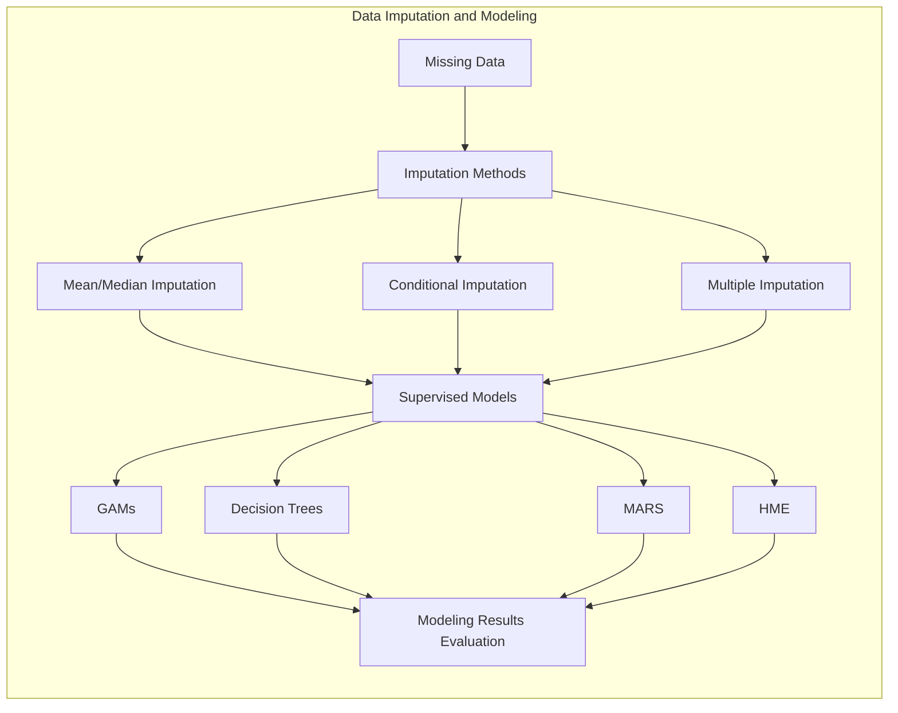
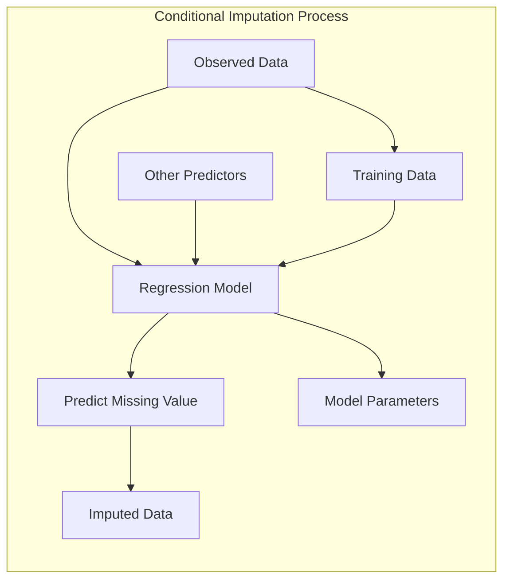
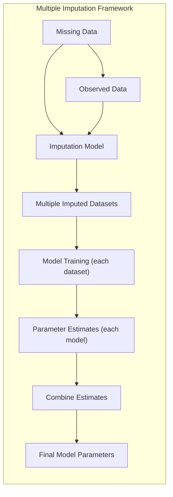
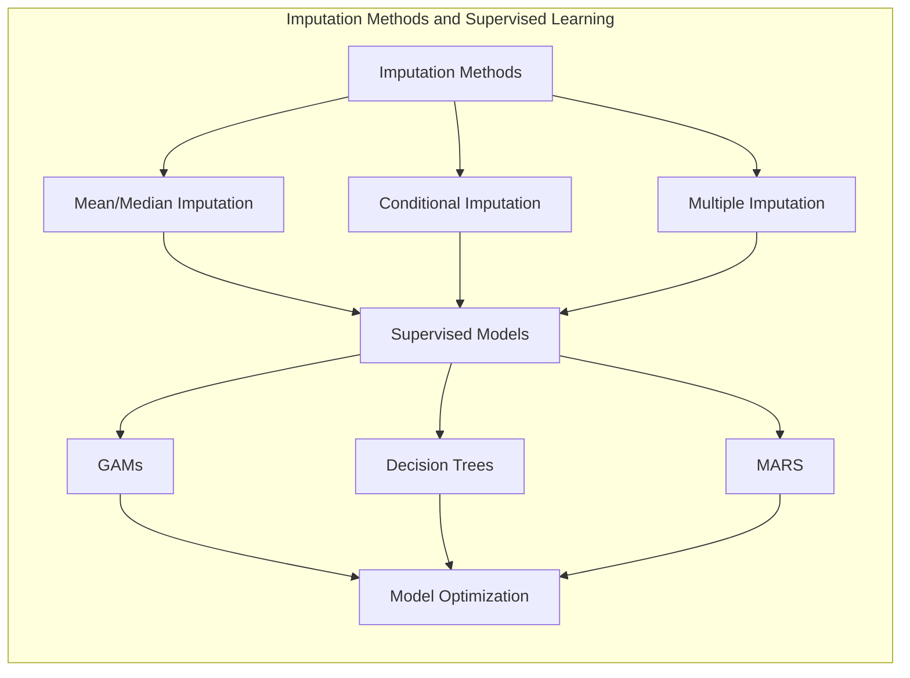
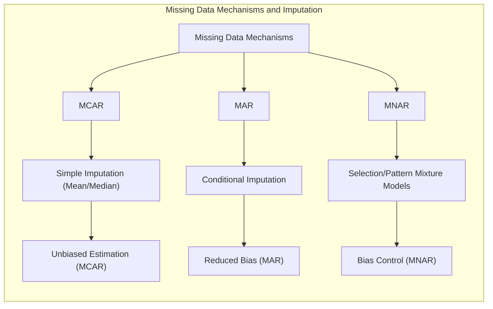

## Título: Modelos Aditivos, Árvores e Métodos Relacionados: Métodos de Imputação de Dados Ausentes e seus Efeitos na Modelagem

### Introdução

Este capítulo explora diferentes métodos de imputação de dados ausentes em modelos de aprendizado supervisionado, abordando como essas técnicas preenchem os valores faltantes nos preditores e como cada abordagem se relaciona com os diferentes modelos (GAMs, árvores de decisão, MARS e HME) [^9.1]. A imputação é uma etapa importante na modelagem de dados reais, pois permite utilizar todas as observações disponíveis, mesmo quando alguns preditores têm valores faltantes. O capítulo detalha os diferentes métodos de imputação, incluindo a imputação por média/mediana, a imputação condicional e a imputação múltipla, e como a escolha do método influencia o comportamento do modelo e a sua capacidade de generalização. O objetivo principal é fornecer uma compreensão aprofundada sobre os métodos de imputação de dados e como a escolha do método adequado pode melhorar a modelagem estatística e a sua qualidade preditiva.

### Conceitos Fundamentais

**Conceito 1: Imputação por Média/Mediana**

A imputação por média ou mediana é um dos métodos mais simples para lidar com valores ausentes, onde os valores faltantes em um preditor são substituídos pela média ou mediana dos valores observados naquele preditor. A imputação por média é dada por:

$$
x_{ij} = \begin{cases}
x_{ij}, & \text{se } x_{ij} \text{ não é ausente} \\
\bar{x}_j, & \text{se } x_{ij} \text{ é ausente}
\end{cases}
$$
onde $\bar{x}_j$ é a média da variável $X_j$. A imputação por mediana é análoga, e usa a mediana ao invés da média.  A imputação com a média ou mediana é simples de implementar e evita a remoção das observações com dados faltantes, mas não considera a relação entre o preditor e a resposta e pode introduzir *bias* no modelo, especialmente quando o padrão de dados ausentes não é aleatório (Missing at Random ou MNAR). Apesar de simples, a imputação por média ou mediana é um método amplamente utilizado, e é considerada uma boa opção em situações onde a quantidade de dados ausentes é pequena e os dados são Missing Completely at Random (MCAR).

> 💡 **Exemplo Numérico:**
>
> Imagine que temos um conjunto de dados com a altura de pessoas (em cm) e que alguns valores estão faltando. Os dados são: `[170, 180, None, 165, 175, None, 190]`.
>
> 1. **Imputação pela Média:** Primeiro, calculamos a média das alturas observadas:
>
>    $\bar{x} = (170 + 180 + 165 + 175 + 190) / 5 = 176$
>
>    Substituímos os valores ausentes pela média: `[170, 180, 176, 165, 175, 176, 190]`
>
> 2. **Imputação pela Mediana:** Para calcular a mediana, primeiro ordenamos os valores observados: `[165, 170, 175, 180, 190]`. A mediana é o valor do meio, que neste caso é 175.
>
>    Substituímos os valores ausentes pela mediana: `[170, 180, 175, 165, 175, 175, 190]`
>
> A imputação pela média suaviza a distribuição, enquanto a imputação pela mediana é mais robusta a outliers.

**Lemma 1:** *A imputação por média ou mediana é um método simples e rápido para lidar com dados ausentes. No entanto, esse método pode introduzir *bias* e diminuir a variabilidade dos dados, e por isso, a sua utilização é mais adequada em dados com pequena quantidade de valores ausentes que são Missing Completely at Random (MCAR)*. A imputação por média ou mediana é um método simples, mas a sua adequação depende da natureza dos dados [^9.6].

**Conceito 2: Imputação Condicional**

A imputação condicional busca estimar os valores ausentes com base em um modelo que utilize os outros preditores presentes na observação. Em vez de substituir um valor ausente pela média ou mediana global, um modelo de regressão ou classificação é utilizado para estimar o valor faltante, usando os valores não ausentes de outros preditores na mesma observação. Por exemplo, um modelo de regressão pode ser utilizado para predizer a renda de uma pessoa com base em sua escolaridade e idade. A utilização de modelos de imputação condicional permite que a informação presente nos dados seja utilizada para a imputação e a redução do *bias* das estimativas. A imputação condicional é um passo mais complexo do que a imputação por média ou mediana, mas é mais apropriada para dados que não são MCAR, e que apresentam padrões de dados ausentes que podem ser modelados.

> 💡 **Exemplo Numérico:**
>
> Suponha que temos dados sobre pessoas, com as colunas 'idade', 'escolaridade' (em anos) e 'renda' (em reais). Alguns valores de renda estão ausentes.
>
> | idade | escolaridade | renda   |
> |-------|-------------|---------|
> | 25    | 12          | 2500    |
> | 30    | 16          | 4000    |
> | 22    | 10          | None    |
> | 35    | 18          | 5500    |
> | 28    | 14          | None    |
>
> Vamos usar um modelo de regressão linear para prever a renda com base na idade e escolaridade:
>
> 1.  **Treinar o Modelo:** Usamos as linhas com renda não nula para treinar um modelo de regressão linear:
>
>  $renda = \beta_0 + \beta_1 \times idade + \beta_2 \times escolaridade$
>
>    Usando os dados disponíveis e um exemplo de regressão linear, poderíamos obter:
>
>    $renda = -1000 + 50 \times idade + 200 \times escolaridade$
>
> 2.  **Imputar os Valores:** Agora usamos o modelo para prever a renda dos indivíduos com dados faltantes:
>     - Para a pessoa com idade 22 e escolaridade 10:
>       $renda = -1000 + 50 \times 22 + 200 \times 10 = 2100$
>     - Para a pessoa com idade 28 e escolaridade 14:
>       $renda = -1000 + 50 \times 28 + 200 \times 14 = 3700$
>
> Os dados imputados seriam:
>
> | idade | escolaridade | renda   |
> |-------|-------------|---------|
> | 25    | 12          | 2500    |
> | 30    | 16          | 4000    |
> | 22    | 10          | 2100    |
> | 35    | 18          | 5500    |
> | 28    | 14          | 3700    |
>
> A imputação condicional usa as relações entre as variáveis para estimar os valores faltantes, o que pode ser mais preciso do que a imputação pela média/mediana.

**Corolário 1:** *A imputação condicional busca estimar valores ausentes com base nas relações entre os preditores, o que reduz o *bias* introduzido pela imputação com a média/mediana e a sua utilização é mais apropriada quando os dados são Missing at Random (MAR), e quando a imputação pode ser feita com a utilização de informação de outros preditores.* A imputação condicional utiliza a informação disponível de maneira mais eficiente [^9.6].

**Conceito 3: Imputação Múltipla**

A imputação múltipla gera diversos conjuntos de dados com diferentes imputações dos valores ausentes e a modelagem é feita para cada um dos conjuntos de dados separadamente. Os resultados de cada modelo são combinados de forma a levar em consideração a incerteza associada aos valores imputados.  A imputação múltipla é feita através da simulação da distribuição dos dados ausentes e da construção de múltiplos conjuntos de dados com valores imputados que respeitem a distribuição original. A imputação múltipla é uma forma de lidar com dados faltantes de forma mais apropriada, pois a incerteza do processo de imputação é considerada na modelagem. A utilização da imputação múltipla é fundamental quando a quantidade de valores ausentes é grande, ou quando o processo gerador dos valores ausentes é complexo.

> 💡 **Exemplo Numérico:**
>
> Vamos considerar o mesmo exemplo da imputação condicional, com os dados da renda, mas agora vamos gerar três conjuntos de dados imputados, para demonstrar a imputação múltipla.
>
> | idade | escolaridade | renda   |
> |-------|-------------|---------|
> | 25    | 12          | 2500    |
> | 30    | 16          | 4000    |
> | 22    | 10          | None    |
> | 35    | 18          | 5500    |
> | 28    | 14          | None    |
>
> 1.  **Múltiplas Imputações:** Assumindo que temos um modelo de imputação que leva em conta a incerteza, podemos gerar três conjuntos de dados imputados:
>
>    **Conjunto 1:**
>
>    | idade | escolaridade | renda   |
>    |-------|-------------|---------|
>    | 25    | 12          | 2500    |
>    | 30    | 16          | 4000    |
>    | 22    | 10          | 2000    |
>    | 35    | 18          | 5500    |
>    | 28    | 14          | 3500    |
>
>    **Conjunto 2:**
>
>    | idade | escolaridade | renda   |
>    |-------|-------------|---------|
>    | 25    | 12          | 2500    |
>    | 30    | 16          | 4000    |
>    | 22    | 10          | 2300    |
>    | 35    | 18          | 5500    |
>    | 28    | 14          | 3800    |
>
>    **Conjunto 3:**
>
>    | idade | escolaridade | renda   |
>    |-------|-------------|---------|
>    | 25    | 12          | 2500    |
>    | 30    | 16          | 4000    |
>    | 22    | 10          | 2200    |
>    | 35    | 18          | 5500    |
>    | 28    | 14          | 3600    |
>
> 2.  **Modelagem:** Ajustamos o modelo de interesse (por exemplo, um GAM, uma árvore de decisão, ou um MARS) em cada um dos conjuntos de dados imputados.
>
> 3. **Combinação dos Resultados:** Combinamos as estimativas dos parâmetros de cada modelo e suas incertezas para obter as estimativas finais. Essa etapa geralmente envolve o cálculo da média das estimativas e o uso das variâncias para gerar intervalos de confiança.
>
> A imputação múltipla leva em consideração a incerteza associada à imputação, resultando em estimativas mais robustas.

> ⚠️ **Nota Importante:** A imputação múltipla busca levar em consideração a incerteza associada à estimação dos valores ausentes e resulta em estimativas mais robustas e com menor *bias* e menor variância, principalmente quando a imputação é feita com um número apropriado de simulações dos dados ausentes [^9.6].

> ❗ **Ponto de Atenção:** A imputação múltipla é mais complexa computacionalmente, e a sua implementação pode requerer mais tempo e esforço do que métodos mais simples. A utilização de métodos complexos de imputação deve considerar o custo computacional e o tempo de execução dos algoritmos [^9.6].

> ✔️ **Destaque:** A imputação múltipla representa uma abordagem para lidar com valores ausentes que busca modelar a incerteza dos valores imputados, de forma que os parâmetros estimados dos modelos reflitam a variabilidade associada ao processo de imputação.  A escolha do método de imputação deve considerar a natureza dos dados e a sua influência na modelagem estatística [^9.6].

### Imputação em Modelos de Aprendizado Supervisionado: Abordagens e Implicações

A aplicação de diferentes métodos de imputação em modelos de aprendizado supervisionado pode ser feita de acordo com as características dos modelos e dos dados:

1.  **Modelos Aditivos Generalizados (GAMs):** Em modelos GAMs, os seguintes métodos de imputação podem ser utilizados:
    *   **Imputação por média/mediana:**  Os valores ausentes são substituídos pela média ou mediana dos valores observados da variável preditora.  A utilização desse método é simples de implementar, mas pode introduzir *bias* nos modelos, principalmente quando os dados não são MCAR.
    *   **Imputação Condicional:** Os valores ausentes são imputados utilizando modelos de regressão, considerando os outros preditores. A escolha do modelo de regressão depende da natureza dos preditores, e a imputação condicional pode levar a estimativas mais precisas, quando comparado a modelos de imputação simples.
    *  **Imputação Múltipla:** A imputação múltipla cria vários conjuntos de dados com valores imputados, e os modelos GAMs são ajustados em cada um desses conjuntos de dados e os resultados são combinados.  A imputação múltipla leva em consideração a incerteza relacionada aos dados ausentes.
        No algoritmo de backfitting, as observações com valores ausentes em um dado preditor podem ser removidas temporariamente durante o ajuste da função não paramétrica, o que é equivalente a um tipo de imputação com um valor que não interfere na estimativa da função, uma vez que a média da função é igual a zero.
2.  **Árvores de Decisão:** Em árvores de decisão, métodos de imputação não são diretamente necessários, pois a utilização de *surrogate splits* permite que o modelo lide com os dados faltantes. A árvore pode utilizar outros preditores como substitutos nos casos onde o preditor original está ausente.  A utilização de *surrogate splits* permite que modelos sejam construídos mesmo quando há dados faltantes. No entanto, se o método de modelagem da árvore não utilizar *surrogate splits*, a imputação, com as técnicas acima, pode ser utilizada.

3.  **Multivariate Adaptive Regression Splines (MARS):** Em MARS, a imputação por média/mediana ou a imputação condicional pode ser utilizada.  As funções de base de MARS utilizam os dados não ausentes, de forma similar ao que acontece em GAMs com o algoritmo de backfitting, e a imputação dos valores ausentes pode ser feita antes da construção do modelo, e a abordagem de remover os dados para as funções $f_j$ é uma forma de imputação.
4. **Modelos Hierárquicos de Mistura de Especialistas (HME):** Em modelos HME, a imputação pode ser feita antes do processo de otimização, ou a estrutura hierárquica permite que os diferentes modelos (especialistas) utilizem abordagens diferentes para lidar com os dados ausentes. A escolha do método de imputação deve considerar a natureza dos dados e dos modelos utilizados para construir os especialistas, e diferentes métodos podem ser combinados em modelos mais complexos.

A escolha do método de imputação e de modelagem deve considerar a natureza dos dados, o mecanismo de dados ausentes e o objetivo da modelagem. A avaliação do impacto das escolhas de modelagem nos resultados e no desempenho do modelo é fundamental para a construção de modelos robustos e com boa capacidade de generalização.

**Lemma 4:** *Diferentes abordagens para lidar com valores ausentes (imputação por média/mediana, imputação condicional, imputação múltipla, criação de categoria "ausente" e *surrogate splits*) afetam o desempenho dos modelos e a sua capacidade de generalização. A escolha do método depende da natureza dos dados e do mecanismo gerador dos dados ausentes*. A escolha da abordagem para lidar com dados ausentes deve considerar as suas propriedades e limitações [^9.6].

###  A Escolha do Método de Imputação e sua Relação com a Distribuição dos Dados

A escolha do método de imputação deve ser guiada pela distribuição dos dados e pela natureza dos valores ausentes. Imputação com média ou mediana é apropriada para dados que seguem uma distribuição normal e são Missing Completely at Random (MCAR).  A imputação condicional é mais apropriada para dados que são Missing at Random (MAR) e para modelar as relações entre os dados ausentes e os outros preditores. A imputação múltipla é utilizada para dados onde há muita incerteza sobre os valores ausentes, e os métodos de imputação são mais apropriados para dados MNAR.  A escolha do método de imputação deve, portanto, considerar o mecanismo de geração dos dados faltantes e o objetivo da modelagem.

###  O Impacto da Imputação nas Propriedades Assintóticas dos Estimadores

A utilização de métodos de imputação pode afetar as propriedades assintóticas dos estimadores. Imputação com média ou mediana pode levar a estimadores enviesados, enquanto que a imputação condicional pode reduzir o viés e aumentar a variância, e a imputação múltipla pode gerar estimadores com boas propriedades assintóticas, pois a incerteza dos valores imputados é incorporada no modelo. A escolha do método de imputação deve considerar os seus impactos nas propriedades estatísticas dos estimadores e na capacidade de generalização dos modelos.

### Perguntas Teóricas Avançadas: Como diferentes tipos de mecanismos de dados faltantes (MCAR, MAR, MNAR) afetam a validade dos métodos de imputação, e como a escolha dos métodos de imputação se relaciona com a função de custo, a estabilidade das estimativas e a capacidade de generalização do modelo?

**Resposta:**

Diferentes mecanismos de dados faltantes (Missing Completely at Random - MCAR, Missing at Random - MAR, e Missing Not at Random - MNAR) afetam a validade dos métodos de imputação, e a escolha do método de imputação influencia as propriedades estatísticas e a capacidade de generalização dos modelos. A escolha do método de imputação, portanto, é um componente importante na modelagem estatística.

*   **Missing Completely at Random (MCAR):** Quando os dados são MCAR, a probabilidade de um valor ser ausente é independente dos dados, o que significa que a imputação com métodos simples como a média ou a mediana não causa viés nas estimativas dos parâmetros do modelo, e não há necessidade de utilizar abordagens mais complexas. A remoção das observações também não induz bias no modelo, sob a hipótese de dados serem MCAR. No entanto, na prática, a hipótese de dados serem MCAR é pouco provável, e modelos devem ser utilizados para avaliar a sua plausibilidade.
*   **Missing at Random (MAR):**  Quando os dados são MAR, a probabilidade de um valor ser ausente depende das variáveis observadas, e métodos de imputação simples podem introduzir *bias* nos resultados. Métodos de imputação condicional, que utilizam as informações de outras variáveis, são mais adequados para esse tipo de dado, e modelos de regressão podem ser usados para predizer os valores ausentes. A validade desses métodos depende da capacidade dos modelos de imputação de capturar a relação entre as variáveis observadas e os dados ausentes.  O viés nas estimativas pode ser reduzido, mas nem sempre eliminado.
*   **Missing Not at Random (MNAR):**  Dados MNAR são ausentes devido ao valor que está faltando, e não devido a outros dados observados, o que torna a imputação mais complexa.  Modelos de seleção e *pattern mixture* podem ser usados para modelar a distribuição dos dados, e o mecanismo gerador dos dados faltantes. A utilização desses modelos busca o controle do viés na imputação. A estimativa dos parâmetros com dados MNAR pode ser um desafio, e modelos robustos devem ser utilizados para reduzir a influência de dados faltantes nas estimativas. A imputação de dados MNAR pode não ser possível sem a utilização de hipóteses sobre o mecanismo gerador dos dados.

A escolha do método de imputação depende diretamente do mecanismo de dados faltantes, que muitas vezes não é conhecido. O uso de modelos mais sofisticados para a imputação, como modelos bayesianos, podem levar a estimativas mais precisas e com menor *bias*, e a imputação múltipla é utilizada para incorporar a incerteza associada à imputação.  A escolha do método de imputação, portanto, deve ser feita com cuidado e considerando a natureza dos dados, a sua distribuição, e o mecanismo gerador dos dados ausentes.

**Lemma 5:** *A escolha do método de imputação depende do mecanismo dos dados ausentes.  Dados MCAR podem ser imputados utilizando abordagens mais simples, enquanto dados MAR ou MNAR requerem abordagens mais complexas.  A escolha do método de imputação afeta a consistência e o viés dos estimadores, e também a sua estabilidade*. A escolha da imputação apropriada é um passo fundamental na construção de modelos estatísticos com dados faltantes [^9.6].

**Corolário 5:** *A utilização de modelos para a imputação dos dados faltantes, que consideram a dependência entre os dados ausentes e os dados observados, é fundamental para a modelagem de dados MAR ou MNAR, e esses métodos podem levar a estimadores mais consistentes e menos enviesados*.  A escolha de métodos de imputação apropriados é fundamental para dados faltantes [^4.3.3].

> ⚠️ **Ponto Crucial**: A escolha do método de imputação, e sua interação com os modelos estatísticos, é um componente importante na análise de dados, e a utilização de métodos de imputação mais complexos é fundamental para dados que não são MCAR.  A avaliação da incerteza associada à imputação através de métodos como a imputação múltipla é importante para a construção de modelos estatísticos robustos e confiáveis [^4.4.4].

### Conclusão

Este capítulo apresentou um resumo sobre as técnicas de imputação de dados ausentes, mostrando como diferentes abordagens podem ser utilizadas para lidar com valores faltantes, e suas implicações para a modelagem estatística. A escolha do método de imputação, como a imputação por média/mediana, a imputação condicional, a imputação múltipla, a criação de categoria "ausente" ou o uso de *surrogate splits* deve ser feita de forma criteriosa, considerando a natureza dos dados, o mecanismo de dados faltantes, o objetivo da modelagem e os seus impactos na capacidade de generalização do modelo. A compreensão das limitações de cada abordagem e a combinação de modelos robustos com técnicas de imputação adequadas é fundamental para a construção de modelos estatísticos que sejam confiáveis, estáveis e com boa capacidade preditiva.

### Footnotes

[^4.1]: "In this chapter we begin our discussion of some specific methods for super-vised learning. These techniques each assume a (different) structured form for the unknown regression function, and by doing so they finesse the curse of dimensionality. Of course, they pay the possible price of misspecifying the model, and so in each case there is a tradeoff that has to be made." *(Trecho de "Additive Models, Trees, and Related Methods")*

[^4.2]: "Regression models play an important role in many data analyses, providing prediction and classification rules, and data analytic tools for understand-ing the importance of different inputs." *(Trecho de "Additive Models, Trees, and Related Methods")*

[^4.3]: "In this section we describe a modular algorithm for fitting additive models and their generalizations. The building block is the scatterplot smoother for fitting nonlinear effects in a flexible way. For concreteness we use as our scatterplot smoother the cubic smoothing spline described in Chapter 5." *(Trecho de "Additive Models, Trees, and Related Methods")*

[^4.3.1]:  "The additive model has the form $Y = \alpha + \sum_{j=1}^p f_j(X_j) + \varepsilon$, where the error term $\varepsilon$ has mean zero." * (Trecho de "Additive Models, Trees, and Related Methods")*

[^4.3.2]:   "Given observations $x_i, y_i$, a criterion like the penalized sum of squares (5.9) of Section 5.4 can be specified for this problem, $PRSS(\alpha, f_1, f_2,\ldots, f_p) = \sum_i^N (y_i - \alpha - \sum_j^p f_j(x_{ij}))^2 + \sum_j^p \lambda_j \int(f_j''(t_j))^2 dt_j$" * (Trecho de "Additive Models, Trees, and Related Methods")*

[^4.3.3]: "where the $\lambda_j > 0$ are tuning parameters. It can be shown that the minimizer of (9.7) is an additive cubic spline model; each of the functions $f_j$ is a cubic spline in the component $X_j$, with knots at each of the unique values of $x_{ij}, i = 1,\ldots, N$." *(Trecho de "Additive Models, Trees, and Related Methods")*

[^4.4]: "For two-class classification, recall the logistic regression model for binary data discussed in Section 4.4. We relate the mean of the binary response $\mu(X) = Pr(Y = 1|X)$ to the predictors via a linear regression model and the logit link function:  $log(\mu(X)/(1 – \mu(X)) = \alpha + \beta_1 X_1 + \ldots + \beta_pX_p$." * (Trecho de "Additive Models, Trees, and Related Methods")*

[^4.4.1]: "The additive logistic regression model replaces each linear term by a more general functional form: $log(\mu(X)/(1 – \mu(X))) = \alpha + f_1(X_1) + \cdots + f_p(X_p)$, where again each $f_j$ is an unspecified smooth function." * (Trecho de "Additive Models, Trees, and Related Methods")*

[^4.4.2]: "While the non-parametric form for the functions $f_j$ makes the model more flexible, the additivity is retained and allows us to interpret the model in much the same way as before. The additive logistic regression model is an example of a generalized additive model." *(Trecho de "Additive Models, Trees, and Related Methods")*

[^4.4.3]: "In general, the conditional mean $\mu(X)$ of a response $Y$ is related to an additive function of the predictors via a link function $g$:  $g[\mu(X)] = \alpha + f_1(X_1) + \cdots + f_p(X_p)$." *(Trecho de "Additive Models, Trees, and Related Methods")*

[^4.4.4]:  "Examples of classical link functions are the following: $g(\mu) = \mu$ is the identity link, used for linear and additive models for Gaussian response data." *(Trecho de "Additive Models, Trees, and Related Methods")*

[^4.4.5]: "$g(\mu) = logit(\mu)$ as above, or $g(\mu) = probit(\mu)$, the probit link function, for modeling binomial probabilities. The probit function is the inverse Gaussian cumulative distribution function: $probit(\mu) = \Phi^{-1}(\mu)$." *(Trecho de "Additive Models, Trees, and Related Methods")*

[^4.5]: "All three of these arise from exponential family sampling models, which in addition include the gamma and negative-binomial distributions. These families generate the well-known class of generalized linear models, which are all extended in the same way to generalized additive models." *(Trecho de "Additive Models, Trees, and Related Methods")*

[^4.5.1]: "The functions $f_j$ are estimated in a flexible manner, using an algorithm whose basic building block is a scatterplot smoother. The estimated func-tion $f_j$ can then reveal possible nonlinearities in the effect of $X_j$. Not all of the functions $f_j$ need to be nonlinear." *(Trecho de "Additive Models, Trees, and Related Methods")*

[^4.5.2]: "We can easily mix in linear and other parametric forms with the nonlinear terms, a necessity when some of the inputs are qualitative variables (factors)." *(Trecho de "Additive Models, Trees, and Related Methods")*

[^9.1]: "In this chapter we begin our discussion of some specific methods for super-vised learning. These techniques each assume a (different) structured form for the unknown regression function, and by doing so they finesse the curse of dimensionality. Of course, they pay the possible price of misspecifying the model, and so in each case there is a tradeoff that has to be made. We describe five related techniques: generalized additive models, trees, multivariate adaptive regression splines, the patient rule induction method, and hierarchical mixtures of experts." *(Trecho de "Additive Models, Trees, and Related Methods")*

[^9.6]:  "Suppose our data has some missing predictor values in some or all of the variables. We might discard any observation with some missing values, but this could lead to serious depletion of the training set. Alternatively we might try to fill in (impute) the missing values, with say the mean of that predictor over the nonmissing observations." *(Trecho de "Additive Models, Trees, and Related Methods")*
