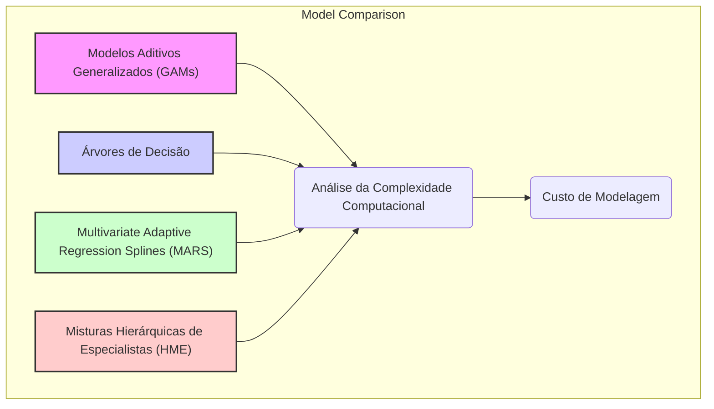
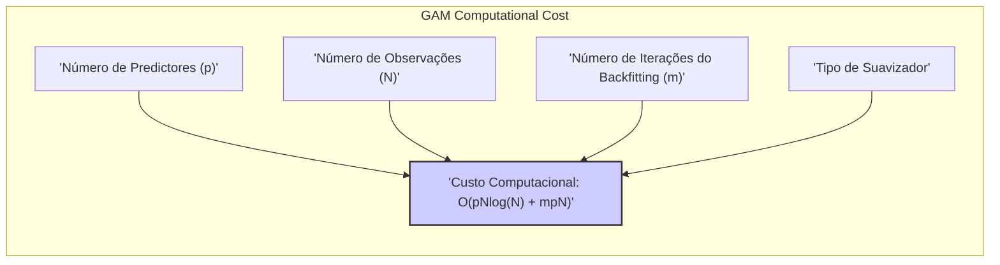
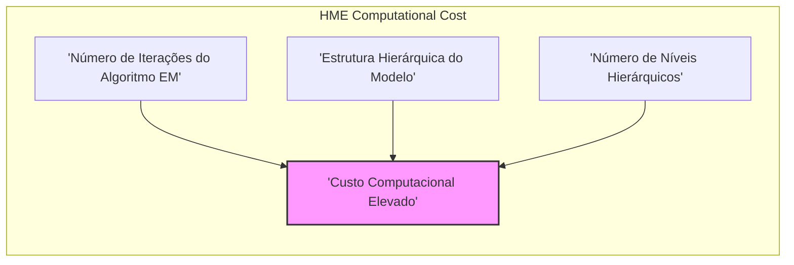
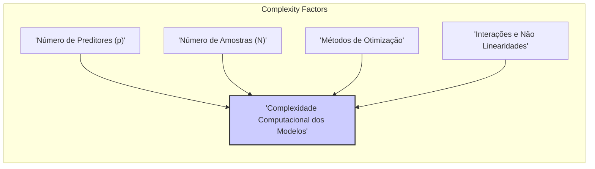
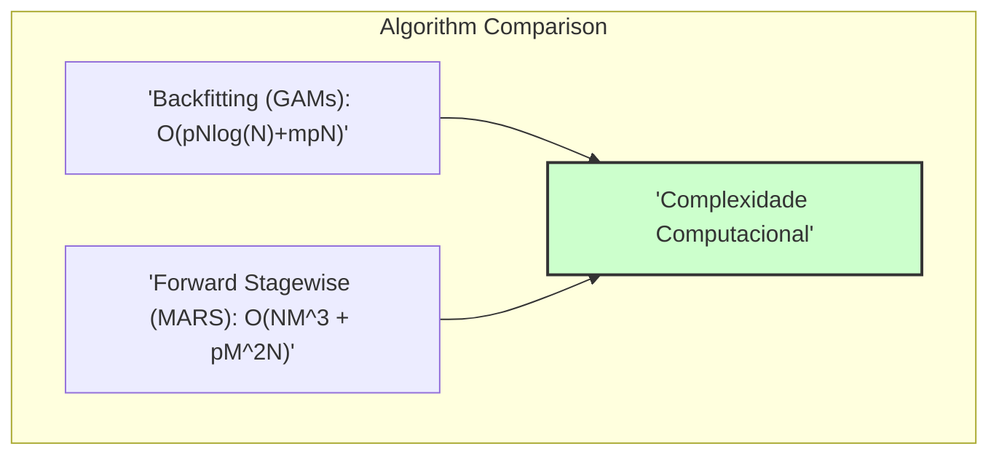
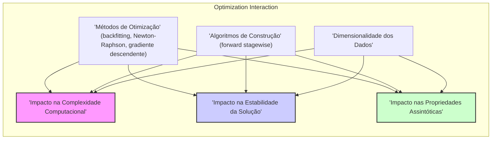

## Título: Modelos Aditivos, Árvores e Métodos Relacionados: Análise da Complexidade Computacional e Custo de Modelagem



### Introdução

Este capítulo explora a complexidade computacional e o custo de modelagem de diferentes métodos de aprendizado supervisionado, com foco em Modelos Aditivos Generalizados (GAMs), árvores de decisão, Multivariate Adaptive Regression Splines (MARS) e misturas hierárquicas de especialistas (HME), com o objetivo de apresentar uma comparação entre os diferentes métodos com base no custo computacional e na sua relação com a quantidade de dados e a complexidade do modelo [^9.1]. O capítulo detalha como os algoritmos de otimização, utilizados em cada modelo, afetam o custo computacional, e como diferentes escolhas de modelagem, como o número de preditores, o uso de interações e a complexidade dos algoritmos, impactam o tempo de treinamento e a sua capacidade de escalabilidade para conjuntos de dados de grande dimensão. O objetivo principal é apresentar uma visão aprofundada sobre os aspectos computacionais desses modelos, para que a escolha do método de modelagem leve em consideração tanto o seu desempenho, como o seu custo computacional.

### Conceitos Fundamentais

**Conceito 1: Custo Computacional e Complexidade de Algoritmos**

O custo computacional de um algoritmo é uma medida do tempo e recursos computacionais necessários para executar o algoritmo. A complexidade de um algoritmo é geralmente expressa utilizando a notação *Big O*, que representa a taxa de crescimento do tempo computacional em função do tamanho da entrada, onde $O(N)$ significa que o custo computacional cresce linearmente com o tamanho da entrada $N$, e $O(N^2)$ significa que o custo computacional cresce com o quadrado do tamanho da entrada. A complexidade de algoritmos é importante para entender o escalabilidade dos modelos e a sua capacidade de lidar com grandes conjuntos de dados. A avaliação do custo computacional deve considerar a complexidade dos algoritmos de otimização e a estrutura dos modelos, pois a sua relação impacta diretamente o tempo de treinamento e a sua aplicação em cenários reais.

> 💡 **Exemplo Numérico:**
> Considere um algoritmo de ordenação. Se este algoritmo tem complexidade $O(N \log N)$, e você tem um conjunto de dados com 1000 elementos, o tempo de execução será proporcional a $1000 \times \log(1000) \approx 3000$. Se você aumentar o tamanho do conjunto de dados para 10000, o tempo de execução será proporcional a $10000 \times \log(10000) \approx 40000$. Note que o aumento do tamanho dos dados por um fator de 10 levou a um aumento do tempo de execução por um fator de aproximadamente 13.3. Um algoritmo com complexidade $O(N^2)$, por outro lado, teria um aumento muito maior do tempo de execução, pois se o tamanho dos dados aumentar por um fator de 10, o tempo de execução aumentaria por um fator de 100. Isso mostra como a complexidade do algoritmo pode afetar o tempo de execução em conjuntos de dados maiores.

**Lemma 1:** *A complexidade computacional de um algoritmo indica como o tempo de execução aumenta com o tamanho da entrada. Algoritmos com baixa complexidade são computacionalmente eficientes para grandes conjuntos de dados, enquanto que algoritmos com alta complexidade são menos escaláveis e podem requerer um tempo computacional maior* [^4.3].

**Conceito 2: Custo Computacional em Modelos Aditivos Generalizados (GAMs)**

Em Modelos Aditivos Generalizados (GAMs), o custo computacional depende do número de preditores $p$ e do número de observações $N$, e também do número de iterações $m$ do algoritmo de backfitting. O algoritmo de backfitting, que utiliza suavizadores para cada preditor, é um componente fundamental da modelagem GAMs, e a sua complexidade depende do tipo de suavizador utilizado. A otimização do modelo, que envolve o cálculo dos resíduos e a atualização dos parâmetros, também tem um impacto no custo computacional, e deve ser considerada. Para uma função *spline* cúbica, por exemplo, a complexidade de cada iteração é de $O(N\log(N))$ para a ordenação dos dados e $O(N)$ para o ajuste do *spline*, o que leva a uma complexidade total de $O(pN\log(N)+mpN)$, onde $p$ é o número de preditores e $m$ é o número de iterações do algoritmo de *backfitting*. O uso de aproximações para as operações computacionais permite reduzir o custo, mas pode apresentar algumas limitações.



> 💡 **Exemplo Numérico:**
> Suponha que temos um GAM com 5 preditores ($p=5$) e 1000 observações ($N=1000$). Se o algoritmo de backfitting executa 10 iterações ($m=10$), a complexidade computacional total seria aproximadamente:
>
> $O(5 \times 1000 \times \log(1000) + 10 \times 5 \times 1000)$
>
> Calculando, temos:
>
> $O(5000 \times 10 + 50000) \approx O(50000 + 50000) = O(100000)$.
>
> Se aumentarmos o número de observações para 10000, a complexidade se torna:
>
> $O(5 \times 10000 \times \log(10000) + 10 \times 5 \times 10000)$
>
> $O(50000 \times 13.3 + 500000) \approx O(665000 + 500000) = O(1165000)$
>
> Este exemplo mostra como o aumento do número de observações afeta o custo computacional, e como a complexidade do algoritmo de backfitting pode impactar o tempo de execução do modelo.

**Corolário 1:** *O custo computacional de modelos GAMs depende do número de preditores, do número de observações e do número de iterações do algoritmo de backfitting, e a utilização de modelos com muitas funções não paramétricas e muitos preditores pode levar a um aumento do custo computacional*. A escolha de modelos e suavizadores mais eficientes é importante para a utilização de GAMs em cenários com grande número de preditores e observações [^4.3].

**Conceito 3: Custo Computacional em Árvores de Decisão, MARS e HME**

*   **Árvores de Decisão:** O custo computacional para construção de árvores de decisão é $O(pN\log(N))$ para a ordenação inicial dos preditores e $O(pN)$ para avaliar cada divisão. A poda da árvore também contribui para o custo computacional, e o processo de validação cruzada para escolha dos parâmetros aumenta o tempo de computação. Em árvores de decisão, o custo é relativamente baixo, o que torna esses modelos adequados para dados de alta dimensão.

    ```mermaid
    graph LR
        subgraph "Decision Tree Cost"
            direction LR
            A["'Ordenação de Predictores (O(pNlog(N)))'"]
            B["'Avaliação de Divisões (O(pN))'"]
            C["'Poda da Árvore'"]
            D["'Validação Cruzada'"]
            A & B & C & D --> E["'Custo Computacional Total'"]
        end
        style E fill:#fcc,stroke:#333,stroke-width:2px
    ```

    > 💡 **Exemplo Numérico:**
    > Imagine que você tem um conjunto de dados com 1000 observações ($N=1000$) e 10 preditores ($p=10$).
    >
    > - O custo para ordenar os preditores é $O(10 \times 1000 \times \log(1000)) \approx O(30000)$.
    > - O custo para avaliar cada divisão é $O(10 \times 1000) = O(10000)$.
    >
    > Se a árvore tiver muitas divisões, o custo total pode aumentar. No entanto, comparado com outros métodos, o custo computacional de árvores de decisão é geralmente baixo.

*   **Multivariate Adaptive Regression Splines (MARS):** Em MARS, a escolha de um novo termo *spline* envolve a avaliação de todos os possíveis nós e produtos de funções *spline*, o que pode levar a uma complexidade de $O(NM^2 + pMN)$, onde $M$ é o número de termos do modelo, e o custo computacional aumenta com o número de observações e com o número de termos. O passo *backward* também contribui para o custo computacional, e modelos com muitos termos podem ser mais caros computacionalmente.

    ```mermaid
    graph LR
        subgraph "MARS Computational Cost"
            direction TB
            A["'Número de Observações (N)'"]
            B["'Número de Termos do Modelo (M)'"]
            C["'Número de Preditores (p)'"]
            A & B & C --> D["'Custo Computacional: O(NM^2 + pMN)'"]
        end
        style D fill:#cfc,stroke:#333,stroke-width:2px
    ```

    > 💡 **Exemplo Numérico:**
    > Suponha que temos um modelo MARS com 1000 observações ($N=1000$), 5 preditores ($p=5$), e o modelo tem 20 termos ($M=20$).
    >
    > - O custo para a escolha dos termos é aproximadamente $O(1000 \times 20^2 + 5 \times 20 \times 1000) = O(400000 + 100000) = O(500000)$.
    >
    > Se o número de termos aumentar, o custo computacional também aumenta, mostrando que o número de termos impacta o custo computacional do MARS.

*  **Misturas Hierárquicas de Especialistas (HME):** Em HME, o algoritmo EM é utilizado para otimizar os parâmetros das redes de *gating* e dos especialistas, e o número de iterações para convergência pode ser alto, com custo computacional alto em cada passo. A complexidade dos modelos HME depende da sua estrutura e do número de níveis hierárquicos, o que leva a modelos com um grande número de parâmetros e alto custo computacional.



> ⚠️ **Nota Importante:** A escolha do modelo depende da necessidade de um modelo com maior ou menor flexibilidade, e a necessidade de um modelo com melhor interpretabilidade, em conjunto com a consideração de seu custo computacional. Algoritmos iterativos e modelos mais flexíveis tendem a ter um custo computacional maior [^4.5.1], [^4.5.2].

> ❗ **Ponto de Atenção:** Modelos complexos, como HME, podem apresentar um custo computacional elevado, o que limita o seu uso em dados com grande volume de informações. A escolha do modelo também deve considerar o tempo de treinamento e o seu uso em aplicações reais [^9.1].

> ✔️ **Destaque:** A análise da complexidade computacional é um aspecto importante na escolha de um método de modelagem, e o *trade-off* entre a complexidade, o tempo de treinamento e o desempenho do modelo deve ser considerado. A escolha de um modelo deve considerar as características dos dados e os recursos computacionais disponíveis [^4.3.3].

### Análise da Complexidade Computacional: Relação com o Número de Preditores, Amostras e Métodos de Otimização



A complexidade computacional dos modelos de aprendizado supervisionado depende de vários fatores, incluindo o número de preditores ($p$), o número de amostras ($N$), e a escolha dos métodos de otimização.

1.  **Número de Preditores ($p$):** O número de preditores tem um impacto direto na complexidade dos modelos. Modelos com muitos preditores, como em dados de alta dimensão, exigem um maior tempo de computação para a escolha das variáveis e o ajuste dos parâmetros. Métodos de seleção de variáveis são utilizados para mitigar este problema. Em modelos GAMs, a escolha de suavizadores e outras funções não paramétricas podem aumentar o custo computacional, e em árvores de decisão, o número de partições é afetado pelo número de preditores, o que influencia na construção e no *pruning* da árvore. Em MARS, a escolha dos termos de *spline* e a sua interação, e em HME, o número de especialistas e camadas hierárquicas também aumentam o número de parâmetros e a complexidade do modelo.

    > 💡 **Exemplo Numérico:**
    > Se você tem um modelo GAM com 10 preditores, o custo computacional será maior do que um modelo com apenas 2 preditores, pois o algoritmo de backfitting terá que ajustar funções para cada um dos 10 preditores. Similarmente, uma árvore de decisão com 100 preditores pode ter um tempo de treinamento maior do que uma árvore com 10 preditores, pois o número de possíveis divisões a serem avaliadas é muito maior. Em MARS, se o número de preditores for muito alto, a busca por termos de *spline* e suas interações também se torna mais custosa.

2.  **Número de Amostras ($N$):** O número de amostras também afeta o custo computacional. Modelos que utilizam algoritmos iterativos, como o backfitting, Newton-Raphson e EM, têm um custo computacional que geralmente aumenta com o número de observações, o que afeta diretamente o tempo de treinamento e a sua capacidade de modelar dados de alta dimensão. A escolha do método de otimização deve considerar a sua escalabilidade para dados com alto número de observações.

    > 💡 **Exemplo Numérico:**
    > Um modelo GAM com 10000 observações levará mais tempo para treinar do que um modelo com 1000 observações, pois o algoritmo de backfitting precisa iterar sobre cada observação. Em HME, o algoritmo EM também precisará mais tempo para convergir com um número maior de observações.

3.   **Métodos de Otimização:** A escolha do método de otimização influencia a complexidade computacional. Algoritmos simples, como o método dos mínimos quadrados, têm um custo computacional baixo para modelos lineares. Métodos iterativos, como o gradiente descendente, também são utilizados para problemas onde a função de custo é mais complexa, e o algoritmo do gradiente descendente tem um custo menor, quando comparado com métodos de segunda ordem como o Newton-Raphson, que utiliza a informação do Hessiano. Modelos com funções de custo não convexas podem ter um tempo de convergência maior, e podem requerer a utilização de métodos de otimização mais complexos.

    ```mermaid
    graph LR
        subgraph "Optimization Methods"
            direction TB
            A["'Mínimos Quadrados'"]
            B["'Gradiente Descendente'"]
            C["'Newton-Raphson'"]
            A --> D["'Custo Computacional'"]
            B --> D
            C --> D
        end
        style D fill:#fcc,stroke:#333,stroke-width:2px
    ```

    > 💡 **Exemplo Numérico:**
    > Ajustar um modelo linear com mínimos quadrados tem complexidade $O(N p^2)$, enquanto que o gradiente descendente pode levar mais tempo para convergir em problemas não convexos. O método Newton-Raphson, embora possa convergir mais rápido, tem um custo computacional maior por iteração, especialmente se o número de parâmetros for grande, pois envolve o cálculo do Hessiano.

4.   **Interações e Não Linearidades:** A modelagem de interações e não linearidades aumenta a complexidade computacional. Modelos que consideram interações de alta ordem, ou não linearidades muito complexas, exigem mais tempo de treinamento e um número maior de parâmetros, e a escolha do modelo deve considerar a sua capacidade de modelagem e o seu custo computacional.

    > 💡 **Exemplo Numérico:**
    > Um modelo GAM com interações entre os preditores (por exemplo, $f(X_1, X_2)$) terá um custo computacional maior do que um modelo sem interações ($f_1(X_1) + f_2(X_2)$), pois o espaço de busca por funções mais complexas é maior. Em MARS, o número de termos e interações também aumenta o custo computacional.

A análise conjunta desses componentes permite estimar o custo computacional dos modelos e escolher o método apropriado para lidar com dados de diferentes naturezas e com diferentes níveis de complexidade.

**Lemma 4:** *O custo computacional de modelos de aprendizado supervisionado depende do número de preditores, amostras, e do método de otimização utilizado. A escolha do modelo e dos seus componentes deve considerar o trade-off entre a sua capacidade de modelagem, sua interpretabilidade e o seu custo computacional*. A análise de diferentes componentes e a sua relação com o custo computacional é um aspecto importante da modelagem [^9.1].

### A Complexidade Computacional do Algoritmo de Backfitting e Métodos Forward Stagewise

A análise da complexidade computacional dos algoritmos de *backfitting* e *forward stagewise* é importante para entender a sua aplicação em modelos estatísticos. O algoritmo de backfitting, em modelos GAMs, tem uma complexidade computacional de $O(pN\log(N)+mpN)$, onde $N$ é o número de observações, $p$ é o número de preditores e $m$ é o número de iterações, enquanto o algoritmo *forward stagewise* em MARS tem uma complexidade de $O(NM^3 + pM^2N)$, onde $M$ é o número de termos no modelo, que podem ser muito alto em dados de alta dimensão, e a escolha do modelo deve considerar essas diferenças na complexidade computacional. A escolha do algoritmo deve considerar a necessidade de modelos com boa capacidade de modelagem e também com um custo computacional razoável, que seja adequado para os dados em questão.



> 💡 **Exemplo Numérico:**
> Suponha que temos um GAM com 5 preditores ($p=5$), 1000 observações ($N=1000$), e 10 iterações do algoritmo de backfitting ($m=10$). A complexidade seria:
>
> $O(5 \times 1000 \times \log(1000) + 10 \times 5 \times 1000) \approx O(100000)$.
>
> Agora, suponha um modelo MARS com 1000 observações ($N=1000$), 5 preditores ($p=5$) e 20 termos ($M=20$). A complexidade seria:
>
> $O(1000 \times 20^3 + 5 \times 20^2 \times 1000) = O(8000000 + 2000000) = O(10000000)$.
>
> Este exemplo mostra como o algoritmo *forward stagewise* em MARS pode ter uma complexidade maior do que o algoritmo de backfitting em GAMs, especialmente se o número de termos no modelo ($M$) for grande.

### O Uso de Aproximações e Métodos Computacionais para Reduzir a Complexidade

Para reduzir o custo computacional, modelos e algoritmos aproximados podem ser utilizados. Modelos com funções lineares, ou com aproximações lineares, são menos complexos e mais rápidos de treinar do que modelos com funções não paramétricas e muitos parâmetros. Algoritmos com aproximações na otimização também podem levar a modelos mais eficientes computacionalmente. A escolha do método apropriado depende da natureza dos dados, da necessidade de um modelo preciso e do tempo computacional disponível. A utilização de métodos computacionais eficientes é importante para escalar os modelos para problemas com muitos dados.

> 💡 **Exemplo Numérico:**
> Em vez de usar *splines* cúbicas em um GAM, podemos usar *splines* lineares ou modelos lineares para cada preditor, o que reduz o custo computacional. Similarmente, em vez de usar o algoritmo EM completo em um HME, podemos usar aproximações ou variantes do algoritmo para reduzir o tempo de treinamento, embora isso possa levar a um desempenho ligeiramente inferior.

### Perguntas Teóricas Avançadas: Como a escolha de diferentes métodos de otimização e algoritmos de construção de modelos (backfitting, Newton-Raphson, Forward Stagewise) interagem com a dimensionalidade dos dados, e quais são as implicações na complexidade computacional, na estabilidade da solução e nas propriedades assintóticas dos estimadores?

**Resposta:**

A escolha de diferentes métodos de otimização (backfitting, Newton-Raphson, gradiente descendente e variantes) e algoritmos de construção de modelos (forward stagewise e outros) interage com a dimensionalidade dos dados, o que impacta a complexidade computacional, a estabilidade da solução e as propriedades assintóticas dos estimadores.



Modelos com um número elevado de preditores, ou alta dimensionalidade, podem apresentar um alto custo computacional, e os algoritmos de otimização devem ser escolhidos levando em consideração este aspecto. Métodos iterativos como o algoritmo de backfitting, em modelos aditivos, apresentam um custo computacional que aumenta com o número de preditores e com o número de iterações, e a sua utilização deve ser feita considerando o seu custo. Métodos de segunda ordem como o Newton-Raphson, que usam a informação da derivada segunda da função de custo, têm um custo computacional mais elevado, mas podem convergir mais rapidamente para uma solução. O uso de aproximações para o Hessiano, como a matriz de informação de Fisher, simplifica o processo de otimização, mas a escolha do método correto depende das propriedades da função de custo e da sua capacidade de convergir.

O uso de algoritmos *forward stagewise*, utilizado em modelos como MARS e HME, pode ser utilizado para controlar o crescimento da complexidade do modelo, e a escolha do critério de parada afeta diretamente o número de parâmetros e o custo computacional do modelo. Métodos gulosos, como o *forward stagewise*, não garantem a solução ótima global, mas são computacionalmente mais eficientes e levam a modelos com bom desempenho na prática, e a utilização de técnicas de regularização também auxilia no controle da complexidade.

A escolha do algoritmo de otimização afeta a estabilidade da solução, e a convergência para uma solução estável, pois modelos com muitos parâmetros podem levar a instabilidade e a uma grande variância dos parâmetros. A utilização de regularização, nos modelos que utilizam algoritmos gulosos, ajuda a controlar a complexidade e melhorar a estabilidade do modelo. A escolha do modelo e dos métodos de otimização, portanto, deve ser feita considerando o número de preditores, o número de observações e o custo computacional.

As propriedades assintóticas dos estimadores também são afetadas pela escolha do método de otimização, de modo que métodos baseados no método da máxima verossimilhança podem levar a estimadores mais eficientes, e com melhores propriedades assintóticas, enquanto que métodos de otimização baseados em aproximações locais e busca gulosa podem não garantir as mesmas propriedades.

> 💡 **Exemplo Numérico:**
> Em dados de alta dimensão (muitos preditores), o método de Newton-Raphson pode se tornar computacionalmente inviável devido ao cálculo do Hessiano. Nesses casos, métodos de gradiente descendente ou suas variantes, que não exigem o cálculo do Hessiano, são preferidos, mesmo que possam convergir mais lentamente. A escolha do método de otimização também afeta a estabilidade da solução. Por exemplo, o algoritmo *forward stagewise* em MARS pode levar a soluções instáveis se o critério de parada não for bem escolhido, e técnicas de regularização são necessárias para mitigar esse problema.

**Lemma 5:** *A interação entre a escolha do método de otimização, a dimensionalidade dos dados e os algoritmos utilizados para a construção de modelos, afeta a sua complexidade computacional, estabilidade e capacidade de modelagem, e a escolha do método deve considerar todos esses aspectos*. A escolha do algoritmo de otimização deve considerar a natureza dos dados e do modelo [^4.5.1], [^4.5.2].

**Corolário 5:** *A complexidade computacional de modelos estatísticos aumenta com a dimensionalidade dos dados e a complexidade dos modelos. A escolha de métodos de otimização mais eficientes e abordagens de modelagem que simplificam o modelo é essencial para a construção de modelos que sejam adequados para grandes conjuntos de dados. A escolha dos métodos deve considerar o *trade-off* entre custo computacional e capacidade de modelagem e generalização dos modelos*. A complexidade dos algoritmos de otimização afeta diretamente a escolha dos modelos [^4.3.3].

> ⚠️ **Ponto Crucial**: A escolha dos métodos de otimização, o número de parâmetros, a complexidade do modelo e a dimensionalidade dos dados têm um impacto direto no seu custo computacional. A utilização de métodos de otimização iterativos, algoritmos gulosos, técnicas de regularização e validação cruzada permite encontrar modelos que equilibram o desempenho, a interpretabilidade e a sua capacidade de lidar com dados de alta complexidade e dimensionalidade. A escolha do modelo e seus componentes deve considerar todos os aspectos da modelagem [^4.4].

### Conclusão

Este capítulo explorou a complexidade computacional de modelos de aprendizado supervisionado, e como a escolha dos algoritmos de otimização e estratégias de construção do modelo afeta o seu custo e capacidade de generalização. A discussão detalhou a importância de métodos de otimização como o método dos mínimos quadrados, máxima verossimilhança, backfitting, Newton-Raphson, gradiente descendente e algoritmos gulosos, em modelos como GAMs, árvores de decisão, MARS e HME. A compreensão da relação entre o custo computacional, a estabilidade e a capacidade de modelagem de cada algoritmo é essencial para a construção de modelos robustos e com bom desempenho, e para a sua aplicação em problemas reais de modelagem estatística.

### Footnotes

[^4.1]: "In this chapter we begin our discussion of some specific methods for super-vised learning. These techniques each assume a (different) structured form for the unknown regression function, and by doing so they finesse the curse of dimensionality. Of course, they pay the possible price of misspecifying the model, and so in each case there is a tradeoff that has to be made." *(Trecho de "Additive Models, Trees, and Related Methods")*

[^4.2]: "Regression models play an important role in many data analyses, providing prediction and classification rules, and data analytic tools for understand-ing the importance of different inputs." *(Trecho de "Additive Models, Trees, and Related Methods")*

[^4.3]: "In this section we describe a modular algorithm for fitting additive models and their generalizations. The building block is the scatterplot smoother for fitting nonlinear effects in a flexible way. For concreteness we use as our scatterplot smoother the cubic smoothing spline described in Chapter 5." *(Trecho de "Additive Models, Trees, and Related Methods")*

[^4.3.1]: "The additive model has the form $Y = \alpha + \sum_{j=1}^p f_j(X_j) + \varepsilon$, where the error term $\varepsilon$ has mean zero." * (Trecho de "Additive Models, Trees, and Related Methods")*

[^4.3.2]: "Given observations $x_i$, $y_i$, a criterion like the penalized sum of squares (5.9) of Section 5.4 can be specified for this problem, $PRSS(\alpha, f_1, f_2,\ldots, f_p) = \sum_{i=1}^N (y_i - \alpha - \sum_{j=1}^p f_j(x_{ij}))^2 + \sum_{j=1}^p \lambda_j \int(f_j''(t_j))^2 dt_j$" * (Trecho de "Additive Models, Trees, and Related Methods")*

[^4.3.3]: "where the $\lambda_j > 0$ are tuning parameters. It can be shown that the minimizer of (9.7) is an additive cubic spline model; each of the functions $f_j$ is a cubic spline in the component $X_j$, with knots at each of the unique values of $x_{ij}$, $i = 1,\ldots, N$." *(Trecho de "Additive Models, Trees, and Related Methods")*

[^4.4]: "For two-class classification, recall the logistic regression model for binary data discussed in Section 4.4. We relate the mean of the binary response $\mu(X) = Pr(Y = 1|X)$ to the predictors via a linear regression model and the logit link function: $\log(\mu(X)/(1 – \mu(X)) = \alpha + \beta_1 X_1 + \ldots + \beta_pX_p$." * (Trecho de "Additive Models, Trees, and Related Methods")*

[^4.4.1]: "The additive logistic regression model replaces each linear term by a more general functional form: $\log(\mu(X)/(1 – \mu(X))) = \alpha + f_1(X_1) + \cdots + f_p(X_p)$, where again each $f_j$ is an unspecified smooth function." * (Trecho de "Additive Models, Trees, and Related Methods")*

[^4.4.2]: "While the non-parametric form for the functions $f_j$ makes the model more flexible, the additivity is retained and allows us to interpret the model in much the same way as before. The additive logistic regression model is an example of a generalized additive model." *(Trecho de "Additive Models, Trees, and Related Methods")*

[^4.4.3]: "In general, the conditional mean $\mu(X)$ of a response $Y$ is related to an additive function of the predictors via a link function $g$: $g[\mu(X)] = \alpha + f_1(X_1) + \cdots + f_p(X_p)$." *(Trecho de "Additive Models, Trees, and Related Methods")*

[^4.4.4]: "Examples of classical link functions are the following: $g(\mu) = \mu$ is the identity link, used for linear and additive models for Gaussian response data." *(Trecho de "Additive Models, Trees, and Related Methods")*

[^4.4.5]: "$g(\mu) = logit(\mu)$ as above, or $g(\mu) = probit(\mu)$, the probit link function, for modeling binomial probabilities. The probit function is the inverse Gaussian cumulative distribution function: $probit(\mu) = \Phi^{-1}(\mu)$." *(Trecho de "Additive Models, Trees, and Related Methods")*

[^4.5]: "All three of these arise from exponential family sampling models, which in addition include the gamma and negative-binomial distributions. These families generate the well-known class of generalized linear models, which are all extended in the same way to generalized additive models." *(Trecho de "Additive Models, Trees, and Related Methods")*

[^4.5.1]: "The functions $f_j$ are estimated in a flexible manner, using an algorithm whose basic building block is a scatterplot smoother. The estimated func-tion $f_j$ can then reveal possible nonlinearities in the effect of $X_j$. Not all of the functions $f_j$ need to be nonlinear." *(Trecho de "Additive Models, Trees, and Related Methods")*

[^4.5.2]: "We can easily mix in linear and other parametric forms with the nonlinear terms, a necessity when some of the inputs are qualitative variables (factors)." *(Trecho de "Additive Models, Trees, and Related Methods")*
