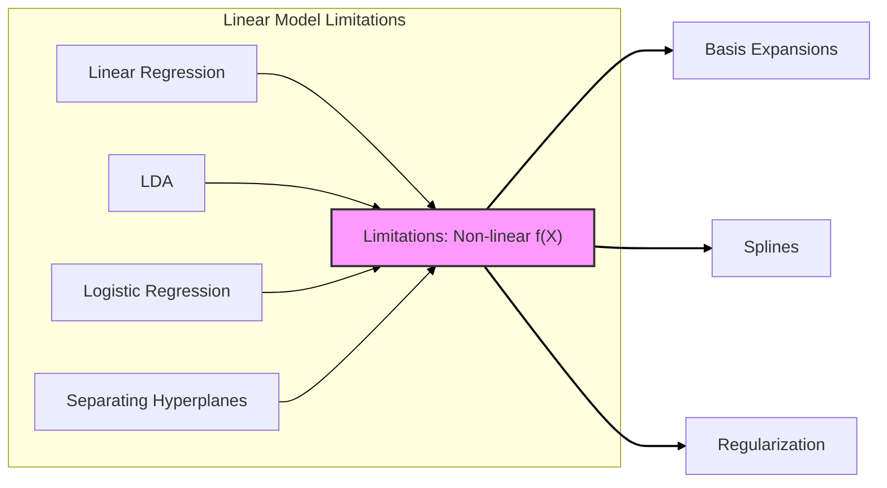
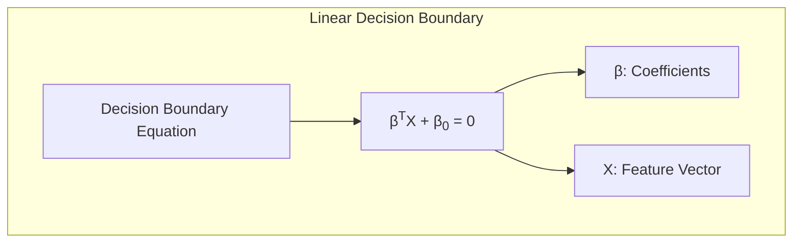
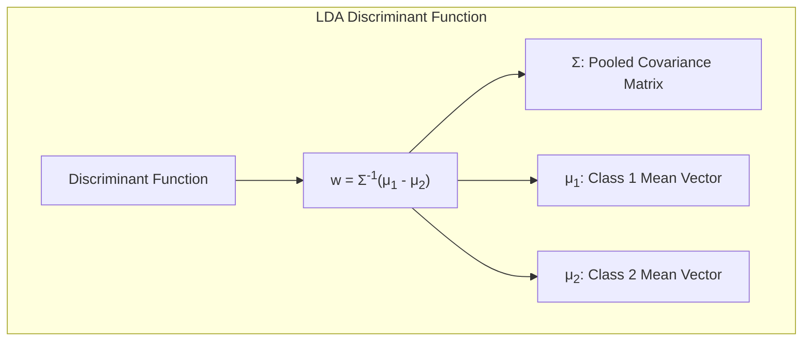
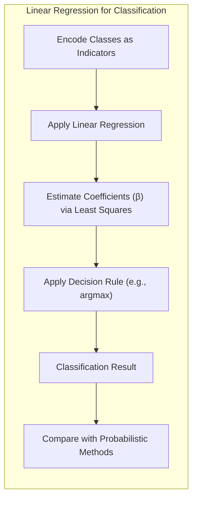
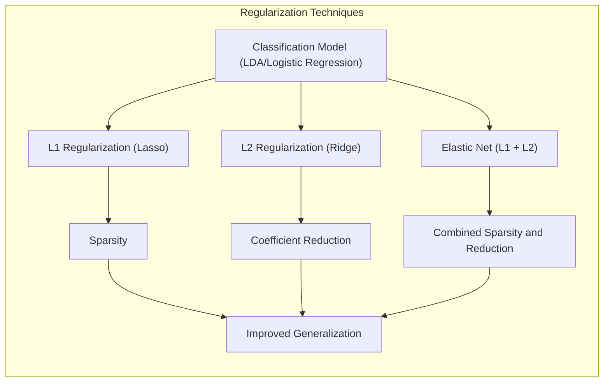
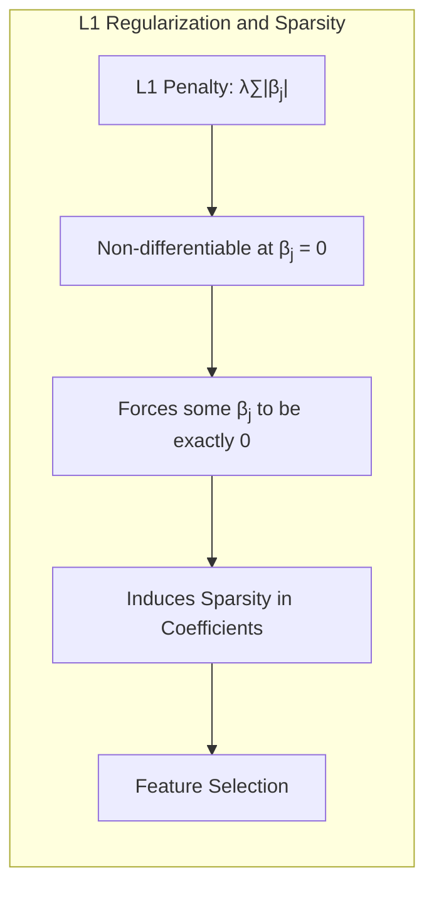
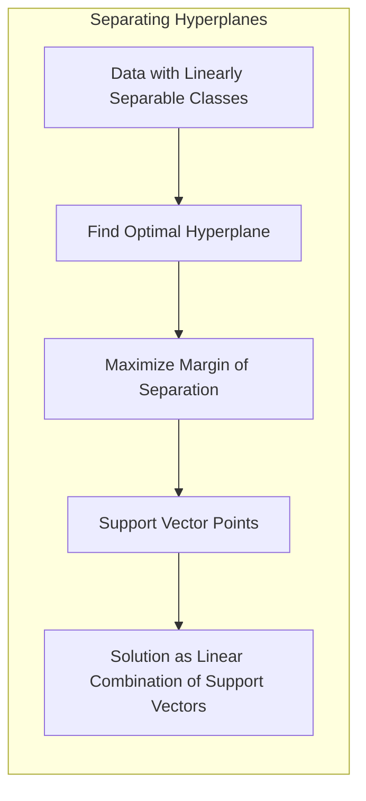
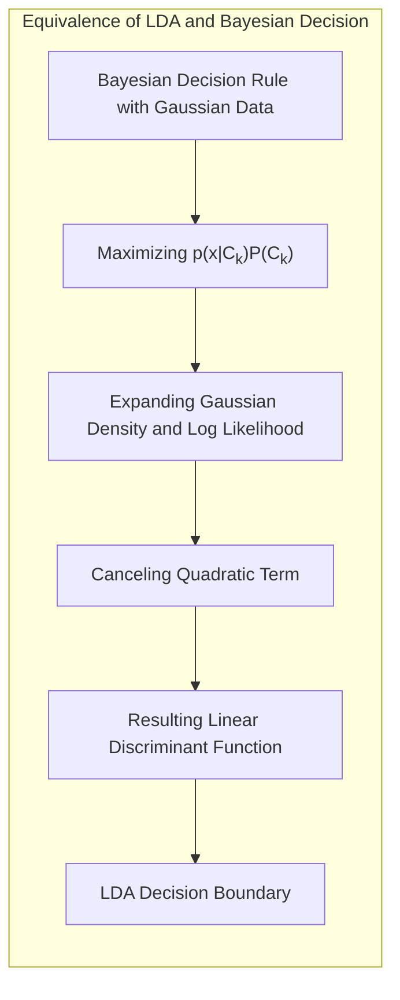

## Limitations of Linear Models: Basis Expansions and Regularization



### Introdução

Modelos lineares, como a regressão linear, **Linear Discriminant Analysis (LDA)**, regressão logística e hiperplanos separadores, são ferramentas fundamentais tanto para regressão quanto para classificação [^4.1]. No entanto, a suposição de que a relação entre as features de entrada e a variável de resposta é linear é raramente válida no mundo real. Em problemas de regressão, a função verdadeira $f(X) = E(Y|X)$ geralmente exibe um comportamento não linear e não aditivo [^5.1]. Representar $f(X)$ através de um modelo linear é uma aproximação conveniente e, por vezes, necessária. É conveniente porque modelos lineares são fáceis de interpretar e representam a aproximação de primeira ordem de Taylor de $f(X)$. É necessário em casos onde temos poucos dados ($N$ pequeno) ou muitas features ($p$ grande), onde um modelo linear pode ser a única opção viável para evitar *overfitting* [^5.1]. De forma similar, em classificação, a fronteira de decisão Bayes-ótima implica que uma transformação monótona de $Pr(Y = 1|X)$ é linear em $X$, uma aproximação que raramente se mantém na realidade [^5.1].

Este capítulo explora métodos populares para superar as limitações da linearidade, concentrando-se na ideia de aumentar/substituir o vetor de entrada $X$ por variáveis adicionais que são transformações de $X$. Modelos lineares são então aplicados nesse novo espaço de features derivadas [^5.1]. O objetivo é, portanto, criar modelos mais flexíveis que capturam relações não lineares nos dados mantendo a interpretabilidade e a eficiência computacional dos modelos lineares.

### Conceitos Fundamentais

**Conceito 1: O Problema de Classificação e Limitações Lineares**

O problema de classificação envolve a atribuição de instâncias de dados a classes pré-definidas. Métodos lineares, como LDA ou regressão logística, buscam uma fronteira de decisão linear que separa as classes. No entanto, dados reais frequentemente apresentam relações complexas e não lineares, onde uma simples linha ou hiperplano não é capaz de distinguir as classes de forma eficaz [^4.1]. O uso de modelos lineares impõe um **viés** ao modelo, limitando sua capacidade de capturar a complexidade dos dados e levando, por vezes, a uma alta variância caso o modelo tente se ajustar a *outliers*. Por exemplo, em problemas com fronteiras de decisão intrinsecamente não lineares, como um espiral ou um círculo, os modelos lineares não atingem uma alta acurácia na classificação.

> 💡 **Exemplo Numérico:**
> Considere um conjunto de dados bidimensional com duas classes dispostas em formato de círculos concêntricos. Um modelo linear tentará encontrar uma linha reta que separe as classes, o que será impossível, resultando em classificações incorretas. Um modelo não linear, como um classificador baseado em kernel, seria mais adequado para esse cenário.
>
> ```python
> import numpy as np
> import matplotlib.pyplot as plt
> from sklearn.linear_model import LogisticRegression
> from sklearn.svm import SVC
>
> # Generate dummy concentric circles data
> np.random.seed(0)
> X_inner = np.random.randn(100, 2) * 2
> X_outer = np.random.randn(100, 2) * 5 + np.array([0,0])
> X = np.vstack((X_inner, X_outer))
> y = np.array([0]*100 + [1]*100)
>
> # Linear Model
> model_linear = LogisticRegression()
> model_linear.fit(X, y)
>
> # Non-linear model
> model_nonlinear = SVC(kernel='rbf', gamma='auto')
> model_nonlinear.fit(X,y)
>
> # Create a mesh to plot decision boundaries
> h = .02
> x_min, x_max = X[:, 0].min() - 1, X[:, 0].max() + 1
> y_min, y_max = X[:, 1].min() - 1, X[:, 1].max() + 1
> xx, yy = np.meshgrid(np.arange(x_min, x_max, h),
>                      np.arange(y_min, y_max, h))
>
> # Plot decision boundaries
> Z_linear = model_linear.predict(np.c_[xx.ravel(), yy.ravel()])
> Z_linear = Z_linear.reshape(xx.shape)
>
> Z_nonlinear = model_nonlinear.predict(np.c_[xx.ravel(), yy.ravel()])
> Z_nonlinear = Z_nonlinear.reshape(xx.shape)
>
> plt.figure(figsize=(12, 6))
>
> plt.subplot(1, 2, 1)
> plt.contourf(xx, yy, Z_linear, cmap=plt.cm.RdBu, alpha=0.8)
> plt.scatter(X[:, 0], X[:, 1], c=y, cmap=plt.cm.RdBu, edgecolors='k')
> plt.title('Linear Model (Logistic Regression)')
>
> plt.subplot(1, 2, 2)
> plt.contourf(xx, yy, Z_nonlinear, cmap=plt.cm.RdBu, alpha=0.8)
> plt.scatter(X[:, 0], X[:, 1], c=y, cmap=plt.cm.RdBu, edgecolors='k')
> plt.title('Non-linear Model (SVM with RBF Kernel)')
>
> plt.show()
> ```
>
> A visualização mostra que o modelo linear não consegue separar os círculos, enquanto o modelo não linear o faz com precisão.

**Lemma 1:** *A fronteira de decisão linear de um modelo linear é definida pela equação $\beta^T X + \beta_0 = 0$, onde $\beta$ são os coeficientes e $X$ é o vetor de features.* Este lemma destaca a natureza linear da separação que esses modelos impõem. Essa formulação linear, embora computacionalmente simples, limita a capacidade do modelo de acomodar distribuições de classe mais complexas, que muitas vezes requerem fronteiras não lineares. Esta restrição pode levar a uma classificação imprecisa, especialmente em dados do mundo real [^4.3].



**Conceito 2: Linear Discriminant Analysis (LDA)**

LDA é uma técnica de classificação que assume que as classes seguem uma distribuição normal (gaussiana) com a mesma matriz de covariância [^4.3]. A função discriminante linear resultante é obtida pela projeção dos dados em um subespaço que maximiza a separação entre as classes [^4.3.1]. O método é dependente da normalidade dos dados e da igualdade das covariâncias entre classes, o que nem sempre é verdade na prática [^4.3.2]. Quando essas condições não são satisfeitas, as estimativas de parâmetros e as decisões de classificação podem não ser ótimas.

> 💡 **Exemplo Numérico:**
> Considere duas classes com distribuições gaussianas, mas com variâncias diferentes. O LDA, ao assumir variâncias iguais, não encontrará a fronteira de decisão ótima.
>
> ```python
> import numpy as np
> import matplotlib.pyplot as plt
> from sklearn.discriminant_analysis import LinearDiscriminantAnalysis
>
> # Generate data with different variances
> np.random.seed(0)
> mean1 = [2, 2]
> cov1 = [[1, 0], [0, 1]]
> X1 = np.random.multivariate_normal(mean1, cov1, 100)
>
> mean2 = [6, 6]
> cov2 = [[3, 0], [0, 3]]
> X2 = np.random.multivariate_normal(mean2, cov2, 100)
>
> X = np.vstack((X1, X2))
> y = np.array([0] * 100 + [1] * 100)
>
> # Fit LDA model
> lda = LinearDiscriminantAnalysis()
> lda.fit(X, y)
>
> # Plot decision boundary
> h = .02
> x_min, x_max = X[:, 0].min() - 1, X[:, 0].max() + 1
> y_min, y_max = X[:, 1].min() - 1, Y[:, 1].max() + 1
> xx, yy = np.meshgrid(np.arange(x_min, x_max, h),
>                      np.arange(y_min, y_max, h))
> Z = lda.predict(np.c_[xx.ravel(), yy.ravel()])
> Z = Z.reshape(xx.shape)
>
> plt.contourf(xx, yy, Z, cmap=plt.cm.RdBu, alpha=0.8)
> plt.scatter(X[:, 0], X[:, 1], c=y, cmap=plt.cm.RdBu, edgecolors='k')
> plt.title('LDA with different variances')
> plt.show()
> ```
>
> A visualização mostra que o LDA tenta separar os dados com uma linha reta, mas devido à diferença nas variâncias, a separação não é ideal. Um classificador que não assume variâncias iguais (como o QDA) seria mais adequado nesse caso.

**Corolário 1:** *Sob a suposição de normalidade das classes e igualdade de suas matrizes de covariância, a função discriminante linear do LDA pode ser expressa como uma projeção linear dos dados em um subespaço de menor dimensão, dado por $w = \Sigma^{-1}(\mu_1 - \mu_2)$, onde $\Sigma$ é a matriz de covariância conjunta e $\mu_1$ e $\mu_2$ são os vetores de médias das classes 1 e 2, respectivamente* [^4.3.1]. Este corolário formaliza a projeção linear no contexto da análise discriminante, demonstrando que as decisões do LDA são baseadas em uma combinação linear das features. Quando as suposições do LDA são violadas, esta projeção linear pode não ser eficaz em separar as classes adequadamente [^4.3.2].



**Conceito 3: Logistic Regression**

A regressão logística modela a probabilidade de uma instância pertencer a uma classe através da função logística, transformando o modelo linear em uma probabilidade que varia entre 0 e 1 [^4.4]. Ela utiliza a transformação *logit*, onde $\log(\frac{p(x)}{1-p(x)})$ é modelado como uma função linear das features de entrada, onde $p(x)$ representa a probabilidade de pertencer a uma das classes [^4.4.1]. O objetivo é maximizar a verossimilhança (likelihood) dos dados, ajustando os parâmetros do modelo ($\beta$) [^4.4.2]. Apesar da sua utilidade na modelagem de probabilidades, a regressão logística ainda impõe uma fronteira de decisão linear entre as classes, o que limita sua flexibilidade para modelar dados com relações mais complexas. Ela também assume que as classes são linearmente separáveis no espaço *logit*, o que nem sempre é verdadeiro em dados complexos [^4.4.4].

> ⚠️ **Nota Importante**: A regressão logística é adequada para modelar probabilidades, mas sua limitação é a fronteira de decisão linear, que pode ser inadequada quando a separação entre as classes não é linear [^4.4.1].

> ❗ **Ponto de Atenção**: Em situações onde as classes são desbalanceadas (uma classe é muito mais frequente que a outra), pode haver viés no modelo de regressão logística. Ajustes nas probabilidades ou uso de técnicas de balanceamento podem ser necessários nesses casos [^4.4.2].

> ✔️ **Destaque**: As estimativas de parâmetros nos modelos de LDA e regressão logística são relacionadas, sendo o LDA um caso especial sob algumas suposições. Ambos compartilham a limitação de uma fronteira de decisão linear [^4.5].

### Regressão Linear e Mínimos Quadrados para Classificação



A regressão linear pode ser aplicada a problemas de classificação através da codificação das classes em uma matriz de indicadores (dummy variables). Por exemplo, para um problema de classificação com $K$ classes, cria-se uma matriz $Y$ de dimensão $N \times K$, onde $N$ é o número de instâncias e $Y_{ik} = 1$ se a instância $i$ pertence à classe $k$ e 0 caso contrário. O modelo de regressão é ajustado aos dados, usando mínimos quadrados para estimar os coeficientes de cada classe.

A equação do modelo é dada por:
$$
\hat{Y} = XB
$$
onde $X$ é a matriz de features, $B$ são os coeficientes estimados para cada classe e $\hat{Y}$ são as predições de cada classe para cada instância. Para classificar, uma nova instância é alocada à classe com o maior valor predito em $\hat{Y}$.

Apesar de ser uma abordagem direta, a regressão linear para classificação apresenta algumas limitações. Uma delas é a possibilidade de extrapolações das predições fora do intervalo $[0, 1]$, o que não é consistente com probabilidades [^4.2]. Além disso, o método pode sofrer do problema de *masking*, onde a influência de uma classe pode ser suprimida por outra, especialmente quando as classes têm distribuições com diferentes variâncias. A regressão linear também não considera adequadamente as relações entre classes e pode produzir resultados subótimos quando as classes não são linearmente separáveis no espaço das features originais.

> 💡 **Exemplo Numérico:**
> Considere um problema de classificação com três classes e duas features. Vamos usar dados sintéticos para ilustrar como a regressão linear tenta classificar:
>
> ```python
> import numpy as np
> import matplotlib.pyplot as plt
> from sklearn.linear_model import LinearRegression
>
> # Generate synthetic data for 3 classes
> np.random.seed(0)
> X1 = np.random.randn(50, 2) + np.array([2, 2])
> X2 = np.random.randn(50, 2) + np.array([6, 2])
> X3 = np.random.randn(50, 2) + np.array([4, 6])
> X = np.vstack((X1, X2, X3))
> y = np.array([0] * 50 + [1] * 50 + [2] * 50)
>
> # Create dummy variables for classes
> y_dummy = np.eye(3)[y]
>
> # Fit linear regression model
> model = LinearRegression()
> model.fit(X, y_dummy)
>
> # Predict classes
> y_pred = model.predict(X)
> y_pred_classes = np.argmax(y_pred, axis=1)
>
> # Plot decision regions
> h = .02
> x_min, x_max = X[:, 0].min() - 1, X[:, 0].max() + 1
> y_min, y_max = X[:, 1].min() - 1, X[:, 1].max() + 1
> xx, yy = np.meshgrid(np.arange(x_min, x_max, h),
>                      np.arange(y_min, y_max, h))
> Z = np.argmax(model.predict(np.c_[xx.ravel(), yy.ravel()]), axis=1)
> Z = Z.reshape(xx.shape)
>
> plt.contourf(xx, yy, Z, cmap=plt.cm.viridis, alpha=0.8)
> plt.scatter(X[:, 0], X[:, 1], c=y, cmap=plt.cm.viridis, edgecolors='k')
> plt.title('Linear Regression for Classification')
> plt.show()
> ```
>
> A visualização mostra como a regressão linear tenta separar as classes com limites lineares, mas pode não ser a abordagem mais adequada para dados complexos. Além disso, os valores preditos $\hat{Y}$ podem estar fora do intervalo [0, 1], o que não é ideal para probabilidades.

**Lemma 2:** *Sob certas condições, as projeções nos hiperplanos de decisão gerados pela regressão linear para classificação são equivalentes às projeções nos hiperplanos gerados por discriminantes lineares.* Este lemma formaliza a conexão entre regressão de indicadores e LDA, destacando que ambos os métodos operam com projeções lineares. A equivalência, entretanto, depende das suposições sobre a distribuição dos dados e a forma como as classes são codificadas [^4.2].

**Corolário 2:** *Ao codificar as classes como variáveis indicadoras, a regressão linear busca um hiperplano que separa as classes de forma linear. A projeção de novas amostras sobre este hiperplano define a decisão de classe.* [^4.3]. Este corolário enfatiza a equivalência entre a projeção e o resultado da regressão linear, conectando ambos os métodos e mostrando que eles são limitados por decisões baseadas em projeções lineares.

Em comparação com a regressão logística, como mencionado em [^4.4], a regressão de indicadores pode levar a estimativas de probabilidade menos estáveis e a extrapolações fora do intervalo [0,1]. Entretanto, em certos casos, como apontado em [^4.2], a regressão de indicadores é suficiente e até mesmo vantajosa quando o objetivo primário é a definição de uma fronteira de decisão linear.

### Métodos de Seleção de Variáveis e Regularização em Classificação



A seleção de variáveis e a regularização são técnicas cruciais para aprimorar a performance dos modelos de classificação. Essas técnicas visam lidar com a complexidade do modelo, evitando *overfitting* e melhorando a generalização para dados não observados. Em modelos de classificação linear, como a regressão logística, as penalidades $L_1$ e $L_2$ podem ser adicionadas à função de custo para controlar a complexidade do modelo e induzir a esparsidade.

A regularização $L_1$ adiciona um termo de penalidade proporcional à soma dos valores absolutos dos coeficientes, que pode ser expresso como:
$$
J(\beta) = \mathcal{L}(\beta) + \lambda \sum_{j=1}^{p} |\beta_j|
$$
onde $\mathcal{L}(\beta)$ é a função de custo (verossimilhança negativa), $\beta_j$ são os coeficientes e $\lambda$ é o parâmetro de regularização. A penalidade $L_1$ induz a esparsidade no modelo, ou seja, alguns coeficientes são forçados a zero, resultando na seleção de um subconjunto de features mais relevantes [^4.4.4].

A regularização $L_2$, por outro lado, adiciona um termo de penalidade proporcional ao quadrado da norma dos coeficientes, dado por:
$$
J(\beta) = \mathcal{L}(\beta) + \lambda \sum_{j=1}^{p} \beta_j^2
$$

A penalidade $L_2$ reduz a magnitude dos coeficientes, evitando que o modelo se torne muito sensível a variações nos dados de treino [^4.5]. Uma combinação de $L_1$ e $L_2$, conhecida como Elastic Net, pode ser utilizada para aproveitar os benefícios de ambos os tipos de regularização [^4.5].

> 💡 **Exemplo Numérico:**
> Vamos demonstrar o efeito da regularização $L_1$ (Lasso) em um problema de regressão logística com dados sintéticos:
>
> ```python
> import numpy as np
> import matplotlib.pyplot as plt
> from sklearn.linear_model import LogisticRegression
> from sklearn.preprocessing import StandardScaler
> from sklearn.pipeline import make_pipeline
>
> # Generate synthetic data with 10 features
> np.random.seed(0)
> X = np.random.randn(100, 10)
> true_coefs = np.array([2, -1, 0.5, 0, 0, 0, 0, 0, 0, 0])
> y = (np.dot(X, true_coefs) > 0).astype(int)
>
> # Model without regularization
> model_no_reg = make_pipeline(StandardScaler(), LogisticRegression(penalty=None))
> model_no_reg.fit(X, y)
> coef_no_reg = model_no_reg.named_steps['logisticregression'].coef_[0]
>
> # Model with L1 regularization
> model_l1 = make_pipeline(StandardScaler(), LogisticRegression(penalty='l1', solver='liblinear', C=0.5))
> model_l1.fit(X, y)
> coef_l1 = model_l1.named_steps['logisticregression'].coef_[0]
>
> # Plot coefficients
> plt.figure(figsize=(10, 6))
> plt.plot(coef_no_reg, marker='o', label='No Regularization')
> plt.plot(coef_l1, marker='x', label='L1 Regularization')
> plt.xlabel('Feature Index')
> plt.ylabel('Coefficient Value')
> plt.title('Effect of L1 Regularization (Lasso)')
> plt.legend()
> plt.grid(True)
> plt.show()
>
> print("Coefficients without regularization:", coef_no_reg)
> print("Coefficients with L1 regularization:", coef_l1)
> ```
>
> A visualização mostra que a regularização L1 força alguns coeficientes a zero, selecionando as features mais relevantes. Os coeficientes impressos confirmam que o modelo L1 apresenta mais coeficientes nulos.

**Lemma 3:** *A penalidade $L_1$ na regressão logística leva a coeficientes esparsos, pois a otimização da função de custo penalizada tende a anular os coeficientes menos relevantes.* Este lemma demonstra o efeito prático da regularização $L_1$, que é fundamental para a seleção de features. O efeito da esparsidade é obtido pela natureza não diferenciável da norma $L_1$ na origem, que força alguns coeficientes a serem exatamente zero [^4.4.4].



**Prova do Lemma 3:** A prova do Lemma 3 envolve demonstrar como a penalidade $L_1$ modifica a função objetivo da regressão logística. A função objetivo da regressão logística com penalidade $L_1$ é dada por:
$$
J(\beta) = - \sum_{i=1}^N [y_i \log p(x_i) + (1-y_i) \log(1-p(x_i))] + \lambda \sum_{j=1}^p |\beta_j|,
$$
onde $p(x_i)$ é a probabilidade predita para a instância $i$. Para provar o efeito de esparsidade, notamos que a derivada da penalidade $L_1$ em relação a $\beta_j$ é $\lambda \text{sign}(\beta_j)$, que não é diferenciável em $\beta_j=0$. Durante a otimização, se um coeficiente $\beta_j$ está próximo de zero, o termo de penalidade irá empurrá-lo para exatamente zero, a menos que a contribuição da função de verossimilhança seja grande o suficiente para compensar a penalidade [^4.4.3]. Este mecanismo induz a seleção de features [^4.4.4]. $\blacksquare$

**Corolário 3:** *A esparsidade induzida pela penalidade $L_1$ aumenta a interpretabilidade do modelo, pois apenas um subconjunto das features é considerado relevante para a classificação.* Este corolário destaca a importância da regularização não apenas para a performance do modelo, mas também para a compreensão dos fatores que influenciam a classificação [^4.4.5].

> ⚠️ **Ponto Crucial**: A combinação das penalidades $L_1$ e $L_2$ (Elastic Net) permite um melhor controle sobre a complexidade do modelo e a indução de esparsidade, aproveitando o melhor de cada técnica de regularização [^4.5].

### Separating Hyperplanes e Perceptrons



A ideia de hiperplanos separadores reside na busca por uma superfície de decisão linear que maximize a margem de separação entre as classes. O hiperplano ótimo é aquele que está o mais distante possível das amostras de ambas as classes. Esse conceito leva à formulação de um problema de otimização que envolve a maximização da margem, que pode ser resolvida utilizando a dualidade de Wolfe [^4.5.2]. A solução surge como uma combinação linear de um subconjunto dos dados, que são os pontos de suporte.

O Perceptron de Rosenblatt é um algoritmo clássico para encontrar um hiperplano separador, ajustando os pesos através de iterações sucessivas baseadas nos erros de classificação [^4.5.1]. Sob certas condições, especialmente se as classes são linearmente separáveis, o Perceptron converge para uma solução que separa as classes. No entanto, se os dados não são linearmente separáveis, o Perceptron não converge e pode oscilar entre diferentes soluções [^4.5.1]. A formulação do problema de otimização dos hiperplanos separadores utiliza conceitos de programação convexa, levando ao uso de algoritmos mais eficientes e com garantias de convergência, mesmo em casos não linearmente separáveis.

### Pergunta Teórica Avançada: Quais as diferenças fundamentais entre a formulação de LDA e a Regra de Decisão Bayesiana considerando distribuições Gaussianas com covariâncias iguais?

**Resposta:**

A Análise Discriminante Linear (LDA) e a Regra de Decisão Bayesiana são abordagens para classificação que, sob certas condições, se tornam equivalentes quando se assume que as classes seguem distribuições Gaussianas com matrizes de covariância iguais. O LDA é um método que projeta os dados em um subespaço linear de menor dimensão, buscando maximizar a separação entre as classes. A Regra de Decisão Bayesiana, por sua vez, minimiza o risco de classificação, designando cada amostra à classe com a maior probabilidade a *posteriori*.

Se assumirmos que as distribuições das classes são Gaussianas, com a mesma matriz de covariância $\Sigma$ e vetores de médias $\mu_k$, a regra Bayesiana para classificar um ponto $x$ na classe $k$ se traduz em:
$$
\arg \max_k p(x|C_k) P(C_k),
$$
onde $p(x|C_k)$ é a densidade gaussiana de $x$ sob a classe $C_k$, e $P(C_k)$ é a probabilidade *a priori* da classe $k$. Em logaritmos, a regra é equivalente a
$$
\arg \max_k -\frac{1}{2}(x-\mu_k)^T \Sigma^{-1} (x-\mu_k) + \log P(C_k).
$$

Ao expandir a expressão, vemos que o termo quadrático de $x$ se cancela e ficamos com a função discriminante linear
$$
\arg \max_k \mu_k^T \Sigma^{-1} x - \frac{1}{2}\mu_k^T\Sigma^{-1} \mu_k + \log P(C_k).
$$
Este resultado mostra que, sob a hipótese de distribuições gaussianas e covariâncias iguais, a regra de decisão Bayesiana também resulta em fronteiras de decisão lineares, idênticas àquelas encontradas pelo LDA [^4.3]. Assim, o LDA pode ser visto como uma forma de implementar a regra Bayesiana sob certas suposições [^4.3].



**Lemma 4:** *Sob a condição de distribuições gaussianas com matrizes de covariância iguais, as fronteiras de decisão obtidas pelo LDA são idênticas às fronteiras de decisão Bayesiana.* Este lemma formaliza a equivalência entre os dois métodos em um contexto específico. A derivação mostra como as suposições simplificam a regra Bayesiana e a levam a uma função discriminante linear idêntica à do LDA [^4.3], [^4.3.3].

**Corolário 4:** *Ao remover a suposição de igualdade das covariâncias, o LDA não se aplica mais. A Regra de Decisão Bayesiana ainda se aplica, e as fronteiras de decisão resultantes se tornam quadráticas (Quadratic Discriminant Analysis - QDA), permitindo maior flexibilidade na separação de classes [^4.3].*

> ⚠️ **Ponto Crucial**: A igualdade ou não das matrizes de covariância define se a fronteira de decisão é linear (LDA) ou quadrática (QDA), mostrando como as suposições modelam a separação entre as classes [^4.3.1], [^4.3.3].

As diferenças entre o LDA e a regra Bayesiana surgem quando as suposições sobre a distribuição dos dados são violadas. O LDA pode apresentar resultados subótimos caso a condição de covariâncias iguais não seja satisfeita ou quando as distribuições não são aproximadamente gaussianas. Em situações com dados complexos e não lineares, outros métodos de classificação são necessários.

### Conclusão

Modelos lineares, embora simples e computacionalmente eficientes, têm limitações inerentes na modelagem de relações não lineares e na separação de classes com padrões complexos. Este capítulo explorou métodos como *basis expansions*, splines, regularização e outras técnicas para superar tais limitações, oferecendo alternativas flexíveis e capazes de capturar a complexidade dos dados do mundo real. As técnicas aqui abordadas permitem, portanto, a construção de modelos com maior poder preditivo e que se adequam a cenários mais desafiadores na área de Aprendizado de Máquina.

### Footnotes

[^4.1]: "We have already made use of models linear in the input features, both for regression and classification. Linear regression, linear discriminant analysis, logistic regression and separating hyperplanes all rely on a linear model." *(Trecho de <Basis Expansions and Regularization>)*

[^4.2]: "In regression problems, f(X) = E(Y|X) will typically be nonlinear and nonadditive in X, and representing f(X) by a linear model is usually a convenient, and sometimes a necessary, approximation. " *(Trecho de <Basis Expansions and Regularization>)*

[^4.3]: " Likewise in classification, a linear, Bayes-optimal decision boundary implies that some monotone transformation of Pr(Y = 1|X) is linear in X." *(Trecho de <Basis Expansions and Regularization>)*

[^4.3.1]: "Convenient because a linear model is easy to interpret, and is the first-order Taylor approximation to f(X)." *(Trecho de <Basis Expansions and Regularization>)*

[^4.3.2]: "Sometimes necessary, because with N small and/or p large, a linear model might be all we are able to fit to the data without overfitting. " *(Trecho de <Basis Expansions and Regularization>)*

[^4.3.3]: "In this chapter and the next we discuss popular methods for moving beyond linearity." *(Trecho de <Basis Expansions and Regularization>)*

[^4.4]: "The core idea in this chapter is to augment/replace the vector of inputs X with additional variables, which are transformations of X, and then use linear models in this new space of derived input features. " *(Trecho de <Basis Expansions and Regularization>)*

[^4.4.1]: "Denote by hm(X) : IRP → IR the mth transformation of X, m = 1, . . ., M. We then model" *(Trecho de <Basis Expansions and Regularization>)*

[^4.4.2]: " f(X) =  \sum_{m=1}^{M}  \beta_m h_m(X)" *(Trecho de <Basis Expansions and Regularization