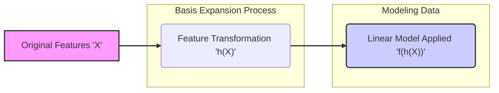
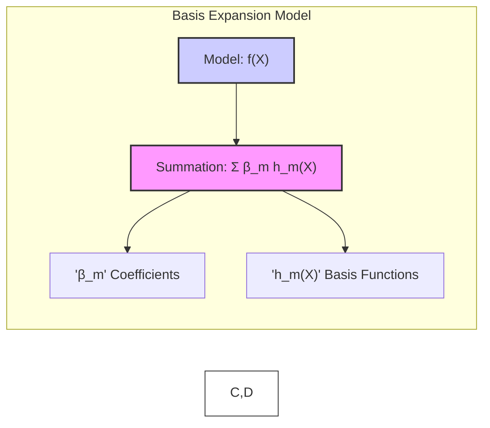
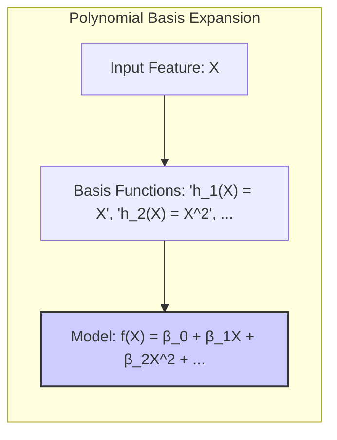
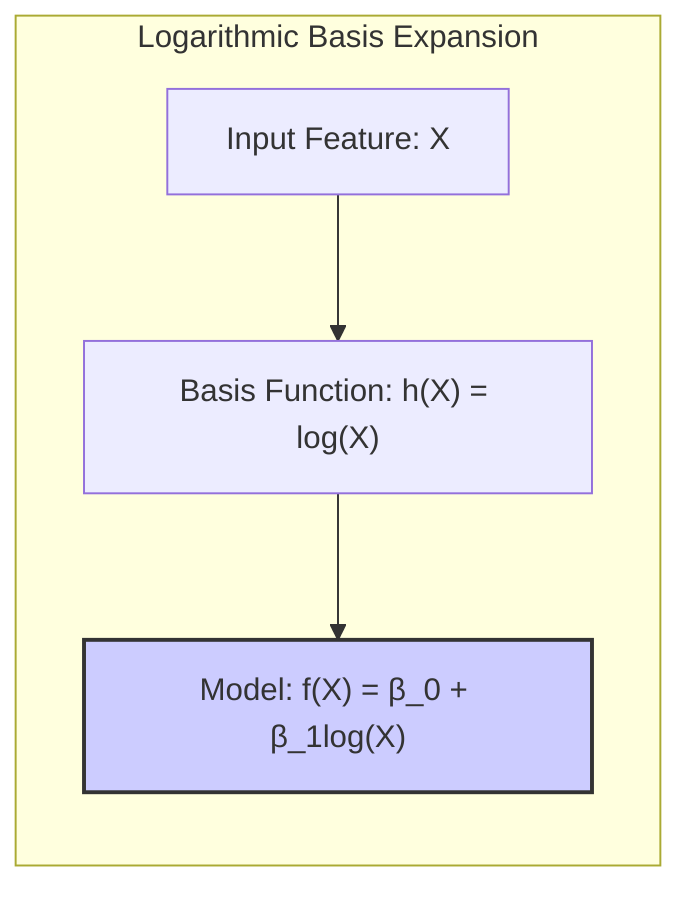
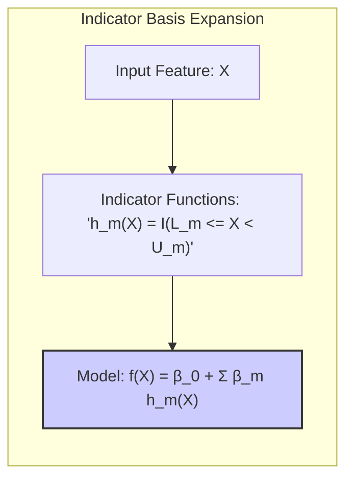
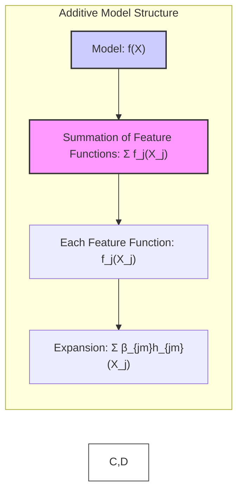
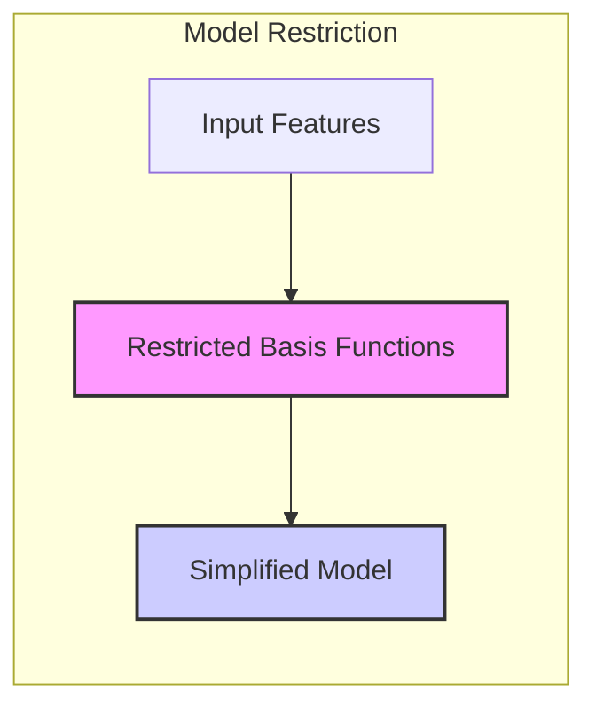
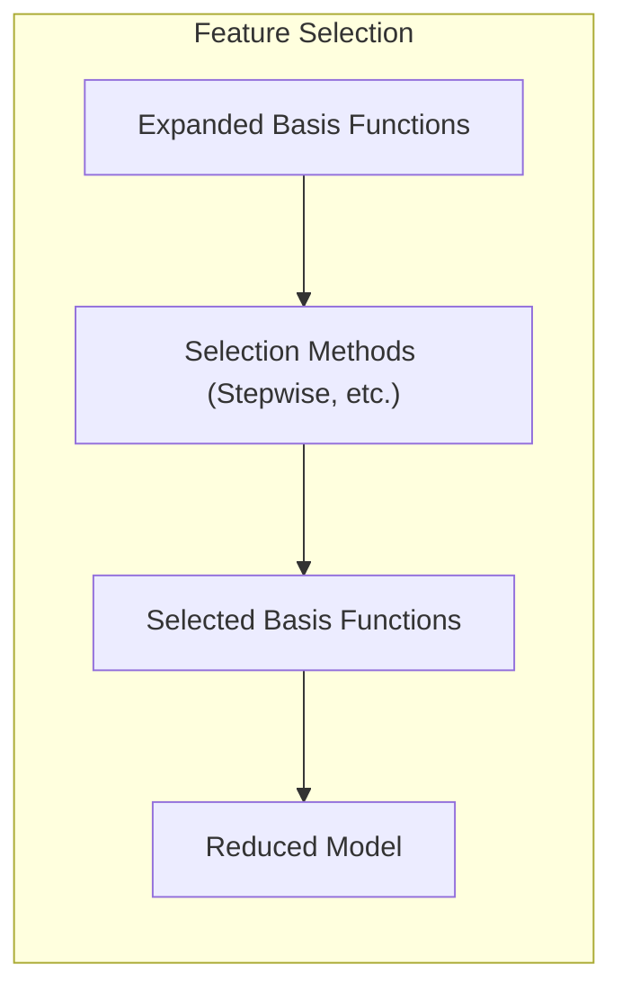
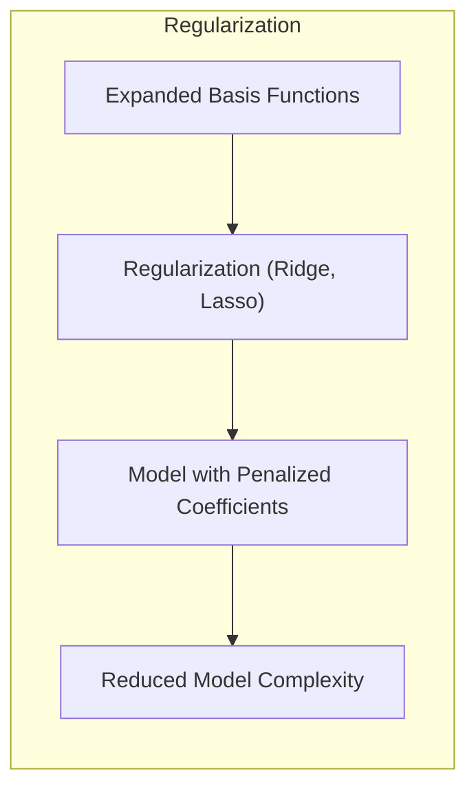

## Goal of Basis Expansions: Extending Linear Models



### Introdução

Modelos lineares, como discutido anteriormente, são inerentemente limitados pela sua incapacidade de modelar relações não lineares entre as features de entrada e a variável de resposta [^4.1], [^5.1]. A técnica de *basis expansions* surge como uma solução para contornar essa limitação. A ideia central é **transformar as features originais** $X$ em um novo espaço de representação, denotado por $h(X)$, onde o modelo linear passa a ser aplicado [^5.1]. Este processo permite que o modelo capture relações não lineares através de uma combinação linear das novas features, proporcionando maior flexibilidade e capacidade de modelar dados mais complexos.

O objetivo principal do uso de *basis expansions* não é abandonar a simplicidade e a interpretabilidade dos modelos lineares, mas sim estender o seu poder expressivo, permitindo a modelagem de funções mais complexas sem introduzir modelos totalmente não lineares e de difícil interpretação. A escolha das funções de base $h_m(X)$ é crucial, pois determina o tipo de não linearidade que o modelo é capaz de capturar. Este capítulo explora diferentes tipos de funções de base e como elas podem ser utilizadas para melhorar a performance dos modelos [^5.1].

###  Transformação de Features e Modelagem Não Linear

A técnica de *basis expansions* envolve a transformação do vetor de entrada $X$ através de funções $h_m(X)$, criando novas features que são então usadas em um modelo linear. A modelagem resultante, embora linear no espaço das novas features, é não linear no espaço original dos dados [^5.1].

A representação geral de um modelo usando *basis expansions* é dada por:

$$
f(X) = \sum_{m=1}^{M} \beta_m h_m(X),
$$

onde $h_m(X)$ são as funções de base, $M$ é o número total de funções de base, e $\beta_m$ são os coeficientes do modelo. Essa formulação permite construir uma variedade de modelos, cada um com características específicas, dependendo das escolhas das funções de base.



A chave para uma modelagem eficaz com *basis expansions* é a escolha apropriada das funções $h_m(X)$. Diferentes tipos de funções de base podem ser utilizados, incluindo:

*   **Funções Polinomiais:** Incluir termos como $X_j^2$, $X_j^3$ ou produtos cruzados $X_jX_k$ permite aproximar funções com maior grau de não linearidade [^5.2]. No entanto, o número de termos cresce rapidamente com o grau do polinômio, levando a um problema de dimensionalidade [^5.2].

*   **Transformações Logarítmicas e de Raiz Quadrada:** Funções como $\log(X_j)$ ou $\sqrt{X_j}$ podem ser úteis para modelar dados com crescimento ou decaimento não linear [^5.2].

*   **Funções Indicadoras (Regiões):** Utilizar funções indicadoras $I(L_m \leq X_k < U_m)$ permite dividir o espaço das features em regiões, modelando a função de forma piecewise constante [^5.2].

A escolha das funções de base também é crucial para controlar a complexidade do modelo e evitar overfitting. As *basis expansions* aumentam a flexibilidade do modelo, mas o número de parâmetros também pode aumentar consideravelmente.  Portanto, a seleção e a regularização são técnicas essenciais a serem combinadas com *basis expansions* para garantir um bom desempenho do modelo [^5.2].

### Exemplos de Funções de Base

A seguir, são detalhados alguns exemplos específicos de funções de base e como elas se encaixam na estrutura das *basis expansions*:

1.  **Modelo Linear Original:** A forma mais simples de *basis expansion* é quando $h_m(X) = X_m$, onde $m=1,\ldots,p$ recupera o modelo linear original. Neste caso, a transformação é uma identidade e o modelo mantém sua natureza linear [^5.2].

    > 💡 **Exemplo Numérico:**
    >
    > Suponha que temos um dataset com uma única feature $X$ e a variável resposta $Y$. No modelo linear original, a função de base seria simplesmente $h_1(X) = X$. O modelo seria então $f(X) = \beta_0 + \beta_1 X$.  Se, por exemplo, $\beta_0 = 2$ e $\beta_1 = 3$, a previsão para $X=4$ seria $f(4) = 2 + 3 * 4 = 14$. Este é um modelo linear sem nenhuma transformação.

2.  **Expansão Polinomial:** Permite que o modelo capture não linearidades através da inclusão de termos polinomiais das features. Por exemplo, $h_m(X) = X_j^2$ ou $h_m(X) = X_jX_k$. O grau do polinômio determina a capacidade do modelo de capturar relações complexas nos dados, mas também aumenta o número de variáveis do modelo [^5.2]. Um modelo quadrático completo com $p$ variáveis requer $O(p^2)$ termos e um polinômio de grau $d$ requer $O(p^d)$ termos.

    > 💡 **Exemplo Numérico:**
    >
    > Considere novamente o dataset com uma única feature $X$. Para uma expansão polinomial de grau 2, teríamos as funções de base $h_1(X) = X$ e $h_2(X) = X^2$. O modelo seria $f(X) = \beta_0 + \beta_1 X + \beta_2 X^2$. Se $\beta_0 = 1$, $\beta_1 = 2$ e $\beta_2 = -0.5$, a previsão para $X=4$ seria $f(4) = 1 + 2 * 4 + (-0.5) * 4^2 = 1 + 8 - 8 = 1$. Aqui, a relação entre $X$ e a variável resposta é não linear devido ao termo quadrático.
    >
    > ```python
    > import numpy as np
    > import matplotlib.pyplot as plt
    >
    > # Dados de exemplo
    > X = np.linspace(-5, 5, 100)
    > beta_0 = 1
    > beta_1 = 2
    > beta_2 = -0.5
    > y = beta_0 + beta_1 * X + beta_2 * X**2
    >
    > # Plot
    > plt.figure(figsize=(8, 6))
    > plt.plot(X, y, label='f(X) = 1 + 2X - 0.5X^2')
    > plt.xlabel('X')
    > plt.ylabel('f(X)')
    > plt.title('Modelo com Expansão Polinomial (Grau 2)')
    > plt.legend()
    > plt.grid(True)
    > plt.show()
    > ```
    >
    > Este gráfico mostra a curvatura introduzida pela expansão polinomial.



3.  **Transformações Não Lineares de Inputs:** Funções como $h_m(X) = \log(X_j)$ ou $h_m(X) = \sqrt{X_j}$ permitem modelar relações não lineares de cada feature individualmente [^5.2]. Essas transformações podem ser aplicadas a uma ou mais features, ou usar combinações envolvendo diversas features como $h_m(X) = ||X||$.

    > 💡 **Exemplo Numérico:**
    >
    > Suponha que temos uma feature $X$ que representa o tamanho de uma cidade e a variável resposta $Y$ representa o número de restaurantes. A relação pode não ser linear, crescendo mais lentamente com o aumento da cidade. Poderíamos usar $h_1(X) = \log(X)$. O modelo seria $f(X) = \beta_0 + \beta_1 \log(X)$. Se $\beta_0 = 0$ e $\beta_1 = 5$, para uma cidade de tamanho $X = 100$, a previsão seria $f(100) = 0 + 5 * \log(100) \approx 0 + 5 * 4.605 \approx 23.025$. A transformação logarítmica suaviza o efeito de grandes valores de $X$.
    >
    > ```python
    > import numpy as np
    > import matplotlib.pyplot as plt
    >
    > # Dados de exemplo
    > X = np.linspace(1, 100, 100)
    > beta_0 = 0
    > beta_1 = 5
    > y = beta_0 + beta_1 * np.log(X)
    >
    > # Plot
    > plt.figure(figsize=(8, 6))
    > plt.plot(X, y, label='f(X) = 5log(X)')
    > plt.xlabel('X')
    > plt.ylabel('f(X)')
    > plt.title('Modelo com Transformação Logarítmica')
    > plt.legend()
    > plt.grid(True)
    > plt.show()
    > ```
    >
    > O gráfico demonstra como a transformação logarítmica comprime a escala do eixo X.



4.  **Funções Indicadoras de Regiões:** Permitem que o modelo capture comportamentos piecewise constantes dividindo o espaço das features em regiões. Por exemplo, $h_m(X) = I(L_m \leq X_k < U_m)$ é uma função indicadora que vale 1 quando a feature $X_k$ está entre $L_m$ e $U_m$, e 0 caso contrário [^5.2]. O uso dessas funções cria um modelo que representa a influência de cada região em uma variável da resposta.

    > 💡 **Exemplo Numérico:**
    >
    > Considere a feature $X$ representando a idade de uma pessoa e $Y$ representando a probabilidade de comprar um produto. Podemos dividir as idades em faixas: $h_1(X) = I(18 \leq X < 30)$, $h_2(X) = I(30 \leq X < 50)$ e $h_3(X) = I(50 \leq X < 70)$. O modelo seria $f(X) = \beta_0 + \beta_1 h_1(X) + \beta_2 h_2(X) + \beta_3 h_3(X)$. Se $\beta_0 = 0.1$, $\beta_1 = 0.8$, $\beta_2 = 0.5$, e $\beta_3 = 0.2$, uma pessoa com 25 anos teria uma probabilidade de compra de $0.1 + 0.8 = 0.9$, uma pessoa com 40 anos teria $0.1 + 0.5 = 0.6$, e uma pessoa com 60 anos teria $0.1 + 0.2 = 0.3$. O modelo captura diferentes probabilidades em diferentes faixas etárias.
    >
    > ```python
    > import numpy as np
    > import matplotlib.pyplot as plt
    >
    > # Dados de exemplo
    > X = np.linspace(10, 80, 100)
    > beta_0 = 0.1
    > beta_1 = 0.8
    > beta_2 = 0.5
    > beta_3 = 0.2
    >
    > y = np.zeros_like(X)
    > y[(X >= 18) & (X < 30)] = beta_0 + beta_1
    > y[(X >= 30) & (X < 50)] = beta_0 + beta_2
    > y[(X >= 50) & (X < 70)] = beta_0 + beta_3
    > y[(X < 18) | (X >= 70)] = beta_0
    >
    > # Plot
    > plt.figure(figsize=(8, 6))
    > plt.plot(X, y, label='f(X) com Funções Indicadoras')
    > plt.xlabel('Idade (X)')
    > plt.ylabel('Probabilidade de Compra (f(X))')
    > plt.title('Modelo com Funções Indicadoras de Regiões')
    > plt.legend()
    > plt.grid(True)
    > plt.show()
    > ```
    >
    > Este gráfico mostra um modelo piecewise constante com diferentes valores para diferentes faixas de idade.



É fundamental observar que as funções $h_m$ podem ser usadas para criar modelos aditivos ou não aditivos. Em um modelo aditivo, a função $f(X)$ é uma soma de funções de cada feature individualmente:
$$
f(X) = \sum_{j=1}^p f_j(X_j) = \sum_{j=1}^p \sum_{m=1}^{M_j} \beta_{jm} h_{jm}(X_j)
$$
onde $f_j(X_j)$ é uma função de cada feature $X_j$. Esta abordagem assume que não há interações entre as features, o que pode ser uma limitação em algumas aplicações [^5.2].



### Métodos para Controlar a Complexidade do Modelo

As *basis expansions* aumentam a flexibilidade do modelo, mas também podem levar a *overfitting* se a complexidade do modelo não for controlada. Para lidar com esse problema, existem três abordagens principais [^5.2]:

1.  **Restrição:** Limitar o tipo ou o número de funções de base utilizadas. A escolha de um modelo aditivo é um exemplo de restrição, onde assume-se que não há interações entre as features [^5.2].

    > 💡 **Exemplo Numérico:**
    >
    > Se tivermos 3 features ($X_1$, $X_2$, $X_3$) e decidirmos usar apenas funções de base lineares e quadráticas, mas sem interações, então teríamos $h_1(X) = X_1$, $h_2(X) = X_1^2$, $h_3(X) = X_2$, $h_4(X) = X_2^2$, $h_5(X) = X_3$, e $h_6(X) = X_3^2$. O modelo seria $f(X) = \beta_0 + \beta_1 X_1 + \beta_2 X_1^2 + \beta_3 X_2 + \beta_4 X_2^2 + \beta_5 X_3 + \beta_6 X_3^2$. Se permitíssemos interações, teríamos que incluir termos como $X_1X_2$, $X_1X_3$ e $X_2X_3$ aumentando a complexidade. A restrição limita a complexidade do modelo.



2.  **Seleção:** Selecionar adaptativamente as funções de base que contribuem significativamente para o ajuste do modelo. Os métodos de seleção de variáveis discutidos no Capítulo 3, bem como métodos *greedy* como CART, MARS e boosting, são exemplos de abordagens para seleção [^5.2]. Esses métodos avaliam a importância de cada feature ou função de base e incluem apenas as mais relevantes para a modelagem.

    > 💡 **Exemplo Numérico:**
    >
    > Após uma expansão de base, podemos ter muitas features, como $X_1$, $X_1^2$, $X_2$, $X_2^2$, $X_1X_2$, etc. Usando métodos de seleção, como stepwise regression, podemos começar com um modelo simples e adicionar termos sequencialmente, avaliando a melhoria no ajuste do modelo. Por exemplo, podemos começar com apenas $X_1$ e $X_2$, e depois adicionar $X_1^2$ se sua inclusão reduzir significativamente o erro do modelo. Este processo de seleção ajuda a evitar o overfitting, focando nas features mais relevantes.



3. **Regularização:** Utilizar todas as funções de base, mas restringir os coeficientes do modelo através de penalidades. A regressão de *ridge* e o *lasso* são exemplos de métodos de regularização que podem ser usados para controlar a complexidade do modelo [^5.2]. A regularização impõe uma restrição sobre a magnitude dos coeficientes, evitando *overfitting*.

    > 💡 **Exemplo Numérico:**
    >
    > Suponha que temos um modelo com muitas funções de base $h_1(X), h_2(X), \ldots, h_M(X)$. Em vez de selecionar as features, usamos todas elas, mas aplicamos regularização Ridge. O modelo seria $f(X) = \sum_{m=1}^M \beta_m h_m(X)$, e o objetivo seria minimizar o erro do modelo mais a penalidade: $\sum_{i=1}^N (y_i - f(x_i))^2 + \lambda \sum_{m=1}^M \beta_m^2$. O parâmetro $\lambda$ controla a intensidade da regularização.  Um $\lambda$ maior força os coeficientes $\beta_m$ a serem menores, evitando o overfitting.
    >
    > ```python
    > import numpy as np
    > from sklearn.linear_model import Ridge
    > from sklearn.preprocessing import PolynomialFeatures
    > from sklearn.pipeline import make_pipeline
    >
    > # Dados de exemplo
    > np.random.seed(0)
    > X = np.sort(5 * np.random.rand(50, 1), axis=0)
    > y = np.sin(X).ravel() + np.random.normal(0, 0.1, X.shape[0])
    >
    > # Expansão Polinomial
    > degree = 10
    > poly = PolynomialFeatures(degree=degree)
    > X_poly = poly.fit_transform(X)
    >
    > # Ridge regression
    > alpha = 0.1  # Regularization strength
    > ridge = Ridge(alpha=alpha)
    > ridge.fit(X_poly, y)
    >
    > # Predições
    > X_test = np.linspace(0, 5, 100).reshape(-1, 1)
    > X_test_poly = poly.transform(X_test)
    > y_ridge = ridge.predict(X_test_poly)
    >
    > # Plot
    > import matplotlib.pyplot as plt
    > plt.figure(figsize=(10, 6))
    > plt.scatter(X, y, color='blue', label='Dados')
    > plt.plot(X_test, y_ridge, color='red', label='Ridge Regression')
    > plt.xlabel('X')
    > plt.ylabel('y')
    > plt.title('Ridge Regression com Expansão Polinomial')
    > plt.legend()
    > plt.grid(True)
    > plt.show()
    > ```
    >
    > Este exemplo mostra como a regressão Ridge suaviza a curva ajustada, evitando overfitting.



A combinação de *basis expansions* com métodos de seleção e regularização é crucial para construir modelos flexíveis que não sofram de *overfitting* e que sejam capazes de generalizar bem para dados não observados.

### Objetivo da Expansão de Bases

O principal objetivo da expansão de bases (basis expansions) é aumentar a capacidade dos modelos lineares de capturar padrões complexos e não lineares nos dados, transformando as features originais em um espaço de representação mais rico. Ao usar funções de base apropriadas, os modelos podem aprender relações complexas que não seriam acessíveis com um modelo linear simples. A técnica permite, portanto, um equilíbrio entre a flexibilidade de modelos não lineares e a interpretabilidade de modelos lineares, tornando-se uma ferramenta útil e versátil em diversas aplicações.

A escolha das funções de base deve ser guiada pelo conhecimento do domínio do problema, além de uma avaliação empírica do desempenho do modelo. A aplicação correta dessa técnica, em combinação com métodos de seleção e regularização, leva à construção de modelos que melhoram a acurácia das predições e, ao mesmo tempo, são capazes de lidar com dados complexos.

### Footnotes

[^5.1]: "We have already made use of models linear in the input features, both for regression and classification. Linear regression, linear discriminant analysis, logistic regression and separating hyperplanes all rely on a linear model." *(Trecho de <Basis Expansions and Regularization>)*
[^5.2]: "In regression problems, f(X) = E(Y|X) will typically be nonlinear and nonadditive in X, and representing f(X) by a linear model is usually a convenient, and sometimes a necessary, approximation." *(Trecho de <Basis Expansions and Regularization>)*
