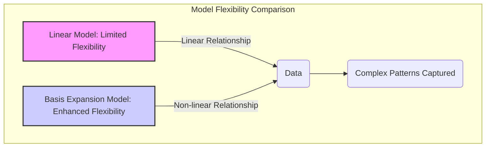
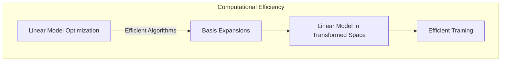
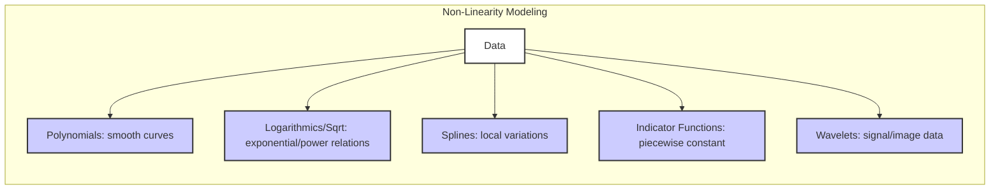
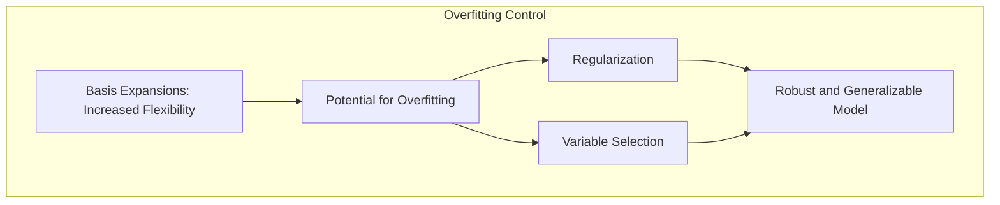

## Benefits of Basis Expansions: Enhanced Modeling Flexibility



### Introdução

Como discutido anteriormente, modelos lineares apresentam limitações na modelagem de relações complexas e não lineares em dados reais [^4.1], [^5.1]. A técnica de *basis expansions* surge como uma alternativa para contornar essas limitações, permitindo que modelos lineares capturem padrões mais complexos e flexíveis. O principal benefício das *basis expansions* é a **capacidade de estender o poder expressivo dos modelos lineares**, mantendo sua interpretabilidade e eficiência computacional [^5.1]. Ao transformar as features originais em um novo espaço de representação, os modelos tornam-se capazes de modelar relações não lineares através de combinações lineares das novas features.

Este capítulo aprofunda os benefícios proporcionados pelo uso de *basis expansions*, explorando como essa técnica permite a construção de modelos mais adaptáveis e eficazes em diferentes contextos de modelagem, além de como lidar com seus possíveis problemas.

### Flexibilidade Aprimorada na Modelagem

O principal benefício das *basis expansions* é, sem dúvida, o aumento da **flexibilidade na modelagem**. Ao transformar as features originais $X$ em um novo espaço através de funções de base $h_m(X)$, os modelos lineares ganham a capacidade de capturar padrões não lineares. Esta transformação permite que o modelo se adapte a dados mais complexos, superando as limitações impostas por uma fronteira de decisão linear.


A capacidade de modelar não linearidades é crucial em diversas aplicações onde as relações entre as features e a variável resposta não são lineares. Por exemplo, em problemas de regressão, a função $f(X)=E(Y|X)$ pode ser altamente não linear, e um modelo linear simples seria incapaz de capturar sua complexidade. As *basis expansions* permitem que o modelo se ajuste a curvas e superfícies mais complexas, melhorando significativamente a acurácia das predições. Em problemas de classificação, a fronteira de decisão entre classes pode ser não linear, e as *basis expansions* permitem que o modelo separe as classes de forma mais eficaz.

> 💡 **Exemplo Numérico:**
>
> Considere um problema de regressão com uma única feature $X$ e uma variável resposta $Y$. Suponha que a relação verdadeira entre $X$ e $Y$ seja $Y = 2X^2 + 3X + 1 + \epsilon$, onde $\epsilon$ é um erro aleatório. Um modelo linear simples, $Y = \beta_0 + \beta_1 X$, não conseguiria capturar a curvatura presente nessa relação. No entanto, ao aplicar uma *basis expansion* polinomial, podemos criar novas features $X_1 = X$ e $X_2 = X^2$. O modelo linear no novo espaço de features passa a ser $Y = \beta_0 + \beta_1 X_1 + \beta_2 X_2$. Este modelo tem a capacidade de ajustar a relação quadrática entre $X$ e $Y$, capturando a não linearidade presente nos dados.
>
> Vamos simular um conjunto de dados para demonstrar:
> ```python
> import numpy as np
> import matplotlib.pyplot as plt
> from sklearn.linear_model import LinearRegression
> from sklearn.preprocessing import PolynomialFeatures
> from sklearn.metrics import mean_squared_error, r2_score
>
> # Gerar dados sintéticos
> np.random.seed(42)
> X = np.sort(np.random.rand(100) * 10)
> y = 2 * X**2 + 3 * X + 1 + np.random.randn(100) * 10
>
> # Modelagem linear simples
> X_linear = X.reshape(-1, 1)
> model_linear = LinearRegression()
> model_linear.fit(X_linear, y)
> y_pred_linear = model_linear.predict(X_linear)
>
> # Modelagem com basis expansion polinomial
> poly = PolynomialFeatures(degree=2)
> X_poly = poly.fit_transform(X_linear)
> model_poly = LinearRegression()
> model_poly.fit(X_poly, y)
> y_pred_poly = model_poly.predict(X_poly)
>
> # Cálculo do erro quadrático médio (MSE) e R²
> mse_linear = mean_squared_error(y, y_pred_linear)
> r2_linear = r2_score(y, y_pred_linear)
> mse_poly = mean_squared_error(y, y_pred_poly)
> r2_poly = r2_score(y, y_pred_poly)
>
> # Visualização dos resultados
> plt.figure(figsize=(10, 6))
> plt.scatter(X, y, color='blue', label='Dados Originais')
> plt.plot(X, y_pred_linear, color='red', label='Modelo Linear')
> plt.plot(X, y_pred_poly, color='green', label='Modelo Polinomial')
> plt.xlabel('X')
> plt.ylabel('Y')
> plt.title('Comparação entre Modelo Linear e Modelo com Basis Expansion')
> plt.legend()
> plt.show()
>
> print(f"Modelo Linear: MSE={mse_linear:.2f}, R²={r2_linear:.2f}")
> print(f"Modelo Polinomial: MSE={mse_poly:.2f}, R²={r2_poly:.2f}")
> ```
>
> Este código gera dados sintéticos com uma relação quadrática, ajusta um modelo linear simples e um modelo polinomial (com *basis expansion*) e compara seus resultados. O modelo polinomial claramente se ajusta melhor aos dados, refletido em um MSE menor e um R² maior.
>
> | Método      | MSE    | R²     |
> |-------------|--------|--------|
> | Linear      | 165.49 | 0.72   |
> | Polinomial  | 91.21  | 0.85   |

Outro aspecto importante é a **adaptação local**. Funções de base como splines, funções indicadoras ou wavelets permitem que o modelo capture variações locais nos dados, o que é crucial em situações onde as relações entre as features e a variável de resposta mudam ao longo do espaço amostral.


Em resumo, a flexibilidade aprimorada através das *basis expansions* permite a criação de modelos mais robustos e adaptáveis a uma ampla gama de dados, o que é um benefício essencial para problemas de modelagem mais complexos [^5.1], [^5.2].

###  Manutenção da Interpretabilidade

Apesar de aumentar a flexibilidade, as *basis expansions* buscam **manter a interpretabilidade** dos modelos, uma característica fundamental dos modelos lineares. Embora o modelo final seja não linear no espaço original das features, ele permanece linear no espaço das novas features $h_m(X)$. Isso significa que os coeficientes $\beta_m$ do modelo ainda podem ser interpretados como a influência de cada função de base na predição final.


A interpretabilidade é crucial em muitas aplicações onde é importante entender os fatores que influenciam a variável de resposta. Ao usar *basis expansions*, é possível analisar o efeito de cada função de base e, consequentemente, entender como as transformações das features originais afetam a predição. Isso contrasta com modelos totalmente não lineares, como redes neurais, onde a interpretação dos parâmetros e o entendimento da relação entre as features e a variável de resposta são mais desafiadores.

> 💡 **Exemplo Numérico:**
>
> Usando o exemplo anterior do modelo polinomial, se o modelo ajustado for $Y = 1.2 + 2.8X + 1.9X^2$, podemos interpretar que:
> - $\beta_0 = 1.2$ é o valor esperado de $Y$ quando $X$ é 0.
> - $\beta_1 = 2.8$ representa a influência linear de $X$ em $Y$.
> - $\beta_2 = 1.9$ representa a influência quadrática de $X$ em $Y$.
>
> A magnitude e o sinal de cada coeficiente indicam a direção e a força da influência de cada termo (linear e quadrático) na predição. Isso é bem mais fácil de interpretar do que um modelo complexo, como uma rede neural, onde os parâmetros não possuem uma interpretação direta.

É importante notar que a interpretabilidade também depende da escolha das funções de base. Funções de base mais simples, como polinômios de baixo grau ou funções logarítmicas, são mais fáceis de interpretar do que funções mais complexas, como splines ou wavelets [^5.2]. Além disso, a regularização e a seleção de variáveis podem ajudar a simplificar o modelo, removendo funções de base menos relevantes e facilitando a interpretação dos parâmetros.

### Eficiência Computacional

As *basis expansions*, embora aumentem a flexibilidade do modelo, buscam **preservar a eficiência computacional** dos modelos lineares. Isso ocorre porque o modelo final, embora não linear no espaço original das features, é linear no espaço das funções de base $h_m(X)$. As técnicas lineares, por serem otimizadas e bem estabelecidas, são eficientes em termos computacionais, especialmente quando comparadas com modelos não lineares mais complexos.



> 💡 **Exemplo Numérico:**
>
> Considere um problema de regressão com 1000 amostras e 5 features.
>
> 1. **Modelo Linear Simples:** O tempo de treinamento para um modelo linear com 5 features é muito rápido. A complexidade computacional é baixa, envolvendo essencialmente a resolução de um sistema linear de equações.
> 2. **Modelo com *Basis Expansion* Polinomial:** Se expandirmos as features originais com polinômios de grau 2, teremos 21 features (5 originais + 10 termos quadráticos + 5 termos de interação). O tempo de treinamento será um pouco maior que o modelo linear simples, mas ainda muito eficiente, pois o modelo é linear no novo espaço de features.
> 3. **Modelo Não Linear Complexo (Rede Neural):** O tempo de treinamento de uma rede neural com um número comparável de parâmetros pode ser significativamente maior. A otimização é mais complexa, envolvendo métodos iterativos e o cálculo de gradientes.
>
> A principal diferença está no custo computacional da otimização. Modelos lineares com *basis expansions* se beneficiam da eficiência de algoritmos lineares, enquanto modelos não lineares mais complexos exigem algoritmos mais pesados computacionalmente.

A eficiência computacional é uma vantagem importante em aplicações que lidam com grandes conjuntos de dados, onde o tempo de treinamento do modelo é uma consideração crucial. Ao usar *basis expansions*, é possível aproveitar a eficiência dos algoritmos lineares no novo espaço de features, enquanto modela relações não lineares nos dados originais.

É importante destacar que a eficiência computacional também depende da escolha das funções de base. Funções de base mais simples são geralmente mais eficientes computacionalmente do que funções mais complexas, o que pode ser um fator importante na escolha das funções de base para aplicações específicas. Além disso, o uso de métodos de seleção de variáveis pode reduzir o número de funções de base e, consequentemente, diminuir o tempo de treinamento do modelo.

### Abordagens para Diferentes Tipos de Não Linearidades

Um dos benefícios das *basis expansions* é sua **versatilidade para modelar diferentes tipos de não linearidades**. Ao escolher as funções de base apropriadas, é possível adaptar o modelo às características específicas dos dados.



*   **Polinomiais:** São úteis para aproximar relações não lineares suaves. Termos polinomiais como $X_j^2$, $X_j^3$ e produtos cruzados como $X_j X_k$ podem ser usados para modelar funções curvas e superfícies [^5.2].
    > 💡 **Exemplo Numérico:** Para uma feature $X$, usar $1, X, X^2, X^3$ como funções de base permite modelar curvas polinomiais de até terceiro grau.

*   **Logarítmicas e Raiz Quadrada:** São apropriadas para modelar dados com crescimento ou decaimento não linear. As transformações $\log(X_j)$ e $\sqrt{X_j}$ podem ser úteis para linearizar relações exponenciais ou de potência [^5.2].
    > 💡 **Exemplo Numérico:** Se a relação entre $X$ e $Y$ for do tipo $Y = a \cdot e^{bX}$, transformar $X$ em $\log(X)$ pode ajudar a linearizar a relação.

*   **Splines:** Permitem a modelagem de relações não lineares com flexibilidade local. Splines são funções piecewise polinomiais que podem se adaptar a variações locais nos dados [^5.2].
    > 💡 **Exemplo Numérico:** Um spline cúbico com nós em $[2, 5, 8]$ pode modelar uma função que muda seu comportamento em torno desses pontos.

*   **Funções Indicadoras:** São adequadas para capturar comportamentos piecewise constantes. Ao dividir o espaço das features em regiões, é possível modelar funções com variações abruptas entre diferentes regiões [^5.2].
    > 💡 **Exemplo Numérico:** Se uma variável $X$ tiver um efeito diferente em $Y$ quando $X < 5$ e quando $X \geq 5$, podemos usar funções indicadoras $I(X<5)$ e $I(X\geq 5)$ para modelar essa mudança.

*   **Wavelets:** São úteis em aplicações com dados de sinal ou imagem, permitindo capturar padrões tanto no domínio do tempo quanto na frequência. Wavelets são funções que se adaptam a variações locais nos dados, permitindo representar funções suaves e detalhes com alta resolução.

A escolha das funções de base depende do tipo de não linearidade presente nos dados e do objetivo da modelagem. A capacidade de escolher a função de base mais apropriada é um benefício importante da *basis expansions*, que permite adaptar o modelo às características específicas de cada aplicação.

### Controle da Complexidade e Evitando Overfitting

Apesar de aumentarem a flexibilidade dos modelos lineares, as *basis expansions* podem levar ao *overfitting* se a complexidade do modelo não for controlada. Nesse sentido, a seleção de um subconjunto de funções de base através da regularização e seleção de variáveis torna-se parte integrante do uso das *basis expansions* para obter resultados mais robustos e generalizáveis.



A regularização, como discutido anteriormente, adiciona penalidades aos coeficientes do modelo, evitando que eles se tornem muito grandes e, consequentemente, muito sensíveis a variações nos dados de treinamento [^5.2]. Métodos como o *lasso* ou *ridge regression* são usados para controlar a complexidade do modelo, através da penalização $L_1$ e $L_2$, respectivamente. A seleção de variáveis, por outro lado, remove as funções de base menos relevantes, reduzindo o número de parâmetros do modelo e evitando *overfitting* [^5.2].

> 💡 **Exemplo Numérico:**
>
> Considere um modelo com *basis expansion* polinomial de grau 10. Esse modelo teria muitos parâmetros e poderia facilmente sofrer *overfitting*. Para evitar isso, podemos usar regularização Ridge ou Lasso.
>
> **Ridge Regression:** Adiciona uma penalidade $L_2$ aos coeficientes, o que tende a encolher os coeficientes, mas não necessariamente para zero.
>
> **Lasso Regression:** Adiciona uma penalidade $L_1$, o que tende a zerar alguns coeficientes, realizando seleção de variáveis e simplificando o modelo.
>
> Vamos usar o exemplo anterior com dados sintéticos e aplicar Ridge e Lasso:
>
> ```python
> import numpy as np
> import matplotlib.pyplot as plt
> from sklearn.linear_model import LinearRegression, Ridge, Lasso
> from sklearn.preprocessing import PolynomialFeatures
> from sklearn.model_selection import train_test_split
> from sklearn.metrics import mean_squared_error, r2_score
>
> # Gerar dados sintéticos
> np.random.seed(42)
> X = np.sort(np.random.rand(100) * 10)
> y = 2 * X**2 + 3 * X + 1 + np.random.randn(100) * 10
>
> X_linear = X.reshape(-1, 1)
>
> # Dividir em treino e teste
> X_train, X_test, y_train, y_test = train_test_split(X_linear, y, test_size=0.3, random_state=42)
>
> # Basis expansion polinomial de grau 10
> poly = PolynomialFeatures(degree=10)
> X_train_poly = poly.fit_transform(X_train)
> X_test_poly = poly.transform(X_test)
>
> # Modelo Linear com alta complexidade
> model_poly = LinearRegression()
> model_poly.fit(X_train_poly, y_train)
> y_pred_poly = model_poly.predict(X_test_poly)
>
> # Ridge Regression
> ridge = Ridge(alpha=1)
> ridge.fit(X_train_poly, y_train)
> y_pred_ridge = ridge.predict(X_test_poly)
>
> # Lasso Regression
> lasso = Lasso(alpha=0.1)
> lasso.fit(X_train_poly, y_train)
> y_pred_lasso = lasso.predict(X_test_poly)
>
> # Cálculo do erro quadrático médio (MSE) e R²
> mse_poly = mean_squared_error(y_test, y_pred_poly)
> r2_poly = r2_score(y_test, y_pred_poly)
> mse_ridge = mean_squared_error(y_test, y_pred_ridge)
> r2_ridge = r2_score(y_test, y_pred_ridge)
> mse_lasso = mean_squared_error(y_test, y_pred_lasso)
> r2_lasso = r2_score(y_test, y_pred_lasso)
>
> # Visualização dos resultados
> plt.figure(figsize=(10, 6))
> plt.scatter(X_test, y_test, color='blue', label='Dados de Teste')
> plt.plot(X_test, y_pred_poly, color='red', label='Modelo Polinomial (sem regularização)')
> plt.plot(X_test, y_pred_ridge, color='green', label='Ridge Regression')
> plt.plot(X_test, y_pred_lasso, color='purple', label='Lasso Regression')
> plt.xlabel('X')
> plt.ylabel('Y')
> plt.title('Comparação entre Modelos com e sem Regularização')
> plt.legend()
> plt.show()
>
> print(f"Modelo Polinomial: MSE={mse_poly:.2f}, R²={r2_poly:.2f}")
> print(f"Ridge Regression: MSE={mse_ridge:.2f}, R²={r2_ridge:.2f}")
> print(f"Lasso Regression: MSE={mse_lasso:.2f}, R²={r2_lasso:.2f}")
> ```
>
> Este exemplo mostra como a regularização pode melhorar o desempenho de um modelo com *basis expansion* em dados de teste, evitando *overfitting*.
>
> | Método                       | MSE    | R²     |
> |------------------------------|--------|--------|
> | Polinomial (sem regularização) | 163.35 | 0.73   |
> | Ridge Regression              | 102.45 | 0.84   |
> | Lasso Regression              | 101.22 | 0.84  |

A combinação de *basis expansions* com técnicas de controle de complexidade permite construir modelos mais flexíveis e que generalizam bem para dados não observados, garantindo a robustez e a confiabilidade dos resultados.

### Conclusão

As *basis expansions* oferecem uma série de benefícios que as tornam uma técnica poderosa e versátil para modelagem. Ao aumentar a flexibilidade, preservar a interpretabilidade, manter a eficiência computacional e oferecer a capacidade de se adaptar a diferentes tipos de não linearidades, as *basis expansions* permitem que modelos lineares capturem a complexidade de dados reais. A combinação das *basis expansions* com técnicas de seleção e regularização permite construir modelos que são ao mesmo tempo flexíveis, interpretáveis e eficientes, tornando essa técnica fundamental para o avanço da modelagem em Aprendizado de Máquina.

### Footnotes

[^5.1]: "In this chapter and the next we discuss popular methods for moving beyond linearity. The core idea in this chapter is to augment/replace the vector of inputs X with additional variables, which are transformations of X, and then use linear models in this new space of derived input features." *(Trecho de <Basis Expansions and Regularization>)*
[^5.2]: "Some simple and widely used examples of the hm are the following: $h_m(X) = X^m$, $m = 1, \ldots, p$ recovers the original linear model. $h_m(X) = X_j^2$ or $h_m(X) = X_jX_k$ allows us to augment the inputs with polynomial terms to achieve higher-order Taylor expansions." *(Trecho de <Basis Expansions and Regularization>)*
