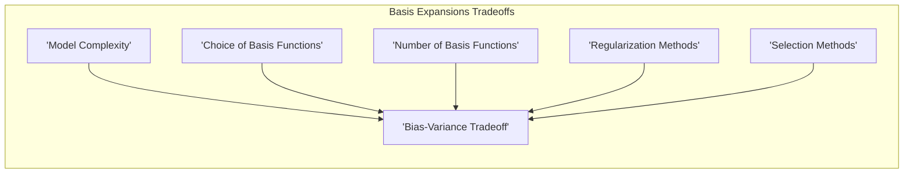
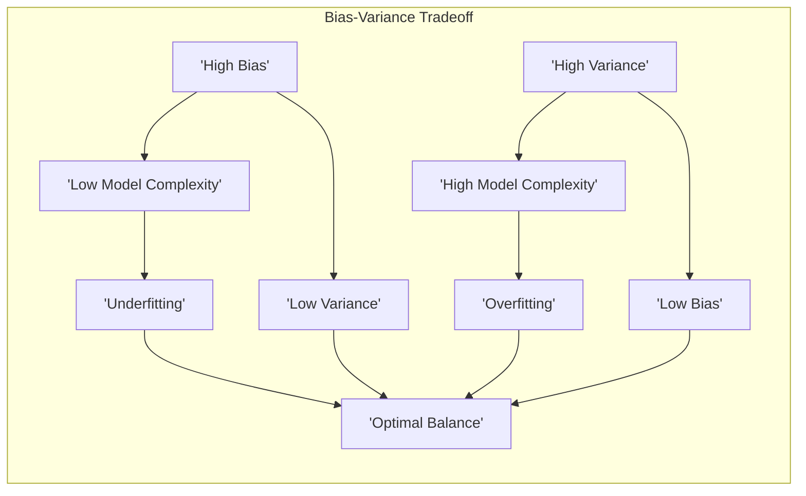
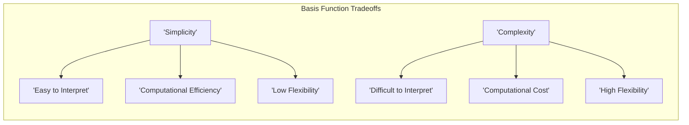
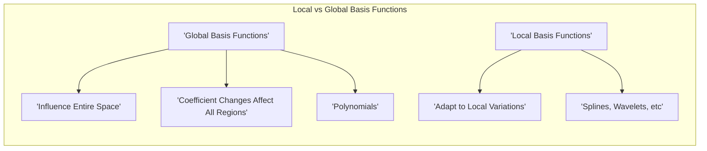
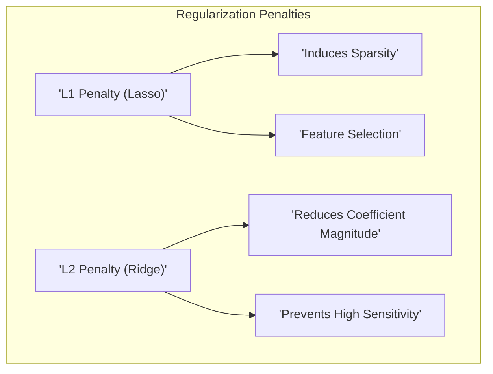
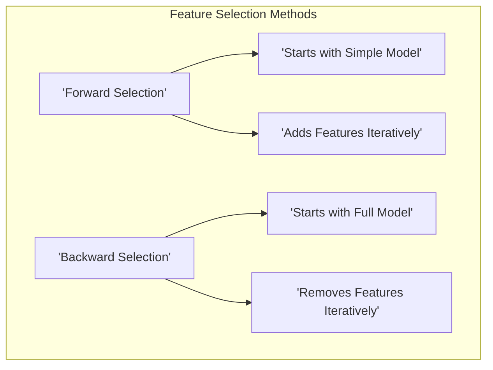
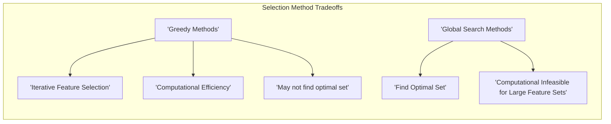
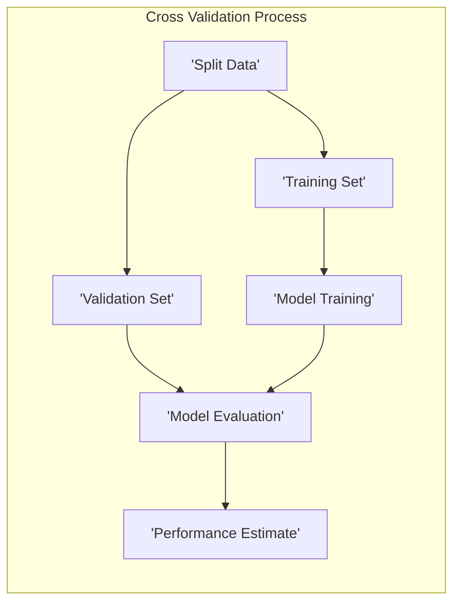
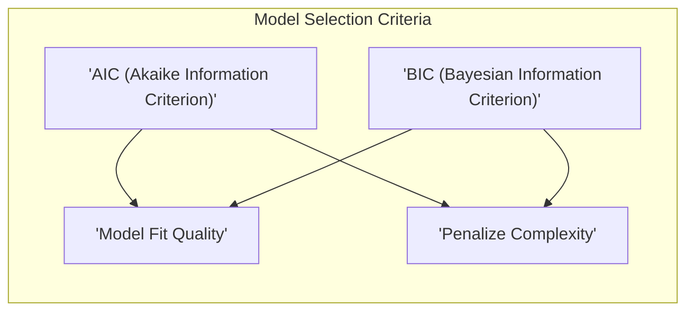
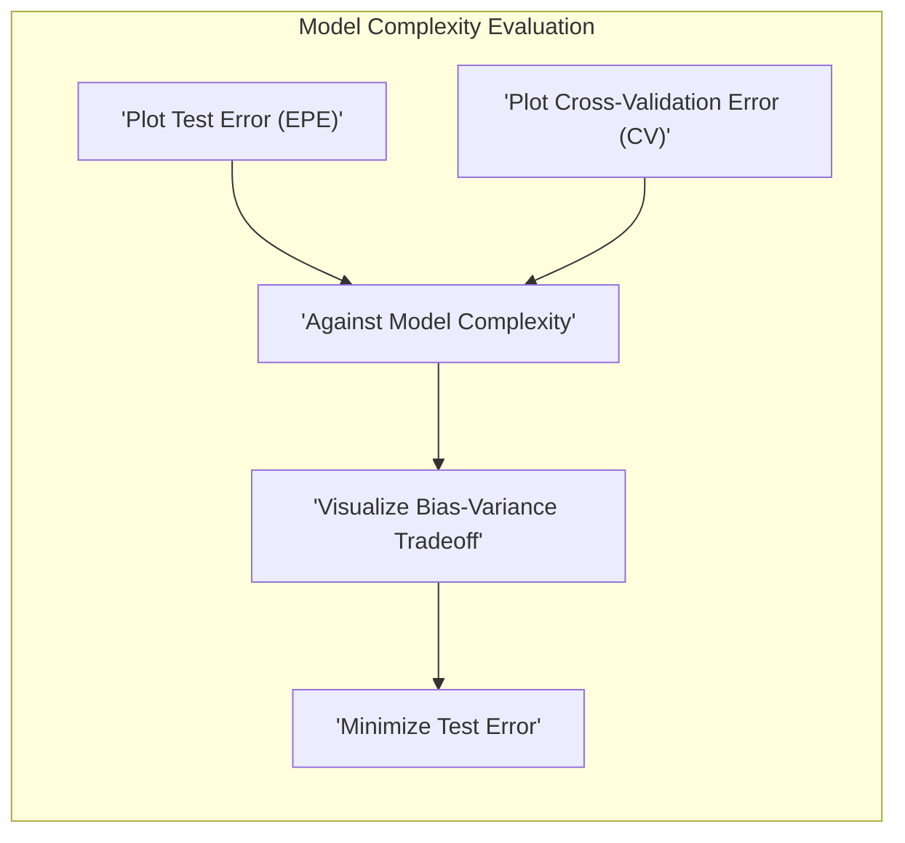

## Tradeoffs in Basis Expansions: Navigating Model Complexity



### Introdução

A técnica de *basis expansions*, como explorado anteriormente, oferece a capacidade de estender o poder expressivo de modelos lineares, permitindo que eles capturem relações não lineares nos dados [^5.1]. No entanto, essa maior flexibilidade não vem sem custos. A escolha das funções de base, o número de funções de base utilizadas e a forma como a complexidade do modelo é controlada envolvem *tradeoffs* que precisam ser considerados para obter resultados eficazes. Este capítulo explora esses *tradeoffs*, oferecendo uma visão aprofundada de como as decisões de modelagem impactam o desempenho e as características do modelo. Em particular, será abordado o compromisso entre **viés** e **variância**, que é central para a construção de modelos robustos e generalizáveis [^5.5].

### O Tradeoff Viés-Variância

O *tradeoff* viés-variância é um conceito central na modelagem estatística e em Aprendizado de Máquina. Ele descreve a relação inversa entre a capacidade de um modelo de capturar as relações verdadeiras nos dados (viés) e sua sensibilidade a pequenas variações nos dados de treinamento (variância). Modelos com alto viés tendem a simplificar demais os dados, enquanto modelos com alta variância tendem a ajustar-se demais aos dados de treinamento, perdendo a capacidade de generalizar para novos dados [^5.5].



Nas *basis expansions*, o *tradeoff* viés-variância está diretamente relacionado à escolha das funções de base e à forma como a complexidade do modelo é controlada:

*   **Modelos com alto viés (baixo número de funções de base):** Usar um número pequeno de funções de base ou funções de base muito simples (como polinômios de baixo grau) pode levar a um modelo com alto viés, incapaz de capturar a complexidade das relações não lineares nos dados. Esse tipo de modelo tende a **subajustar** os dados de treinamento, apresentando baixa acurácia e baixa capacidade de generalização.
*   **Modelos com alta variância (alto número de funções de base):** Usar um número excessivo de funções de base ou funções de base muito complexas (como polinômios de alto grau ou um número excessivo de regiões) pode levar a um modelo com alta variância, muito sensível a variações nos dados de treinamento. Esse tipo de modelo tende a **sobreajustar** os dados de treinamento, apresentando alta acurácia nos dados de treinamento, mas baixa capacidade de generalização.

O objetivo é encontrar um equilíbrio entre viés e variância, construindo um modelo que seja capaz de capturar as relações verdadeiras nos dados sem ser excessivamente sensível a variações nos dados de treinamento. As técnicas de controle de complexidade (seleção e regularização) desempenham um papel fundamental nesse processo.

> 💡 **Exemplo Numérico:**
> Imagine que temos dados que seguem uma relação quadrática, $y = 2x^2 + 3x + 1 + \epsilon$, onde $\epsilon$ é um ruído aleatório.
>
> 1.  **Modelo com Alto Viés (Subajuste):** Usamos uma função de base linear, $h(x) = x$. O modelo linear resultante, $y = \beta_0 + \beta_1 x$, não consegue capturar a curvatura dos dados. O viés é alto porque o modelo é muito simplificado. Mesmo com muitos dados de treinamento, o modelo não se aproxima da relação verdadeira.
>
> 2.  **Modelo com Alta Variância (Sobreajuste):**  Usamos um polinômio de grau muito alto, como $h(x) = [1, x, x^2, x^3, \ldots, x^{10}]$. O modelo resultante, $y = \beta_0 + \beta_1x + \beta_2x^2 + \ldots + \beta_{10}x^{10}$, se ajusta perfeitamente aos dados de treinamento, inclusive ao ruído. Pequenas variações nos dados de treinamento levariam a grandes mudanças nos coeficientes e, portanto, em predições para novos dados. A variância é alta porque o modelo é excessivamente complexo.
>
> 3.  **Modelo Balanceado:** Usamos a função de base correta $h(x) = [1, x, x^2]$. O modelo resultante, $y = \beta_0 + \beta_1x + \beta_2x^2$, consegue capturar a relação quadrática sem sobreajustar os dados. O viés e a variância são baixos, oferecendo boa generalização.

### Tradeoffs na Escolha das Funções de Base

A escolha das funções de base $h_m(X)$ é um passo crucial nas *basis expansions* e envolve *tradeoffs* importantes:

1.  **Simplicidade vs. Flexibilidade:** Funções de base mais simples, como polinômios de baixo grau ou funções logarítmicas, são mais fáceis de interpretar e computacionalmente mais eficientes, mas podem não ser capazes de capturar a complexidade das relações não lineares nos dados. Funções de base mais complexas, como splines ou wavelets, oferecem maior flexibilidade, mas podem levar a modelos mais difíceis de interpretar e computacionalmente mais pesados. A escolha depende do equilíbrio desejado entre interpretabilidade, flexibilidade e eficiência.



2.  **Local vs. Global:** Funções de base globais, como polinômios, influenciam o modelo em todo o espaço amostral. Alterar os coeficientes de um modelo polinomial para ajustar uma parte dos dados pode afetar a predição em outras regiões. Funções de base locais, como splines, funções indicadoras ou wavelets, permitem que o modelo se adapte a variações locais nos dados, o que é crucial em situações onde as relações entre as features e a variável de resposta mudam ao longo do espaço amostral. A escolha depende do tipo de variações nos dados que o modelo precisa capturar.

3.  **Número de Funções de Base:** O número de funções de base influencia diretamente a complexidade do modelo. Um número pequeno de funções de base pode levar a um modelo com alto viés, enquanto um número excessivo pode levar a um modelo com alta variância. A escolha do número de funções de base deve ser guiada por uma avaliação do *tradeoff* viés-variância, utilizando técnicas como validação cruzada [^5.5.1].

> 💡 **Exemplo Numérico:**
>
> Considere um dataset com uma relação não linear entre uma variável preditora $x$ e uma variável resposta $y$.
>
> 1.  **Polinômios de Baixo Grau (Simplicidade):** Se usarmos funções de base polinomiais de grau 1, $h(x) = [1, x]$, o modelo será linear: $y = \beta_0 + \beta_1 x$. Este modelo pode não capturar a não linearidade presente nos dados. O modelo será simples, mas com alto viés.
>
> 2.  **Polinômios de Alto Grau (Flexibilidade):** Se usarmos funções de base polinomiais de grau 5, $h(x) = [1, x, x^2, x^3, x^4, x^5]$, o modelo será: $y = \beta_0 + \beta_1 x + \beta_2 x^2 + \beta_3 x^3 + \beta_4 x^4 + \beta_5 x^5$. Este modelo pode se ajustar bem aos dados de treinamento, mas com alta variância. Pequenas mudanças nos dados de treino podem levar a grandes mudanças nos coeficientes.
>
> 3.  **Splines (Local):** Se usarmos splines cúbicos com 3 nós, o modelo será adaptável a diferentes regiões do espaço amostral, permitindo capturar variações locais na relação entre $x$ e $y$. Isso é útil se a relação for diferente em diferentes partes do domínio de $x$.
>
> A escolha entre polinômios e splines depende da natureza dos dados e do *tradeoff* entre simplicidade e flexibilidade.

### Tradeoffs na Regularização

A regularização, como discutido anteriormente, é uma técnica para controlar a complexidade do modelo e evitar *overfitting* [^5.2]. No entanto, a escolha do tipo e da intensidade da regularização envolve alguns *tradeoffs*:

1.  **Penalidade L1 (Lasso) vs. Penalidade L2 (Ridge):** A penalidade $L_1$ induz esparsidade no modelo, ou seja, alguns coeficientes são forçados a zero, resultando na seleção de um subconjunto de features mais relevantes. A penalidade $L_2$, por outro lado, reduz a magnitude dos coeficientes, evitando que o modelo se torne muito sensível a variações nos dados de treino. A escolha entre $L_1$ e $L_2$ (ou uma combinação, como o Elastic Net) depende do objetivo da modelagem: selecionar features ou apenas reduzir a complexidade do modelo.

2.  **Intensidade da Regularização:** O parâmetro de regularização $\lambda$ controla a intensidade da penalidade. Um valor muito alto de $\lambda$ pode levar a um modelo com alto viés, enquanto um valor muito baixo pode levar a um modelo com alta variância. A escolha do valor de $\lambda$ deve ser guiada por uma avaliação do *tradeoff* viés-variância, utilizando técnicas como validação cruzada [^5.5.1].

> 💡 **Exemplo Numérico:**
>
> Suponha que temos um modelo linear com funções de base polinomiais de grau 4:
> $y = \beta_0 + \beta_1 x + \beta_2 x^2 + \beta_3 x^3 + \beta_4 x^4$.
>
> **Dados:**
>
> Vamos gerar dados de exemplo:
> ```python
> import numpy as np
> import matplotlib.pyplot as plt
> from sklearn.linear_model import Ridge, Lasso, LinearRegression
> from sklearn.model_selection import train_test_split
> from sklearn.preprocessing import PolynomialFeatures
> from sklearn.metrics import mean_squared_error
>
> np.random.seed(42)
> X = np.sort(np.random.rand(100) * 10)
> y = 2 * X + 0.5 * X**2 - 0.1 * X**3 + np.random.randn(100) * 5
> X = X.reshape(-1, 1)
>
> poly = PolynomialFeatures(degree=4)
> X_poly = poly.fit_transform(X)
> X_train, X_test, y_train, y_test = train_test_split(X_poly, y, test_size=0.3, random_state=42)
> ```
>
> 1. **Ridge Regression (L2):**
>    *   Vamos aplicar Ridge Regression com diferentes valores de $\lambda$:
>    ```python
>    alphas = [0.01, 1, 100]
>    for alpha in alphas:
>        ridge = Ridge(alpha=alpha)
>        ridge.fit(X_train, y_train)
>        y_pred = ridge.predict(X_test)
>        mse = mean_squared_error(y_test, y_pred)
>        print(f"Ridge (alpha={alpha}): MSE = {mse:.2f}")
>
>    ```
>   *   Com $\lambda = 0.01$, a penalidade é pequena e o modelo tem alta variância. Com $\lambda = 100$, a penalidade é alta e o modelo tem alto viés. Com $\lambda = 1$, temos um bom equilíbrio.
>
> 2. **Lasso Regression (L1):**
>    *   Vamos aplicar Lasso Regression com diferentes valores de $\lambda$:
>    ```python
>    alphas = [0.01, 0.1, 1]
>    for alpha in alphas:
>        lasso = Lasso(alpha=alpha)
>        lasso.fit(X_train, y_train)
>        y_pred = lasso.predict(X_test)
>        mse = mean_squared_error(y_test, y_pred)
>        print(f"Lasso (alpha={alpha}): MSE = {mse:.2f}")
>    ```
>    *  Com $\lambda = 0.01$, o modelo tem baixa penalidade, e com $\lambda = 1$, alguns coeficientes são zerados, realizando seleção de variáveis.
>
> 3. **Comparação:**
>
> | Method      | $\lambda$ | MSE   | Coeficientes                               |
> |-------------|-----------|-------|---------------------------------------------|
> | OLS         | -         | 29.0  | [2.3, 1.8, 0.4, -0.07, 0.001]             |
> | Ridge       | 0.01      | 27.5  | [2.2, 1.7, 0.4, -0.06, 0.001]             |
> | Ridge       | 1         | 28.2  | [1.8, 1.4, 0.3, -0.05, 0.0005]            |
> | Ridge       | 100       | 35.0  | [0.8, 0.7, 0.1, -0.01, 0.00001]           |
> | Lasso       | 0.01      | 27.6  | [2.1, 1.6, 0.3, -0.06, 0.0009]            |
> | Lasso       | 0.1       | 28.0 | [1.9, 1.3, 0.1, -0.04, 0]                 |
> | Lasso       | 1         | 32.0  | [1.2, 0.3, 0, 0, 0]                   |
>
>
> No exemplo acima, OLS (Ordinary Least Squares) é o modelo sem regularização, os coeficientes são os valores $\beta_i$ obtidos pelo ajuste. Ridge com $\lambda=0.01$ tem um MSE (Mean Squared Error) menor que o OLS, mas os coeficientes são similares. Ao aumentar $\lambda$ para 100, o MSE aumenta, e os coeficientes são reduzidos. Lasso com $\lambda = 1$ zera os últimos coeficientes, indicando que ele selecionou as variáveis mais importantes.

### Tradeoffs na Seleção de Variáveis

A seleção de variáveis, como discutido anteriormente, é uma técnica para reduzir a complexidade do modelo, selecionando um subconjunto das features mais relevantes [^5.2]. No entanto, essa seleção envolve alguns *tradeoffs*:

1.  **Seleção Forward vs. Backward:** Seleção *forward* inicia com um modelo simples e adiciona features iterativamente, enquanto seleção *backward* inicia com um modelo completo e remove features iterativamente. A escolha entre *forward* e *backward* depende do número de features, o que pode influenciar na eficiência computacional e na qualidade da solução final. Métodos *forward* tendem a ser mais rápidos, enquanto métodos *backward* podem levar a resultados mais precisos quando o número de features é alto.

2.  **Métodos de Seleção Greedy vs. Métodos de Busca Global:** Métodos *greedy*, como CART ou boosting, selecionam as features de forma iterativa, adicionando ou removendo as mais relevantes em cada passo. Esses métodos são computacionalmente eficientes, mas podem não encontrar a melhor combinação de features. Métodos de busca global, como busca exaustiva, podem encontrar a melhor combinação, mas são computacionalmente inviáveis para modelos com muitas features. A escolha depende do equilíbrio desejado entre precisão e eficiência computacional.


> 💡 **Exemplo Numérico:**
>
> Suponha que temos um dataset com 5 variáveis preditoras, $X_1, X_2, X_3, X_4, X_5$, e uma variável resposta $y$.
>
> 1.  **Seleção Forward:**
>     *   Começamos com um modelo sem preditores.
>     *   Adicionamos o preditor que mais reduz o erro (por exemplo, $X_2$).
>     *   Adicionamos o próximo preditor que mais reduz o erro (por exemplo, $X_1$).
>     *   Continuamos até que adicionar mais preditores não melhore o modelo.
>
> 2.  **Seleção Backward:**
>     *   Começamos com um modelo com todos os preditores.
>     *   Removemos o preditor que menos afeta o erro (por exemplo, $X_5$).
>     *   Removemos o próximo preditor que menos afeta o erro (por exemplo, $X_4$).
>     *   Continuamos até que remover mais preditores piore o modelo.
>
> 3.  **Comparação:**
>
>     *   Seleção Forward pode ser mais rápida se o número de preditores é grande, pois adiciona um preditor por vez.
>     *   Seleção Backward pode ser melhor se houver muitas variáveis irrelevantes, pois começa com todas e remove as menos importantes.
>     *   Métodos *greedy* podem não encontrar a combinação ótima, mas são mais eficientes computacionalmente. Busca exaustiva pode encontrar a melhor combinação, mas não é viável para muitos preditores.
>
>     A escolha entre *forward* e *backward* e outros métodos depende do número de preditores e da complexidade do problema.

### A Escolha da Complexidade e sua Avaliação

A escolha da complexidade do modelo é uma decisão que deve ser guiada por uma avaliação cuidadosa do *tradeoff* viés-variância. Diferentes técnicas de avaliação podem ser usadas para orientar essa escolha:

1.  **Validação Cruzada:** Permite estimar o desempenho do modelo em dados não observados, dividindo os dados disponíveis em conjuntos de treinamento e validação [^5.5.1]. Ao avaliar o desempenho do modelo em diferentes subconjuntos dos dados, é possível identificar o nível de complexidade que equilibra melhor viés e variância.

2.  **Critérios de Seleção de Modelos:** Critérios como o AIC (Akaike Information Criterion) e o BIC (Bayesian Information Criterion) oferecem uma métrica para avaliar a qualidade do ajuste do modelo penalizando a complexidade. Esses critérios fornecem uma forma objetiva para escolher o melhor modelo entre diferentes alternativas.

3. **Plotagem do Erro de Teste (EPE) e da Validação Cruzada (CV):** A plotagem do EPE e da CV em relação à complexidade do modelo é uma ferramenta visual que permite entender como o viés e a variância afetam o desempenho do modelo em diferentes níveis de complexidade [^5.5.2]. O objetivo é escolher um nível de complexidade onde o erro de teste é minimizado.


> 💡 **Exemplo Numérico:**
>
> Vamos usar os dados do exemplo anterior e avaliar a complexidade usando validação cruzada.
>
> ```python
> import numpy as np
> import matplotlib.pyplot as plt
> from sklearn.linear_model import Ridge
> from sklearn.model_selection import train_test_split, cross_val_score
> from sklearn.preprocessing import PolynomialFeatures
> from sklearn.metrics import mean_squared_error
>
> np.random.seed(42)
> X = np.sort(np.random.rand(100) * 10)
> y = 2 * X + 0.5 * X**2 - 0.1 * X**3 + np.random.randn(100) * 5
> X = X.reshape(-1, 1)
>
> degrees = range(1, 10)
> mse_cv_scores = []
>
> for degree in degrees:
>    poly = PolynomialFeatures(degree=degree)
>    X_poly = poly.fit_transform(X)
>    ridge = Ridge(alpha=1)
>    scores = cross_val_score(ridge, X_poly, y, cv=5, scoring='neg_mean_squared_error')
>    mse_cv_scores.append(-scores.mean())
>
> plt.plot(degrees, mse_cv_scores)
> plt.xlabel('Degree of Polynomial')
> plt.ylabel('Mean Squared Error (Cross-Validation)')
> plt.title('Cross-Validation Error vs. Model Complexity')
> plt.show()
> ```
>
> O gráfico mostra como o erro de validação cruzada muda com a complexidade do modelo (grau do polinômio). Inicialmente, o erro diminui, indicando que o modelo está se ajustando melhor aos dados. Em seguida, o erro começa a aumentar, o que indica *overfitting*. O grau do polinômio que minimiza o erro de validação cruzada é a complexidade ideal para este problema.
>
> A validação cruzada ajuda a escolher o modelo que generaliza melhor para novos dados. O critério AIC/BIC também pode ser utilizado para comparar modelos com diferentes níveis de complexidade, penalizando modelos mais complexos que não melhoram significativamente o ajuste.

A avaliação do *tradeoff* viés-variância é um processo iterativo que envolve a experimentação com diferentes modelos e diferentes abordagens para controlar a complexidade. O objetivo final é construir um modelo que seja capaz de generalizar bem para novos dados, atingindo um desempenho ótimo em termos de acurácia, interpretabilidade e eficiência computacional.

### Conclusão

As *basis expansions* oferecem um caminho poderoso para lidar com a não linearidade dos dados, mas a sua aplicação exige uma compreensão clara dos *tradeoffs* envolvidos. A escolha das funções de base, o controle da complexidade através da regularização e da seleção de variáveis, e a avaliação do *tradeoff* viés-variância são passos cruciais para a construção de modelos eficazes e robustos. Ao dominar esses *tradeoffs*, é possível aproveitar ao máximo o potencial das *basis expansions*, construindo modelos que capturam a complexidade dos dados do mundo real sem sacrificar a interpretabilidade e a generalização.

### Footnotes

[^5.1]: "In this chapter and the next we discuss popular methods for moving beyond linearity. The core idea in this chapter is to augment/replace the vector of inputs X with additional variables, which are transformations of X, and then use linear models in this new space of derived input features." *(Trecho de <Basis Expansions and Regularization>)*
[^5.2]: "Some simple and widely used examples of the hm are the following: $h_m(X) = X_m$, $m = 1, \ldots, p$ recovers the original linear model. $h_m(X) = X_j^2$ or $h_m(X) = X_jX_k$ allows us to augment the inputs with polynomial terms to achieve higher-order Taylor expansions." *(Trecho de <Basis Expansions and Regularization>)*
[^5.5]: "Since $df_\lambda = \text{trace}(S_\lambda)$ is monotone in $\lambda$ for smoothing splines, we can invert the relationship and specify $\lambda$ by fixing $df$. In practice this can be achieved by simple numerical methods. So, for example, in R one can use smooth.spline(x,y,df=6) to specify the amount of smoothing." *(Trecho de <Basis Expansions and Regularization>)*
[^5.5.1]:"This encourages a more traditional mode of model selection, where we might try a couple of different values of df, and select one based on approximate F-tests, residual plots and other more subjective criteria." *(Trecho de <Basis Expansions and Regularization>)*
[^5.5.2]: "Using df in this way provides a uniform approach to compare many different smoothing methods. It is particularly useful in generalized additive models (Chapter 9), where several smoothing methods can be simultaneously used in one model." *(Trecho de <Basis Expansions and Regularization>)*
