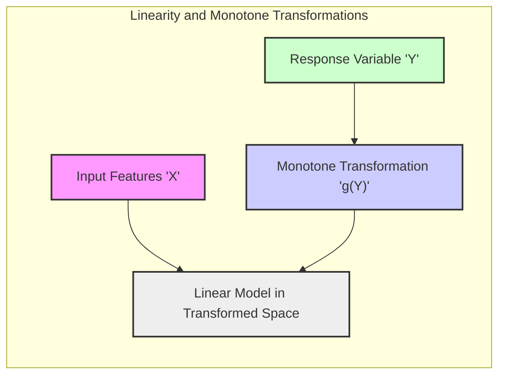
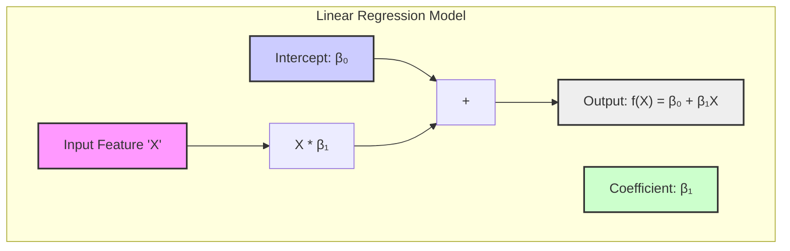
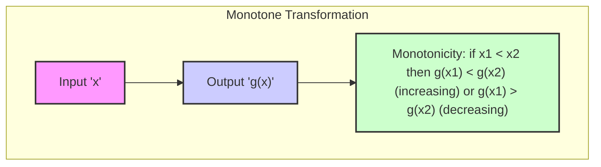
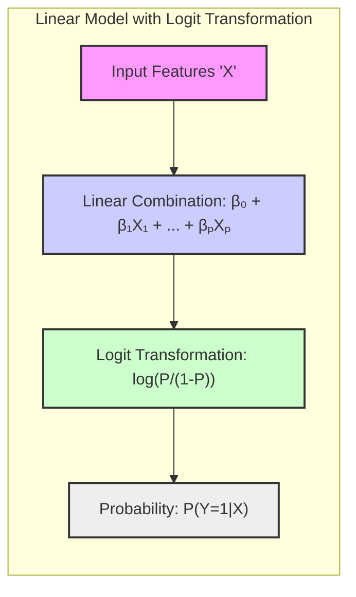
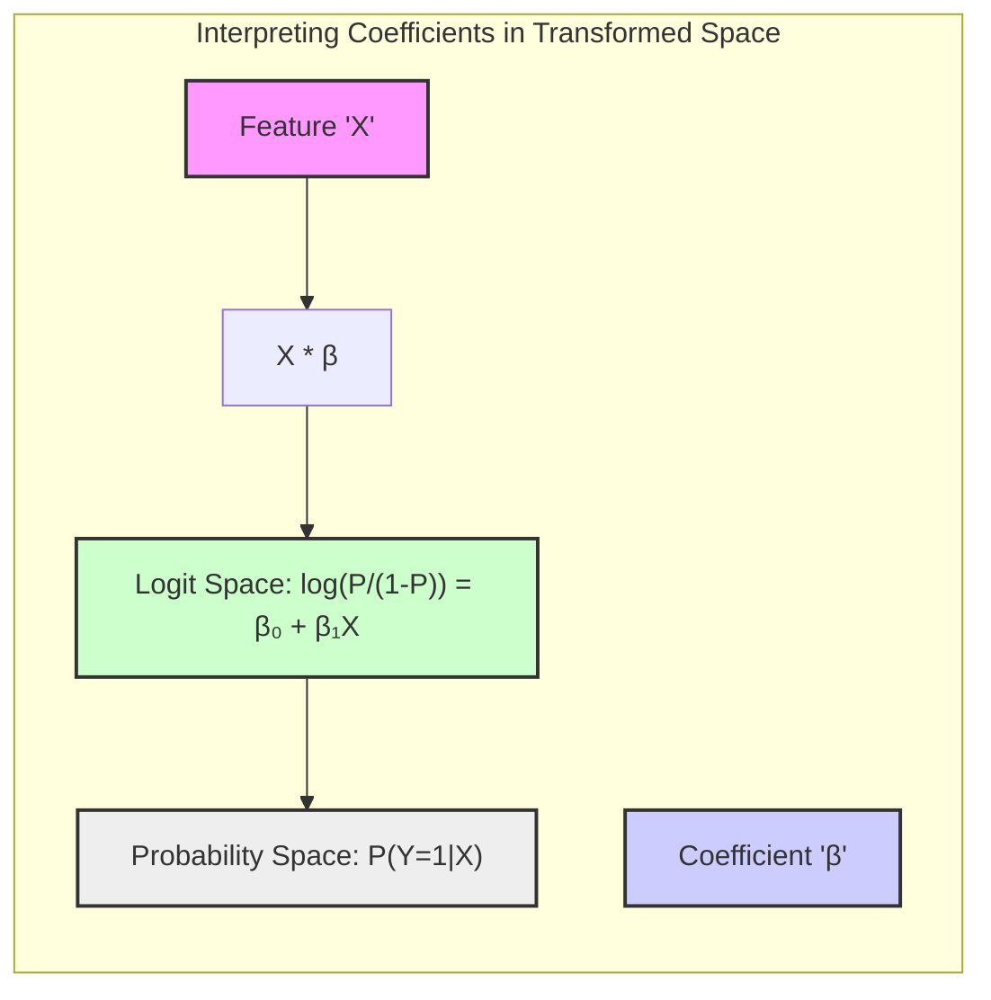

## Linearity and Monotone Transformations: A Deep Dive

### Introdução

No contexto de modelagem estatística, a suposição de linearidade desempenha um papel fundamental na construção e interpretação de modelos. Modelos lineares, como regressão linear, LDA e regressão logística, são amplamente utilizados devido à sua simplicidade e facilidade de interpretação [^4.1]. No entanto, é raro que a relação entre as features de entrada e a variável resposta seja linear no espaço original dos dados. A noção de **transformações monótonas** surge como uma forma de estender a aplicabilidade de modelos lineares, mantendo suas vantagens e permitindo a modelagem de relações não lineares sob certas condições.

Este capítulo explora a fundo a relação entre linearidade e transformações monótonas, especialmente no contexto de problemas de classificação. Serão discutidos os efeitos das transformações monótonas sobre as fronteiras de decisão, as implicações para a interpretabilidade do modelo e as limitações dessa abordagem.

### Linearidade e Modelos Lineares

A suposição de **linearidade** é uma característica fundamental de modelos como regressão linear, LDA e regressão logística. Em um modelo linear, a relação entre a variável resposta e as features de entrada é assumida como linear no espaço original dos dados, o que significa que ela pode ser representada por uma linha reta (em problemas de uma dimensão) ou por um hiperplano (em problemas de múltiplas dimensões).

Formalmente, um modelo linear pode ser expresso como:

$$
f(X) = \beta_0 + \beta_1X_1 + \beta_2X_2 + \ldots + \beta_pX_p
$$

onde $f(X)$ é a variável resposta (ou uma função da variável resposta), $X_1, X_2, \ldots, X_p$ são as features de entrada, $\beta_0$ é o intercepto e $\beta_1, \beta_2, \ldots, \beta_p$ são os coeficientes do modelo. A linearidade implica que a mudança em $f(X)$ devido a uma mudança em uma feature $X_j$ é constante, independente dos valores de outras features.

> 💡 **Exemplo Numérico:**
>
> Considere um modelo de regressão linear simples com uma única feature, onde $f(X) = 2 + 3X$.
>
> - Se $X = 1$, então $f(1) = 2 + 3(1) = 5$.
> - Se $X = 2$, então $f(2) = 2 + 3(2) = 8$.
>
> Observe que para cada aumento de 1 unidade em $X$, $f(X)$ aumenta em 3 unidades, demonstrando a linearidade da relação. O coeficiente $\beta_1 = 3$ representa essa taxa de mudança constante.

Em modelos de classificação, como LDA e regressão logística, a linearidade é frequentemente imposta em um espaço transformado da probabilidade de classe. No LDA, assume-se que as classes seguem distribuições gaussianas com covariâncias iguais, o que leva a fronteiras de decisão lineares no espaço das features [^4.3]. Na regressão logística, a linearidade é imposta no *logit* da probabilidade de classe, dado por:

$$
\text{logit}(P(Y=1|X)) = \log\left(\frac{P(Y=1|X)}{1-P(Y=1|X)}\right) = \beta_0 + \beta_1X_1 + \ldots + \beta_pX_p
$$

Embora a função de probabilidade resultante $P(Y=1|X)$ seja não linear, a transformação *logit* lineariza a relação entre a probabilidade e as features, de modo que um aumento linear nas features resulta em um aumento logístico na probabilidade.

> 💡 **Exemplo Numérico:**
>
> Suponha que temos um modelo de regressão logística com uma única feature $X$:
>
> $logit(P(Y=1|X)) = -1 + 0.5X$
>
> Se $X=2$:
>
> $logit(P(Y=1|X=2)) = -1 + 0.5 * 2 = 0$
>
> $P(Y=1|X=2) = \frac{e^0}{1+e^0} = \frac{1}{2} = 0.5$
>
> Se $X=4$:
>
> $logit(P(Y=1|X=4)) = -1 + 0.5 * 4 = 1$
>
> $P(Y=1|X=4) = \frac{e^1}{1+e^1} = \frac{2.718}{1+2.718} \approx 0.731$
>
> Note que, embora o logit seja linear em X, a probabilidade resultante $P(Y=1|X)$ não é linear. Um aumento de 2 unidades em X leva a um aumento não linear na probabilidade de aproximadamente 0.231.

### Transformações Monótonas

Uma **transformação monótona** é uma função que preserva a ordem dos dados. Se $a < b$, então $g(a) < g(b)$ (se a transformação é crescente) ou $g(a) > g(b)$ (se a transformação é decrescente). Transformações monótonas não necessariamente preservam a linearidade, mas podem ser utilizadas para transformar relações não lineares em relações lineares, sob certas condições.

A importância das transformações monótonas surge quando a relação entre as features de entrada e a variável resposta não é linear no espaço original, mas pode ser linearizada através de uma transformação apropriada. Em problemas de classificação, por exemplo, a fronteira de decisão ótima pode ser não linear no espaço das features, mas linear após uma transformação monótona na probabilidade de classe.

Um exemplo comum é a transformação *logit* usada na regressão logística, que é uma função monótona crescente que mapeia as probabilidades do intervalo (0,1) para o intervalo $(-\infty, \infty)$. Essa transformação permite que o modelo capture relações não lineares entre as features e a probabilidade de classe, mantendo a linearidade no espaço do *logit*.

Outras transformações monótonas incluem a transformação logarítmica (útil para linearizar relações exponenciais), a raiz quadrada e transformações de potência. A escolha da transformação apropriada depende das características dos dados e do objetivo da modelagem.

> 💡 **Exemplo Numérico:**
>
> Considere uma relação exponencial entre uma feature $X$ e uma variável resposta $Y$, dada por $Y = e^{2X}$. Esta relação não é linear. No entanto, ao aplicarmos a transformação logarítmica em $Y$, obtemos $\log(Y) = 2X$, que é uma relação linear entre $\log(Y)$ e $X$.
>
> - Se $X = 1$, então $Y = e^{2*1} = e^2 \approx 7.389$ e $\log(Y) = 2$.
> - Se $X = 2$, então $Y = e^{2*2} = e^4 \approx 54.598$ e $\log(Y) = 4$.
>
> A transformação logarítmica linearizou a relação, facilitando a modelagem.

### Linearidade e Transformações Monótonas em Classificação

Em problemas de classificação, a relação entre linearidade e transformações monótonas é particularmente relevante, pois permite estender a aplicabilidade de modelos lineares em cenários não lineares.

Um resultado fundamental é que, se a fronteira de decisão Bayes-ótima é obtida através de uma transformação monótona de $P(Y=1|X)$ linear em $X$, então um modelo linear pode alcançar a classificação ótima. Em outras palavras, mesmo que a relação entre as features e a variável resposta não seja linear no espaço original, um modelo linear pode ser ótimo se a relação é linear após uma transformação monótona da probabilidade de classe [^4.1].

No entanto, a suposição de que uma transformação monótona da probabilidade de classe lineariza a relação entre as features e a resposta nem sempre é válida. Em dados complexos, a fronteira de decisão ótima pode exigir modelos mais flexíveis e não lineares no espaço original das features.

Em regressão logística, a aplicação da transformação *logit* antes de utilizar um modelo linear é um exemplo prático desse conceito. A transformação *logit* lineariza a relação entre as *odds* da classe (razão entre a probabilidade de uma classe e a probabilidade da outra) e as features de entrada. Mesmo que a relação entre $P(Y=1|X)$ e as features seja não linear, o uso do *logit* permite que um modelo linear capture a relação entre a transformação da probabilidade e as features.

> 💡 **Exemplo Numérico:**
>
> Suponha que temos um modelo linear no espaço do logit:
>
> $logit(P(Y=1|X)) = 1 + 0.5X_1 - 0.3X_2$
>
> Para $X_1 = 2$ e $X_2 = 3$:
>
> $logit(P(Y=1|X)) = 1 + 0.5(2) - 0.3(3) = 1 + 1 - 0.9 = 1.1$
>
> $P(Y=1|X) = \frac{e^{1.1}}{1 + e^{1.1}} \approx \frac{3.004}{1 + 3.004} \approx 0.75$
>
> Para $X_1 = 4$ e $X_2 = 1$:
>
> $logit(P(Y=1|X)) = 1 + 0.5(4) - 0.3(1) = 1 + 2 - 0.3 = 2.7$
>
> $P(Y=1|X) = \frac{e^{2.7}}{1 + e^{2.7}} \approx \frac{14.88}{1 + 14.88} \approx 0.937$
>
> A mudança nos valores de $X_1$ e $X_2$ resulta em uma mudança não linear na probabilidade, demonstrando a transformação monótona da probabilidade.

A linearidade no espaço transformado garante que as decisões serão tomadas em relação a um hiperplano, mesmo que o espaço original tenha uma separação mais complexa. Este conceito permite utilizar a modelagem linear, mesmo quando o problema apresenta não-linearidades, desde que a função que separa as classes seja uma função monótona da probabilidade.

### Implicações para a Interpretabilidade

O uso de transformações monótonas em modelos de classificação tem implicações para a interpretabilidade dos resultados:

1.  **Interpretabilidade dos Coeficientes:** Em modelos como a regressão logística, os coeficientes $\beta_j$ representam a mudança na transformação *logit* da probabilidade de classe para uma mudança unitária na feature $X_j$. Isso significa que a interpretação dos coeficientes é feita no espaço transformado, e não no espaço original das probabilidades.
2.  **Limitações da Interpretação no Espaço Original:** A transformação monótona introduz não linearidade na relação entre as features e a probabilidade de classe no espaço original. A interpretação dos resultados no espaço original pode ser mais difícil, pois a mudança na probabilidade de classe devido a uma mudança em uma feature não é constante, mas depende do valor da probabilidade.

> 💡 **Exemplo Numérico:**
>
> Em um modelo de regressão logística com $logit(P(Y=1|X)) = -2 + 1X$, o coeficiente $\beta_1 = 1$ significa que um aumento de 1 unidade em $X$ resulta em um aumento de 1 unidade no *logit* da probabilidade. No entanto, o efeito na probabilidade $P(Y=1|X)$ não é linear.
>
> - Se $X=1$, $logit(P) = -1$ e $P \approx 0.269$.
> - Se $X=2$, $logit(P) = 0$ e $P = 0.5$.
> - Se $X=3$, $logit(P) = 1$ e $P \approx 0.731$.
>
> O aumento de 1 unidade em $X$ tem um impacto maior na probabilidade quando $X$ está em torno de 2 do que quando está em torno de 1 ou 3.

Apesar dessas limitações, a transformação monótona pode ser vantajosa, pois mantém a interpretabilidade do modelo linear no espaço transformado, onde os coeficientes ainda podem ser interpretados como a influência de cada feature na transformação da probabilidade de classe.

Em contraste, modelos totalmente não lineares, como redes neurais, tornam a interpretação das relações entre features e respostas um desafio considerável. Desta forma, modelos lineares, mesmo com o uso de transformações monótonas, podem ser mais interpretáveis para fins de análise.

### Limitações e Considerações Finais

Apesar dos benefícios, o uso de transformações monótonas em modelos de classificação apresenta algumas limitações e considerações importantes:

1.  **Escolha da Transformação:** A escolha da transformação monótona apropriada pode ser crucial para o sucesso da modelagem. Uma escolha inadequada pode levar a um modelo com baixo desempenho ou com interpretação inadequada dos resultados.
2.  **Violação da Linearidade:** A suposição de linearidade, mesmo no espaço transformado, pode ser violada em dados complexos. Modelos mais flexíveis e não lineares podem ser necessários nesses casos.
3.  **Extrapolação:** A transformação monótona pode ter um impacto significativo na extrapolação do modelo para dados fora do intervalo observado. A escolha da transformação apropriada deve ser guiada pelo conhecimento do domínio do problema e pela avaliação da validade da extrapolação.

É crucial entender que as transformações monótonas representam apenas uma ferramenta dentro da modelagem estatística e não necessariamente eliminam a necessidade de modelos mais complexos, especialmente quando as relações entre as features e a resposta são fortemente não lineares, mesmo após transformações.

### Conclusão

A relação entre linearidade e transformações monótonas é fundamental para a compreensão e aplicação de modelos estatísticos em classificação. As transformações monótonas permitem estender a aplicabilidade de modelos lineares a problemas não lineares, mantendo a interpretabilidade e a eficiência computacional. No entanto, é crucial entender as implicações dessas transformações para a interpretação dos resultados e reconhecer as limitações dessa abordagem, especialmente em dados complexos onde modelos mais flexíveis podem ser necessários.

### Footnotes

[^4.1]: "We have already made use of models linear in the input features, both for regression and classification. Linear regression, linear discriminant analysis, logistic regression and separating hyperplanes all rely on a linear model." *(Trecho de <Basis Expansions and Regularization>)*

[^4.3]: "Likewise in classification, a linear, Bayes-optimal decision boundary implies that some monotone transformation of Pr(Y = 1|X) is linear in X." *(Trecho de <Basis Expansions and Regularization>)*
