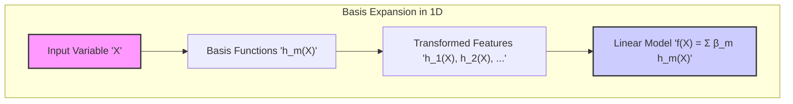
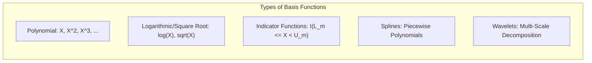
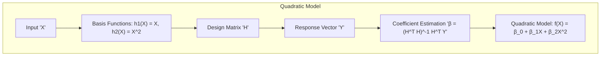
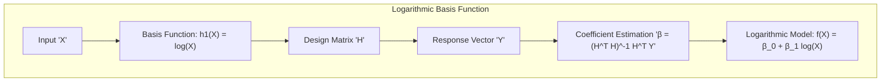
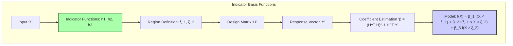
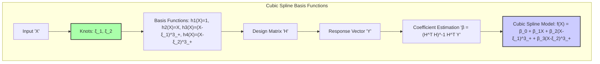
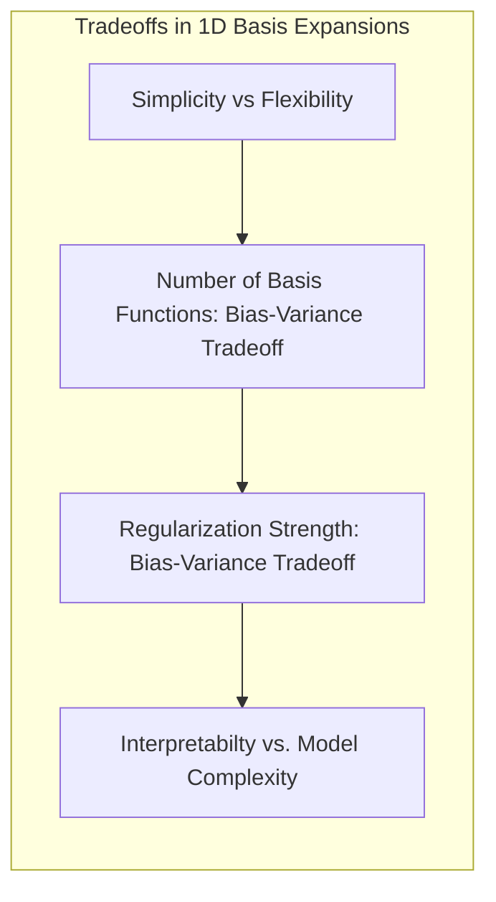

## Basis Expansions in a One-Dimensional Setting: A Detailed Examination



### Introdução

A técnica de *basis expansions*, como discutido anteriormente, é fundamental para estender a capacidade de modelos lineares, permitindo-lhes capturar relações não lineares nos dados. Este capítulo se aprofunda no uso de *basis expansions* em um cenário **unidimensional**, examinando como as features de entrada são transformadas por meio de funções de base e como os modelos lineares são aplicados nesse espaço de representação. Ao focar em uma dimensão, torna-se mais fácil visualizar os efeitos de diferentes funções de base e os *tradeoffs* envolvidos na construção de modelos mais flexíveis, sem a complexidade adicionada por múltiplas dimensões.

A exploração do cenário unidimensional oferece uma compreensão fundamental do funcionamento das *basis expansions*, servindo como base para a aplicação dessa técnica em problemas de maior dimensão.

###  Fundamentos da Expansão de Bases em Uma Dimensão

Em um cenário unidimensional, o vetor de entrada $X$ é composto por uma única variável, $X$, que pode ser uma feature quantitativa ou uma variável categórica codificada numericamente. O objetivo das *basis expansions* é transformar essa única feature em um novo conjunto de features $h_m(X)$ que capturam diferentes aspectos dos dados, permitindo que o modelo linear aprenda relações não lineares com a variável de resposta.

O modelo linear resultante após a expansão de bases é dado por:

$$
f(X) = \sum_{m=1}^{M} \beta_m h_m(X)
$$

onde $h_m(X)$ são as funções de base que transformam $X$, $M$ é o número de funções de base, e $\beta_m$ são os coeficientes do modelo. No contexto unidimensional, as funções de base $h_m(X)$ podem assumir diversas formas:

*   **Funções Polinomiais:** Podem incluir termos como $X, X^2, X^3, \ldots X^d$, onde $d$ é o grau do polinômio. Esses termos permitem modelar curvas e relações não lineares suaves.
*   **Funções Logarítmicas e Raiz Quadrada:** Podem incluir termos como $\log(X)$ ou $\sqrt{X}$, úteis para modelar dados com crescimento ou decaimento não linear.
*   **Funções Indicadoras (Regiões):** Dividem o espaço da feature $X$ em regiões e atribuem um valor constante para cada região. Por exemplo, $h_m(X) = I(L_m \leq X < U_m)$, onde $I$ é uma função indicadora que retorna 1 se $X$ está na região definida por $L_m$ e $U_m$, e 0 caso contrário.
*   **Splines:** Permitem que o modelo capture variações locais nos dados através de funções piecewise polinomiais. Splines são definidos por nós e podem ter diferentes graus de suavidade.
*   **Wavelets:** Permitem decompor o sinal em diferentes frequências e escalas, capturando tanto aspectos globais quanto detalhes locais do sinal.

A escolha das funções de base é crucial, pois determina o tipo de não linearidade que o modelo pode capturar e o grau de complexidade do modelo.



### Exemplos de Funções de Base Unidimensionais

1. **Modelos Polinomiais:** Utilizar polinômios como base é uma forma comum de introduzir não linearidade no modelo, e pode ser aplicada a uma única feature. Por exemplo, um modelo quadrático usa as funções de base $h_1(X) = X$ e $h_2(X) = X^2$, e é definido como:

$$f(X) = \beta_0 + \beta_1 X + \beta_2 X^2 $$
   Modelos polinomiais de maior grau podem ser utilizados para aproximar funções mais complexas, mas também aumentam a complexidade e o risco de *overfitting*.

> 💡 **Exemplo Numérico:**
> Vamos considerar um conjunto de dados com uma única variável de entrada $X$ e uma variável de resposta $Y$. Suponha que temos os seguintes dados:
>
> | X    | Y    |
> | ---- | ---- |
> | 1    | 2.5  |
> | 2    | 5.8  |
> | 3    | 10.2 |
> | 4    | 16.1 |
> | 5    | 24.0 |
>
> Para modelar esses dados com um modelo quadrático, usaremos as funções de base $h_1(X) = X$ e $h_2(X) = X^2$. A matriz de design $H$ (após adicionar um intercepto) e o vetor de resposta $Y$ serão:
>
> $$
> H = \begin{bmatrix}
> 1 & 1 & 1 \\
> 1 & 2 & 4 \\
> 1 & 3 & 9 \\
> 1 & 4 & 16 \\
> 1 & 5 & 25
> \end{bmatrix}, \quad
> Y = \begin{bmatrix}
> 2.5 \\ 5.8 \\ 10.2 \\ 16.1 \\ 24.0
> \end{bmatrix}
> $$
>
> Usando o método dos mínimos quadrados, podemos estimar os coeficientes $\beta = (H^T H)^{-1} H^T Y$:
>
> ```python
> import numpy as np
>
> X = np.array([1, 2, 3, 4, 5])
> Y = np.array([2.5, 5.8, 10.2, 16.1, 24.0])
>
> # Construindo a matriz de design H
> H = np.column_stack((np.ones(len(X)), X, X**2))
>
> # Calculando os coeficientes beta usando a fórmula dos mínimos quadrados
> beta = np.linalg.inv(H.T @ H) @ H.T @ Y
>
> print("Coeficientes Beta:", beta)
> ```
>
> Isso nos dará os coeficientes $\beta_0$, $\beta_1$ e $\beta_2$. Por exemplo, podemos obter $\beta \approx [0.15, 0.05, 0.96]$, que corresponde aproximadamente ao modelo $f(X) = 0.15 + 0.05X + 0.96X^2$. O modelo captura a relação não linear entre X e Y.



2.  **Funções Logarítmicas e de Raiz Quadrada:** Transformações não lineares como $\log(X)$ e $\sqrt{X}$ podem ser usadas quando há uma relação não linear particular comumente encontrada em dados do mundo real. Essas transformações podem ajudar a linearizar a relação entre a variável de resposta e a feature de entrada, permitindo que o modelo capture relações não lineares. Por exemplo, em um modelo com $h_1(X) = \log(X)$, a função é definida por:
   $$f(X) = \beta_0 + \beta_1 \log(X)$$

> 💡 **Exemplo Numérico:**
> Suponha que temos os seguintes dados, onde a relação entre $X$ e $Y$ parece ser logarítmica:
>
> | X    | Y    |
> | ---- | ---- |
> | 1    | 1.0  |
> | 2    | 1.7  |
> | 3    | 2.1  |
> | 4    | 2.4  |
> | 5    | 2.6  |
>
> Para modelar esses dados, usaremos a função de base $h_1(X) = \log(X)$.  A matriz de design $H$ (após adicionar um intercepto) e o vetor de resposta $Y$ serão:
>
> $$
> H = \begin{bmatrix}
> 1 & \log(1) \\
> 1 & \log(2) \\
> 1 & \log(3) \\
> 1 & \log(4) \\
> 1 & \log(5)
> \end{bmatrix}, \quad
> Y = \begin{bmatrix}
> 1.0 \\ 1.7 \\ 2.1 \\ 2.4 \\ 2.6
> \end{bmatrix}
> $$
>
> Calculamos os coeficientes $\beta$ como antes.
>
> ```python
> import numpy as np
>
> X = np.array([1, 2, 3, 4, 5])
> Y = np.array([1.0, 1.7, 2.1, 2.4, 2.6])
>
> # Construindo a matriz de design H com log(X)
> H = np.column_stack((np.ones(len(X)), np.log(X)))
>
> # Calculando os coeficientes beta
> beta = np.linalg.inv(H.T @ H) @ H.T @ Y
>
> print("Coeficientes Beta:", beta)
> ```
>
> O resultado, por exemplo, poderia ser $\beta \approx [0.9, 0.97]$, então o modelo seria $f(X) = 0.9 + 0.97 \log(X)$.



3.  **Funções Indicadoras:** Funções indicadoras de região permitem dividir a feature $X$ em intervalos, onde cada intervalo é representado por uma constante. Isso permite modelar variações bruscas na relação entre $X$ e a variável resposta. Por exemplo, com $h_1(X) = I(X < \xi_1)$, $h_2(X) = I(\xi_1 \leq X < \xi_2)$ e $h_3(X) = I(X \geq \xi_2)$, o modelo se torna:
$$ f(X) = \beta_1 I(X < \xi_1) + \beta_2 I(\xi_1 \leq X < \xi_2) + \beta_3 I(X \geq \xi_2) $$
   onde $\xi_1$ e $\xi_2$ são os pontos de corte que definem as regiões.

> 💡 **Exemplo Numérico:**
> Vamos considerar um conjunto de dados onde a variável de resposta $Y$ muda em diferentes intervalos de $X$. Suponha que temos:
>
> | X    | Y    |
> | ---- | ---- |
> | 1    | 2    |
> | 2    | 2    |
> | 3    | 5    |
> | 4    | 5    |
> | 5    | 8    |
> | 6    | 8    |
>
> Usaremos funções indicadoras com $\xi_1 = 3$ e $\xi_2 = 5$. As funções de base são:
>  $h_1(X) = I(X < 3)$, $h_2(X) = I(3 \leq X < 5)$, e $h_3(X) = I(X \geq 5)$. A matriz de design $H$ e o vetor de resposta $Y$ serão:
>
> $$
> H = \begin{bmatrix}
> 1 & 0 & 0 \\
> 1 & 0 & 0 \\
> 0 & 1 & 0 \\
> 0 & 1 & 0 \\
> 0 & 0 & 1 \\
> 0 & 0 & 1
> \end{bmatrix}, \quad
> Y = \begin{bmatrix}
> 2 \\ 2 \\ 5 \\ 5 \\ 8 \\ 8
> \end{bmatrix}
> $$
>
> ```python
> import numpy as np
>
> X = np.array([1, 2, 3, 4, 5, 6])
> Y = np.array([2, 2, 5, 5, 8, 8])
>
> # Definindo os pontos de corte
> xi1 = 3
> xi2 = 5
>
> # Criando as funções indicadoras
> h1 = (X < xi1).astype(int)
> h2 = ((X >= xi1) & (X < xi2)).astype(int)
> h3 = (X >= xi2).astype(int)
>
> # Construindo a matriz de design H
> H = np.column_stack((h1, h2, h3))
>
> # Calculando os coeficientes beta
> beta = np.linalg.inv(H.T @ H) @ H.T @ Y
>
> print("Coeficientes Beta:", beta)
> ```
>
> Os coeficientes $\beta$ nos darão os valores médios de $Y$ em cada região. Por exemplo, $\beta \approx [2, 5, 8]$ corresponde ao modelo $f(X) = 2I(X < 3) + 5I(3 \leq X < 5) + 8I(X \geq 5)$.



4. **Splines:** Splines são funções piecewise polinomiais que são suaves em pontos de corte pré-definidos (nós). Elas são usadas para modelos onde há a necessidade de capturar relações não lineares locais, ao invés de relações polinomiais globais [^5.2]. Por exemplo, um spline cúbico com nós em $\xi_1$ e $\xi_2$ pode ser representado por funções como $h_1(X) = 1, h_2(X) = X, h_3(X) = (X-\xi_1)^3_+ , h_4(X) = (X - \xi_2)^3_+$.

   Este conjunto de funções cria um modelo que se torna:

  $$ f(X) = \beta_0 + \beta_1 X + \beta_2 (X-\xi_1)^3_+ + \beta_3 (X - \xi_2)^3_+ $$
onde $(X - \xi_i)^3_+$ é a função $(X - \xi_i)^3$ se $X > \xi_i$ ou 0 caso contrário. Splines, portanto, permitem flexibilidade local na modelagem.

> 💡 **Exemplo Numérico:**
> Vamos considerar um conjunto de dados e usar splines cúbicos com nós em $\xi_1 = 3$ e $\xi_2 = 6$.
>
> | X    | Y    |
> | ---- | ---- |
> | 1    | 2.1  |
> | 2    | 3.5  |
> | 3    | 5.2  |
> | 4    | 7.1  |
> | 5    | 8.8  |
> | 6    | 10.2 |
> | 7    | 11.1 |
> | 8    | 11.9 |
>
> As funções de base serão $h_1(X) = 1$, $h_2(X) = X$, $h_3(X) = (X-3)^3_+$ e $h_4(X) = (X-6)^3_+$.
>
> ```python
> import numpy as np
>
> X = np.array([1, 2, 3, 4, 5, 6, 7, 8])
> Y = np.array([2.1, 3.5, 5.2, 7.1, 8.8, 10.2, 11.1, 11.9])
>
> # Definindo os nós
> xi1 = 3
> xi2 = 6
>
> # Criando as funções de base spline
> def cubic_spline_basis(x, knot):
>     return np.maximum(x - knot, 0)**3
>
> h1 = np.ones(len(X))
> h2 = X
> h3 = cubic_spline_basis(X, xi1)
> h4 = cubic_spline_basis(X, xi2)
>
> # Construindo a matriz de design H
> H = np.column_stack((h1, h2, h3, h4))
>
> # Calculando os coeficientes beta
> beta = np.linalg.inv(H.T @ H) @ H.T @ Y
>
> print("Coeficientes Beta:", beta)
> ```
>
> O resultado, por exemplo, poderia ser $\beta \approx [1.2, 1.1, 0.08, 0.03]$, então o modelo seria $f(X) = 1.2 + 1.1X + 0.08(X-3)^3_+ + 0.03(X-6)^3_+$.



5. **Wavelets:** São transformações que permitem decompor a feature $X$ em diferentes frequências e escalas, usando funções de base que são definidas em diferentes escalas e posições. Em uma dimensão, elas podem ser vistas como uma coleção de funções que capturam detalhes em diferentes níveis de resolução.

    A escolha das funções de base depende das características do problema, do tipo de não linearidade esperada nos dados e da complexidade desejada para o modelo.

### Controle da Complexidade e Regularização em 1D

Em um cenário unidimensional, é ainda mais evidente a necessidade de controlar a complexidade do modelo para evitar *overfitting*. Isso pode ser feito usando técnicas como:

1.  **Restrição do Número de Funções de Base:** Limitar o número de funções de base $h_m(X)$ utilizadas no modelo. Isso pode ser feito através da seleção de um subconjunto de funções de base mais relevantes, ou da restrição do grau de polinômios ou do número de nós em splines.

2.  **Regularização:** Adicionar um termo de penalidade à função de custo, o que evita o *overfitting* através da redução do tamanho dos coeficientes do modelo. As penalidades $L_1$ e $L_2$, discutidas em capítulos anteriores, podem ser aplicadas a modelos unidimensionais. A penalidade $L_1$ induz esparsidade, selecionando as funções de base mais relevantes, enquanto a penalidade $L_2$ reduz a magnitude dos coeficientes e, portanto, controla a complexidade.

> 💡 **Exemplo Numérico:**
> Vamos usar o exemplo do modelo polinomial quadrático anterior com regularização L2 (Ridge).  Vamos adicionar a penalidade L2 ao nosso modelo com $\lambda = 0.1$.
>
> ```python
> import numpy as np
> from sklearn.linear_model import Ridge
>
> X = np.array([1, 2, 3, 4, 5]).reshape(-1, 1)
> Y = np.array([2.5, 5.8, 10.2, 16.1, 24.0])
>
> # Construindo a matriz de design H para o modelo quadrático
> H = np.column_stack((X, X**2))
>
> # Criando um modelo Ridge com lambda = 0.1
> ridge_model = Ridge(alpha=0.1)
> ridge_model.fit(H, Y)
>
> # Obtendo os coeficientes beta
> beta_ridge = np.insert(ridge_model.coef_, 0, ridge_model.intercept_)
>
> print("Coeficientes Beta Ridge:", beta_ridge)
>
> # Comparando com o modelo sem regularização
> H_no_intercept = np.column_stack((np.ones(len(X)), X, X**2))
> beta_no_reg = np.linalg.inv(H_no_intercept.T @ H_no_intercept) @ H_no_intercept.T @ Y
>
> print("Coeficientes Beta Sem Regularização:", beta_no_reg)
> ```
>
> Observamos que os coeficientes no modelo Ridge são menores em magnitude em comparação com o modelo sem regularização, reduzindo o risco de overfitting.


3.  **Seleção de Variáveis:** Métodos como *stepwise regression* ou métodos baseados em validação cruzada, podem ser usados para selecionar as funções de base mais importantes, removendo aquelas que não contribuem significativamente para o desempenho do modelo.

A combinação dessas técnicas permite controlar a complexidade do modelo, obtendo um equilíbrio entre viés e variância que melhora a generalização para dados não observados. A validação cruzada desempenha um papel essencial na escolha da complexidade do modelo, pois permite avaliar seu desempenho em dados que não foram usados no treinamento, garantindo um modelo com boa performance de generalização [^5.5.1].

### Tradeoffs em um Cenário Unidimensional

Em um cenário unidimensional, os *tradeoffs* se tornam mais claros:

*   **Simplicidade vs. Flexibilidade:** Usar um modelo linear simples (sem *basis expansions*) pode resultar em um modelo com alto viés, incapaz de capturar relações não lineares. A introdução de *basis expansions* aumenta a flexibilidade do modelo, mas também aumenta a complexidade e o risco de *overfitting*.
*   **Número de Funções de Base:** Usar um número pequeno de funções de base ou funções de base muito simples pode levar a um modelo com alto viés, incapaz de capturar as variações nos dados. Usar muitas funções ou funções muito complexas pode levar a um modelo com alta variância, muito sensível a variações nos dados de treino. A escolha do número de funções de base deve equilibrar viés e variância.
*   **Regularização:** A intensidade da regularização controla o compromisso entre viés e variância. Valores muito altos de $\lambda$ podem levar a um modelo com alto viés, enquanto valores muito baixos podem levar a um modelo com alta variância. O valor adequado de $\lambda$ depende dos dados e do objetivo da modelagem.
*   **Interpretabilidade:** Modelos lineares com transformações simples são mais fáceis de interpretar do que modelos com funções de base complexas (como splines ou wavelets). O *tradeoff* entre interpretabilidade e flexibilidade também deve ser considerado.

Ao entender esses *tradeoffs*, é possível construir modelos unidimensionais mais eficazes, que equilibram a capacidade de capturar a complexidade dos dados com a necessidade de evitar *overfitting* e manter a interpretabilidade.



### Conclusão

A exploração do cenário unidimensional oferece uma base sólida para entender como as *basis expansions* são aplicadas na prática. A escolha das funções de base, o controle da complexidade através da regularização e seleção, e a avaliação do *tradeoff* viés-variância são essenciais para a construção de modelos unidimensionais eficazes. As ideias e os conceitos apresentados nesse capítulo são facilmente estendidos para dados com maior dimensionalidade.

### Footnotes

[^5.2]: "Some simple and widely used examples of the hm are the following: $h_m(X) = X^m$, $m = 1, \ldots, p$ recovers the original linear model. $h_m(X) = X_j^2$ or $h_m(X) = X_jX_k$ allows us to augment the inputs with polynomial terms to achieve higher-order Taylor expansions." *(Trecho de <Basis Expansions and Regularization>)*
[^5.5.1]: "Since $df_x = \text{trace}(S_x)$ is monotone in $\lambda$ for smoothing splines, we can invert the relationship and specify $\lambda$ by fixing $df$. In practice this can be achieved by simple numerical methods. So, for example, in R one can use smooth.spline(x,y,df=6) to specify the amount of smoothing." *(Trecho de <Basis Expansions and Regularization>)*
