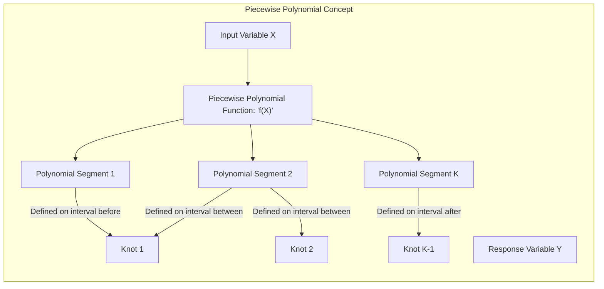
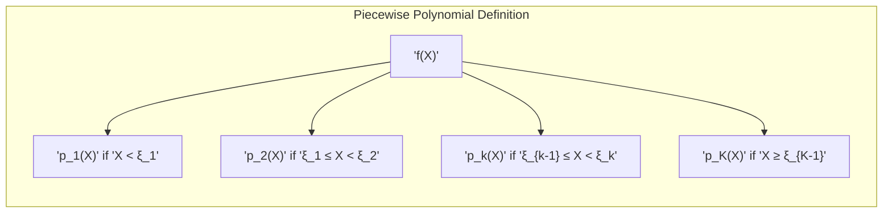
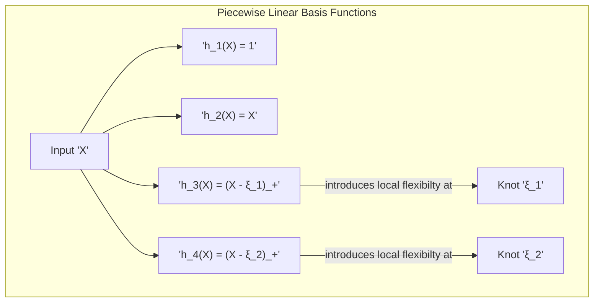
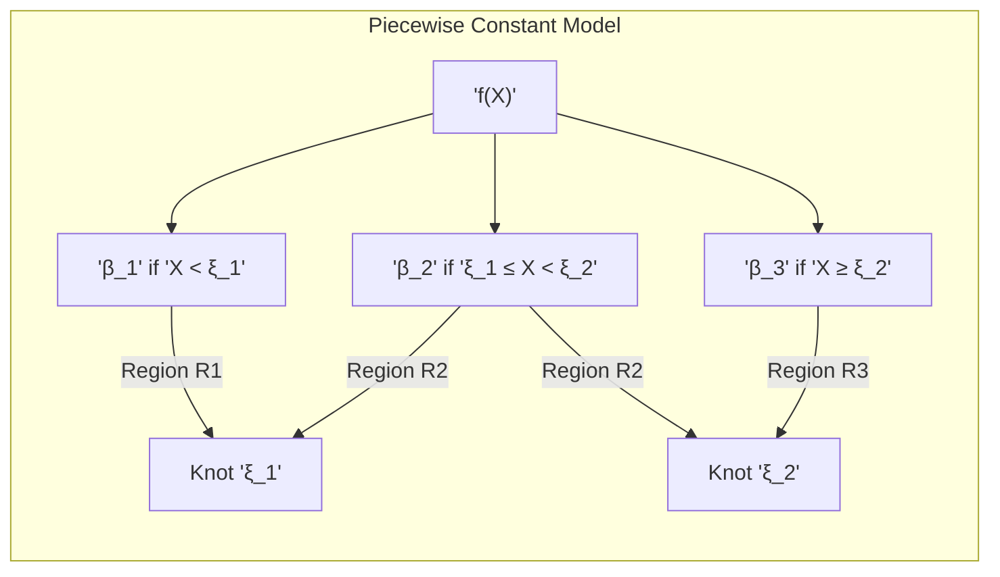
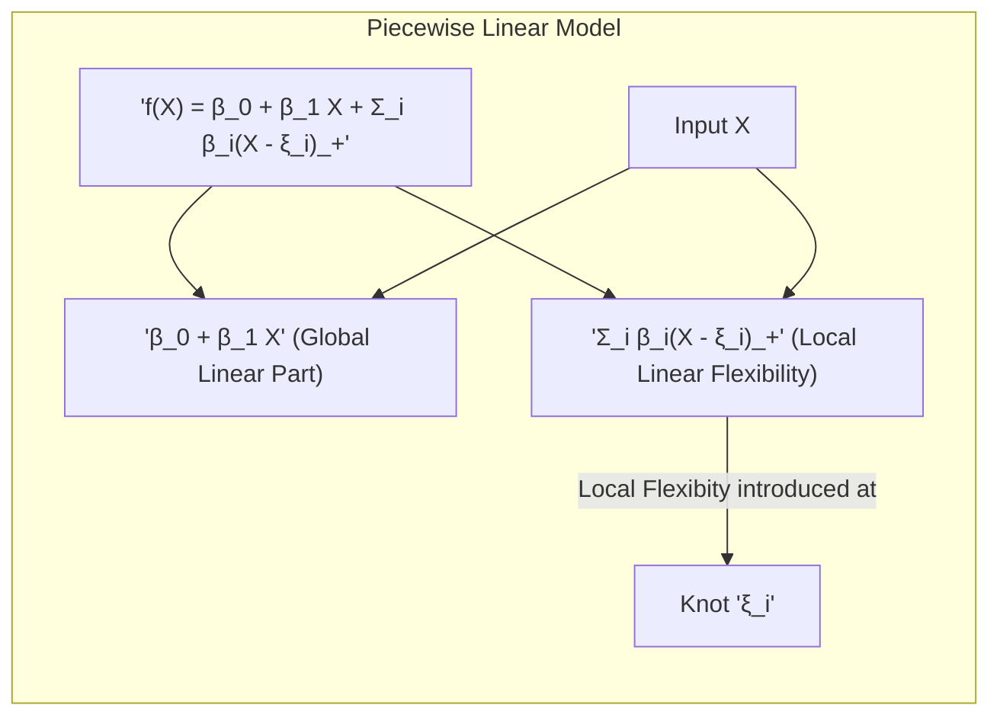
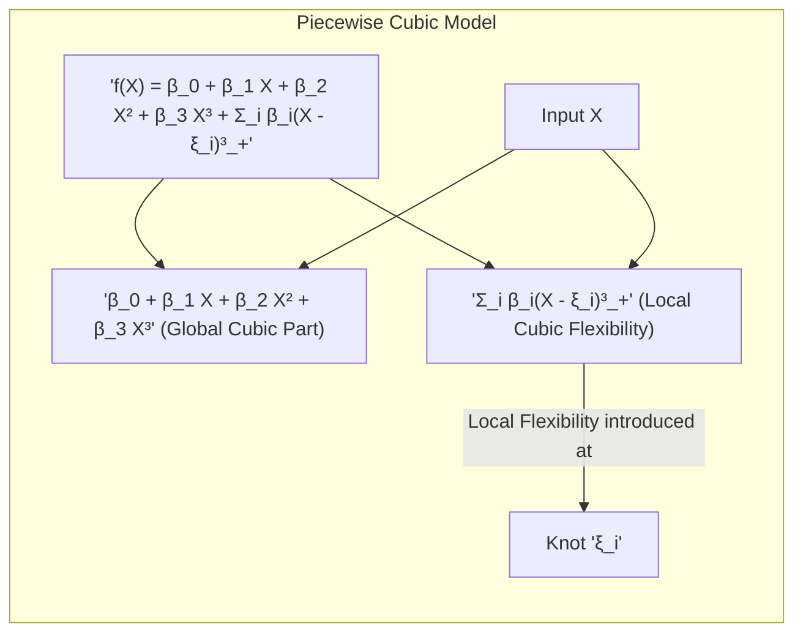
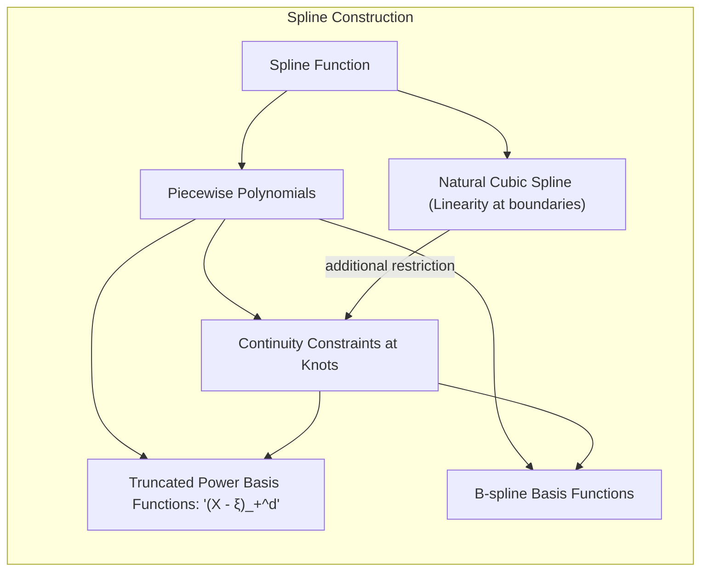
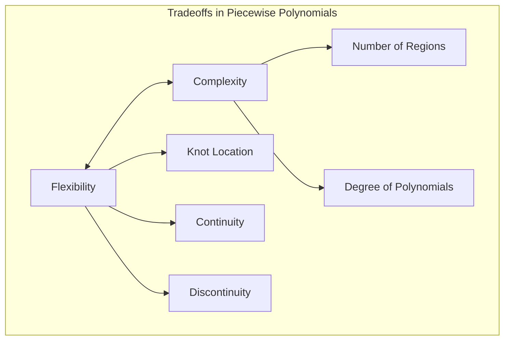

## Piecewise Polynomials: Local Adaptability in Basis Expansions

### Introdução

As *basis expansions*, como explorado anteriormente, oferecem uma maneira flexível de estender a capacidade de modelos lineares ao transformar as features originais por meio de funções de base. Dentre as diversas opções de funções de base, os **piecewise polynomials** destacam-se pela sua capacidade de modelar relações não lineares complexas, mantendo a flexibilidade local. Piecewise polynomials são funções formadas por segmentos polinomiais de baixo grau (como linhas, parábolas ou cúbicas) que são definidos em intervalos separados, juntando-se para formar uma função contínua ou, em alguns casos, descontínua.

Este capítulo se concentra em piecewise polynomials, examinando como eles são construídos, quais são suas propriedades e como eles podem ser usados para construir modelos com alta flexibilidade e adaptabilidade local, conceitos importantes no contexto de *basis expansions* [^5.2].

### Definição e Construção de Piecewise Polynomials

Um **piecewise polynomial** é uma função composta por segmentos polinomiais que são definidos em intervalos contíguos e que são unidos em pontos específicos denominados **nós** (knots). Cada segmento polinomial é geralmente de baixo grau (como linear, quadrático ou cúbico) [^5.2]. A função resultante é contínua se os segmentos se juntam sem descontinuidade, mas também podem ser construídas funções que permitem descontinuidades nos nós.

Formalmente, um piecewise polynomial $f(X)$ pode ser definido como:

$$
f(X) = \begin{cases}
    p_1(X), & \text{se } X < \xi_1 \\
    p_2(X), & \text{se } \xi_1 \leq X < \xi_2 \\
    \vdots \\
    p_k(X), & \text{se } \xi_{k-1} \leq X < \xi_k \\
    \vdots \\
    p_K(X), & \text{se } X \geq \xi_{K-1}
\end{cases}
$$

onde $p_i(X)$ são polinômios de grau menor ou igual a um grau máximo pré-definido, e $\xi_1, \xi_2, \ldots, \xi_{K-1}$ são os nós. A escolha do número e da localização dos nós e do grau dos polinômios influencia a forma e a flexibilidade do piecewise polynomial resultante.

As funções de base que definem o piecewise polynomial podem ser construídas de diversas formas, utilizando funções indicadoras que definem cada intervalo ou funções *truncated power* que garantem continuidade nos nós. Por exemplo, as seguintes funções representam uma base piecewise linear:

$$ h_1(X) = 1, h_2(X) = X, h_3(X) = (X - \xi_1)_+, h_4(X) = (X - \xi_2)_+$$

onde $(X - \xi)_+$ representa a parte positiva da expressão, ou seja, é igual a $(X - \xi)$ quando $X \ge \xi$ e 0 caso contrário. As funções $h_3(X)$ e $h_4(X)$ são responsáveis por adicionar flexibilidade local nos nós $\xi_1$ e $\xi_2$, respectivamente.

> 💡 **Exemplo Numérico:**
>
> Vamos considerar um exemplo com dois nós, $\xi_1 = 3$ e $\xi_2 = 7$. As funções de base seriam:
>
> - $h_1(X) = 1$
> - $h_2(X) = X$
> - $h_3(X) = (X - 3)_+$
> - $h_4(X) = (X - 7)_+$
>
> Se tivermos um valor de $X = 5$, as funções de base resultariam em:
>
> - $h_1(5) = 1$
> - $h_2(5) = 5$
> - $h_3(5) = (5 - 3)_+ = 2$
> - $h_4(5) = (5 - 7)_+ = 0$
>
> Agora, se tivermos um valor de $X = 8$, as funções de base resultariam em:
>
> - $h_1(8) = 1$
> - $h_2(8) = 8$
> - $h_3(8) = (8 - 3)_+ = 5$
> - $h_4(8) = (8 - 7)_+ = 1$
>
> Podemos ver como $h_3(X)$ começa a ter um valor não nulo após o nó $\xi_1 = 3$ e $h_4(X)$ após o nó $\xi_2 = 7$. Isso demonstra como as funções de base *truncated power* adicionam flexibilidade local ao modelo.

Ao combinar esses tipos de funções de base, é possível construir uma variedade de piecewise polynomials com diferentes propriedades, como funções contínuas, contínuas com primeira derivada, segunda derivada, etc.

### Propriedades dos Piecewise Polynomials

Piecewise polynomials possuem propriedades que os tornam adequados para diversas aplicações de modelagem:

1.  **Flexibilidade Local:** Piecewise polynomials podem capturar variações locais nos dados. Ao ajustar os polinômios em cada região separadamente, o modelo pode se adaptar às diferentes características de cada região. Essa flexibilidade local é uma vantagem sobre modelos lineares globais, que têm um ajuste constante em todo o espaço das features.
2.  **Controle da Complexidade:** O controle da complexidade de um modelo *piecewise polynomial* pode ser atingido ao escolher o grau dos polinômios e a quantidade de nós. Polinômios de baixo grau e um número reduzido de nós levam a modelos mais simples, enquanto polinômios de alto grau e muitos nós levam a modelos mais complexos. A escolha adequada da complexidade permite balancear o *tradeoff* viés-variância.
3.  **Fácil Implementação e Interpretação:** A construção de piecewise polynomials é relativamente simples e a interpretação dos resultados é facilitada pela natureza local dos polinômios. O efeito de cada segmento polinomial pode ser interpretado separadamente.
4.  **Continuidade:** As restrições nos nós permitem controlar a continuidade da função resultante. É possível construir funções contínuas, contínuas com primeira derivada ou com derivadas de ordem superior, o que pode ser útil para modelar dados com diferentes graus de suavidade.
5.  **Adaptabilidade:** A localização dos nós pode ser adaptada aos dados, permitindo que o modelo se concentre nas regiões onde há maior variação na relação entre a feature e a variável de resposta.

A combinação dessas propriedades faz de piecewise polynomials uma ferramenta poderosa e versátil para modelagem não linear em diversas aplicações.

### Tipos de Piecewise Polynomials

1.  **Piecewise Constantes:** São o tipo mais simples de piecewise polynomial, onde cada segmento é uma constante. A função é definida por funções indicadoras, e o modelo se torna uma função degrau, como mostrado anteriormente. Este tipo de modelo pode capturar descontinuidades nos dados, sendo apropriado para problemas onde a relação entre as features e a resposta muda abruptamente.
$$f(X) = \sum_i \beta_i I(X \in R_i)$$
   onde $R_i$ são as regiões definidas por nós.

   > 💡 **Exemplo Numérico:**
   >
   > Suponha que temos dois nós: $\xi_1 = 3$ e $\xi_2 = 7$, dividindo os dados em três regiões: $R_1: X < 3$, $R_2: 3 \leq X < 7$, e $R_3: X \geq 7$. O modelo piecewise constante seria:
   >
   > $$
   > f(X) = \begin{cases}
   >   \beta_1, & \text{se } X < 3 \\
   >   \beta_2, & \text{se } 3 \leq X < 7 \\
   >   \beta_3, & \text{se } X \geq 7
   > \end{cases}
   > $$
   >
   > Se ajustarmos os parâmetros para $\beta_1 = 2$, $\beta_2 = 5$ e $\beta_3 = 8$, e se tivermos um valor de $X = 4$, a função retornaria $f(4) = \beta_2 = 5$. Para $X = 1$, teríamos $f(1) = \beta_1 = 2$ e para $X = 9$, $f(9) = \beta_3 = 8$. Este exemplo ilustra como a função piecewise constante retorna um valor diferente para cada região.

2. **Piecewise Lineares:** São formados por segmentos lineares, unidas por nós. A função é contínua, e a inclinação de cada segmento pode ser diferente.  Modelos piecewise lineares podem ser usados para aproximar funções não lineares suaves e relações que são localmente lineares.
$$ f(X) = \beta_0 + \beta_1 X + \sum_i \beta_i (X - \xi_i)_+ $$
   onde $(X - \xi_i)_+$ representam as partes positivas das distâncias aos nós.

   > 💡 **Exemplo Numérico:**
   >
   > Considere um modelo piecewise linear com um nó em $\xi_1 = 5$. A função seria:
   >
   > $$f(X) = \beta_0 + \beta_1 X + \beta_2 (X - 5)_+$$
   >
   > Suponha que, após o ajuste do modelo, os coeficientes sejam: $\beta_0 = 1$, $\beta_1 = 0.5$, e $\beta_2 = 1.2$.
   >
   > Para $X = 3$, temos:
   >
   > $$f(3) = 1 + 0.5 \times 3 + 1.2 \times (3-5)_+ = 1 + 1.5 + 1.2 \times 0 = 2.5$$
   >
   > Para $X = 7$, temos:
   >
   > $$f(7) = 1 + 0.5 \times 7 + 1.2 \times (7-5)_+ = 1 + 3.5 + 1.2 \times 2 = 1 + 3.5 + 2.4 = 6.9$$
   >
   > Este exemplo demonstra como a inclinação da função muda após o nó $\xi_1 = 5$, com a contribuição de $\beta_2(X - 5)_+$.

3.  **Piecewise Cúbicos:** São formados por segmentos cúbicos, com as derivadas até a segunda ordem contínuas nos nós. Esses modelos oferecem alta flexibilidade e suavidade, sendo adequados para dados com alta curvatura. Este tipo de modelo é um tipo de spline mais comummente utilizado, e um dos mais utilizados é o spline cúbico natural, que adiciona a restrição da segunda derivada ser zero nos limites do domínio da variável de entrada.
$$ f(X) = \beta_0 + \beta_1 X + \beta_2 X^2 + \beta_3 X^3 + \sum_i \beta_i (X - \xi_i)^3_+$$

    > 💡 **Exemplo Numérico:**
    >
    > Vamos considerar um modelo piecewise cúbico com um nó em $\xi_1 = 4$. A função seria:
    >
    > $$f(X) = \beta_0 + \beta_1 X + \beta_2 X^2 + \beta_3 X^3 + \beta_4 (X - 4)^3_+$$
    >
    > Após ajustar o modelo, suponha que os coeficientes sejam: $\beta_0 = 2$, $\beta_1 = 1$, $\beta_2 = 0.5$, $\beta_3 = 0.1$ e $\beta_4 = 0.2$.
    >
    > Para $X = 2$:
    >
    > $$f(2) = 2 + 1 \times 2 + 0.5 \times 2^2 + 0.1 \times 2^3 + 0.2 \times (2-4)^3_+ = 2 + 2 + 2 + 0.8 + 0 = 6.8$$
    >
    > Para $X = 6$:
    >
    > $$f(6) = 2 + 1 \times 6 + 0.5 \times 6^2 + 0.1 \times 6^3 + 0.2 \times (6-4)^3_+ = 2 + 6 + 18 + 21.6 + 0.2 \times 8 = 2 + 6 + 18 + 21.6 + 1.6 = 49.2$$
    >
    > Este exemplo mostra como a função piecewise cúbica permite uma modelagem mais complexa e flexível com a contribuição dos termos cúbicos e do termo $(X - 4)^3_+$ após o nó $\xi_1 = 4$.

A escolha do tipo de piecewise polynomial depende da complexidade e suavidade das relações entre as features e a variável resposta. Piecewise constantes são adequadas para modelar dados com descontinuidades, piecewise lineares são adequadas para modelar relações que são localmente lineares, e piecewise cúbicos são adequadas para modelar dados com curvatura.

### Splines: Piecewise Polynomials com Continuidade

**Splines** são uma classe especial de piecewise polynomials que são construídos para garantir a continuidade em certos níveis de derivada nos nós [^5.2]. Os splines mais comuns são os *cubic splines*, onde os segmentos polinomiais são cúbicos e a função resultante é contínua, possui primeira e segunda derivadas contínuas nos nós.

A construção de splines envolve o uso de funções de base específicas que garantem a continuidade nas derivadas. Por exemplo, os splines cúbicos podem ser construídos usando funções de *truncated power* ou funções B-spline. Os *truncated power functions* são definidos como $(X - \xi)_+^d$, onde $\xi$ é o nó e $d$ é o grau do polinômio. A combinação de vários desses termos permite a construção de splines cúbicos com a continuidade desejada.

No entanto, funções de *truncated power* podem levar a problemas de instabilidade numérica, o que motiva a utilização de funções B-splines, que são funções de base localmente não nulas, e que se mostram mais estáveis numericamente e que também formam bases para construir splines [^5.2].

Os *natural cubic splines* são splines cúbicos que, além das restrições de continuidade nos nós, impõem restrições de linearidade nos limites do domínio da variável de entrada. Essa restrição reduz o número de graus de liberdade do modelo, tornando-o mais adequado em situações com poucos dados [^5.2.1].

Splines são amplamente utilizados em diversas aplicações de modelagem, como análise de dados de séries temporais, análise de imagens e modelagem de curvas de crescimento, onde é importante capturar variações locais e manter um certo nível de suavidade na função resultante.

### Tradeoffs nos Piecewise Polynomials

A utilização de piecewise polynomials envolve alguns *tradeoffs*:

1.  **Flexibilidade vs. Complexidade:** Piecewise polynomials oferecem grande flexibilidade, mas a escolha do grau dos polinômios e do número de nós controla a complexidade do modelo. Um modelo com muitas regiões e polinômios de alto grau pode levar a *overfitting*, enquanto um modelo com poucas regiões ou polinômios de baixo grau pode subajustar os dados. O número ideal de regiões e o grau dos polinômios devem ser escolhidos com base em uma avaliação do desempenho do modelo e usando validação cruzada, como abordado em [^5.5.2].
2.  **Localização dos Nós:** A localização dos nós influencia diretamente a capacidade do modelo de capturar variações locais nos dados. Nós localizados em áreas onde há maior variação na relação entre as features e a variável resposta podem melhorar a capacidade do modelo de se ajustar aos dados. A localização ideal dos nós pode ser obtida através de métodos de seleção de nós ou com o uso de nós uniformemente espaçados ao longo do domínio da variável de entrada.
3.  **Continuidade vs. Descontinuidade:** A escolha entre funções contínuas ou descontínuas depende do tipo de relações a serem modeladas. Funções contínuas são adequadas para modelar relações suaves, enquanto funções descontínuas são adequadas para modelar relações com saltos ou mudanças abruptas. É importante considerar o efeito da continuidade ou descontinuidade nos nós, já que em alguns contextos descontinuidades podem ser apropriadas para capturar efeitos localizados e em outros contextos a suavidade na modelagem é essencial.

### Conclusão

Os piecewise polynomials oferecem uma poderosa abordagem para modelar relações não lineares em dados unidimensionais, permitindo a construção de modelos que equilibram flexibilidade, interpretabilidade e adaptabilidade local. A capacidade de controlar a complexidade através da escolha do grau dos polinômios, do número de nós e das restrições de continuidade permite que o modelo se adapte a diferentes tipos de dados e de aplicações. A compreensão dos *tradeoffs* envolvidos é fundamental para a aplicação eficaz dessas funções de base no contexto das *basis expansions*.

### Footnotes

[^5.2]: "Some simple and widely used examples of the hm are the following: $h_m(X) = X^m$, $m = 1, \ldots, p$ recovers the original linear model. $h_m(X) = X_j^2$ or $h_m(X) = X_jX_k$ allows us to augment the inputs with polynomial terms to achieve higher-order Taylor expansions." *(Trecho de <Basis Expansions and Regularization>)*
[^5.2.1]: "A natural cubic spline adds additional constraints, namely that the function is linear beyond the boundary knots." *(Trecho de <Basis Expansions and Regularization>)*
[^5.5.2]: "The fitted splines for three different values of dfx are shown. The yellow shaded region in the figure represents the pointwise standard error of fx, that is, we have shaded the region between $f_x(x) \pm 2 \cdot se(f_x(x))$." *(Trecho de <Basis Expansions and Regularization>)*
