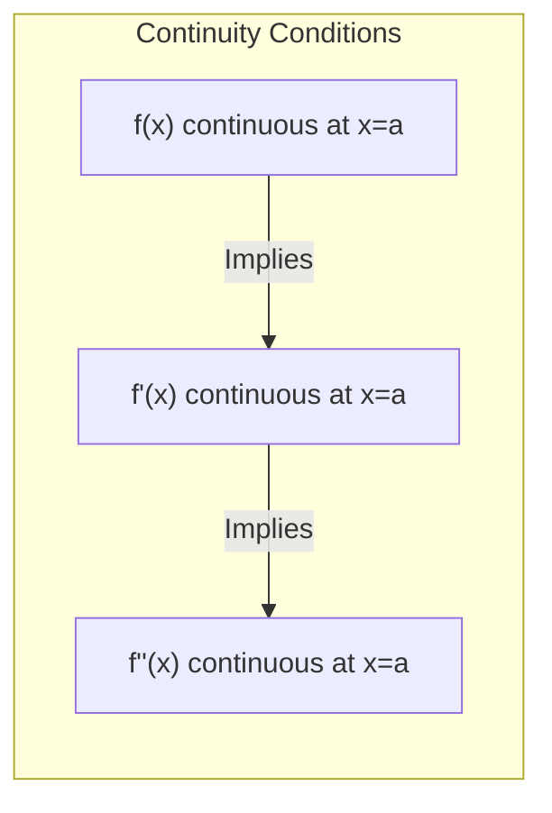
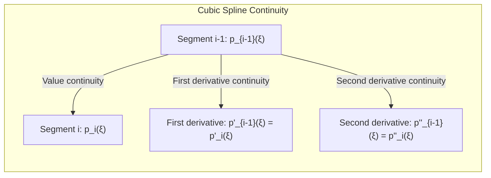
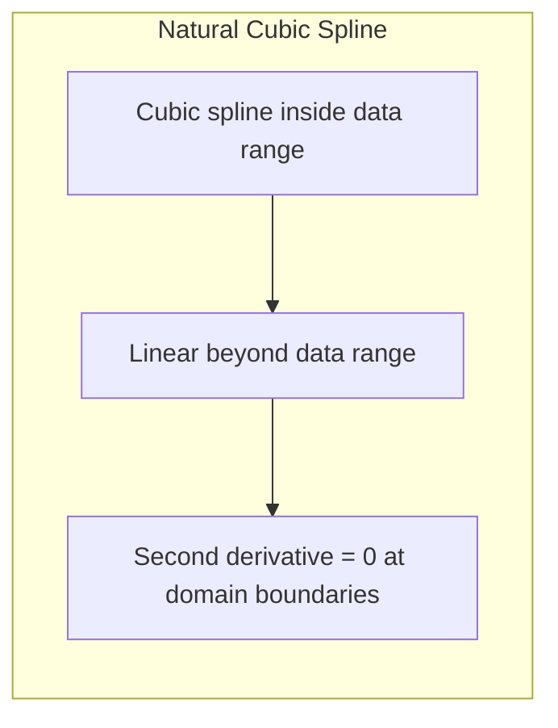
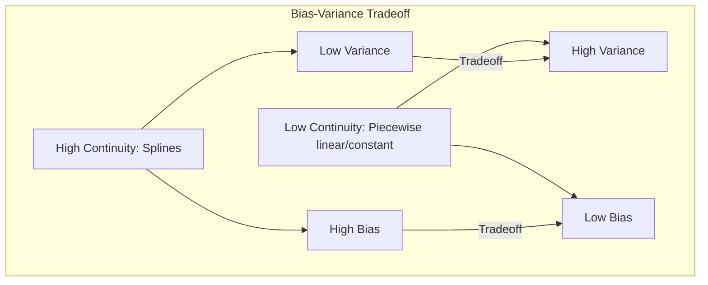

## Continuity Restrictions in Piecewise Polynomials: Ensuring Smoothness and Model Stability

```mermaid
graph LR
    subgraph "Piecewise Polynomial Continuity"
        direction TB
        A["Piecewise Constant: Discontinuous at nodes"]
        B["Piecewise Linear: Continuous at nodes, slope change"]
        C["Cubic Spline: Continuous, 1st and 2nd derivative continuous"]
        A -->| "Increasing smoothness" | B
        B -->| "Increasing smoothness" | C
    end
```

### Introdução

No contexto das *basis expansions*, as **restrições de continuidade** desempenham um papel crucial na construção de piecewise polynomials que são suaves e adaptáveis aos dados. As restrições de continuidade, impostas nos nós dos piecewise polynomials, controlam o comportamento da função resultante, garantindo que os segmentos polinomiais se juntem de forma suave e sem descontinuidades [^5.2]. Este capítulo explora as restrições de continuidade em piecewise polynomials, examinando como elas são definidas, seus efeitos sobre a forma da função e a importância dessas restrições para garantir a estabilidade e a qualidade dos modelos.

### Tipos de Continuidade em Piecewise Polynomials

A continuidade de uma função em um ponto descreve o comportamento da função nesse ponto. Formalmente, uma função $f(x)$ é contínua em um ponto $x = a$ se:

1.  $f(a)$ está definido (a função existe no ponto $a$).
2.  O limite de $f(x)$ quando $x$ se aproxima de $a$ existe ($\lim_{x \to a} f(x)$ existe).
3.  O limite de $f(x)$ quando $x$ se aproxima de $a$ é igual ao valor de $f(a)$ ($\lim_{x \to a} f(x) = f(a)$).

Em piecewise polynomials, a continuidade pode ser definida nos nós, que são os pontos onde diferentes segmentos polinomiais se unem. Existem diferentes tipos de restrições de continuidade, dependendo do nível de suavidade desejado para a função:

1.  **Descontinuidade:** Não há restrições sobre como os segmentos polinomiais se unem. A função pode apresentar descontinuidades nos nós, com diferentes valores nos limites laterais.
    *   Exemplo: Uma função piecewise constante.

    > 💡 **Exemplo Numérico:**
    > Considere uma função piecewise constante definida como:
    > $$
    > f(x) = \begin{cases}
    > 1 & \text{se } x < 2 \\
    > 3 & \text{se } x \geq 2
    > \end{cases}
    > $$
    >
    > No nó $x = 2$, a função tem um salto. O limite pela esquerda é 1, e o limite pela direita é 3. Portanto, a função é descontínua em $x=2$.

2. **Continuidade:** A função é contínua nos nós, ou seja, os segmentos polinomiais se unem sem apresentar saltos ou descontinuidades. A função possui o mesmo valor nos limites laterais do nó.
     *   Exemplo: Uma função piecewise linear contínua.

    > 💡 **Exemplo Numérico:**
    > Considere uma função piecewise linear definida como:
    > $$
    > f(x) = \begin{cases}
    > x & \text{se } x < 2 \\
    > 2x - 2 & \text{se } x \geq 2
    > \end{cases}
    > $$
    >
    > No nó $x = 2$, ambos os segmentos têm o valor 2, pois $f(2) = 2$ para o primeiro segmento e $f(2) = 2*2 - 2 = 2$ para o segundo. Assim, a função é contínua em $x = 2$, embora a inclinação mude.

3.  **Continuidade da Primeira Derivada:** Além de ser contínua, a primeira derivada da função também é contínua nos nós. Isso significa que a inclinação dos segmentos polinomiais se une suavemente nos nós, sem variações abruptas.
    *   Exemplo: Um spline cúbico.

4.  **Continuidade da Segunda Derivada:** Além da função e de sua primeira derivada serem contínuas, a segunda derivada da função também é contínua nos nós. Isso significa que a curvatura dos segmentos polinomiais se une suavemente nos nós.
      *   Exemplo: Um spline cúbico natural.

As restrições de continuidade podem ser impostas através da escolha apropriada das funções de base ou pela definição de equações que garantam a continuidade nos nós.

### Restrições de Continuidade em Funções Piecewise Lineares

Um modelo **piecewise linear contínuo** pode ser descrito como uma sequência de segmentos lineares que se unem sem descontinuidades nos nós. Para impor continuidade em um nó $\xi$, é necessário que o valor dos dois segmentos lineares que se encontram nesse ponto sejam iguais:

$$
p_{i-1}(\xi) = p_i(\xi)
$$

onde $p_{i-1}(X)$ e $p_i(X)$ são as funções lineares que definem os segmentos imediatamente antes e depois do nó $\xi$.

Uma forma de implementar esse tipo de função é utilizar funções de base como:
$$ h_1(X) = 1, \;\; h_2(X) = X, \;\; h_3(X) = (X - \xi_1)_+, \;\; h_4(X) = (X - \xi_2)_+ $$

onde $(X - \xi_i)_+$ é a função *truncated power*. Para uma única feature, o modelo linear é então definido por:

$$ f(X) = \beta_0 + \beta_1 X + \beta_2(X-\xi_1)_+ + \beta_3 (X - \xi_2)_+ $$

Esta representação garante a continuidade da função piecewise linear nos nós $\xi_1$ e $\xi_2$, já que quando $X=\xi_1$ o termo $(X - \xi_1)_+$ é igual a zero, e para $X = \xi_2$ o termo $(X - \xi_2)_+$ é igual a zero também. A inclinação da função linear, no entanto, pode mudar abruptamente nos nós.

> 💡 **Exemplo Numérico:**
>
> Suponha que temos um modelo piecewise linear com dois nós, $\xi_1 = 3$ e $\xi_2 = 7$, e que os parâmetros estimados são $\beta_0 = 1$, $\beta_1 = 0.5$, $\beta_2 = 1$, e $\beta_3 = -0.75$. A função piecewise linear é então:
>
> $$
> f(X) = 1 + 0.5X + 1(X-3)_+ - 0.75(X-7)_+
> $$
>
> Vamos avaliar alguns pontos:
>
> - Para $X = 2$: $f(2) = 1 + 0.5(2) + 1(0) - 0.75(0) = 2$. A função é linear, dada por $1 + 0.5X$.
> - Para $X = 4$: $f(4) = 1 + 0.5(4) + 1(4-3) - 0.75(0) = 1 + 2 + 1 = 4$. A função é linear, dada por $1 + 0.5X + (X-3)$.
> - Para $X = 8$: $f(8) = 1 + 0.5(8) + 1(8-3) - 0.75(8-7) = 1 + 4 + 5 - 0.75 = 9.25$. A função é linear, dada por $1 + 0.5X + (X-3) - 0.75(X-7)$.
>
> Em $X=3$, a função muda de $1 + 0.5X$ para $1 + 0.5X + (X-3)$.
> Em $X=7$, a função muda de $1 + 0.5X + (X-3)$ para $1 + 0.5X + (X-3) - 0.75(X-7)$.
>
> A função é contínua nos nós, mas apresenta mudanças na inclinação.

### Restrições de Continuidade em Splines Cúbicos

Os splines cúbicos são piecewise polynomials de grau três que são contínuos e possuem primeira e segunda derivadas contínuas nos nós [^5.2]. Para garantir a continuidade, além da igualdade dos valores da função nos nós, também é necessário que a primeira e a segunda derivada coincidam nos nós:

$$
\begin{aligned}
    p_{i-1}(\xi) &= p_i(\xi) \\
    p'_{i-1}(\xi) &= p'_i(\xi) \\
    p''_{i-1}(\xi) &= p''_i(\xi)
\end{aligned}
$$

onde $p'_i$ e $p''_i$ representam a primeira e segunda derivada, respectivamente. As funções *truncated power* podem ser usadas para construir um spline cúbico, embora a utilização de funções B-spline seja mais comum, pois apresentam maior estabilidade numérica [^5.2].


Um spline cúbico com $K$ nós é um polinômio com $K+4$ parâmetros. As condições de continuidade nos nós impõem $3(K-1)$ restrições, já que temos $K-1$ nós internos, além das duas extremidades onde o spline é geralmente estendido linearmente (o que também gera restrições).

### Splines Cúbicos Naturais

Os **splines cúbicos naturais** adicionam uma restrição adicional, definindo que a segunda derivada dos segmentos polinomiais extremos sejam iguais a zero além do limite do domínio da variável de entrada [^5.2.1]. Isso impõe que as funções cúbicas sejam lineares além dos limites do domínio. Essa restrição reduz o número de parâmetros do modelo e torna-o mais adequado quando os dados são limitados, mas impõe uma hipótese sobre o comportamento da função fora do domínio dos dados observados.

Essa restrição adicional, que define que o spline será linear fora dos limites, é equivalente a adicionar dois nós na fronteira do domínio do espaço das features e impor que as segundas derivadas sejam nulas nesses pontos. Essa condição faz com que a função se torne linear além dos limites, daí o nome de spline cúbico natural.

> 💡 **Exemplo Numérico:**
>
> Para ilustrar o conceito de spline cúbico natural, vamos considerar um exemplo simples. Suponha que temos um conjunto de dados com uma única variável de entrada $X$ e uma variável de saída $Y$, e queremos ajustar um spline cúbico natural a esses dados. Definimos nós em $\xi_1 = 2$ e $\xi_2 = 5$.
>
> Um spline cúbico natural com esses nós será uma função piecewise cúbica que é contínua, tem a primeira e a segunda derivada contínuas nos nós, e é linear para $X < 2$ e para $X > 5$.
>
> A forma exata do spline dependerá dos dados e dos parâmetros ajustados, mas vamos simular um exemplo para visualizar. Suponha que o spline tenha os seguintes valores e derivadas nos nós:
>
> - $f(2) = 3$, $f'(2) = 1$, $f''(2) = -0.5$
> - $f(5) = 6$, $f'(5) = 0.5$, $f''(5) = 0.2$
>
> Para $X < 2$ a função é linear e segue a reta tangente em $X=2$. Analogamente, para $X>5$, a função é linear e segue a reta tangente em $X=5$.
>
> Para $2 \leq X \leq 5$, temos uma função cúbica que satisfaz as condições de continuidade. Este exemplo ilustra como um spline cúbico natural suaviza os dados, evitando mudanças abruptas na curvatura, e como ele se comporta de forma linear fora dos limites dos nós.


Em resumo, os splines cúbicos naturais são uma combinação de piecewise polynomials e funções lineares que garantem alta flexibilidade e um certo controle sobre o comportamento da função nos limites do espaço amostral.

### Implicações das Restrições de Continuidade

As restrições de continuidade têm um impacto importante sobre a forma e o comportamento dos piecewise polynomials:

1.  **Suavidade:** Restrições de continuidade em primeira e segunda derivada garantem que a função resultante seja suave e sem mudanças abruptas na inclinação ou curvatura. A suavidade é importante em muitas aplicações de modelagem, onde se deseja capturar a forma geral da função sem exagerar nos detalhes locais.
2.  **Redução de Variância:** Restrições de continuidade impõem uma restrição sobre o modelo, reduzindo o número de graus de liberdade e a variância dos coeficientes. Isso pode levar a modelos mais estáveis, especialmente em situações com poucos dados. A redução de variância, no entanto, pode levar ao aumento do viés.
3. **Controle do Comportamento do Modelo:** Impor continuidade ou descontinuidade nos nós é uma forma de controlar o comportamento do modelo, adaptando-o às características específicas dos dados. A escolha apropriada dessas restrições pode melhorar o ajuste e a capacidade de generalização do modelo.

No contexto das *basis expansions*, a escolha do tipo de continuidade e das funções de base é uma parte essencial do projeto do modelo, que deve ser guiada por uma avaliação do problema e do comportamento dos dados.

### Tradeoffs em Restrições de Continuidade

O uso de restrições de continuidade envolve alguns *tradeoffs*:

1.  **Flexibilidade vs. Suavidade:** Funções piecewise constantes ou lineares, com menor nível de continuidade, oferecem maior flexibilidade, permitindo que o modelo se ajuste a descontinuidades e mudanças abruptas. As funções splines, com maior nível de continuidade, oferecem maior suavidade, evitando modelos com curvas muito complexas ou com excessiva variação local. A escolha entre um modelo mais flexível e um modelo mais suave depende da natureza dos dados e do objetivo da modelagem.
2. **Viés vs. Variância:** Restrições de continuidade reduzem a variância do modelo, tornando-o mais estável. No entanto, restrições excessivas podem levar a um modelo com alto viés, incapaz de capturar nuances importantes dos dados. A escolha do nível de suavidade deve ser guiada por uma avaliação do *tradeoff* viés-variância e do desempenho do modelo.

3. **Interpretabilidade:** Funções mais simples, como modelos piecewise lineares, são mais fáceis de interpretar do que modelos com splines cúbicos, já que o comportamento local da função com splines cúbicos é mais difícil de ser interpretado. Em problemas onde a interpretabilidade é importante, a escolha de um modelo mais simples pode ser preferível.

### Conclusão

As restrições de continuidade desempenham um papel fundamental na construção de piecewise polynomials e splines, permitindo a criação de modelos que são suaves, adaptáveis e estáveis. A escolha do nível de continuidade e das funções de base depende das características dos dados e do objetivo da modelagem, envolvendo importantes *tradeoffs* que devem ser considerados para obter modelos eficazes e generalizáveis. Ao entender esses *tradeoffs*, é possível usar piecewise polynomials de forma mais eficaz no contexto de *basis expansions*, construindo modelos com maior poder preditivo e capacidade de adaptação a uma ampla gama de problemas e dados.

### Footnotes

[^5.2]: "Some simple and widely used examples of the hm are the following: hm(X) = Xm, m = 1, . . ., p recovers the original linear model. hm(X) = Xj2 or hm(X) = XjXk allows us to augment the inputs with polynomial terms to achieve higher-order Taylor expansions." *(Trecho de <Basis Expansions and Regularization>)*
[^5.2.1]: "A natural cubic spline adds additional constraints, namely that the function is linear beyond the boundary knots." *(Trecho de <Basis Expansions and Regularization>)*
