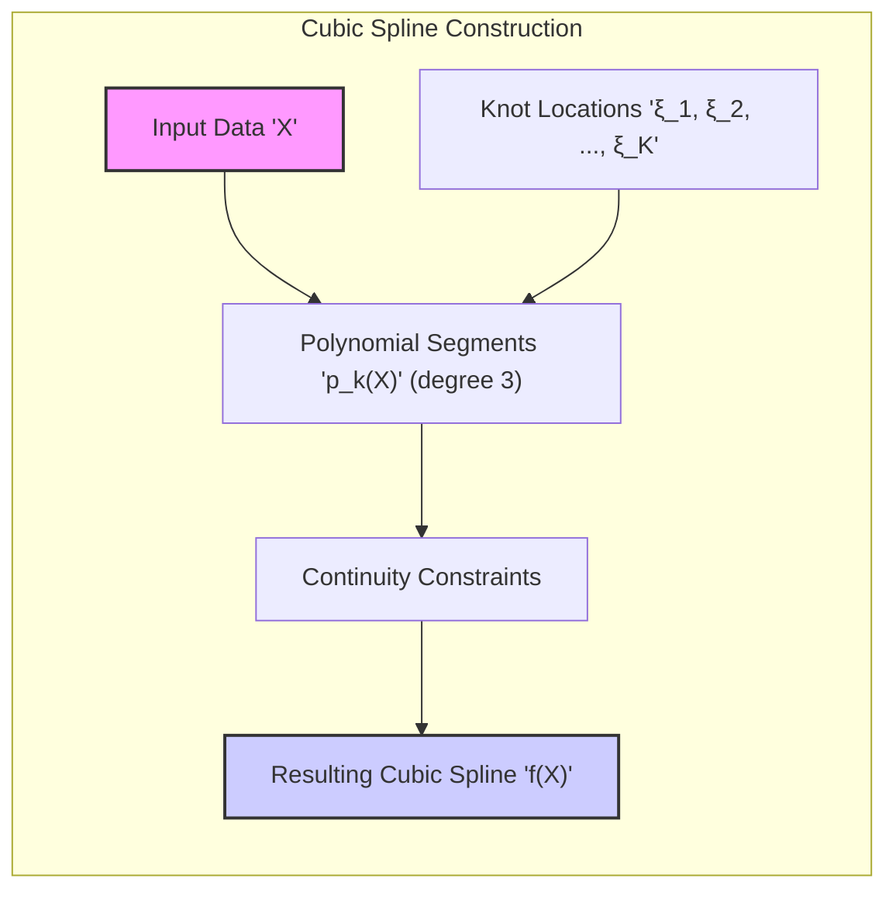
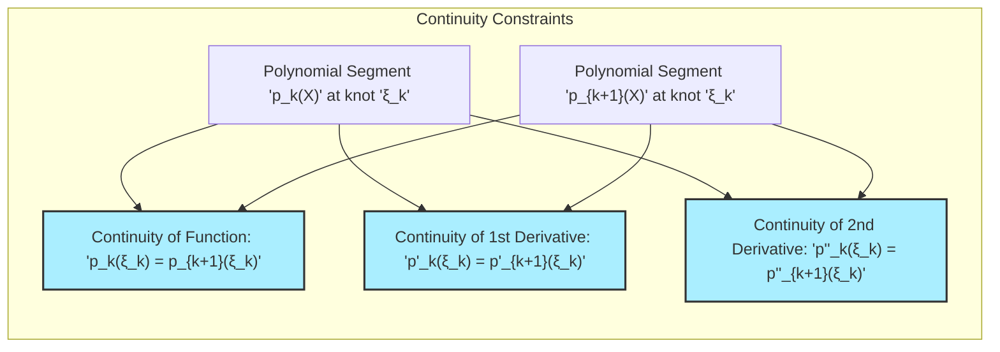
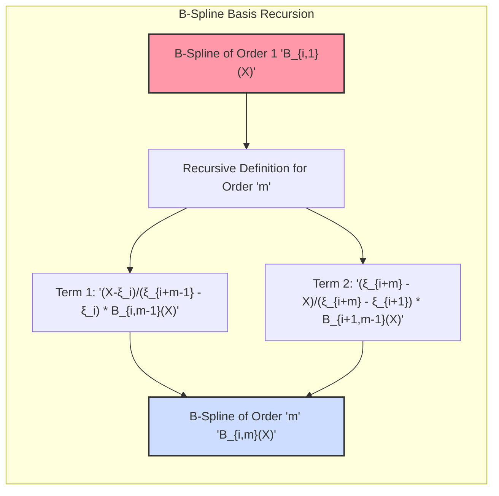
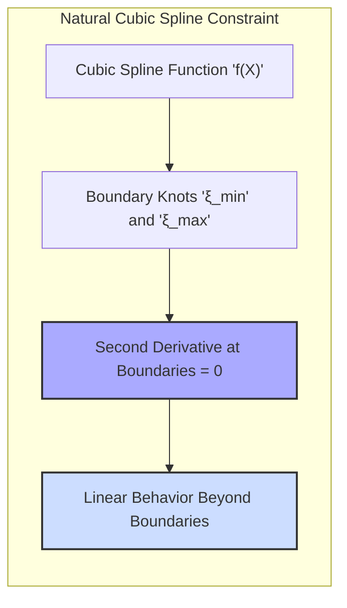
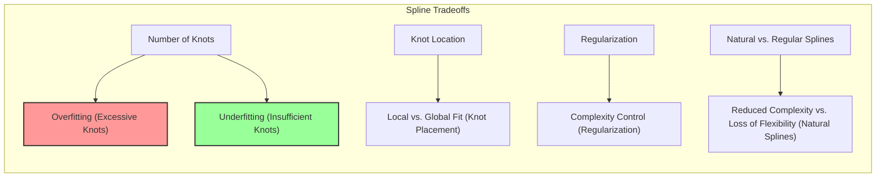

## Cubic Splines: Balancing Flexibility and Smoothness in Basis Expansions

### Introdução

Os **splines cúbicos** são uma classe particular de *piecewise polynomials* que se destacam por sua capacidade de modelar relações não lineares complexas, enquanto mantêm a suavidade e a estabilidade do modelo [^5.2]. Eles são definidos como funções piecewise polinomiais de grau três que se juntam nos nós, garantindo a continuidade da função, de sua primeira derivada e de sua segunda derivada. Essa combinação de flexibilidade e suavidade torna os splines cúbicos uma ferramenta poderosa em *basis expansions*, permitindo a modelagem de dados com alta variabilidade e curvatura. Este capítulo se aprofunda nos detalhes dos splines cúbicos, examinando sua construção, suas propriedades e suas aplicações, com foco em como eles são empregados como funções de base.

### Definição e Construção de Splines Cúbicos

Um **spline cúbico** é uma função definida por segmentos polinomiais de grau três (cúbicos), onde cada segmento é definido em um intervalo contíguo, separados por nós.  Para garantir a suavidade do modelo, os segmentos polinomiais são unidos nos nós de forma a garantir a continuidade da função, da sua primeira derivada e de sua segunda derivada.

Formalmente, um spline cúbico $f(X)$ com nós $\xi_1, \xi_2, ..., \xi_K$ pode ser definido por:

$$
f(X) = \begin{cases}
    p_1(X), & \text{se } X < \xi_1 \\
    p_2(X), & \text{se } \xi_1 \leq X < \xi_2 \\
    \vdots \\
    p_k(X), & \text{se } \xi_{k-1} \leq X < \xi_k \\
    \vdots \\
    p_{K+1}(X), & \text{se } X \geq \xi_K
\end{cases}
$$

onde $p_k(X)$ são polinômios cúbicos definidos por:

$$ p_k(X) = a_k + b_kX + c_kX^2 + d_kX^3$$

As restrições de continuidade garantem que:

1.  **Continuidade da função:** $p_k(\xi_k) = p_{k+1}(\xi_k)$ para todos os nós.
2.  **Continuidade da primeira derivada:** $p'_k(\xi_k) = p'_{k+1}(\xi_k)$ para todos os nós.
3.  **Continuidade da segunda derivada:** $p''_k(\xi_k) = p''_{k+1}(\xi_k)$ para todos os nós.

Essas restrições impõem um conjunto de equações que conectam os coeficientes dos polinômios cúbicos adjacentes, garantindo que a função resultante seja suave e continue em todos os nós. A representação com funções de *truncated power* é uma das formas de garantir continuidade:

$$ f(X) = \beta_0 + \beta_1 X + \beta_2 X^2 + \beta_3 X^3 + \sum_{i=1}^K \beta_i (X-\xi_i)^3_+$$
A função $(X - \xi_i)^3_+$ é o *truncated power function*, onde $(X - \xi_i)^3_+$ é $(X - \xi_i)^3$ se $X \ge \xi_i$, e zero caso contrário. É importante notar que essa representação pode levar a instabilidade numérica, o que motivou o uso das funções B-Splines, que se mostram numericamente mais estáveis.

> 💡 **Exemplo Numérico:**
> Vamos considerar um exemplo com um nó $\xi_1 = 2$.
> A função spline com *truncated power* será:
>
> $f(X) = \beta_0 + \beta_1 X + \beta_2 X^2 + \beta_3 X^3 + \beta_4 (X-2)^3_+$
>
> Se tivermos $\beta_0 = 1, \beta_1 = 0.5, \beta_2 = -0.2, \beta_3 = 0.01, \beta_4 = 0.1$, então:
>
> Para $X = 1$:
>  $f(1) = 1 + 0.5(1) -0.2(1)^2 + 0.01(1)^3 + 0 = 1 + 0.5 - 0.2 + 0.01 = 1.31$
>
> Para $X = 3$:
> $f(3) = 1 + 0.5(3) - 0.2(3)^2 + 0.01(3)^3 + 0.1(3-2)^3 = 1 + 1.5 - 1.8 + 0.27 + 0.1 = 1.07$
>
> Observe que para $X < \xi_1$, o termo $(X-2)^3_+$ é zero, e a função é um polinômio cúbico. Para $X \geq \xi_1$, o termo $(X-2)^3_+$ entra em ação, modificando a curva.

A construção de splines cúbicos pode ser feita usando diferentes bases, mas as funções B-spline são a opção mais utilizada, devido à sua estabilidade e eficiência computacional [^5.2].

### Funções B-Spline para Splines Cúbicos

As **funções B-spline** são uma base alternativa para construir splines cúbicos, que são definidas de forma recursiva e apresentam estabilidade numérica [^5.2]. Elas são não-nulas em um número limitado de nós, e a combinação delas permite criar splines cúbicos.

Para um spline de ordem $M$ (com $M=4$ para splines cúbicos), com nós $\xi_1, \xi_2, ..., \xi_K$ e nós adicionais $\xi_{-3}, \xi_{-2}, \xi_{-1},\xi_0, \xi_{K+1}, \xi_{K+2}, \xi_{K+3}$, as funções B-spline são definidas de forma recursiva como:

1.  **Funções B-Spline de Ordem 1 (Haar):**
    $$
    B_{i,1}(X) = \begin{cases}
        1, & \text{se } \xi_i \leq X < \xi_{i+1} \\
        0, & \text{caso contrário}
    \end{cases}
    $$
2.  **Funções B-Spline de Ordem $m$:**
    $$
        B_{i,m}(X) = \frac{X-\xi_i}{\xi_{i+m-1} - \xi_i}B_{i,m-1}(X) + \frac{\xi_{i+m} - X}{\xi_{i+m} - \xi_{i+1}}B_{i+1,m-1}(X)
    $$

As funções B-spline de ordem 1 (Haar) criam um modelo piecewise constante. A aplicação recursiva da definição acima gera funções B-spline de ordem superior, com maior suavidade. No caso do spline cúbico, as funções B-spline de ordem 4 são usadas para construir o modelo. A representação de um modelo utilizando B-Splines de ordem 4, para $K$ nós internos, gera um modelo com $K+4$ funções de base.

> 💡 **Exemplo Numérico:**
> Suponha que temos um spline cúbico com dois nós internos $\xi_1 = 2$ e $\xi_2 = 4$. Para construir a base B-spline, precisamos de nós adicionais. Vamos adicionar $\xi_{-3} = -2$, $\xi_{-2} = -1$, $\xi_{-1} = 0$, $\xi_0 = 1$, $\xi_3 = 5$, $\xi_4 = 6$ e $\xi_5 = 7$.
>
>  Aqui, vamos calcular $B_{1,2}(X)$ para ilustrar a recursão. Usamos a definição das funções B-spline de ordem $m$:
>
> $B_{1,2}(X) = \frac{X-\xi_1}{\xi_{1+2-1} - \xi_1}B_{1,1}(X) + \frac{\xi_{1+2} - X}{\xi_{1+2} - \xi_{1+1}}B_{2,1}(X)$
>
> $B_{1,2}(X) = \frac{X-\xi_1}{\xi_2 - \xi_1}B_{1,1}(X) + \frac{\xi_3 - X}{\xi_3 - \xi_2}B_{2,1}(X)$
>
> $B_{1,2}(X) = \frac{X-2}{4 - 2}B_{1,1}(X) + \frac{5 - X}{5 - 4}B_{2,1}(X)$
>
> $B_{1,2}(X) = \frac{X-2}{2}B_{1,1}(X) + (5 - X)B_{2,1}(X)$
>
> Agora, vamos avaliar $B_{1,2}(X)$ para dois valores de $X$.
>
> 1. Para $X = 3$:
>
> $B_{1,1}(3) = 1$ (pois $2 \le 3 < 4$) e $B_{2,1}(3) = 0$ (pois $3 < 4$).
>
> $B_{1,2}(3) = \frac{3-2}{2}(1) + (5-3)(0) = 0.5$.
>
> 2. Para $X = 5$:
>
> $B_{1,1}(5) = 0$ (pois $5 \ge 4$) e $B_{2,1}(5) = 0$ (pois $5 \ge 4$).
>
> $B_{1,2}(5) = \frac{5-2}{2}(0) + (5-5)(0) = 0$.
>
> Este exemplo mostra como as funções B-Spline são construídas recursivamente e como o valor de cada função é diferente dependendo da posição de X em relação aos nós.

A estabilidade numérica das funções B-spline torna-as mais adequadas para problemas de modelagem com muitos nós. Além disso, a sua natureza local torna os cálculos eficientes quando o número de nós é grande.

### Splines Cúbicos Naturais: Restrição Adicional

Os **splines cúbicos naturais** são um tipo especial de spline cúbico que adiciona uma restrição adicional no comportamento da função nas extremidades do domínio da variável de entrada [^5.2.1]. Em um spline cúbico natural, impõe-se que a segunda derivada dos segmentos polinomiais mais externos seja igual a zero.  Isso significa que o spline se comporta como uma função linear além dos nós extremos, o que implica que o modelo é linear nas extremidades dos dados.

Essa restrição reduz o número de graus de liberdade do modelo, tornando-o mais adequado em situações com poucos dados. No entanto, a restrição de linearidade nas extremidades também pode levar a uma perda de flexibilidade do modelo, o que pode ser um problema em situações onde se espera que a função apresente variações importantes nas extremidades dos dados.

A vantagem de um spline cúbico natural, portanto, é a redução do número de parâmetros, permitindo a construção de modelos mais estáveis, o que pode ser importante quando há poucos dados, mas o *tradeoff* é a inflexibilidade nas extremidades.

> 💡 **Exemplo Numérico:**
> Considere um spline cúbico natural com nós $\xi_1 = 2$ e $\xi_2 = 4$ e dados nos pontos $X = [1, 2.5, 3.5, 5]$ e valores correspondentes $y = [1.5, 2.8, 3.2, 4.1]$.
>
> Um spline cúbico natural forçaria a segunda derivada a ser zero nos pontos $X \leq 2$ e $X \geq 4$. Isso significa que antes do primeiro nó e após o último nó, o spline se comporta como uma linha reta.
>
> Se ajustarmos um spline cúbico natural a esses dados, obteríamos um conjunto de parâmetros que minimizariam o erro quadrático médio, sujeito à restrição de que a segunda derivada seja zero nas extremidades.
>
> Por exemplo, o modelo poderia se parecer com:
>
> $f(X) = \begin{cases}
>     a_1 + b_1X,  & \text{se } X < 2 \\
>     a_2 + b_2X + c_2X^2 + d_2X^3, & \text{se } 2 \leq X < 4 \\
>     a_3 + b_3X, & \text{se } X \geq 4
> \end{cases}$
>
> As restrições de continuidade e suavidade nos nós, juntamente com a restrição de segunda derivada zero nas extremidades, determinariam os coeficientes $a_i, b_i, c_i, d_i$.
>
> A diferença para um spline cúbico comum é que, sem as restrições de linearidade nas extremidades, o spline cúbico poderia apresentar curvaturas nos extremos.

### Propriedades dos Splines Cúbicos

Os splines cúbicos apresentam propriedades que os tornam uma escolha popular em *basis expansions*:

1.  **Suavidade:** A continuidade da função, de sua primeira e segunda derivadas garante que a função resultante seja suave, o que é importante em situações onde se deseja evitar variações abruptas ou oscilações.
2.  **Flexibilidade:** Os splines cúbicos podem se ajustar a curvas complexas através da escolha adequada do número e da localização dos nós, permitindo que o modelo capture variações locais nos dados.
3.  **Estabilidade Numérica:** A utilização de funções B-spline torna o cálculo dos coeficientes estável, evitando problemas numéricos comuns em outras bases.
4.  **Facilidade de Implementação:** A construção de splines cúbicos, embora um pouco mais complexa que polinômios simples, é bem estabelecida e pode ser realizada usando funções já implementadas em diversas bibliotecas de software.

Os splines cúbicos podem ser usados em modelos lineares generalizados, modelos aditivos generalizados e outros tipos de modelos. Sua versatilidade e poder expressivo tornam-nos uma ferramenta importante na modelagem de dados.

### Tradeoffs na Utilização de Splines Cúbicos

A utilização de splines cúbicos envolve alguns *tradeoffs*:

1. **Número de Nós:** Um número excessivo de nós pode levar a *overfitting*, enquanto um número muito pequeno pode levar a um modelo com alto viés. A escolha do número adequado de nós é fundamental para equilibrar flexibilidade e estabilidade.
2. **Localização dos Nós:** A localização dos nós influencia a capacidade do modelo de capturar variações locais nos dados. A distribuição uniforme dos nós pode ser suficiente em muitos casos, mas a colocação estratégica de nós em regiões de maior variação pode melhorar a precisão do modelo.
3. **Regularização:** A regularização pode ser utilizada para controlar a complexidade dos splines cúbicos, penalizando a magnitude dos coeficientes e evitando *overfitting*. As penalidades $L_1$ e $L_2$ são comuns, e podem ser usadas para controlar a magnitude e a esparsidade dos coeficientes.
4. **Escolha de Splines Cúbicos Naturais:** A utilização de splines cúbicos naturais reduz a complexidade do modelo e adiciona restrições úteis quando há poucos dados. No entanto, a imposição da linearidade nas extremidades pode levar a um viés quando o comportamento real da função é não linear nessas regiões.

> 💡 **Exemplo Numérico:**
> Vamos ilustrar o *tradeoff* entre o número de nós e o *overfitting* com um exemplo simples. Suponha que temos um conjunto de dados com uma relação não linear entre a variável independente $X$ e a variável dependente $y$.
>
> **Cenário 1: Poucos Nós**
>
> Se usarmos um spline cúbico com apenas 2 nós, o modelo pode ser muito simples para capturar a complexidade da relação. Isso resultará em um modelo com alto viés e baixo erro de treinamento, mas com alto erro de generalização (underfitting).
>
> **Cenário 2: Muitos Nós**
>
> Agora, se usarmos um spline cúbico com 10 nós, o modelo se tornará muito flexível e poderá se ajustar ao ruído presente nos dados de treinamento. Isso levará a um modelo com baixo viés e baixo erro de treinamento, mas com um alto erro de generalização (overfitting).
>
> **Cenário 3: Número Adequado de Nós**
>
> A escolha adequada do número de nós (por exemplo, 5 nós) permitirá que o modelo capture a relação não linear nos dados, sem se ajustar ao ruído. Isso resultará em um modelo com um bom equilíbrio entre viés e variância, e com baixo erro de generalização.
>
> **Regularização:**
>
> Se usarmos um spline com um número grande de nós e adicionarmos regularização $L_2$, podemos penalizar coeficientes grandes, o que reduz a flexibilidade do modelo e ajuda a evitar o *overfitting*. Por exemplo, a função de custo a ser minimizada poderia ser:
>
> $Cost = MSE + \lambda \sum_{i} \beta_i^2$
>
> onde $\lambda$ é o parâmetro de regularização que controla o quão forte a penalidade é aplicada.

A escolha da complexidade e das restrições nos splines cúbicos deve ser guiada por uma avaliação do *tradeoff* viés-variância e da natureza dos dados. A validação cruzada é uma ferramenta essencial para orientar essa escolha.

### Conclusão

Os splines cúbicos são uma ferramenta poderosa e versátil no contexto das *basis expansions*, oferecendo uma combinação de flexibilidade e suavidade para modelar relações não lineares. A capacidade de controlar a complexidade, a estabilidade numérica, e a interpretabilidade tornam os splines cúbicos adequados para uma ampla gama de aplicações. A compreensão das propriedades e dos *tradeoffs* envolvidos na utilização de splines cúbicos é fundamental para a construção de modelos eficazes e robustos.

### Footnotes

[^5.2]: "Some simple and widely used examples of the hm are the following: hm(X) = Xm, m = 1, . . ., p recovers the original linear model. hm(X) = Xj2 or hm(X) = XjXk allows us to augment the inputs with polynomial terms to achieve higher-order Taylor expansions." *(Trecho de <Basis Expansions and Regularization>)*
[^5.2.1]: "A natural cubic spline adds additional constraints, namely that the function is linear beyond the boundary knots." *(Trecho de <Basis Expansions and Regularization>)*
