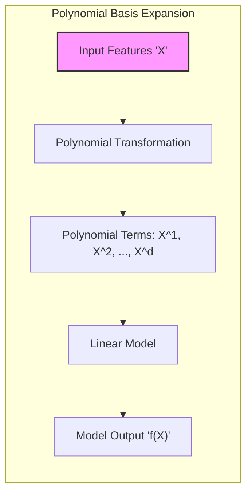
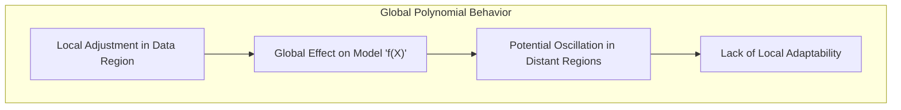
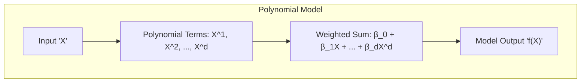
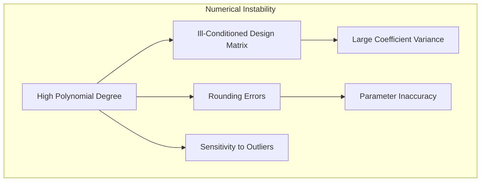
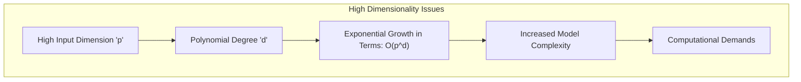
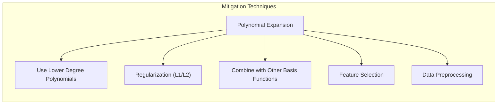
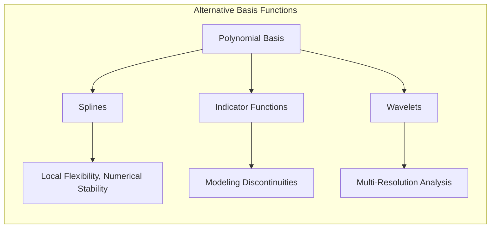

## Limitations of Polynomial Basis Expansions: Addressing Global Behavior and Instability



### Introdução

As expansões de base polinomial são uma técnica comum para adicionar não linearidade a modelos lineares. Ao adicionar termos polinomiais às features originais, os modelos se tornam capazes de aproximar funções com maior complexidade. No entanto, apesar de sua utilidade, as expansões de base polinomial apresentam algumas limitações inerentes que podem afetar o desempenho e a estabilidade do modelo [^5.2]. Este capítulo aborda as limitações dos polinômios como funções de base, focando em seu comportamento global e sua potencial instabilidade, explorando também abordagens para mitigar essas limitações.

### Comportamento Global dos Polinômios

Uma das principais limitações das expansões de base polinomial é seu **comportamento global**. Os polinômios são funções que influenciam o comportamento do modelo em todo o espaço das features. Isso significa que, ao ajustar os coeficientes de um modelo polinomial para capturar relações em uma região específica dos dados, o modelo também é alterado em regiões distantes.



Essa propriedade global dos polinômios pode levar a resultados indesejados:

1.  **Oscilações:** Polinômios de alto grau podem exibir oscilações erráticas longe das regiões onde os dados estão concentrados. Isso significa que, mesmo que o modelo se ajuste bem aos dados de treino, ele pode apresentar um comportamento imprevisível e instável em regiões não observadas.
2.  **Falta de Adaptabilidade Local:** A natureza global dos polinômios impede que o modelo se adapte a variações locais nos dados. Ao modelar uma função com um polinômio, é difícil capturar características locais como saltos, descontinuidades ou mudanças abruptas na inclinação.
3.  **Extrapolação:** Polinômios podem se comportar de forma muito instável em extrapolação, ou seja, ao fazer predições para dados fora do domínio dos dados de treinamento. Pequenas mudanças nos coeficientes podem levar a grandes mudanças nas predições, o que compromete a robustez do modelo.

Em resumo, o comportamento global dos polinômios pode levar a modelos que são sensíveis a pequenas mudanças nos dados e que têm dificuldades em generalizar para dados não observados.

> 💡 **Exemplo Numérico:**
>
> Considere um conjunto de dados unidimensional com valores de `x` entre -2 e 2, e correspondentes valores de `y` que seguem aproximadamente uma relação quadrática.
> ```python
> import numpy as np
> import matplotlib.pyplot as plt
> from sklearn.preprocessing import PolynomialFeatures
> from sklearn.linear_model import LinearRegression
>
> # Dados de exemplo
> np.random.seed(42)
> x = np.linspace(-2, 2, 50)
> y = 0.5 * x**2 + x + np.random.normal(0, 1, 50)
> x = x.reshape(-1, 1)
>
> # Modelo polinomial de grau 2
> poly_2 = PolynomialFeatures(degree=2)
> X_poly_2 = poly_2.fit_transform(x)
> model_2 = LinearRegression()
> model_2.fit(X_poly_2, y)
> y_pred_2 = model_2.predict(X_poly_2)
>
> # Modelo polinomial de grau 7
> poly_7 = PolynomialFeatures(degree=7)
> X_poly_7 = poly_7.fit_transform(x)
> model_7 = LinearRegression()
> model_7.fit(X_poly_7, y)
> y_pred_7 = model_7.predict(X_poly_7)
>
> # Plot dos resultados
> plt.figure(figsize=(10, 6))
> plt.scatter(x, y, label='Dados', color='blue')
> plt.plot(x, y_pred_2, label='Polinomial grau 2', color='red')
> plt.plot(x, y_pred_7, label='Polinomial grau 7', color='green')
> plt.xlabel('x')
> plt.ylabel('y')
> plt.title('Ajuste Polinomial com Diferentes Graus')
> plt.legend()
> plt.grid(True)
> plt.show()
> ```
>
> Este código gera um gráfico mostrando o ajuste de polinômios de grau 2 e 7 aos dados. O polinômio de grau 2 se ajusta razoavelmente bem, enquanto o de grau 7 mostra oscilações, especialmente nas extremidades do intervalo, ilustrando como modelos de alta complexidade podem sofrer de falta de localidade e instabilidade. Note que os polinômios de grau mais alto podem ter um ajuste perfeito aos dados de treino, mas um péssimo desempenho em dados não vistos.

### Exemplo de Instabilidade Polinomial

Para ilustrar a instabilidade dos modelos polinomiais, considere a tentativa de ajustar um polinômio de grau $d$ a um conjunto de dados em uma dimensão. Um modelo polinomial de grau $d$ é dado por:

$$
f(X) = \beta_0 + \beta_1X + \beta_2X^2 + \ldots + \beta_dX^d
$$



Ao aumentar o grau do polinômio, o modelo torna-se mais flexível, sendo capaz de se ajustar a dados mais complexos. No entanto, essa maior flexibilidade também aumenta a tendência do modelo a oscilar e a se ajustar excessivamente a detalhes específicos dos dados de treino.

Em regiões onde há poucos dados, a função polinomial pode apresentar oscilações erráticas e comportamentos inesperados. Isso ocorre porque os polinômios tendem a se comportar de forma instável longe das regiões onde há dados. Pequenas variações nos dados de treinamento podem levar a grandes mudanças nos coeficientes, que por sua vez afetam o comportamento do modelo em todo o espaço amostral.

Essa falta de localidade dos polinômios os torna inadequados em muitos casos, especialmente quando os dados apresentam variações locais ou não lineares que não são bem representadas por polinômios globais.

### Instabilidade Numérica

Além do comportamento global, as expansões de base polinomial podem apresentar problemas de **instabilidade numérica**, especialmente quando o grau do polinômio é elevado:

1. **Matriz de Design Mal Condicionada:** A matriz de design, que contém os valores das features polinomiais, pode tornar-se mal condicionada quando o grau do polinômio é alto. Isso significa que pequenas variações nos dados de treino podem levar a grandes mudanças nos coeficientes estimados, comprometendo a estabilidade do modelo.
2. **Problemas de Arredondamento:** A utilização de termos polinomiais de alto grau pode levar a problemas de arredondamento, principalmente em implementações computacionais que utilizam precisão finita. Esses erros podem se acumular e levar a imprecisões nas estimativas de parâmetros.
3. **Sensibilidade a *Outliers*:** Os polinômios são sensíveis a valores atípicos (*outliers*) nos dados. Um *outlier* em uma região específica dos dados pode afetar o comportamento do polinômio em todo o espaço amostral, resultando em um modelo pouco robusto.



A instabilidade numérica pode dificultar a interpretação e a utilização dos resultados do modelo, especialmente em problemas de alta dimensionalidade ou em dados com muitos *outliers*.

> 💡 **Exemplo Numérico:**
>
> Para ilustrar a instabilidade numérica, vamos considerar um conjunto de dados simples e observar como o condicionamento da matriz de design piora com o aumento do grau polinomial. Usaremos a função `numpy.linalg.cond` para calcular o número de condição, que indica quão mal condicionada é a matriz.
>
> ```python
> import numpy as np
> from sklearn.preprocessing import PolynomialFeatures
>
> # Dados de exemplo (x entre 0 e 1)
> x = np.linspace(0, 1, 10).reshape(-1, 1)
>
> for degree in [2, 5, 10, 15]:
>    poly = PolynomialFeatures(degree=degree)
>    X_poly = poly.fit_transform(x)
>    condition_number = np.linalg.cond(X_poly)
>    print(f"Grau do Polinômio: {degree}, Número de Condição: {condition_number:.2e}")
> ```
>
> Ao executar este código, você verá que o número de condição da matriz de design aumenta drasticamente com o grau do polinômio. Um número de condição alto indica que a matriz é mal condicionada, o que pode levar a problemas de instabilidade numérica e imprecisão na estimativa dos coeficientes. Por exemplo, um número de condição na ordem de $10^8$ ou maior pode indicar sérios problemas numéricos.
>
> **Interpretação:** Este exemplo ilustra como polinômios de alto grau podem levar a problemas numéricos devido a matrizes de design mal condicionadas. A matriz de design mal condicionada significa que pequenas perturbações nos dados podem levar a grandes mudanças nos coeficientes do modelo.

### Limitações em Dados de Alta Dimensionalidade

Em dados de **alta dimensionalidade**, as expansões de base polinomial apresentam problemas adicionais:

1.  **Explosão do Número de Termos:** O número de termos polinomiais cresce exponencialmente com o número de features e o grau do polinômio. Para um modelo com $p$ features e polinômios de grau $d$, o número de termos é da ordem de $O(p^d)$. Isso pode levar a problemas de dimensionalidade, onde o modelo se torna muito complexo e difícil de estimar, além de aumentar a demanda computacional.



2. **Dificuldade em Interpretar os Coeficientes:**  Com um número muito grande de termos, torna-se difícil interpretar os coeficientes do modelo e entender a relação entre as features de entrada e a variável de resposta. O modelo pode se tornar uma "caixa preta", com pouca capacidade de gerar insights sobre os dados.

3.  **Necessidade de Regularização:** Modelos polinomiais de alta dimensionalidade geralmente requerem fortes técnicas de regularização para evitar *overfitting* e manter a estabilidade do modelo. A escolha do tipo e da intensidade da regularização pode ser um desafio adicional nesse contexto.

Em resumo, as expansões de base polinomial podem se tornar impraticáveis em dados de alta dimensionalidade, devido à explosão do número de termos e à dificuldade em controlar a complexidade do modelo.

> 💡 **Exemplo Numérico:**
>
> Considere um problema com 10 features ($p=10$). Vamos calcular o número de termos para polinômios de diferentes graus.
>
> Para um polinômio de grau 2, o número de termos é dado por:
>
> $$
>   \binom{p + d}{d} = \binom{10 + 2}{2} = \binom{12}{2} = \frac{12 \times 11}{2} = 66
> $$
>
> Para um polinômio de grau 3:
>
> $$
>  \binom{10 + 3}{3} = \binom{13}{3} = \frac{13 \times 12 \times 11}{3 \times 2 \times 1} = 286
> $$
>
> Para um polinômio de grau 4:
>
> $$
>  \binom{10 + 4}{4} = \binom{14}{4} = \frac{14 \times 13 \times 12 \times 11}{4 \times 3 \times 2 \times 1} = 1001
> $$
>
> Como podemos ver, o número de termos aumenta rapidamente com o grau do polinômio. Em problemas com muitas features, esse crescimento pode rapidamente tornar o modelo computacionalmente inviável.
>
> **Interpretação:** Este exemplo demonstra como a expansão polinomial em alta dimensão leva a um crescimento exponencial no número de termos, o que aumenta a complexidade do modelo e pode causar overfitting, além de dificultar a interpretação dos coeficientes.

### Mitigando as Limitações dos Polinômios

Apesar de suas limitações, as expansões de base polinomial ainda podem ser usadas com sucesso em algumas aplicações, desde que alguns cuidados sejam tomados:

1.  **Utilizar Polinômios de Baixo Grau:** Limitar o grau do polinômio reduz a tendência a oscilações e instabilidades. Polinômios de baixo grau (como lineares ou quadráticos) podem ser suficientes para modelar muitos tipos de não linearidades.
2. **Regularização:** Adicionar termos de regularização ($L_1$ ou $L_2$) aos coeficientes do modelo pode controlar a magnitude dos coeficientes, reduzindo a complexidade e a sensibilidade a *outliers*.


3.  **Combinação com Outras Funções de Base:** Combinar termos polinomiais com outros tipos de funções de base (como splines ou funções indicadoras) pode permitir que o modelo capture tanto aspectos globais quanto locais dos dados, reduzindo a necessidade de usar polinômios de alto grau.
4. **Seleção de Variáveis:** Selecionar um subconjunto das features polinomiais mais relevantes pode reduzir a complexidade do modelo e melhorar sua interpretabilidade. Métodos como *stepwise regression* ou regularização $L_1$ podem ser utilizados para selecionar as melhores combinações de termos polinomiais.
5.  **Dados Pré-Processados:** Aplicar transformações não lineares aos dados (como transformação logarítmica ou de potência) antes da aplicação das expansões de base polinomial pode ajudar a linearizar a relação entre a variável resposta e as features, reduzindo a necessidade de termos polinomiais de alto grau.

> 💡 **Exemplo Numérico:**
>
> Vamos considerar um exemplo de regularização L2 (Ridge) para mitigar a instabilidade de um modelo polinomial de alto grau.
>
> ```python
> import numpy as np
> import matplotlib.pyplot as plt
> from sklearn.preprocessing import PolynomialFeatures
> from sklearn.linear_model import Ridge
> from sklearn.model_selection import train_test_split
> from sklearn.metrics import mean_squared_error
>
> # Dados de exemplo
> np.random.seed(42)
> x = np.linspace(-2, 2, 50)
> y = 0.5 * x**2 + x + np.random.normal(0, 1, 50)
> x = x.reshape(-1, 1)
>
> # Dividir em treino e teste
> X_train, X_test, y_train, y_test = train_test_split(x, y, test_size=0.3, random_state=42)
>
> # Modelo polinomial de grau 7 sem regularização
> poly_7 = PolynomialFeatures(degree=7)
> X_train_poly_7 = poly_7.fit_transform(X_train)
> X_test_poly_7 = poly_7.transform(X_test)
> model_7_unreg = LinearRegression()
> model_7_unreg.fit(X_train_poly_7, y_train)
> y_pred_7_unreg = model_7_unreg.predict(X_test_poly_7)
> mse_unreg = mean_squared_error(y_test, y_pred_7_unreg)
>
> # Modelo polinomial de grau 7 com regularização L2 (Ridge)
> alpha = 1  # Parâmetro de regularização
> model_7_reg = Ridge(alpha=alpha)
> model_7_reg.fit(X_train_poly_7, y_train)
> y_pred_7_reg = model_7_reg.predict(X_test_poly_7)
> mse_reg = mean_squared_error(y_test, y_pred_7_reg)
>
> # Plot dos resultados
> plt.figure(figsize=(10, 6))
> plt.scatter(X_test, y_test, label='Dados de Teste', color='blue')
>
> # Ordenar os valores de x para plotar a linha
> x_plot = np.linspace(-2,2,100).reshape(-1,1)
> X_plot_poly_7 = poly_7.transform(x_plot)
>
> plt.plot(x_plot, model_7_unreg.predict(X_plot_poly_7), label='Polinomial grau 7 (Sem Reg.)', color='red')
> plt.plot(x_plot, model_7_reg.predict(X_plot_poly_7), label='Polinomial grau 7 (Com Reg. L2)', color='green')
>
> plt.xlabel('x')
> plt.ylabel('y')
> plt.title('Efeito da Regularização L2 em Polinômios')
> plt.legend()
> plt.grid(True)
> plt.show()
>
> print(f"MSE sem regularização: {mse_unreg:.2f}")
> print(f"MSE com regularização L2: {mse_reg:.2f}")
> ```
>
> Este código demonstra como a regularização L2 (Ridge) pode reduzir o *overfitting* e melhorar o desempenho do modelo em dados de teste. Ao aumentar o parâmetro `alpha`, o modelo se torna menos sensível às variações nos dados de treino, evitando oscilações e melhorando a capacidade de generalização.
>
> **Interpretação:** A regularização L2 reduz a magnitude dos coeficientes, suavizando a função e tornando o modelo mais estável e menos suscetível a ruído nos dados.

### Alternativas aos Polinômios

Em muitos casos, o uso de outras funções de base, como **splines**, **funções indicadoras** ou **wavelets**, pode ser mais apropriado do que o uso de polinômios:

1.  **Splines:** Permitem a modelagem de relações não lineares com flexibilidade local e maior estabilidade numérica. A utilização de splines permite controlar a suavidade da função resultante e evitar comportamentos erráticos.



2.  **Funções Indicadoras:** São adequadas para modelar relações que mudam abruptamente em diferentes regiões do espaço amostral. A utilização de funções indicadoras pode permitir a captura de descontinuidades e variações locais.
3.  **Wavelets:** Permitem decompor os dados em diferentes níveis de resolução, permitindo capturar tanto aspectos globais quanto detalhes locais. Wavelets são úteis em problemas de análise de sinais e imagens, onde o comportamento dos dados pode variar ao longo do domínio da feature.

A escolha das funções de base apropriadas deve ser guiada pelo conhecimento do domínio do problema, pelas características dos dados e pelo objetivo da modelagem. Em muitos casos, uma combinação de diferentes funções de base pode ser a melhor opção para obter modelos flexíveis, estáveis e interpretáveis.

### Conclusão

As expansões de base polinomial, apesar de sua simplicidade, apresentam limitações inerentes, como seu comportamento global, sua instabilidade numérica e a explosão do número de termos em alta dimensionalidade. É crucial entender essas limitações para aplicar os polinômios de forma adequada ou para escolher alternativas mais apropriadas. Ao considerar o *tradeoff* entre flexibilidade e instabilidade, é possível construir modelos mais eficazes e confiáveis que capturem a complexidade dos dados sem sacrificar a interpretabilidade e a generalização. O uso de técnicas de regularização, seleção de variáveis, transformação de dados e abordagens alternativas (splines, funções indicadoras, wavelets) são essenciais para mitigar as limitações das expansões de base polinomial.

### Footnotes

[^5.2]: "Some simple and widely used examples of the hm are the following: hm(X) = Xm, m = 1, . . ., p recovers the original linear model. hm(X) = Xj2 or hm(X) = XjXk allows us to augment the inputs with polynomial terms to achieve higher-order Taylor expansions." *(Trecho de <Basis Expansions and Regularization>)*
