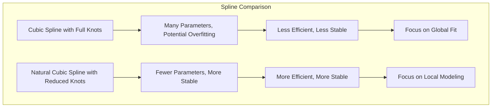
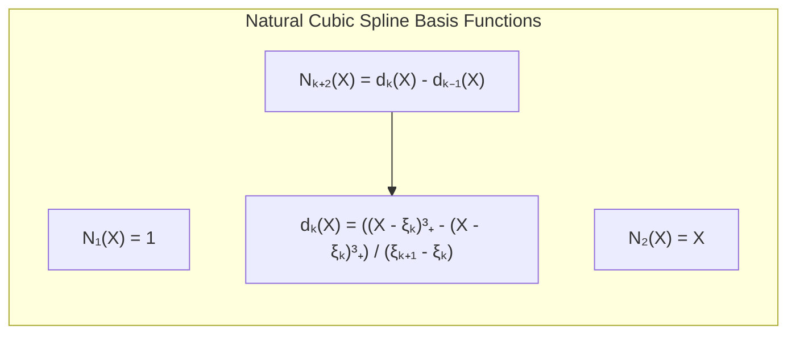
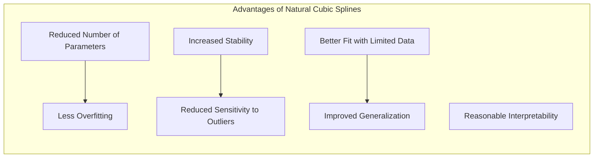
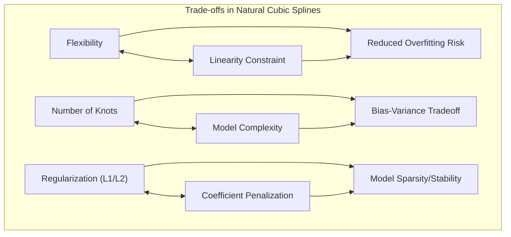

## Reduced Basis via Natural Cubic Splines: Efficient Modeling and Smoothness



### Introdução

As **expansões de base** com *splines cúbicos* oferecem uma maneira poderosa de capturar relações não lineares com suavidade e flexibilidade [^5.2]. No entanto, a utilização de um número completo de nós, onde cada ponto de dado é um nó, pode levar a modelos com um número excessivo de parâmetros, o que pode resultar em *overfitting* e problemas computacionais. Para contornar essa limitação, técnicas de **redução de base** podem ser utilizadas. Uma abordagem comum é usar **splines cúbicos naturais**, que impõem restrições de linearidade nas extremidades do domínio, reduzindo o número de parâmetros necessários [^5.2.1].

Este capítulo explora a técnica de redução de base por meio de *splines cúbicos naturais*, detalhando como a restrição de linearidade nas extremidades permite a construção de modelos mais eficientes e estáveis, com foco na modelagem local e suave da relação entre as features e a variável de resposta.

### A Necessidade de Redução de Base

Em muitas aplicações, o número de dados de treinamento $N$ pode ser grande. Ao usar splines cúbicos, e considerando que um spline cúbico de $K$ nós tem $K+4$ parâmetros, usar todos os dados como nós pode levar a modelos com um número excessivo de parâmetros, o que é um problema por diversas razões:

1.  **Overfitting:** Modelos com muitos parâmetros são mais propensos a ajustar-se excessivamente aos dados de treinamento, capturando ruído e variações aleatórias nos dados, ao invés da relação verdadeira entre features e resposta. Isso leva a uma performance ruim em dados não observados.
2. **Complexidade Computacional:** Modelos com muitos parâmetros são mais lentos para treinar e usar em predições. O tempo de treinamento e computação podem tornar a modelagem impraticável, especialmente com dados muito grandes.
3. **Dificuldade de Interpretação:** Modelos com muitos parâmetros são mais difíceis de interpretar e compreender. O efeito de cada parâmetro na predição se torna mais difícil de analisar, o que compromete a capacidade de gerar *insights* sobre os dados.

Para lidar com esses problemas, é necessário reduzir o número de parâmetros do modelo, o que pode ser feito através de técnicas de **redução de base**. A ideia é reduzir o número de funções de base sem perder a capacidade do modelo de capturar relações não lineares nos dados.

> 💡 **Exemplo Numérico:**
>
> Imagine que temos um conjunto de dados com 1000 pontos. Se usarmos um spline cúbico com cada ponto como um nó, teríamos um modelo com 1004 parâmetros (1000 nós + 4). Isso pode levar a overfitting. Se usarmos splines cúbicos naturais, podemos escolher, por exemplo, apenas 10 nós internos. Isso resultaria em um modelo com apenas 12 parâmetros (2 para a parte linear e 10 para os nós internos), reduzindo significativamente o risco de overfitting e a complexidade computacional.

### Splines Cúbicos Naturais: Restrição da Linearidade

Os **splines cúbicos naturais** são uma forma eficaz de reduzir o número de parâmetros, impondo restrições adicionais sobre o comportamento do spline nas extremidades do domínio [^5.2.1]. Em um spline cúbico natural, a função resultante é forçada a se comportar como uma função linear fora dos limites do domínio das features.

Formalmente, essa restrição é imposta garantindo que a segunda derivada do spline seja zero nos nós limites, o que implica que:

$$
\begin{aligned}
    p''(\xi_0) = 0 \\
    p''(\xi_{K+1}) = 0
\end{aligned}
$$
onde $\xi_0$ e $\xi_{K+1}$ são os nós nos limites do domínio e $p''(X)$ representa a segunda derivada do spline. Essa restrição reduz o número de graus de liberdade do modelo, tornando-o mais adequado para situações com poucos dados ou onde o comportamento da função é esperado ser linear nas extremidades do espaço amostral.

```mermaid
graph LR
    subgraph "Natural Cubic Spline Constraints"
        direction TB
        A["Spline Function: p(X)"]
        B["Second Derivative at Boundary Knots: p''(\"ξ₀\") = 0"]
        C["Second Derivative at Boundary Knots: p''(\"ξₖ₊₁\") = 0"]
        A --> B
        A --> C
        B --> D["Linearity Outside Knots"]
        C --> D
    end
```

A restrição de linearidade nas extremidades leva à redução de parâmetros, o que por sua vez leva à construção de modelos mais eficientes em termos computacionais e mais estáveis em termos de generalização. Os splines cúbicos naturais, ao invés de impor uma restrição sobre a função, impõe uma restrição sobre as funções base, o que implica uma função mais suave que a maioria das funções *piecewise* polinomiais.

> 💡 **Exemplo Numérico:**
>
> Considere um spline cúbico com nós em $\xi_1 = 2$ e $\xi_2 = 4$. Um spline cúbico *natural* impõe que a segunda derivada seja zero antes de $\xi_1$ e depois de $\xi_2$. Isso significa que fora do intervalo [2, 4], a função se comporta como uma linha reta, e não como uma curva cúbica. Essa restrição reduz a complexidade do spline e o torna menos suscetível a overfitting em dados com ruído.

### Construção de Splines Cúbicos Naturais

A construção de splines cúbicos naturais envolve a utilização de uma base específica de funções que satisfazem as restrições de continuidade e de linearidade nas extremidades. Uma forma de implementar splines cúbicos naturais é utilizar a seguinte base de funções:

$$
N_1(X) = 1, \;\; N_2(X) = X, \;\; N_{k+2}(X) = d_k(X) - d_{k-1}(X), \; k = 1, \ldots, K
$$
onde $d_k(X)$ é dado por:

$$
d_k(X) = \frac{(X - \xi_k)^3_+ - (X-\xi_k)^3_+}{\xi_{K+1} - \xi_k}
$$
onde $(X-\xi_k)^3_+$ é a função truncated power, como abordado anteriormente, e $\xi_k$ representa os nós. Essa representação garante que as funções formadas pelo spline cúbico natural sejam lineares nas extremidades do domínio, já que quando $X$ está fora do domínio entre $\xi_1$ e $\xi_k$, os valores se cancelam, deixando apenas os termos lineares.



Para construir um spline cúbico natural, basta usar $K$ nós internos. As funções $N_1$ e $N_2$ são responsáveis pelo comportamento linear do spline, enquanto as funções $N_{k+2}$ são responsáveis por adicionar flexibilidade local. O modelo é, portanto, formado por $K$ funções B-Spline (já que a primeira e a segunda função são funções lineares).

Outras bases também podem ser usadas para construir splines cúbicos naturais, e em muitas implementações de software, as funções B-Splines (com os ajustes de linearidade) são preferíveis devido a sua estabilidade numérica.

> 💡 **Exemplo Numérico:**
>
> Suponha que temos três nós internos $\xi_1 = 2$, $\xi_2 = 4$ e $\xi_3 = 6$, e que o limite do domínio é $\xi_0 = 0$ e $\xi_4=8$.  As funções base seriam:
>
> $N_1(X) = 1$
> $N_2(X) = X$
>
> $d_1(X) = \frac{(X-2)^3_+ - (X-2)^3_+}{8-2} = 0 $
> $N_3(X) = d_1(X) - d_0(X)$
> $d_2(X) = \frac{(X-4)^3_+ - (X-4)^3_+}{8-4} = 0 $
> $N_4(X) = d_2(X) - d_1(X)$
> $d_3(X) = \frac{(X-6)^3_+ - (X-6)^3_+}{8-6} = 0 $
> $N_5(X) = d_3(X) - d_2(X)$
>
> Note que $d_k(X)$ é a função truncada que resulta em um número diferente de zero somente quando $X > \xi_k$. A combinação destas funções, ponderadas por coeficientes, forma o spline cúbico natural.

### Vantagens dos Splines Cúbicos Naturais

O uso de splines cúbicos naturais oferece algumas vantagens em relação a splines cúbicos regulares:

1.  **Redução do Número de Parâmetros:** A imposição da linearidade nas extremidades reduz o número de parâmetros do modelo, evitando o uso de splines com muitos nós. Isso leva a modelos mais eficientes em termos computacionais e menos propensos a *overfitting*. A redução da complexidade dos splines cúbicos naturais quando comparados com splines cúbicos com o mesmo número de nós é, portanto, uma vantagem importante para modelos que são treinados com um número limitado de dados.
2. **Estabilidade:** Os splines cúbicos naturais são mais estáveis do que os splines cúbicos regulares, pois a restrição de linearidade nas extremidades reduz a sensibilidade do modelo a *outliers* ou a ruído nos dados.
3. **Ajuste em Cenários com poucos dados:** Os splines cúbicos naturais são adequados para situações onde há poucos dados. A restrição de linearidade nas extremidades evita que o modelo se ajuste excessivamente aos dados de treino e melhora a generalização para dados não observados. Como o número de parâmetros é menor que em splines cúbicos sem essa restrição, a instabilidade por *overfitting* é reduzida.
4. **Interpretabilidade:** Embora splines cúbicos naturais possam ser mais complexos que polinômios lineares ou quadráticos, eles preservam um nível razoável de interpretabilidade. O efeito de cada nó no modelo pode ser analisado e relacionado às regiões de maior variação nos dados.



> 💡 **Exemplo Numérico:**
>
> Imagine que estamos ajustando uma curva de resposta a um medicamento. Com poucos dados, um spline cúbico regular com muitos nós poderia se ajustar perfeitamente aos dados de treinamento, mas com um comportamento errático fora dos pontos de dados. Um spline cúbico natural com menos nós e a restrição de linearidade nas extremidades, por outro lado, conseguiria capturar a tendência geral dos dados de forma mais suave e generalizável.

Essas vantagens tornam os splines cúbicos naturais uma ferramenta eficaz para modelagem não linear em diversas aplicações onde é necessário um bom equilíbrio entre flexibilidade, estabilidade e interpretabilidade.

### Aplicações e Considerações Práticas

Os splines cúbicos naturais são amplamente utilizados em diversas aplicações:

1.  **Modelagem de Dados de Séries Temporais:** Os splines cúbicos naturais podem ser usados para modelar séries temporais com tendências não lineares e com sazonalidade, com a vantagem de controlar a suavidade das funções de maneira adaptativa.
2. **Análise de Dados com Curvatura:** Os splines cúbicos naturais são adequados para modelar curvas de crescimento, curvas dose-resposta e outros tipos de dados com curvatura, onde a continuidade e a suavidade são importantes. A capacidade de se ajustar a dados curvos sem grandes oscilações é uma vantagem sobre polinômios.
3. **Modelagem de Dados com Picos:** Os splines cúbicos naturais podem ser usados para ajustar dados que apresentam um comportamento suave, mas que apresentam picos ou regiões de variação abrupta. A escolha da localização dos nós pode influenciar a forma do spline, permitindo que ele capture detalhes específicos dos dados.
4. **Análise de Imagens:** Splines podem ser usados para interpolar pixels em imagens, reduzindo o número de parâmetros necessários. A combinação com wavelets também pode ser útil em compressão de imagens e filtros.

> 💡 **Exemplo Numérico:**
>
> Em uma série temporal de vendas, podemos ter uma tendência de crescimento não linear ao longo do ano. Um spline cúbico natural pode ajustar essa tendência, enquanto a linearidade nas extremidades garante que a previsão não extrapole de forma irrealista para o futuro. Para uma curva dose-resposta de um fármaco, um spline cúbico natural com nós bem posicionados pode capturar a relação não linear entre a dose e a resposta, sem se ajustar em excesso aos dados.

Em todas as aplicações mencionadas acima, é importante considerar a localização dos nós, que pode ser definida uniformemente ou baseada na distribuição dos dados. Também é importante avaliar a necessidade de regularização, como L1 ou L2, para controlar a complexidade do modelo e a magnitude de seus parâmetros.

### Tradeoffs na Utilização de Splines Cúbicos Naturais

A utilização de splines cúbicos naturais envolve alguns *tradeoffs*:

1.  **Flexibilidade vs. Restrição:** A restrição de linearidade nas extremidades reduz a flexibilidade do modelo, mas também diminui o risco de *overfitting*. A escolha entre splines cúbicos regulares e splines cúbicos naturais depende da natureza dos dados e do objetivo da modelagem.
2. **Número de Nós:** O número de nós influencia a capacidade do modelo de capturar variações locais. Um número excessivo de nós pode levar a overfitting, enquanto um número insuficiente pode levar a um modelo com viés alto. O número ideal de nós deve ser escolhido com base na avaliação do desempenho do modelo em dados de validação.
3.  **Regularização:** A escolha da regularização (L1 ou L2) afeta a forma como os coeficientes são penalizados. A regularização L1 induz esparsidade, levando a modelos mais simples, enquanto a regularização L2 reduz a magnitude dos coeficientes, tornando o modelo mais estável.



> 💡 **Exemplo Numérico:**
>
> Ao modelar dados com muitos picos, um spline cúbico natural com poucos nós pode não conseguir capturar todos os detalhes. Aumentar o número de nós aumenta a flexibilidade, mas também aumenta o risco de overfitting. Usar regularização L2 pode ajudar a suavizar o spline e evitar overfitting, mesmo com mais nós. A escolha da quantidade de nós e da regularização depende da análise do erro em dados de validação.

### Conclusão

Os splines cúbicos naturais oferecem uma abordagem eficaz para modelagem não linear em *basis expansions*, combinando flexibilidade local com estabilidade e eficiência computacional. A restrição de linearidade nas extremidades é um mecanismo útil para reduzir o número de parâmetros e construir modelos mais robustos, especialmente em situações com poucos dados. A compreensão dos *tradeoffs* envolvidos na utilização de splines cúbicos naturais é essencial para a escolha da abordagem mais adequada para cada problema de modelagem.

### Footnotes

[^5.2]: "Some simple and widely used examples of the hm are the following: hm(X) = Xm, m = 1, . . ., p recovers the original linear model. hm(X) = Xj2 or hm(X) = XjXk allows us to augment the inputs with polynomial terms to achieve higher-order Taylor expansions." *(Trecho de <Basis Expansions and Regularization>)*
[^5.2.1]: "A natural cubic spline adds additional constraints, namely that the function is linear beyond the boundary knots." *(Trecho de <Basis Expansions and Regularization>)*
