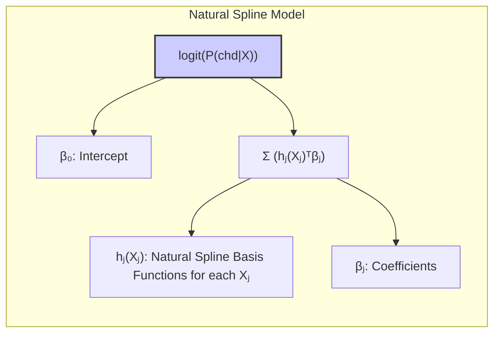
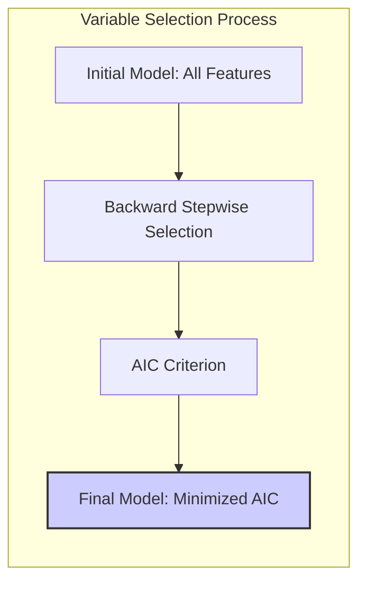
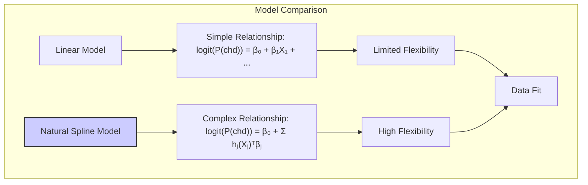

## Application of Natural Splines: The South African Heart Disease Example

### Introdução

Os splines naturais, como discutido anteriormente, são uma ferramenta poderosa para modelagem não linear devido à sua capacidade de equilibrar flexibilidade e suavidade [^5.2.1]. Este capítulo se concentra na aplicação prática de splines naturais no contexto do exemplo das doenças cardíacas na África do Sul, discutido em [^5.2.2]. Nesse exemplo, splines naturais são usados para modelar a relação não linear entre várias features de risco e a probabilidade de doença cardíaca, demonstrando como essa técnica pode ser aplicada para melhorar a qualidade e a interpretação de modelos estatísticos em dados reais. A análise detalhada deste exemplo permite explorar as vantagens dos splines naturais e a forma como eles podem ser utilizados para responder a perguntas de pesquisa específicas.

### O Conjunto de Dados de Doenças Cardíacas na África do Sul

O conjunto de dados de doenças cardíacas na África do Sul, mencionado em [^5.2.2], é um exemplo de um estudo retrospectivo onde os dados foram coletados após os pacientes terem sofrido um ataque cardíaco. Este tipo de estudo pode induzir vieses na modelagem, pois o estilo de vida e o tratamento dos pacientes podem ter mudado após o evento cardíaco. O objetivo do estudo é modelar a probabilidade de doença cardíaca (CHD) com base em uma série de fatores de risco. As variáveis de entrada (features) incluem:

1.  **sbp:** Pressão arterial sistólica.
2.  **tobacco:** Consumo cumulativo de tabaco em kg.
3.  **ldl:** Nível de colesterol LDL.
4.  **famhist:** Histórico familiar de doença cardíaca (variável binária).
5.  **obesity:** Nível de obesidade.
6.  **age:** Idade do paciente.

O objetivo é construir um modelo que capture as relações não lineares entre esses fatores de risco e a probabilidade de desenvolver doença cardíaca. Modelos lineares podem ser inadequados, pois a influência de cada fator de risco pode não ser linear.

> 💡 **Exemplo Numérico:**
>
> Para ilustrar a necessidade de modelos não lineares, vamos considerar hipoteticamente duas pessoas:
>
> -   **Pessoa A:** Tem uma pressão arterial sistólica (sbp) de 120 mmHg.
> -   **Pessoa B:** Tem uma pressão arterial sistólica de 180 mmHg.
>
> Em um modelo linear, assumiríamos que o risco aumenta proporcionalmente com a pressão arterial. No entanto, estudos mostram que o risco pode aumentar mais rapidamente em pressões mais baixas e se estabilizar ou até diminuir em níveis muito altos (devido ao tratamento, por exemplo). Um modelo linear perderia essa nuance. Splines naturais nos permitem modelar essa relação não linear, onde o impacto do aumento de sbp de 120 para 140 pode ser maior do que de 160 para 180, por exemplo.

### Modelagem com Splines Naturais

Para modelar a relação não linear entre os fatores de risco e a probabilidade de doença cardíaca, splines naturais são usados como base em um modelo de regressão logística [^5.2.2]. O modelo pode ser descrito como:

$$
\text{logit}(P(\text{chd}|X)) = \beta_0 + \sum_{j=1}^p h_j(X_j)^T \beta_j
$$
onde $h_j(X_j)$ são funções de base do spline natural para cada feature $X_j$. A função $logit$ é usada para garantir que a probabilidade esteja entre 0 e 1. O modelo usa quatro funções de base de spline natural para cada feature, o que implica em três nós internos, espaçados igualmente nos quantis da distribuição dos dados de cada feature.

Como mencionado, a família *famhist* é uma variável binária, que é associada a um único parâmetro no modelo.

Ao aplicar *basis expansions* com splines naturais, o modelo é capaz de capturar curvas de resposta não lineares, permitindo que o ajuste seja mais flexível e adaptável às características específicas dos dados.

> 💡 **Exemplo Numérico:**
>
> Vamos supor que para a variável `tobacco`, temos os seguintes quantis (aproximados) para os nós internos: 0.1, 1.0 e 2.5 kg. As funções de base do spline natural $h_{tobacco}(X_{tobacco})$ gerariam um conjunto de 4 funções que permitem modelar a influência do consumo de tabaco de forma não linear. Por exemplo, uma pessoa que fuma 0.5 kg de tabaco estaria mais influenciada pelas funções de base correspondentes aos nós 0.1 e 1.0, enquanto uma pessoa que fuma 3.0 kg estaria mais influenciada pelas funções de base do nó 2.5 e pela função de base que modela a linearidade além do último nó.

### Seleção de Variáveis e o Modelo Final

Para obter o modelo final, foi utilizado um processo de seleção de variáveis *backward stepwise*, onde variáveis foram removidas do modelo inicial baseado em um critério AIC (Akaike Information Criterion) [^5.2.2]. O critério AIC penaliza a complexidade do modelo e a escolha do modelo final é aquela que minimiza o AIC.

O modelo final selecionado inclui as seguintes features, com suas respectivas funções de base de splines naturais:

1.  **sbp:**  (Pressão arterial sistólica)
2.  **tobacco:** (Consumo de tabaco)
3.  **ldl:** (Colesterol LDL)
4. **famhist:** (Histórico familiar)
5.  **obesity:** (Obesidade)
6.  **age:** (Idade)

A figura correspondente em [^5.2.2] mostra o efeito de cada feature no *logit* da probabilidade de doença cardíaca. Cada gráfico mostra a função ajustada para cada feature, com uma banda de erro padrão pontual.

É importante notar que tanto sbp (pressão arterial sistólica) quanto a variável de obesidade mostraram ter um efeito não linear no risco de doença cardíaca. Aparentemente, em taxas baixas, eles aumentam o risco, mas em taxas altas o risco estabiliza ou decai. Este resultado aparentemente contraintuitivo é explicado pela natureza do estudo. Os pacientes com histórico de doenças cardíacas já tinham sido tratados e mudado seus estilos de vida.

> 💡 **Exemplo Numérico:**
>
> Suponha que, após o ajuste do modelo, obtivemos os seguintes coeficientes (hipotéticos) para a variável `sbp`:
>
> $\beta_{sbp} = [-0.5, 1.2, -0.8, 0.3]$.
>
> Esses coeficientes multiplicam as funções de base do spline natural. Vamos considerar uma pessoa com pressão arterial sistólica de 130 mmHg. Supondo que os valores das funções de base para essa pessoa sejam $h_{sbp}(130) = [0.2, 0.7, 0.1, 0.0]$, o efeito de `sbp` no logit da probabilidade de doença cardíaca seria:
>
> $logit(P(chd|sbp=130)) = (-0.5 * 0.2) + (1.2 * 0.7) + (-0.8 * 0.1) + (0.3 * 0.0) = -0.1 + 0.84 - 0.08 + 0 = 0.66$.
>
> Isso significa que, para um valor de `sbp` de 130, o logit aumenta 0.66 unidades, influenciando a probabilidade de doença cardíaca. A não linearidade é evidente pois a contribuição para o logit é uma combinação ponderada das funções de base, e não uma simples multiplicação da pressão arterial por um coeficiente único.

### Interpretação dos Resultados

A aplicação de splines naturais no modelo de regressão logística permite uma interpretação mais detalhada do efeito de cada feature na probabilidade de doença cardíaca:

1.  **Relações Não Lineares:** O uso de splines naturais revela relações não lineares que seriam perdidas em um modelo linear. Por exemplo, as curvas mostradas em [^5.2.2] revelam que a relação entre *sbp* e *obesity* e a probabilidade de doença cardíaca não é linear, com um aumento inicial e uma posterior estabilização ou queda do risco, como mencionado anteriormente.
2.  **Efeito de Cada Feature:** O gráfico em [^5.2.2] mostra que, depois do tratamento, para cada feature os pacientes podem estar em um determinado nível de risco, e o modelo representa a mudança na probabilidade de doença cardíaca, enquanto outras variáveis são mantidas constantes. As bandas de erro em cada gráfico permitem avaliar a incerteza das estimativas.
3. **Comparação com Modelos Lineares:** O exemplo em [^5.2.2] ilustra a importância de modelos não lineares em estudos de dados reais. A imposição de modelos lineares teria simplificado a realidade e perdido detalhes importantes sobre a influência dos fatores de risco.

A interpretação dos resultados do modelo com splines naturais requer cuidado, pois o efeito de cada feature não é constante, mas varia ao longo de seu domínio. No entanto, a flexibilidade dos splines naturais permite a construção de modelos mais precisos e adaptáveis aos dados do mundo real, sendo, portanto, uma técnica essencial na modelagem de relações não lineares.

> 💡 **Exemplo Numérico:**
>
> Comparando com um modelo linear, onde a relação entre `sbp` e o logit da probabilidade seria modelada como `logit(P(chd)) = ... + \beta_{sbp} * sbp + ...`, teríamos um único coeficiente $\beta_{sbp}$. Se $\beta_{sbp}$ fosse igual a 0.01, isso significaria que, para cada aumento de 1 mmHg na pressão arterial, o logit aumentaria em 0.01. No entanto, o modelo com splines naturais permite que essa relação seja mais flexível. Por exemplo, um aumento de 1 mmHg na pressão arterial de 120 para 121 pode ter um impacto maior do que um aumento de 1 mmHg de 170 para 171, capturando a não linearidade da relação.

### Benefícios do Uso de Splines Naturais no Exemplo

A aplicação de splines naturais no exemplo de doenças cardíacas da África do Sul demonstra os seguintes benefícios:

1.  **Captura de Não Linearidades:** Os splines naturais permitem modelar relações não lineares entre os fatores de risco e a probabilidade de doença cardíaca, o que é impossível com modelos lineares. A flexibilidade do spline natural permite que o modelo se ajuste aos dados, capturando comportamentos específicos de cada feature.
2. **Interpretação Aprimorada:** Os splines naturais, apesar de sua flexibilidade, mantêm um nível razoável de interpretabilidade. Ao analisar as curvas resultantes em [^5.2.2], é possível entender o efeito de cada fator de risco na probabilidade de doença cardíaca, tanto em termos de direção quanto de magnitude.
3. **Seleção de Variáveis:** O processo de seleção de variáveis *backward stepwise* permite identificar os fatores de risco mais relevantes para o modelo. A aplicação do critério AIC ajuda a evitar *overfitting* e a manter o modelo com um número adequado de parâmetros.
4.  **Ajuste com poucos dados:** A técnica de *natural cubic splines* também é eficiente em conjuntos de dados com um número de instâncias reduzido, já que a restrição da linearidade nas extremidades permite um modelo estável com poucos dados.

### Limitações e Considerações

Apesar dos benefícios, é importante mencionar algumas limitações e considerações na utilização de splines naturais:

1.  **Choice of Knots:** A escolha do número e da localização dos nós pode influenciar o comportamento e a flexibilidade do spline. A escolha deve ser feita com base no conhecimento do domínio do problema e com uma avaliação do desempenho do modelo.
2. **Extrapolação:** Os splines naturais são definidos como lineares fora dos limites dos dados, o que pode afetar as predições fora do espaço amostral. A extrapolação com splines deve ser feita com cautela e considerando as limitações dessa técnica.
3.  **Complexidade:** Embora mais interpretáveis que modelos não lineares, splines cúbicos naturais são modelos mais complexos que modelos lineares. A interpretação dos parâmetros do modelo exige algum conhecimento sobre a teoria das *basis expansions*.

> 💡 **Exemplo Numérico:**
>
> Para ilustrar a influência da escolha dos nós, imagine que, em vez de usar quantis para o `tobacco`, tivéssemos escolhido nós em 0.5, 1.5 e 3.0 kg. Isso faria com que a função de base fosse mais sensível a mudanças em torno desses valores específicos, e menos sensível em outras regiões. Se a maioria dos dados estivesse concentrada em valores menores que 0.5, essa escolha poderia levar a um ajuste menos preciso do que usar os quantis, que espalhariam os nós de acordo com a distribuição dos dados.

### Conclusão

O exemplo de doenças cardíacas na África do Sul demonstra o poder e a utilidade dos splines naturais na modelagem de relações não lineares em dados reais. Ao permitir que o modelo se adapte a relações complexas e capturar variações locais nos dados, os splines naturais podem gerar modelos mais precisos, robustos e informativos. A combinação de splines naturais com técnicas de seleção de variáveis e avaliação de modelos permite criar modelos estatísticos que respondem a perguntas de pesquisa complexas, obtendo *insights* importantes sobre as características dos dados.

### Footnotes

[^5.2.1]: "A natural cubic spline adds additional constraints, namely that the function is linear beyond the boundary knots." *(Trecho de <Basis Expansions and Regularization>)*
[^5.2.2]: "In Section 4.4.2 we fit linear logistic regression models to the South African heart disease data. Here we explore nonlinearities in the functions using natural splines. The functional form of the model is logit[Pr(chd|X)] = β0 + h1(X1)Tβ1 +h2(X2)Tβ2 + ··· +hp(Xp)Tβp" *(Trecho de <Basis Expansions and Regularization>)*
