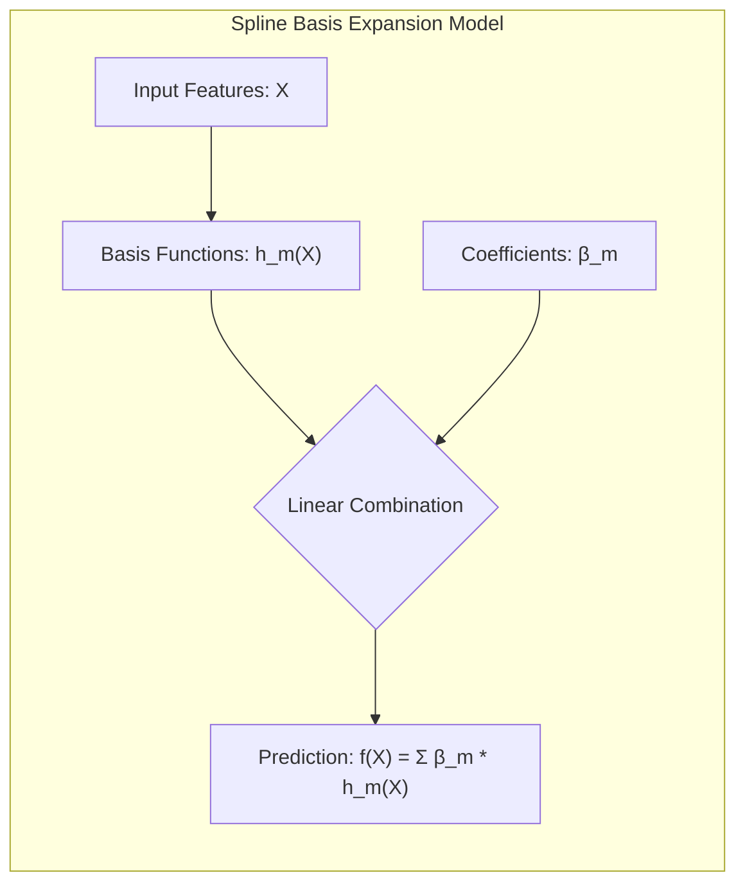
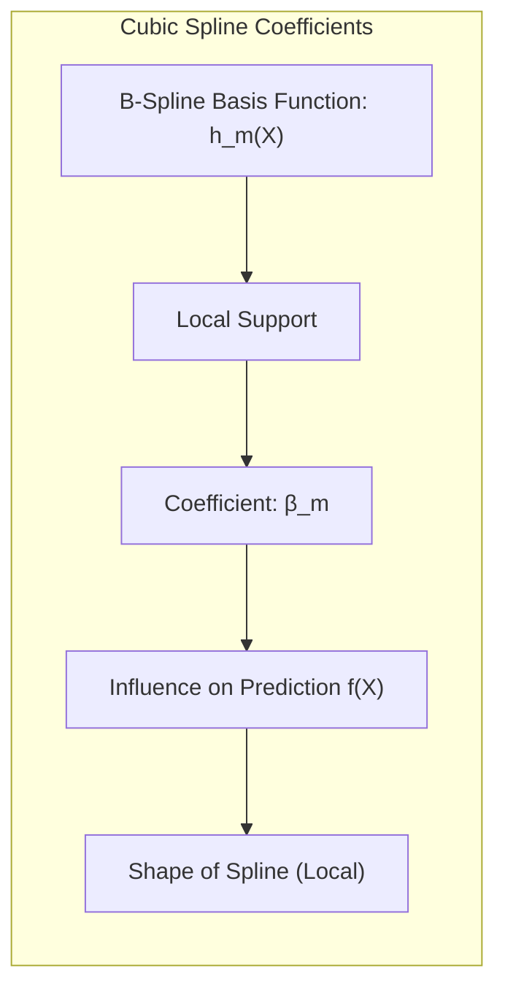
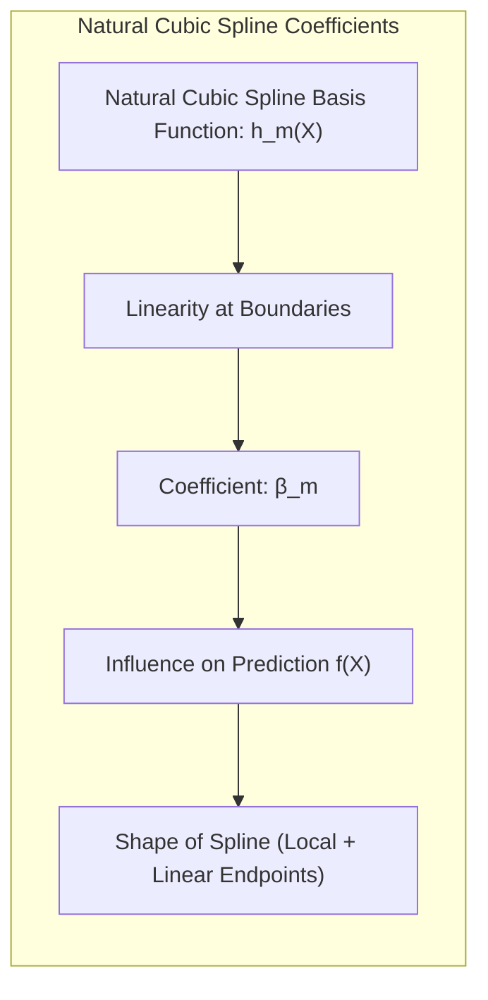
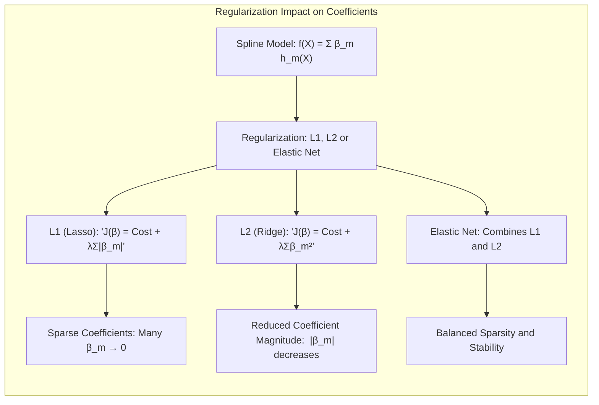
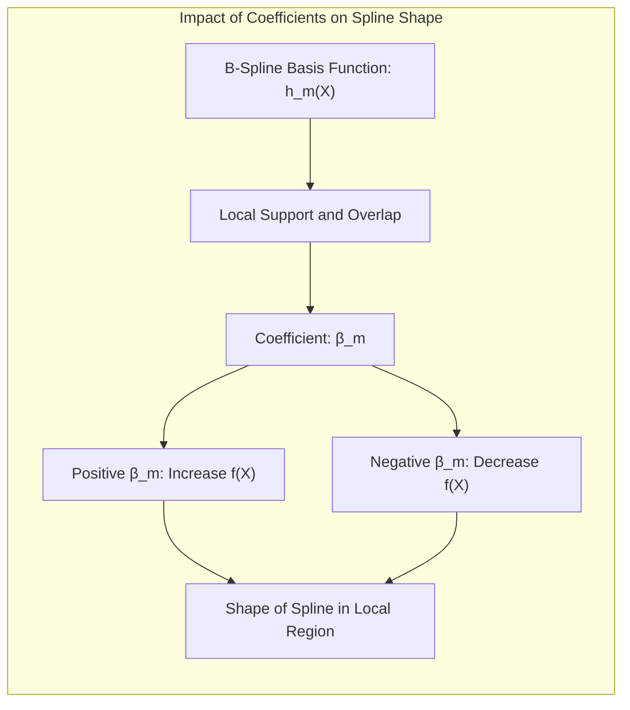

## Coefficients Associated with Spline Basis Functions: Interpreting Model Parameters

### Introdução

No contexto de *basis expansions*, as **funções de base spline**, como splines cúbicos e splines cúbicos naturais, fornecem a flexibilidade para modelar relações não lineares complexas entre as features de entrada e a variável de resposta. No entanto, para entender completamente o comportamento de um modelo com *basis expansions* é fundamental compreender o papel dos **coeficientes** associados às funções de base. Esses coeficientes determinam a contribuição de cada função de base para a predição final do modelo, influenciando a forma geral da função resultante.

Este capítulo se aprofunda na interpretação dos coeficientes associados às funções de base spline, explorando como esses coeficientes influenciam a forma e o comportamento do modelo, e como a regularização pode afetar os valores dos coeficientes e a complexidade do modelo.

### A Relação entre Funções de Base e Coeficientes

Em um modelo com *basis expansions*, a função de predição é dada por uma combinação linear das funções de base e seus respectivos coeficientes [^5.1]:

$$
f(X) = \sum_{m=1}^{M} \beta_m h_m(X)
$$
onde $h_m(X)$ são as funções de base, $M$ é o número de funções de base, e $\beta_m$ são os coeficientes associados. Em um modelo com funções de base spline, as funções $h_m(X)$ são funções splines, como splines cúbicos ou splines cúbicos naturais.

Os **coeficientes** $\beta_m$ determinam a magnitude e a direção do efeito de cada função de base na predição final. Um coeficiente positivo significa que a função de base correspondente contribui para um aumento na predição, enquanto um coeficiente negativo significa que ela contribui para uma diminuição. A magnitude do coeficiente indica a força da influência da função de base na predição.

A forma da função de predição é determinada pela combinação das funções de base e seus respectivos coeficientes. Ao alterar os coeficientes, a função de predição pode ser modificada para se ajustar melhor aos dados, permitindo a modelagem de relações não lineares complexas entre as features de entrada e a variável de resposta.

> 💡 **Exemplo Numérico:**
>
> Suponha que temos um modelo com duas funções de base spline, $h_1(X)$ e $h_2(X)$, e seus respectivos coeficientes $\beta_1 = 2.5$ e $\beta_2 = -1.3$. A função de predição seria:
>
> $$f(X) = 2.5 \cdot h_1(X) - 1.3 \cdot h_2(X)$$
>
> Se em um determinado ponto $X=x_0$, $h_1(x_0) = 0.8$ e $h_2(x_0) = 0.5$, então a predição do modelo nesse ponto seria:
>
> $$f(x_0) = 2.5 \cdot 0.8 - 1.3 \cdot 0.5 = 2.0 - 0.65 = 1.35$$
>
> Isso demonstra que a primeira função de base, com um coeficiente positivo, contribui para aumentar a predição, enquanto a segunda, com um coeficiente negativo, a diminui.

### Interpretação dos Coeficientes em Splines Cúbicos

Em um modelo com **splines cúbicos**, os coeficientes $\beta_m$ associados às funções de base B-spline representam a influência de cada função de base na função resultante. Como as funções B-spline têm suporte local (são não-nulas em um número limitado de intervalos), o coeficiente associado a cada função de base influencia a forma da função de predição principalmente na região onde a função de base é diferente de zero.

No entanto, a interpretação direta dos coeficientes em um modelo com splines cúbicos pode não ser tão simples quanto em modelos lineares mais simples. Isso ocorre porque cada coeficiente não representa o efeito direto de uma feature na variável resposta, mas sim o efeito da função de base correspondente.

Ao analisar um modelo com splines cúbicos, é importante considerar os seguintes aspectos:

1.  **Sinal do Coeficiente:** Um coeficiente positivo indica que a função de base correspondente aumenta o valor da função de predição, enquanto um coeficiente negativo indica que ela diminui o valor da função de predição.
2.  **Magnitude do Coeficiente:** A magnitude do coeficiente indica a força da influência da função de base na predição. Coeficientes com magnitudes maiores têm maior influência na forma do spline.
3. **Efeitos Locais:** Como as funções B-spline têm suporte local, os coeficientes afetam a forma do spline principalmente nas regiões próximas aos nós. A análise do comportamento do spline nesses intervalos é fundamental para entender o efeito dos coeficientes.

> 💡 **Exemplo Numérico:**
>
> Considere um spline cúbico com 3 nós internos, resultando em 6 funções de base B-spline ($M=6$). Os coeficientes estimados são: $\beta = [0.5, -1.2, 2.0, -0.8, 1.5, 0.2]$.
>
> - $\beta_1 = 0.5$: A primeira função de base tem um efeito positivo e relativamente fraco sobre a função de predição na sua região de influência.
> - $\beta_2 = -1.2$: A segunda função de base diminui o valor da função de predição na sua região de influência, com um efeito mais forte do que a primeira função.
> - $\beta_3 = 2.0$: A terceira função de base aumenta fortemente o valor da função de predição na sua região de influência.
> - $\beta_4 = -0.8$: A quarta função de base diminui o valor da função de predição, com efeito moderado.
> - $\beta_5 = 1.5$: A quinta função de base aumenta o valor da função de predição, com efeito relativamente forte.
> - $\beta_6 = 0.2$: A sexta função de base tem um efeito positivo, mas muito fraco.
>
> Podemos ver que o terceiro coeficiente tem o maior efeito local sobre o valor de $f(X)$.

### Interpretação dos Coeficientes em Splines Cúbicos Naturais

Em um modelo com **splines cúbicos naturais**, a interpretação dos coeficientes é semelhante à dos splines cúbicos regulares, mas com algumas nuances:

1. **Restrições nas Extremidades:** A imposição de linearidade nas extremidades dos splines cúbicos naturais significa que os coeficientes associados aos splines mais próximos aos nós dos limites do domínio tem um significado específico: eles garantem a transição para uma função linear na extremidade dos dados.
2. **Interpretação dos Coeficientes:** Os coeficientes representam a influência de cada função de base na função resultante, considerando as restrições de continuidade e de linearidade nas extremidades.
3.  **Efeitos Locais:** Da mesma forma que nos splines cúbicos, os coeficientes em splines cúbicos naturais influenciam a forma da função em regiões próximas aos nós, sendo localizados os seus efeitos.

Em geral, a interpretação dos coeficientes nos splines cúbicos naturais se concentra na avaliação do efeito de cada nó na função, considerando o tipo de restrição utilizada, e se o modelo é linear, ou mais complexo, nos limites dos dados.

> 💡 **Exemplo Numérico:**
>
> Considere um spline cúbico natural com 3 nós internos. Isso resulta em 5 funções de base (2 para as extremidades lineares e 3 para os nós internos). Os coeficientes estimados são: $\beta = [1.0, 0.5, -1.2, 2.0, -0.8]$.
>
> - $\beta_1 = 1.0$: Este coeficiente está associado à função de base que define a parte linear à esquerda do domínio.
> - $\beta_2 = 0.5$: Este coeficiente está associado à função de base que define a parte linear à direita do domínio.
> - $\beta_3 = -1.2$: Este coeficiente influencia a forma do spline na região do primeiro nó interno.
> - $\beta_4 = 2.0$: Este coeficiente tem um forte efeito na região do segundo nó interno.
> - $\beta_5 = -0.8$: Este coeficiente influencia a forma do spline na região do terceiro nó interno.
>
> Os dois primeiros coeficientes ($\beta_1$ e $\beta_2$) garantem a linearidade nas extremidades, enquanto os outros ajustam a curvatura do spline dentro do intervalo de dados.

### Regularização e os Coeficientes do Spline

A **regularização** é uma técnica importante para controlar a complexidade dos modelos com *basis expansions* e evitar o *overfitting*. A aplicação de regularização, como a penalidade $L_1$ ou $L_2$, afeta os coeficientes associados às funções de base spline, restringindo seus valores e induzindo esparsidade ou estabilidade no modelo.

1.  **Regularização $L_1$ (Lasso):** A penalidade $L_1$ adiciona um termo à função de custo que é proporcional à soma dos valores absolutos dos coeficientes. Isso leva a modelos com coeficientes esparsos, ou seja, muitos coeficientes são iguais a zero, o que tem um efeito de seleção de variáveis: apenas as funções de base mais relevantes são mantidas no modelo, e suas localizações definem as principais características de comportamento do modelo.

$$
J(\beta) = \text{Custo do Modelo} + \lambda \sum_{m=1}^{M} |\beta_m|
$$

2. **Regularização $L_2$ (Ridge):** A penalidade $L_2$ adiciona um termo à função de custo que é proporcional à soma dos quadrados dos coeficientes. Isso leva à redução da magnitude dos coeficientes, evitando que o modelo seja muito sensível a variações nos dados de treino. A regularização $L_2$ gera modelos mais estáveis, que generalizam melhor para dados não observados.

$$
J(\beta) = \text{Custo do Modelo} + \lambda \sum_{m=1}^{M} \beta_m^2
$$

3. **Elastic Net:** Combina as penalidades L1 e L2, obtendo um balanço entre estabilidade e esparsidade, sendo apropriada quando se quer fazer seleção de variáveis, mas há correlação entre elas.

O efeito da regularização sobre os coeficientes depende do tipo de penalidade e do valor do parâmetro $\lambda$, que controla a intensidade da regularização. Um $\lambda$ grande implica coeficientes menores e modelos mais estáveis, enquanto um $\lambda$ pequeno implica coeficientes maiores e modelos mais flexíveis.

> 💡 **Exemplo Numérico:**
>
> Vamos considerar um spline cúbico com 5 funções de base e os seguintes coeficientes obtidos sem regularização: $\beta = [2.5, -1.8, 3.2, -2.8, 1.5]$.
>
> 1. **Regularização L1 (Lasso) com $\lambda = 0.5$:** A penalidade L1 pode reduzir alguns coeficientes a zero. Suponha que após a regularização, os coeficientes se tornem: $\beta_{L1} = [1.5, 0, 2.2, -1.0, 0]$. Dois coeficientes foram zerados, indicando que as funções de base correspondentes são menos relevantes para o modelo.
> 2. **Regularização L2 (Ridge) com $\lambda = 0.5$:** A penalidade L2 reduz a magnitude de todos os coeficientes, mas não os zera. Suponha que após a regularização, os coeficientes se tornem: $\beta_{L2} = [1.8, -1.2, 2.5, -1.9, 1.0]$. Todos os coeficientes diminuíram em magnitude, o que torna o modelo mais estável.
>
>
> | Método       | $\beta_1$ | $\beta_2$ | $\beta_3$ | $\beta_4$ | $\beta_5$ |
> |--------------|----------|----------|----------|----------|----------|
> | Sem Regularização | 2.5     | -1.8     | 3.2     | -2.8     | 1.5     |
> | Lasso        | 1.5     | 0        | 2.2     | -1.0     | 0        |
> | Ridge        | 1.8     | -1.2     | 2.5     | -1.9     | 1.0     |
>
> Este exemplo ilustra como a regularização L1 pode levar à seleção de variáveis, enquanto a regularização L2 torna o modelo mais estável, reduzindo a magnitude dos coeficientes.

### Impacto dos Coeficientes na Forma do Spline

A forma da função de predição, em modelos com funções de base spline, é determinada pela combinação dos coeficientes com suas respectivas funções de base. Ao visualizar as funções de base, é possível observar que:

* As funções B-spline de um spline cúbico são funções locais que se sobrepõem parcialmente. Assim, seus coeficientes representam a influência dessa função de base em uma região específica.

* Uma função B-spline com um coeficiente grande e positivo aumenta o valor da função na região de sua influência, e um coeficiente negativo diminui a função nessa região.

* Para um spline cúbico natural, os primeiros coeficientes $(\beta_0, \beta_1)$ estão associados à parte linear da função fora dos limites. Os coeficientes seguintes estão associados aos nós internos e ajustam a forma da função dentro do domínio.

Ao analisar o gráfico da função, é importante considerar a influência de cada coeficiente na região onde sua respectiva função de base tem maior influência.

> 💡 **Exemplo Numérico:**
>
> Suponha que temos um spline cúbico com 3 nós internos, resultando em 6 funções de base. Os coeficientes são: $\beta = [1, -2, 3, -1, 2, -0.5]$. Vamos analisar o impacto de alguns coeficientes no spline:
>
> - Um coeficiente $\beta_3 = 3$ (grande e positivo) fará com que a função de predição aumente significativamente na região onde a terceira função de base tem maior influência.
> - Um coeficiente $\beta_2 = -2$ (grande e negativo) fará com que a função de predição diminua significativamente na região onde a segunda função de base tem maior influência.
> - Um coeficiente $\beta_6 = -0.5$ (pequeno e negativo) terá um impacto menor, diminuindo a função de predição na região da sexta função de base.
>
> A combinação de todos os coeficientes e funções de base resulta na forma final do spline, onde cada coeficiente contribui de acordo com sua magnitude e sinal na região de influência de sua função de base.

### Considerações Práticas

Na prática, ao usar modelos com *basis expansions* spline, é fundamental:

1.  **Entender o Significado das Funções de Base:**  Compreender a forma das funções de base e como elas influenciam o comportamento da função. Isso é fundamental para a interpretação dos coeficientes.
2.  **Avaliar a Magnitude dos Coeficientes:** Avaliar a magnitude dos coeficientes para identificar quais funções de base têm maior impacto na predição. Coeficientes muito pequenos podem ser considerados como pouco relevantes e podem ser descartados através de seleção de variáveis ou *shrinkage*.
3.  **Considerar a Regularização:** Aplicar regularização para controlar a complexidade do modelo e evitar *overfitting*. A regularização pode levar a modelos mais estáveis e interpretáveis.
4.  **Visualizar a Função de Predição:** A visualização da função de predição juntamente com as funções de base é uma ferramenta útil para entender como os coeficientes influenciam o comportamento do modelo e a forma final da função.

### Conclusão

Os coeficientes associados às funções de base spline desempenham um papel fundamental na construção de modelos não lineares eficazes. A compreensão da relação entre os coeficientes, as funções de base e a forma da função de predição é essencial para a correta interpretação dos resultados e para a construção de modelos que capturam a complexidade dos dados. A aplicação de técnicas de regularização permite controlar a complexidade e a estabilidade do modelo, garantindo que ele generalize bem para dados não observados. Ao utilizar splines, a interpretação dos coeficientes torna-se mais complexa, pois cada um influencia a função de forma local. A combinação de conhecimento sobre os modelos e técnicas de visualização é fundamental para a sua utilização.

### Footnotes

[^5.1]: "In this chapter and the next we discuss popular methods for moving beyond linearity. The core idea in this chapter is to augment/replace the vector of inputs X with additional variables, which are transformations of X, and then use linear models in this new space of derived input features." *(Trecho de <Basis Expansions and Regularization>)*
