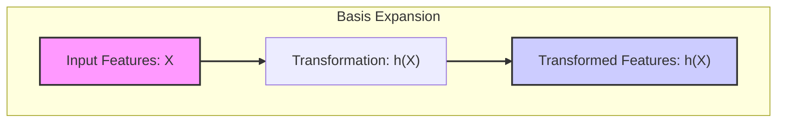

```markdown
## Basis Expansions: A Foundational Concept



### Introduction to Basis Expansions

At its core, the concept of **basis expansions** involves transforming the original set of input features, often denoted as $X$, into a new set of features, represented by $h(X)$, in a higher-dimensional space. The goal of this transformation is to enable models to capture complex, non-linear relationships within the data, relationships that would be impossible to model using only the original, untransformed features. This is because linear models, by their very nature, assume a linear relationship between features and response. When this assumption is violated, basis expansions provide a way to overcome this limitation by creating a new feature space where linearity *can* be a reasonable assumption. The beauty of the approach lies in its simplicity: while the transformation of the features $X$ is non-linear, the model is *linear in the transformed space* [^5.1]. This allows us to leverage well-understood linear models and fitting procedures, while modeling non-linear effects. This is achieved using what is known as *basis functions*, which will be discussed in further detail. Essentially, we use basis expansions as a technique for enriching our data representation, enhancing the expressive power of linear models without resorting to complex non-linear methods at the outset.

[^5.1]: "In this chapter and the next we discuss popular methods for moving beyond linearity. The core idea in this chapter is to augment/replace the vector of inputs X with additional variables, which are transformations of X, and then use linear models in this new space of derived input features." *(Trecho de <Basis Expansions and Regularization>)*

> 💡 **Exemplo Numérico:**
>
> Let's consider a simple scenario where we have a single input feature, $X$, representing the number of hours studied, and a corresponding output, $Y$, representing the exam score. Suppose our data reveals a non-linear relationship, where the score increases rapidly initially with study time but then plateaus.
>
> **Original Feature Space:**  We start with a single feature, $X = $ [1, 2, 3, 4, 5], representing hours studied.
>
> **Basis Expansion:** We can introduce a new feature by squaring the original feature, resulting in $h(X) = [X, X^2]$. Thus, our transformed feature matrix would be:
>
> $$h(X) = \begin{bmatrix} 1 & 1 \\ 2 & 4 \\ 3 & 9 \\ 4 & 16 \\ 5 & 25 \end{bmatrix}$$
>
> Now, we have two features: $X_1 = X$ and $X_2 = X^2$.
>
> **Linear Model in Transformed Space:** We can now fit a linear model in the transformed space:
>
> $$Y = \beta_0 + \beta_1 X_1 + \beta_2 X_2 + \epsilon$$

```mermaid
graph LR
    subgraph "Quadratic Basis Expansion"
        direction TB
        A["Original Feature: X"] --> B["Transformed Features: X_1 = X, X_2 = X^2"]
        B --> C["Linear Model: Y = β₀ + β₁X₁ + β₂X₂ + ε"]
    end
    style A fill:#f9f,stroke:#333,stroke-width:2px
    style B fill:#ccf,stroke:#333,stroke-width:2px
    style C fill:#9cf,stroke:#333,stroke-width:2px
        linkStyle 0,1 stroke-width:2px
        linkStyle 1,2 stroke-width:2px
```

>
> Let's assume, after fitting the linear model to some generated data, we obtain the following parameters: $\beta_0 = 20$, $\beta_1 = 10$, and $\beta_2 = -1$. This leads to the prediction equation:
>
> $$\hat{Y} = 20 + 10X - X^2$$
>
> This quadratic model can now capture the non-linear relationship between study hours and exam scores, something a simple linear model $Y = \beta_0 + \beta_1 X$ couldn't achieve.
>
> **Interpretation:** The coefficient $\beta_1 = 10$ indicates an initial positive impact of study time, while $\beta_2 = -1$ shows that this positive effect diminishes at higher study times, capturing the plateau effect. The intercept $\beta_0 = 20$ represents the baseline score when no study is done. This demonstrates how basis expansion allows linear models to capture nonlinear patterns. The model still uses linear regression but operates on a transformed version of input data.

> 💡 **Exemplo Numérico:**
>
> Consider a dataset where the input is a single feature $X$ and the output is $Y$, showing a sinusoidal relationship. Let's say $X$ represents time in days and $Y$ represents a cyclical phenomenon such as temperature variation.
>
> **Original Feature Space:** The original feature is simply $X$, a sequence of days: $X = [1, 2, 3, 4, 5, 6, 7]$. A simple linear model might not capture the cyclical nature of the data.
>
> **Basis Expansion using Sine and Cosine:** We can use trigonometric functions as our basis. We'll create two new features using sine and cosine: $h(X) = [\sin(X), \cos(X)]$.
>
> Here, we are assuming $X$ represents radians. To convert days to radians, we need to multiply by a scaling factor, lets use a factor of $\frac{2\pi}{7}$ to complete one cycle per week.
>
> $$X_{radians} = X * \frac{2\pi}{7} $$
>
>  $$h(X) = [\sin(X_{radians}), \cos(X_{radians})]$$
>
>   $$h(X) = \begin{bmatrix} \sin(\frac{2\pi}{7}) & \cos(\frac{2\pi}{7}) \\ \sin(\frac{4\pi}{7}) & \cos(\frac{4\pi}{7}) \\ \sin(\frac{6\pi}{7}) & \cos(\frac{6\pi}{7}) \\ \sin(\frac{8\pi}{7}) & \cos(\frac{8\pi}{7}) \\ \sin(\frac{10\pi}{7}) & \cos(\frac{10\pi}{7}) \\ \sin(\frac{12\pi}{7}) & \cos(\frac{12\pi}{7}) \\ \sin(\frac{14\pi}{7}) & \cos(\frac{14\pi}{7}) \end{bmatrix} \approx \begin{bmatrix} 0.8 & 0.6 \\ 0.98 & -0.22 \\ 0.43 & -0.9 \\ -0.43 & -0.9 \\ -0.98 & -0.22 \\ -0.8 & 0.6 \\ 0 & 1 \end{bmatrix}$$

```mermaid
graph LR
    subgraph "Trigonometric Basis Expansion"
        direction TB
        A["Original Feature: X (Days)"] --> B["Convert to Radians: X_radians = X * (2π/7)"]
        B --> C["Transformed Features: X_1 = sin(X_radians), X_2 = cos(X_radians)"]
        C --> D["Linear Model: Y = β₀ + β₁sin(X_radians) + β₂cos(X_radians) + ε"]

    end
        style A fill:#f9f,stroke:#333,stroke-width:2px
        style B fill:#ccf,stroke:#333,stroke-width:2px
        style C fill:#9cf,stroke:#333,stroke-width:2px
        style D fill:#9ff,stroke:#333,stroke-width:2px
        linkStyle 0,1 stroke-width:2px
        linkStyle 1,2 stroke-width:2px
        linkStyle 2,3 stroke-width:2px
```

>
> **Linear Model in Transformed Space:** We model the relationship as:
>
> $$Y = \beta_0 + \beta_1 \sin(X_{radians}) + \beta_2 \cos(X_{radians}) + \epsilon$$
>
> After fitting, let's assume we get the coefficients: $\beta_0 = 15, \beta_1 = 5, \beta_2 = 10$. Then the prediction would be:
>
> $$\hat{Y} = 15 + 5\sin(X_{radians}) + 10\cos(X_{radians})$$
>
> **Interpretation:** This model can now capture the sinusoidal pattern in the data. The coefficients $\beta_1$ and $\beta_2$ control the amplitude and phase of the sinusoidal wave, allowing the model to fit the cyclical temperature variation. The intercept $\beta_0 = 15$ is the average temperature. This showcases how basis expansions can transform a linear model into a more flexible tool, capable of capturing complex patterns.
```
