## The Basis Matrix H: Representing Transformed Features


### Defining the Basis Matrix H

In the context of basis expansions, the **basis matrix H** is a crucial element, forming a bridge between the original input features and the transformed feature space where linear models are applied. The matrix $H$ is essentially a collection of all the basis functions $h_m(X)$, evaluated at each data point. Each row of the matrix corresponds to a specific data point, and each column corresponds to a specific basis function. Therefore, if we have $N$ data points and $M$ basis functions, the basis matrix $H$ will have dimensions of $N \times M$. This matrix effectively transforms the original feature space to a richer space that allows for modelling of non-linear relations. Therefore, the basis matrix $H$ provides a numerical representation of the transformed feature space and allows for easy matrix manipulation for applying linear models in the new feature space. The construction of this matrix is a crucial step in transforming the data into a more meaningful format for modelling purposes.

[^5.1]: "In this chapter and the next we discuss popular methods for moving beyond linearity. The core idea in this chapter is to augment/replace the vector of inputs X with additional variables, which are transformations of X, and then use linear models in this new space of derived input features." *(Trecho de <Basis Expansions and Regularization>)*

> 💡 **Exemplo Numérico:**
>
> Let's consider a simple dataset with $N=3$ data points and a single input feature $X$. The input feature values are $x_1=1$, $x_2=2$, and $x_3=3$. We'll use two basis functions:
>
>  -  $h_1(x) = 1$ (a constant basis function, which allows for an intercept term)
>  -  $h_2(x) = x^2$ (a quadratic basis function).
>
>  Our goal is to construct the basis matrix $H$.
>
>  **Step 1:** Evaluate the basis functions at each data point.
>
>  For $x_1 = 1$:
>  - $h_1(x_1) = 1$
>  - $h_2(x_1) = 1^2 = 1$
>
>  For $x_2 = 2$:
>  - $h_1(x_2) = 1$
>  - $h_2(x_2) = 2^2 = 4$
>
>  For $x_3 = 3$:
>  - $h_1(x_3) = 1$
>  - $h_2(x_3) = 3^2 = 9$
>
>  **Step 2:** Arrange these values into the basis matrix $H$. The rows represent data points, and the columns represent basis functions.
>
>  $H = \begin{bmatrix}
>  h_1(x_1) & h_2(x_1) \\
>  h_1(x_2) & h_2(x_2) \\
>  h_1(x_3) & h_2(x_3)
> \end{bmatrix} = \begin{bmatrix}
>  1 & 1 \\
>  1 & 4 \\
>  1 & 9
> \end{bmatrix}$
>
>  The resulting matrix $H$ is a $3 \times 2$ matrix. The first column corresponds to the constant basis function ($h_1(x) = 1$), and the second column corresponds to the quadratic basis function ($h_2(x) = x^2$). This matrix $H$ will now be used in place of the original $X$ matrix in any linear model, allowing us to fit a quadratic function to the data.

```mermaid
graph LR
    subgraph "Basis Function Evaluation"
        direction TB
        A["Input Data Points: xᵢ"]
        B["Basis Function: hₘ(x)"]
        C["Evaluated Basis Functions: hₘ(xᵢ)"]
        A --> B
        B --> C
    end
```



>
>  The transformed features are now represented by the columns of H. Instead of fitting a linear model to just $x$, we are fitting a linear model to $1$ and $x^2$. This is how the basis functions allow us to model non-linear relationships.
>
>  ```python
>  import numpy as np
>
>  X = np.array([1, 2, 3])
>
>  # Define the basis functions
>  def h1(x):
>      return np.ones_like(x)
>
>  def h2(x):
>      return x**2
>
>  # Construct the basis matrix H
>  H = np.column_stack([h1(X), h2(X)])
>
>  print("Basis Matrix H:\n", H)
>  ```
>
>  This Python code will output:
>
>  ```
>  Basis Matrix H:
>  [[1. 1.]
>  [1. 4.]
>  [1. 9.]]
>  ```
>
>  The matrix $H$ now represents the transformed feature space, and a linear model can be applied to it to fit a potentially non-linear relationship in the original feature space.

