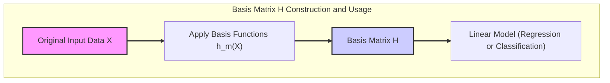
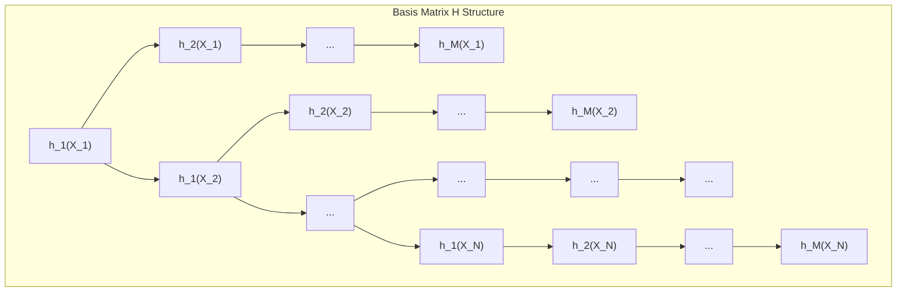

## Building and Applying the Basis Matrix H



### Building the Basis Matrix H

The process of building the basis matrix $H$ involves evaluating each basis function $h_m(X)$ at each data point $X_i$. Suppose we have $N$ data points represented by the matrix $X = [X_1, X_2, \ldots, X_N]^T$, where each $X_i$ is a feature vector, and $M$ basis functions $h_1(X), h_2(X), \ldots, h_M(X)$. The basis matrix $H$ is then constructed as follows:

$$
H =
\begin{bmatrix}
h_1(X_1) & h_2(X_1) & \dots & h_M(X_1) \\
h_1(X_2) & h_2(X_2) & \dots & h_M(X_2) \\
\vdots & \vdots & \ddots & \vdots \\
h_1(X_N) & h_2(X_N) & \dots & h_M(X_N)
\end{bmatrix}
$$



Each element $H_{im}$ of the matrix is obtained by evaluating the basis function $h_m(X)$ at the data point $X_i$, i.e., $H_{im} = h_m(X_i)$. Therefore, the first row of H contains the evaluation of all basis functions at the first data point $X_1$, the second row at $X_2$, and so on, resulting in an $N \times M$ matrix. The choice of basis function and number of basis functions dictates the structure of matrix $H$, and its subsequent use in linear models. The construction of $H$ effectively transforms the original feature space to a new, and richer, feature space where the data will be used in a linear model.

> 💡 **Exemplo Numérico:**
>
> Let's consider a simple case with $N=3$ data points and $M=2$ basis functions. Suppose our input data $X$ consists of single values (i.e., $X_i$ are scalars):
>
> $X = \begin{bmatrix} 1 \\ 2 \\ 3 \end{bmatrix}$
>
> Let's define our basis functions as:
>
> $h_1(X) = X$  (identity function)
> $h_2(X) = X^2$ (quadratic function)
>
> Now, we'll evaluate each basis function at each data point to build the matrix $H$.
>
> $H_{11} = h_1(X_1) = h_1(1) = 1$
> $H_{12} = h_2(X_1) = h_2(1) = 1^2 = 1$
>
> $H_{21} = h_1(X_2) = h_1(2) = 2$
> $H_{22} = h_2(X_2) = h_2(2) = 2^2 = 4$
>
> $H_{31} = h_1(X_3) = h_1(3) = 3$
> $H_{32} = h_2(X_3) = h_2(3) = 3^2 = 9$
>
> Thus, the basis matrix $H$ is:
>
> $H = \begin{bmatrix} 1 & 1 \\ 2 & 4 \\ 3 & 9 \end{bmatrix}$
>
> This matrix $H$ now represents our data in a transformed space, using the defined basis functions. Instead of just the original values of X, we have both the values and their squares. This transformed data is what we would use in a linear model.
>
> ```python
> import numpy as np
>
> X = np.array([[1], [2], [3]])
>
> def h1(x):
>   return x
>
> def h2(x):
>   return x**2
>
> H = np.array([[h1(xi[0]), h2(xi[0])] for xi in X])
> print("Basis matrix H:\n", H)
> ```
>
> Output:
> ```
> Basis matrix H:
> [[1. 1.]
>  [2. 4.]
>  [3. 9.]]
> ```

[^5.1]: "In this chapter and the next we discuss popular methods for moving beyond linearity. The core idea in this chapter is to augment/replace the vector of inputs X with additional variables, which are transformations of X, and then use linear models in this new space of derived input features." *(Trecho de <Basis Expansions and Regularization>)*
