## Basis Expansions: Re-emphasizing the Core Idea


### Re-emphasizing the Core Concept

The core idea of **basis expansions** lies in the strategic augmentation of the input feature space. Instead of directly using the original features $X$ in a model, we first apply a series of transformations using what are known as *basis functions* $h_m(X)$, creating a new set of features. These transformed features, $h_1(X), h_2(X), \ldots, h_M(X)$, form a new representation of the data in a (usually) higher-dimensional space where linear models can be effectively applied. The essence is to capture non-linear relationships through the transformation of the input data rather than using complex non-linear modeling techniques directly on the original space. The basis functions, $h_m(X)$, are predetermined and are known a priori to the model. The model then combines these features linearly through its coefficients. Therefore, while the relationship between $X$ and $h(X)$ may be non-linear, the relationship between $h(X)$ and the outcome in our model is linear. This clever trick allows us to use familiar linear models, such as linear regression or logistic regression, on a richer feature space [^5.1].

```mermaid
graph LR
    subgraph "Basis Expansion Process"
    direction TB
    A["Original Features 'X'"]
    B["Basis Functions 'h_m(X)'"]
    C["Transformed Features 'h_1(X), h_2(X), ..., h_M(X)'"]
    D["Linear Model: 'ŷ = β_0 + Σβ_m h_m(X)'"]
    A --> B
    B --> C
    C --> D
    style A fill:#f9f,stroke:#333,stroke-width:2px
    style C fill:#ccf,stroke:#333,stroke-width:2px
    end
```

[^5.1]: "In this chapter and the next we discuss popular methods for moving beyond linearity. The core idea in this chapter is to augment/replace the vector of inputs X with additional variables, which are transformations of X, and then use linear models in this new space of derived input features." *(Trecho de <Basis Expansions and Regularization>)*



> 💡 **Exemplo Numérico:**
>
> Let's consider a simple case where we have a single input feature, $X$, representing the age of a car, and we want to predict its price, $y$. Suppose the relationship between age and price is not linear. Instead of directly fitting a line to $X$ and $y$, we can use basis expansions.
>
> 1. **Original Feature:** $X$ = Age (e.g., 1, 2, 3, 4, 5 years).
> 2. **Basis Functions:** We can choose polynomial basis functions:
>    - $h_1(X) = X$ (linear term)
>    - $h_2(X) = X^2$ (quadratic term)
>
> 3. **Transformed Features:**
>    - $h_1(X) = [1, 2, 3, 4, 5]$
>    - $h_2(X) = [1, 4, 9, 16, 25]$
>
> Now, our model will use these transformed features to predict the price. The model is:
>
> $$\hat{y} = \beta_0 + \beta_1 h_1(X) + \beta_2 h_2(X) = \beta_0 + \beta_1 X + \beta_2 X^2$$
>
> This is still a linear model *in the transformed space*, even though it represents a quadratic relationship with respect to the original input $X$.
>
> Let's assume our model, after training on some data, finds the following coefficients: $\beta_0 = 10000$, $\beta_1 = -2000$, and $\beta_2 = 300$. Then, for a car that is 3 years old, the predicted price would be:
>
> $$\hat{y} = 10000 - 2000 \times 3 + 300 \times 3^2 = 10000 - 6000 + 2700 = 6700$$
>
> The key takeaway here is that we transformed the input feature $X$ into a new space using $h_1(X)$ and $h_2(X)$. The model then learned coefficients $\beta_0, \beta_1, \beta_2$ to fit the data in this new space, which allowed it to capture the non-linear relationship between age and price.

```mermaid
graph LR
    subgraph "Polynomial Basis Expansion"
    direction TB
    A["Original Input 'X'"]
    B["Basis Function 'h_1(X) = X'"]
    C["Basis Function 'h_2(X) = X²'"]
    D["Transformed Features 'h_1(X), h_2(X)'"]
    E["Linear Model: 'ŷ = β_0 + β_1 h_1(X) + β_2 h_2(X)'"]
    A --> B
    A --> C
    B & C --> D
    D --> E
    end
```



> 💡 **Exemplo Numérico:**
>
> Let's consider a second example with a more complex basis expansion using sine waves. Suppose we have a single feature $X$ representing time in hours (0 to 24) and we are trying to model temperature fluctuations, $y$.
>
> 1. **Original Feature:** $X$ = Time in hours (e.g., 0, 6, 12, 18, 24).
> 2. **Basis Functions:** We choose sine and cosine functions with different frequencies:
>    - $h_1(X) = \sin(\frac{2\pi}{24}X)$
>    - $h_2(X) = \cos(\frac{2\pi}{24}X)$
>    - $h_3(X) = \sin(\frac{4\pi}{24}X)$
>    - $h_4(X) = \cos(\frac{4\pi}{24}X)$
>
> 3. **Transformed Features:**
> Using numpy we can calculate the transformed features
> ```python
> import numpy as np
>
> X = np.array([0, 6, 12, 18, 24])
> h1 = np.sin(2 * np.pi / 24 * X)
> h2 = np.cos(2 * np.pi / 24 * X)
> h3 = np.sin(4 * np.pi / 24 * X)
> h4 = np.cos(4 * np.pi / 24 * X)
>
> print("h1:", h1)
> print("h2:", h2)
> print("h3:", h3)
> print("h4:", h4)
> ```
> This will output:
> ```
> h1: [ 0.          1.          1.2246468e-16 -1.         -2.4492936e-16]
> h2: [ 1.  6.1232340e-17 -1. -1.8369702e-16  1.        ]
> h3: [ 0.          0.          0.         -0.         -2.4492936e-16]
> h4: [ 1.  -1.   1.  -1.   1.]
> ```
>
> 4. **Linear Model:** Our model will be:
>
> $$\hat{y} = \beta_0 + \beta_1 h_1(X) + \beta_2 h_2(X) + \beta_3 h_3(X) + \beta_4 h_4(X)$$
>
>  Let's assume our model, after training, finds the following coefficients: $\beta_0 = 20$, $\beta_1 = 5$, $\beta_2 = 10$, $\beta_3 = -2$, and $\beta_4 = 3$. Then, for the time of 6 hours:
>
> $$\hat{y} = 20 + 5 \times 1 + 10 \times 6.1232340e-17 - 2 \times 0 + 3 \times -1 = 20 + 5 + 0 - 0 - 3 = 22$$
>
> This model uses sine and cosine functions to capture the cyclical nature of temperature changes throughout the day. The basis expansion allows us to use a linear model to fit complex, non-linear patterns.

```mermaid
graph LR
    subgraph "Trigonometric Basis Expansion"
    direction TB
    A["Original Input 'X'"]
    B["Basis Function 'h_1(X) = sin(2πX/24)'"]
    C["Basis Function 'h_2(X) = cos(2πX/24)'"]
    D["Basis Function 'h_3(X) = sin(4πX/24)'"]
    E["Basis Function 'h_4(X) = cos(4πX/24)'"]
    F["Transformed Features 'h_1(X), h_2(X), h_3(X), h_4(X)'"]
    G["Linear Model: 'ŷ = β_0 + β_1h_1(X) + β_2h_2(X) + β_3h_3(X) + β_4h_4(X)'"]
    A --> B
    A --> C
    A --> D
    A --> E
    B & C & D & E --> F
    F --> G
    end
```



These examples show how the same linear model can be used to fit non-linear data by transforming the original features into a new space using basis functions.
