```mermaid
graph LR
    subgraph "Effect of λ on Model Selection"
    direction LR
        A["'Small λ'"] -- "Favors" --> B["'Closer Fit to Data'"]
        A -- "Balances" --> C["'Less Smooth Function'"]
        D["'Large λ'"] -- "Favors" --> E["'Smoother Function'"]
        D -- "Balances" --> F["'Potentially Lower Fit to Data'"]
    end
```

## The Penalized Residual Sum of Squares Criterion: Balancing Fit and Smoothness

```mermaid
graph LR
    subgraph "Penalized RSS Criterion"
    direction TB
        A["'Penalized RSS(f, λ)'"]
        B["'Residual Sum of Squares: ∑(yᵢ - f(xᵢ))²'"]
        C["'Penalty Term: λ∫[f''(t)]²dt'"]
        A --> B
        A --> C
    end
    style A fill:#f9f,stroke:#333,stroke-width:2px
```

### Defining the Penalized Residual Sum of Squares Criterion

The **penalized residual sum of squares (RSS)** criterion is a fundamental concept in statistical modeling that seeks to find a balance between fitting the data well and maintaining a smooth and interpretable function. It’s particularly important in models using *basis expansions* that aim to model non-linear relations, specifically in techniques like smoothing splines. The penalized RSS criterion is a combination of two parts: the residual sum of squares (RSS), which measures how well the model fits the training data, and a penalty term, which measures the "roughness" or complexity of the function. This balance is essential to avoid overfit and to obtain models that generalize well to new, unseen data. The penalized RSS is defined as:

$$
RSS(f, \lambda) = \sum_{i=1}^{N} (y_i - f(x_i))^2 + \lambda \int [f''(t)]^2 dt
$$

where $y_i$ is the observed response, $f(x_i)$ is the predicted value at data point $x_i$, and $\lambda$ is the smoothing parameter. The first term, the residual sum of squares, measures the difference between predicted and observed values, quantifying how well the model fits the training data. The second term is the penalty term, which penalizes roughness in the function $f$. The value of the smoothing parameter $\lambda$ controls the relative importance of these two terms, effectively balancing fit and smoothness. In essence, the penalized RSS criterion seeks to find a function that both closely fits the training data and also behaves smoothly, rather than being too irregular and too specific to the data used to build the model.

```mermaid
graph LR
    subgraph "Components of the Penalty Term"
        direction TB
        A["'Penalty Term: λ∫[f''(t)]²dt'"]
        B["'Smoothing Parameter: λ'"]
        C["'Integral of Squared Second Derivative: ∫[f''(t)]²dt'"]
        A --> B
        A --> C
    end
```

> 💡 **Exemplo Numérico:**
>
> Let's consider a simplified scenario with a small dataset and a hypothetical function *f(x)*. Assume we have three data points: $(x_1, y_1) = (1, 2.5)$, $(x_2, y_2) = (2, 3.1)$, and $(x_3, y_3) = (3, 4.8)$. We will also assume that we are using a smoothing spline, and for simplicity, let's pretend we have two possible functions, $f_1(x)$ and $f_2(x)$ that are being considered.
>
> Suppose that at the points $x_1$, $x_2$, and $x_3$ the functions return the following values:
>
> - $f_1(1) = 2.4$,  $f_1(2) = 3.2$, $f_1(3) = 4.7$
> - $f_2(1) = 2.0$,  $f_2(2) = 3.0$, $f_2(3) = 5.0$
>
> We will also assume that the integral of the squared second derivative of the functions, $\int [f''(t)]^2 dt$, is:
>
> - $\int [f_1''(t)]^2 dt = 0.2$
> - $\int [f_2''(t)]^2 dt = 1.0$
>
> This implies that $f_1$ is smoother than $f_2$.
>
> Now, let’s calculate the penalized RSS for these two functions with different values of $\lambda$.
>
> **For $\lambda = 0.1$:**
>
> **Function $f_1$:**
>
> $RSS(f_1, 0.1) = [(2.5 - 2.4)^2 + (3.1 - 3.2)^2 + (4.8 - 4.7)^2] + 0.1 * 0.2$
>
> $RSS(f_1, 0.1) = [0.01 + 0.01 + 0.01] + 0.02 = 0.03 + 0.02 = 0.05$
>
> **Function $f_2$:**
>
> $RSS(f_2, 0.1) = [(2.5 - 2.0)^2 + (3.1 - 3.0)^2 + (4.8 - 5.0)^2] + 0.1 * 1.0$
>
> $RSS(f_2, 0.1) = [0.25 + 0.01 + 0.04] + 0.1 = 0.3 + 0.1 = 0.4$
>
> **For $\lambda = 1.0$:**
>
> **Function $f_1$:**
>
> $RSS(f_1, 1.0) = [(2.5 - 2.4)^2 + (3.1 - 3.2)^2 + (4.8 - 4.7)^2] + 1.0 * 0.2$
>
> $RSS(f_1, 1.0) = [0.01 + 0.01 + 0.01] + 0.2 = 0.03 + 0.2 = 0.23$
>
> **Function $f_2$:**
>
> $RSS(f_2, 1.0) = [(2.5 - 2.0)^2 + (3.1 - 3.0)^2 + (4.8 - 5.0)^2] + 1.0 * 1.0$
>
> $RSS(f_2, 1.0) = [0.25 + 0.01 + 0.04] + 1.0 = 0.3 + 1.0 = 1.3$
>
> **Analysis:**
>
> | Function | $\lambda$ | RSS | Residual Sum of Squares | Penalty Term |
> |----------|----------|-----|-------------------------|--------------|
> | $f_1$    | 0.1      | 0.05| 0.03                    | 0.02         |
> | $f_2$    | 0.1      | 0.4 | 0.3                     | 0.1          |
> | $f_1$    | 1.0      | 0.23| 0.03                    | 0.2          |
> | $f_2$    | 1.0      | 1.3 | 0.3                     | 1.0          |
>
> - When $\lambda = 0.1$, $f_1$ has a much lower penalized RSS (0.05) than $f_2$ (0.4), indicating it's a better choice. This is because both functions fit the data reasonably well, but $f_1$ is smoother.
> - When $\lambda = 1.0$, the penalty term becomes more significant. While $f_1$ still has a lower RSS, the difference is more pronounced because the penalty for $f_2$'s roughness is much higher.
>
> In this example, by changing $\lambda$, we can see how the penalized RSS criterion balances the fit to data and the smoothness of the function. A smaller $\lambda$ favors fitting the data closely, while a larger $\lambda$ favors smoother functions. This illustrates the core concept of the penalized RSS and its role in regularization.
>
> In practice, the optimal value for $\lambda$ is often chosen using cross-validation techniques, to ensure good generalization performance on unseen data.
>

[^5.4]: "Here we discuss a spline basis method that avoids the knot selection problem completely by using a maximal set of knots. The complexity of the fit is controlled by regularization. Consider the following problem: among all functions f(x) with two continuous derivatives, find one that minimizes the penalized residual sum of squares" *(Trecho de <Basis Expansions and Regularization>)*
