```mermaid
graph LR
    subgraph "Simplified Penalized RSS"
        direction LR
        A["RSS(f, λ)"] --> B["RSS Term: ∑(yᵢ - f̂(xᵢ))²"]
        A --> C["Simplified Penalty Term: λ∑(f̂(xᵢ₊₁) - 2f̂(xᵢ) + f̂(xᵢ₋₁))²"]
        B --> D["Data Fit"]
        C --> E["Approximate Roughness"]
         D & E --> F["Model Optimization"]
    end
```

## The Smoothing Parameter λ: Balancing Fit and Regularization

```mermaid
graph LR
    subgraph "Smoothing Parameter λ Effect"
        direction LR
        A["λ → 0"] --> B["Model fits data closely"]
        B --> C["Wiggly function"]
        A["λ → ∞"] --> D["Model becomes smoother"]
        D --> E["Deviates from data"]
    end
```

### Defining the Smoothing Parameter λ

The **smoothing parameter**, often denoted by the Greek letter $\lambda$, is a crucial hyperparameter in the penalized residual sum of squares (RSS) criterion, and plays a pivotal role in balancing the fit of a model to the data and the complexity, or smoothness, of the fitted function. It directly controls the amount of regularization applied in the model, specifically in the case of splines and smoothing splines. As seen previously, the penalized RSS criterion is given by:

$$
RSS(f, \lambda) = \sum_{i=1}^{N} (y_i - f(x_i))^2 + \lambda \int [f''(t)]^2 \, dt
$$

```mermaid
graph LR
    subgraph "Penalized RSS Criterion"
        direction LR
        A["RSS(f, λ)"] --> B["Residual Sum of Squares: ∑(yᵢ - f(xᵢ))²"]
        A --> C["Penalty Term: λ∫[f''(t)]² dt"]
        B --> D["Data Fit"]
        C --> E["Roughness of f(x)"]
        D & E --> F["Model Optimization"]
    end
```

The first term, the residual sum of squares (RSS), measures how well the model fits the training data. The second term, known as the *penalty term*, measures the "roughness" of the function $f$. The smoothing parameter $\lambda$ acts as a weight, dictating the relative importance of these two terms in the overall optimization. A higher value of $\lambda$ emphasizes the penalty term, favouring smoother solutions and accepting a potentially worse fit to the training data; a lower value of $\lambda$ gives higher importance to the fit, accepting a more complex and potentially wiggly function. Therefore, choosing an appropriate value for the smoothing parameter is fundamental in order to find a model that is not overfitting but still captures the most important patterns in the data.

> 💡 **Exemplo Numérico:**
>
> Let's consider a simple dataset where we have 5 data points $(x_i, y_i)$:
>
> $(1, 2.5), (2, 3.1), (3, 3.8), (4, 4.4), (5, 5.0)$
>
> We will fit a smoothing spline to this data and observe how different values of $\lambda$ affect the resulting fit. We'll use a simplified version of the penalty term, for illustrative purposes, and assume that the function's roughness can be approximated by the sum of squared second differences in the function values at the data points.
>
> Let's denote the fitted values as $\hat{f}(x_i)$.  Our simplified penalized RSS becomes:
>
> $$
> RSS(f, \lambda) = \sum_{i=1}^{5} (y_i - \hat{f}(x_i))^2 + \lambda \sum_{i=2}^{4} (\hat{f}(x_{i+1}) - 2\hat{f}(x_i) + \hat{f}(x_{i-1}))^2
> $$

>
> **Case 1: Small λ (e.g., λ = 0.1)**
>
> With a small $\lambda$, the RSS term dominates.  This means the model will try to fit the data points very closely, potentially resulting in a wiggly curve. Assume we obtain the following fitted values (these are for illustrative purposes and would normally be found by optimization):
>
> $\hat{f}(1) = 2.45, \hat{f}(2) = 3.05, \hat{f}(3) = 3.85, \hat{f}(4) = 4.35, \hat{f}(5) = 5.05$
>
> The RSS is calculated as:
>
> $RSS = (2.5-2.45)^2 + (3.1-3.05)^2 + (3.8-3.85)^2 + (4.4-4.35)^2 + (5.0-5.05)^2 = 0.0125$
>
> The penalty term is:
>
> $Penalty = (3.85 - 2*3.05 + 2.45)^2 + (4.35 - 2*3.85 + 3.05)^2 + (5.05 - 2*4.35 + 3.85)^2= 0.01 + 0.01 + 0.01 = 0.03$
>
> The penalized RSS becomes:
>
> $Penalized \, RSS = 0.0125 + 0.1 * 0.03 = 0.0155$
>
>
> **Case 2: Large λ (e.g., λ = 10)**
>
> With a large $\lambda$, the penalty term dominates. The model will prioritize smoothness over fitting the data exactly. Assume the fitted values are now:
>
> $\hat{f}(1) = 2.6, \hat{f}(2) = 3.0, \hat{f}(3) = 3.8, \hat{f}(4) = 4.3, \hat{f}(5) = 4.9$
>
> The RSS is calculated as:
>
> $RSS = (2.5-2.6)^2 + (3.1-3.0)^2 + (3.8-3.8)^2 + (4.4-4.3)^2 + (5.0-4.9)^2 = 0.04$
>
> The penalty term is:
>
> $Penalty = (3.8 - 2*3.0 + 2.6)^2 + (4.3 - 2*3.8 + 3.0)^2 + (4.9 - 2*4.3 + 3.8)^2 = 0.64 + 0.25 + 0.09 = 0.98$
>
> The penalized RSS becomes:
>
> $Penalized \, RSS = 0.04 + 10 * 0.98 = 9.84$
>
> **Comparison:**
>
> | λ  | RSS   | Penalty | Penalized RSS | Fit   | Smoothness |
> |----|-------|---------|---------------|-------|------------|
> | 0.1| 0.0125 | 0.03    | 0.0155        | Good  | Low        |
> | 10 | 0.04   | 0.98    | 9.84        | Worse | High       |
>
> As we can see, a small $\lambda$ leads to a better fit (lower RSS) but a more wiggly curve (lower smoothness).  A large $\lambda$ leads to a worse fit but a smoother curve. This illustrates the trade-off controlled by the smoothing parameter.

```mermaid
graph LR
    subgraph "λ Trade-off"
        direction LR
        A["Small λ"] --> B["Lower RSS"]
        B --> C["Better Fit"]
        A --> D["Lower Smoothness"]
        D --> E["Wiggly Curve"]
        F["Large λ"] --> G["Higher RSS"]
        G --> H["Worse Fit"]
        F --> I["Higher Smoothness"]
        I --> J["Smoother Curve"]
        C & E & H & J --> K["Trade-Off"]
    end
```

>
> In practice, the fitted values and the optimal $\lambda$ would be found by an optimization algorithm. The values used here are just for illustrative purposes to demonstrate the effect of different lambda values.

[^5.4]: "Here we discuss a spline basis method that avoids the knot selection problem completely by using a maximal set of knots. The complexity of the fit is controlled by regularization. Consider the following problem: among all functions f(x) with two continuous derivatives, find one that minimizes the penalized residual sum of squares" *(Trecho de <Basis Expansions and Regularization>)*
