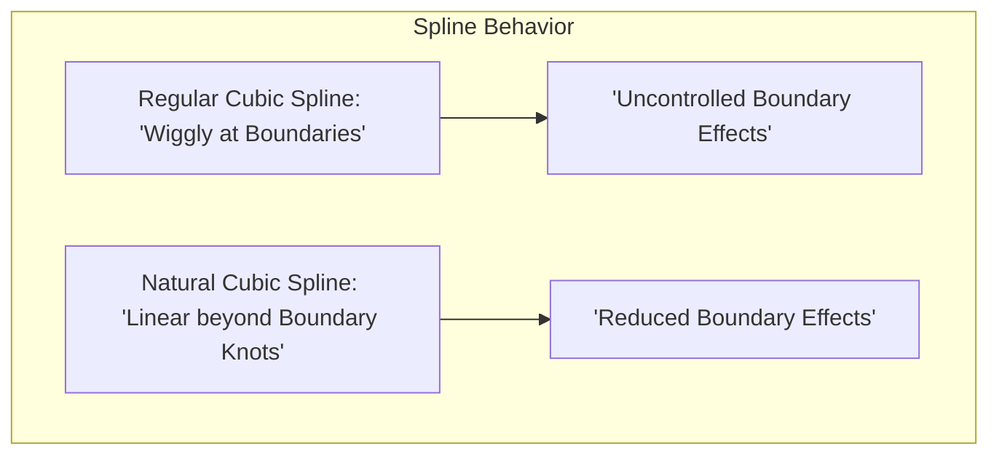
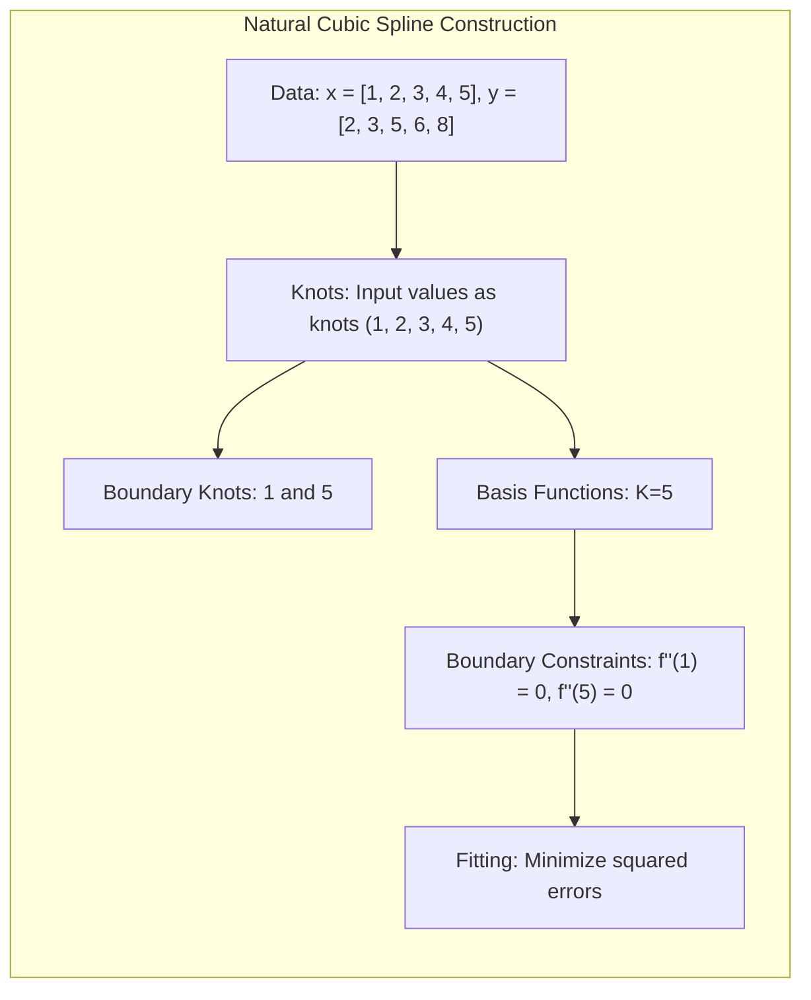
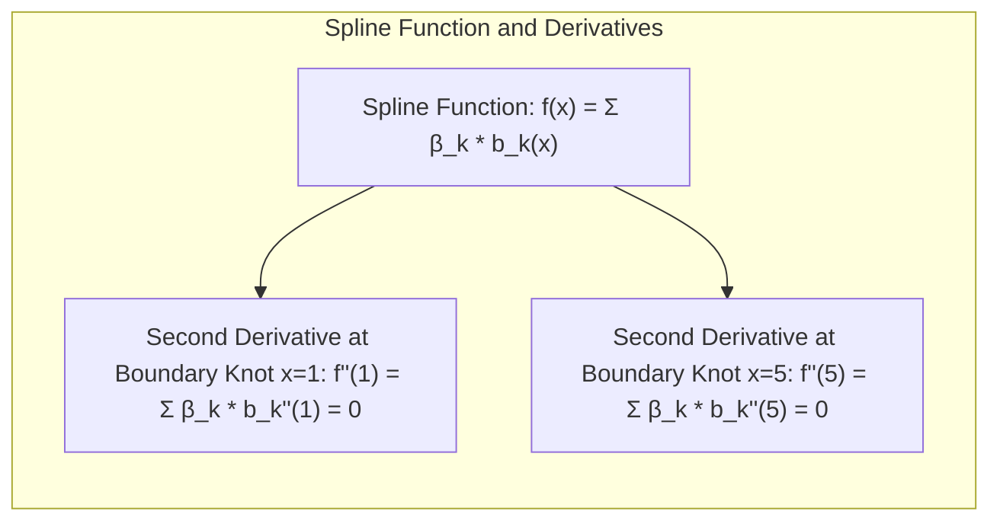
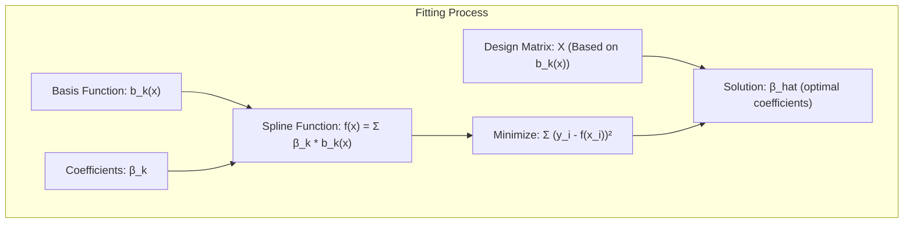

## Natural Cubic Splines: Combining Smoothness and Boundary Control



### Defining Natural Cubic Splines

**Natural Cubic Splines** are a special type of piecewise polynomial function used in statistical modeling for their excellent properties of smoothness and controlled behavior at the boundaries of the data. They are a form of cubic spline, which means they are constructed from segments of third-degree polynomials that smoothly connect at points known as *knots*. The "natural" aspect comes from adding further constraints, specifically that the second derivative of the spline is equal to zero at the *boundary knots*, the extreme values of the data. This implies that the function becomes linear beyond the range of the input data, hence the name "natural". These constraints lead to a function that is smoother and that is more controlled at the extremes of the data, which is useful when the true relationship is expected to be close to linear outside the observed range. Importantly, natural cubic splines are a popular choice for *basis expansions*, providing a set of basis functions that capture non-linearities in data in a smooth and stable manner [^5.2.1].

> 💡 **Exemplo Numérico:**
>
> Consider a dataset with input values $x = [1, 2, 3, 4, 5]$ and corresponding output values $y = [2, 3, 5, 6, 8]$. We want to fit a natural cubic spline to this data.



> 1. **Knots:** Let's use the input values themselves as knots.  The boundary knots are therefore $1$ and $5$.
> 2. **Basis Functions:** For a natural cubic spline with $K$ knots, we'll have $K$ basis functions. Here, we have $K=5$ knots, and the general form of the basis functions is a bit complex, but for the sake of illustration, we'll focus on the boundary constraints.
> 3. **Boundary Constraints:**  At the boundary knots ($x=1$ and $x=5$), the second derivative of the spline must be zero.  This enforces linearity beyond the extreme knots.



> 4. **Fitting:** The spline is fit by finding coefficients for each basis function that minimize the sum of squared errors between the predicted and actual $y$ values.  This involves setting up a design matrix based on the chosen basis and solving a linear system.
>
>   Let's illustrate the concept by assuming that we've already computed the basis functions, and we are focusing on boundary behavior, we can express the spline as:
>   $f(x) = \sum_{k=1}^{5} \beta_k b_k(x)$, where $b_k(x)$ are the basis functions and $\beta_k$ are the coefficients.
>   The natural spline constraints mean that the second derivative of $f(x)$ is 0 at $x=1$ and $x=5$.
>
>   To illustrate the effect of boundary constraints on the spline, we can calculate the second derivative of the spline at boundary knots. Suppose, we have the spline function $f(x)$ with some obtained parameters. The second derivative of the spline at the first knot $x=1$ can be expressed as:
>
>   $f''(1) = \sum_{k=1}^{5} \beta_k b_k''(1) = 0 $
>
>   And similarly, for the second boundary knot $x=5$:
>
>   $f''(5) = \sum_{k=1}^{5} \beta_k b_k''(5) = 0 $
>
>   These conditions are what make the spline "natural." They force the spline to behave linearly outside of the data range.



>   We can use Python to fit a natural cubic spline:
>
> ```python
> import numpy as np
> import matplotlib.pyplot as plt
> from patsy import dmatrix
>
> # Sample Data
> x = np.array([1, 2, 3, 4, 5])
> y = np.array([2, 3, 5, 6, 8])
>
> # Create a design matrix for the natural cubic spline
> # The 'bs' function from patsy creates the spline basis
> # 'df=4' specifies the degree of freedom (number of basis functions - 1)
> X = dmatrix("bs(x, knots=(2,3,4), degree=3, include_intercept=False)", {"x": x})
>
> # Fit a linear model
> # We use numpy's least squares function to fit the model
> # The resulting coefficients beta_hat are the optimal values that minimize the error
> beta_hat = np.linalg.lstsq(X, y, rcond=None)[0]
>
> # Generate points for plotting the fitted spline
> x_plot = np.linspace(0, 6, 100)
> X_plot = dmatrix("bs(x_plot, knots=(2,3,4), degree=3, include_intercept=False)", {"x_plot": x_plot})
> y_plot = np.dot(X_plot, beta_hat)
>
> # Plot the data points and the fitted spline
> plt.figure(figsize=(8, 6))
> plt.scatter(x, y, label='Data Points', color='blue')
> plt.plot(x_plot, y_plot, label='Natural Cubic Spline', color='red')
> plt.xlabel('x')
> plt.ylabel('y')
> plt.title('Natural Cubic Spline Fit')
> plt.legend()
> plt.grid(True)
> plt.show()
>
> print("Fitted Coefficients:", beta_hat)
> ```
>
> 5. **Interpretation:** The plot visualizes how the fitted natural cubic spline goes through the data points. We can see that the spline is smooth within the range of the data and becomes linear beyond the boundary knots (1 and 5). The `beta_hat` gives the coefficients for each basis function, which define the shape of the spline.
>
>   The printed coefficients `beta_hat` correspond to the $\beta_k$ values. These values define how much each basis function contributes to the overall spline curve. The specific values will depend on the data and the chosen knots, and they are determined by the fitting process that minimizes the error between the spline and the observed data points. The visualization shows the curve that results from combining the basis functions with their fitted coefficients, illustrating the smooth and controlled nature of the natural cubic spline.

[^5.2.1]: "A natural cubic spline adds additional constraints, namely that the function is linear beyond the boundary knots." *(Trecho de <Basis Expansions and Regularization>)*
