## The Smoother Matrix Sλ: Mapping Data to Fitted Values

```mermaid
graph LR
    subgraph "Smoother Matrix Operation"
        direction LR
        Y["Input Data: y"] -- "Linear Transformation Sλ" --> f_hat["Fitted Values: f̂"]
        f_hat -- "Represents" --> "Smoothed Representation of y"
    end
```

### Defining the Smoother Matrix Sλ

The **smoother matrix** $S_\lambda$ is a crucial concept in the context of smoothing splines. It represents a linear operator that directly maps the observed response values ($y$) to the fitted values ($\hat{f}$), in the framework of penalized residual sum of squares minimization. In the context of smoothing splines, given data $y$, we want to find a function $f(x)$ that balances fitting to the data and smoothness. Mathematically, we aim to minimize the penalized RSS criterion:

$$
RSS(f, \lambda) = \sum_{i=1}^N (y_i - f(x_i))^2 + \lambda \int [f''(t)]^2 \, dt
$$
As demonstrated in the text, the solution that minimizes this equation is given by:
$$
\hat{f} =  S_\lambda y
$$
The matrix $S_\lambda$ is known as the smoother matrix, because it is a linear operator that maps the data y to a smoothed function. The matrix $S_\lambda$ is constructed based on the data locations and the chosen smoothing parameter $\lambda$, but is independent of the response data itself. It's a square matrix of size $N \times N$, where $N$ is the number of data points. It essentially encapsulates the entire smoothing operation into a single linear transformation, allowing us to understand and analyze its properties. It should be emphasized that, unlike a basis matrix, the smoother matrix $S_\lambda$ is specific to a single dataset, and its properties are dictated by the location of the features in the dataset and the value of $\lambda$. This linear transformation highlights that smoothing splines are a *linear smoother*.

```mermaid
graph LR
    subgraph "Penalized RSS Minimization"
        direction TB
        A["Objective: Minimize RSS(f, λ)"]
        B["RSS Term: ∑(yᵢ - f(xᵢ))²"]
        C["Penalty Term: λ∫[f''(t)]² dt"]
        A --> B
        A --> C
    end
```

```mermaid
graph LR
    subgraph "Smoother Matrix Properties"
        direction LR
        A["Smoother Matrix Sλ"]
        A --> B["Size: N x N"]
        A --> C["Constructed based on data locations and λ"]
        A --> D["Independent of response data y"]
        A --> E["Linear Operator"]
    end
```





> 💡 **Exemplo Numérico:**
>
> Let's consider a simplified example with a small dataset to illustrate how the smoother matrix $S_\lambda$ operates. Suppose we have 5 data points with corresponding x and y values:
>
> ```python
> import numpy as np
>
> x = np.array([1, 2, 3, 4, 5])
> y = np.array([2.1, 3.9, 6.1, 8.2, 12.3])
> ```
>
> For simplicity, let's assume that we have already constructed the smoother matrix $S_\lambda$. In a real scenario, this matrix would be derived from the data and the chosen $\lambda$. For this example, let's assume the smoother matrix $S_\lambda$ is:
>
> ```python
> S_lambda = np.array([
>    [0.6, 0.2, 0.1, 0.05, 0.05],
>    [0.2, 0.5, 0.2, 0.1, 0.0],
>    [0.1, 0.2, 0.4, 0.2, 0.1],
>    [0.05, 0.1, 0.2, 0.5, 0.15],
>    [0.05, 0.0, 0.1, 0.15, 0.7]
> ])
> ```
>
> The fitted values $\hat{f}$ are then computed as:
>
> ```python
> f_hat = np.dot(S_lambda, y)
> print(f_hat)
> ```
>
> This gives us:
>
> ```
> [ 4.09   5.07  6.55  8.865 11.175]
> ```
>
> Thus, the fitted values, $\hat{f}$, are a linear transformation of the original y values. The values in the $S_\lambda$ matrix determine how much each observed $y_i$ influences each fitted value $\hat{f_i}$. For instance, the first fitted value (4.09) is influenced most by the first observed value (2.1), but also by the others, with decreasing weights as we move away from the diagonal. This is how the smoothing is achieved.
>
> **Interpretation:**
>
> The fitted values are not exactly the same as the original data points, but they represent a smoothed version of the data. The smoothing process is controlled by the matrix $S_\lambda$. The specific values in $S_\lambda$ are determined by the data locations and the smoothing parameter $\lambda$. A higher $\lambda$ would lead to more smoothing, which would be reflected in $S_\lambda$ having smaller values away from the main diagonal.

```mermaid
graph LR
    subgraph "Sλ Matrix Multiplication"
        direction LR
        S_lambda["Smoother Matrix: Sλ"] -- "Matrix Multiplication" --> f_hat["Fitted Values: f̂"]
        y["Input Data: y"] -- "Multiplied with" --> S_lambda
    end
```

```mermaid
graph LR
    subgraph "Effect of Smoothing Parameter λ"
        direction LR
        lambda_low["Low λ"] --> smooth_less["Less Smoothing in Sλ"]
        lambda_high["High λ"] --> smooth_more["More Smoothing in Sλ"]
    end
```





> **Key Takeaway:**
> The smoother matrix $S_\lambda$ is a linear operator that takes the observed response values $y$ and transforms them into fitted values $\hat{f}$, providing a smoothed representation of the data. The example shows how the matrix multiplication results in a smoothed version of the input data.

[^5.4.1]: "A smoothing spline with prechosen λ is an example of a linear smoother (as in linear operator). This is because the estimated parameters in (5.12) are a linear combination of the yi. Denote by f the N-vector of fitted values f(xi) at the training predictors xi. Then" *(Trecho de <Basis Expansions and Regularization>)*
