## Mathematical Properties of the Smoother Matrix $S_\lambda$: Symmetry, Positive Semi-Definiteness, and Eigen-decomposition

```mermaid
graph LR
    subgraph "Smoother Matrix Decomposition"
        direction TB
        A["Data Y"] --> B["Eigenvector Decomposition (V)"]
        B --> C["Scaling by Eigenvalues (Λ)"]
        C --> D["Recombination"]
        D --> E["Fitted Values (SλY)"]
        style A fill:#f9f,stroke:#333,stroke-width:2px
        style E fill:#ccf,stroke:#333,stroke-width:2px
    end
    linkStyle 0,1,2,3 stroke:#333,stroke-width:2px;
```

### Symmetry of the Smoother Matrix

The smoother matrix $S_\lambda$ is a **symmetric matrix**. This property arises directly from the nature of the penalized RSS criterion and the optimization process that leads to the smoother matrix. The fitted values from a smoothing spline can be expressed as:

$$
\hat{f} = N(N^T N + \lambda \Omega_N)^{-1} N^T y
$$

where $N$ is the basis matrix derived from the spline functions and $\Omega_N$ is the penalty matrix related to the integral of the second derivative of the spline. It should be noted that the smoother matrix $S_\lambda$ is defined by:

$$
S_\lambda = N(N^T N + \lambda \Omega_N)^{-1} N^T
$$

We can see that if we transpose the smoother matrix $S_\lambda$ above, and using the fact that the transpose of a product of matrices is the product of the transposes of the matrices in the reverse order, we obtain:

$$
S_\lambda^T = (N(N^T N + \lambda \Omega_N)^{-1} N^T )^T= N((N^T N + \lambda \Omega_N)^{-1})^T N^T
$$

```mermaid
graph LR
    subgraph "Symmetry of Sλ"
        direction LR
        A["Sλ = N(NTN + λΩN)⁻¹NT"]
        A --> B["(Sλ)T = (N(NTN + λΩN)⁻¹NT)T"]
        B --> C["(Sλ)T = N((NTN + λΩN)⁻¹)T NT"]
        C --> D["(NTN + λΩN) is symmetric"]
        D --> E["(NTN + λΩN)⁻¹ is symmetric"]
        E --> F["(Sλ)T = N(NTN + λΩN)⁻¹ NT = Sλ"]
    end
```

Note that $N^T N$ and $\Omega_N$ are symmetric matrices, and the inverse of a symmetric matrix is also symmetric. Therefore we have:
$$
(N^T N + \lambda \Omega_N)^{-1})^T = (N^T N + \lambda \Omega_N)^{-1}
$$
which leads to
$$
S_\lambda^T = N(N^T N + \lambda \Omega_N)^{-1} N^T = S_\lambda
$$
Therefore, this expression demonstrates that $S_\lambda$ is, indeed, a symmetric matrix, since $S_\lambda = S_\lambda^T$. The symmetry of $S_\lambda$ has important implications for its eigen-decomposition, as we'll see later.

> 💡 **Exemplo Numérico:**
> Let's illustrate the symmetry of $S_\lambda$ with a simplified numerical example. Suppose we have a basis matrix $N$ and a penalty matrix $\Omega_N$, and we choose a value for $\lambda$. For simplicity, let's assume:
>
> $$
> N = \begin{bmatrix} 1 & 2 \\ 3 & 4 \\ 5 & 6 \end{bmatrix}, \quad \Omega_N = \begin{bmatrix} 2 & 1 \\ 1 & 3 \end{bmatrix}, \quad \lambda = 0.5
> $$
>
> First, we compute $N^T N$:
>
> $$
> N^T N = \begin{bmatrix} 1 & 3 & 5 \\ 2 & 4 & 6 \end{bmatrix} \begin{bmatrix} 1 & 2 \\ 3 & 4 \\ 5 & 6 \end{bmatrix} = \begin{bmatrix} 35 & 44 \\ 44 & 56 \end{bmatrix}
> $$
>
> Then, we compute $\lambda \Omega_N$:
>
> $$
> \lambda \Omega_N = 0.5 \begin{bmatrix} 2 & 1 \\ 1 & 3 \end{bmatrix} = \begin{bmatrix} 1 & 0.5 \\ 0.5 & 1.5 \end{bmatrix}
> $$
>
> Next, we compute $N^T N + \lambda \Omega_N$:
>
> $$
> N^T N + \lambda \Omega_N = \begin{bmatrix} 35 & 44 \\ 44 & 56 \end{bmatrix} + \begin{bmatrix} 1 & 0.5 \\ 0.5 & 1.5 \end{bmatrix} = \begin{bmatrix} 36 & 44.5 \\ 44.5 & 57.5 \end{bmatrix}
> $$
>
> Now, we find the inverse of $(N^T N + \lambda \Omega_N)$:
>
> $$
> (N^T N + \lambda \Omega_N)^{-1} \approx \begin{bmatrix} 0.639 & -0.495 \\ -0.495 & 0.401 \end{bmatrix}
> $$
>
> Now we calculate $S_\lambda$:
>
> $$
> S_\lambda = N(N^T N + \lambda \Omega_N)^{-1} N^T = \begin{bmatrix} 1 & 2 \\ 3 & 4 \\ 5 & 6 \end{bmatrix} \begin{bmatrix} 0.639 & -0.495 \\ -0.495 & 0.401 \end{bmatrix} \begin{bmatrix} 1 & 3 & 5 \\ 2 & 4 & 6 \end{bmatrix}
> $$
>
>
> $$
> S_\lambda \approx \begin{bmatrix} -0.351 & -0.071 & 0.209 \\ -0.071 & 0.122 & 0.315 \\ 0.209 & 0.315 & 0.419 \end{bmatrix}
> $$
>
> Finally, we check if $S_\lambda$ is symmetric by comparing it to its transpose:
>
> $$
> S_\lambda^T \approx \begin{bmatrix} -0.351 & -0.071 & 0.209 \\ -0.071 & 0.122 & 0.315 \\ 0.209 & 0.315 & 0.419 \end{bmatrix}
> $$
>
> As we can see, $S_\lambda = S_\lambda^T$. This numerical example confirms the theoretical proof that the smoother matrix $S_\lambda$ is indeed symmetric.

[^5.4.1]: "Again the fit is linear in y, and the finite linear operator Sy is known as the smoother matrix" *(Trecho de <Basis Expansions and Regularization>)*
